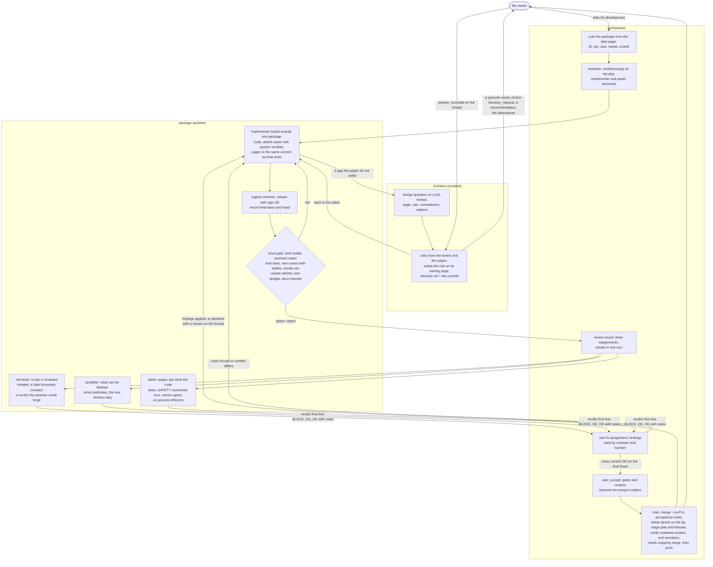

# How Redoubt is built

Redoubt is built by a small swarm of AI agents under one human owner, run in Wash. Work is cut
into **packages**; each package has one implementer and a panel of read-only reviewers, a resident
Architect answers design questions, and an orchestrator plans, integrates and merges. This page
is the process: the roles, what a package is, how one runs and is accepted, and how questions are
decided. The Wash setup itself is in [PROJECT.md](PROJECT.md). The [tenets](../docs/TENETS.md)
outrank this page, and the owner's instructions in a session outrank it too.

Process material lives in `.wash/` and nowhere else: package IDs, thread names and review rounds
never appear in [the book](../docs/README.md), which describes the system; its provenance is in
git and in this directory.

## What is recorded where

One definition of each thing. The book states the rules, the plan and what is built; Wash records
only what exists nowhere else, and links to the book for the rest.

| What | Where | Written by |
| --- | --- | --- |
| the rules, each milestone's goal and remaining work, what is built | [the book](../docs/README.md) | the implementer, the Architect |
| the order of the work, and its state | the plan graph, `.wash/plan.toml` | Wash, through `plan_set` and `plan_accept` |
| the discussion behind a decision | `.wash/qa/<thread>.md`, one file per thread, kept for good | Wash |
| a package's acceptance evidence | the trailers on its merge commit, from `plan_accept` | Wash, committed by the orchestrator |
| handoffs, briefs, reports, scratch | `.wash/local/`, never on `main`; saved to the `wash-local` branch ([saving and resuming](#saving-and-resuming)) | members |

A plan node's body is a link to its plan step or its `docs/todo/` pages, never a restatement of
them, and a resolved thread ends with a link to the page where its rule was written.

## Roles

| Role | Tier | Job |
| --- | --- | --- |
| Orchestrator | frontier | plans the work in the plan graph, launches and ends package members, integrates and merges one package at a time; never implements |
| Architect | frontier | the resident design authority: answers design questions from the pages, records owner decisions, applies accepted rules to the owning page |
| Implementer | workhorse | builds exactly one package in its own worktree and branch |
| Red team | workhorse | reviews a package for a way to break it: a rule or invariant violated, a label or capability bypassed, an attack case whose verdict could be forged |
| Simplifier | light | reviews for what can be deleted or made simpler without losing a rule, and for any growth of the trusted computing base the pages did not require |
| Editor | light | checks that the code and the pages it cites agree, that every `SAFETY:` justification is true of the code, that names and paths are spelled the same everywhere, and that comments and pages keep the book's voice, vocabulary and links with no process leftovers |

**Tiers** name what a member is for. They map to Wash catalog slots; the owner chooses the
catalog in Wash, where providers, model IDs, connections and effort settings live. Redoubt does
not pin those choices. Use the least expensive slot capable of the assignment.

| Tier | Catalog slot | Work |
| --- | --- | --- |
| `frontier` | `frontier` | architecture, difficult design decisions and orchestration |
| `workhorse` | `coding` | implementation and red-team review |
| `light` | `small` | bounded editing and simplification review |

Kernel changes and merge reviews need careful reasoning: use the coding slot's configured
effort, or an offered higher setting when the task needs it. Escalate to `frontier` when the
work exceeds that slot's capability. The launch report names the resolved settings;
[PROJECT.md](PROJECT.md#models-and-catalogs) covers selection and switching.

### The orchestrator

- Owns the plan graph: the packages, their order (`needs`) and their state, cut from the
  milestone's remaining work on its plan page, starting with
  [M1 (separation and containment)](../docs/plan/m1-separation.md#remaining-work).
- Once the owner has asked for development, starts a package when every node it needs is done,
  in its own worktree
  (`.worktrees/<package>`) and branch (`wp-<package>`). Wash refuses an earlier start unless the
  call gives an override, which it records on the node.
- Sizes the review panel to the risk ([running a package](#running-a-package)) and keeps the same
  reviewers through every round of one package.
- Rules on a member's question itself when the pages settle it or a recommendation is clear, and
  flags any answer that would open an insecure or complex door. Asks the Architect when a package
  meets a design decision the pages do not settle, and never lets an implementer guess.
- Escalates to the owner only a genuine owner choice, and stops only the work that depends on it.
- Merges; implementers commit on their own package branch and reviewers commit nothing.
- Bounds every task it hands out: what to read (a reading list, not "the book"), how many tool
  calls before the first written result, and what to return. Context is the cost: a member that
  reads broadly before writing hands off before it has written anything.
- Answers the owner's status questions from `plan_get`; if the plan does not explain what is
  happening, the plan is wrong, and it fixes the plan first.

### The Architect

- Resident for the whole workspace, one session, reused for every question so its context stays
  warm. Given the package, the page and rule involved, the exact contradiction and the candidate
  options with their consequences, so it re-derives as little as possible.
- Cites a settled rule directly; reopens nothing settled.
- For an open question it can answer from the tenets and the pages, it answers, writes the rule on
  its owning page, and names the follow-up package if code must change.
- For a genuine owner choice, it asks the owner with a recommendation and the real alternative,
  and keeps the dependent work blocked until the owner answers. A recommendation is never an
  approval.
- Edits pages, not code or tests. Source wins for current behaviour: a page that disagrees with the
  code is a finding, reported, not hidden.
- May add and edit plan nodes that have not started; only the orchestrator moves a started one.

### The implementer

Builds exactly one package and nothing else, and does not break these rules:
1. **One package, one worktree, one branch.** No other package's files.
   Do not spawn helper agents; the orchestrator assigns the work and review panel.
2. **Stage only the paths the package delivers,** and commit them on the package branch in small
   groups: never more than about 50K tokens of uncommitted work, never `git add -A` or
   `git commit -a`, never git against the shared checkout. Reviewers read the branch's commits.
   Every file committed was read in full by the member that commits it; helper sub-agents draft
   nothing that is reviewed.
3. **The design is read-only.** A contradiction, a gap, or a decision the pages do not settle is
   reported as a blocking question naming the page, the rule and the options, never improvised.
4. **No undocumented `unsafe`,** and the ratchet only falls
   ([the unsafe budget](../docs/testbench.md#the-unsafe-budget)).
5. **rv32 keeps compiling:** the kernel, the loader, `redoubt-sys`, `redoubt-rt` and the servers.
6. **Every behaviour lands with its test.** A security property lands with an attack case whose
   verdict comes from the system, never from the attacker
   ([rule F](../docs/testbench.md#rule-f-trusted-verdicts)); a bug fix lands with the test that
   would have caught it.
7. **The real harness.** Run the package's cases and the focused tests with `cargo testbench`, and
   report the exact commands and exit codes.
8. **Rust and formatting,** per [CONTRIBUTING.md](../CONTRIBUTING.md#formatting).
9. **The pages move with the code.** A section the package builds goes from planned to built in
   the same commit as the tests its status line names; an Open item the package decides leaves
   the page in that commit; a rule the code departs from is written as the rule, with the
   departure as a residual and a follow-up ([lock step](#the-pages-move-with-the-code)).
10. **A clean branch at acceptance.** Before the merge the implementer rebuilds its branch into
    logical commits, each with a clean message ([commits](#staging-commits-and-handoffs)): no
    WIP, fix-round or review-label commits reach the main history.

It reports: what was delivered and the paths changed; the tests run, with exit codes, and each new
attack case with why its verdict comes from the system; the tier-required gates (for Tier A, the short gate,
including the `unsafe` count, both builds and the smoke set), explicitly identifying checks not run;
the documentation check; design problems found; open risks; the branch and state; the next step.

### Reviewers

One angle each, read-only: a reviewer reports findings and edits, creates and stages nothing.
Do not spawn helper agents; report the assigned review yourself.

- **Scoped to the diff.** Only concrete, current issues the diff causes or makes reachable, each
  backed by the source, a test or reproduction, or a contradiction with a page. The diff includes
  its untracked files: a reviewer lists them as well as the staged and unstaged changes.
  Documentation review includes unchanged summaries whose claims the diff affects
  ([the pages move with the code](#the-pages-move-with-the-code)).
- **Name the evidence.** Each review records the base and head commit IDs and the paths checked.
  Uncommitted work may be reviewed during development; acceptance requires a clean, committed
  branch and verdicts covering its final content ([acceptance](#acceptance)).
- **Bounded.** The first finding within about 15 tool calls, the verdict within about 30. Read the
  diff or range given, the pages it cites and, for the red team, the rules it claims to keep; not
  the whole book, other branches or unrelated history. Include the affected summaries even when
  the assignment omitted them. One question and a few named files per task: a
  compound question gets its first part answered and the rest named out of scope.
- **A finding** is exactly: the file and line, the concrete input, sequence or contradiction that
  triggers it, and what breaks. A claim without a mechanism is not a finding. Say **delete**
  (nothing depends on it, and what was checked), **trim** (keep the rule, cut the text) or
  **keep** (what depends on it). A residual the pages already state is noted and passed over.
- **Severity** P0, P1 or P2 on each finding, and one verdict as the **first line** of the result
  (Wash copies it into the merge commit's `Reviewed-by` trailer): `Merge verdict: BLOCK`,
  `Merge verdict: OK` or `Merge verdict: OK with notes`. `No issues found.` is a valid result.
- A reviewer completes its assignment copying the implementer, so the implementer already holds
  every finding.

## Packages

A package is a unit of work one implementer can finish and a panel can review. It is a `package`
node in the plan graph, under its milestone, and is written as:

- **ID and size:** a short ID (letters and a number, such as `K7`, `S2` or `DOC1`) and S (hundreds
  of lines), M (about 1,500) or L (larger). An ID is never a lone R, I or M followed by digits,
  which the book uses for rules, invariants and milestones.
- **Tier:** A or B ([two tiers](#two-tiers)).
- **Body:** links only: the plan step it builds and the `docs/todo/` pages it closes. Its reading
  list, owned paths, tests and acceptance cases go in the implementer's instructions, from those
  pages.
- **Needs:** the nodes that must be done first, and the QA threads that must be resolved.

### Two tiers

The tier is decided by what the code can reach, not by its language. A package is **Tier A** if
any answer is yes:
- does it hold, mint or forward a capability, or change what a budget may reach;
- does it parse input from another label set or from outside the box (a device, the network, a
  file another principal wrote);
- does it render or carry an approval;
- does it run outside one session's own budget: the kernel, the loader, the stub, the runtime
  library, the wire formats, the model, the drivers, `init`, the steward, `keyd`, `sshd`, `ipd`,
  the resolver, `gatewayd`, the bench and the checker.

Everything else is **Tier B**: code that runs inside one session's budget with that session's
authority, where a bug hurts one principal and the walls below hold. Most Elixir is Tier B: the
shell, the editor, helpers and client bindings. So is the beamlet VM's interpreter and loader:
one VM is one trust domain ([beamlet](../docs/userland/beamlet.md#limits-inside-one-vm)), so
hostile code that breaks it gains only the session's own authority. The agent harness, approval
rendering, the transfer server, and beamlet's platform boundary and the natives that hold
capabilities are Elixir or Rust and Tier A, because they answer yes above.

| | Tier A | Tier B |
| --- | --- | --- |
| Design questions | the Architect, before code | the page's Open list; the Architect only if the package decides one |
| Panel | red team, simplifier, editor; red uses the coding slot with careful reasoning | one reviewer: the red team if the diff touches any question above, else the editor |
| Tests | attack cases with system verdicts, mutations where the model covers it | host tests under beamlet, plus one end-to-end bench case |
| Rounds | its own rounds until OK | batched with other Tier B packages; merged on green with one OK |
| Gates | the full bench, rv32, the unsafe ratchet, the size budget, the docs checker | the package's cases, the docs checker |

A Tier B package that turns out to touch a question above is re-tiered, not waved through.

### The pages move with the code

Every behaviour change delivers its documentation in the same package. The docs checker refuses
a status line naming a test that does not exist, a rule cited that no page owns, and a security
register that disagrees with a page. It does not establish that prose matches the implementation.

Before review, the implementer checks the affected claims in `README.md`, `GETTING-STARTED.md`,
the current milestone's progress and remaining work, the relevant subsystem overviews and crate
READMEs, as well as the owning pages. Search for the changed feature's names and old status
claims; inspect the matching passages, not the whole book. A feature described as absent or
host-only must be reconciled when it boots on the machine. Keep built, host-tested and integrated
claims distinct.

The report names each summary checked, with either its update or why no change is needed. The
editor verifies those claims against code and test evidence, including summaries unchanged in
the diff; with a single reviewer, that reviewer owns this check. Missing affected summaries are
findings, not out of scope. The red team's checklist includes "the page says what the code now
does". The orchestrator verifies the documentation check before acceptance; any correction to
the milestone's progress is part of the reviewed content. Documentation-only repairs use the
review path below.

**Hotspots** get one writer at a time: the kernel's page tables, memory, messages, call dispatch and
architecture mapping code, the loader's verification, the bench's bundle builder, and `docs/`.
Runtime IPC and server changes are coordinated with their native callers. Generated wire code
changes only through its tables and the generator.

## Running a package

1. **Worktree.** The orchestrator makes `.worktrees/<package>` on `wp-<package>`, and launches the
   implementer and the reviewers on the package's node with it as their working directory, so the
   reviewers see the writer's diff.
2. **Design first.** If the package raises an open design question, the Architect settles it (or
   the owner decides) before any code is written.
3. **Implement,** gated on its tier's acceptance commands: Tier A runs the **short gate**
   ([integration trains](#integration-trains)); Tier B runs its cases and the docs checker. A documentation-only change runs the docs checker through
   `cargo testbench docs` and `git diff --check`, and renders the book if its pages changed. Test
   or tooling changes also run the cases that exercise them. A narrower gate does not waive a
   security-sensitive change's Tier A requirements. The whole bench runs once per train, on the
   train's tip, not per package.
4. **Review** in rounds. The panel is the package's tier ([two tiers](#two-tiers)); tests, docs,
   comments or tooling configuration alone take one reviewer, the red team for tests or the editor
   for documentation, adding the others only if the findings show more risk.

   The orchestrator creates a round's assignments together and waits for all of them. It then
   decides which findings to apply and sends one fix assignment that cites them by reviewer and
   number (for example "red 3, editor 1") rather than restating them. Each round refreshes the diff
   and the evidence; retained context is not evidence.
5. **Fix and re-review** until the verdicts are OK, or the remaining findings are recorded as
   follow-ups in `docs/todo/`.
6. **Accept** ([acceptance](#acceptance)), then **merge in a train** ([integration trains](#integration-trains)).

The whole path of a Tier A package, the kernel's and the rest of the trusted computing base's,
with every place it can be sent back:

Two things the picture cannot show. First, no box is skipped for being small: a kernel package of
sixty lines takes the same panel as one of two thousand, because the tier is decided by what the
code can reach, not by its size. Second, the loops are the point: a gate that goes red, a BLOCK,
a design gap and a miss on the rerun each send the work back to the implementer, and a package
leaves the loop only when every one of them is clear.

Review may be batched for small changes; trusted-code work gets its own round with the red team.
Review is required before merge. If recovery finds a package merged without it, keep its node
`review-due`, stop publication of that merge and further integration, and clear the debt first.

## Questions and decisions

Questions are Wash QA threads, one per question, named `<package>-<topic>`. A question opens with
the page and rule involved, the contradiction or gap, a recommendation and the evidence. Answers
carry the thread, so the question, its answers and any owner decision stay together. Only the
orchestrator, or a reviewer on the thread's node, resolves a thread, with evidence; a pending
owner decision prevents that. A thread reopens with a reason when the evidence changes.

The decision itself lives in the book, not in QA:
- An accepted rule is written on the page that owns it, with its reason beside it; a new security
  property takes the next free rule ID.
- An undecided question on a planned section is an item of that section's **Open:** list; deciding
  it removes the item and writes the rule.
- An owner decision that changes a guarantee or a wall is written on the
  [tenets](../docs/TENETS.md).
- Provenance (who decided, when, on which thread) is the thread file and the merge commit's `QA:`
  trailer. The pages carry no decision numbers and no dates.

A package is not accepted with an unresolved blocking thread. A deferred non-blocking question is
recorded on its page's Open list or as a follow-up in `docs/todo/`.

A thread body is at most 2,000 bytes; a plan, a review report or any deliverable is a file in the
worktree, and the thread holds the pointer. Wash writes each thread to `.wash/qa/<thread>.md` as
it changes; nobody edits those files, and they are committed with the merge that resolves them.

## Simplification

Simplicity is a gate, not a suggestion. The measures:
- **Size is budgeted like `unsafe`.** Each trusted crate has a line ceiling in the bench that only
  falls without a reason stated in the commit
  ([the size budget](../docs/todo/size-budget.md), planned until its case exists).
- **Every Tier A acceptance report says what was deleted.** A kernel package that adds lines and
  deletes none states why, as an `unsafe` increase must.
- **Simplifier findings are P2 by default:** each is applied, or declined on the thread with a
  reason. The simplifier asks three questions of every diff: what can be deleted, what duplicates a
  mechanism that exists, and is this the one obvious way.
- **A deletion package after each milestone,** scheduled, with a target: the last one took the
  kernel from 18,000 lines to 10,400 and `unsafe` from 54 to 44.
- **A mechanism whose page cannot state its Why in two sentences** is a candidate for removal, and
  the editor says so.

## Acceptance

A package is done only when:
- its tier's acceptance tests and attack cases pass in `cargo testbench`, each attack verdict
  from the system; the scope for documentation-only changes is in [running a package](#running-a-package);
- the docs checker finds nothing; Tier A also passes the short gate; the whole bench runs in the
  package's train ([integration trains](#integration-trains));
- no `unsafe` is undocumented and no ratchet rose without a stated reason;
- every reviewer's finding is fixed or recorded as a follow-up;
- the owning pages and affected summaries say what the code now does, with status lines naming
  the new tests and the documentation check recorded;
- no blocking question is open.

Before acceptance, fold the branch into logical commits and rebase it onto the current `main`,
including sign-off. Record that base and the final head. Run the tier's gates on this head and
obtain final review verdicts for it. If a reviewed branch changes, reviewers inspect the delta
and renew their verdicts; conflict resolutions, new base changes that affect the package, and
documentation edits all count. A rewrite changing only commit metadata may retain review and
test evidence only after the orchestrator records that the base and resulting trees are
unchanged, with the old and new commit IDs.

The orchestrator calls `plan_accept` with the reviewed head and each short-gate command and exit
code in its evidence. Wash sets the node done and returns the trailer block and the `.wash/` files
to stage; the orchestrator merges in the next train with the trailers as the message's last
paragraph and stages those files in the merge. A package whose rebase onto the train changes any
hunk of its diff returns to review first; a clean rebase keeps its review and gate evidence, and
the train's bench covers the rebased head. Verify that the merge contains the reviewed content,
with only the returned plan and QA records added; any other edit returns to review. End the
package's members after this check.

## Integration trains

The whole bench on both widths runs once per **train**, not once per package, so its cost is shared and
the pool stays free for packages being built and reviewed.

- **The short gate** is a package's evidence during implementation, for review and for
  `plan_accept`: both builds (rv64 and rv32); the host tests of every crate the package touches;
  the docs checker, `cargo fmt --check`, the size budget, the `unsafe` ratchet and the no-cruft
  gate; the package's own cases on both widths; and the **smoke set**, fixed for every package:
  `userland-boot`, `init-boot`, `bench-net-peer` and `ipc-outcomes`, on both widths. The smoke
  set stays under fifteen minutes of pool time; changing it means changing this page. Reviewers rule on the short gate's evidence.
- **A train** is the accepted packages merged `--no-ff` onto `main` in order of acceptance, oldest
  first, each rebased onto the one before it, with the whole bench run once on the train's tip
  under the shared-host rule (docs/testbench.md, "On a shared host"). A train cuts when three
  packages are accepted or six hours have passed since the first, whichever comes first; one
  train runs at a time. The train's bench, sweeps included, runs every case the plan names as a gate.
- **A train failure** that no short gate caught: the orchestrator attributes it by bisecting the
  train's merge commits (`git bisect --first-parent` over the train's merges only). The train is not yet
  published, so the offending package's merge is dropped from it, not reverted on top of it:
  the orchestrator rebuilds the train without that package and reruns its bench, and the package
  goes back to its branch for its implementer to fix and the next train to carry. A failure that depends on the host
  clock, such as a missed deadline, follows the shared-host rule: rerun alone before it counts.
- **The push** is the train's ([publishing](#publishing)); its report names the
  train, its packages in order, the cases that ran shared, and anything dropped.

## Publishing

Only the orchestrator has standing permission to push, and it pushes a train after the train's
bench ([integration trains](#integration-trains)), never a package's merge alone. A session
instruction restricting pushes overrides it; saving then leaves local commits and handoffs and
reports what is not backed up. Implementers and reviewers never push.

Before pushing `main`, fetch and inspect the complete outgoing range `origin/main..main`:
- every package merge has acceptance evidence and review covering its final content;
- every other outgoing change, including process instructions and scripts, has an appropriate
  reviewer and checks; a `plan:` snapshot alone needs the orchestrator's check against Wash and
  Git, and contains only the plan and QA records;
- the affected-summary checks are complete, commits follow the contribution rules, no WIP or
  fix-round commits enter `main`, and no unrelated files entered a merge;
- `origin/main` is an ancestor of `main`. If it is not, reconcile, retest and review the resulting
  changes before publishing; never force-push `main` without the owner's explicit rewrite approval.

Push the checked commit and verify the remote branch names it. Report the commit IDs published
and anything withheld. A push command succeeding is not review evidence. The same check applies
when `save.sh` publishes `main`; the script checks Git state, not review or documentation.

After a verified publication, remove a merged package's worktree and local and remote branch
only after checking it has no uncommitted work or commits outside `main`; preserve its handoff
and reports before removal. Saving unfinished work on `wp-` branches is a backup, not acceptance.
A rebased `wp-` branch may be pushed with `--force-with-lease` only by the orchestrator after
checking nobody else's work is on it. Never use that exception for `main`.

## Staging, commits and handoffs

- Stage by path. Never `git add -A` or `git commit -a` in a shared worktree, never stage another
  session's work, never `git stash` (the stash is shared by every worktree; set work aside with a
  WIP commit, and fold it before the merge).
- **Commits follow [CONTRIBUTING.md](../CONTRIBUTING.md#commits).** What is agent-only: a
  package's merge commit carries the trailers `plan_accept` returns (`Plan-Node`, `QA`, `Gates`
  and `Reviewed-by`), the one place process names appear; and the orchestrator adds the owner's
  sign-off at merge (`git rebase --signoff` on the branch, `git commit -s` on the merge).
- `.wash/plan.toml` and `.wash/qa/` are committed only with a package's merge, or in one `plan:`
  commit when the work is saved ([saving and resuming](#saving-and-resuming)), parked or ended.
  Nothing else commits them.
- **Push after a train's bench or a saved `plan:` commit** only after the [publishing](#publishing) check.
  Save unfinished work on its `wp-` branch, with WIP commits if mid-step; fold them before final
  review. Follow the same publishing rules for branch cleanup and rebased branches.
- **Handoff** at `context_warn` of the member's reported context capacity (currently 70%; never
  assume a fixed token count from its model name). If capacity is unavailable, use bounded
  assignments and hand off at task checkpoints before context becomes a problem. The
  member finishes and commits its current step, writes its handoff with `member_update {handoff}`
  (state, next steps, traps, open questions; Wash keeps it in `.wash/local/`, out of git), reports
  and stops. The orchestrator ends it and launches a fresh member with `handoff_from`, and a
  reading list of one example of the work and the entries for its next step: never the whole plan.
  A reviewer hands off between rounds, never during one.
- A member never ends a turn without a report or a waiting status, and never polls.

## Saving and resuming

The work is saved so it can stop at any moment and continue from another clone. Everything that
must survive is on origin: `main` (the merged work, the plan and the QA threads), one `wp-`
branch per package in progress, and the `wash-local` branch (`.wash/local/`: briefs, reports,
rulings, handoffs and the bench's helper scripts). Two things are not in git and do not travel:
the live Wash workspace (members, assignments, the inbox), which is rebuilt from the plan and the
handoffs, and conversational memory. The orchestrator writes everything needed to resume into
its own handoff in `.wash/local/`; another agent must be able to continue without the conversation.

**Saving** (when the owner asks, before a pause, and at the end of every working day):
1. Stop issuing assignments, launching packages and merging. Ask working members to stop at a
   safe checkpoint, commit their work by path on their package branches (WIP is allowed), and
   register handoffs with state, exact commits, tests, unresolved findings and next steps.
   A waiting member confirms nothing is in flight. An interrupted test is recorded as incomplete.
2. Confirm every member has stopped writing, then pause the members and check their status.
   Reconcile the plan and QA records with the branches. The orchestrator writes its own handoff:
   active packages and worktrees, member handoff paths, reviewed and tested commits, pending
   decisions, uncertain deliveries, next actions, and any work not saved. Verify worktrees are
   clean or report explicitly what could not be committed; nothing is stashed. Do not snapshot
   while a writer can still change the files. If the owner requires an immediate stop, pause
   first and record unfinished checkpoints rather than continuing development.
3. Apply the [publishing](#publishing) check. `.wash/save.sh` commits `.wash/plan.toml` and
   `.wash/qa/` on `main` as one `plan:` commit if they changed, pushes `main` and every `wp-`
   branch (fast-forward only; it refuses a dirty
   worktree or a diverged branch), and snapshots `.wash/local/`'s working files onto
   `wash-local` (files under a megabyte; console captures and logs stay behind). Run it with
   `--dry-run` first to see what it will do.
4. Verify the saved remote heads for `main`, each unfinished package and `wash-local`. The
   orchestrator reports the commits saved locally and remotely, members' paused state, and any
   refused, excluded or unsaved work. A partial save is reported as partial. For a project pause,
   leave the workspace paused; end it only when the owner requests teardown.

**Resuming from a clone** (or a stale checkout):
1. Inspect local work and any live writers as [startup](PROJECT.md#set-up) requires before
   restoring. `.wash/restore.sh` fast-forwards `main`, restores `.wash/local/` from `wash-local` (never
   over a newer file), and makes a worktree at `.worktrees/<package>` for every unmerged
   `wp-` branch on origin.
2. The machine is prepared as [PROJECT.md](PROJECT.md#environment-preflight) says, and the
   orchestrator sets up the workspace ([PROJECT.md](PROJECT.md#set-up)).
3. Read the orchestrator's handoff and reconcile each package's branch, handoff, reviews and
   tests before resuming. Reuse paused members where possible; otherwise launch fresh members
   with their saved handoffs. Resume development only when the owner asks. WIP commits are
   preserved until the implementer folds them before final review.

## Cost

- Every call re-sends a member's whole context, so reading is the cost. A member reads what its
  assignment lists, and derives by grep where it can; a lead that must know a set of pages reads
  their headings and status lines, not their bodies.
- Test output fills context. Filter or tail bench and cargo output to the verdict and the failing
  lines; never read a whole log.
- Repeat a case about five times to confirm a result; twenty only when chasing a flake.
- Expensive tests run sparingly: the `consoled` flood test runs once per round, in loops of at most
  twenty.
- Build artefacts, caches and logs stay on the project root's filesystem.
