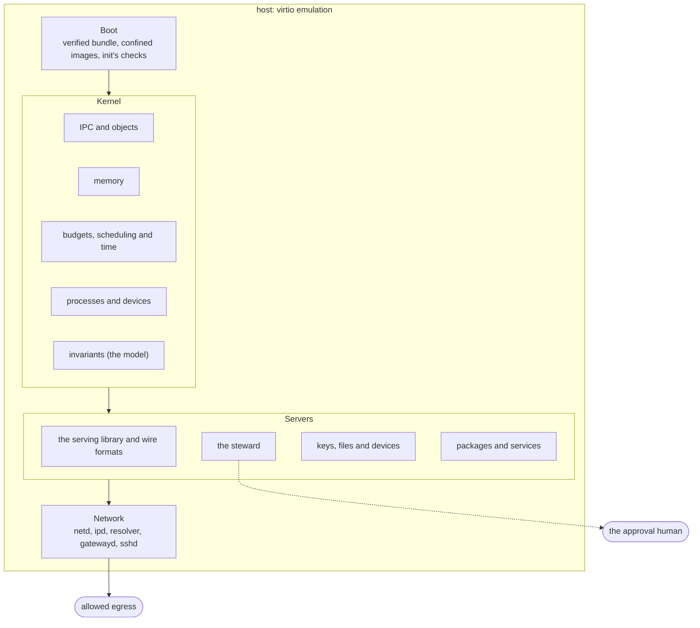

# The security register

This is where an audit of Redoubt starts. Every security property the book claims is one row
below: what it is, the rule that states it, the code that enforces it, the tests that attack it,
whether it is built, and what it leaves open. Nothing else is claimed. The rules are defined on
the pages that own them; this register is derived from those pages, and the docs checker holds
it to them ([the test bench](testbench.md#the-docs-checker)). The guarantees the rules add up to,
and the walls they rest on, are on [the tenets](TENETS.md).

## How to audit

1. **Start from a guarantee** on [the tenets](TENETS.md#guarantees): capability closure, label
   non-interference, human control. Each names the rules it rests on.
2. **Find the rule's row.** The Rule column links the section that defines it; read that section
   whole. It states the rule, says why, and opens with its status line. For example,
   [R1 (flow)](kernel/ipc.md#r1-flow) is the kernel's half of label non-interference, and
   [I7 (every flow obeys R1)](kernel/invariants.md#i7-every-flow-obeys-r1) is the model's check
   of it after every step.
3. **Read the enforcing code.** The Enforced in column names the files where the rule is kept.
   The kernel's files are small enough to read in full; each cites the rules it keeps.
4. **Read the tests that attack it.** A `bench:` test is `tests/<name>.toml`, a boot under QEMU
   whose verdict comes from a party the attacker cannot impersonate
   ([rule F](testbench.md#rule-f-trusted-verdicts)); a `host:` test is a Rust test in that crate; a
   `mutation:` is the rule deliberately broken in the model, which its checks must catch
   ([the model](kernel/model.md)); a `fuzz:` test is a fuzz target.
5. **Read what is left open.** "Built, partly tested" means the section's status line names what
   no test attacks yet; the Residual risks column names what the rule does not stop, and links the
   page's full list.

Status reads the same as on the pages ([reading this book](README.md#written-as-if-complete)):
**built** (every claim attacked by the tests listed), **built, partly tested** (the gap is on the
page), or **planned** for a named milestone, with nothing built yet.

## The walls

The rows fall into groups, one per wall of the prison. From outside in: the boot chain that
decides what runs, the kernel that separates processes, the servers that separate principals, and
the network that is the way out. Four walls are not the OS's own: they are named, with what rests
on them, [below](#residual-risks-by-wall).

*Figure: the register's row groups as walls, outermost first. Solid lines are built, dashed
lines planned. Side channels cross every box and are listed below.*

## The register

| Property | Rule | Enforced in | Tested by | Status | Residual risks |
| --- | --- | --- | --- | --- | --- |
| **Kernel: IPC and objects** | | | | | |
| Information flows between two `user` budgets only if their label sets are equal; `system` budgets check labels themselves | [R1 (flow)](kernel/ipc.md#r1-flow) | `kernel/src/message.rs`, `kernel/src/budget.rs`, `kernel/src/process.rs` | bench:process-attack, bench:process-review, mutation:R1SkipLabelCheck, mutation:R1ChecksReceiverNotOwner, mutation:R1ExitNoticeIgnoresLabels, mutation:R1UsageIgnoresLabels | built, partly tested | System-class servers are trusted to check labels ([more](kernel/ipc.md#residual-risks)) |
| Blocked senders are served in turns per (account, label set), so one principal cannot crowd out another at an endpoint | [R2 (fair waiting)](kernel/ipc.md#r2-fair-waiting) | `kernel/src/endpoint.rs`, `kernel/src/message.rs` | bench:redoubt-ipc, mutation:R2FifoAcrossAccounts, mutation:R2NoWaitCap, mutation:R2KeyByAccountOnly, mutation:R2KeyByStampLabels, mutation:R2SystemCallersShareGroup | built, partly tested | Turns between groups are attacked only in the model ([more](kernel/ipc.md#residual-risks)) |
| A lend is the caller's own writable RAM, unmapped from it while lent, and an abandoned call's lend stays with the server until it replies | [R3 (lends and abandoned calls)](kernel/ipc.md#r3-lends-and-abandoned-calls) | `kernel/src/message.rs`, `kernel/src/ptable.rs` | bench:redoubt-revoke, bench:timeouts, bench:ipc-outcomes, bench:uaf-lent-page, bench:process-lifecycle, mutation:R3UnmapAbandonedLend, mutation:R3ChargeStaysWithCaller, mutation:AbandonNoticeMissing, mutation:AbandonNoticeRepeated | built | A server pays for the calls it holds ([more](kernel/ipc.md#residual-risks)) |
| A message is delivered only if the receiver's budget can pay for everything it brings | [R4 (delivery)](kernel/ipc.md#r4-delivery) | `kernel/src/message.rs`, `kernel/src/handle.rs` | bench:redoubt-ipc, bench:redoubt-dead, bench:redoubt-tight, mutation:R4IgnoreMaxTransfer, mutation:R4OverdrawOnDelivery, mutation:IpcDropPartial | built | `Refused` and `Busy` are signals ([more](kernel/ipc.md#residual-risks)) |
| An open call costs the receiver a page and counts against its limit of open calls | [R4a (open calls)](kernel/ipc.md#r4a-open-calls) | `kernel/src/message.rs`, `kernel/src/budget.rs` | bench:redoubt-ipc, mutation:R4aOpenCallsPerThread, mutation:R4aFullTakesNothing | built | A server pays for the calls it holds ([more](kernel/ipc.md#residual-risks)) |
| A server that dies holding calls gives each caller `Dead` and its lend back intact | [R4b (a server dies)](kernel/ipc.md#r4b-a-server-dies) | `kernel/src/message.rs`, `kernel/src/process.rs` | bench:redoubt-dead, bench:process-lifecycle, mutation:R4bDeadServerFakesReply | built | Delivery walks every thread ([more](kernel/ipc.md#residual-risks)) |
| Every call ends in exactly one outcome, and caller and server agree on it | [R13 (one outcome per call)](kernel/ipc.md#r13-one-outcome-per-call) | `kernel/src/message.rs`, `libs/sys/src/ret.rs` | bench:ipc-outcomes, mutation:IpcWrongLend, mutation:IpcFalseDelivery, mutation:IpcSkipOutputCheck, mutation:IpcLeakRollback | built, partly tested | Completion races between harts are argued, not attacked ([more](kernel/ipc.md#residual-risks)) |
| The badge, account and labels a receiver sees are the kernel's, never the sender's claim | [R14 (unforgeable sender)](kernel/ipc.md#r14-unforgeable-sender) | `kernel/src/message.rs` | bench:redoubt-ipc, bench:bench-attack-forgery, bench:pid-reuse-authority, mutation:MsgNoLabels, mutation:MsgAccountZero | built, partly tested | A notice can be lost to a bad record ([more](kernel/ipc.md#residual-risks)) |
| Every handle carries a stamp, and destroying that budget or one above it revokes the handle everywhere | [R9 (stamps)](kernel/objects.md#r9-stamps) | `kernel/src/handle.rs`, `kernel/src/budget.rs` | bench:process-attack, bench:redoubt-revoke, bench:budget-deadline, mutation:R9ReceivedHandleRestamped, mutation:R9MintStampsCaller, mutation:R9MsgStampIsSenderBudget, mutation:R10KeepForeignHandles | built, partly tested | Revocation is by budget only; a budget handle cannot be narrowed ([more](kernel/objects.md#residual-risks)) |
| **Kernel: memory** | | | | | |
| No RAM page is writable and executable, every page is zeroed, no physical address leaks, DMA pages are held until reset, and `map_fixed` never replaces | [R11 (memory)](kernel/memory.md#r11-memory) | `kernel/src/mem.rs`, `kernel/src/arch/riscv/mem.rs` | bench:wx, bench:write-only-attack, bench:map-fixed-attack, bench:device, bench:mem-attack, bench:process-attack, bench:return-lent-unmapped, bench:dma-rules, bench:dma-reset-reuse, mutation:R11NoZeroing, mutation:R11SetFlagsAllowsWx, mutation:R11AllowsWriteOnly, mutation:R11LendStaysMapped, mutation:R11MapFixedSkipsOverlap | built, partly tested | Device memory and DMA pages can be made executable ([more](kernel/memory.md#residual-risks)) |
| The kernel's own mappings are never writable and executable | [R19 (kernel W^X)](kernel/memory.md#r19-kernel-wx) | `loader/src/paging.rs`, `kernel/src/arch/riscv/physmap.rs` | bench:kernel-wx | built, partly tested | The physmap maps every user frame writable for the kernel ([more](kernel/memory.md#residual-risks)) |
| A range call costs what the page tables need and the budget can pay, never what the length asks | [R22 (range cost)](kernel/memory.md#r22-range-cost) | `kernel/src/mem.rs`, `kernel/src/ptable.rs` | bench:map-fixed-attack, host:redoubt-model::huge_len_is_refused_promptly | built, partly tested | `map_anon`'s search costs what the area allows ([more](kernel/memory.md#residual-risks)) |
| The kernel keeps `sstatus.SUM` and `sstatus.MXR` clear | [R24 (SUM and MXR clear)](kernel/memory-layout.md#r24-sum-and-mxr-clear) | planned, at kernel entry | — | planned · M1 (separation and containment) | Until then the kernel relies on the firmware leaving them clear ([more](kernel/memory-layout.md#residual-risks)) |
| **Kernel: budgets, scheduling and time** | | | | | |
| Every kernel object is charged to one budget, and a charge over the limit fails before anything changes | [R6 (charging)](kernel/budgets.md#r6-charging) | `kernel/src/budget.rs` | bench:budget, bench:budget-mem-churn, bench:budget-table-attack, bench:map-fixed-tables, bench:redoubt-tight, bench:process-attack, mutation:R6ChargeAncestors, mutation:R6OwnPageChargedToItself, mutation:R6EndpointsFree, mutation:R6PageTablesFree, mutation:R6OpenCallsFree, mutation:R6ProcessObjectFree, mutation:R6ProcessObjectChargedToBudget, mutation:R6LendChargedOnce | built, partly tested | The boot tree promises one page more than there is; untaken notices hold PIDs ([more](kernel/budgets.md#residual-risks)) |
| A child's limits come out of its parent's free limits and never add up to more | [R7 (carving)](kernel/budgets.md#r7-carving) | `kernel/src/budget.rs` | bench:budget-carve-attack, bench:budget, bench:process-attack, host:redoubt-model::budget_lifecycles, mutation:R7NoCarveCheck, mutation:R7CarveToZeroFree, mutation:ProcessInWeightlessBudget | built | A lost budget stays carved until its parent goes ([more](kernel/budgets.md#residual-risks)) |
| A budget's account is inherited and cannot be changed by the budget's holder | [R8 (accounts)](kernel/budgets.md#r8-accounts) | `kernel/src/budget.rs` | bench:process-attack, mutation:R8AccountFromArgument | built | Usage reads are signals ([more](kernel/budgets.md#residual-risks)) |
| Destroying a budget destroys everything below it, in a fixed order, and returns its resources to its parent | [R10 (destruction)](kernel/budgets.md#r10-destruction) | `kernel/src/budget.rs`, `kernel/src/time.rs` | bench:budget, bench:budget-destroy-attack, bench:budget-destroy-kills, bench:budget-deadline, bench:redoubt-revoke, bench:process-attack, bench:sched-destroy-billing, bench:dma-reset-quarantine, host:redoubt-model::budget_lifecycles, host:redoubt-model::quarantine_charge_moves_to_a_parent_at_its_limit, mutation:R10KeepForeignHandles, mutation:R10KeepCarvedLimits, mutation:R10SpareDescendantProcesses, mutation:R10ExitNoticesOutlivePayer, mutation:R10RevokedMessageDelivered, mutation:R10RevokedCallAnswered, mutation:R10SweptHandlesDropped, mutation:R10CreatorDeathSparesProcess, mutation:ExpireBudgetsFirst | built, partly tested | Destruction is uninterruptible kernel time; part of a deadline's destruction is billed to nobody ([more](kernel/budgets.md#residual-risks)) |
| A budget's CPU follows its free weight, in one queue with no priority | [R12 (scheduling)](kernel/scheduling.md#r12-scheduling) | `kernel/src/sched.rs`, `libs/stride/src/lib.rs` | bench:sched-share, bench:sched-sleep-gaming, bench:sched-idle-gap, bench:sched-exit-churn, bench:sched-budget-churn, bench:sched-carve-inflation, bench:sched-debt-lift, bench:sched-timer-flood, bench:sched-server-busy, bench:sched-large-weight, host:redoubt-stride::the_crate_and_the_model_agree, host:redoubt-stride::a_broken_model_disagrees, host:redoubt-model::scheduler_fairness, host:redoubt-model::scheduler_contracts_hold, mutation:R12PriorityById, mutation:R12IgnoreWeight, mutation:R12WakeBanksCredit, mutation:R12TieQueuedFirst, mutation:R12RequeueAhead, mutation:R12RequeueLifo, mutation:R12PreemptOnWake, mutation:R12TimeoutWakePreempts, mutation:R12NoFloorWhenIdle, mutation:R12ShortRunsFree, mutation:R12DropRemainder, mutation:R12ExitRunsFree, mutation:R12DestroyDropsDebt, mutation:R12CreateAtFloorOnly, mutation:R12LiftByMax, mutation:R12StrideWeightIsLimit, mutation:R12UnnormalizedLift, mutation:R12LiftCountsEntryWait, mutation:R12FoldAtNewWeight, mutation:R12NoMinimumCharge | built, partly tested | Server work is paid by the server's weight; wakeup is prompt but not bounded ([more](kernel/scheduling.md#residual-risks)) |
| The production kernel carries no test-only diagnostic channel | [R23 (no test channels)](kernel/scheduling.md#r23-no-test-channels) | `kernel/src/sched.rs`, `kernel/Cargo.toml` | — | built, partly tested | Test builds carry more ([more](kernel/scheduling.md#residual-risks)) |
| **Kernel: processes and devices** | | | | | |
| A reused PID inherits nothing of the process that had it | [R20 (PID reuse)](kernel/processes.md#r20-pid-reuse) | `kernel/src/process.rs` | bench:pid-reuse-authority, bench:process-attack, bench:process-lifecycle, host:redoubt-model::pid_reuse_only_after_notice_receipt | built | PIDs are one global pool held by untaken notices ([more](kernel/processes.md#residual-risks)) |
| A crash blames the sender of the current call, or nobody | [R21 (crash blame)](kernel/processes.md#r21-crash-blame) | `kernel/src/process.rs`, `kernel/src/message.rs` | bench:process, bench:process-attack, mutation:BlameNobody, mutation:BlameNewestCall, mutation:ExitWithOpenCallsNotFaulted, mutation:CurrentNeverSet, mutation:ReceiveKeepsCurrent, mutation:ServeIgnored, mutation:ExitEndpointBadged | built, partly tested | Delayed corruption can misattribute blame ([more](kernel/processes.md#residual-risks)) |
| An interrupt is masked and flagged, and reaches only the holder of its IRQ object | [R5 (interrupts)](kernel/devices.md#r5-interrupts) | `kernel/src/device.rs`, `kernel/src/arch/riscv/irq.rs`, `kernel/src/arch/riscv/intc_plic.rs` | bench:uart-irq, mutation:R5NoMaskOnFire, mutation:R5NoUnmaskOnReceive | built, partly tested | An interrupt can be lost before the first `receive`; two halves are not attacked on QEMU ([more](kernel/devices.md#residual-risks)) |
| A process reaches a device only through a device object it was given | [R18 (device authority)](kernel/devices.md#r18-device-authority) | `kernel/src/device.rs` | bench:irq-attack, bench:loader-rejects-grants, bench:legacy-gone | built, partly tested | A DMA driver is trusted without an IOMMU; one early process holds all device authority ([more](kernel/devices.md#residual-risks)) |
| **Kernel: invariants** | | | | | |
| Handles name live objects: a process names objects only through its own handle table | [I1 (handles name live objects)](kernel/invariants.md#i1-handles-name-live-objects) | `kernel/src/handle.rs` | bench:budget-forge-attack, bench:budget-destroy-attack, bench:process, host:redoubt-model::exited_object_handles_and_queued_copies_live_until_notice_receipt, host:redoubt-model::kernel_sequences | built | A stale handle stops the machine ([more](kernel/invariants.md#residual-risks)) |
| Revocation is complete: no handle below a destroyed budget can be used anywhere | [I2 (revocation is complete)](kernel/invariants.md#i2-revocation-is-complete) | `kernel/src/budget.rs`, `kernel/src/message.rs` | bench:budget-destroy-attack, bench:redoubt-revoke, bench:budget-deadline, bench:process-attack, mutation:R10KeepForeignHandles, host:redoubt-rt::badges_are_never_reused_and_ids_are_never_zero | built | Revocation is by budget only ([more](kernel/invariants.md#residual-risks)) |
| Minted badges are non-zero, and a mint never widens its source's stamp | [I3 (minted badges are non-zero and narrow)](kernel/invariants.md#i3-minted-badges-are-non-zero-and-narrow) | `kernel/src/message.rs` | bench:redoubt-ipc-attack, bench:redoubt-revoke, bench:redoubt-ipc, host:redoubt-sys::malformed_calls_are_refused, mutation:R9MintStampsCaller | built | The model checks its own abstraction ([more](kernel/invariants.md#residual-risks)) |
| Only badge-0 handles receive | [I4 (only badge-0 handles receive)](kernel/invariants.md#i4-only-badge-0-handles-receive) | `kernel/src/message.rs` | bench:redoubt-ipc-attack, bench:redoubt-ipc, bench:process-attack, mutation:ReceiveWithBadgedHandle, mutation:ExitEndpointBadged | built | The model checks its own abstraction ([more](kernel/invariants.md#residual-risks)) |
| Every budget's usage is within its limits | [I5 (usage within limits)](kernel/invariants.md#i5-usage-within-limits) | `kernel/src/budget.rs`, `kernel/src/dma.rs` | bench:budget, bench:budget-carve-attack, bench:redoubt-tight, host:redoubt-model::quarantine_charge_moves_to_a_parent_at_its_limit, mutation:R4OverdrawOnDelivery, mutation:R7NoCarveCheck | built | Quarantined DMA pages stay charged ([more](kernel/invariants.md#residual-risks)) |
| A budget's labels never change, and a child carries all its parent's | [I6 (labels only grow downward)](kernel/invariants.md#i6-labels-only-grow-downward) | `kernel/src/budget.rs` | bench:budget, bench:process-attack, mutation:LabelsAddedByParentClass | built | Adding a label needs a `system`-class caller ([more](kernel/invariants.md#residual-risks)) |
| Every flow the kernel carries obeys the flow rule | [I7](kernel/invariants.md#i7-every-flow-obeys-r1) | `kernel/src/message.rs`, `kernel/src/budget.rs` | bench:process-attack, bench:process-review, mutation:R1SkipLabelCheck, mutation:R1ChecksReceiverNotOwner, mutation:R1ExitNoticeIgnoresLabels, mutation:R1UsageIgnoresLabels, mutation:R1UsageExemptBySystemTarget, mutation:R1ExitExemptBySystemExiting | built, partly tested | System-class servers are trusted to keep it ([more](kernel/invariants.md#residual-risks)) |
| A child budget inherits its parent's class and account | [I8 (class and account inherited)](kernel/invariants.md#i8-class-and-account-inherited) | `kernel/src/budget.rs` | bench:process-attack, mutation:ClassNotInherited, mutation:R8AccountFromArgument | built | The model checks its own abstraction ([more](kernel/invariants.md#residual-risks)) |
| User pages are W^X, zeroed before reuse, and unmapped from the lender while lent | [I9 (pages W^X, zeroed, lends unmapped)](kernel/invariants.md#i9-pages-wx-zeroed-lends-unmapped) | `kernel/src/mem.rs`, `kernel/src/arch/riscv/mem.rs` | bench:wx, bench:write-only-attack, bench:mem-attack, bench:map-fixed-attack, bench:return-lent-unmapped, bench:uaf-lent-page, mutation:R11NoZeroing, mutation:R11SetFlagsAllowsWx, mutation:R11AllowsWriteOnly, mutation:R11LendStaysMapped | built, partly tested | Device memory is a stated gap ([more](kernel/invariants.md#residual-risks)) |
| Creating then destroying a budget leaves its parent unchanged, once notices are taken | [I10 (create-destroy leaves the parent unchanged)](kernel/invariants.md#i10-create-destroy-leaves-the-parent-unchanged) | `kernel/src/budget.rs`, `kernel/src/process.rs` | bench:budget, bench:budget-deadline, bench:process-lifecycle, bench:process-attack, host:redoubt-model::budget_lifecycles, mutation:R10KeepCarvedLimits | built | The invariant waits for the exit notices ([more](kernel/invariants.md#residual-risks)) |
| Each group of blocked senders gets a turn within k receives | [I11 (fair turns)](kernel/invariants.md#i11-fair-turns) | `kernel/src/endpoint.rs`, `kernel/src/message.rs` | host:redoubt-model::flood, host:redoubt-model::kernel_sequences, mutation:R2FifoAcrossAccounts | built, partly tested | Turns between groups are attacked only in the model ([more](kernel/invariants.md#residual-risks)) |
| Object ids are never reused | [I12 (ids never reused)](kernel/invariants.md#i12-ids-never-reused) | `kernel/src/budget.rs` | bench:redoubt-ipc, bench:redoubt-ipc-attack, mutation:MsgIdsGlobal | built, partly tested | Id reuse is attacked only in the model ([more](kernel/invariants.md#residual-risks)) |
| Every blocking call returns by its timeout | [I13 (every blocking call returns by its timeout)](kernel/invariants.md#i13-every-blocking-call-returns-by-its-timeout) | `kernel/src/time.rs`, `kernel/src/message.rs` | bench:timeouts, host:redoubt-model::kernel_sequences, mutation:TimeoutIgnoredWhileOthersRun | built, partly tested | The invariant bounds the commit, not the run ([more](kernel/invariants.md#residual-risks)) |
| No sequence of calls, with any arguments, panics the kernel | [I14 (no call panics the kernel)](kernel/invariants.md#i14-no-call-panics-the-kernel) | `kernel/src/redoubt.rs` | bench:budget-syscall-attack, bench:syscall-attack, bench:redoubt-tight, host:redoubt-sys::malformed_calls_are_refused, fuzz:redoubt-sys/decode, host:redoubt-model::kernel_sequences | built | A kernel bookkeeping bug is a stop ([more](kernel/invariants.md#residual-risks)) |
| Every abandoned call is reported exactly once and stays open until replied to | [I15 (abandoned calls reported once)](kernel/invariants.md#i15-abandoned-calls-reported-once) | `kernel/src/message.rs` | bench:redoubt-ipc, bench:timeouts, bench:budget-deadline, bench:process-lifecycle, mutation:AbandonNoticeMissing, mutation:AbandonNoticeRepeated | built | A notice can be lost to a bad record ([more](kernel/invariants.md#residual-risks)) |
| DMA pages return to the pool only after every device that could write them confirmed a reset | [I16 (DMA pages reset before reuse)](kernel/invariants.md#i16-dma-pages-reset-before-reuse) | `kernel/src/dma.rs` | bench:dma-reset-reuse, bench:dma-reset-quarantine, bench:dma-rules, host:redoubt-model::reset_at_one_death_does_not_cover_a_co_holder, host:redoubt-model::deaf_device_quarantines_the_co_holder_too, host:redoubt-model::exit_pools_after_reset, mutation:K5bFreeBeforeReset, mutation:K5bQuarantinedSlotCountsAsReset, mutation:K5bResetClearsCoHolderReach, mutation:K5bUnmapFreesDma | built, partly tested | The reset covers reuse, not a live driver ([more](kernel/invariants.md#residual-risks)) |
| **Boot** | | | | | |
| No byte of the bundle is parsed or run before its signature checks | [R15 (verified boot)](kernel/boot.md#r15-verified-boot) | `loader/src/verify.rs`, `libs/signing/src/lib.rs` | bench:verified-boot-rejects-tamper, bench:verified-boot-rejects-bare-archive, host:testbench::golden_signature_over_a_known_archive | built, partly tested | The loader itself is unverified on QEMU; the development key is public; no rollback protection ([more](kernel/boot.md#residual-risks)) |
| The loader confines every image to its own area and refuses a truncated one | [R16 (image confinement)](kernel/boot.md#r16-image-confinement) | `loader/src/image.rs` | bench:loader-rejects-kernel-address, bench:loader-rejects-kernel-entry, bench:loader-rejects-truncated-elf | built, partly tested | The kernel trusts the loader's handoff ([more](kernel/boot.md#residual-risks)) |
| A bad signature, a short random seed or a missing timebase powers the machine off | [R17 (fail closed)](kernel/boot.md#r17-fail-closed) | `loader/src/main.rs`, `loader/src/dt.rs` | bench:verified-boot-rejects-tamper, bench:verified-boot-rejects-bare-archive | built, partly tested | The device tree is not signed ([more](kernel/boot.md#residual-risks)) |
| A program runs only with a startup block that passed every rule | [R31 (startup block checked whole)](servers/init.md#r31-startup-block-checked-whole) | `libs/rt/src/startup.rs` | host:redoubt-rt::hostile_blocks_are_refused, host:redoubt-rt::fields_hold_whole_entries, host:redoubt-rt::handle_names_follow_the_manifest_rule, host:redoubt-rt::image_round_trips_and_is_validated, host:redoubt-rt::handle_counts_are_what_process_start_can_install, host:redoubt-rt::random_bytes_never_panic, fuzz:redoubt-rt/startup | built, partly tested | The startup block's host tests are not in the bench ([more](servers/init.md#residual-risks)) |
| No launcher parses an ELF; a hostile image hurts only its own process | [R32 (a hostile image hurts only its process)](servers/init.md#r32-a-hostile-image-hurts-only-its-process) | `stub/src/main.rs`, `stub/src/lib.rs` | bench:stub-launch, host:stub::plan_refuses_a_segment_overlapping_an_excluded_range, host:stub::plan_refuses_writable_and_executable, host:stub::plan_refuses_two_segments_that_overlap_each_other, host:stub::plan_refuses_a_segment_touching_page_zero, host:stub::plan_refuses_a_segment_reaching_into_the_stub_region, host:stub::image_in_bounds_refuses_an_image_overlapping_the_stub, host:stub::read_image_refuses_an_image_len_over_the_cap | built, partly tested | The stub's checks are not all attacked on their own ([more](servers/init.md#residual-risks)) |
| Only `init` and the steward ever hold a `system`-class budget | [R33 (no server holds a system budget)](servers/init.md#r33-no-server-holds-a-system-budget) | planned: init; the policy is modelled in `model/src/steward.rs` | — | planned · M1 (separation and containment) | A system server that hands one across is at fault, not the kernel ([more](servers/init.md#residual-risks)) |
| In a confined deployment no two label sets share a server, volume, endpoint, network, device or core, except the named control plane | [R34 (confined placement)](servers/init.md#r34-confined-placement) | planned: init | — | planned · M1 (separation and containment) | The named mediators are trusted across the labels they serve; a confined boot is checked once ([more](servers/init.md#residual-risks)) |
| `keyd` never holds a key that authenticates anyone to the box | [R35 (key separation)](servers/init.md#r35-key-separation) | planned: init; the policy is modelled in `model/src/steward.rs` | — | planned · M1 (separation and containment) | The seeds live in `init`'s memory and the bundle ([more](servers/init.md#residual-risks)) |
| The loader refuses a system bundle older than the counter outside both slots | [R72 (no rollback below the counter)](servers/pkg.md#r72-no-rollback-below-the-counter) | planned: the loader | — | planned · M5 (persist, install, share) | A resettable counter undoes rollback protection ([more](servers/pkg.md#residual-risks)) |
| **Servers: the serving library and wire formats** | | | | | |
| A shared server lets data flow to a caller only from objects whose labels it holds, and into objects only with equal labels | [R25 (the label check)](servers/serving.md#r25-the-label-check) | `libs/rt/src/server/label.rs`, `libs/rt/src/server/ninep.rs` | host:redoubt-rt::matches_the_set_definition, host:redoubt-rt::properties, host:redoubt-rt::labels_are_checked_on_every_request, host:redoubt-rt::every_write_needs_equal_labels, host:redoubt-rt::labelled_metadata_does_not_flow_down, host:redoubt-rt::an_unlabelled_caller_cannot_reach_labelled_data_to_destroy_or_probe_it, bench:d3-net-attacks | built, partly tested | System servers are trusted to apply it ([more](servers/serving.md#residual-risks)) |
| One client cannot use up a shared server that serves others | [R26 (admission fairness)](servers/serving.md#r26-admission-fairness) | `libs/rt/src/server/admit.rs`, `libs/rt/src/server/minted.rs` | host:redoubt-rt::the_key_is_the_account_and_the_label_set, host:redoubt-rt::an_agent_flooding_a_bucket_leaves_its_sponsor_a_share, host:redoubt-rt::an_agent_flooding_a_bucket_leaves_its_sponsor_a_share_and_its_lease_end, host:redoubt-rt::self_minting_does_not_multiply_the_share, host:redoubt-rt::caps_are_big_enough_for_a_share_to_mean_anything, host:redoubt-rt::open_calls_leave_headroom, host:redoubt-rt::the_worst_order_never_passes_the_headroom | built, partly tested | An account-0 client can spend every bucket; an undersized server is a channel ([more](servers/serving.md#residual-risks)) |
| A server never gives out one badge twice, across restarts too | [R27 (badge allocation)](servers/serving.md#r27-badge-allocation) | `libs/rt/src/server/minted.rs` | host:redoubt-rt::the_first_badge_is_random_and_leaves_room, host:redoubt-rt::badges_are_never_reused_and_ids_are_never_zero, host:redoubt-rt::the_badge_space_runs_out_cleanly, host:redoubt-rt::a_mint_that_fails_records_nothing | built | Two runs share a badge with probability 2^-62 ([more](servers/serving.md#residual-risks)) |
| A parked call holds exactly one admission slot of its caller until it is resumed, expires or is abandoned | [R28 (parked-call accounting)](servers/serving.md#r28-parked-call-accounting) | `libs/rt/src/server/parked.rs` | host:redoubt-rt::parking_is_admitted_per_bucket_and_share, host:redoubt-rt::parked_calls_are_served_abandoned_and_expired, host:redoubt-rt::a_waiting_write_is_parked_abandoned_and_expired, bench:d3-net-pinned | built, partly tested | A console read has no deadline ([more](servers/serving.md#residual-risks)) |
| Decoding untrusted bytes never panics, never reads outside its input, and re-encodes exactly | [R29 (strict decoding)](servers/wire.md#r29-strict-decoding) | `libs/wire/src/codec.rs`, `libs/wire/src/ninep.rs`, `libs/wire/src/json.rs` | fuzz:redoubt-wire/ninep, fuzz:redoubt-wire/typed, fuzz:redoubt-wire/json, host:redoubt-wire::lengths_are_bounded_by_the_input, host:redoubt-wire::framing_is_strict, host:redoubt-wire::trailing_and_padding, host:redoubt-wire::words_must_fit_in_32_bits, host:redoubt-wire::buffer_length_is_bounded, host:redoubt-wire::heap_is_bounded, host:redoubt-wire::stack_is_bounded | built | The fuzz targets run outside the bench ([more](servers/wire.md#residual-risks)) |
| Each typed message has one layout, from one table, with generated codecs checked against it | [R30 (one layout per message)](servers/wire.md#r30-one-layout-per-message) | `libs/wire/src/typed.rs`, `libs/wire/tables` | host:redoubt-wire-gen::generated_files_are_current, host:redoubt-wire-gen::refuses_bad_tables, host:redoubt-wire-gen::every_row_is_read_or_refused, host:redoubt-wire-gen::malformed_is_code_one_everywhere, host:redoubt-wire-gen::ninep_marker_sets_the_opcode_floor, bench:wire-host-tests | built | Handle kinds are not checked on receipt ([more](servers/wire.md#residual-risks)) |
| **Servers: the steward** | | | | | |
| Every id the steward hands out is unpredictable | [R36 (unpredictable ids)](servers/steward.md#r36-unpredictable-ids) | planned: the steward; modelled in `model/src/steward.rs` | — | planned · M1 (separation and containment) | Ids are only as unpredictable as the generator's key ([more](servers/steward.md#residual-risks)) |
| A vault session's work changes nothing an unlabelled session observes | [R37 (vault non-interference)](servers/steward.md#r37-vault-non-interference) | planned: the steward; modelled in `model/src/steward.rs` | — | planned · M1 (separation and containment) | The mediators are trusted across labels ([more](servers/steward.md#residual-risks)) |
| An approval counts only from `approve@box`, with the approver's key, for the frozen request | [R38 (out-of-band approval)](servers/steward.md#r38-out-of-band-approval) | planned: the steward; modelled in `model/src/steward.rs` | — | planned · M1 (separation and containment) | An approved text can carry a hidden message; `approve@box` shares `sshd` ([more](servers/steward.md#residual-risks)) |
| Every lease has a bounded deadline, sub-agents end with it, and the sponsor can always end it | [R39 (leases end)](servers/steward.md#r39-leases-end) | planned: the steward, over the kernel's deadlines; modelled in `model/src/steward.rs` | — | planned · M1 (separation and containment) | Steward work is paid by the steward ([more](servers/steward.md#residual-risks)) |
| Crash blame ends only the blamed (account, label set)'s sessions, and only after three crashes in ten minutes | [R40 (blame by label set)](servers/steward.md#r40-blame-by-label-set) | planned: the steward; modelled in `model/src/steward.rs` | — | planned · M1 (separation and containment) | Blame follows the current call ([more](servers/steward.md#residual-risks)) |
| A connection narrowed to a session's life hangs on a revocation scope, never on a budget with processes | [R41 (narrowing by revocation scope)](servers/steward.md#r41-narrowing-by-revocation-scope) | planned: the steward; modelled in `model/src/steward.rs` | — | planned · M1 (separation and containment) | Revocation is by budget only ([more](servers/steward.md#residual-risks)) |
| Data crosses a label only as one owner-approved item, snapshotted and audited | [R42 (one approved item)](servers/steward.md#r42-one-approved-item) | planned: the steward; modelled in `model/src/steward.rs` | — | planned · M1 (separation and containment) | An approved text can carry a hidden message; a push is one human action ([more](servers/steward.md#residual-risks)) |
| **Servers: keys, files and devices** | | | | | |
| No `keyd` message returns a private key or changes the key set | [R43 (no export)](servers/keyd.md#r43-no-export) | `servers/keyd/src/server.rs`, `servers/keyd/src/keys.rs` | host:redoubt-keyd::nothing_in_the_protocol_returns_a_key, host:redoubt-keyd::no_request_can_put_a_key_into_keyd, host:redoubt-keyd::random_requests_never_panic | built, partly tested | The seeds live in `init`'s memory and the bundle ([more](servers/keyd.md#residual-risks)) |
| A badge signs with one key, for one purpose, over a digest `keyd` computes itself | [R44 (one key, one purpose, keyd's own digest)](servers/keyd.md#r44-one-key-one-purpose-keyds-own-digest) | `servers/keyd/src/keys.rs`, `servers/keyd/src/ssh.rs` | host:redoubt-keyd::a_badge_signs_only_its_own_key_and_only_its_own_purpose, host:redoubt-keyd::a_relayed_ssh_user_auth_blob_is_never_what_gets_signed, host:redoubt-keyd::parts_cannot_be_slid_into_each_other, host:redoubt-keyd::the_hash_matches_an_independent_implementation, host:redoubt-keyd::a_granted_capability_names_the_same_key_and_dies_with_release | built, partly tested | `keyd` sees the SSH shared secret; an `ssh_host` badge speaks as the box ([more](servers/keyd.md#residual-risks)) |
| Signing takes the same time whatever the key | [R45 (constant-time signing)](servers/keyd.md#r45-constant-time-signing) | `servers/keyd/src/sha256.rs`, `servers/keyd/src/keys.rs` | — | built, partly tested | The timing tests are ignored in an ordinary test run ([more](servers/keyd.md#residual-risks)) |
| `/boot` shows exactly the public list's entries, fixed at the seal | [R46 (only the public list)](servers/bootfsd.md#r46-only-the-public-list) | `servers/bootfsd/src/server.rs` | host:redoubt-bootfsd::a_session_reads_the_public_entries_and_sees_nothing_else, host:redoubt-bootfsd::a_walk_to_an_unpublished_name_is_the_same_as_to_one_that_never_existed, host:redoubt-bootfsd::setup_is_refused_after_seal_and_from_every_minted_connection, host:redoubt-bootfsd::nothing_is_visible_before_seal, host:redoubt-bootfsd::every_way_of_writing_is_refused, host:redoubt-bootfsd::a_client_cannot_publish_into_boot | built | Whatever is public is public to everyone ([more](servers/bootfsd.md#residual-risks)) |
| Each `fsd` instance serves one volume and holds only its block range | [R47 (one volume per instance)](servers/fsd.md#r47-one-volume-per-instance) | planned: fsd | — | planned · M1 (separation and containment) | A shared `fsd` is shared state ([more](servers/fsd.md#residual-risks)) |
| Every connection's root has a byte quota carved from its granter's | [R48 (a quota per attach root)](servers/fsd.md#r48-a-quota-per-attach-root) | planned: fsd | — | planned · M1 (separation and containment) | A shared `fsd` is shared state ([more](servers/fsd.md#residual-risks)) |
| Whatever bytes the medium holds, littlefs refuses them as corrupt rather than crashing | [R49 (a hostile medium is corrupt, not a crash)](servers/fsd.md#r49-a-hostile-medium-is-corrupt-not-a-crash) | `libs/littlefs/src/mdir.rs`, `libs/littlefs/src/fs.rs` | fuzz:littlefs/image, fuzz:littlefs/mutate, host:littlefs::corrupted_bytes_never_panic, host:littlefs::noise_never_panics, host:littlefs::tail_list_cycle_is_refused, host:littlefs::skip_list_pointing_at_itself_terminates, host:littlefs::forged_file_sizes_do_not_amplify_allocation, host:littlefs::stale_handle_after_pair_drop_does_not_erase_another_files_data | built | Data is not checksummed ([more](servers/fsd.md#residual-risks)) |
| A power cut at any block write leaves every metadata change done or not done | [R50 (power loss leaves before or after)](servers/fsd.md#r50-power-loss-leaves-before-or-after) | `libs/littlefs/src/fs.rs`, `libs/littlefs/src/mdir.rs` | host:littlefs::crash_at_every_write_small_blocks, host:littlefs::crash_at_every_write_random_workloads, host:littlefs::crash_at_every_write_torn_erases, host:littlefs::crash_during_repair | built | Attributes and data are two commits ([more](servers/fsd.md#residual-risks)) |
| `blkd` points the device only at its own DMA region | [R51 (DMA stays in its region)](servers/blkd.md#r51-dma-stays-in-its-region) | `servers/blkd/src/queue.rs`, `servers/blkd/src/virtio.rs` | host:redoubt-blkd::a_broken_device_is_never_handed_a_clients_write_payload, host:redoubt-blkd::a_hundred_thousand_random_liars_never_panic_and_never_stray, host:redoubt-blkd::impossible_requests_never_reach_the_device | built | `blkd` is trusted without an IOMMU ([more](servers/blkd.md#residual-risks)) |
| A lying disk makes a request fail, never corrupts `blkd` or mixes clients' bytes | [R52 (a lie is a failure, never corruption)](servers/blkd.md#r52-a-lie-is-a-failure-never-corruption) | `servers/blkd/src/transport.rs`, `servers/blkd/src/queue.rs` | fuzz:redoubt-blkd/device, host:redoubt-blkd::rewriting_the_rings_changes_nothing_the_driver_believes, host:redoubt-blkd::a_device_that_lies_about_a_completion_is_refused_and_never_spoken_to_again, host:redoubt-blkd::a_lying_device_becomes_failed_and_stays_failed, host:redoubt-blkd::a_hundred_thousand_random_liars_never_panic_and_never_stray, host:redoubt-blkd::one_clients_read_never_carries_anothers_bytes | built | Wrong bytes are not detected ([more](servers/blkd.md#residual-risks)) |
| A client's badge names one partition, and overlapping partition tables are refused | [R53 (a filesystem sees only its partition)](servers/blkd.md#r53-a-filesystem-sees-only-its-partition) | `servers/blkd/src/gpt.rs`, `servers/blkd/src/range.rs` | fuzz:redoubt-blkd/gpt, host:redoubt-blkd::a_range_cannot_name_a_sector_outside_itself, host:redoubt-blkd::hostile_partition_entries_are_refused, host:redoubt-blkd::a_badge_that_names_no_range_is_refused, host:redoubt-blkd::a_gap_in_the_table_does_not_renumber_the_volumes_after_it | built | `blkd` does not boot in the bench ([more](servers/blkd.md#residual-risks)) |
| No labelled caller writes to the physical console | [R69 (no write down onto the console)](servers/consoled.md#r69-no-write-down-onto-the-console) | `servers/consoled/src/server.rs` | host:redoubt-rt::labels_are_checked_on_every_request, host:redoubt-rt::every_write_needs_equal_labels | built, partly tested | Anyone with a connection reads the console ([more](servers/consoled.md#residual-risks)) |
| A stuck or lying UART never hangs `consoled` | [R70 (a stuck UART never hangs the console)](servers/consoled.md#r70-a-stuck-uart-never-hangs-the-console) | `servers/consoled/src/uart.rs`, `servers/consoled/src/server.rs` | host:redoubt-consoled::a_device_stuck_on_data_ready_does_not_hang_the_server, host:redoubt-consoled::a_flood_of_input_keeps_what_was_typed_first | built | `consoled` does not run in a boot ([more](servers/consoled.md#residual-risks)) |
| **Servers: packages and services** | | | | | |
| Code runs with a principal's grants only if a key on its trust list signed it | [R71 (no new authority without trust)](servers/pkg.md#r71-no-new-authority-without-trust) | planned: the steward and the pkg server | — | planned · M5 (persist, install, share) | A stolen trusted key; a hijacked agent runs code it wrote ([more](servers/pkg.md#residual-risks)) |
| An untrusted archive never reaches the parser, and a trusted hostile one writes only its principal's packages | [R74 (a hostile package stays in its principal's packages)](servers/pkg.md#r74-a-hostile-package-stays-in-its-principals-packages) | planned: the pkg server | — | planned · M5 (persist, install, share) | Every principal reaches the whole system-call interface ([more](servers/pkg.md#residual-risks)) |
| A restarted service gets exactly its recorded grants, through fresh connections | [R73 (a restart never widens)](servers/supervisor.md#r73-a-restart-never-widens) | planned: the supervisor | — | planned · M5 (persist, install, share) | A restart does not clean what the service wrote ([more](servers/supervisor.md#residual-risks)) |
| **Network** | | | | | |
| `netd` points the device only at its two DMA regions | [R54 (DMA stays in netd's regions)](servers/netd.md#r54-dma-stays-in-netds-regions) | `servers/netd/src/ring.rs`, `servers/netd/src/virtio.rs` | host:redoubt-netd::scribbling_devices_change_nothing_netd_believes, host:redoubt-netd::randomized_hostile_devices, host:redoubt-netd::a_transmit_sends_exactly_its_header_and_frame | built | `netd` is trusted without an IOMMU ([more](servers/netd.md#residual-risks)) |
| A bad frame from the wire is dropped as content, never taken as a device lie | [R55 (a bad frame is content, not a lie)](servers/netd.md#r55-a-bad-frame-is-content-not-a-lie) | `servers/netd/src/receiver.rs`, `servers/netd/src/rxq.rs` | host:redoubt-netd::a_bad_frame_from_the_wire_is_dropped_never_a_lie, host:redoubt-netd::receive_lies_are_refused, fuzz:redoubt-netd/device | built | A frame flood costs `netd`'s CPU ([more](servers/netd.md#residual-risks)) |
| No byte of an earlier frame reaches a later one | [R56 (no earlier frame leaks)](servers/netd.md#r56-no-earlier-frame-leaks) | `servers/netd/src/rxq.rs`, `servers/netd/src/txq.rs` | host:redoubt-netd::a_transmit_sends_exactly_its_header_and_frame, host:redoubt-netd::an_inflated_length_reads_zeros_not_old_frames, host:redoubt-netd::frames_arrive_exactly_and_every_slot_comes_back | built | A reset stops the device for everyone ([more](servers/netd.md#residual-risks)) |
| On every way out `netd` controls, the device is reset first | [R57 (the device stops before netd does)](servers/netd.md#r57-the-device-stops-before-netd-does) | `servers/netd/src/device.rs`, `servers/netd/src/bin/netd.rs` | host:redoubt-netd::a_panic_resets_the_device, host:redoubt-netd::the_receive_loop_resets_and_reports_a_lie, host:redoubt-netd::the_receive_loop_resets_and_reports_when_the_interrupt_fails, host:redoubt-netd::only_the_receive_threads_report_breaks_the_device | built, partly tested | A kill from outside gives `netd` no chance to reset ([more](servers/netd.md#residual-risks)) |
| A connection reaches only the addresses and ports its scope allows | [R58 (a scope reaches only what it allows)](servers/ipd.md#r58-a-scope-reaches-only-what-it-allows) | `servers/ipd/src/scope.rs` | bench:d3-net-attacks, host:redoubt-ipd::a_scope_permits_exactly_what_its_rules_contain, host:redoubt-ipd::connects_outside_the_scope_or_to_the_box_are_refused_and_send_nothing, host:redoubt-ipd::numbers_are_per_connection_and_invisible_to_others | built | A NAT hairpin is refused only if listed ([more](servers/ipd.md#residual-risks)) |
| No connection reaches the box's own addresses, whatever its scope | [R59 (never the box's own addresses)](servers/ipd.md#r59-never-the-boxs-own-addresses) | `servers/ipd/src/scope.rs`, `servers/ipd/src/args.rs` | bench:d3-net-attacks, bench:d3-net-self-unrefused, host:redoubt-ipd::the_self_set | built | A NAT hairpin is refused only if listed ([more](servers/ipd.md#residual-risks)) |
| `ipd` refuses every labelled caller before reading its request | [R60 (a sink refuses labels)](servers/ipd.md#r60-a-sink-refuses-labels) | `servers/ipd/src/server.rs` | bench:d3-net-attacks, host:redoubt-ipd::a_labelled_caller_gets_nothing_and_holds_no_bucket | built | Connection rates are observable ([more](servers/ipd.md#residual-risks)) |
| A connection's scope is always within the scope it came from | [R61 (scopes only narrow)](servers/ipd.md#r61-scopes-only-narrow) | `servers/ipd/src/scope.rs`, `servers/ipd/src/server.rs` | host:redoubt-ipd::a_grant_only_narrows, host:redoubt-ipd::a_grant_never_widens_or_adds_listen, host:redoubt-ipd::new_connection_keeps_the_scope | built | A shared `ipd` is shared state ([more](servers/ipd.md#residual-risks)) |
| Initial sequence numbers come from the kernel's random words | [R62 (sequence numbers from the kernel)](servers/ipd.md#r62-sequence-numbers-from-the-kernel) | `servers/ipd/src/stack.rs` | host:redoubt-ipd::each_active_open_takes_one_seed_and_its_isn_is_that_seeds, host:redoubt-ipd::each_passive_open_takes_one_seed_and_its_isn_is_that_seeds, host:redoubt-ipd::without_a_seed_nothing_opens | built | Blind injection within a guessed window ([more](servers/ipd.md#residual-risks)) |
| The resolver queries and answers only allowed names | [R63 (only allowed names)](servers/resolver.md#r63-only-allowed-names) | planned: the resolver | — | planned · M4 (self-hosted development) | Upstream answers are believed; the upstream's cache is shared ([more](servers/resolver.md#residual-risks)) |
| A connection by name reaches one checked address for its whole life | [R64 (connections by name are pinned)](servers/resolver.md#r64-connections-by-name-are-pinned) | planned: the resolver and ipd | — | planned · M4 (self-hosted development) | A name's addresses are shared ([more](servers/resolver.md#residual-risks)) |
| `gatewayd` sends only requests it built and checked against the caller's capability and meter | [R65 (a request only within its capability)](servers/gatewayd.md#r65-a-request-only-within-its-capability) | planned: gatewayd | — | planned · M4 (self-hosted development) | The service sees what the agent sends; metering trusts the provider ([more](servers/gatewayd.md#residual-risks)) |
| No credential ever leaves `gatewayd`, except over TLS to its own service | [R66 (no credential leaves gatewayd)](servers/gatewayd.md#r66-no-credential-leaves-gatewayd) | planned: gatewayd | — | planned · M4 (self-hosted development) | The keys sit beside the response parser and in the bundle ([more](servers/gatewayd.md#residual-risks)) |
| A labelled session's output reaches only its owner's own pty channel | [R67 (a channel keeps its labels)](servers/sshd.md#r67-a-channel-keeps-its-labels) | planned: sshd | — | planned · M1 (separation and containment) | `sshd` is trusted across labels ([more](servers/sshd.md#residual-risks)) |
| On `approve@box` only the steward draws and only the steward hears | [R68 (only the steward on approve@box)](servers/sshd.md#r68-only-the-steward-on-approvebox) | planned: sshd | — | planned · M1 (separation and containment) | `approve@` shares `sshd` with the most hostile input ([more](servers/sshd.md#residual-risks)) |

## Residual risks by wall

What each wall leaves open, gathered from the pages' residual risks. The four walls that are not
the OS's own are described on [the tenets](TENETS.md#the-walls).

**Boot.**
- On QEMU the loader itself is not verified, and whoever controls the host's files chooses what
  boots; the development signing key is public; there is no rollback protection until the version
  counter ([boot](kernel/boot.md#residual-risks), [packages](servers/pkg.md#residual-risks)).
- The device tree is not signed, and the firmware is trusted
  ([boot](kernel/boot.md#residual-risks)).
- A confined boot is checked once; a capability handed across label sets later is the handing
  server's fault, not the kernel's ([init](servers/init.md#residual-risks)).

**The kernel.**
- System-class servers are trusted to check labels; the kernel checks only between `user`
  budgets ([IPC](kernel/ipc.md#residual-risks)).
- Destruction, `map_anon`'s search and several scans of every kernel-object frame are
  uninterruptible kernel time; part of a deadline's destruction is billed to nobody
  ([budgets](kernel/budgets.md#residual-risks), [memory](kernel/memory.md#residual-risks),
  [scheduling](kernel/scheduling.md#residual-risks)).
- Device registers and DMA pages can be made executable, departing from per-frame W^X
  ([memory](kernel/memory.md#residual-risks)).
- A driver that programs DMA is trusted: there is no IOMMU, and reset-before-reuse does not
  confine a live driver ([devices](kernel/devices.md#residual-risks)).
- PIDs are one global pool that untaken exit notices can hold
  ([processes](kernel/processes.md#residual-risks)).
- The kernel runs on one hart; completion races and flushes across harts are argued, not attacked
  ([the kernel](kernel/README.md#residual-risks)).

**The servers.**
- The named mediators, the steward and `sshd`, are trusted across the labels they serve
  ([the steward](servers/steward.md#residual-risks), [sshd](servers/sshd.md#residual-risks)).
- An account-0 client can spend every bucket of a 9P server, and a server sized for fewer buckets
  than the label sets it serves is a channel ([serving](servers/serving.md#residual-risks)).
- Server work is paid by the server's weight, not the requester's
  ([the servers](servers/README.md#residual-risks)).
- Several servers' host tests run in no bench case; `blkd`, `bootfsd`, `consoled` and `keyd` do
  not boot in the bench, and `netd` and `ipd` boot only under a test rig
  ([the servers](servers/README.md#residual-risks)).

**The network.**
- Upstream DNS answers are believed, and an allowed name's address may host other services
  ([the resolver](servers/resolver.md#residual-risks)).
- A shared `ipd` is shared state; connection rates are observable
  ([ipd](servers/ipd.md#residual-risks)).
- The model service sees what an agent sends, and metering trusts the provider's figures
  ([gatewayd](servers/gatewayd.md#residual-risks)).

**Walls the OS does not own.**
- **The approval human:** an approved text can carry a hidden message, and a push is one human
  action ([the steward](servers/steward.md#residual-risks)).
- **Host virtio emulation:** a bug in the host's emulation reachable through a driver is outside
  the OS ([the tenets](TENETS.md#host-virtio-emulation)).
- **Allowed egress:** every allowed channel out can carry data: a model API, a `git` remote, the
  upstream resolver's shared cache ([the tenets](TENETS.md#allowed-egress)).
- **Side channels:** scheduling is observable, every process has a perfect clock, and caches and
  the disk are shared unless the deployment is confined
  ([scheduling](kernel/scheduling.md#residual-risks), [timer](kernel/timer.md#residual-risks),
  [the tenets](TENETS.md#side-channels)).
