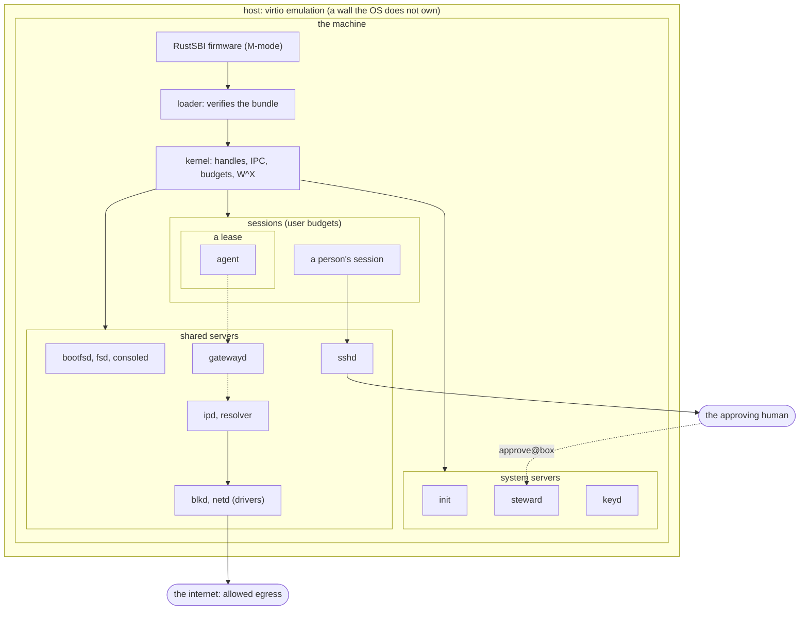

# Tenets

This page outranks every other page in the book. When a change conflicts with a tenet, either
the change loses or the tenet is amended here first, with its reason
([changing a tenet](#changing-a-tenet)). Other pages say how a mechanism works; this one says
what the whole must achieve, against whom, and where its limits are.

## What Redoubt is

Redoubt is a **prison**: a headless, multi-user operating system built so that the most capable
and most malicious agents can run on it, do real work, and not get out.

- It runs on RISC-V softcores, nearly always over virtio (block, network, console). It never has
  a local display, keyboard or mouse. People reach it over SSH.
- **Auditable by construction.** Everything that runs on the machine is Rust, with assembly only
  where Rust cannot reach. There is no C and no shell script anywhere, userland included. The
  trusted computing base (the firmware interface, the loader and the kernel) is small enough to
  read like a textbook.
- **Authority is capabilities.** There is no ambient authority: no root, no user IDs that grant
  access, no global file tree. A child's capabilities are its launcher's or narrower. An agent
  never inherits network access.
- **The network is closed by default.** What a principal may reach is written as names, and an
  agent reaches the outside only through gateways that hold its keys and check its requests.
- **Residual risks are stated, never hidden.** Every guarantee below names the walls it rests on
  and the test that attacks each one. No page says "impossible".

Every page is written as if M1 (separation and containment) through M5 (persist, install, share)
were complete; each section's status line says what is built today ([reading this book](README.md)).

## Threat model

**The adversary** has the full source, automates its exploit attempts, and has as much time as
it likes. It controls every process it runs, including its whole Elixir VM (beamlet is outside
the trusted computing base), and it may compromise a server it talks to. It may be an agent, a
person logged in over SSH, or several of them colluding with a pre-arranged code. It has a
perfect clock: secrets are protected by constant-time code and isolation, never by hiding time.

**Trusted:** the firmware interface, the loader and the kernel; the servers that hold system
authority (`init`, the steward, `keyd`) and `sshd`, which carries each channel's labels; a driver
that programs DMA, unless the hardware confines its DMA; the host that emulates the virtio
devices; and the approving human's judgment, but never the channel the approval travels on (see
[the walls](#the-walls)).

**A compromised shared server** exposes what its clients entrusted to it, and no more: it holds
only its own handles, and the kernel stamps every message with its sender
([R14 (unforgeable sender)](kernel/ipc.md#r14-unforgeable-sender)).

**Out of scope:**
- physical attacks and malicious hardware;
- microarchitectural side channels (caches, branch predictors, memory bandwidth);
- covert communication between co-located budgets through power, heat, electromagnetic emission,
  a shared clock or any other physical coupling. On one machine these couple any two domains, so
  no operating system can close or bound them; the only zero is placement, which is a
  deployment's choice ([the FPGA platform](beyond/fpga-platform.md)).

Software closes every **intentional** path: a message, a write, a read up, a sink, metadata, a
counter or a shared cap. An intentional path across a label boundary is a design hole, whatever
its bandwidth. Timing that software can reduce is reduced (limits are carved, never overcommitted;
caps are counted per account and label set; no global counter is visible), and what remains is
listed under [side channels](#side-channels).

Adversarial agents and real attacks test the design; review alone cannot bound the damage a bug
does.

## Guarantees

Redoubt makes three guarantees. Each is a set of rules, defined on the page that enforces them
and listed with their tests in the [security register](SECURITY.md).

### Capability closure

An agent's reachable authority never exceeds its initial grants, plus what a steward action a
human approved adds, plus what a holder already able to reach it passes to it inside its trust
domain. Every delegation step through a launcher narrows.

- A handle names an object, a badge and a stamp; the kernel holds it, and a process can copy or
  close it but never forge or widen it. A minted handle keeps the stamp of the one it came from,
  so revoking the source revokes it ([R9 (stamps)](kernel/objects.md#r9-stamps)).
- A child budget's limits are carved from its parent's and never add up to more
  ([R7 (carving)](kernel/budgets.md#r7-carving)); destroying a budget revokes everything under it
  ([R10 (destruction)](kernel/budgets.md#r10-destruction)).
- A launcher passes fresh, narrower connections, never its own; a grant is made in a revocation
  scope and dies with it ([R41 (narrowing by revocation scope)](servers/steward.md#r41-narrowing-by-revocation-scope)).
- No server is given a `system` budget to hand out
  ([R33 (no server holds a system budget)](servers/init.md#r33-no-server-holds-a-system-budget)),
  a restart never widens what a service holds
  ([R73 (a restart never widens)](servers/supervisor.md#r73-a-restart-never-widens)), and code a
  principal did not choose to trust gets no authority
  ([R71 (no new authority without trust)](servers/pkg.md#r71-no-new-authority-without-trust)).

**Open:** the closure is stated with its same-label qualification: a holder inside the agent's
trust domain may pass it a handle it already has, with no approval. Whether the guarantee should
instead be stated per trust domain, or same-label delegation be recorded by the steward, is not
decided.

### Label non-interference

No intentional path crosses a label boundary: not a `call` or a `send`, a write, a read up, a
sink, metadata, a counter or a shared cap. **The label set, not the capability set, is the
isolation unit.** Two budgets with equal label sets are one **trust domain**, and a handle passed
between them crosses nothing. Two budgets with differing label sets have no path the OS carries,
except one item at a time through the steward, after the label's owner approves it.

- The kernel refuses a `call` or `send` between two `user` budgets whose label sets differ, and
  checks exit notices and usage reads the same way ([R1 (flow)](kernel/ipc.md#r1-flow)); servers
  in `system` budgets check labels themselves. Labels only grow downward the budget tree
  ([I6 (labels only grow downward)](kernel/invariants.md#i6-labels-only-grow-downward)).
- A shared server applies the same check to every object it serves
  ([R25 (the label check)](servers/serving.md#r25-the-label-check)), and a sink refuses every
  labelled caller ([R60 (a sink refuses labels)](servers/ipd.md#r60-a-sink-refuses-labels)).
- Nothing a vault session does is visible to its principal's unlabelled sessions
  ([R37 (vault non-interference)](servers/steward.md#r37-vault-non-interference)): caps are
  counted per account and label set
  ([R26 (admission fairness)](servers/serving.md#r26-admission-fairness)), budgets are split into
  fixed sub-budgets per label set, and crash blame is kept per label set
  ([R40 (blame by label set)](servers/steward.md#r40-blame-by-label-set)).
- Data leaves a label only by declassification, and enters a confined domain only by a push: one
  approved item each, snapshotted, audited
  ([R42 (one approved item)](servers/steward.md#r42-one-approved-item)).

**Confinement.** In a confined deployment no two label sets share a server instance, volume,
endpoint, network instance, device or core, and no labelled domain reads a shared unlabelled
volume; a manifest that would place them so fails the boot
([R34 (confined placement)](servers/init.md#r34-confined-placement)). R34 names the one exception,
the **control plane**: the steward and `sshd`, and only by three kinds of edge.

- the request and owner-approval path;
- per-item reader and writer budgets, each carrying exactly one label set and dying after one item
  (declassification and push);
- lease supervision: ending a lease, and learning that it ended.

No data server, device or core is exempt. `init` checks the declared graph at boot, and the
steward checks every budget and grant it creates later against the same rule. The residual is
stated: **the named mediators are trusted across the labels they serve.** A bug in the steward or
`sshd` reaches every label set it mediates.

### Human control

Every increase in authority and every declassification is an out-of-band human approval, leases
bound time, and the sponsor can always end a lease.

- An approval happens only where nothing the requester runs can draw, type or listen: on the
  approval channel the steward alone drives, like a second factor
  ([R38 (out-of-band approval)](servers/steward.md#r38-out-of-band-approval),
  [R68 (only the steward on approve@box)](servers/sshd.md#r68-only-the-steward-on-approvebox)).
- A lease is a budget with a deadline: when it passes, the kernel destroys the budget and
  everything in it, whether or not the steward is running
  ([R39 (leases end)](servers/steward.md#r39-leases-end)).
- The sponsor ends a lease sooner, and a request to do so is answered ahead of admission, so an
  agent flooding its sponsor's share of a server cannot block it
  ([R26](servers/serving.md#r26-admission-fairness)). How fast the steward answers under load is a
  measured target, not a proven bound ([scheduling](kernel/scheduling.md#residual-risks)).

The design protects the approval **channel** from the requester. It does not protect the human's
judgment: see [the approval human](#the-approval-human).

## The walls

The prison is layers, and each layer holds only what the one inside it was given. An agent sits
innermost: in its own VM, in a lease, with narrowed connections and no socket.

*Figure: the prison walls. Solid lines are built, dashed lines planned. Each box holds only the
handles the box around it gave it; four walls (the host's emulation, the human, allowed egress and
side channels) are not the OS's own, and are named below.*

Inside the machine each wall is a rule with a test. Four walls are not the OS's own. They are
named here, and every page that rests on one says so in its residual risks.

### The approval human

An approval is only as good as the human's judgment. The requester can persuade, repeat until the
human tires, or phrase a request that reads one way and means another. The design shows the whole
request on a channel the requester cannot draw on, keeps each declassified item small and
printable ([R42](servers/steward.md#r42-one-approved-item)), and audits every approval; it does not
decide for the human. The escape room attacks this wall with collusion through the human
([agents](userland/agents.md#the-escape-room)).

### Host virtio emulation

Redoubt's devices are virtio devices emulated by the host (QEMU, or a softcore's host side). Only
the drivers (`blkd`, `netd`, `consoled`) touch a device, each through its own device objects
([R18 (device authority)](kernel/devices.md#r18-device-authority)), and they treat everything a
device says as hostile: a disk's lie is a failure, never corruption
([R52 (a lie is a failure, never corruption)](servers/blkd.md#r52-a-lie-is-a-failure-never-corruption)),
and a bad frame is content ([R55 (a bad frame is content, not a lie)](servers/netd.md#r55-a-bad-frame-is-content-not-a-lie)).
But a bug in the host's emulation that a driver's requests can reach is outside the OS, and a
driver that programs DMA is trusted unless the hardware confines it. No agent or session holds a
device.

### Allowed egress

Every allowed channel out of the box can carry data. A model API an agent may call, a `git` remote
it may push to, and the upstream DNS resolver's shared cache (which serves everyone outside the
box, so its timing is visible to anyone) are paths out that the design narrows but cannot close.
`gatewayd` checks and meters every request against the capability it came through
([R65 (a request only within its capability)](servers/gatewayd.md#r65-a-request-only-within-its-capability))
and logs it; the resolver answers only allowed names
([R63 (only allowed names)](servers/resolver.md#r63-only-allowed-names)). No labelled caller
reaches any egress (R60). What an unlabelled agent sends through an allowed channel is the
sponsor's to allow.

### Side channels

Timing, shared caches and shared hardware couple budgets in ways software can reduce but not
close:
- the scheduler, when two label sets share a core, and server CPU spent on a caller's behalf;
- CPU caches, the shared second-level cache and memory bandwidth; on QEMU and ordinary hardware
  none of these is partitioned;
- a shared server's caches and the disk: a vault's reads warm a cache an unlabelled session can
  time, unless the deployment is confined;
- a server sized for fewer buckets than the label sets it serves, which refuses latecomers
  ([serving](servers/serving.md#residual-risks)).

A confined deployment removes the shared servers, endpoints, devices and cores; what is left is
hardware's, and hardware placement is [beyond M5](beyond/fpga-platform.md). Secrets are handled by
constant-time code ([R45 (constant-time signing)](servers/keyd.md#r45-constant-time-signing)), so
there is nothing secret-dependent to time.

## Network policy

The network is where a prison most easily leaks, so its rules are stated here once.

- **Default deny.** A principal reaches only what its grants allow; an agent inherits no network
  access at all.
- **Allowlists are written as names.** A name rule covers a domain or a suffix, matched only at a
  label boundary; a **blocklist only subtracts** from an allowlist and always wins.
- **DNS is mediated.** The resolver answers only names in the caller's allowlist (R63), and a
  connection made by name is pinned to the address that was checked
  ([R64 (connections by name are pinned)](servers/resolver.md#r64-connections-by-name-are-pinned)).
- **Agents get gateway capabilities, not sockets.** `gatewayd` holds the keys, speaks TLS, checks
  each request against the grant and logs it; no credential ever reaches the agent
  ([R66 (no credential leaves gatewayd)](servers/gatewayd.md#r66-no-credential-leaves-gatewayd)).
- **Only people get name-scoped TCP**, through `ipd` with a resolver connection: a scope reaches
  only what it allows ([R58 (a scope reaches only what it allows)](servers/ipd.md#r58-a-scope-reaches-only-what-it-allows)),
  and a grant only narrows it ([R61 (scopes only narrow)](servers/ipd.md#r61-scopes-only-narrow)).
- **Always forbidden**, whatever a grant says: the host's and cloud metadata addresses, the box's
  own services from inside
  ([R59 (never the box's own addresses)](servers/ipd.md#r59-never-the-boxs-own-addresses)), and
  inbound traffic other than SSH (with SFTP and SCP inside it).
- **Web serving**, when it comes, terminates TCP, TLS and HTTP in separate trusted servers split by
  privilege; applications get parsed requests, and inbound access is only through SSH forwarding
  ([the web stack](beyond/web-stack.md)).

The network path, from an agent through `gatewayd` and `ipd` to `netd`, is drawn on
[the servers](servers/README.md#the-network-path).

## The tenets

### 1. Simple enough to audit in full

A competent reader can read the whole trusted computing base and hold it in their head. It reads
like a textbook example of each mechanism.

- **The kernel keeps memory, threads, IPC, interrupt delivery and the timer. Nothing else.**
  Drivers, file systems and policy are unprivileged servers ([the kernel](kernel/README.md)).
- One obvious way to do each thing. A trick needs a comment that says why the obvious way does not
  work; if the comment is hard to write, the trick goes.
- Size is budgeted, not just observed. Growing the trusted computing base needs a stated reason.
- Deleting code beats adding configuration. A feature nobody uses on our targets is removed, not
  carried.
- Every design decision is written down where a newcomer can follow it: in this book.

### 2. Secure by construction

- **No ambient authority.** A process touches only what it was given: memory it mapped,
  connections it holds, devices it was granted. "First to ask gets it" is not a policy.
- **Least privilege all the way down.** The kernel does not trust processes, servers do not trust
  clients, the loader does not trust images, and nothing trusts input it has not checked.
- **W^X everywhere**, the kernel's own mappings included: no page is ever writable and executable
  under any alias ([R11 (memory)](kernel/memory.md#r11-memory),
  [R19 (kernel W^X)](kernel/memory.md#r19-kernel-wx)).
- **Verified boot.** Every byte that runs in a privileged mode is authenticated before it runs
  ([R15 (verified boot)](kernel/boot.md#r15-verified-boot)).
- **Fail closed and loudly.** On a violated invariant the kernel stops; it never limps on. An
  insecure fallback (a guessable random seed, a missing signature) is a boot failure, not a
  warning ([R17 (fail closed)](kernel/boot.md#r17-fail-closed)).
- **`unsafe` is a budget.** Every `unsafe` block states the invariant it relies on; unsafe code
  lives in few, small modules with safe interfaces; the count is tracked by the bench and goes up
  only with a reason ([the unsafe budget](testbench.md#the-unsafe-budget)).
- **The requester never influences the approval channel.** Any convenience that puts approval
  inside a session must first amend this tenet.
- **Non-interference across labels**, by construction ([label non-interference](#label-non-interference)).

### 3. Rust, and assembly only where Rust cannot reach

- Everything that runs on the machine is Rust: the RustSBI firmware, the loader, the kernel, the
  servers and the applications, userland runtimes included. RustSBI is the only supported firmware
  and is always trusted.
- Assembly is limited to what the language cannot express (trap entry and exit, the context
  switch, the first instructions after reset) and is written inside Rust sources, never as prebuilt
  objects.
- No C, no C toolchain in the build, no binary blobs, no bindings to C libraries, and no shell
  scripts on the machine. One exception, on the build host only: test oracles and fuzz drivers
  (the littlefs C reference, libFuzzer) may be C or C++, in crates outside the workspace build,
  never linked into anything that runs on the machine.
- The build is one pinned toolchain (`rustc` and `cargo`), and reproducible.

### 4. Open, auditable standards

- Hardware interface: ratified RISC-V specifications only (the privileged architecture, SBI, the
  PLIC, Sv32 and Sv39, Sstc). A board's vendor extension sits behind a capability with a
  standards-based alternative.
- Machine description: the device tree. Devices: virtio.
- Formats and protocols: published ones with independent implementations (ELF, tar, 9P2000, SSH,
  TLS). A format is invented only when no open one fits, and then it is specified in this book.
- Everything needed to rebuild and audit the system is public: sources, specifications, toolchain.

### 5. Dependencies are part of the trusted computing base

A crate linked into the kernel or the loader is our code, as far as the adversary is concerned.

- Reuse beats writing our own when the crate is small, `no_std`, pure Rust, maintained, and read.
  Otherwise we write the fifty lines.
- Privileged code keeps a short, reviewed dependency list, pinned by the lockfile and vendored. A
  new dependency there needs a stated reason.
- Servers have more latitude than the kernel; applications more than servers.
- A dependency that panics on malformed input is a denial-of-service bug in us.

### 6. Tested to hell and back

If it is not tested, it does not work; we just have not found out yet. The harness is part of the
system, held to the same standard as the kernel ([the test bench](testbench.md)).

- **One simple harness, real boots.** The bench boots the real kernel under QEMU with chosen
  programs and judges the console. No mock of the kernel and no special test build of it; a build
  of the same sources with debug assertions and overflow checks on is the kernel checked harder,
  not a special build.
- **Every behaviour has a case.** New kernel or loader behaviour lands with a test; a bug fix lands
  with the test that would have caught it.
- **Attack tests, not just happy paths.** Hostile images, hostile call arguments, hostile messages,
  exhaustion, malformed device trees. The expected outcome is a clean refusal, never a kernel panic
  and never silent corruption. A verdict comes only from a party the attacker cannot impersonate
  ([rule F](testbench.md#rule-f-trusted-verdicts)).
- **The harness can fail.** It is checked against known-bad runs, so a green result means
  something; the model's checks are shown to catch deliberate breaks
  ([the model](kernel/model.md)).
- **Fuzz what parses.** Anything that parses untrusted bytes (ELF, tar, the device tree, call
  arguments, messages) gets a fuzz target.
- A flaky test is a bug, in the test or in the system, and is fixed rather than retried.

### 7. Devices speak virtio

Drivers are virtio, unless the device is trivial (a UART, a real-time clock: small, no DMA). A
driver that does DMA is in the trusted computing base unless the hardware confines its DMA; the
platform states which. On hardware too messy to drive, Redoubt writes no drivers: it takes
reserved cores and lets Linux run the hardware and serve virtio to it, and there Linux is trusted
([Linux on reserved cores](beyond/linux-cores.md)).

## Every dimension we claim

A configuration the bench does not boot is not supported.

- **Widths.** Every milestone, M1 (separation and containment) to M5 (persist, install, share),
  requires rv64 boots and rv32 compilation. Most kernel cases boot on rv32 as well; a full rv32
  system is [beyond M5](beyond/rv32.md).
- **Harts.** Redoubt runs on one hart; the others stay parked in the firmware. A checked-build case
  starts a second hart to test the kernel lock, and a few cases boot with two or four harts to show
  the extra harts change nothing. Running on several harts is [beyond M5](beyond/smp.md).
- **Firmware.** RustSBI's prototyper, built from source, on both widths.
- **Machine.** QEMU's `virt` machine, with virtio block, network and console devices.

## Non-goals

These are not missing features. Each is left out because it would widen what an attacker can
reach or what an auditor must read.

- **No display, keyboard, mouse or GUI.** The box is headless; people use SSH.
- **No Unix signals, `fork`, `setuid` or root.** A process is ended by destroying its budget;
  authority is only ever narrowed.
- **No POSIX shell.** The shell is Elixir.
- **No symlinks or hard links.** Namespaces are built from binds, per process.
- **No swap and no IPv6.**
- **No inbound services except SSH**, with SFTP and SCP inside it.

## Changing a tenet

A tenet changes before the code does. The change is made on this page, with the reason next to
it, and every page that rests on the old wording is updated in the same change. A proposal that
conflicts with a tenet and does not amend it is refused. Weakening a guarantee, or moving a wall
from "attacked" to "assumed", needs the owner's explicit decision.
