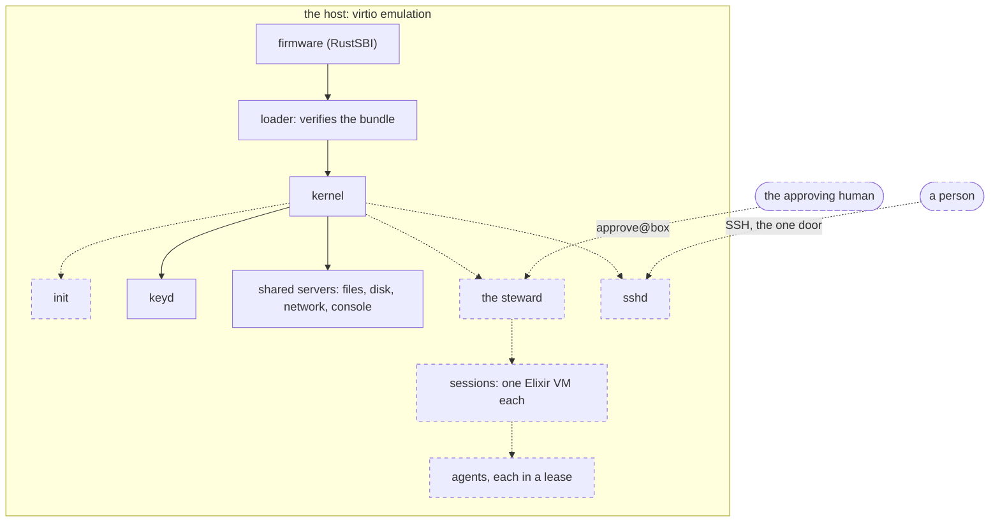
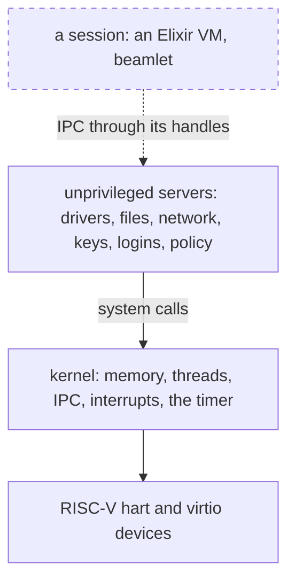
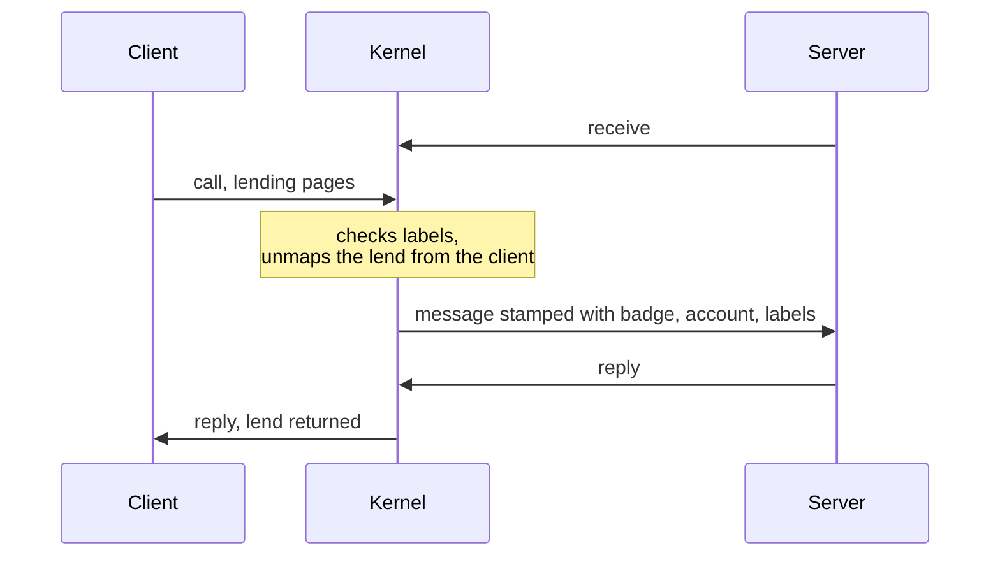
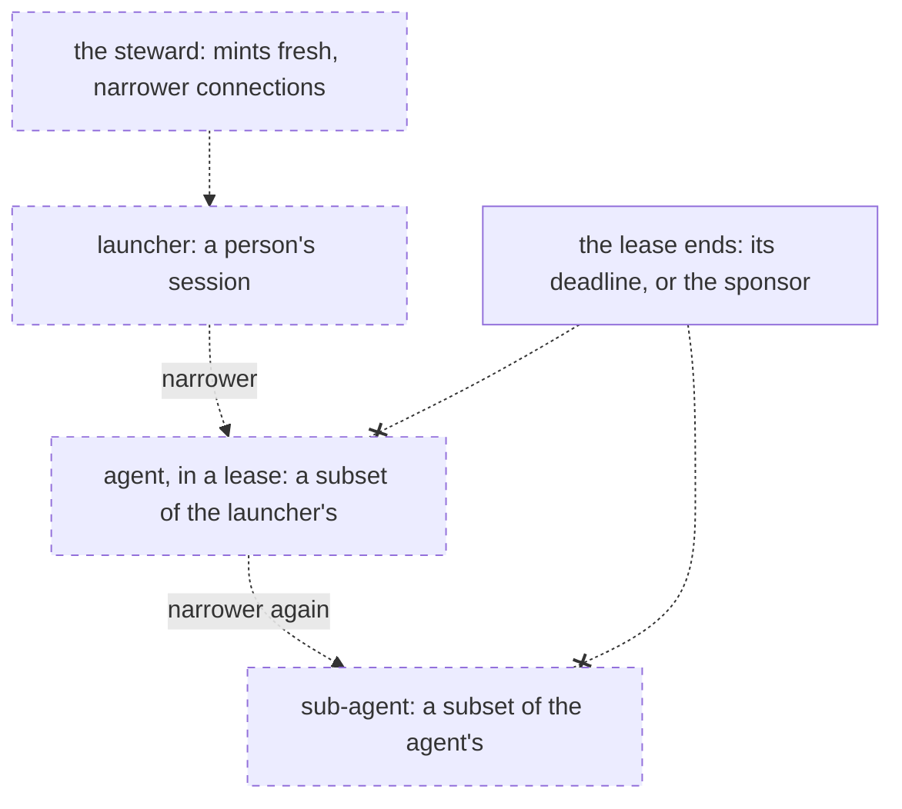
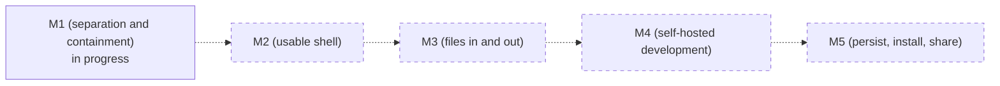

# A tour of Redoubt

Redoubt is a prison: a headless RISC-V operating system that the most capable and most malicious
agents can run on, do real work on, and not get out of. This tour shows the whole in five
pictures, each with a link to the page that gives the detail. In every figure solid lines and
boxes are built; dashed ones are planned.

## The prison walls

An agent sits innermost, and each wall around it holds only what the wall outside it gave. The
one door in is SSH; the one way to move authority or data across a wall is an approval by a human,
on a channel nothing inside can draw on. The host's device emulation and the human's judgment are
walls the OS rests on but does not own.

*Figure: the prison walls. `init`'s manifest handling, the steward, `sshd`, sessions and agents are
planned for M1 (separation and containment); the servers drawn solid are built and attacked in host
tests or on the kernel.*

Detail: [the walls](TENETS.md#the-walls)

## The layers

The kernel keeps five things: memory, threads, IPC, interrupt delivery and the timer. Everything
else (drivers, file systems, the network, keys, logins and policy) is an unprivileged server that
reaches hardware, other servers and the kernel only through the handles it was given. A person's
session is one more process above them: an Elixir VM that holds narrowed connections to the
servers and nothing else.

*Figure: the layers. Only the kernel and the firmware below it run privileged; a server holds no
authority it was not handed.*

Detail: [the kernel](kernel/README.md), [the servers](servers/README.md),
[sessions and namespaces](userland/sessions.md)

## One IPC call

A client calls a server through an endpoint handle, and may lend it pages for the length of the
call. The kernel, not the client, tells the server who is calling: it stamps each message with the
handle's badge, the caller's account and its labels, which the client cannot forge. The reply
hands the lent pages back.

*Figure: one IPC call. The stamp is the server's only knowledge of its caller.*

Detail: [IPC](kernel/ipc.md)

## Capability delegation

Authority flows down a tree and narrows at every step. The steward mints each launch fresh,
narrower connections: a person's session gets its own, an agent gets a subset of its launcher's
under a lease, and a sub-agent a subset of that. A lease is a budget with a deadline; when it
ends, everything below it ends too.

*Figure: capability delegation. Every step holds less than the one above it. The tree is planned;
the kernel's deadlines, which end a lease, are built.*

Detail: [agents, leases and labels](userland/agents.md#delegation-only-narrows)

## The road

The plan is five milestones, each a whole working system. M1 (separation and containment) is in
progress: the kernel, the drivers, the network server and the serving library are built and
attack-tested, and the steward, SSH logins and the contained agent are next.

*Figure: the road. M1 (separation and containment) is part built (solid box); the rest are
planned.*

Detail: [M1 (separation and containment)](plan/m1-separation.md),
[the milestones](README.md#the-milestones)
