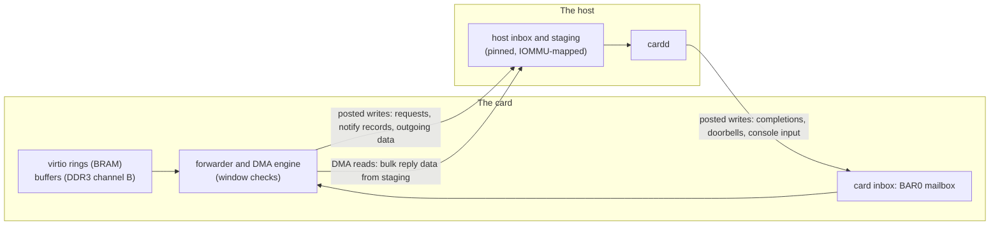

# The card's host backend

## Idea

One Rust program on the host, `cardd`, serves the [FPGA card](fpga-platform.md)'s devices from
userland over VFIO, where QEMU serves them in development: the 16550 console, virtio-blk and
virtio-net. It is built for the smallest attack surface a hostile card could reach:

- **The host never parses a guest pointer.** The card pushes whole requests into host memory and
  pulls replies out of it; every guest address is checked against a window in RTL, on the card.
  What `cardd` parses is fixed-format records in its own memory.
- **Each side's inbox lives in its own memory.** Whoever reads a queue owns the memory it sits in,
  and the other side only ever writes into it, with posted writes. The virtio rings stay on the
  card; the host's inbox is pinned host memory; the card's inbox is the BAR0 mailbox.
- **Opened, then locked down.** `cardd` opens its device, disk, network and console, then gives up
  every right to open anything else before it reads one byte from the card.

## Why it is not a goal

The card is not a goal ([the FPGA platform](fpga-platform.md#why-it-is-not-a-goal)): every
milestone runs on QEMU, whose devices need no backend of ours. The backend is kept so that the
card's host side is not redesigned from scratch, and so that the card's RTL and the backend are
held to one contract.

## What it would need

### The inboxes

- **Card to host.** Notify records, forwarded requests, outgoing data and console output land in
  the pinned host region. `cardd` waits on memory local to it, and the IOMMU confines the card's
  writes to that region.
- **Host to card.** Small items (a used entry, a status byte, console input) are posted writes into
  the mailbox, read by the card from local BRAM. Bulk data (a received frame, a block read) waits
  in host staging, and the card's DMA engine fetches it on a mailbox command: the one read that
  crosses the link, issued by the engine with many in flight, never by a core.
- **The virtio rings stay on the card,** rings in BRAM and buffers in DDR3 channel B. The guest is
  the rings' main reader, and a ring in host memory would make each of its reads a stalled round
  trip and its memory writable by the host underneath it.

The records on both sides are one-way, single-writer queues, the same discipline as virtio one
level down. Each record carries a sequence number, so a torn or stale record is visible.

### Two phases

1. **Copy commands.** The backend walks the rings itself, through mailbox commands that copy a
   channel-B range into host staging; the DMA engine checks each range against its window first.
   A copy costs a round trip or two, enough for the console and the disk at bring-up.
2. **The forwarder.** A walker in the fabric reads the available ring, checks every descriptor
   against its window and pushes the whole request (the chain, and the data the device reads) into
   the host inbox; a completion comes back the other way, and the card writes the used ring.

The device code sits behind one trait, `GuestMem` (read and write a guest range), with one
implementation per phase and a fake for tests, so it does not change between them.

### Addresses

| Address | Chosen by | Known to the other side through |
| --- | --- | --- |
| Shims, PLIC, UART, DMA regions | the hardware design | the device tree, generated with the RTL |
| virtio rings | the guest driver, at run time | the shim's registers, forwarded in notify records |
| virtio buffers | the guest driver, per request | descriptors, checked against the windows |
| BAR0 | Linux's PCI enumeration | VFIO; `cardd` uses only offsets |
| BAR0 register offsets | the contract | generated constants on both sides |
| Host inbox and staging | `cardd`, at setup | mailbox registers; enforced by the IOMMU |
| MSI | Linux | the card's PCIe configuration space |

The fixed parts are one versioned contract: BAR0's offsets, the record layouts, the mailbox's
command format, and a magic number and version at BAR0 offset 0 that `cardd` checks before
anything else. It is written once and generates the Rust constants, the SpinalHDL constants and
the device-tree fragment, so the RTL and the backend cannot disagree by a register. The inbox's
addresses are host addresses only: a host that lies about them misdirects the card's writes into
its own memory, and no card window is reachable through BAR0.

### The process

- **One binary, `std` Rust, synchronous:** no async runtime; threads pinned to isolated cores. One
  thread serves every slot to start; a second takes the disk if a slow disk stalls the network.
- **Few dependencies, vendored:** `libc`, `vfio-bindings` (the ioctl structures only),
  `seccompiler` and `landlock`, each held to
  [tenet 5](../TENETS.md#5-dependencies-are-part-of-the-trusted-computing-base). The device side
  of the split queue is our own, a few hundred lines mirroring the drivers': rust-vmm's
  `virtio-queue` assumes guest memory the backend can map, which this design never has.
- **`#![forbid(unsafe_code)]`** in every module but two: `vfio` (the ioctls, the BAR's mapping
  and its volatile accesses) and `wait` (the wait instructions).
- **The modules:** `vfio`; `link` (the inboxes, doorbells and copy commands); `wait`; `mem` (the
  `GuestMem` trait, every range checked with overflow-checked arithmetic before anything moves);
  `queue` (the device side of the split queue and `EVENT_IDX`); `dev::uart`, `dev::blk`,
  `dev::net`; `main` (which slot is which device and what backs it, from one small file).

**Startup, then lockdown:**
1. Open the card through VFIO (the group, or `iommufd`'s device and `/dev/iommu`), the disk
   (`O_DIRECT`), the tap device and the console's listening socket. The VFIO group belongs to the
   owner's user through a udev rule, so `cardd` never runs as root.
2. Map BAR0, allocate one hugepage-backed region and map it for DMA as the only memory the card can
   reach, wire MSI to eventfds, and write each shim's register file: magic, version 2, the device
   ID, the features, `QueueNumMax`, the config space.
3. Lock down: `no_new_privs`, every capability dropped, Landlock with no filesystem access, an empty
   network namespace (the tap is already open), and a seccomp allowlist of `read`, `write`,
   `pread64`, `pwrite64`, `fdatasync`, `accept4` on the console socket, `ppoll`, `futex`,
   `clock_gettime` and `exit_group`. No `openat`, `socket`, `mmap` or `execve`.

**What the card sends is hostile.** `queue` bounds every index below the queue size and every chain
at the queue size (which catches a loop), caps the total length, checks each segment's direction,
and refuses `INDIRECT`, which is never negotiated. A used entry names only a head that is
outstanding.

### Waiting

`cardd` waits in three tiers, behind one function with a deadline:
1. **Spin** on the inbox's next record, for a microsecond or two.
2. **Monitor the line:** `UMONITOR` and `UMWAIT` on Intel (WAITPKG: Tremont and Alder Lake on,
   Sapphire Rapids on servers), `MONITORX` and `MWAITX` on AMD. The core sleeps until the card's
   write lands on the line, with no interrupt and no kernel. The monitor is armed, the line
   re-checked, then the wait entered, so a write between check and wait is not missed. The wait is
   capped by the kernel's `umwait_control`, so it loops.
3. **Block:** arm the interrupt (`used_event`, or the inbox's own flag), re-check the inbox, and
   block on the MSI's eventfd.

CPUID at startup picks the second tier, and a host with neither instruction set skips it. Load
pays the first tier's latency; a quiet card costs nothing; only the first request after a quiet
spell pays an interrupt's microseconds.

### The devices

- **The console** is the 16550's byte stream
  ([`consoled`](../servers/consoled.md) drives the 16550, as on QEMU). Its host end is a Unix
  socket, `$XDG_RUNTIME_DIR/cardd/console.sock`, in a `0700` directory with mode `0600`. The
  console is one principal's session
  ([authentication and sessions](../servers/steward.md#authentication-and-sessions)), so whoever
  reaches the socket acts as that principal at the console: `cardd` checks the peer's user with
  `SO_PEERCRED`, admits only the owner, and admits one client at a time. Output goes into a 64 KB
  ring that a new client is shown first, so nothing is lost while none is attached.
- **The disk** is `pread` and `pwrite` between a disk (an NVMe partition or an image) and the
  staging buffers. The request header's type and sector count are checked, and the sector plus the
  count must lie inside the disk; `FLUSH` is `fdatasync`. No `io_uring`: the link, about 400 MB/s,
  is the bound, and `io_uring` is a large kernel surface.
- **The network** is a tap device bridged to the LAN. The owner makes a persistent tap and a bridge
  over a wired interface once, as root; `cardd` attaches to the tap it owns with
  `IFF_TAP | IFF_NO_PI`, strips the 12-byte virtio header on transmit and adds a zeroed one on
  receive (no offloads are negotiated), and holds frames to 14 to 1514 bytes. The net shim's MAC is
  a fixed, locally administered address from `cardd`'s configuration. Bridged, the card is a host
  on the LAN, its open ports reachable by every device there, and the host's firewall does not see
  bridged traffic; [R55 (a bad frame is content, not a lie)](../servers/netd.md#r55-a-bad-frame-is-content-not-a-lie)
  and Redoubt's own policy are what stand between the LAN and the card.

The host end sits where QEMU sits ([host virtio emulation](../TENETS.md#host-virtio-emulation)):
trusted to serve honestly, and a disk's lie is still a failure on the card
([R52 (a lie is a failure, never corruption)](../servers/blkd.md#r52-a-lie-is-a-failure-never-corruption)).

### Testing

- **A fake card,** in-process: `GuestMem`'s fake and a fake link play the guest driver, posting
  chains and ringing notifies, as `netd` and `blkd` test against fake devices.
- **Fuzz targets** for `queue` over arbitrary rings, for `dev::blk` and `dev::net` over arbitrary
  requests, and for the inbox's record parser: no panic, nothing outside a window touched, every
  used entry naming an outstanding head.
- **The card,** from the platform's first step: the latency bitstream gives a real BAR, doorbells
  and interrupts, and is where the three tiers are measured.

**Attack cases:**
- A descriptor chain that loops, overruns the queue or points outside its window is refused, and
  the slot is failed; the backend does not panic.
- A record with a stale or torn sequence number is ignored.
- A block request past the end of the disk is refused with an error status.
- A second console client, or one from another user, is refused.
- After lockdown, `openat`, `socket` and `execve` kill the process.

**Open:**
- The mailbox's command format and the record layouts, which the RTL needs too, and the generator
  that keeps both sides on one copy.
- Running the network cases on the card: the bench's cases assume QEMU's user-mode network with
  forwards on `127.0.0.1`, and a bridged card needs a peer arrangement of its own.
- Where the backend's code lives in the tree, given that host code is a development aid.
