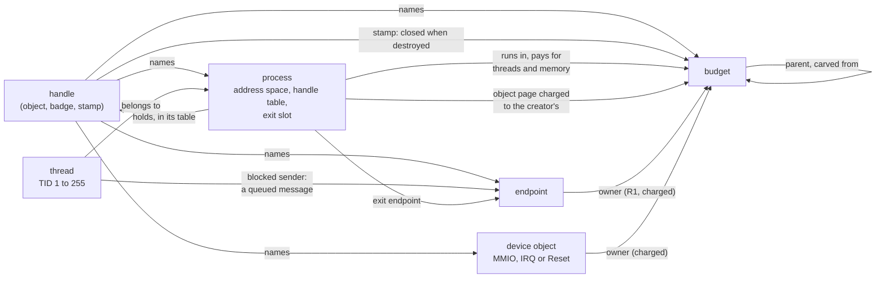

# The kernel

The Redoubt kernel is a small RISC-V microkernel in Rust. It keeps five things: memory, threads,
IPC, interrupt delivery and the timer. Everything else (drivers, file systems, the network,
policy) is an unprivileged server that reaches the kernel only through handles and the 26 system
calls. The kernel runs in S-mode under RustSBI firmware, one binary for rv64 (Sv39) and rv32
(Sv32). This page says what the kernel keeps, names its objects, measures the trusted computing
base, and maps each source file to the page that documents it.

## Purpose

The kernel is the part of Redoubt every other guarantee rests on, so it has to be small enough
to read in full ([TENETS](../TENETS.md)). A reader who wants to audit it needs three things
first: what the kernel is responsible for and what it refuses to hold, the objects it hands out
and how they refer to each other, and where the code for each rule lives. The pages below this
one each take one mechanism; this page is the map.

## What the kernel keeps

Status: built · partly tested: that no driver, file system or policy sits in the kernel is read from the source map, not attacked by a case · tested: bench:no-cruft, bench:legacy-gone

| Job | What the kernel holds | Calls | Page |
| --- | --- | --- | --- |
| Memory | who owns every RAM frame, each process's page tables, the physmap | `map_anon`, `unmap`, `set_flags`, `map_fixed`, `process_map`, `map_device`, `dma_alloc` | [memory](memory.md), [memory layout](memory-layout.md) |
| Threads | processes, up to `MAX_THREADS` (255) threads each, and one stride queue over every runnable budget | `process_create`, `process_start`, `thread_create`, `thread_exit`, `process_exit` | [processes](processes.md), [scheduling](scheduling.md) |
| IPC | endpoints and the messages of blocked senders | `endpoint_create`, `mint`, `call`, `send`, `receive`, `reply`, `serve`, `handle_close` | [IPC](ipc.md), [objects](objects.md) |
| Interrupt delivery | the interrupt controller (a PLIC), mapped for the kernel alone, and one IRQ device object per line | `receive` naming an IRQ handle | [devices](devices.md) |
| The timer | one hardware timer, always armed for the earliest slice end, timeout or budget deadline | `time_now`, and the timeout of every blocking call | [timer](timer.md) |

Budgets pay for all five: every object, page, process and share of the CPU is charged to one,
and destroying one revokes everything under it ([budgets](budgets.md),
[R10 (destruction)](budgets.md#r10-destruction)). The budget calls are `budget_create`,
`budget_destroy`, `budget_reap` (destroy one child, keep the budget) and `budget_usage`. Two
calls sit outside the five jobs. `random` returns 64 bits from the kernel's ChaCha8 generator,
keyed from the loader's `Seed` argument; the kernel also draws PIDs from it. `system_reset` powers the machine off or reboots it through the
firmware, and only a holder of the Reset device object can call it.

The kernel holds nothing else:
- **No drivers.** Its own console is the SBI debug console. Every real device (UART, virtio
  block, virtio net) belongs to a userspace server that holds its device object.
- **No names.** The kernel knows handles, never paths, file names or server names. A process
  reaches only what its own handle table holds.
- **No program loading.** The loader places the kernel and `init` at boot. After
  that a launcher builds a process with `process_map` and `process_start`, and a loader stub
  inside the new process reads its ELF image ([boot](boot.md), [processes](processes.md)).
- **No policy.** The kernel enforces [R1 (flow)](ipc.md#r1-flow) on label sets and the budget
  limits. Who gets which label, lease or capability is decided by `init` and the steward.

There is one call table. A number in `a0` outside it is `InvalidArgument`, whatever the other
registers hold ([ABI](abi.md#unknown-call-numbers)). The kernel never calls into user code and
never switches straight from one process to another. User mode is entered two ways (resuming a
thread, or returning from a call) and left one way (a trap), so every instruction a process runs
is counted against the budget the scheduler picked
([R12 (scheduling)](scheduling.md#r12-scheduling)). The kernel runs on every hart, with
interrupts off while it runs, under one FIFO lock that a hart takes at its trap from user mode and
gives up at its return or idle. Each kernel global (the memory manager, the process table, the
timer, the generator) sits in a `KernelCell` of its own (`kernel/src/cell.rs`): a run-time-checked
borrow under that lock, so a nested borrow is a panic, not two live references. A checked build
asserts that the hart reaching it holds the lock; a release build does not check, and rests on
the trap paths taking it.

`bench:no-cruft` reads the sources and fails on a name from a list of call-interface
identifiers Redoubt does not have, on a silenced dead-code warning (`allow(dead_code)` or
`allow(unused)`) in the kernel, the loader, `paging`, `redoubt-layout` or the test programs, on
a Cargo feature no `cfg(feature)` reads, and on a second literal definition of `PAGE_SIZE` or
`USER_AREA_END`. Every exemption is an entry in the case with its reason, and an exemption that
covers nothing fails the case ([test bench](../testbench.md#the-no-cruft-gate)).
`bench:legacy-gone` makes the calls such an interface would take, from user mode, and checks
that each is refused and that nothing it asked for happened: no mapping, no callback run, no
switch.

## The objects at a glance

Status: built · partly tested: an endpoint's page is attacked only in the model and a device object's page by no case ([objects](objects.md#what-objects-cost)), and that no id is ever reused is not visible to a process ([I12 (ids never reused)](invariants.md#i12-ids-never-reused)) · tested (5)

- bench:budget
- bench:redoubt-ipc
- bench:process
- bench:device
- bench:budget-forge-attack

A process holds **handles**: indices into a handle table that only the kernel writes. A handle
names an object, a **badge** (a 64-bit number the minting server chose; 0 for the receive right)
and a **stamp** (the budget whose destruction closes the handle everywhere,
[R9 (stamps)](objects.md#r9-stamps)). Index 0 is never a handle. There are four kinds of object:

| Object | What it is | Made by | Charged | Ends when |
| --- | --- | --- | --- | --- |
| budget | limits on pages, processes and CPU weight; a class, a label set, an account, an optional deadline | `budget_create`; `root`, `system` and `users` at boot | one page to its parent | `budget_destroy`, its deadline, `budget_reap` on its parent, or the destruction of a budget above it |
| endpoint | what clients call and servers receive on; it holds no queue | `endpoint_create` | one page to its owner, the creating process's budget | its owner is destroyed |
| process | an address space, a handle table and threads; its object page holds the one exit notice | `process_create` | the object page to the creator's budget; its header, page tables and memory to the budget it runs in | it exits, faults or is killed; the page stays until the notice is taken or dropped |
| device | an MMIO range (with a DMA flag), an IRQ line, or the Reset right | only at boot, from the loader's device list | one page to its owner (`system` at boot) | its owner is destroyed, or its DMA reset is never confirmed |

Each object lives in a RAM frame of its own. Every lookup compares the id in the frame with the
id in the handle, and a mismatch stops the kernel rather than naming a reused frame
([I1 (handles name live objects)](invariants.md#i1-handles-name-live-objects)). Threads,
handle-table pages and open calls are not objects: no handle names them. A thread is named by
its process and its TID (1 to 255). Details, costs and `mint` are in [objects](objects.md).

```mermaid
flowchart LR
    H["handle<br/>(object, badge, stamp)"]
    P["process<br/>address space, handle table,<br/>exit slot"]
    T["thread<br/>TID 1 to 255"]
    E["endpoint"]
    D["device object<br/>MMIO, IRQ or Reset"]
    B["budget"]
    P -- "holds, in its table" --> H
    H -- names --> B
    H -- names --> E
    H -- names --> D
    H -- names --> P
    H -- "stamp: closed when destroyed" --> B
    T -- "belongs to" --> P
    T -- "blocked sender:<br/>a queued message" --> E
    P -- "runs in, pays for<br/>threads and memory" --> B
    P -- "object page charged<br/>to the creator's" --> B
    P -- "exit endpoint" --> E
    E -- "owner (R1, charged)" --> B
    D -- "owner (charged)" --> B
    B -- "parent, carved from" --> B
```
*Figure: the kernel's objects and what each refers to. An arrow points from the one that holds
the reference to the one it names.*

## Containment

Status: built · tested: bench:kernel-containment

One boot, `bench:kernel-containment`, shows that the kernel's primitives alone contain hostile
code before `init`, the steward or any server is built on them. Hostile code in a lease is
preempted, then ended at its deadline or revoked by hand while its messages and lends are in
flight, and its victims stay responsive the whole time. The boot is evidence for the kernel only.
The steward's leases, approvals, the network and sessions have their own cases
([M1 (separation and containment)](../plan/m1-separation.md#attack-suite)).

**What runs.** The loader starts one program. It holds `root`, `system`, `users`, the console
and the Reset right. It builds the budget tree at the weights `init` gives
([init](../servers/init.md)) and starts copies of itself in the tree, as the latency workload does
([responsiveness](scheduling.md#responsiveness)):
- in `system`: the workload's driver stand-in and steward stand-in, and a victim server that
  takes the hostile agents' calls and holds them open;
- in `users`: a bystander session, and a sessions budget the steward stand-in holds. The steward
  stand-in carves each lease from that budget and starts a hostile agent in it, as the steward
  will.

Each hostile agent runs in a lease the size of the workload's leases, with room added for a full
handle table and one sub-agent. It does all of these at once:
- some of its threads spin and never enter the kernel, and one enters the kernel in a tight
  loop;
- some threads call the victim server with lends, which the server takes and holds open, and
  others are blocked in `send` to it. All of them go through handles minted into the lease's
  revocation scope;
- a sub-agent runs in a budget the agent carves from its lease. That budget has a later deadline
  of its own, and the sub-agent's process churns threads and processes;
- the agent fills the rest of its lease with endpoints and its handle table up to `MAX_HANDLES`,
  so the destruction walks as much as a lease of its size can make it walk.

The bystander also holds a message queued at the victim server that carries a handle stamped with
a live lease. The hostile leases come in pairs, one of each kind. One ends at its deadline while
the other lives, so two hostile leases are live at every deadline's end. The steward stand-in then
ends the other with `budget_destroy` after a timeout, which is its decision; that lease is the only
one live at its end. Each pair is replaced when both have ended, until nine of each kind have
ended.

**Verdicts.** None of them comes from a hostile agent:

| What is judged | Rules | Judged by |
| --- | --- | --- |
| Every process in a lease, its sub-agent's included, is killed at the lease's deadline or at the decision, and each gets a `killed` notice that blames nobody. The tight loop does not put the deadline off | [R10 (destruction)](budgets.md#r10-destruction), [deadlines](budgets.md#deadlines), [R21 (crash blame)](processes.md#r21-crash-blame) | the kernel's exit notices, taken by the steward stand-in |
| Each call the victim server took from a lease is abandoned, with one notice. Its lend stays mapped in the server with the bytes the agent wrote, while the next lease reuses freed frames. The server's reply is discarded with mask 0, and its usage returns to where it started | [R3 (lends and abandoned calls)](ipc.md#r3-lends-and-abandoned-calls), [I15 (abandoned calls reported once)](invariants.md#i15-abandoned-calls-reported-once), [I9 (pages W^X, zeroed, lends unmapped)](invariants.md#i9-pages-wx-zeroed-lends-unmapped) | the victim server |
| Nothing sent through a lease's handles, its blocked sends' included, is received after the lease ends: the victim finds the lease's send endpoint empty. That each blocked send returns failed is seen only by the agent, so no verdict rests on it. The bystander's queued message arrives with the stamped handle as 0 | R10, [R9 (stamps)](objects.md#r9-stamps), [I2 (revocation is complete)](invariants.md#i2-revocation-is-complete) | the victim server |
| Every handle the steward stand-in holds to a lease is closed. Once the lease's notices are taken, the sessions budget's usage is what it was before the lease was made. The sub-agent's later deadline never fires | R10, I2, [I10 (create-destroy leaves the parent unchanged)](invariants.md#i10-create-destroy-leaves-the-parent-unchanged) | the steward stand-in, from `budget_usage` and the results of its calls |
| The victims stay responsive: the driver wake, the steward's timer and decision wakes, the deadline notice, R10's kernel time and a lease's end are all within the targets in [responsiveness](scheduling.md#responsiveness) | [R12 (scheduling)](scheduling.md#r12-scheduling), R10 | the RTC (driver), `time_now` (steward), the kernel's trace (R10) and the bench's post-check |
| Every pick is in rank order, and the bystander keeps its weight's share of the CPU the kernel charged under `users` under both slots' leases, net of the checked build's audits; its own count is printed beside as its useful work | R12 | the scheduler oracle over the kernel's trace; the program prints the count |
| The kernel does not panic, and no assertion of a checked build fails | [I14 (no call panics the kernel)](invariants.md#i14-no-call-panics-the-kernel) | the kernel |

The program's lines are trusted ([rule F](../testbench.md#rule-f-trusted-verdicts)) because it
owns the console and holds the reset. Its children hold no device and have no path to the
console, so no line on it can come from a hostile agent. Each victim reports through a handle the
program badged for it, and the program never counts a hostile agent's report as a verdict.

**The run.** The boot runs on rv64 and rv32, on one hart, in a checked build with the tracing
kernel ([R23 (no test channels)](scheduling.md#r23-no-test-channels)). Its trace ring is
192 MiB (`sched-trace-large`, at 512 MiB of RAM), not the usual 64: at the 1 ms slice the run
writes about ten records a slice, some four million, and a trace that drops one fails the gate.
It uses the latency workload's virtual time and one pinned seed. A sweep of 16 seeds on both
widths sets which seed the gate runs, and this page records the sweep. The targets are the ones in
[responsiveness](scheduling.md#responsiveness), and the gate adds none. If the gate misses one of
them, that is a finding against the kernel, not a reason to set a new target.

The sweep ran all 16 seeds on both widths, and every run passed. The table gives each run's net
p99 of the deadline notice, R10's p99 and a lease's end (the decision wake's net p99 plus R10's),
in µs, against targets of 40000, 30000 and 125000:

| Seed | rv32 notice | rv32 R10 | rv32 lease end | rv64 notice | rv64 R10 | rv64 lease end |
| --- | --- | --- | --- | --- | --- | --- |
| 1 | 25924 | 22379 | 30708 | 25505 | 22251 | 30194 |
| 2 | 25590 | 21780 | 30138 | 25019 | 21713 | 29571 |
| 3 | 25343 | 21767 | 30147 | 24716 | 21613 | 29471 |
| 4 | 25939 | 22260 | 30530 | 25258 | 22029 | 29887 |
| 5 | 25502 | 22052 | 30428 | 24923 | 21742 | 29600 |
| 6 | 25346 | 21956 | 30334 | 24932 | 21552 | 29410 |
| 7 | 25349 | 22025 | 30382 | 24924 | 21884 | 29742 |
| 8 | 25938 | 22400 | 30745 | 25328 | 22076 | 29935 |
| 9 | 25735 | 22048 | 30416 | 25347 | 21898 | 29757 |
| 10 | 25905 | 22142 | 30414 | 25466 | 22002 | 29860 |
| 11 | 25574 | 22236 | 30506 | 25136 | 22082 | 29954 |
| 12 | 25838 | 22044 | 30396 | 25315 | 21893 | 29751 |
| 13 | 26197 | 22517 | 30889 | 25794 | 22380 | 30251 |
| 14 | 25947 | 22361 | 30737 | 25597 | 22217 | 30075 |
| 15 | 25750 | 22063 | 30407 | 25297 | 21907 | 29766 |
| 16 | 26167 | 22473 | 30743 | 25723 | 22385 | 30243 |

The deadline notice is the target closest to its limit, at 65% in the worst run, and every seed
lands within 1.5 ms of the others. An earlier version of the gate showed a second group about
10 ms higher on some seeds. The steward stand-in then polled for its notices in 200 ms waits, and
when one ran out just before a deadline, the stand-in was runnable rather than waiting when the
notice came, so another party ran a slice first. It now waits in one receive bounded by the
deadline. The case file pins one seed for both widths: the gate runs seed 13, the worst on both
widths for the deadline notice (26197 µs on rv32, 25794 µs on rv64) and a lease's end, and on rv32
for R10; rv64's worst R10 is seed 16, at 22385 µs.

The gate replaces none of the focused cases. `budget-deadline`, `redoubt-revoke`,
`uaf-lent-page`, `endpoint-destroy-open-calls` and `sched-latency` each attack one clause alone,
and each fails with a narrower message. The gate shows that all of those clauses hold together,
under load, against one party that tries them all at once.

## The TCB and its size

Status: built · partly tested: the inclusive line counts in the table are snapshots, not pinned by a case · tested: bench:unsafe-budget, bench:size-budget, host:testbench::actual_source_counts_still_enforce_the_budget, host:testbench::every_configured_root_must_contain_rust_source

The trusted computing base (TCB) is the code whose failure can break Redoubt's guarantees: the
firmware interface, the loader and the kernel, with the libraries they link, plus any server that
programs DMA without hardware to confine it ([devices](devices.md)). Lines are every line of the
`.rs` files under the path, comments and in-file tests included, as the ratchet walks them.

| Part | Where | Lines | `unsafe` (pinned) |
| --- | --- | --- | --- |
| RustSBI Prototyper, the M-mode firmware | `bios/firmware/prototyper/src` and its `bios/library` crates | 11,773 in the Prototyper | not counted: vendored at a pinned commit |
| loader | `loader/src` | 1,201 | 17 |
| kernel | `kernel/src` | 10,403 | 44 |
| `redoubt-sys`, the call ABI both sides share | `libs/sys/src` | 2,278 (786 of them host tests) | 1 |
| `paging`, the Sv32/Sv39 page-table types | `libs/paging/src` | 290 | 12 |
| `redoubt-layout`, the kernel-half map and PIDs | `libs/layout/src` | 98 | 0 |
| `redoubt-stride`, the scheduling rules | `libs/stride/src` | 714 (243 of them host tests) | 0 |
| `redoubt-signing`, the bundle signature preimage | `libs/signing/src` | 82 | 0 |

Without the firmware, the TCB Redoubt writes is 15,066 lines with 74 uses of `unsafe`. The
kernel's 44 are split three ways in the ratchet: 13 in the Sv39, SBI and PLIC backends (the
page-table walks and frame zeroing, `sfence.vma`, `fence.i` and the `satp` write, the PLIC, the
timer, the console and the physmap window), 12 in the RISC-V arch layer (returning to user mode
and `kmain`'s switch, the current process's bookkeeping, the interrupt enables and `wfi`, and
three in the two-hart spike) and 19 in the core (the physmap word access in `kframe.rs`, what
the loader handed over (the argument block, its ownership tables and its process list),
releasing a process's memory, the lock, the console and DMA register access). Trap entry and
context restore are `global_asm!` in `arch/riscv/asm.rs`, which the ratchet lists but which holds
no `unsafe` keyword. `redoubt-sys`'s one use is the `ecall` itself. `redoubt-layout`,
`redoubt-stride` and `redoubt-signing` say `#![forbid(unsafe_code)]`, so their budgets can only
stay at 0. The two DMA drivers are TCB too: `blkd` (4) and `netd` (7).

`bench:unsafe-budget` does not boot. It counts every use of the word `unsafe` outside a `//`
comment in each budget's paths, and fails if a count is over its ceiling, or if any use lacks a
justification: a `// SAFETY:` comment within 6 lines above a block, or a `# Safety` doc section
within 16 lines above an `unsafe fn`, `impl`, `extern` or `trait`. Every ceiling in the TCB
equals its count and allows 0 undocumented uses, so one more `unsafe` anywhere in it fails the
case. A budget whose path holds no Rust source fails too, so a moved directory is not silently
uncounted ([test bench](../testbench.md#the-unsafe-budget)).

## Source map

Status: built · partly tested: the map is checked by reading the source, not by a case

Every file in `kernel/src`, and each library the kernel links, is documented on one page (or
two, where a file serves two mechanisms).

| Source | What it does | Page |
| --- | --- | --- |
| `main.rs` | `init`, the boot order; `kmain`'s loop: expire, pick, switch, idle | [boot](boot.md), [scheduling](scheduling.md) |
| `args.rs` | reads the loader's argument block | [boot](boot.md) |
| `redoubt.rs` | the call dispatcher; checks and copies records | [ABI](abi.md) |
| `handle.rs` | handle tables | [objects](objects.md) |
| `endpoint.rs` | endpoints | [objects](objects.md), [IPC](ipc.md) |
| `message.rs` | `call`, `send`, `receive`, `reply`, `serve`, `mint` | [IPC](ipc.md), [objects](objects.md#mint) |
| `budget.rs` | budgets, per-process accounts, the cost table | [budgets](budgets.md), [objects](objects.md) |
| `process.rs`, `ptable.rs` | processes, threads, exit notices, the process table | [processes](processes.md) |
| `mem.rs` | frame ownership and the memory calls | [memory](memory.md) |
| `kframe.rs` | words in RAM frames, through the physmap | [memory layout](memory-layout.md) |
| `sched.rs` | the stride queue, driven from the trap boundary | [scheduling](scheduling.md) |
| `time.rs` | the kernel's timer: slices, timeouts, deadlines | [timer](timer.md) |
| `device.rs` | device objects, `map_device`, `dma_alloc`, `system_reset` | [devices](devices.md) |
| `dma.rs` | DMA device reset and frame quarantine | [devices](devices.md) |
| `cell.rs` | `KernelCell`, the checked cell each kernel global sits in | [this page](#what-the-kernel-keeps) |
| `debug/`, `io.rs` | the kernel console | [boot](boot.md) |
| `platform/sbi/` | SBI start-up, console and reset; `rand.rs`, the ChaCha8 generator | [boot](boot.md), [devices](devices.md) |
| `arch/riscv/asm.rs` | kernel entry, trap entry, context restore | [ABI](abi.md) |
| `arch/riscv/irq.rs`, `exception.rs` | the trap handler: calls, interrupts, faults | [ABI](abi.md), [devices](devices.md), [processes](processes.md) |
| `arch/riscv/syscall.rs` | resuming user mode; `kmain`'s private switch | [scheduling](scheduling.md) |
| `arch/riscv/intc_plic.rs` | the PLIC backend | [devices](devices.md) |
| `arch/riscv/timer_sbi.rs` | the hart timer, through SBI TIME | [timer](timer.md) |
| `arch/riscv/mem.rs`, `physmap.rs`, `mmu_flags.rs` | page tables, the physmap, PTE flags, the kernel's W^X check | [memory](memory.md), [memory layout](memory-layout.md) |
| `arch/riscv/process.rs` | the process header, threads' saved contexts, PID slots | [processes](processes.md), [memory layout](memory-layout.md) |
| `arch/riscv/hart.rs` | each hart's block, starting the other harts, the reschedule interrupt and the shootdown | [memory](memory.md#residual-risks) |
| `arch/riscv/panic.rs` | a kernel panic prints and powers off | [boot](boot.md#failure-and-restart) |
| `libs/sys` (`redoubt-sys`) | call numbers, registers, records, errors | [ABI](abi.md) |
| `libs/paging` (`paging`) | typed Sv32/Sv39 page tables, shared with the loader | [memory layout](memory-layout.md) |
| `libs/layout` (`redoubt-layout`) | the kernel-half address map and PIDs, shared with the loader | [memory layout](memory-layout.md) |
| `libs/stride` (`redoubt-stride`) | the stride rules the scheduler applies | [scheduling](scheduling.md) |
| `libs/signing` (`redoubt-signing`) | the signature preimage the loader checks | [boot](boot.md) |
| `loader/` | verifies the bundle, places the kernel and `init` | [boot](boot.md) |
| `model/` (`redoubt-model`) | the executable model, its invariants and mutations | [model](model.md), [invariants](invariants.md) |

## Residual risks

- **RustSBI is TCB and outside the ratchet.** The firmware runs in M-mode below the kernel. It is
  vendored at a pinned commit and built with only QEMU virt's drivers, but its `unsafe` is not
  counted, and QEMU loads it outside the signed bundle, so verified boot does not cover it
  ([boot](boot.md)).
- **Third-party crates in the TCB are outside the ratchet.** The kernel links `riscv`, `sbi-rt`,
  `plic` and `rand_chacha`; `paging` links `bitflags`; the loader links `fdt-rs`, `elf`,
  `tar-no-std`, `crc`, `sbi-rt` and an Ed25519 verifier. They are pinned by `Cargo.lock` and are
  TCB like the rest ([TENETS](../TENETS.md)), but no case counts their `unsafe`.
- **The ratchet counts words, not soundness.** It checks that a `SAFETY:` comment is near each
  `unsafe`, not that the comment is true, and it counts only the paths its budgets list: a TCB
  file no budget names is not counted, and the case cannot notice
  ([test bench](../testbench.md#the-unsafe-budget)).
- **The table's inclusive line counts are snapshots.** The size budget has separate ceilings
  for shipped code lines, excluding comments and tests, and fails if a trusted crate grows past
  its ceiling ([the size budget](../testbench.md#the-size-budget)).
- **Several harts, one lock.** Every hart runs user code, a budget on one hart at a time, under
  one kernel lock (`bench:smp-boot`); completion races between harts are not attacked by a case
  ([IPC](ipc.md#residual-risks)). One process on several harts at once, and finer locking, are
  M2 (usable shell)'s later steps ([several harts](../plan/m2-usable-shell.md#several-harts)).
- **The containment gate is one workload.** [Containment](#containment) runs hostile leases of
  one size, against stand-ins for the steward and a driver, on one hart and under one pinned
  seed. It shows that the kernel's primitives hold together for that workload. It does not bound
  every workload, and it says nothing about the real steward. The steward reruns the
  responsiveness measures with its real servers
  ([M1 (separation and containment)](../plan/m1-separation.md#remaining-work)).
- **The kernel trusts the loader's handoff.** It reads the argument block through a pointer the
  loader passed and trusts the memory map in it. It checks the device list itself (no device may
  overlap RAM or an interrupt controller), and it checks its own mappings are W^X before the
  first process runs ([R19 (kernel W^X)](memory.md#r19-kernel-wx)). The loader is TCB for the
  rest ([boot](boot.md)).
- **Test builds carry more.** The kernel source has features only some bench cases turn on:
  `sched-trace`, `walk-trace`, `dma-reset-deaf`, `sum-probe`, `panic-in-print` and `smp`, and `sched-inject-tie-fault` for a recorded negative
  run. A production build leaves them off
  ([R23 (no test channels)](scheduling.md#r23-no-test-channels)); a kernel built with them is
  not the kernel this page measures.

## Why

- **Five jobs, because each needs privilege.** Page tables, trap entry and the context switch,
  the stamp on a message's sender, the one interrupt controller and the one hardware timer can
  only be done safely by code no process controls. A driver, a file system or a policy can run
  unprivileged, so it does: a bug there reaches only what its server's handles reach.
- **One call table, no compatibility layer.** Two call interfaces are two sets of argument checks
  to audit and two ways into every object. Redoubt carries one, and `bench:no-cruft` keeps the
  tree from growing a second, or dead code, or a feature nothing reads. For the same reason each
  shared constant has one literal definition.
- **No callbacks, no direct switch.** A kernel that calls into user code, or hands the CPU from
  one process straight to another, runs code on a budget the scheduler never picked, and a
  callback that never returns holds the CPU for ever. With two ways in and one way out, every
  instruction is charged and every slice ends.
- **Count `unsafe`, not just lines.** `unsafe` is where Rust's checks stop and a reader's must
  start. A ceiling that only goes down, with a written reason beside each use, keeps that part
  small and said out loud.
- **Objects in frames of their own.** Each object is one page charged to a budget, so there is no
  kernel table whose size one budget could exhaust for another, and destroying a budget can
  free everything it paid for.
