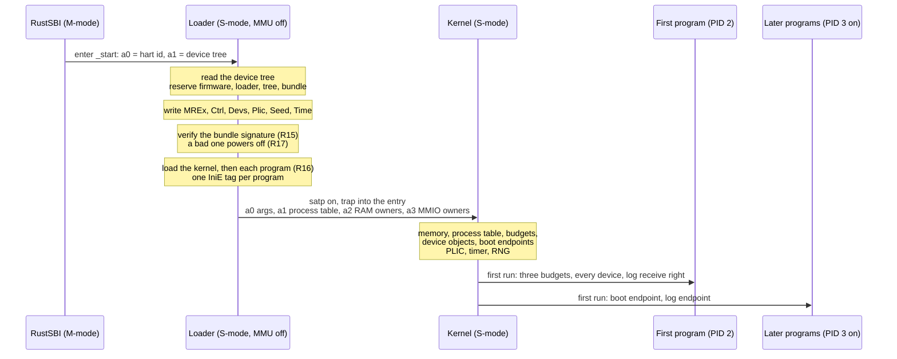
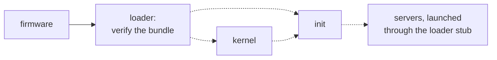

# Boot and verified boot

A Redoubt machine starts in four links: the RustSBI firmware, the loader, the kernel, and the
bundle's programs. The loader is the link that matters for what runs: it checks the Ed25519
signature on the **bundle** (a ustar archive of the kernel and the first programs) before it
reads a byte of it, loads the kernel and each program into an address space of its own,
describes the machine to the kernel in a tagged argument block, and jumps into the kernel.
Every refusal on the way powers the machine off. The kernel parses no device tree: what it
knows of the hardware is what the loader wrote.

## Purpose

Every guarantee the kernel makes is void if an attacker can choose the kernel. So the boot has
to do three things well: run nothing it has not authenticated, keep each program image inside
the address range meant for it, and stop rather than boot a machine it cannot describe
truthfully (no entropy, no clock, a signature that does not check). It also has to hand the
first programs their authority, and nothing else, in a form the kernel can check.

## Interface

### The chain

Status: built · tested: bench:rustsbi-boot


*Figure: one boot, from the firmware to the first programs.*

The firmware runs in M-mode and enters the loader in S-mode on one boot hart, with the MMU
off, `a0` = the hart id and `a1` = the physical address of the flattened device tree. The
signed bundle is the initrd: the device tree's `/chosen` node names its range. The other harts
stay parked in the firmware (multi-hart work: [smp](../beyond/smp.md)).

The loader ([`loader/src/main.rs`](../../loader/src/main.rs)) builds the kernel's address
space and one per program, then turns paging on and enters the kernel at `init`
([`kernel/src/main.rs`](../../kernel/src/main.rs)) with four physmap pointers: the argument
block, the initial-process table, the RAM ownership table and the MMIO ownership table. The
kernel is PID 1. Each later bundle entry is one program, PID 2, 3 and on, in bundle order. When
the kernel has set itself up it prints `KMAIN (clean boot)` and schedules the programs. One
loader, built for each width, serves rv32 (Sv32) and rv64 (Sv39); both widths boot.

### Firmware

Status: built · partly tested: that the bench never falls back to QEMU's own firmware is not attacked by a case · tested: bench:rustsbi-boot, bench:verified-boot-rejects-tamper

The only firmware is the **RustSBI Prototyper**, vendored in `bios/` at a pinned upstream commit
and built for both widths by `scripts/build-bios.sh`. Its `qemu-virt` feature compiles only QEMU
`virt`'s 16550 UART, SiFive CLINT and SiFive test (reset) drivers. The bench hands it to QEMU
with `-bios`; `RUSTSBI_PROTOTYPER` (rv64) and `RUSTSBI_PROTOTYPER_RV32` (rv32) may name
another build of it. A missing image fails the case (it is a skip only under `--allow-skip`),
and QEMU's bundled firmware is never used.

What the kernel takes from the firmware, all through SBI calls:
- the **debug console**, the kernel's only output (the kernel owns no UART);
- **TIME**, which arms the hart timer ([timer](timer.md));
- **SRST**, which powers off or reboots: the Reset device ([devices](devices.md)), and the end
  of every refusal and kernel panic, with the reason `SystemFailure`. RustSBI keeps that reason,
  so QEMU exits with status 255.

S-mode `ecall` belongs to the firmware, so the kernel's own switch into a thread enters the trap
handler as an `ecall` would, without executing one. A kernel built without the `sbi` feature
does not compile.

### The boot bundle

Status: built · tested: bench:rustsbi-boot, bench:bench-bundle-file, bench:loader-rejects-grants

The initrd is `signature (64 bytes) || tar`. The tar is a plain ustar archive:
- the **first entry is the kernel**, whatever its name;
- **every later entry is a program**, an ELF executable, started as PID 2, 3 and on, in archive
  order; a bundle of more than 63 programs is refused, because the kernel has room for
  `MAX_PROCESS_COUNT` (64) processes, its own included;
- an entry named `grants` is refused: a process reaches a device only through a handle to a
  device object ([R18 (device authority)](devices.md#r18-device-authority)).

Because every later entry is started as a program, a data entry after the programs is refused
as an invalid ELF: the loader reports its first four bytes and powers off. That is what
`bench-bundle-file` checks. The bytes arrive as they were signed, after the programs, but no
program can read them ([the planned handoff](#the-loader-loads-only-the-kernel-and-init)).
The loader prints each entry's name with its PID; the kernel is not told the names.

The bench's builder (`tools/testbench/src/build.rs`) packs the bundle: the kernel as
`kernel`, then the programs in PID order, then a case's `[[file]]` entries. It refuses two
entries with one name and signs the result ([verified boot](#verified-boot)). `./mkimage`
runs the same builder and writes `target/image/redoubt.bundle`.

### What the loader does

Status: built · tested: bench:rustsbi-boot, bench:loader-rejects-kernel-address, bench:loader-rejects-kernel-entry, bench:loader-rejects-truncated-elf, bench:loader-rejects-grants

1. **Reads the device tree** (`loader/src/dt.rs`, over `fdt-rs`), once, into one record: RAM,
   the initrd's range, `/chosen/rng-seed`, the timebase and hart count, every MMIO `reg`
   outside RAM, each device's interrupts, the console `/chosen/stdout-path` names and its
   interrupt, the PLIC with hart 0's S-mode context (the loader takes the boot hart to be hart
   0; Residual risks), and the CLINT. A region that does not
   start on a page is skipped and said so. Nothing after this step touches the tree.
2. **Keeps memory it must not hand out.** The allocator (`loader/src/alloc.rs`) gives out
   zeroed pages from the top of RAM down and never from the firmware (all RAM below the
   loader), the loader, the device tree or the bundle. Its first allocation is the **RAM
   ownership table**: one byte per page of RAM, the owning PID or 0, which becomes the kernel's
   allocation table. The firmware and the device tree are owned by PID 1, so no budget is ever
   given them. The loader's own pages and the bundle's are left unowned: the kernel reuses them.
   A second table, one byte per MMIO page, follows.
3. **Describes the machine**: the `MREx`, `Ctrl`, `Devs`, `Plic`, `Seed` and `Time` tags of
   the [argument block](#the-argument-block), all from the device tree. A seed under 16 bytes,
   or a tree with no console or no console interrupt, stops the boot here.
4. **Verifies the bundle** ([R15](#r15-verified-boot)). Only then does it parse the archive.
5. **Builds the address spaces.** The kernel's comes first: the physmap (physical memory up to
   the end of RAM, readable and writable, never executable;
   [memory layout](memory-layout.md)), the kernel ELF inside the kernel area with each
   read-only page write-protected in the physmap too
   ([R19 (kernel W^X)](memory.md#r19-kernel-wx)), its stack and trap stack, its per-process
   pages, and the page tables the kernel later maps its PLIC and its DMA register window into.
   Those tables are made before any program's address space copies the kernel's root entries,
   so every address space shares them. Then one per program: the kernel's root entries copied,
   the ELF inside the user area ([R16](#r16-image-confinement)), a stack under `0x8000_0000`
   of which the top page is backed and 31 more are reserved for the kernel to back on first
   touch ([memory](memory.md)), and its per-process pages. Each program adds one `IniE` tag.
6. **Enters the kernel.** It writes the initial-process table (one page; one `satp`, entry
   point and stack pointer per process, kernel first), completes `XArg`, and points `stvec` at
   the kernel's entry before writing `satp`. The next fetch faults, because the loader is not
   mapped in the kernel's address space, and the hart traps straight into the kernel with
   `a0`-`a3` and the stack pointer intact. Nothing of the loader runs again.

### The argument block

Status: built · partly tested: the kernel's refusals of a malformed block (a tag past the end, a second `MREx`, a `Devs` entry that names RAM or a controller, wraps or names interrupt 0, a `Grnt` tag) are not attacked by a case · tested: bench:rustsbi-boot, bench:device, bench:uart-irq, bench:rng

The block is `ARGS_PAGES` (4) pages of 32-bit words, written by `loader/src/args.rs` and read
by `kernel/src/args.rs`. It is a run of tags, `XArg` first:

```svgbob
 one tag: a header of two words, then its data
+-------------+----------------+----------------+-----------------+
| name        | crc16          | words          | data            |
| 4 ASCII     | low 16 bits    | high 16 bits   | words x u32     |
| bytes       | of word 1      | of word 1      |                 |
+-------------+----------------+----------------+-----------------+
  word 0        word 1                            word 2 on

 the block, in the order the loader writes it
+------+------+------+------+------+------+------+------+     +------+
| XArg | MREx | Ctrl | Devs | Plic | Seed | Time | IniE | ... | IniE |
+------+------+------+------+------+------+------+------+     +------+

 one Devs entry, six words
+------+---------+---------+---------+---------+-------+
| kind | a (lo)  | a (hi)  | b (lo)  | b (hi)  | flags |
+------+---------+---------+---------+---------+-------+
```
*Figure: the tag framing, the tags in block order, and one `Devs` entry.*

| Tag | Data | Read by (in `kernel/src/`) | If absent |
| --- | --- | --- | --- |
| `XArg` | block size in words, version (2), RAM start (2 words), RAM size (2), RAM name (`sram`) | `mem.rs` | the boot stops: it must be first |
| `MREx` | every MMIO region in the tree, controllers included, six words each: start (2), size in bytes rounded up to whole pages (2), the node name's first four bytes, 0 | `mem.rs`: the MMIO ownership table | no MMIO table; a second `MREx` stops the boot |
| `Ctrl` | the PLIC and CLINT ranges, four words each: base (2), size (2) | `device.rs` | no controller check |
| `Devs` | one entry per device object, six words each (below) | `device.rs` | no device objects |
| `Plic` | PLIC base (2), size (2), the PLIC's S-mode context of the boot hart (the hart ID the firmware passes in `a0`), matched to the cpu node whose `reg` is that ID, 0; a device tree with a PLIC but no S-mode context for the boot hart stops the boot (R17). The loader departs from this: it takes hart 0's context (Residual risks) | `arch/riscv/intc_plic.rs` | no external interrupts |
| `Seed` | `/chosen/rng-seed`: 16 to 64 bytes, zero-padded to words | `platform/sbi/rand.rs` | the boot stops ([R17](#r17-fail-closed)) |
| `Time` | the timebase: ticks of the `time` counter per second (2) | `arch/riscv/timer_sbi.rs` | the boot stops (R17) |
| `IniE` | nothing; one per program, counted to size the process table | `ptable.rs` | only the kernel runs |

| `Devs` kind | a | b | flags |
| --- | --- | --- | --- |
| 1, MMIO | physical base | size in bytes, whole pages | bit 0: the device does DMA |
| 2, IRQ | interrupt number | 0 | 0 |
| 3, Reset | 0 | 0 | 0 |

Every address and size is two words, low word first, so one layout serves both widths. The
kernel rebuilds each through `u64` and narrows it with a checked conversion (`args::wide`), so
a value that does not fit a `usize` stops the boot instead of being cut short. It reads the
block only as words, never as a cast structure, because the block promises 4-byte alignment
and a `u64` field needs 8. Its iterator stops at a header that does not fit and refuses a tag
whose data would run past the end. The CRC is written but not checked: the kernel takes the
block as the loader's.

The kernel turns each `Devs` entry into a device object at boot and refuses to boot on one that
is malformed: an MMIO range that is empty, not whole pages, wraps, overlaps RAM or overlaps a
`Ctrl` range; an IRQ entry naming 0; an unknown kind. It checks the controllers itself because
the loader's exclusion of them is a reading of a device tree the kernel does not trust
([devices](devices.md)). It also refuses a `Grnt` tag: device grants are not a boot input.

### Hardware abstraction

Status: built · tested: bench:rustsbi-boot, bench:uart-irq

Machines differ in ways unrelated to the register width, so code never uses `target_arch` to
mean "has a PLIC" or "runs under SBI".
- **Capability features** select backends in `kernel/Cargo.toml`: `sbi` (S-mode under SBI
  firmware: console, power-off, the timer, the RNG) and `plic` (the interrupt controller). New
  hardware is a new backend file and feature.
- **Board features** only compose them: `qemu-virt = ["sbi", "plic"]`.
- **Discovered, not written in:** RAM, MMIO regions, interrupts, the PLIC, the boot hart's context,
  the timebase and the seed come from the device tree, read by the loader alone. The kernel has
  no device-tree parser.
- **Width-bound only:** page-table geometry (`libs/paging`), the saved-context size and the trap
  assembly key on the pointer width ([memory layout](memory-layout.md)).

The **interrupt controller contract** (`kernel/src/arch/riscv/irq.rs`): a backend provides
`init`, `enable_irq`, `disable_irq`, `pending` (claim at most one interrupt) and `complete`.
The PLIC backend maps the controller at `KERNEL_PLIC_BASE` for the kernel alone, from the
`Plic` tag. The trap handler claims a source, completes it while it is still enabled (a PLIC
ignores a completion for a disabled source), then masks it until the holder's next `receive`
([R5 (interrupts)](devices.md#r5-interrupts)). Interrupt 0 is never a device: no PLIC has a
source 0, and the hart timer is the kernel's, arriving as a supervisor timer trap and not
through the PLIC ([timer](timer.md)). The loader drops an interrupt 0 that a device asks for.

### Devices handed to the first program

Status: built · partly tested: the loader's refusal of a tree with no console or no console interrupt, and the kernel's refusal of an object for a DMA device past the sixteenth, are not attacked by a case · tested: bench:device, bench:irq-attack, bench:rustsbi-boot

The kernel hands every device object to the bundle's first program, in `Devs` order, and
gives the others none. This is the built handoff, positional, and not the placement policy
([the planned handoff](#the-loader-loads-only-the-kernel-and-init)). Every loader program runs
in the `system` budget, which is charged for its pages ([budgets](budgets.md)).

| Program | Handle | What |
| --- | --- | --- |
| first (PID 2) | 1, 2, 3 | the `root`, `system` and `users` budgets |
| first | 4 | the Reset right |
| first | 5, 6 | the console's MMIO, then its interrupt |
| first | 7 on | every other MMIO region in device-tree order, then every other interrupt ascending |
| first | last | the receive right of the log endpoint |
| second (PID 3) | 1 | the receive right of the boot endpoint |
| each later one | 1 | the boot endpoint, badged with its own PID |
| every one but the first | 2 | the log endpoint, badged with its own PID |

The three positions after the budgets are fixed, so a tree that names no console, or a console
with no interrupt, is refused by the loader rather than booted with the indices shifted under a
program that pinned them. A DMA device the kernel has no reset slot for gets no object, and the
later indices close up. The handles to devices and budgets are stamped with `root`
([R9 (stamps)](objects.md#r9-stamps)), so only `root`'s destruction revokes them; the device
objects are charged to `system` and die with it.

### The loader loads only the kernel and `init`

Status: planned · M1 (separation and containment)


*Figure: the planned handoff. Dashed: planned.*

The bundle holds the kernel, `init`, the [boot manifest](../servers/init.md), every other
server's program and any data entries. The loader verifies it as it verifies every bundle, then
loads exactly two images: the kernel and `init`. There is one initial process, so `IniE` goes.

The kernel gives `init` the `root`, `system` and `users` budgets, every device object, the
Reset right, and the bundle's pages, read-only. `init` reads only the verified boot manifest.
The manifest names each device object, with its device-tree node path and whether it may do
DMA, and `init` places each driver's handles by name in that driver's startup block. Positional
indices end. `init` starts every other process through the loader stub, straight from the
bundle's pages, and parses no ELF itself ([init](../servers/init.md)). It refuses a manifest
that gives `keyd` the key the loader verifies the bundle with, since `keyd` cannot see that
itself ([keyd](../servers/keyd.md)).

Data entries, the bench's `[[file]]` entries among them, are then data: `init` or a program it
starts reads them from the bundle's pages. The case that proves it boots cleanly and has a
guest program read an injected entry back and compare its bytes; the refusal
`bench-bundle-file` checks does not satisfy that. The bundle's contents come from one recipe,
`image/boot.toml` (the kernel, `init`, `keyd`, `consoled`).

**Open:** how the bundle's pages reach `init` (pages mapped at boot, or a handle to a run of
them) and who pays for them, given that the built loader leaves them unowned for reuse; how a
device object is matched to the manifest's node path, since the kernel is given ranges and
numbers, not paths; the named-handle form of `map_device`'s result
([devices](devices.md)); the bench case that reads a data entry back after a clean boot; the
tool that builds the bundle from `image/boot.toml`, which no tool reads (`./mkimage` uses the
bench's builder).

### Verified boot

Status: built · partly tested: the two boot cases run on rv64 only; the rv32 loader's check is the same code, not attacked · tested: bench:verified-boot-rejects-tamper, bench:verified-boot-rejects-bare-archive, host:redoubt-signing::preamble_is_the_documented_bytes, host:redoubt-signing::domain_is_prefix_free, host:testbench::the_signed_bytes_are_the_documented_preimage, host:testbench::golden_signature_over_a_known_archive

- **Algorithm:** Ed25519 (RFC 8032), through the pure-Rust `no_std` crate `ed25519_compact`.
  One public key is compiled into the loader (`loader/src/verify.rs`). There is no algorithm
  choice and no second key.
- **Container:** the initrd is `signature (64 bytes) || tar`. An initrd shorter than 64 bytes
  is refused.
- **What is signed is not the bare archive.** The signature covers a domain-separated
  preimage: the 18-byte NUL-terminated domain `"redoubt.bundle.v1\0"`, the archive's length as
  a little-endian `u64`, then the archive. The domain's only NUL is its last byte, so no
  domain name is a prefix of another.
- **The length is measured, never read.** It is the number of bytes after the signature in the
  initrd the loader was handed, not a field of the archive, which is the attacker's to write.
- **One construction.** Both the loader and every signer take the 26-byte preamble from
  `redoubt_signing::bundle_preamble` ([`libs/signing`](../../libs/signing/src/lib.rs): `no_std`,
  no dependencies, `forbid(unsafe_code)`). The loader hashes the preamble and then the archive,
  copying nothing; the bench's builder writes the same two pieces. A host test pins the bytes,
  and a golden signature pins key, algorithm and preimage together.
- **No fallback.** A signature over the bare archive is refused like any other bad one, and a
  bad one powers the machine off ([R17](#r17-fail-closed)).

```svgbob
 the initrd, as the firmware hands it over
+----------------+---------------------------------------+
| signature      | tar                                   |
| 64 bytes       | len bytes: the rest of the initrd     |
+----------------+---------------------------------------+

 what the signature covers
+----------------------+--------------+------------------+
| "redoubt.bundle.v1"  | len          | tar              |
| and a NUL: 18 bytes  | u64 LE:      | len bytes        |
|                      | 8 bytes      |                  |
+----------------------+--------------+------------------+
 the preamble: 26 bytes, built in libs/signing
```
*Figure: the container, and the preimage the signature covers.*

**The development key.** The bench signs with a key derived from a fixed, public seed
(`[0x42; 32]`), so every build is reproducible and anyone can sign a bundle. Its public half is
`DEV_PUBLIC_KEY` in the loader. It is not a secret: a deployment generates a secret key and
compiles its public half in instead ([getting started](../../GETTING-STARTED.md)).

**What is not covered:**
- the loader itself: on QEMU the host loads it with `-kernel`, unchecked; on hardware a boot ROM
  or the firmware would verify it ([FPGA platform](../beyond/fpga-platform.md));
- M-of-N signatures, rollback protection and key rotation ([packages](../servers/pkg.md),
  M5 (persist, install, share));
- **confidentiality**: the bundle is signed, never encrypted. Verified boot gives integrity and
  authenticity. Whoever can read the bundle image reads all of it, including any key seeds the
  boot manifest carries for `keyd` ([keyd](../servers/keyd.md)).

### Randomness

Status: built · partly tested: that a short or missing seed stops the boot is not attacked by a case · tested: bench:rng

The loader copies `/chosen/rng-seed` (16 to 64 bytes; QEMU `virt` writes a fresh one each boot)
into the `Seed` tag, and refuses to boot with less than 16 bytes. The kernel folds the whole seed
into a 32-byte key by XOR and keys a **ChaCha8** generator with it
(`kernel/src/platform/sbi/rand.rs`); with no `Seed` tag it panics. There is no fallback: a
clock is not entropy. The kernel draws from it the PID of each process it creates and the
`random` call's values. `random` returns one `u64` per call, so a 32-byte key takes four calls
([ABI](abi.md)).

## Authority

Status: built · tested: bench:loader-rejects-grants, bench:irq-attack, bench:device

- **The firmware** keeps M-mode and its memory, which the ownership table gives to PID 1, so no
  budget ever receives it. It is in the TCB.
- **The loader** has the whole machine while it runs, and gives all of it away: RAM ownership
  and the argument block to the kernel, the images to their address spaces. It keeps nothing
  and leaves nothing running.
- **The bundle chooses code, not authority.** Its signature decides what runs; what each
  program holds is decided by the kernel's boot code alone (the table above). A `grants` entry
  is refused by the loader and a `Grnt` tag by the kernel, so no file in the bundle can grant a
  device.
- **The device tree chooses what exists,** not who holds it: it is the only source of device
  objects, and the kernel still refuses one that names RAM or an interrupt controller. The tree
  is the firmware's and the host's, and is not signed (Residual risks).
- **The first program holds every device and every budget** at boot. Every other program starts
  with two endpoint handles and nothing else, and the kernel refuses its attempts at the
  devices ([R18](devices.md#r18-device-authority)).

## Security properties

### R15 (verified boot)

Status: built · partly tested: the two boot cases run on rv64 only · tested: bench:verified-boot-rejects-tamper, bench:verified-boot-rejects-bare-archive, host:testbench::golden_signature_over_a_known_archive

No byte of the bundle is parsed or run before its signature checks. The loader reads only the
bundle's range from the device tree, verifies the signature over
`"redoubt.bundle.v1\0" || u64_le(len) || tar` with the one compiled-in key, and only then opens
the archive. A changed byte anywhere in the archive, a signature over the bare archive, another
domain's preimage or a wrong length does not verify, and the loader powers off instead of
printing `bundle signature ok`. The two boot cases forbid that line and the kernel's
`KMAIN`. Ed25519 accepts only the message that was signed, so a foreign domain or a wrong
length fails for free; the host test pins that, and the bare-archive case shows the loader has
no second acceptance path.

### R16 (image confinement)

Status: built · partly tested: an image cut short inside its segment data, a writable and executable segment and a bundle of more than 63 programs are not attacked by a case; the truncated-image case runs on rv64 only · tested: bench:loader-rejects-kernel-address, bench:loader-rejects-kernel-entry, bench:loader-rejects-truncated-elf

The loader confines every image to its area (`loader/src/image.rs`). Every loadable segment,
from its address to address plus memory size, and the entry point must lie in the area: for a
program, from `PAGE_SIZE` to `USER_AREA_END` (`0x8000_0000` on rv32, `0x40_0000_0000` on
rv64), so page 0 and the kernel's range are never program pages; for the kernel, the kernel area
(`KERNEL_AREA` to the top of the address space). A segment that wraps, or whose file size
exceeds its memory size, is refused. A truncated image is refused: program headers past the
end fail the ELF parse, and segment data past the end fails a bounds check. No page is mapped
writable and executable, or writable without readable (`libs/paging` refuses the entry), and no
page is mapped twice to different frames. This matters beyond the one process, because the
kernel's page tables are shared by every address space: a program segment in the kernel's range
would be written into all of them.

### R17 (fail closed)

Status: built · partly tested: a short or missing seed and a missing timebase are not attacked by a case (every QEMU boot supplies both); the two signature cases run on rv64 only; the loader departs from this for RAM past the physmap and for a boot hart with no PLIC context (Residual risks) · tested: bench:verified-boot-rejects-tamper, bench:verified-boot-rejects-bare-archive

The boot never runs degraded. Each of these powers the machine off through SBI SRST with
`SystemFailure` rather than boot: a bad bundle signature; an initrd too short to be signed; a
`/chosen/rng-seed` under 16 bytes, or a kernel given no `Seed` tag (PIDs and `random` would
be guessable); no timebase, which the loader reports by leaving out `Time` and
the kernel refuses (no timeout, slice or deadline would mean anything); no console or console
interrupt; a bundle that is not a tar, is empty, holds `grants` or too many programs; an image
R16 refuses; a full argument block; any argument-block refusal of the kernel's. A refusal of
the loader's prints `loader PANIC` and one of the kernel's a kernel panic; both then power off.
The two boot cases require the power-off and QEMU's status 255.

A device tree with a PLIC but no S-mode context for the boot hart stops the boot too
([the `Plic` row](#the-argument-block)); the loader departs from this by taking hart 0's
context.

The loader refuses to boot when RAM extends past `PHYSMAP_SIZE` (the size of the kernel's
direct physical map), with a clear message. The loader departs from this today: it maps the
physmap to the end of RAM without comparing the two (Residual risks).

## Failure and restart

Status: built · partly tested: a reboot through `system_reset` is not attacked by a case · tested: bench:verified-boot-rejects-tamper, bench:loader-rejects-grants, bench:device

- **A refused boot** powers off. Nothing retries it and nothing boots in its place: someone
  must fix the bundle or the machine.
- **A kernel panic** at boot or later powers off the same way.
- **A reboot** (`system_reset` with the Reset right, [devices](devices.md)) starts the chain
  again from the firmware, so the bundle is verified on every boot.
- **After the handoff the loader is gone.** Its pages and the bundle's are unowned in the
  ownership table and the kernel hands them out as free memory. The bundle cannot be re-read
  after boot.

## Residual risks

- **The loader itself is not verified on QEMU.** The host starts it with `-kernel`, and the
  firmware with `-bios`. Whoever can change those files on the host chooses the kernel, and
  verified boot is only as strong as the host. On hardware a boot ROM would check the loader
  ([FPGA platform](../beyond/fpga-platform.md)).
- **One development key, and it is public.** Anyone can sign a bundle the stock loader boots. A
  deployment must generate its own key and replace `DEV_PUBLIC_KEY`. There is one key, with no
  rotation and no M-of-N.
- **No rollback protection.** An older bundle, correctly signed, boots as readily as the
  latest. The rollback counter belongs to system updates ([packages](../servers/pkg.md),
  M5 (persist, install, share)).
- **Integrity, not confidentiality.** Seeds and anything else in the bundle are readable by
  whoever reads the bundle image; `keyd`'s seeds are the stated case ([keyd](../servers/keyd.md)).
  Bundle confidentiality is not claimed ([TENETS](../TENETS.md#threat-model)).
- **RustSBI is in the TCB.** It runs in M-mode below the kernel, sees all memory and answers
  every SBI call; a flaw in it is a flaw in Redoubt. It is vendored at a pinned commit and built
  with QEMU `virt`'s drivers only. Its domain support, which would partition harts between
  Redoubt and another OS, is unchecked, so nothing relies on it
  ([Linux on reserved cores](../beyond/linux-cores.md)).
- **The device tree is not signed.** It comes from the firmware and, on QEMU, from the host:
  RAM, the device list, the timebase and the seed are what it says. The kernel checks that no
  device object names RAM or a range the loader reported in `Ctrl`. A tree that hid an interrupt
  controller from the loader's controller searches as well as from its device exclusion would get
  it made into a device object, and its holder could mask or raise any interrupt. That parse is
  the loader's to get right.
- **The kernel trusts the loader.** It checks the argument block's shape and its device
  entries, but takes the RAM range, the ownership tables and the process table as true, and does
  not check the tags' CRC. On QEMU the loader is not verified (above).
- **The kernel's argument-block refusals are argued from the code**, not attacked by a case;
  nor are the short-seed and missing-timebase refusals (R17) or the three R16 gaps
  ([attack gaps](../todo/kernel-attack-gaps.md)).
- **RAM past the physmap is not refused at boot.** The loader maps the physmap to the end of
  RAM, but the kernel's window stops at `PHYSMAP_SIZE` (128 GiB on Sv39), and nothing compares
  the two. On a machine with more RAM the kernel boots, then stops the first time it uses a
  frame past the bound, which a process can cause by allocating
  ([memory layout](memory-layout.md#residual-risks)). Follow-up:
  [todo](../todo/physmap-ram-bound.md).
- **The loader takes the boot hart to be hart 0,** departing from the `Plic` row's rule. It
  reads the PLIC context of the CPU whose `reg` is 0 (`loader/src/dt.rs`), not of the hart ID
  the firmware passes in `a0`. On firmware whose boot hart is another, the failure is silent: if
  hart 0 has an S-mode context, the kernel enables interrupts there, they are raised on the
  parked hart 0, and no driver hears its device; if it has none, the boot goes on with no
  `Plic` tag and no external interrupts. No interrupt reaches the wrong owner, because claims
  and R5 (interrupts) route by source. Follow-up: [todo](../todo/boot-hart-context.md).
- **Device indices are positional.** Past the fixed three, a device's handle index depends on
  the device tree's order and on which DMA devices the kernel could register. A program that
  pins one depends on the machine. Placement by name is planned
  ([above](#the-loader-loads-only-the-kernel-and-init)).

## Why

- **Verify before parsing.** The tar and ELF parsers are large and see attacker bytes. Checking
  the signature first means they only ever see bytes the key holder signed, and it is the one
  check every later guarantee rests on.
- **A domain on the bundle signature.** A ustar header starts with a 100-byte name field of
  arbitrary bytes, and another protocol's domain and length fit inside it, so without a domain
  of its own a signature made for something else could cover a well-formed archive. Every
  Redoubt signature domain is a NUL-terminated name and a fixed-width length, built in one crate,
  so the names are prefix-free and no signature reads as another protocol's message.
- **Measure the length.** A length read out of the signed bytes is a length the attacker
  chose; the container's own size is not.
- **One embedded key, no agility.** Negotiating an algorithm or a key is a second acceptance
  path, and the bare-archive case exists to show there is none.
- **The device tree stays in the loader.** Parsing a tree is a large job over firmware input.
  Done once, before the kernel runs, it keeps a parser out of the kernel; the kernel then
  checks the few facts it must not get wrong (no RAM, no controller) in words it can read.
- **Fail closed.** A machine without entropy hands out guessable identifiers, and one without a
  timebase has timeouts that mean nothing. Both would boot and look fine. Stopping is the only
  outcome nobody can mistake for success.
- **Enter the kernel by a fault.** Pointing `stvec` at the kernel's entry and letting the fetch
  after `satp` fault avoids building an identity mapping that would outlive the loader.
