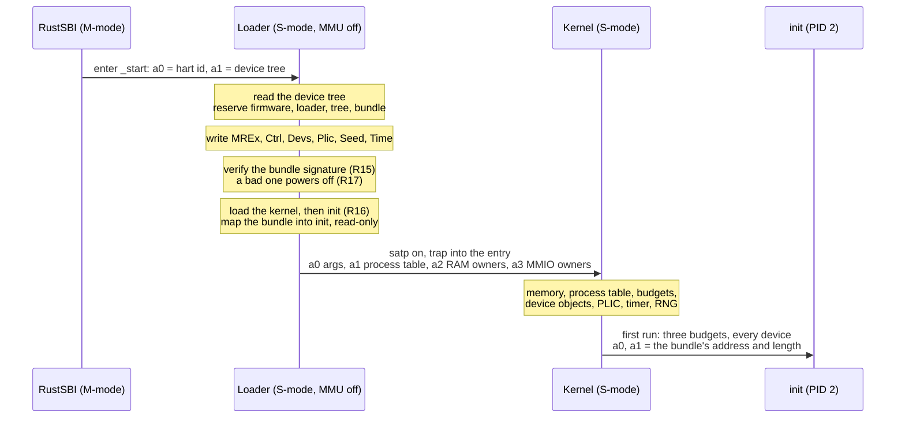
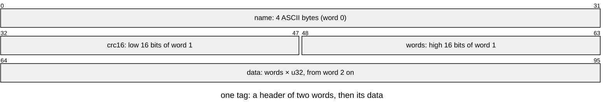
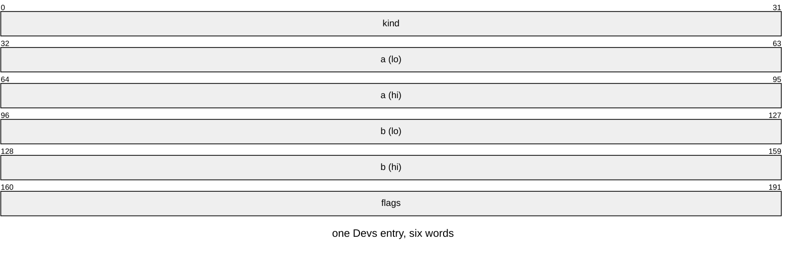
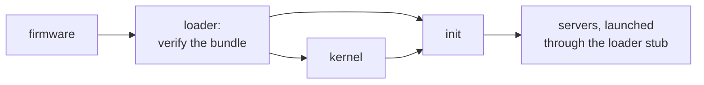
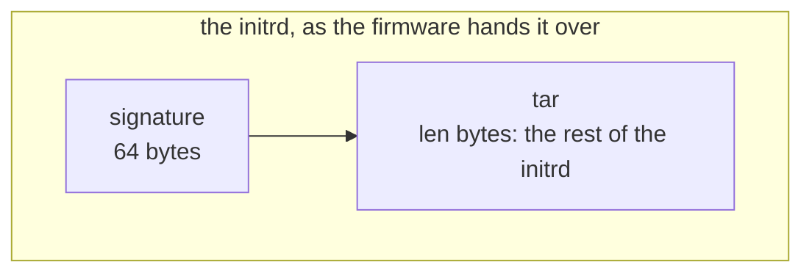
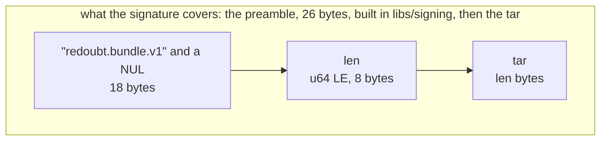

# Boot and verified boot

A Redoubt machine starts in four links: the RustSBI firmware, the loader, the kernel, and
`init`. The loader is the link that matters for what runs: it checks the Ed25519 signature on
the **bundle** (a ustar archive of the kernel, `init` and everything `init` starts) before it
reads a byte of it, loads the kernel and `init` into an address space each, maps the bundle into
`init`, describes the machine to the kernel in a tagged argument block, and jumps into the
kernel.
Every refusal on the way powers the machine off. The kernel parses no device tree: what it
knows of the hardware is what the loader wrote.

## Purpose

Every guarantee the kernel makes is void if an attacker can choose the kernel. So the boot has
to do three things well: run nothing it has not authenticated, keep each program image inside
the address range meant for it, and stop rather than boot a machine it cannot describe
truthfully (no entropy, no clock, a signature that does not check). It also has to hand the
first program, `init`, its authority, and nothing else, in a form the kernel can check.

## Interface

### The chain

Status: built · tested: bench:rustsbi-boot

```mermaid
sequenceDiagram
    participant F as RustSBI (M-mode)
    participant L as Loader (S-mode, MMU off)
    participant K as Kernel (S-mode)
    participant P as init (PID 2)
    F->>L: enter _start: a0 = hart id, a1 = device tree
    Note over L: read the device tree<br/>reserve firmware, loader, tree, bundle
    Note over L: write MREx, Ctrl, Devs, Plic, Seed, Time
    Note over L: verify the bundle signature (R15)<br/>a bad one powers off (R17)
    Note over L: load the kernel, then init (R16)<br/>map the bundle into init, read-only
    L->>K: satp on, trap into the entry<br/>a0 args, a1 process table, a2 RAM owners, a3 MMIO owners
    Note over K: memory, process table, budgets,<br/>device objects, PLIC, timer, RNG
    K->>P: first run: three budgets, every device<br/>a0, a1 = the bundle's address and length
```
*Figure: one boot, from the firmware to `init`.*

The firmware runs in M-mode and enters the loader in S-mode on one boot hart, with the MMU
off, `a0` = the hart id and `a1` = the physical address of the flattened device tree. The
signed bundle is the initrd: the device tree's `/chosen` node names its range. The kernel
starts the other harts, up to 8, through SBI's hart state management; a hart past the eighth
stays parked, and the kernel says so once
([several harts](../plan/m2-usable-shell.md#several-harts)).

The loader ([`loader/src/main.rs`](../../loader/src/main.rs)) builds the kernel's address
space and `init`'s, then turns paging on and enters the kernel at its `init` function
([`kernel/src/main.rs`](../../kernel/src/main.rs)) with four physmap pointers: the argument
block, the initial-process table, the RAM ownership table and the MMIO ownership table. The
kernel is PID 1 and `init`, the bundle's second entry, PID 2. When the kernel has set itself up
it prints `KMAIN (clean boot)` and schedules `init`, which starts everything else. One loader,
built for each width, serves rv32 (Sv32) and rv64 (Sv39); both widths boot.

### Firmware

Status: built · partly tested: that the bench never falls back to QEMU's own firmware is not attacked by a case · tested: bench:rustsbi-boot, bench:verified-boot-rejects-tamper

The only firmware is the **RustSBI Prototyper**, vendored in `bios/` at a pinned upstream commit
and built for both widths by `scripts/build-bios.sh`. Its `qemu-virt` feature compiles only QEMU
`virt`'s 16550 UART, SiFive CLINT and SiFive test (reset) drivers. The bench hands it to QEMU
with `-bios`; `RUSTSBI_PROTOTYPER` (rv64) and `RUSTSBI_PROTOTYPER_RV32` (rv32) may name
another build of it. A missing image fails the case (it is a skip only under `--allow-skip`),
and QEMU's bundled firmware is never used.

What the kernel takes from the firmware, all through SBI calls:
- the **debug console**, the kernel's only output (the kernel owns no UART);
- **TIME**, which arms the hart timer ([timer](timer.md));
- **SRST**, which powers off or reboots: the Reset device ([devices](devices.md)), and the end
  of every refusal and kernel panic, with the reason `SystemFailure`. RustSBI keeps that reason,
  so QEMU exits with status 255.

S-mode `ecall` belongs to the firmware, so the kernel's own switch into a thread enters the trap
handler as an `ecall` would, without executing one. A kernel built without the `sbi` feature
does not compile.

### The boot bundle

Status: built · tested: bench:rustsbi-boot, bench:bundle-mapped

The initrd is `signature (64 bytes) || tar`. The tar is a plain ustar archive:
- the **first entry is the kernel**, whatever its name;
- the **second entry is `init`**, or the program in its place, whatever its name: an ELF
  executable, started as PID 2, the one program the loader starts;
- **every later entry is data** to the loader, which reads no entry it does not load
  ([the handoff](#the-loader-loads-only-the-kernel-and-init)).

The loader prints the two names it loads with their PIDs; the kernel is not told the names.

The bench's builder (`tools/testbench/src/build.rs`) packs the bundle: the kernel as
`kernel`, then the programs in PID order, then a case's `[[file]]` entries. It refuses two
entries with one name and signs the result ([verified boot](#verified-boot)). `./mkimage`
runs the same builder and writes `target/image/redoubt.bundle`.

### What the loader does

Status: built · tested (5)

- bench:rustsbi-boot
- bench:bundle-mapped
- bench:loader-rejects-kernel-address
- bench:loader-rejects-kernel-entry
- bench:loader-rejects-truncated-elf

1. **Reads the device tree** (`loader/src/dt.rs`, over `fdt-rs`), once, into one record: RAM,
   the initrd's range, `/chosen/rng-seed`, the timebase and hart count, every MMIO `reg`
   outside RAM, each device's interrupts, the console `/chosen/stdout-path` names and its
   interrupt, the PLIC with the boot hart's S-mode context (the hart ID the firmware passes in
   `a0`), and the CLINT. A region that does not start on a page is skipped and said so. Nothing after this step touches the tree.
2. **Keeps memory it must not hand out.** The allocator (`loader/src/alloc.rs`) gives out
   zeroed pages from the top of RAM down and never from the firmware (all RAM below the
   loader), the loader, the device tree or the bundle. Its first allocation is the **RAM
   ownership table**: two bytes per page of RAM, the owning PID or 0, which becomes the kernel's
   allocation table. The firmware and the device tree are owned by PID 1, so no budget is ever
   given them. The bundle's pages are `init`'s (step 5). The loader's own pages are left
   unowned: the kernel reuses them.
   A second table, two bytes per MMIO page, follows. Both are `redoubt_layout`'s `Option<Pid>`,
   the same type on both sides of the handoff.
3. **Describes the machine**: the `MREx`, `Ctrl`, `Devs`, `Plic`, `Hart`, `Seed` and `Time` tags of
   the [argument block](#the-argument-block), all from the device tree. A seed under 16 bytes,
   or a tree with no console or no console interrupt, stops the boot here.
4. **Verifies the bundle** ([R15](#r15-verified-boot)). Only then does it parse the archive.
5. **Builds the address spaces.** The kernel's comes first: the physmap (physical memory up to
   the end of RAM, readable and writable, never executable;
   [memory layout](memory-layout.md)), the kernel ELF inside the kernel area with each
   read-only page write-protected in the physmap too
   ([R19 (kernel W^X)](memory.md#r19-kernel-wx)), its stack and trap stack, its per-process
   pages, and the page tables the kernel later maps its PLIC and its DMA register window into.
   Those tables are made before any program's address space copies the kernel's root entries,
   so every address space shares them. Then `init`'s, from the bundle's second entry: the
   kernel's root entries copied, the ELF inside the user area
   ([R16](#r16-image-confinement)), a stack under `0x8000_0000` of which the top page is backed
   and 31 more are reserved for the kernel to back on first touch ([memory](memory.md)), its
   per-process pages, and the whole initrd, signature and archive, mapped read-only at
   `BUNDLE_AT` (`0x2000_0000`, both widths), its pages owned by PID 2. A bundle that does not
   start on a page, is larger than the 512 MiB between `BUNDLE_AT` and the message area, or
   shares a page with the device tree is refused, and so is an `init` whose image overlaps the
   mapping. The loader parses no entry after the second.
6. **Enters the kernel.** It writes the initial-process table (one page; two records, the
   kernel's and then `init`'s, each a PID, a `satp`, an entry point, a stack pointer and the first
   thread's `a0` and `a1`: for `init`, the bundle's address and length), completes `XArg`, and
   points `stvec` at the kernel's entry before writing `satp`. The next fetch faults, because
   the loader is not mapped in the kernel's address space, and the hart traps straight into the
   kernel with `a0`-`a3` and the stack pointer intact. Nothing of the loader runs again.

### The argument block

Status: built · partly tested: the kernel's refusals of a malformed block (a tag past the end, a second `MREx`, a `Devs` entry that names RAM or a controller, wraps or names interrupt 0 or one at or above 1024, a `Grnt` tag) are not attacked by a case · tested (4)

- bench:rustsbi-boot
- bench:device
- bench:uart-irq
- bench:rng

The block is `ARGS_PAGES` (4) pages of 32-bit words, written by `loader/src/args.rs` and read
by `kernel/src/args.rs`. It is a run of tags, `XArg` first:

```mermaid
packet-beta
title one tag: a header of two words, then its data
0-31: "name: 4 ASCII bytes (word 0)"
32-47: "crc16: low 16 bits of word 1"
48-63: "words: high 16 bits of word 1"
64-95: "data: words × u32, from word 2 on"
```

```mermaid
flowchart LR
    XArg --> MREx --> Ctrl --> Devs --> Plic --> Hart --> Seed --> Time
```

```mermaid
packet-beta
title one Devs entry, six words
0-31: "kind"
32-63: "a (lo)"
64-95: "a (hi)"
96-127: "b (lo)"
128-159: "b (hi)"
160-191: "flags"
```
*Figure: the tag framing, the tags in block order, and one `Devs` entry.*

| Tag | Data | Read by (in `kernel/src/`) | If absent |
| --- | --- | --- | --- |
| `XArg` | block size in words, version (2), RAM start (2 words), RAM size (2), RAM name (`sram`) | `mem.rs` | the boot stops: it must be first |
| `MREx` | every MMIO region in the tree, controllers included, six words each: start (2), size in bytes rounded up to whole pages (2), the node name's first four bytes, 0 | `mem.rs`: the MMIO ownership table | no MMIO table; a second `MREx` stops the boot |
| `Ctrl` | the PLIC and CLINT ranges, four words each: base (2), size (2) | `device.rs` | no controller check |
| `Devs` | one entry per device object, six words each (below) | `device.rs` | no device objects |
| `Plic` | PLIC base (2), size (2), the PLIC's S-mode context of the boot hart (the hart ID the firmware passes in `a0`), matched to the cpu node whose `reg` is that ID, 0; a device tree with a PLIC but no S-mode context for the boot hart stops the boot (R17). | `arch/riscv/intc_plic.rs` | no external interrupts |
| `Hart` | the cpu nodes in the tree, the harts listed, then each listed hart's id (2), the boot hart first: by boot index, at most `MAX_HARTS` (8), in tree order. A hart past the eighth, or whose PLIC S-mode context is not inside the PLIC's window, is left out and stays parked; the loader maps each listed hart's kernel and trap stacks in `HART_STACKS` ([memory layout](memory-layout.md)), and a boot hart whose context is past the window stops the boot (R17). | `arch/riscv/hart.rs` | the boot hart runs alone |
| `Seed` | `/chosen/rng-seed`: 16 to 64 bytes, zero-padded to words | `platform/sbi/rand.rs` | the boot stops ([R17](#r17-fail-closed)) |
| `Time` | the timebase: ticks of the `time` counter per second (2) | `arch/riscv/timer_sbi.rs` | the boot stops (R17) |

| `Devs` kind | a | b | flags |
| --- | --- | --- | --- |
| 1, MMIO | physical base | size in bytes, whole pages | bit 0: the device does DMA |
| 2, IRQ | interrupt number | 0 | 0 |
| 3, Reset | 0 | 0 | 0 |

Every address and size is two words, low word first, so one layout serves both widths. The
kernel rebuilds each through `u64` and narrows it with a checked conversion (`args::wide`), so
a value that does not fit a `usize` stops the boot instead of being cut short. It reads the
block only as words, never as a cast structure, because the block promises 4-byte alignment
and a `u64` field needs 8. Its iterator stops at a header that does not fit and refuses a tag
whose data would run past the end. The CRC is written but not checked: the kernel takes the
block as the loader's.

The kernel turns each `Devs` entry into a device object at boot and refuses to boot on one that
is malformed: an MMIO range that is empty, not whole pages, wraps, overlaps RAM or overlaps a
`Ctrl` range; an IRQ entry naming 0; an unknown kind. It checks the controllers itself because
the loader's exclusion of them is a reading of a device tree the kernel does not trust
([devices](devices.md)). It also refuses a `Grnt` tag: device grants are not a boot input.

### Hardware abstraction

Status: built · tested: bench:rustsbi-boot, bench:uart-irq

Machines differ in ways unrelated to the register width, so code never uses `target_arch` to
mean "has a PLIC" or "runs under SBI".
- **Capability features** select backends in `kernel/Cargo.toml`: `sbi` (S-mode under SBI
  firmware: console, power-off, the timer, the RNG) and `plic` (the interrupt controller). New
  hardware is a new backend file and feature.
- **Board features** only compose them: `qemu-virt = ["sbi", "plic"]`.
- **Discovered, not written in:** RAM, MMIO regions, interrupts, the PLIC, the boot hart's context,
  the timebase and the seed come from the device tree, read by the loader alone. The kernel has
  no device-tree parser.
- **Width-bound only:** page-table geometry (`libs/paging`), the saved-context size and the trap
  assembly key on the pointer width ([memory layout](memory-layout.md)).

The **interrupt controller contract** (`kernel/src/arch/riscv/irq.rs`): a backend provides
`init`, `enable_irq`, `disable_irq`, `pending` (claim at most one interrupt) and `complete`.
The PLIC backend maps the controller at `KERNEL_PLIC_BASE` for the kernel alone, from the
`Plic` tag. The trap handler claims a source, completes it while it is still enabled (a PLIC
ignores a completion for a disabled source), then masks it until the holder's next `receive`
([R5 (interrupts)](devices.md#r5-interrupts)). Interrupt 0 is never a device: no PLIC has a
source 0, and the hart timer is the kernel's, arriving as a supervisor timer trap and not
through the PLIC ([timer](timer.md)). The loader drops an interrupt 0 that a device asks for.

### Hardware bounds

Status: built · partly tested: the compile-time bounds hold by the build and are not attacked by a case; the loader's device-table refusal and the kernel's ASID-width refusal are tested on the host, not by a boot (every QEMU hart has the whole field) · tested: host:loader::a_33rd_mmio_region_is_refused, host:loader::a_33rd_interrupt_is_refused, host:loader::thirty_two_devices_are_kept, host:loader::an_interrupt_two_devices_raise_takes_one_slot, host:loader::harts_are_listed_by_boot_index_never_by_id, host:loader::harts_past_max_harts_stay_parked, host:loader::a_hart_whose_s_mode_context_is_past_the_plic_window_stays_parked, host:loader::a_boot_hart_whose_context_is_past_the_plic_window_is_refused, host:paging::the_asid_width_decision

Every constant that mirrors a hardware field or a platform limit is held to it. A field the
ISA fixes is a compile-time assert on each width, so a build that breaks it does not exist. A
limit the platform reports is checked when the loader or kernel reads it, and a machine past it
is refused ([R17 (fail closed)](#r17-fail-closed)), never truncated.

| Constant | Field or limit | Checked |
| --- | --- | --- |
| `MAX_PROCESS_COUNT` | `satp`'s ASID, 9 bits in Sv32 and 16 in Sv39 ([`satp`](memory-layout.md#satp)) | compile time |
| `ASID_BITS` | the hart's satp ASID field, found by writing ones to it | at boot |
| `MAX_THREADS` | the kernel's 8-bit last-TID field | compile time |
| `USER_AREA_END` | Sv39's lower half (2^38 bytes); Sv32's half below the kernel's | compile time |
| the kernel-half bases (rv64) | Sv39 canonical addresses | compile time |
| the PTE and satp PPN | Sv32's 22 bits, Sv39's 44 | follows from the physmap's bounds |
| the handle slot's frame index | the physmap's frames | compile time |
| the kernel's windows (PLIC, DMA registers, process area, stacks) | each other and the physmap | compile time |
| the physmap | the RAM the platform reports | at boot |
| the PLIC window | the PLIC's reported size | at boot |
| `MAX_HARTS` (8) | the harts in the tree, numbered by the platform sparsely and widely: per-hart state is by dense boot index, and a hart past the eighth stays parked | at boot (loader) |
| a started hart's PLIC S-mode context | inside the PLIC's reported window; another hart's that is not stays parked, the boot hart's stops the boot | at boot (loader) |
| `HART_STACKS` | `MAX_HARTS` slots of 18 pages, inside the kernel area below the image, 1 MiB on Sv32 ([the two address maps](memory-layout.md#the-two-address-maps)) | compile time |
| `MAX_IRQS` (1024) | the PLIC's sources, 1 to 1023 | at boot, per device |
| the loader's device table (32 regions, 32 interrupts) | the device tree's devices | at boot |
| the timebase | `timebase-frequency`, not 0 | at boot |
| the kernel's tables | its 1 MiB data region | at link time |

Two hold by design rather than by a check: every 64-bit value in the ABI takes two registers
on both widths ([ABI](abi.md)), and the DMA pool lies within every device's reach because
virtio addresses are 64 bits. The firmware programs PMP; the kernel and loader program none.

### Devices handed to the first program

Status: built · partly tested: the loader's refusal of a tree with no console or no console interrupt, and the kernel's refusal of an object for a DMA device past the sixteenth, are not attacked by a case · tested: bench:device, bench:irq-attack, bench:rustsbi-boot

The kernel hands every device object to `init`, the one process the loader starts, in `Devs`
order. The order is positional; `init` learns which device each handle names from
[`device_info`](devices.md#device_info). `init` runs in `root`
([budgets](budgets.md#the-tree-from-the-boot-manifest)).

| Handle | What |
| --- | --- |
| 1, 2, 3 | the `root`, `system` and `users` budgets |
| 4 | the Reset right |
| 5, 6 | the console's MMIO, then its interrupt |
| 7 on | every other MMIO region in device-tree order, then every other interrupt ascending |

The three positions after the budgets are fixed, so a tree that names no console, or a console
with no interrupt, is refused by the loader rather than booted with the indices shifted under a
program that pinned them. A DMA device the kernel has no reset slot for gets no object, and the
later indices close up. The handles to devices and budgets are stamped with `root`
([R9 (stamps)](objects.md#r9-stamps)), so only `root`'s destruction revokes them; the device
objects are charged to `system` and die with it.

### The loader loads only the kernel and `init`

Status: built · tested: bench:bundle-mapped, bench:device-info-attack

```mermaid
flowchart LR
    F[firmware] --> L[loader:<br/>verify the bundle]
    L --> K[kernel]
    L --> I[init]
    K --> I
    I --> S[servers, launched<br/>through the loader stub]
```
*Figure: the handoff. Dashed: planned ([what `init` does with the bundle](#what-init-does-with-the-bundle)).*

The bundle holds the kernel, `init`, the [boot manifest](../servers/init.md), every other
server's program and any data entries. The first entry is the kernel and the second is `init`,
whatever their names. Every later entry is data to the loader. The loader verifies the bundle as
it verifies every bundle, then loads exactly two images, the kernel and `init`. There is one
initial process.

The kernel gives `init` the `root`, `system` and `users` budgets, the Reset right and every
device object, in fixed slots
([devices handed to the first program](#devices-handed-to-the-first-program)). `init` runs in
`root`, on the process, the weight and the pages `root` keeps for it
([budgets](budgets.md#the-tree-from-the-boot-manifest)). The loader also maps the whole
verified bundle into `init`, read-only: signature and archive, at `BUNDLE_AT` (`0x2000_0000`),
outside `init`'s link range ([memory layout](memory-layout.md#regions)). `init`, which is
trusted, keeps it read-only; a program it starts never holds a bundle frame, only copies of
what it reads. Its frames are charged to `root` as part of what the loader gave `init`, and
they stay for as long as `init` runs, because `init` launches from them again when it restarts
a server. `init`'s first thread starts with the bundle's address in `a0` and its length in
`a1`. The archive was verified before the loader parsed it, and `init` reads it only within
that length.

No later entry's name means anything to the loader. An entry named `grants` is data like any
other and grants nothing. The loader reads no entry it does not load, and the kernel refuses a
`Grnt` tag, so no file in the bundle grants a device to either of them. What a server holds is
`init`'s to place, from the manifest ([devices](devices.md#which-process-gets-which-device)).

### What `init` does with the bundle

Status: built · tested (6)

- bench:init-boot
- bench:init-servers
- bench:init-refuses-held-bundle-key
- bench:init-refuses-device-unmatched
- bench:bench-bundle-file
- host:testbench::the_image_recipe_packs_init_the_servers_and_the_manifest

`init` learns which device each handle names from the kernel, with
[`device_info`](devices.md#device_info), and matches that to the manifest, which names each
device by its register base and its interrupt
([devices](devices.md#which-process-gets-which-device)). `init` places each driver's handles by
name in that driver's startup block, and drivers use no positional indices. `init` starts every
other process through the loader stub, straight from the bundle's pages, and parses no ELF
itself ([init](../servers/init.md)). It refuses a manifest that gives `keyd` the key the loader
verifies the bundle with, since `keyd` cannot see that itself ([keyd](../servers/keyd.md)).

Data entries, the bench's `[[file]]` entries among them, are then data. `init` reads the
manifest from the bundle's pages, and a program reads a public entry through `bootfsd`
([bootfsd](../servers/bootfsd.md)). `bench-bundle-file` already reads its injected entry back
from the bundle's pages in `init`'s place, and a case under `init` reads it again through `/boot`
([test bench](../testbench.md#data-entries-for-init)). The bundle's contents come from one
recipe, `image/boot.toml`: the kernel, `init`, the manifest and the servers. The bench's
builder is the one tool that packs a bundle. It reads a case for the bench, and `image/boot.toml`
for `./mkimage` and for `init-boot`, which boots the recipe's bundle to `init`'s last line.

### Verified boot

Status: built · partly tested: the two boot cases run on rv64 only; the rv32 loader's check is the same code, not attacked · tested (6)

- bench:verified-boot-rejects-tamper
- bench:verified-boot-rejects-bare-archive
- host:redoubt-signing::preamble_is_the_documented_bytes
- host:redoubt-signing::domain_is_prefix_free
- host:testbench::the_signed_bytes_are_the_documented_preimage
- host:testbench::golden_signature_over_a_known_archive

- **Algorithm:** Ed25519 (RFC 8032), through the pure-Rust `no_std` crate `ed25519_compact`.
  One public key is compiled into the loader (`loader/src/verify.rs`). There is no algorithm
  choice and no second key.
- **Container:** the initrd is `signature (64 bytes) || tar`. An initrd shorter than 64 bytes
  is refused.
- **What is signed is not the bare archive.** The signature covers a domain-separated
  preimage: the 18-byte NUL-terminated domain `"redoubt.bundle.v1\0"`, the archive's length as
  a little-endian `u64`, then the archive. The domain's only NUL is its last byte, so no
  domain name is a prefix of another.
- **The length is measured, never read.** It is the number of bytes after the signature in the
  initrd the loader was handed, not a field of the archive, which is the attacker's to write.
- **One construction.** Both the loader and every signer take the 26-byte preamble from
  `redoubt_signing::bundle_preamble` ([`libs/signing`](../../libs/signing/src/lib.rs): `no_std`,
  no dependencies, `forbid(unsafe_code)`). The loader hashes the preamble and then the archive,
  copying nothing; the bench's builder writes the same two pieces. A host test pins the bytes,
  and a golden signature pins key, algorithm and preimage together.
- **No fallback.** A signature over the bare archive is refused like any other bad one, and a
  bad one powers the machine off ([R17](#r17-fail-closed)).

```mermaid
flowchart LR
    subgraph initrd["the initrd, as the firmware hands it over"]
        direction LR
        sig["signature<br/>64 bytes"] --> tar["tar<br/>len bytes: the rest of the initrd"]
    end
```

```mermaid
flowchart LR
    subgraph covered["what the signature covers: the preamble, 26 bytes, built in libs/signing, then the tar"]
        direction LR
        d["#quot;redoubt.bundle.v1#quot; and a NUL<br/>18 bytes"] --> l["len<br/>u64 LE, 8 bytes"] --> t["tar<br/>len bytes"]
    end
```
*Figure: the container, and the preimage the signature covers.*

**The development key.** The bench signs with a key derived from a fixed, public seed
(`[0x42; 32]`), so every build is reproducible and anyone can sign a bundle. Its public half is
`DEV_PUBLIC_KEY` in the loader. It is not a secret: a deployment generates a secret key and
compiles its public half in instead ([getting started](../../GETTING-STARTED.md)).

**What is not covered:**
- the loader itself: on QEMU the host loads it with `-kernel`, unchecked; on hardware a boot ROM
  or the firmware would verify it ([FPGA platform](../beyond/fpga-platform.md));
- M-of-N signatures, rollback protection and key rotation ([packages](../servers/pkg.md),
  M5 (persist, install, share));
- **confidentiality**: the bundle is signed, never encrypted. Verified boot gives integrity and
  authenticity. Whoever can read the bundle image reads all of it, including any key seeds the
  boot manifest carries for `keyd` ([keyd](../servers/keyd.md)).

### Randomness

Status: built · partly tested: that a short or missing seed stops the boot is not attacked by a case · tested: bench:rng

The loader copies `/chosen/rng-seed` (16 to 64 bytes; QEMU `virt` writes a fresh one each boot)
into the `Seed` tag, and refuses to boot with less than 16 bytes. The kernel folds the whole seed
into a 32-byte key by XOR and keys a **ChaCha8** generator with it
(`kernel/src/platform/sbi/rand.rs`); with no `Seed` tag it panics. There is no fallback: a
clock is not entropy. The kernel draws from it the PID of each process it creates and the
`random` call's values. `random` returns one `u64` per call, so a 32-byte key takes four calls
([ABI](abi.md)).

## Authority

Status: built · tested: bench:irq-attack, bench:device, bench:device-info-attack

- **The firmware** keeps M-mode and its memory, which the ownership table gives to PID 1, so no
  budget ever receives it. It is in the TCB.
- **The loader** has the whole machine while it runs, and gives all of it away: RAM ownership
  and the argument block to the kernel, the images to their address spaces. It keeps nothing
  and leaves nothing running.
- **The bundle chooses code, not authority.** Its signature decides what runs; what each
  program holds is decided by the kernel's boot code alone (the table above). The loader reads
  no entry it does not load, and the kernel refuses a `Grnt` tag, so no file in the bundle can
  grant a device.
- **The device tree chooses what exists,** not who holds it: it is the only source of device
  objects, and the kernel still refuses one that names RAM or an interrupt controller. The tree
  is the firmware's and the host's, and is not signed (Residual risks).
- **`init` holds every device and every budget** at boot, and is the only process the kernel
  starts. Every other process holds what `init` hands it, and the kernel refuses its attempts at
  any device it was not given ([R18 (device authority)](devices.md#r18-device-authority)).

## Security properties

### R15 (verified boot)

Status: built · partly tested: the two boot cases run on rv64 only · tested: bench:verified-boot-rejects-tamper, bench:verified-boot-rejects-bare-archive, host:testbench::golden_signature_over_a_known_archive

No byte of the bundle is parsed or run before its signature checks. The loader reads only the
bundle's range from the device tree, verifies the signature over
`"redoubt.bundle.v1\0" || u64_le(len) || tar` with the one compiled-in key, and only then opens
the archive. A changed byte anywhere in the archive, a signature over the bare archive, another
domain's preimage or a wrong length does not verify, and the loader powers off instead of
printing `bundle signature ok`. The two boot cases forbid that line and the kernel's
`KMAIN`. Ed25519 accepts only the message that was signed, so a foreign domain or a wrong
length fails for free; the host test pins that, and the bare-archive case shows the loader has
no second acceptance path.

### R75 (verified userland)

Status: built · partly tested: built for modules and application resources; a program launched from the userland disk comes from the same volume by launching, which is BEAM4's and not built · tested: bench:userland-bad-start, bench:userland-boot, bench:userland-read-only, bench:verity-flipped-tree, bench:verity-wrong-root, host:beamlet-vm::a_refused_system_module_never_touches_the_code_path, host:beamlet-vm::app_spec_uses_one_source_attempt_and_keeps_its_erlang_result, host:beamlet-redoubt::a_module_is_its_file_and_a_failed_read_is_refused, host:beamlet-redoubt::not_found_at_the_open_is_absent_and_every_other_error_is_refused_by_name, host:beamlet-redoubt::verified_module_lookup_propagates_found_absent_and_refused, host:beamlet-redoubt::verified_application_lookup_propagates_found_absent_and_refused

A module or application resource the system resolves by name, and a program it launches from the
userland disk, comes only from a verified volume
([R76 (verified volumes)](../servers/verityd.md#r76-verified-volumes)). The userland disk is one:
its manifest entry pins the root of its hash tree, the manifest is a bundle entry, so
[R15](#r15-verified-boot) covers the root, and the volume's `littlefsd` reads it only through its
`verityd`. beamlet reads each module and resource as the plain file of its name
(`Elixir.Enum.beam`, `elixir.app`) at the volume's root and checks nothing itself: a reader of a
verified volume trusts the servers that verify it, as it trusts `consoled` for its console. A name
the volume's `littlefsd` answers `not_found` to is absent: the lookup goes on as for any name the system
lacks, and for a module that absence permits the VM to search its authorized code path. Any other
refusal at the open or on the read (`corrupt` from a volume `littlefsd` serves as corrupt after `verityd`
failed a block, a short or long file, a device error) is a refusal: beamlet writes one line on its
console naming the module or application and the error's name
([error names](../userland/native.md#an-rerror-has-a-name)), retries nothing, and never searches
the code path for the refused name. An application specification likewise makes one source
attempt; absence and refusal both reach Erlang as `error`
([beamlet on Redoubt](../userland/beamlet.md#beamlet-on-redoubt)). It does not stop code from
running: `code:load_binary/3` still loads bytes a session holds, within the session's own
authority ([a lookup, not a gate](../userland/beamlet.md#the-platform-boundary)), so the rule
extends verified boot to the userland's integrity, not to a code-signing gate.

### R16 (image confinement)

Status: built · partly tested: an image cut short inside its segment data and a writable and executable segment are not attacked by a case; the truncated-image case runs on rv64 only · tested: bench:loader-rejects-kernel-address, bench:loader-rejects-kernel-entry, bench:loader-rejects-truncated-elf

The loader confines every image to its area (`loader/src/image.rs`). Every loadable segment,
from its address to address plus memory size, and the entry point must lie in the area: for a
program, from `PAGE_SIZE` to `USER_AREA_END` (`0x8000_0000` on rv32, `0x40_0000_0000` on
rv64), so page 0 and the kernel's range are never program pages; for the kernel, the kernel area
(`KERNEL_AREA` to the top of the address space). A segment that wraps, or whose file size
exceeds its memory size, is refused. A truncated image is refused: program headers past the
end fail the ELF parse, and segment data past the end fails a bounds check. No page is mapped
writable and executable, or writable without readable (`libs/paging` refuses the entry), and no
page is mapped twice to different frames. This matters beyond the one process, because the
kernel's page tables are shared by every address space: a program segment in the kernel's range
would be written into all of them.

### R17 (fail closed)

Status: built · partly tested: a short or missing seed and a missing timebase are not attacked by a case (every QEMU boot supplies both); the two signature cases run on rv64 only; the physmap and PLIC-context refusals, the loader's device-table refusal and the kernel's ASID-width refusal are tested on the host, not by a boot · tested (10)

- bench:verified-boot-rejects-tamper
- bench:verified-boot-rejects-bare-archive
- host:redoubt-layout::ram_one_page_past_the_physmap_end_is_refused
- host:loader::a_boot_hart_without_an_s_mode_context_is_refused
- host:loader::booting_on_hart_1_takes_hart_1s_s_mode_context
- host:loader::a_33rd_mmio_region_is_refused
- host:loader::a_33rd_interrupt_is_refused
- host:loader::thirty_two_devices_are_kept
- host:loader::an_interrupt_two_devices_raise_takes_one_slot
- host:paging::the_asid_width_decision

The boot never runs degraded. Each of these powers the machine off through SBI SRST with
`SystemFailure` rather than boot: a bad bundle signature; an initrd too short to be signed; a
`/chosen/rng-seed` under 16 bytes, or a kernel given no `Seed` tag (PIDs and `random` would
be guessable); no timebase, which the loader reports by leaving out `Time` and
the kernel refuses (no timeout, slice or deadline would mean anything); no console or console
interrupt; a bundle that is not a tar or has no second entry; a bundle that does not start on a
page, is larger than 512 MiB or shares a page with the device tree; an image R16 refuses; a full
argument block; any argument-block refusal of the kernel's. A refusal of
the loader's prints `loader PANIC` and one of the kernel's a kernel panic; both then power off.
The two boot cases require the power-off and QEMU's status 255.

A device tree with a PLIC but no S-mode context for the boot hart stops the boot too
([the `Plic` row](#the-argument-block)), and so does one with more MMIO regions or interrupts
than the loader's 32 of each ([hardware bounds](#hardware-bounds)).

The kernel refuses a hart whose `satp` ASID field is narrower than `ASID_BITS`, naming both
widths: it writes ones to the field, reads it back and counts the bits that stuck, before
anything else writes `satp` ([hardware bounds](#hardware-bounds)).

The loader refuses to boot when RAM does not fit in the kernel's direct physical map
(`PHYSMAP_SIZE` from `PHYSMAP_PHYS_BASE`, [memory layout](memory-layout.md#the-direct-physical-map)),
naming both ranges.

## Failure and restart

Status: built · partly tested: a reboot through `system_reset` is not attacked by a case · tested (4)

- bench:verified-boot-rejects-tamper
- bench:device
- bench:panic-in-print
- bench:bundle-mapped

- **A refused boot** powers off. Nothing retries it and nothing boots in its place: someone
  must fix the bundle or the machine.
- **A kernel panic** at boot or later powers off the same way. A panic inside `print!` does not
  take the console that print holds: it writes through the firmware's console, which keeps no
  state, and marks its line `(while printing)`.
- **A reboot** (`system_reset` with the Reset right, [devices](devices.md)) starts the chain
  again from the firmware, so the bundle is verified on every boot.
- **After the handoff the loader is gone.** Its pages are unowned in the ownership table and
  the kernel hands them out as free memory. The bundle's pages are `init`'s, charged to `root`,
  and stay mapped in `init` for as long as it runs, so it can read the bundle again at any time.

## Residual risks

- **The loader itself is not verified on QEMU.** The host starts it with `-kernel`, and the
  firmware with `-bios`. Whoever can change those files on the host chooses the kernel, and
  verified boot is only as strong as the host. On hardware a boot ROM would check the loader
  ([FPGA platform](../beyond/fpga-platform.md)).
- **One development key, and it is public.** Anyone can sign a bundle the stock loader boots. A
  deployment must generate its own key and replace `DEV_PUBLIC_KEY`. There is one key, with no
  rotation and no M-of-N.
- **No rollback protection.** An older bundle, correctly signed, boots as readily as the
  latest. The rollback counter belongs to system updates ([packages](../servers/pkg.md),
  M5 (persist, install, share)).
- **Integrity, not confidentiality.** Seeds and anything else in the bundle are readable by
  whoever reads the bundle image; `keyd`'s seeds are the stated case ([keyd](../servers/keyd.md)).
  Bundle confidentiality is not claimed ([TENETS](../TENETS.md#threat-model)).
- **RustSBI is in the TCB.** It runs in M-mode below the kernel, sees all memory and answers
  every SBI call; a flaw in it is a flaw in Redoubt. It is vendored at a pinned commit and built
  with QEMU `virt`'s drivers only. Its domain support, which would partition harts between
  Redoubt and another OS, is unchecked, so nothing relies on it
  ([Linux on reserved cores](../beyond/linux-cores.md)).
- **The device tree is not signed.** It comes from the firmware and, on QEMU, from the host:
  RAM, the device list, the timebase and the seed are what it says. The kernel checks that no
  device object names RAM or a range the loader reported in `Ctrl`. A tree that hid an interrupt
  controller from the loader's controller searches as well as from its device exclusion would get
  it made into a device object, and its holder could mask or raise any interrupt. That parse is
  the loader's to get right.
- **Signatures are checked cofactored.** `ed25519-compact` accepts a signature whose R differs by
  a point of small order, so a valid signature can be turned into another valid one for the same
  bundle. That forges no bundle without the key; nothing here takes a signature as a bundle's
  identity.
- **The bundle stays read-only because `init` keeps it so.** `init` owns the bundle's frames,
  so it could `set_flags` them writable, unmap them or `process_map` them into a child; the
  kernel does not stop it. The verified bytes are only as safe after boot as `init` is (R15
  holds up to the loader's mapping).
- **The kernel trusts the loader.** It checks the argument block's shape and its device
  entries, but takes the RAM range, the ownership tables and the process table as true, and does
  not check the tags' CRC. On QEMU the loader is not verified (above).
- **The kernel's argument-block refusals are argued from the code**, not attacked by a case;
  nor are the short-seed and missing-timebase refusals (R17) or the three R16 gaps
  ([attack gaps](../todo/kernel-attack-gaps.md)).
- **Device indices are positional.** Past the fixed three, a device's handle index depends on
  the device tree's order and on which DMA devices the kernel could register. A program that
  pins one depends on the machine. Placement by name is planned
  ([above](#the-loader-loads-only-the-kernel-and-init)).

## Why

- **Verify before parsing.** The tar and ELF parsers are large and see attacker bytes. Checking
  the signature first means they only ever see bytes the key holder signed, and it is the one
  check every later guarantee rests on.
- **A domain on the bundle signature.** A ustar header starts with a 100-byte name field of
  arbitrary bytes, and another protocol's domain and length fit inside it, so without a domain
  of its own a signature made for something else could cover a well-formed archive. Every
  Redoubt signature domain is a NUL-terminated name and a fixed-width length, built in one crate,
  so the names are prefix-free and no signature reads as another protocol's message.
- **Measure the length.** A length read out of the signed bytes is a length the attacker
  chose; the container's own size is not.
- **One embedded key, no agility.** Negotiating an algorithm or a key is a second acceptance
  path, and the bare-archive case exists to show there is none.
- **The device tree stays in the loader.** Parsing a tree is a large job over firmware input.
  Done once, before the kernel runs, it keeps a parser out of the kernel; the kernel then
  checks the few facts it must not get wrong (no RAM, no controller) in words it can read.
- **Fail closed.** A machine without entropy hands out guessable identifiers, and one without a
  timebase has timeouts that mean nothing. Both would boot and look fine. Stopping is the only
  outcome nobody can mistake for success.
- **Enter the kernel by a fault.** Pointing `stvec` at the kernel's entry and letting the fetch
  after `satp` fault avoids building an identity mapping that would outlive the loader.
