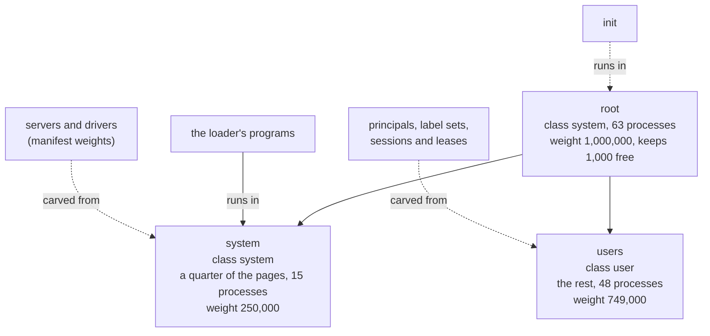
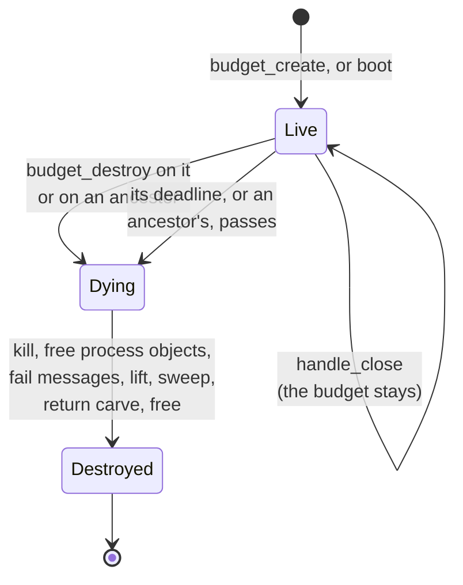

# Budgets

A **budget** is the kernel object that holds resources. It has a page limit, a process limit and
a CPU weight, a class, a label set, an account and an optional deadline. Every process runs in
one budget, and every kernel object is charged to one. Budgets form a tree: a child's limits are
carved out of its parent's, so the children never add up to more than the parent. Destroying a
budget destroys everything below it, kills the processes in it and closes every handle stamped
with it, wherever the copies went. A budget whose deadline passes is destroyed the same way.

## Purpose

One object does five jobs that Unix spreads over cgroups, revocation lists, security labels,
accounts and the scheduler:
- **accounting:** every kernel object costs pages from a budget, and running out is an error for
  the caller, never for anyone else;
- **CPU:** its free weight is its share of the one stride queue ([scheduling](scheduling.md));
- **revocation:** destroying it revokes every handle stamped with it or a descendant
  ([objects](objects.md#r9-stamps));
- **information flow:** its label set decides whom it may talk to (R1 (flow),
  [IPC](ipc.md#r1-flow));
- **identity for servers:** its account travels with every message it sends.

The steward builds a budget per principal, per label set, per session and per lease, and ends any
of them by destroying it. A lease is a budget with a deadline, so the kernel ends it on time even
if the steward is busy or gone.

## Interface

### The budget object

Status: built · tested: bench:budget, bench:budget-destroy-attack, bench:process-attack, mutation:ProcessInWeightlessBudget

| Field | What it holds |
| --- | --- |
| `id` | a u64 shared with endpoints' ids, never reused (I12 (ids never reused)) |
| `parent` | the budget it was carved from; none only for `root` |
| `depth` | 0 for `root`; always below `MAX_DEPTH` (8: the levels a tree may have) |
| `class` | `system` or `user`, its parent's; see [Class is trust, not order](#class-is-trust-not-order) |
| `labels` | a sorted set of u64 labels, at most `MAX_LABELS` (8), fixed at creation, containing all of its parent's |
| `account` | the principal it bills to, a u64; 0 for none ([R8](#r8-accounts)) |
| `deadline` | microseconds since boot at which the kernel destroys it; `FOREVER` (`u64::MAX`) for none |
| `pages` | limit and usage, in pages ([R6](#r6-charging)) |
| `processes` | limit and usage: the processes running in it, and its children's process limits |
| `weight` | limit and carved: what its children took ([R7](#r7-carving)) |
| `dying` | set on the whole subtree while [R10](#r10-destruction) destroys it |

The **free weight** is the weight limit less the carved weight. It is the budget's stride weight
(R12 (scheduling), [scheduling](scheduling.md#r12-scheduling)), so a budget with free weight 0
holds no process: `process_create` into one gets `InvalidArgument`. A budget also carries its
place in the stride queue, which [scheduling](scheduling.md) describes.

A budget with zero limits is a **revocation scope**: nothing runs in it, and it exists to be a
stamp and later destroyed, so one grant can be revoked without killing any process
([objects](objects.md#mint)). It costs its parent one page, like any budget.

Each budget occupies one page of its own, allocated when it is created: the page its parent pays
for. So there is no kernel table of budgets for one budget to exhaust at another's expense. The
page starts with a fixed magic word; a frame read as a budget that does not hold one means a stale
reference survived destruction, and the kernel stops rather than trust it
(I1 (handles name live objects)). A handle names a budget by its page and its id, so a handle
to a destroyed budget never reaches a later one in the same page.

A budget lives until it or an ancestor is destroyed or its deadline passes. Closing the last
handle to it does not destroy it: its carve stays out of its parent (see Residual risks).

### The calls

Status: built · tested: bench:budget, bench:budget-syscall-attack, bench:budget-forge-attack, host:redoubt-sys::every_call_round_trips, host:redoubt-sys::malformed_calls_are_refused

| Call | Arguments -> result | What it does |
| --- | --- | --- |
| `budget_create` | parent budget handle, spec record -> budget handle | Carve a child from the parent. The spec is `(pages, processes, weight, labels, account, deadline)` in `BUDGET_SPEC_SLOTS` (14) slots: three limits, a label count and `MAX_LABELS` label slots, the account and the deadline. |
| `budget_destroy` | budget handle | Destroy the budget and everything below it ([R10](#r10-destruction)). If the caller runs in that subtree, or its process object is charged to a budget in it, the call never returns. |
| `budget_usage` | budget handle, usage record | Write the budget's limits and usage ([`budget_usage`](#budget_usage)). |

The spec has no class and no scheduling flag: a child's class is its parent's, and what runs
first is a matter of weight alone. `budget_create`'s own checks run in this order: the parent
handle (`BadHandle`, `WrongObject`); depth (`TooLarge` if the child would be at `MAX_DEPTH`); the
labels (`LabelDenied`, then `ClassDenied`); pages, counting the child's own page
(`OutOfMemory`); processes (`OutOfProcesses`); weight (`InvalidArgument`: no error names weight).
The new handle is stamped with the caller's budget (R9 (stamps)). If the caller's handle table
cannot take it (`TooLarge` at `MAX_HANDLES`, or `OutOfMemory` for a new table page), the child is
undone and the parent is as it was.
`budget_destroy` fails only on its handle (`BadHandle`, `WrongObject`). Record checks come first
for every call; the full rows are in the
[ABI reference](abi.md#errors-and-the-order-of-checks).

The kernel itself (PID 1) has no budget and makes no calls. A call from it would get
`InvalidArgument` from a call that passes a record (the record check comes first, and no user
page is the kernel's), `NotPermitted` from most others, `BadHandle` from `handle_close` and
`budget_destroy`, and an answer from `time_now` and `random`; none of them panics, so a bug
there cannot become one.

### Root, system and users

Status: built · partly tested: no case checks the boot table (`root`'s 63 processes, the weights, `INIT_WEIGHT`), and the boot code departs from R6 (charging) for `root`'s own page (Residual risks) · tested: bench:budget, bench:budget-destroy-kills, bench:process-attack

At boot the kernel creates three budgets, all with account 0, no labels and no deadline:

| Budget | Class | Pages | Processes | Weight |
| --- | --- | --- | --- | --- |
| `root` | `system` | every RAM page the kernel did not keep for itself | 63 (every PID but the kernel's) | `ROOT_WEIGHT` (1,000,000) |
| `system` | `system` | a quarter of `root`'s | 15 (a quarter) | 250,000 (a quarter) |
| `users` | `user` | the rest, less the two budgets' own pages | 48 (the rest) | 749,000 |

`root` pays for the two budgets' own pages and carves all its pages and processes into them. It
keeps `INIT_WEIGHT` (1,000) of its weight free, because a budget that holds a process needs free
weight; that share is `init`'s. By R6 (charging) `root`'s own page is charged to `root`, so its
limit is the free frames less that page. The boot code departs from this: it counts the page in
`root`'s limit and charges it to no one ([Residual risks](#residual-risks)).

Every program the loader started runs in `system`, charged there for everything the loader gave
it (image, stack, page tables, saved contexts) and for its first thread. The first of them gets
handles to `root`, `system` and `users` in slots 1 to 3, stamped with `root`, then a handle to
every device object, as `init` receives them ([boot](boot.md)). The machine's device objects and
the two boot endpoints are charged to `system`. A bundle whose programs do not fit in `system`
does not boot: the kernel stops (fail closed).

*Figure: the budget tree at boot. Solid: built. Dashed: planned, once `init` builds the tree
from the boot manifest.*

### The tree from the boot manifest

Status: planned · M1 (separation and containment)

The loader starts only `init`, which runs in `root` on the weight `root` keeps free. The kernel
creates `root`, `system` and `users` with the sizes the boot manifest sets for `system` (default a
quarter of RAM) and gives `init` the three handles. `init` carves each server's budget from
`system` with the pages, processes and weight its manifest entry names: 1,000 for `init`, the
steward and the drivers, an ordinary weight for other servers, 100 for a session. Only `init` and
the steward ever hold a handle to a `system`-class budget; a manifest that grants a server a budget
handle is refused ([init](../servers/init.md)). The steward holds `users` and carves each
principal's budget from it, then a fixed sub-budget per label set
([steward](../servers/steward.md)).

**Open:** whether `system`'s share reaches the kernel in the argument block or the kernel keeps a
fixed fraction and `init` carves the rest; how `ROOT_WEIGHT` and `INIT_WEIGHT` are chosen once
`init` runs in `root` (until then every loader-started program shares `system`'s one free weight,
so a program that yields in a busy loop takes that whole share).

### Class is trust, not order

Status: built · partly tested: that scheduling ignores class is argued from the code, not attacked · tested: bench:process-attack, bench:budget, mutation:ClassNotInherited, mutation:LabelsAddedByParentClass, mutation:R1UsageExemptBySystemTarget

A budget's class is its parent's, fixed at creation; `budget_create` takes no class argument
(I8 (class and account inherited)). `root` and `system` are class `system`; `users` and everything
below it are class `user`. Class decides three things and nothing else:
- a message to or from a `system`-class budget, and an exit notice into one, is not
  label-checked by the kernel ([R1](ipc.md#r1-flow));
- a `system`-class caller of `budget_usage` is not label-checked (the caller's class decides, not
  the target's);
- only a `system`-class caller may create a child with more labels than its parent
  (`ClassDenied`). The caller's class decides, not the parent's.

Scheduling never reads class. Every budget is in one stride queue, and what matters is weight:
`init`, the steward and the drivers get large weights instead of running first
([scheduling](scheduling.md)).

Because class is inherited, a handle to a `system`-class budget is the authority to create more of
them, with any labels and any account the rules allow, and to run processes in them. The kernel
does not look at the holder's class for that. What protects `system` budgets is that their
handles are never handed to anything but `init` and the steward (see Residual risks).

### Labels on budgets

Status: built · tested: bench:budget, bench:process-attack, mutation:LabelsAddedByParentClass

A budget's labels are fixed when it is created. The kernel sorts the spec's labels and drops
repeats, then checks them:
- they must include all of the parent's, or the call gets `LabelDenied`: labels only grow
  downward (I6 (labels only grow downward)), so no child can shed a label its parent carries;
- if they add any, the caller's own budget must be class `system`, or the call gets
  `ClassDenied`. A `user`-class process can only make children with its parent's exact label set.

A spec whose label count is above `MAX_LABELS` does not decode (`TooLarge`). What a label means,
and who owns it, is the servers' business ([labels](../servers/README.md#labels)); the kernel sees
a number, and carries the sender budget's label set on every message.

### Deadlines

Status: built · partly tested: a process that enters the kernel in a tight loop to put a deadline off is not attacked by a case; the destruction's billing departs from R10 and floods of weight-0 deadlines past 64 are not attacked · tested: bench:sched-timer-flood, bench:budget-deadline, bench:budget, mutation:BudgetDeadlineIgnored, mutation:ExpireBudgetsFirst

A deadline is the kernel's half of a lease. `budget_create` takes it as an absolute time in
microseconds since boot (the clock `time_now` reads); `FOREVER` means none. The kernel sets no
maximum: a lease's longest term, `MAX_LEASE` (24 hours), is the steward's rule, and the steward
refuses a longer request rather than clamp it ([steward](../servers/steward.md#leases)). The kernel
knows deadlines, not leases.

When a deadline passes, the kernel destroys the budget exactly as `budget_destroy` would
([R10](#r10-destruction)), with nobody asking. Budgets with a deadline sit on one list linked
through their pages, and the hart timer is always armed for the earliest
([timer](timer.md#budget-deadlines)). Every kernel entry (a call, a fault, an interrupt) first
answers every deadline that has passed, before anything reads the entering process, so a deadline
beats any operation that enters after it. A process that never enters the kernel is stopped by the
timer interrupt. There is no state, call or interrupt path in which the kernel puts a deadline
off. So a deadline always destroys its budget, at the first kernel entry at or after it.

- A deadline already past at creation destroys the budget at the next kernel entry; the handle is
  dead by the time it is used.
- At an equal instant, blocking-call timeouts are answered first
  (I13 (every blocking call returns by its timeout)), then deadlines in id order. So a caller
  whose server's budget dies at its own timeout gets `Timeout` with its lend consumed, not `Dead`
  with it returned.
- The processes it kills get exit notices with cause `killed`, blaming nobody
  ([processes](processes.md#exit-notices)).
- The destruction's whole cost is billed to the budget's parent, after its carve returns, or to
  the nearest ancestor with free weight above 0 ([R10](#r10-destruction)). The kernel departs
  from this: it bills the dying budget only up to the lift, which moves up with its debt, and
  bills the rest, and all of a weight-0 budget's, to nobody ([Residual risks](#residual-risks)).
  A deadline is a preemption point.
- A child may have its own, earlier deadline. A later one never fires, because the child dies with
  its parent. So a sub-budget (a sub-agent's lease inside an agent's) never outlives its parent.

### `budget_usage`

Status: built · tested: bench:budget, bench:process-attack, bench:budget-syscall-attack, mutation:R1UsageIgnoresLabels, mutation:R1UsageExemptBySystemTarget

`budget_usage(h, usage_rec)` writes six slots (`USAGE_SLOTS`): the page limit and usage, the
process limit and usage, and the weight limit and carved weight. The free weight is the limit less
the carved weight. The record is checked writable before anything is read.

A usage read is a flow from the budget read to the reader's budget. So a `user`-class caller reads
only budgets whose labels its own budget's labels contain, and gets `LabelDenied` otherwise; a
`system`-class caller reads any budget it holds a handle to ([R1](ipc.md#r1-flow)). The check uses
the caller's budget, not the handle's stamp.

### `budget_children`

Status: planned · M5 (persist, install, share)

`budget_children(h) -> [h]` returns a handle to each child of the budget `h` names, so a restarted
steward can find, and destroy, the budgets it created before it stopped. With it, a budget whose
last handle was closed is reachable again from any holder of its parent. Nothing else about
budgets changes.

**Open:** direct children only, or the whole subtree; how many handles one call returns, and how a
caller pages through a budget with more children than one record holds, within `MAX_HANDLES`
(4096); what the returned handles are stamped with (the caller's budget, as `budget_create`
stamps, or the stamp of `h`, so that revoking `h` revokes them too); whether a holder of `h` may
then create processes and children in a child another holder carved, which is more than `h`
alone gives (with `h` alone it can only destroy that child, with the rest of `h`'s subtree); whether handing back a
labelled child's handle to a `user`-class caller is a flow R1 must check.

## Authority

Status: built · tested: bench:budget, bench:process-attack, bench:budget-forge-attack, bench:budget-destroy-attack, mutation:ClassNotInherited

- **A budget handle is the right to spend the budget and to end it.** Its holder can carve
  children from it, create processes in it (`process_create`), read its usage, narrow a mint to
  it when it is at or below the source's stamp ([objects](objects.md#mint)), and destroy it with
  everything below it. Handles carry no rights bits, so there is no read-only budget handle.
- **Handles reach down, never up.** No call turns a handle to a budget into a handle to its parent
  or a sibling. A holder of a child cannot reach its parent's limits, beyond the carve it has.
- **A new handle is stamped with the caller's budget** (R9): destroying the budget that created a
  child's handle revokes that handle, while the child itself survives if it is not below the
  destroyed budget.
- **Class gives a caller two powers:** a `system`-class caller may add labels, and may read the
  usage of any budget it holds. It also exempts messages to and from the budget from the kernel's
  label check (R1). A `system`-class budget handle held by a `user`-class process gives that process
  everything a `system`-class budget can hold.
- **The account is inherited** once set ([R8](#r8-accounts)): a process cannot give a child a
  different principal to bill to.
- Who holds which budget handle is policy. [init](../servers/init.md) hands servers only
  revocation scopes, never a budget that holds processes, because a budget handle is a destroy
  right: a compromised server holding its callers' budgets could end every session.

## Security properties

### R6 (charging)

Status: built · partly tested: an endpoint's page charge is attacked only in the model, and the saved-context pages (1 on rv32, 2 on rv64) are pinned by no case; the boot code departs from the rule for `root`'s own page and for process objects (see Residual risks), and no case attacks either · tested: bench:budget, bench:budget-mem-churn, bench:budget-table-attack, bench:map-fixed-tables, bench:redoubt-tight, bench:process-attack, mutation:R6ChargeAncestors, mutation:R6OwnPageChargedToItself, mutation:R6EndpointsFree, mutation:R6PageTablesFree, mutation:R6OpenCallsFree, mutation:R6ProcessObjectFree, mutation:R6ProcessObjectChargedToBudget, mutation:R6LendChargedOnce

Every kernel object is charged in pages to one budget, and a charge over the budget's limit fails
with `OutOfMemory` before anything changes. Who pays:
- a budget's own page: its **parent**, always (`BUDGET_PAGES`, 1), and `root`'s own page to
  `root`: `root`'s limit is the RAM frames the kernel did not keep, less `root`'s own page, so
  the sum of all charges never exceeds the free frames. A revocation scope is no special case;
- a process object, which holds the exit notice: the **creator's** budget, the budget of
  `process_create`'s caller (`PROCESS_PAGES`, 1), until the notice is received or dropped. The
  object also counts one against that budget's **process limit** for as long, so a PID held
  for an untaken notice is the creator's to pay for; the process counts against the budget it
  runs in while it lives;
- a thread's IPC page (`THREAD_PAGES`, 1), its saved registers, its process's page tables and
  mapped pages: the budget the process **runs in**;
- a handle-table page: the budget of the process whose table it is;
- an endpoint: the budget of the process that created it, its **owner**;
- an open call's page: the receiving process's budget ([R4a (open calls)](ipc.md#r4a-open-calls));
- a lent page and the page tables that map it: the caller **and** the receiving process's budget
  while the call is open ([R3 (lends and abandoned calls)](ipc.md#r3-lends-and-abandoned-calls)).

The page counts per object are in [objects](objects.md#what-objects-cost). A parent's usage
counts its children's **limits** and their own pages, never their live usage, so one child
filling up changes nothing its siblings or its parent can see.

Page tables are counted before a mapping is made, and the count names each missing table by the
span of address space it covers. A missing table at the same index under two different parents
(two gigabytes, say) counts twice. Because the count is exact, a mapping that passes the budget
check never runs out of pages halfway; the charge and the allocations agree, so a request one table
short is refused with nothing charged ([R22 (range cost)](memory.md#r22-range-cost)). Every
page a budget uses is on its ledger, and usage stays within limits after every call
(I5 (usage within limits)).

### R7 (carving)

Status: built · tested: bench:budget-carve-attack, bench:budget, bench:process-attack, host:redoubt-model::budget_lifecycles, mutation:R7NoCarveCheck, mutation:R7CarveToZeroFree, mutation:ProcessInWeightlessBudget

A child's page, process and weight limits come out of its parent's **free** limits, and the child's
own page comes out of the parent's pages too. The children never add up to more than the parent;
nothing is overcommitted. So an allocation succeeds or fails on the paying budget alone, and a
failure says nothing about any other budget. The largest values, and sums that would wrap, are
refused like any other excess.

Carving weight moves CPU share to the child; it never copies it. The parent's stride weight is its
free weight. A carve that would leave a budget that holds a process with free weight 0 is refused
(`InvalidArgument`), as is `process_create` into a budget with free weight 0. The carve returns to
the parent, whole, when the child is destroyed ([R10](#r10-destruction)).

### R8 (accounts)

Status: built · tested: bench:process-attack, mutation:R8AccountFromArgument

A new budget's account is its parent's, unless the parent's is 0; then it is whatever the creator
put in the spec. So once a budget bills to a principal, everything below it does too, whatever its
creator asks (I8). The boot budgets have account 0, and the steward sets one on each principal's
top budget. The kernel attaches the sender budget's account to every message it carries, and a
server bills or throttles by it ([IPC](ipc.md#r14-unforgeable-sender)). An account grants nothing
by itself.

### R10 (destruction)

Status: built · partly tested: destroying the budget a device object is charged to, or an endpoint's owner while a receiver waits on it, is not checked by a case, and no program checks `receive` returning `Dead`; the equal-instant order of timeouts before deadlines is attacked only in the model; a deadline's destruction is billed only in part (see Residual risks) · tested: bench:budget, bench:budget-destroy-attack, bench:budget-destroy-kills, bench:budget-deadline, bench:redoubt-revoke, bench:process-attack, bench:sched-destroy-billing, bench:dma-reset-quarantine, host:redoubt-model::budget_lifecycles, host:redoubt-model::quarantine_charge_moves_to_a_parent_at_its_limit, mutation:R10KeepForeignHandles, mutation:R10KeepCarvedLimits, mutation:R10SpareDescendantProcesses, mutation:R10ExitNoticesOutlivePayer, mutation:R10RevokedMessageDelivered, mutation:R10RevokedCallAnswered, mutation:R10SweptHandlesDropped, mutation:R10CreatorDeathSparesProcess, mutation:ExpireBudgetsFirst

Destroying budget B, by `budget_destroy` or by a deadline, destroys B and everything below it, in
this order:
1. **Mark.** B's weight goes back to its parent first, so that the destruction's own work is
   billed at the parent's restored weight, not the sliver it kept while B held the rest (the
   deadline path departs from this; see below)
   ([scheduling](scheduling.md)). Then B and every descendant are marked dying.
2. **Kill.** Every process running in a dying budget is killed, the caller last if it is one of
   them. Each gets an exit notice with cause `killed`, blaming nobody, unless its process object
   is itself charged to a dying budget.
3. **Free process objects.** Every process object charged to a dying budget is freed, its process
   killed first if it still runs elsewhere, with no notice. A notice never outlives the budget
   that pays for it.
4. **Reach messages in flight.** Every endpoint a dying budget owns is destroyed: calls and sends
   blocked on it and receives waiting on it fail with `Dead`, calls a server took through it are
   abandoned (R3), and exit notices owed to it are dropped. Every device object charged to a
   dying budget is destroyed. A message still queued that was sent through a handle stamped with
   a dying budget fails its sender with `Dead`. A call sent through one that a server already took
   fails its caller with `Dead` at once, not when the server replies, and is abandoned.
5. **Lift.** Each dying budget's work since it entered the queue moves to its parent, bottom-up
   ([scheduling](scheduling.md)).
6. **Sweep.** Every handle that names a dying budget, or an endpoint, device or process object that
   died with one, or that is stamped with a dying budget, is closed in every process's table. A
   handle stamped with one inside a message not yet received arrives as 0 in its slot
   ([IPC](ipc.md#what-receive-returns)).
7. **Return.** B's page, its page and process limits go back to its parent. The parent's usage is
   exactly what it was before B was created (I10 (create-destroy leaves the parent unchanged)),
   except for quarantined DMA pages, which step 8 moves onto it.
8. **Move quarantined DMA pages.** DMA pages held in quarantine and charged to a dying budget are
   charged to B's parent instead, after the carve came back, so the parent never goes over its
   limit (I16 (DMA pages reset before reuse), [devices](devices.md#quarantine)).
9. **Free.** The dying budgets' pages are freed and they leave the deadline list.

Revocation is complete (I2 (revocation is complete)): no handle, queued message or taken call
keeps authority that came through a destroyed budget. Budgets outside B are untouched, including
budgets B's processes created elsewhere and handles to them stamped outside B. A device whose
reset fails at the end of a process that used it for DMA is destroyed the same way, at that end:
every handle naming it closes, in every table and every unreceived message
([devices](devices.md#quarantine), [R11 (memory)](memory.md#r11-memory)).

A budget whose deadline has passed is destroyed before any operation that enters the kernel at
or after that instant: expiry runs first at every kernel entry, before anything reads the
entering process. At an equal instant, timeouts expire before deadlines, so a caller whose call
a server took, and whose timeout falls with the server budget's deadline, gets `Timeout` with
its lend consumed, not `Dead` with it returned ([timer](timer.md#expiry)).

Every destruction's whole cost is billed to someone. For `budget_destroy` that is the caller, as
the call's own kernel time. For a deadline it is B's parent, after its carve returns, or the
nearest ancestor with free weight above 0 if the parent has none; `root` always has. No part of a
destruction is billed to nobody. The deadline path departs from this: it bills B for its expiry
walk and for steps 2 to 4, which step 5 moves up with B's debt, and the mark (step 1) and
steps 5 to 9 to nobody; a B with free weight 0 pays
nothing at all ([Residual risks](#residual-risks)).

*Figure: a budget's life. It is dying only inside one destruction, which runs in the kernel
without preemption.*

## Failure and restart

Status: built · tested: bench:budget-destroy-kills, bench:process-attack, bench:budget-deadline, bench:budget-syscall-attack

- **A process in a budget ends:** its threads, pages, page tables and handle table go back to the
  budget at once, and it stops counting against that budget's process limit. Its process object
  stays charged to its creator's budget until its exit notice is received
  ([processes](processes.md)), and by R6 counts against the creator's process limit as long; the
  kernel does not count it there ([Residual risks](#residual-risks)).
- **A budget's creator ends:** the budget lives on. Budgets outlive the processes that made them;
  only destruction, of it or an ancestor, or a deadline ends one.
- **A budget is destroyed while its own process is in the call:** the process is killed last, and
  the call never returns to it.
- **A budget's deadline passes while a process in it runs:** the timer interrupts it, and the
  kernel destroys the budget before the process runs again.
- **The steward restarts:** it holds the budgets it created only if it kept their handles;
  [`budget_children`](#budget_children) lets it find them.
- **The ledger disagrees with itself** (usage below zero, a frame named as a budget that holds
  none): the kernel stops rather than continue on a broken ledger (I5, I1). No sequence of calls
  reaches that (I14 (no call panics the kernel)).

## Residual risks

- **Destruction costs time nobody can interrupt.** Destroying a budget scans every kernel-object
  page, several times, with interrupts off. Destroying a budget holding two processes takes about
  21 ms of virtual time, and its p99 is within a few milliseconds of the 30 ms target
  `bench:sched-latency` holds it to. The cost grows with the kernel-object pages in the whole
  system, which any budget can add to by creating objects, and every interrupt and timeout on the
  machine waits for it. It dominates driver-wake and lease-end latency whenever a lease ends,
  and must be brought well inside the target before the steward is built, in
  M1 (separation and containment). Follow-up: [todo](../todo/budget-destroy-cost.md).
- **Part of a deadline's destruction is billed to nobody.** The kernel departs from R10's
  billing rule: a deadline bills the dying budget only up to the lift, and the rest (closing
  handles everywhere, freeing frames) to no budget; a budget with free weight 0 is not billed at
  all. A creator can make many empty weight-0 budgets with short deadlines, one `budget_create`
  each, and have the machine spend time no budget pays for. The 64 staggered deadlines of
  `bench:sched-timer-flood` leave a victim its share; larger floods are not attacked
  ([scheduling](scheduling.md#residual-risks)). Follow-up:
  [todo](../todo/deadline-destroy-billing.md).
- **Untaken exit notices hold PIDs outside every process limit.** The kernel departs from R6's
  process-object rule: an ended process stops counting against any process limit while its PID
  stays held until its notice is taken. One creator can hold every free PID of the global pool
  of 63, and every other `process_create`, anywhere in the tree, then gets `OutOfProcesses`
  ([processes](processes.md#residual-risks)). Follow-up: [todo](../todo/pid-pool-pinning.md).
- **A `system`-class budget handle is a lot of authority.** The kernel lets any holder create
  `system`-class children with added labels and any account the parent allows, and run processes
  in them. The wall is policy: only `init` and the steward hold one ([init](../servers/init.md)).
  Until `init` builds the tree, the loader's first program holds `root`, `system` and `users`, and
  is trusted as `init` is.
- **A budget handle is a destroy right.** Whoever holds a copy can end the budget and everything
  in it. A server given a budget that holds processes could end them; servers are given only
  revocation scopes ([init](../servers/init.md)).
- **A lost budget is carved until its parent goes.** Closing the last handle to a budget leaves it
  alive, its limits still carved from its parent, with no way to reach it until
  [`budget_children`](#budget_children) exists. The loss is the closer's own tree's, never another
  budget's.
- **Quarantined DMA pages stay charged.** A DMA run whose device did not confirm its reset is held
  until reboot. When its budget is destroyed, the charge moves to the parent, which keeps paying
  for those pages until it too is destroyed or the machine reboots
  ([devices](devices.md#quarantine)).
- **The boot tree promises one page more than there is.** The boot code departs from R6:
  `root`'s limit is every RAM page the kernel did not keep, and it carves all of them into
  `system`, `users` and their two pages; but `root`'s own page is taken from the same frames and
  charged to no one. So the charges can total
  one page more than the free frames. If every budget fills to its limit, the last allocation finds
  no frame, and the kernel stops instead of refusing the call (a breach of I14 under exhaustion).
  Follow-up: [todo](../todo/boot-root-frame.md).
- **Usage reads and `OutOfMemory` are signals.** A `budget_usage` read and a failed carve tell the
  reader about the budget it names, and only a budget it holds a handle to. Covert and timing
  channels are out of scope ([TENETS](../TENETS.md#threat-model)).

## Why

- **One object, five jobs.** Accounting, CPU share, revocation, labels and billing identity all
  follow the same tree, so there is one thing to create, one to destroy, and nothing to keep in
  step.
- **Everything costs pages**, threads, handles, endpoints and budgets included, so one number
  bounds every kind of exhaustion. Processes are counted apart only because PIDs are
  address-space tags, which are scarce on rv32.
- **Carved, never overcommitted.** An allocation that fails on the caller's own budget reveals
  nothing about anyone else's. A parent counts its children's limits, not their usage, for the
  same reason.
- **A budget's own page is its parent's.** A child cannot use up the page it lives in, and a
  revocation scope, with zero limits, needs no special rule.
- **A lend is charged to both sides.** A server's budget covers its open lends up front (64 open
  9P calls of 16 pages each is 4 MiB), a server that cannot pay does not take the call
  (R4 (delivery)), and no budget is ever over its limit.
- **Class is inherited, with no class argument.** A class check on `budget_create` alone would
  guard one of three doors (`process_create` and `budget_destroy` are the others). Inheriting it
  leaves one door to guard: never hand a `system`-class budget to anything but `init` and the
  steward.
- **Class is trust, not order.** One stride queue by weight means nothing jumps the queue by being
  trusted; `init`, the steward and the drivers are served first by being given more weight.
- **The kernel keeps deadlines, the steward keeps leases.** A deadline is a time, which the kernel
  can enforce without a policy; how long a lease may be is policy, and lives with the policy.
- **Bounded depth**, because revocation and "is this below that" walk the ancestors.
- **A budget is its own page**, so creating budgets never fills a kernel table that other budgets
  need.
