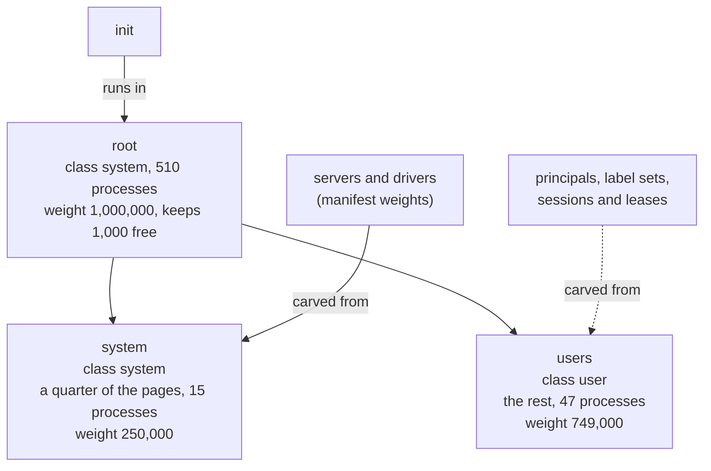
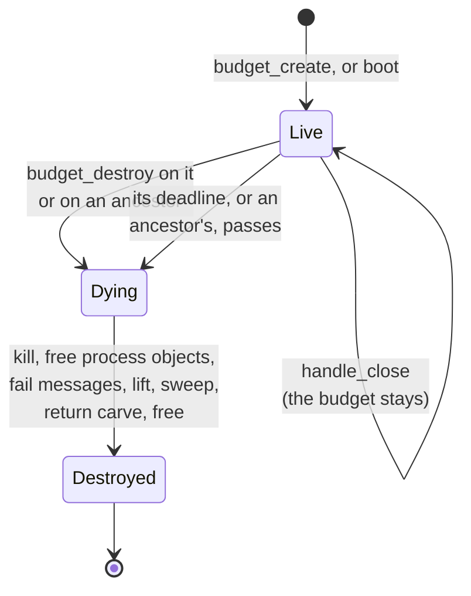

# Budgets

A **budget** is the kernel object that holds resources. It has a page limit, a process limit and
a CPU weight, a class, a label set, an account and an optional deadline. Every process runs in
one budget, and every kernel object is charged to one. Budgets form a tree: a child's limits are
carved out of its parent's, so the children never add up to more than the parent. Destroying a
budget destroys everything below it, kills the processes in it and closes every handle stamped
with it, wherever the copies went. A budget whose deadline passes is destroyed the same way.

## Purpose

One object does five jobs that Unix spreads over cgroups, revocation lists, security labels,
accounts and the scheduler:
- **accounting:** every kernel object costs pages from a budget, and running out is an error for
  the caller, never for anyone else;
- **CPU:** its free weight is its share of the one stride queue ([scheduling](scheduling.md));
- **revocation:** destroying it revokes every handle stamped with it or a descendant
  ([objects](objects.md#r9-stamps));
- **information flow:** its label set decides whom it may talk to (R1 (flow),
  [IPC](ipc.md#r1-flow));
- **identity for servers:** its account travels with every message it sends.

The steward builds a budget per principal, per label set, per session and per lease, and ends any
of them by destroying it. A lease is a budget with a deadline, so the kernel ends it on time even
if the steward is busy or gone.

## Interface

### The budget object

Status: built · tested (4)

- bench:budget
- bench:budget-destroy-attack
- bench:process-attack
- mutation:ProcessInWeightlessBudget

| Field | What it holds |
| --- | --- |
| `id` | a u64 shared with endpoints' ids, never reused (I12 (ids never reused)) |
| `parent` | the budget it was carved from; none only for `root` |
| `depth` | 0 for `root`; always below `MAX_DEPTH` (16: the levels a tree may have) |
| `class` | `system` or `user`, its parent's; see [Class is trust, not order](#class-is-trust-not-order) |
| `labels` | a sorted set of u64 labels, at most `MAX_LABELS` (16), fixed at creation, containing all of its parent's |
| `account` | the principal it bills to, a u64; 0 for none ([R8](#r8-accounts)) |
| `deadline` | microseconds since boot at which the kernel destroys it; `FOREVER` (`u64::MAX`) for none |
| `pages` | limit and usage, in pages ([R6](#r6-charging)) |
| `processes` | limit and usage: the PIDs held by processes that run or ran in it, those moved to it from destroyed children, and its children's process limits ([R6](#r6-charging)) |
| `weight` | limit and carved: what its children took ([R7](#r7-carving)) |
| `dying` | set on the whole subtree while [R10](#r10-destruction) destroys it |

The **free weight** is the weight limit less the carved weight. It is the budget's stride weight
(R12 (scheduling), [scheduling](scheduling.md#r12-scheduling)), so a budget with free weight 0
holds no process: `process_create` into one gets `InvalidArgument`. A budget also carries its
place in the stride queue, which [scheduling](scheduling.md) describes.

A budget with zero limits is a **revocation scope**: nothing runs in it, and it exists to be a
stamp and later destroyed, so one grant can be revoked without killing any process
([objects](objects.md#mint)). It costs its parent one page, like any budget.

Each budget occupies one page of its own, allocated when it is created: the page its parent pays
for. So there is no kernel table of budgets for one budget to exhaust at another's expense. The
page starts with a fixed magic word; a frame read as a budget that does not hold one means a stale
reference survived destruction, and the kernel stops rather than trust it
(I1 (handles name live objects)). A handle names a budget by its page and its id, so a handle
to a destroyed budget never reaches a later one in the same page.

A budget lives until it or an ancestor is destroyed or its deadline passes. Closing the last
handle to it does not destroy it: its carve stays out of its parent (see Residual risks).

### The calls

Status: built · tested (5)

- bench:budget
- bench:budget-syscall-attack
- bench:budget-forge-attack
- host:redoubt-sys::every_call_round_trips
- host:redoubt-sys::malformed_calls_are_refused

| Call | Arguments -> result | What it does |
| --- | --- | --- |
| `budget_create` | parent budget handle, spec record -> budget handle | Carve a child from the parent. The spec is `(pages, processes, weight, labels, account, deadline)` in `BUDGET_SPEC_SLOTS` (22) slots: three limits, a label count and `MAX_LABELS` label slots, the account and the deadline. |
| `budget_destroy` | budget handle | Destroy the budget and everything below it ([R10](#r10-destruction)). If the caller runs in that subtree, or its process object is charged to a budget in it, the call never returns. |
| `budget_usage` | budget handle, usage record | Write the budget's limits and usage ([`budget_usage`](#budget_usage)). |

The spec has no class and no scheduling flag: a child's class is its parent's, and what runs
first is a matter of weight alone. `budget_create`'s own checks run in this order: the parent
handle (`BadHandle`, `WrongObject`); depth (`TooLarge` if the child would be at `MAX_DEPTH`); the
labels (`LabelDenied`, then `ClassDenied`); pages, counting the child's own page
(`OutOfMemory`); processes (`OutOfProcesses`); weight (`InvalidArgument`: no error names weight).
The new handle is stamped with the caller's budget (R9 (stamps)). If the caller's handle table
cannot take it (`TooLarge` at `MAX_HANDLES`, or `OutOfMemory` for a new table page), the child is
undone and the parent is as it was.
`budget_destroy` fails only on its handle (`BadHandle`, `WrongObject`). Record checks come first
for every call; the full rows are in the
[ABI reference](abi.md#errors-and-the-order-of-checks).

The kernel itself (PID 1) has no budget and makes no calls. A call from it would get
`InvalidArgument` from a call that passes a record (the record check comes first, and no user
page is the kernel's), `NotPermitted` from most others, `BadHandle` from `handle_close` and
`budget_destroy`, and an answer from `time_now` and `random`; none of them panics, so a bug
there cannot become one.

### Root, system and users

Status: built · partly tested: no case checks the weights or `INIT_WEIGHT` · tested (5)

- bench:budget
- bench:budget-destroy-kills
- bench:process-attack
- bench:pages-exhaustion
- bench:bundle-mapped

At boot the kernel creates three budgets, all with account 0, no labels and no deadline:

| Budget | Class | Pages | Processes | Weight |
| --- | --- | --- | --- | --- |
| `root` | `system` | every RAM page the kernel did not keep for itself or for the DMA pool, less `root`'s own page | 510 (every PID but the kernel's) | `ROOT_WEIGHT` (1,000,000) |
| `system` | `system` | a quarter of what `root` does not keep for `init` | 127 (a quarter) | 250,000 (a quarter) |
| `users` | `user` | the rest, less the two budgets' own pages | 382 (the rest, less `init`'s) | 749,000 |

`root` pays for the two budgets' own pages and carves the rest of its pages and processes into
them, but what it keeps for `init`: one process, `INIT_WEIGHT` (1,000) of its weight, because a
budget that holds a process needs free weight, and `init`'s pages
([below](#the-tree-from-the-boot-manifest)): everything the loader gave `init`, its first
thread and `INIT_PAGES` (1,024). By R6 (charging) `root`'s own page is charged to `root`, so its
limit is the free frames less that page. The boot checks that `root`'s limit, its own page and
the kernel's frames fit in RAM, and stops if they do not.

`init`, the one program the loader starts, runs in `root`, charged there for everything the
loader gave it (image, stack, page tables, header page, the bundle's frames) and for its first
thread. It gets handles to `root`, `system` and `users` in slots 1 to 3, stamped with `root`,
then a handle to every device object ([boot](boot.md)). The machine's device objects are charged
to `system`. A boot whose `init` and `INIT_PAGES` do not fit does not boot: the kernel stops
(fail closed).

```mermaid
flowchart TD
    R["root<br/>class system, 510 processes<br/>weight 1,000,000, keeps 1,000 free"]
    S["system<br/>class system<br/>a quarter of the pages, 15 processes<br/>weight 250,000"]
    U["users<br/>class user<br/>the rest, 47 processes<br/>weight 749,000"]
    I[init]
    SV["servers and drivers<br/>(manifest weights)"]
    P["principals, label sets,<br/>sessions and leases"]
    R --> S
    R --> U
    I -- runs in --> R
    SV -- carved from --> S
    P -. carved from .-> U
```
*Figure: the budget tree at boot. Solid: built. Dashed: planned, once the steward carves the
principals' budgets.*

### The tree from the boot manifest

Status: built · partly tested: the steward's carving of `users` is not built · tested (8)

- bench:init-boot
- bench:init-servers
- bench:init-refuses-system-fit
- bench:init-refuses-bound
- host:redoubt-init::servers_that_do_not_fit_in_system_are_refused
- host:redoubt-init::the_image_manifest_s_bound
- host:redoubt-init::an_image_and_a_stack_larger_than_a_batch_count_one_batch
- host:redoubt-init::a_manifest_that_passes_every_other_check_but_costs_init_too_much_is_refused

The loader starts only `init`, which runs in `root` on the weight and the one process `root`
keeps free. What `init` launches counts in the budgets it launches into.

- **The kernel keeps its fixed split**, the table above. The boot manifest does not size
  `system`: the kernel reads no manifest and the loader parses no JSON, so the split is set in
  one place, the kernel. `init` adds up what the manifest's servers ask for and refuses the boot
  if it does not fit in `system`, before it starts anything
  ([init](../servers/init.md#the-boot-manifest)).
- **`INIT_PAGES` is `init`'s working set, with room to spare.** Everything `init` uses is charged
  to `root`:
  - its first thread's 32-page stack;
  - its heap, one fixed arena mapped once, for the manifest and the startup blocks it builds;
  - a handle table of up to 64 pages;
  - a page for each server endpoint it owns;
  - a thread for each server, watching its exit endpoint: the thread's stack and IPC page;
  - a process object for each process it starts (at most `system`'s process limit);
  - one batch of the program it is starting, at most 64 pages of its image and 64 of its
    stack at a time, copied through its pages and moved to the child
    ([the loader stub](../userland/native.md#the-loader-stub)).

  With `beamlet`, the bound is 416 pages on both widths (`beamlet-boot` prints it), and 1,024 at
  least doubles it. It is a fixed count, not a share of RAM, because `init`'s needs do not grow
  with the machine, nor with the size of a program it starts, and a share of a large machine would
  sit idle in `root`. The manifest cannot change it, because the kernel reads no manifest. `init`
  works in a fixed arena, and before it creates anything it bounds what the manifest will cost it
  in `root`: the endpoints it makes, a process object, a startup block and a thread watching its
  exit endpoint (the thread's IPC page and stack) for each server, the handles it keeps and mints,
  and the arena. It reads `root`'s free pages with [`budget_usage`](#budget_usage) and refuses the
  boot if the bound is larger; a charge that fails later is a bug in the bound, and refuses the
  boot too, so no boot runs half started. The number changes only in the kernel, with a stated
  reason. A tester in `init`'s place ([test bench](../testbench.md#starting-a-cases-programs))
  works within the same allowance. A kernel case whose first program needs more works in a budget
  it carves from `system`.
- **The weights stay.** `ROOT_WEIGHT` is 1,000,000 and `INIT_WEIGHT` is 1,000. `init`'s free
  weight in `root` is a driver's, and the rest is split between `system` (250,000) and `users`
  (749,000). Only the budgets that hold processes compete, so what matters is how their weights
  compare: 1,000 for `init`, the steward and the drivers, an ordinary weight for other servers, and
  100 for a session. Each server runs in a budget of its own, so no program takes a shared free
  weight by yielding in a busy loop.

`init` carves each server's budget from `system` with the pages, processes and weight its
manifest entry names. Only `init` and the steward ever hold a handle to a `system`-class budget,
and a manifest that grants a server a budget handle is refused ([init](../servers/init.md)). The
steward holds `users` and carves each principal's budget from it, then a fixed sub-budget per
label set ([steward](../servers/steward.md)).

### Class is trust, not order

Status: built · partly tested: that scheduling ignores class is argued from the code, not attacked · tested (5)

- bench:process-attack
- bench:budget
- mutation:ClassNotInherited
- mutation:LabelsAddedByParentClass
- mutation:R1UsageExemptBySystemTarget

A budget's class is its parent's, fixed at creation; `budget_create` takes no class argument
(I8 (class and account inherited)). `root` and `system` are class `system`; `users` and everything
below it are class `user`. Class decides three things and nothing else:
- a message to or from a `system`-class budget, and an exit notice into one, is not
  label-checked by the kernel ([R1](ipc.md#r1-flow));
- a `system`-class caller of `budget_usage` is not label-checked (the caller's class decides, not
  the target's);
- only a `system`-class caller may create a child with more labels than its parent
  (`ClassDenied`). The caller's class decides, not the parent's.

Scheduling never reads class. Every budget is in one stride queue, and what matters is weight:
`init`, the steward and the drivers get large weights instead of running first
([scheduling](scheduling.md)).

Because class is inherited, a handle to a `system`-class budget is the authority to create more of
them, with any labels and any account the rules allow, and to run processes in them. The kernel
does not look at the holder's class for that. What protects `system` budgets is that their
handles are never handed to anything but `init` and the steward (see Residual risks).

### Labels on budgets

Status: built · tested: bench:budget, bench:process-attack, mutation:LabelsAddedByParentClass

A budget's labels are fixed when it is created. The kernel sorts the spec's labels and drops
repeats, then checks them:
- they must include all of the parent's, or the call gets `LabelDenied`: labels only grow
  downward (I6 (labels only grow downward)), so no child can shed a label its parent carries;
- if they add any, the caller's own budget must be class `system`, or the call gets
  `ClassDenied`. A `user`-class process can only make children with its parent's exact label set.

A spec whose label count is above `MAX_LABELS` does not decode (`TooLarge`). What a label means,
and who owns it, is the servers' business ([labels](../servers/README.md#labels)); the kernel sees
a number, and carries the sender budget's label set on every message.

### Deadlines

Status: built · partly tested: a process that enters the kernel in a tight loop to put a deadline off is not attacked by a case; the destruction's billing departs from R10 and floods of weight-0 deadlines past 64 are not attacked · tested (5)

- bench:sched-timer-flood
- bench:budget-deadline
- bench:budget
- mutation:BudgetDeadlineIgnored
- mutation:ExpireBudgetsFirst

A deadline is the kernel's half of a lease. `budget_create` takes it as an absolute time in
microseconds since boot (the clock `time_now` reads); `FOREVER` means none. The kernel sets no
maximum: a lease's longest term, `MAX_LEASE` (24 hours), is the steward's rule, and the steward
refuses a longer request rather than clamp it ([steward](../servers/steward.md#leases)). The kernel
knows deadlines, not leases.

When a deadline passes, the kernel destroys the budget exactly as `budget_destroy` would
([R10](#r10-destruction)), with nobody asking. Budgets with a deadline sit on one list linked
through their pages, and the hart timer is always armed for the earliest
([timer](timer.md#budget-deadlines)). Every kernel entry (a call, a fault, an interrupt) first
answers every deadline that has passed, before anything reads the entering process, so a deadline
beats any operation that enters after it. A process that never enters the kernel is stopped by the
timer interrupt. There is no state, call or interrupt path in which the kernel puts a deadline
off. So a deadline always destroys its budget, at the first kernel entry at or after it.

- A deadline already past at creation destroys the budget at the next kernel entry; the handle is
  dead by the time it is used.
- At an equal instant, blocking-call timeouts are answered first
  (I13 (every blocking call returns by its timeout)), then deadlines in id order. So a caller
  whose server's budget dies at its own timeout gets `Timeout` with its lend consumed, not `Dead`
  with it returned.
- The processes it kills get exit notices with cause `killed`, blaming nobody
  ([processes](processes.md#exit-notices)).
- The destruction's whole cost is billed to the budget's parent, after its carve returns, or to
  the nearest ancestor with free weight above 0 ([R10](#r10-destruction)). The kernel departs
  from this: it bills the dying budget only up to the lift, which moves up with its debt, and
  bills the rest, and all of a weight-0 budget's, to nobody ([Residual risks](#residual-risks)).
  A deadline is a preemption point.
- A child may have its own, earlier deadline. A later one never fires, because the child dies with
  its parent. So a sub-budget (a sub-agent's lease inside an agent's) never outlives its parent.

### `budget_usage`

Status: built · tested (5)

- bench:budget
- bench:process-attack
- bench:budget-syscall-attack
- mutation:R1UsageIgnoresLabels
- mutation:R1UsageExemptBySystemTarget

`budget_usage(h, usage_rec)` writes six slots (`USAGE_SLOTS`): the page limit and usage, the
process limit and usage, and the weight limit and carved weight. The free weight is the limit less
the carved weight. The record is checked writable before anything is read.

A usage read is a flow from the budget read to the reader's budget. So a `user`-class caller reads
only budgets whose labels its own budget's labels contain, and gets `LabelDenied` otherwise; a
`system`-class caller reads any budget it holds a handle to ([R1](ipc.md#r1-flow)). The check uses
the caller's budget, not the handle's stamp.

### `budget_children`

Status: planned · M5 (persist, install, share)

`budget_children(h) -> [h]` returns a handle to each child of the budget `h` names, so a restarted
steward can find, and destroy, the budgets it created before it stopped. With it, a budget whose
last handle was closed is reachable again from any holder of its parent. Nothing else about
budgets changes.

**Open:** direct children only, or the whole subtree; how many handles one call returns, and how a
caller pages through a budget with more children than one record holds, within `MAX_HANDLES`
(4096); what the returned handles are stamped with (the caller's budget, as `budget_create`
stamps, or the stamp of `h`, so that revoking `h` revokes them too); whether a holder of `h` may
then create processes and children in a child another holder carved, which is more than `h`
alone gives (with `h` alone it can only destroy that child, with the rest of `h`'s subtree); whether handing back a
labelled child's handle to a `user`-class caller is a flow R1 must check.

## Authority

Status: built · tested (5)

- bench:budget
- bench:process-attack
- bench:budget-forge-attack
- bench:budget-destroy-attack
- mutation:ClassNotInherited

- **A budget handle is the right to spend the budget and to end it.** Its holder can carve
  children from it, create processes in it (`process_create`), read its usage, narrow a mint to
  it when it is at or below the source's stamp ([objects](objects.md#mint)), and destroy it with
  everything below it. Handles carry no rights bits, so there is no read-only budget handle.
- **Handles reach down, never up.** No call turns a handle to a budget into a handle to its parent
  or a sibling. A holder of a child cannot reach its parent's limits, beyond the carve it has.
- **A new handle is stamped with the caller's budget** (R9): destroying the budget that created a
  child's handle revokes that handle, while the child itself survives if it is not below the
  destroyed budget.
- **Class gives a caller two powers:** a `system`-class caller may add labels, and may read the
  usage of any budget it holds. It also exempts messages to and from the budget from the kernel's
  label check (R1). A `system`-class budget handle held by a `user`-class process gives that process
  everything a `system`-class budget can hold.
- **The account is inherited** once set ([R8](#r8-accounts)): a process cannot give a child a
  different principal to bill to.
- Who holds which budget handle is policy. [init](../servers/init.md) hands servers only
  revocation scopes, never a budget that holds processes, because a budget handle is a destroy
  right: a compromised server holding its callers' budgets could end every session.

## Security properties

### R6 (charging)

Status: built · partly tested: an endpoint's page charge is attacked only in the model, and the header page is pinned by no case · tested (20)

- bench:budget
- bench:budget-mem-churn
- bench:budget-table-attack
- bench:map-fixed-tables
- bench:page-table-reclaim
- bench:pages-exhaustion
- bench:redoubt-tight
- bench:process-attack
- bench:pid-pinning-attack
- mutation:R6ChargeAncestors
- mutation:R6OwnPageChargedToItself
- mutation:R6EndpointsFree
- mutation:R6PageTablesFree
- mutation:R6EmptyTableKept
- mutation:R6OpenCallsFree
- mutation:R6ProcessObjectFree
- mutation:R6ProcessObjectChargedToBudget
- mutation:R6LendChargedOnce
- mutation:R6RootPageUncounted
- mutation:R6PidUncountedAtEnd

Every kernel object is charged in pages to one budget, and a charge over the budget's limit fails
with `OutOfMemory` before anything changes. Who pays:
- a budget's own page: its **parent**, always (`BUDGET_PAGES`, 1), and `root`'s own page to
  `root`: `root`'s limit is the RAM frames the kernel did not keep for itself or for the DMA
  pool, less `root`'s own page, so the sum of all charges never exceeds the free frames. A held
  DMA run is charged to its caller's budget as well, though its frames are the pool's, so while
  runs are held up to `DMA_POOL_PAGES` free frames cannot be charged for: conservative, never
  short ([devices](devices.md#dma_alloc)). A revocation scope is no special case;
- a process object, which holds the exit notice: the **creator's** budget, the budget of
  `process_create`'s caller (`PROCESS_PAGES`, 1), until the notice is received or dropped;
- a thread's IPC page (`THREAD_PAGES`, 1), its saved registers, its process's page tables (each
  until it maps nothing, [memory](memory.md#page-tables)) and mapped pages: the budget the
  process **runs in**;
- a handle-table page: the budget of the process whose table it is;
- an endpoint: the budget of the process that created it, its **owner**;
- an open call's page: the receiving process's budget ([R4a (open calls)](ipc.md#r4a-open-calls));
- a lent page and the page tables that map it: the caller **and** the receiving process's budget
  while the call is open ([R3 (lends and abandoned calls)](ipc.md#r3-lends-and-abandoned-calls)).

A process limit counts PIDs, and every held PID counts once: against the budget the process
**runs in**, for as long as the PID is held, which for a created process is until its object is
freed and for a program the loader started is while it lives. It counts there whoever launched
the process. If that budget is destroyed while the PID is still held, the count moves to the
destroyed budget's parent ([R10](#r10-destruction)). A `process_create` over the limit fails
with `OutOfProcesses` before a PID is drawn ([processes](processes.md#creating-and-starting)).

The page counts per object are in [objects](objects.md#what-objects-cost). A parent's usage
counts its children's **limits** and their own pages, never their live usage, so one child
filling up changes nothing its siblings or its parent can see.

Page tables are counted before a mapping is made, and the count names each missing table by the
span of address space it covers. A missing table at the same index under two different parents
(two gigabytes, say) counts twice. Because the count is exact, a mapping that passes the budget
check never runs out of pages halfway; the charge and the allocations agree, so a request one table
short is refused with nothing charged ([R22 (range cost)](memory.md#r22-range-cost)). Every
page a budget uses is on its ledger, and usage stays within limits after every call
(I5 (usage within limits)).

### R7 (carving)

Status: built · tested (8)

- bench:budget-carve-attack
- bench:budget
- bench:process-attack
- bench:pid-pinning-attack
- host:redoubt-model::budget_lifecycles
- mutation:R7NoCarveCheck
- mutation:R7CarveToZeroFree
- mutation:ProcessInWeightlessBudget

A child's page, process and weight limits come out of its parent's **free** limits, and the child's
own page comes out of the parent's pages too. The children never add up to more than the parent;
nothing is overcommitted. So an allocation succeeds or fails on the paying budget alone, and a
failure says nothing about any other budget. The largest values, and sums that would wrap, are
refused like any other excess.

Carving weight moves CPU share to the child; it never copies it. The parent's stride weight is its
free weight. A carve that would leave a budget that holds a process with free weight 0 is refused
(`InvalidArgument`), as is `process_create` into a budget with free weight 0. The carve returns to
the parent, whole, when the child is destroyed ([R10](#r10-destruction)).

### R8 (accounts)

Status: built · tested: bench:process-attack, mutation:R8AccountFromArgument

A new budget's account is its parent's, unless the parent's is 0; then it is whatever the creator
put in the spec. So once a budget bills to a principal, everything below it does too, whatever its
creator asks (I8). The boot budgets have account 0, and the steward sets one on each principal's
top budget. The kernel attaches the sender budget's account to every message it carries, and a
server bills or throttles by it ([IPC](ipc.md#r14-unforgeable-sender)). An account grants nothing
by itself.

### R10 (destruction)

Status: built · partly tested: destroying the budget a device object is charged to is not checked by a case; destroying `root` is not checked by a case; that the caller is killed last is not pinned by a case: the kernel's kill lines, the only ones in kill order, carry the PIDs it draws, the tester's lines that name each program come in no defined order, and the bench has no check across lines (`budget-destroy-kills` checks that both die); the equal-instant order of timeouts before deadlines is attacked only in the model · tested (29)

- bench:budget
- bench:budget-destroy-attack
- bench:budget-destroy-kills
- bench:budget-destroy-growth
- bench:budget-deadline
- bench:deadline-flood-billed
- bench:redoubt-revoke
- bench:process-attack
- bench:pid-pinning-attack
- bench:endpoint-destroy-open-calls
- bench:endpoint-destroy-full
- bench:handle-chain-attack
- bench:handle-chain-fault
- bench:process-chain-fault
- bench:sched-destroy-billing
- bench:dma-reset-quarantine
- bench:dma-destroy-quarantine
- host:redoubt-model::budget_lifecycles
- host:redoubt-model::quarantine_charge_moves_to_a_parent_at_its_limit
- mutation:R10KeepForeignHandles
- mutation:R10KeepCarvedLimits
- mutation:R10SpareDescendantProcesses
- mutation:R10ExitNoticesOutlivePayer
- mutation:R10RevokedMessageDelivered
- mutation:R10RevokedCallAnswered
- mutation:R10SweptHandlesDropped
- mutation:R10CreatorDeathSparesProcess
- mutation:R10HeldPidsDropped
- mutation:ExpireBudgetsFirst

Destroying budget B, by `budget_destroy` or by a deadline, destroys B and everything below it, in
this order:
1. **Mark.** B's weight goes back to its parent first, so that the destruction's own work is
   billed at the parent's restored weight, not the sliver it kept while B held the rest (the
   deadline path departs from this; see below)
   ([scheduling](scheduling.md)). Then B and every descendant are marked dying.
2. **Kill.** Every process running in a dying budget is killed, the caller last if it is one of
   them. Each gets an exit notice with cause `killed`, blaming nobody, unless its process object
   is itself charged to a dying budget.
3. **Free process objects.** Every process object charged to a dying budget is freed, its process
   killed first if it still runs elsewhere, with no notice. A notice never outlives the budget
   that pays for it.

   A process that step 2 or 3 ends is **doomed** from the mark on: it runs in a dying budget, or
   its process object is charged to one, because its creator's budget is dying.
4. **Reach messages in flight.** Every endpoint a dying budget owns is destroyed: calls and sends
   blocked on it and receives waiting on it fail with `Dead`, calls a server took through it are
   abandoned (R3), and exit notices owed to it are dropped. Every device object charged to a
   dying budget is destroyed. A message still queued that was sent through a handle stamped with
   a dying budget fails its sender with `Dead`. A call sent through one that a server already took
   fails its caller with `Dead` at once, not when the server replies, and is abandoned.
5. **Lift.** Each dying budget's work since it entered the queue moves to its parent, bottom-up
   ([scheduling](scheduling.md)).
6. **Sweep.** Every handle that names a dying budget, or an endpoint, device or process object that
   died with one, or that is stamped with a dying budget, is closed in every process's table. A
   handle stamped with one inside a message not yet received arrives as 0 in its slot
   ([IPC](ipc.md#what-receive-returns)).
7. **Return.** B's page, its page and process limits go back to its parent. The parent's usage is
   exactly what it was before B was created (I10 (create-destroy leaves the parent unchanged)),
   except for what step 8 moves onto it.
8. **Move what outlives the carve.** DMA pages held in quarantine and charged to a dying budget
   are charged to B's parent instead (I16 (DMA pages reset before reuse),
   [devices](devices.md#quarantine)), and so is every PID still held by a process that ran in a
   dying budget: one whose object step 3 did not free, because its creator is outside B and has
   not taken the notice ([R6](#r6-charging)). Both move after the carve came back, and both were
   inside it, so the parent never goes over its limit.
9. **Free.** The dying budgets' pages are freed and they leave the deadline list.

`root` has no parent, so destroying it (init holds its handle) destroys the whole tree: every
process ends, and what step 8 would move goes with the tree. The kernel keeps running with nothing
to run.

Revocation is complete (I2 (revocation is complete)): no handle, queued message or taken call
keeps authority that came through a destroyed budget. Budgets outside B are untouched, including
budgets B's processes created elsewhere and handles to them stamped outside B. A device whose
reset fails at the end of a process that used it for DMA is destroyed the same way, at that end:
every handle naming it closes, in every table and every unreceived message
([devices](devices.md#quarantine), [R11 (memory)](memory.md#r11-memory)).

A budget whose deadline has passed is destroyed before any operation that enters the kernel at
or after that instant: expiry runs first at every kernel entry, before anything reads the
entering process. At an equal instant, timeouts expire before deadlines, so a caller whose call
a server took, and whose timeout falls with the server budget's deadline, gets `Timeout` with
its lend consumed, not `Dead` with it returned ([timer](timer.md#expiry)).

Every destruction's whole cost is billed to someone. For `budget_destroy` that is the caller, as
the call's own kernel time. For a deadline it is B's parent, after its carve returns, or the
nearest ancestor with free weight above 0 if the parent has none; `root` always has. No part of a
destruction is billed to nobody. On a deadline the kernel names the payer once step 1 has
returned B's carve, and after step 9 bills it for everything from the expiry walk that found the
deadline on, whatever B's own free weight (`bench:deadline-flood-billed`).

```mermaid
stateDiagram-v2
    [*] --> Live: budget_create, or boot
    Live --> Live: handle_close<br/>(the budget stays)
    Live --> Dying: budget_destroy on it<br/>or on an ancestor
    Live --> Dying: its deadline, or an<br/>ancestor's, passes
    Dying --> Destroyed: kill, free process objects,<br/>fail messages, lift, sweep,<br/>return carve, free
    Destroyed --> [*]
```
*Figure: a budget's life. It is dying only inside one destruction, which runs in the kernel
without preemption.*

## Failure and restart

Status: built · tested (4)

- bench:budget-destroy-kills
- bench:process-attack
- bench:budget-deadline
- bench:budget-syscall-attack

- **A process in a budget ends:** its threads, pages, page tables and handle table go back to the
  budget at once. Its process object stays charged to its creator's budget until its exit notice
  is received ([processes](processes.md)), and by R6 its PID counts against the budget it ran in
  as long.
- **A budget's creator ends:** the budget lives on. Budgets outlive the processes that made them;
  only destruction, of it or an ancestor, or a deadline ends one.
- **A budget is destroyed while its own process is in the call:** the process is killed last, and
  the call never returns to it.
- **A budget's deadline passes while a process in it runs:** the timer interrupts it, and the
  kernel destroys the budget before the process runs again.
- **The steward restarts:** it holds the budgets it created only if it kept their handles;
  [`budget_children`](#budget_children) lets it find them.
- **The ledger disagrees with itself** (usage below zero, a frame named as a budget that holds
  none): the kernel stops rather than continue on a broken ledger (I5, I1). No sequence of calls
  reaches that (I14 (no call panics the kernel)).

## Residual risks

- **Destruction costs time nobody can interrupt.** Destroying a budget runs with interrupts off
  and is not preemptible; every interrupt, wake and timeout on the machine waits for it, and it
  dominates lease termination, R39 (leases end). The cost must follow the objects the dying subtree holds,
  not every object page in the system and not every live table. Destruction gives three indexes,
  handle chains, two thread walks, and a walk of each dying process's own frames:

  1. **The budget tree is linked downward.** Each budget keeps a `first_child` and a `next_sibling`
     beside its `parent`, so `mark_dying`, `lift_dying` and the final free walk the subtree
     directly instead of scanning `0..=high_frame` for budgets below `top`. The top unlinks from
     its parent's list at mark time, with its carve; a refused `budget_create` unlinks its child
     on the rollback. The checked build's `check_all_dying` proves that after `root`'s destruction
     no budget outlives it; the child links themselves are read by the destruction's walk, not
     re-scanned by an audit.
  2. **Objects are linked to their owner.** Each budget heads one chain of the endpoints and
     devices charged to it (a link word at the same place in both kinds' frames, read alone), so
     a destruction ends exactly the dying subtree's endpoints and devices instead of re-scanning
     every object frame for one whose owner is dying. Its first walk of the chains destroys the
     devices, which leave them, each moved to its chain's head first so that leaving does not
     walk the endpoints ahead of it; the endpoints stay until the handle chains are closed, and a
     second walk frees each in a link read and a free. Process objects are not scanned either:
     the PID index (`Objects::processes`) finds them in at most 510 lookups, one for each PID a
     process can take ([R12 (scheduling)](scheduling.md#r12-scheduling)).
  3. **Handles held outside a budget are chained to it.** A handle dies when the object it names
     is destroyed or when the budget that stamped it is. A handle whose holder runs inside that
     budget's subtree dies with its holder's table, so it needs nothing more. A handle held
     outside is entered, when it arrives in a table (made, copied, minted or received), in the
     chain of the budget it depends on: one doubly linked chain for the budget its object is
     charged to (a budget handle's object is the budget itself), and one for its stamp. Each
     budget heads both chains. A process object is the exception: it can be freed while the
     budget it is charged to lives (its creator's), once its exit notice is taken or dropped, so
     a handle held inside the creator's subtree would not die with its holder. Every handle to a
     process object, held anywhere, is therefore in a chain headed by the process object itself,
     instead of in its budget's object chain. Freeing a process object, inside a destruction or
     not, walks that chain, never a sweep. The budgets' object chains carry budget, endpoint and
     device handles. A device object is freed outside a destruction only after quarantine, which
     keeps its full sweep. The inside-or-outside test walks up from the holder's budget, at
     most `MAX_DEPTH` steps, and holds for the handle's life because no budget moves. The cost
     is a constant on each call that adds or closes a handle, and nothing on a call that only
     uses one.

     A destruction walks the chains of the dying budgets and of the process objects it frees, and
     closes exactly the handles that depend on them. The dying processes' tables were freed whole
     when they ended: each table page counts its chain entries, a page with none goes without
     being read, and on the others each slot's two entry words are read and any entry unhooked
     from its chain. No live table is swept. The checked build's `check_handle_chains`, run once
     after the walk, checks every live handle's entries against its holder's place, and the
     test-only features `handle-chain-fault`, which leaves out every stamp entry, and
     `process-chain-fault`, which leaves out every process object entry, are what it catches
     (`bench:handle-chain-fault`, `bench:process-chain-fault`); `bench:handle-chain-attack` holds
     the dependent handles several levels up, in the dying top's parent and in its sibling, and
     handles to a process object the destruction frees while its creator lives: in the creator,
     inside its budget, and outside it under the live stamp.

     The chain entries make a slot eight words, 64 bytes, so a table page holds 64 handles and a
     full table (`MAX_HANDLES`) is 64 pages. A message's copy of a handle keeps the four-word
     form, since the chains index tables, not messages.
  4. **Two thread walks for the endpoints' teardown, not three per endpoint.** `destroy_endpoint`
     ran three all-thread scans per endpoint — fail its blocked senders and receivers, fail callers
     waiting for a reply through it, clear the abandoned-call notices owed on it — and
     `endpoint_dying` a process-object scan, so a full lease cost its endpoints times the threads.
     `budgets_dying` now walks the threads twice for the whole subtree, keyed on *the endpoint's
     owner is dying* (and on the stamp, for a message already sent), never on *this one
     endpoint*: receivers and senders on a dying endpoint first, then callers waiting for a reply
     through one and messages whose stamp is dying. The second walk also drops the notices owed
     on a dying endpoint, reading each open call's flags alone: `abandon` owes no notice on an
     endpoint whose owner is dying, so every such notice was owed before the destruction began,
     and the walk's first pass meets each once, however many callers it fails.
     `process::endpoints_dying` drops the exit notices in one process-object pass. Each walk
     visits the threads that exist, at most `MAX_PROCESS_COUNT` × `MAX_THREADS`, the walk
     [R2 (fair waiting)](ipc.md#r2-fair-waiting) already makes on the delivery path, repeated
     only while a pass fails a waiter: the cost follows the subtree's own parked calls, never its
     endpoint count. Freeing an endpoint's frame touches only the frame, once its handles are
     closed (item 2), not the dying budget that owns it: the budget's whole object list is going
     with it, and its endpoints' pages come back in one write.
  5. **A process's frames are found from the process.** Ending a process releases the frames it
     owns by walking its own page tables: the tables themselves, the user half's pages and the
     process area's saved registers, each freed if the ownership table still credits it to the
     process. Its handle-table, IPC and open-call pages are kernel objects, released with its
     handles and threads. Nothing walks the ownership array over all of RAM: a term linear in
     RAM frames is what [R12 (scheduling)](scheduling.md#r12-scheduling) forbids. A frame it lent
     stays with the borrower, as R3 says, and a page it borrowed is its lender's. The checked
     build's `check_frame_owners` scans RAM for a frame still credited to an ended process, at a
     process's end and once after a destruction's walk, never inside it.

  The invariant the five keep is R10 itself: after a destruction no handle, queued message or
  taken call keeps authority that came through a dying budget (I2), and no handle names a freed
  frame (I1); the ledger returns exactly (I10). The checked build's scans over `0..=high_frame`
  (`check_process_index`, `check_irq_index`) prove the PID and IRQ indexes name exactly the live
  objects, `check_frame_owners` and `check_handle_chains` the frames and the chains, and they run
  once off the destruction walk, never scaling it; `check_all_dying` proves no
  budget outlives `root`. The child and owner links are not re-scanned: a missed link shows as an
  object the destruction fails to end, which the destruction cases exercise. One production full
  scan remains, `destroy_quarantined_devices` (`message.rs`), which a process teardown runs to
  find the quarantined device objects and stops once it has the machine's DMA slots. R10's and
  the deadline notice's targets are back at 30 and 40 ms
  ([scheduling](scheduling.md#residual-risks)); `bench:sched-latency` asserts both on both widths
  (seed 3: R10's p99 is 5,461 µs on rv64 and 5,722 µs on rv32), and
  `bench:budget-destroy-growth` shows the destruction does not grow while another budget owns
  thousands of endpoints and its running process holds a full table of handles to them (a median
  of 1,211 µs against 1,123 µs alone on rv64, 1,385 against 1,290 µs on rv32). What those cases
  do not expose is a lease that itself holds many endpoints: `bench:endpoint-destroy-full`
  destroys a budget whose running process holds a full table of endpoints it owns (4,095 on both
  widths, past the containment gate's full fill of 4,091), and bounds R10's kernel time from the
  trace's records at 30 ms on both widths (10,976 µs on rv64 and 10,985 µs on rv32), the same
  target the containment gate's own full-fill run repeats with both leases live.

  Before items 3 and 5 were built, one sweep read every live slot of every table, and ending a
  process scanned the ownership array over all of RAM. The containment gate's lease fills its
  handle table ([containment](README.md#containment)): 4,091 endpoints. At that fill, the
  destruction ran several times over the 30 ms target, and more while the other lease's full table
  was live. The difference was the sweep, about 36 µs for each live handle in the other table. The
  rest was the lease's own objects: about 8 µs to close each of its handles and 10 µs to release
  each of its endpoints, 18 µs an endpoint in all. There were also fixed walks of about 17 ms: the
  RAM scan once per process, and a walk of every thread for the abandoned-call notices. Under 30 ms
  leaves a few microseconds per object in the checked build. The chains therefore come with those
  costs cut: a table freed whole instead of slot by slot, an endpoint released in a few words, and
  the notice walk joined to a thread walk the destruction already makes. The budget was 25 ms at
  the full fill on rv32, the slower width. Built, the gate's full fill measures an R10 p50 of
  18.7 ms and a p99 of 22.5 ms on rv32, and 18.6 and 22.4 ms on rv64, over its 18 destructions with
  both leases live at each deadline's end (its pinned seed 13; the sweep is on
  [containment](README.md#containment)). An ending process pumps each endpoint once, after its
  threads; pumping after each thread instead, the same kernel measures 24.5 and 21.2 ms on rv32. A
  traced build brackets each process's end with `T` and `t` records, and the bench reports the time
  inside each destruction beside R10's. On rv32, with the other lease live (the threads' teardown
  measured with those records, the other lines by the bisect that set the budget):
  - the chain walk, 0.2 ms (budgeted under 1 ms);
  - the dying tables, 0.3 ms (2 ms);
  - the processes' frames, 2.0 ms (1.5 ms; most of it is reading the Sv32 page tables of two
    processes; 2.5 ms on rv64);
  - the endpoints, 8.8 ms, 2.15 µs each: a 5.0 ms walk that destroys the devices and a 3.8 ms
    walk that frees the endpoints (8 ms);
  - the threads' teardown, 3.1 ms (8 ms; 6.7 ms pumping after each thread). Every thread ends
    first, and then each endpoint their waits served is pumped once, so the cost follows the
    served endpoints, not the parked calls: the four parked lend calls are one pump of the
    server's endpoint, a walk of every thread, not four;
  - the thread walks, 1.3 ms (2 ms);
  - the rest, 2.9 ms (3 ms).
- **A `system`-class budget handle is a lot of authority.** The kernel lets any holder create
  `system`-class children with added labels and any account the parent allows, and run processes
  in them. The wall is policy: only `init` and the steward hold one ([init](../servers/init.md)).
  Until `init` builds the tree, `init` (or the tester in its place) holds `root`, `system` and
  `users`, and is trusted.
- **A budget handle is a destroy right.** Whoever holds a copy can end the budget and everything
  in it. A server given a budget that holds processes could end them; servers are given only
  revocation scopes ([init](../servers/init.md)).
- **A lost budget is carved until its parent goes.** Closing the last handle to a budget leaves it
  alive, its limits still carved from its parent, with no way to reach it until
  [`budget_children`](#budget_children) exists. The loss is the closer's own tree's, never another
  budget's.
- **Quarantined DMA pages stay charged.** A DMA run whose device did not confirm its reset is held
  until reboot. When its budget is destroyed, the charge moves to the parent, which keeps paying
  for those pages until it too is destroyed or the machine reboots
  ([devices](devices.md#quarantine)).
- **Usage reads and `OutOfMemory` are signals.** A `budget_usage` read and a failed carve tell the
  reader about the budget it names, and only a budget it holds a handle to. Covert and timing
  channels are out of scope ([TENETS](../TENETS.md#threat-model)).

## Why

- **One object, five jobs.** Accounting, CPU share, revocation, labels and billing identity all
  follow the same tree, so there is one thing to create, one to destroy, and nothing to keep in
  step.
- **Everything costs pages**, threads, handles, endpoints and budgets included, so one number
  bounds every kind of exhaustion. Processes are counted apart only because PIDs are
  address-space tags, which are scarce on rv32; so the count follows the PID, once per PID held,
  in the budget the process runs in. The steward and `init` launch everyone's processes, and
  counting them in the launcher would pool every principal's PIDs in one budget.
- **Carved, never overcommitted.** An allocation that fails on the caller's own budget reveals
  nothing about anyone else's. A parent counts its children's limits, not their usage, for the
  same reason.
- **A budget's own page is its parent's.** A child cannot use up the page it lives in, and a
  revocation scope, with zero limits, needs no special rule.
- **A lend is charged to both sides.** A server's budget covers its open lends up front (256 open
  9P calls of 16 pages each is 16 MiB), a server that cannot pay does not take the call
  (R4 (delivery)), and no budget is ever over its limit.
- **Class is inherited, with no class argument.** A class check on `budget_create` alone would
  guard one of three doors (`process_create` and `budget_destroy` are the others). Inheriting it
  leaves one door to guard: never hand a `system`-class budget to anything but `init` and the
  steward.
- **Class is trust, not order.** One stride queue by weight means nothing jumps the queue by being
  trusted; `init`, the steward and the drivers are served first by being given more weight.
- **The kernel keeps deadlines, the steward keeps leases.** A deadline is a time, which the kernel
  can enforce without a policy; how long a lease may be is policy, and lives with the policy.
- **Bounded depth**, because revocation and "is this below that" walk the ancestors.
- **A budget is its own page**, so creating budgets never fills a kernel table that other budgets
  need.
