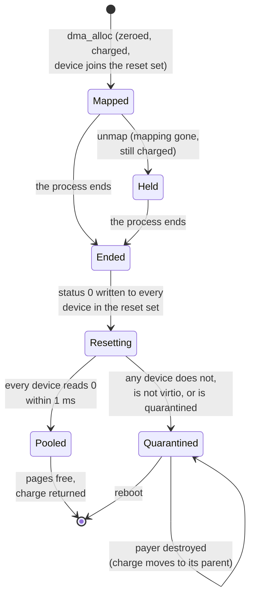

# Devices and DMA

A driver reaches hardware only through a **device object**: an MMIO range (which may carry a DMA
flag), an interrupt line, or the Reset right. The kernel makes one for each device the loader
describes at boot and never makes another. Holding a handle to one is the whole authority: to
map the registers, to receive the interrupt, to allocate memory the device may write, or to
power off. Memory given to a device is never reused until the device has been reset, and a
device that does not confirm its reset keeps that memory, and loses its object, until reboot.

## Purpose

Devices are where a capability system is easiest to get around. A process that can program a
bus master can make it read or write any physical address; one that can reach the interrupt
controller can silence everyone's interrupts; one that can name RAM by address can read any
page. So the kernel keeps device authority in objects like every other authority, keeps the
interrupt controllers and RAM out of reach altogether, and makes sure a dead driver's device
cannot keep writing into pages that have passed to someone else.

## Interface

### Device objects

Status: built · partly tested: the page a device object costs its owner, and the refusal of a DMA device past the sixteenth, are not attacked by a case · tested: bench:device, bench:irq-attack, bench:dma-rules

A device object takes one of three forms (`kernel/src/device.rs`):

| Kind | Holds | Used by |
| --- | --- | --- |
| MMIO | a physical range, whole pages; a DMA flag (the device is a bus master) | `map_device`; `dma_alloc` if the flag is set |
| IRQ | an interrupt number, a `fired` flag and a `masked` flag | `receive` ([R5](#r5-interrupts)) |
| Reset | nothing: it is the right to power off or reboot | `system_reset` |

The loader reads the machine's device tree and describes each device in the argument block's
`Devs` tag, and the interrupt controllers in its `Ctrl` tag ([boot](boot.md)). The kernel turns
each `Devs` entry into an object while it builds the budget tree, and refuses to boot on a
malformed one ([R18](#r18-device-authority)). No call creates a device object, so the set is
fixed by the machine.

A DMA-flagged device also gets a slot in the kernel's reset registry, keyed by its base: at
most `MAX_DMA_DEVICES` (16) of them. A DMA device past that gets no object at all, because a
device the kernel could not reset must not be handed out.

Each device object costs `DEVICE_PAGES` (1) page, charged to the budget that owns it, as an
endpoint is ([objects](objects.md)). At boot that owner is `system`. There is no
`device_destroy`: a device object dies when its owner budget is destroyed
([R10 (destruction)](budgets.md#r10-destruction)), or when its device is quarantined
([Quarantine](#quarantine)). Handles to device objects carry badge 0 and can be copied and
closed like any other handle; closing one leaves the object in place. The full error rows of
the device calls are in the [ABI reference](abi.md#errors-and-the-order-of-checks).

### `map_device`

Status: built · tested: bench:device, bench:irq-attack, host:redoubt-model::reset_at_one_death_does_not_cover_a_co_holder, mutation:DmaResetClearsCoHolderReach

`map_device(h(MMIO)) -> addr, len` maps the whole range readable and writable, not executable,
at an address the kernel chooses ([R11 (memory)](memory.md#r11-memory)), and returns the address
and the length in bytes. The length is what the driver may touch; which device the handle names
is the launcher's to say, and the kernel says nothing about it. Errors, in order: `BadHandle`,
`WrongObject` (an IRQ, the Reset right or any other object), `OutOfMemory` (page tables).

The device's pages are not RAM and cost nothing; the page tables that map them are charged to
the caller's budget. Each call makes a new mapping, so two calls give two addresses. The kernel
keeps no record of who mapped a device: the handle, not a page owner, is the authority, and **a
mapping outlives its handle**. Closing or revoking the handle stops new mappings, not the ones
already made; those end when the process unmaps them or ends.

Mapping a DMA-flagged device adds it to the caller's **reset set**: the devices the caller's end
must reset before its DMA pages are reused ([Reset before reuse](#reset-before-reuse)), because a
process with the registers mapped could have programmed the device with any address it knows.

### `dma_alloc`

Status: built · partly tested: the limit of `MAX_RUNS` runs per device is not attacked by a case · tested: bench:device, bench:dma-rules, host:redoubt-model::dma_pages_stay_put, mutation:DmaUnmapFrees

`dma_alloc(h(MMIO), npages) -> addr, phys` returns `npages` physically contiguous, zeroed pages,
mapped readable and writable at an address the kernel chooses, and their physical address. It is
the one call that returns a physical address, and only through a device the loader flagged as a
bus master. Errors, in order: `BadHandle`, `WrongObject` (not MMIO), `InvalidArgument` (no
pages), `NotPermitted` (no DMA flag), `OutOfMemory` (the pages, the page tables, or the
device's `MAX_RUNS` (32) runs all in use).

Each allocation is a **run**, recorded against the device it came through. Its pages are
charged to the caller's budget ([R6 (charging)](budgets.md)), but the ownership table records
them as the kernel's, not the process's, so no path that frees or moves a process's own pages
can reach them. While the process lives its runs **stay put**:
- a lend, a transfer or a `process_map` of a DMA page is `InvalidArgument`;
- `set_flags` works on them as on any page, `EXECUTE` included, which R11 forbids (Residual risks);
- `unmap` drops only the mapping: the pages stay held, charged and out of the pool.

A run's device joins the caller's reset set, as a mapped DMA device does. The pages leave the
process only at its end.

### Reset before reuse

Status: built · partly tested: that the reset precedes the pooling inside the kernel is attacked only in the model; the case runs only on rv64 · tested: bench:dma-reset-reuse, bench:dma-rules, host:redoubt-model::exit_pools_after_reset, host:redoubt-model::reset_at_one_death_does_not_cover_a_co_holder, mutation:DmaFreeBeforeReset, mutation:DmaResetClearsCoHolderReach

A DMA device may still hold the physical address of a run after the process that programmed it
has died. So no DMA page goes back to the pool until every device that could hold its address has
been reset: I16 (DMA pages reset before reuse).

- **Trigger:** the end of a process, however it ends (exit, fault, kill, its budget's
  destruction), after its own pages are released. Not the close of a device's last handle,
  because handles copy and a mapping outlives its handle.
- **The reset set** is every device one of the process's runs came through, and every DMA device
  it ever mapped. A confirmed reset at one process's end does not remove the device from a live
  co-holder's set: the co-holder can still program it, so its own end resets it again.
- **The reset:** for each device in the set, the kernel writes 0 to the virtio-mmio status
  register through a register window of its own (the device's first register page, mapped for
  the kernel alone), then reads it until it reads 0. It waits at most `RESET_US` (1000 µs) per
  device on the timebase, and at most `RESET_READS` (100 000) reads should the timebase not
  advance, without preemption. With at most `MAX_DMA_DEVICES` (16) devices in a reset set, one
  process's end can spend up to 16 ms here. The kernel does nothing else to the device: it
  never services it on the driver's behalf.
- **Pooled** only if every device in the set confirmed in that same step: then each run's pages
  go back to the pool and their charge back to the budget that paid for them. Otherwise nothing
  is pooled (see [Quarantine](#quarantine)).

A device confirms only if it answered as virtio-mmio at boot (magic `virt`, version 1 or 2, read
once when its slot is made) and has not been quarantined. Any other device never confirms.


*Figure: the life of a DMA run, from `dma_alloc` to the pool or to quarantine.*

### Quarantine

Status: built · partly tested: the cases run only on rv64 · tested: bench:dma-reset-quarantine, host:redoubt-model::deaf_device_quarantines_the_co_holder_too, host:redoubt-model::quarantine_charge_moves_to_a_parent_at_its_limit, mutation:DmaQuarantinedSlotCountsAsReset, mutation:DmaQuarantineChargeDropped, mutation:DmaQuarantinedDeviceUsable

When a device in the reset set does not confirm, every run the ending process held is
**quarantined**, the runs through devices that did confirm included: their pages are never
pooled, and nothing maps them again. Every device that did not confirm is quarantined too, and
the kernel prints `DMA: device <base> did not confirm its reset; quarantined until reboot`.

- **A quarantined device never counts as reset.** A later process end whose reset set holds it
  quarantines all of that process's runs, even if the device would reset by then.
- **Its object is destroyed** at that same process end, as R10 destroys one: every handle naming
  it closes, in every table, and a copy in a message not yet received arrives as 0. Its page
  goes back to its owner. Its base stays flagged in the registry until reboot, and no device
  object names it again. The device's interrupt object is a separate object and is not
  destroyed. A live co-holder keeps any mapping it already made (see Residual risks).
- **Charging:** a quarantined run stays charged to the budget that paid for it, the dead
  driver's. When that budget is destroyed, alone or in a subtree, the destroyed subtree's carve
  first returns to the budget above it, and only then does the charge move there, so that budget
  never exceeds its limit (I5 (usage within limits)). With no budget above it, the charge ends
  with the tree.

### `system_reset`

Status: built · partly tested: a reboot (`kind` 2) is not attacked by a case; the cases power off, and ask for a reboot only through a handle not held · tested: bench:device, bench:irq-attack

`system_reset(h(Reset), kind)` powers the machine off (`kind` 1) or reboots it (`kind` 2)
through the firmware's system reset call. On success it does not return. Errors:
`InvalidArgument` (an unknown kind, refused as the call is decoded), `BadHandle`, `WrongObject`
(not the Reset right). The kernel lets go of its memory lock before it calls the firmware,
because that call never returns.

### Devices handed to the first program

Status: built · partly tested: the loader's refusal of a device tree that names no console, or a console with no interrupt, is not attacked by a case · tested: bench:device, bench:irq-attack

The kernel gives every device object to the bundle's first program, which is where `init`
receives them to place ([below](#which-process-gets-which-device)), in the handle order
[boot](boot.md#devices-handed-to-the-first-program) gives. The objects are charged to `system`, and the handles are stamped with
`root`, so they are revoked only with the whole tree ([stamps](objects.md#r9-stamps)). A program
finds its DMA devices by asking: `dma_alloc` is `NotPermitted` without the flag and
`WrongObject` on an IRQ or the Reset right.

### Which process gets which device

Status: planned · M1 (separation and containment)

The loader loads only the kernel and `init`, and `init` holds every device object. The boot
manifest's `devices` entry names each device object, its device-tree node and whether it may do
DMA; each server's entry names the devices it gets ([init](../servers/init.md)). `init` places
each driver's handles in its startup block, by name, so no driver depends on a handle's index.
The Reset right stays with `init`. In a confined deployment `init` refuses a manifest that lets
two label sets share a device. A driver that ends is restarted with the same handles, unless its
device was quarantined, which only a reboot undoes.

**Open:** which authority decides what becomes a device object and which devices may do DMA:
the loader's device-tree reading, the manifest, or both checked against each other; how a
driver learns which handle is which (named handles in the startup block, with the kernel saying
nothing); whether `init` keeps its own copy of each handle it places, so it can restart a
driver, and so stays a co-holder; what `init` does when a restarted driver's device was
quarantined.

## Authority

Status: built · tested: bench:irq-attack, bench:device, bench:dma-rules, bench:dma-reset-quarantine

- **A device handle is the device.** An MMIO handle is the right to map its registers, an IRQ
  handle the right to receive its interrupt, the Reset handle the right to stop the machine.
  Device handles carry badge 0 and no rights bits.
- **A DMA-flagged MMIO handle is kernel-level trust.** It lets its holder call `dma_alloc` and
  point a bus master at physical addresses. Without an IOMMU the device can then reach any RAM,
  so a holder of one is inside the TCB while it lives.
- **Handles copy.** A device handle passes in a message or a startup block like any other. Two
  holders can both map one device; an interrupt goes to whichever holder's thread is waiting in
  `receive`. A driver that must be alone is alone only because whoever holds the handle gave it
  to it and to nobody else. Whoever hands out a device handle hands out the device.
- **Revocation** closes the handle (its stamp's budget destroyed, or the object destroyed with
  its owner or by quarantine). It does not reach a mapping already made (see Residual risks).
- **Nothing else reaches a device.** No call takes a physical address; `map_anon` and
  `map_fixed` give fresh zeroed RAM wherever they map ([R18](#r18-device-authority)).

## Security properties

### R5 (interrupts)

Status: built · partly tested: masking a fired source is attacked only in the model; completing the claim before masking, and billing an interrupt to its IRQ object's owner, are not attacked · tested: bench:uart-irq, mutation:R5NoMaskOnFire, mutation:R5NoUnmaskOnReceive

When an interrupt fires, the kernel masks its source and sets the IRQ object's `fired` flag.
`receive` on the IRQ handle unmasks the source when it begins, then returns an `interrupt`
record as soon as `fired` is set, clearing it ([IPC](ipc.md#what-receive-returns)). There is no
acknowledge call. So a source stays masked from the moment it fires until its driver next
receives, and a driver that is busy, stuck or dead cannot be stormed by its own device. A
level-triggered source still asserted when the driver receives fires again at once, and that
`receive` returns straight away.

- The kernel completes the controller's claim first, while the source is still enabled, and
  masks it straight after. The PLIC (the RISC-V platform interrupt controller) ignores a
  completion for a source that is not enabled, and would never raise that source again. Nothing
  can be delivered in between: the hart takes no interrupt in supervisor mode.
- An interrupt no IRQ object owns is completed and masked, and stays masked.
- Every IRQ object starts masked, so a source nobody receives on cannot storm the kernel.
- An interrupt that fires with no thread waiting keeps `fired` set; the next `receive` returns
  at once. One fire answers one waiting thread.
- The kernel's time handling an interrupt is billed to the budget that owns the IRQ object
  ([scheduling](scheduling.md)), not to whichever budget it interrupted.

An interrupt raised while its object is masked, before the driver's first `receive`, was lost
in one diagnostic run on QEMU; the cause is not found. Follow-up:
[todo](../todo/irq-level-latch.md).

```mermaid
sequenceDiagram
    participant T as Driver thread
    participant K as Kernel
    participant P as PLIC
    participant D as Device
    T->>K: receive(IRQ handle, timeout)
    K->>P: unmask the source
    Note over K: fired not set: the thread blocks
    D->>P: raise the line
    P->>K: external interrupt; claim
    K->>P: complete the claim
    K->>P: mask the source
    Note over K: fired set, then cleared<br/>by answering the waiting thread
    K->>T: record: kind = interrupt
    Note over T,D: the driver services the device;<br/>the source stays masked
    T->>K: receive(IRQ handle, timeout)
    K->>P: unmask the source
    Note over P,D: a line still asserted<br/>fires again at once
```
*Figure: one interrupt, from the driver's `receive` to the next.*

### R18 (device authority)

Status: built · partly tested: the kernel's refusal of a malformed `Devs` entry (one overlapping RAM or an interrupt controller among them) and of a `Grnt` boot argument is not attacked by a case · tested: bench:irq-attack, bench:loader-rejects-grants, bench:legacy-gone

Device objects are the only device authority. A process reaches an MMIO range, an interrupt or
the Reset right only through a handle to its device object; a process that holds none gets
`BadHandle` from every device call, and the holder keeps its interrupt. No call names a
physical address, so neither a device's registers nor RAM can be reached by address
([R11](memory.md#r11-memory)). No call number outside the call table does anything: each is
`InvalidArgument`, so no number claims an interrupt or maps a physical address. The bundle
carries no list of device claims: the loader refuses a bundle with a `grants` entry, and the
kernel refuses a `Grnt` boot argument.

Two ranges never become device objects, because either would give away everything else: an
**interrupt controller** (a holder of the PLIC could mask and raise every source; one of the
CLINT, the core-local timer block, could forge timer interrupts) and **RAM**. The loader leaves
both out of the device list, but that is a reading of a device tree the kernel does not trust,
so the kernel checks every `Devs` entry itself. It refuses to boot on an MMIO entry that
overlaps RAM or a `Ctrl` range, wraps the address space, is empty or is not whole pages, and on
an IRQ entry for interrupt 0 (the hart timer, a hart resource and not a device). The kernel maps
the PLIC for itself alone.

## Failure and restart

Status: built · partly tested: destroying a device object's owner budget, and a device handle closing when the budget that stamped it is destroyed, are not attacked by a case · tested: bench:dma-reset-reuse, bench:dma-reset-quarantine, bench:dma-rules, bench:pid-reuse-authority

- **A driver ends**, however it ends: its device mappings go with its address space, its
  handles close, and its DMA runs are reset and pooled, or quarantined. The device objects
  survive, so another holder can hand the handles to a restarted driver, which finds the device
  reset. A PID the driver held passes on with none of its mappings or handles
  ([R20 (PID reuse)](processes.md#r20-pid-reuse)).
- **A driver dies mid-interrupt:** the source stays masked until the next `receive` by any
  holder of the IRQ handle.
- **A device fails its reset:** it is quarantined, its object destroyed and its handles closed
  everywhere; it is gone until reboot ([Quarantine](#quarantine)).
- **A device object's owner budget is destroyed:** each device object it owns is destroyed.
  Threads waiting in `receive` on an IRQ object get `Dead`, its source is masked, every handle
  naming the object closes, and its page goes back ([R10](budgets.md#r10-destruction)). Nothing
  makes a device object again, so the device is unreachable until reboot.
- **The budget that stamped a device handle is destroyed:** that handle closes; the object and
  other holders' handles stay.
- No argument to any device call can make the kernel panic (I14 (no call panics the kernel)).

## Residual risks

- **A DMA driver is TCB without an IOMMU.** Its device can read and write any physical address
  it is given, not only its runs. The DMA flag is the loader's reading of the device tree
  (`compatible` names virtio); a bus master the loader does not flag is still a bus master, and
  whoever maps it can program it. Reset-before-reuse closes one hole, a dead driver's device
  writing into pages that have passed on; it does not confine a live driver. The answer is
  hardware confinement ([FPGA platform](../beyond/fpga-platform.md)).
- **Only virtio-mmio devices are reset.** A DMA device that does not answer as virtio-mmio never
  confirms, so every process end that reaches it quarantines, even one whose pages that device
  never held, and such a platform gets no driver restart. The boot read that classifies each
  DMA device assumes the read has no side effect, true of the virtio nodes the loader flags.
- **A reset stops the device for every holder.** Any holder that mapped a DMA device, or
  allocated through it, resets it when it ends, under every other driver of that device.
- **A co-holder keeps its mapping of a quarantined device**, and of any device whose handle was
  revoked: the kernel does not unmap device ranges. It can go on programming a quarantined
  device until it ends, when its own runs are quarantined in turn.
- **One early process holds all device authority**: the bundle's first program holds every
  device object, the Reset right and every DMA device, and nothing narrows that until `init`
  places them ([below](#which-process-gets-which-device)).
- **A device tree that hides a controller** from the loader's controller search as well as from
  its device list defeats the kernel's `Ctrl` check: the kernel's own list of controllers comes
  from the same tree ([boot](boot.md)).
- **Quarantine costs memory for good**, in exactly the hostile case, a device that ignores its
  reset: its runs stay charged to the dead driver's budget, then its parent, until reboot. A
  quarantined run through a device still in service also keeps one of that device's
  `MAX_RUNS` places.
- **The reset poll is not preemptible:** up to 1 ms per device in the reset set, 16 ms at most
  for one process end, on top of the rest of its teardown ([scheduling](scheduling.md)).
- **The order inside the kernel is argued, not attacked.** `dma-reset-reuse` reads the device's
  status after `dma_alloc` has handed a frame to a new holder, so it shows the reset came before
  the new holder's use. That the reset strictly precedes the pooling rests on the kernel's own
  assertion and the model's I16 check.
- **DMA reset and quarantine are attacked only on rv64.** On rv32 the test build that makes a
  first reset fail is compiled, never run. Follow-up: [todo](../todo/dma-reset-rv32.md).
- **Two halves of R5 are not attacked on QEMU.** Its 16550 console raises the controller once
  per byte, not from a held level, so a kernel that never masked a fired source passes
  `uart-irq`; and QEMU accepts a completion for a masked source, so the completion order cannot
  be told apart. The mask is attacked in the model; the order is argued from the code.
- **An interrupt can be lost before the first `receive`:** seen once on QEMU, cause not found.
  Drivers drain their rings after every `receive`. Follow-up: [todo](../todo/irq-level-latch.md).
- **A device mapping or DMA page can be made executable.** `set_flags` refuses writable and
  executable together, but not executable on a device range or a DMA page, which R11 forbids.
  Two `map_device` mappings of one range can be one writable and one executable, and a device
  can write a DMA page that is executable
  ([memory](memory.md#residual-risks)). Follow-up: [todo](../todo/device-mapping-exec.md).
- **Page tables stay after `unmap`.** The tables that mapped a device range or a run stay
  charged to the process until it ends. Follow-up: [todo](../todo/page-table-freeing.md).
- **An interrupt's kernel time is billed to the IRQ object's owner** (`system` at boot), not to
  the driver that holds the handle. Masking bounds it to one interrupt per `receive`, at the
  driver's pace.
- **Finding an interrupt's IRQ object scans every kernel-object frame** up to the highest one
  ever used, on every interrupt, so interrupt latency grows with the objects other budgets
  create ([scheduling](scheduling.md#residual-risks)). Follow-up:
  [todo](../todo/kernel-scan-bounds.md).

## Why

- **Device objects, not claim lists.** A per-process list of ranges and interrupts in the
  signed bundle would be a second kind of authority, checked by process identity and not
  revocable by budgets. A device object is an object like any other: held as a handle, passed
  by `init`, charged to a budget and revoked with it.
- **The kernel keeps the controllers and RAM out itself**, because the loader's exclusion is a
  heuristic over an untrusted device tree, and one missed controller would hand its holder every
  interrupt.
- **Mask on fire, unmask on receive, no acknowledge.** The driver's own `receive` is the
  acknowledgement, so one fire costs the kernel one interrupt until the driver asks for the
  next, and a driver that stops asking stops its device's interrupts, nobody else's.
- **Reset at the end of a process, not at the last handle's close,** because handles copy and a
  mapping outlives its handle: the only moment the kernel knows a process can no longer program
  a device is when that process is gone.
- **Reset before reuse, and quarantine when it fails.** A dead network driver's freed pages hold its descriptor tables and
  rings, and a virtio device re-reads them on every packet. Whoever next owns those pages could
  post descriptors pointing anywhere: every received frame becomes an arbitrary physical write
  of network bytes, every transmit an arbitrary read sent out. A driver may reset its own device
  on a controlled exit ([netd](../servers/netd.md) does), but one that faults or is killed
  cannot, so the kernel's reset is the one that holds. A device that will not confirm is exactly
  the hostile one, so its pages are given up rather than risked.
- **A quarantined device never counts as reset**, or a co-holder's end would pool pages the
  device may still write.
- **DMA pages stay put** so that the process whose end triggers the reset is the only one that
  ever held them.
- **The charge stays with the payer, then its parent after the carve returns,** so quarantine
  never takes a budget over its limit and stays with the tree that paid for it.
- **`map_device` returns the length** so a driver needs to know nothing about where its device
  is; which device it holds comes from the manifest, by name.
