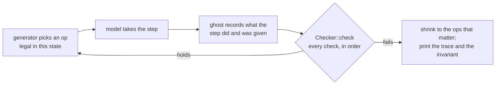

# Invariants

The invariants are the sixteen facts about kernel state that hold between any two steps, after
any sequence of calls with any arguments. The rules say what each call does; the invariants say
what must still be true when it has done it. The [executable model](model.md) checks all of them
after every step of every random sequence, and the bench's attack cases try to break them on the
real kernel. This page owns all sixteen: each section gives the statement, where the kernel
keeps it, the model's check and the tests that attack it.

## Purpose

A rule can be kept by every call and the system still go wrong, because the calls interact: a
destroy that forgets one table, a delivery that charges one page too few, a timeout that fires
on one path but not another. An invariant is stated over the whole state, so a check made after
every step catches a wrong update wherever it happened. The invariants are also the claims the
rest of the documentation leans on: "a revoked handle is gone everywhere", "no page is writable
and executable", "a DMA page is never reused while a device can write it".

Most invariants are the state-level form of rules other pages own, such as
[R1 (flow)](ipc.md#r1-flow) and [R10 (destruction)](budgets.md#r10-destruction):

| ID | Short name | Mostly a consequence of |
| --- | --- | --- |
| [I1](#i1-handles-name-live-objects) | handles name live objects | R10 |
| [I2](#i2-revocation-is-complete) | revocation is complete | R10 |
| [I3](#i3-minted-badges-are-non-zero-and-narrow) | minted badges are non-zero and narrow | [R9 (stamps)](objects.md#r9-stamps) |
| [I4](#i4-only-badge-0-handles-receive) | only badge-0 handles receive | [`mint`](objects.md#mint) |
| [I5](#i5-usage-within-limits) | usage within limits | [R6 (charging)](budgets.md#r6-charging), [R7 (carving)](budgets.md#r7-carving) |
| [I6](#i6-labels-only-grow-downward) | labels only grow downward | [budgets](budgets.md) |
| [I7](#i7-every-flow-obeys-r1) | every flow obeys R1 | R1 |
| [I8](#i8-class-and-account-inherited) | class and account inherited | [R8 (accounts)](budgets.md#r8-accounts) |
| [I9](#i9-pages-wx-zeroed-lends-unmapped) | pages W^X, zeroed, lends unmapped | [R11 (memory)](memory.md#r11-memory) |
| [I10](#i10-create-destroy-leaves-the-parent-unchanged) | create-destroy leaves the parent unchanged | R6, R7, R10 |
| [I11](#i11-fair-turns) | fair turns | [R2 (fair waiting)](ipc.md#r2-fair-waiting) |
| [I12](#i12-ids-never-reused) | ids never reused | [messages](ipc.md#messages) |
| [I13](#i13-every-blocking-call-returns-by-its-timeout) | every blocking call returns by its timeout | [timer](timer.md) |
| [I14](#i14-no-call-panics-the-kernel) | no call panics the kernel | [ABI](abi.md#errors-and-the-order-of-checks) |
| [I15](#i15-abandoned-calls-reported-once) | abandoned calls reported once | [R3 (lends and abandoned calls)](ipc.md#r3-lends-and-abandoned-calls) |
| [I16](#i16-dma-pages-reset-before-reuse) | DMA pages reset before reuse | R11, [devices](devices.md) |

## How the model checks them

Status: built · tested: host:redoubt-model::kernel_sequences, host:redoubt-model::budget_lifecycles, host:redoubt-model::flood, host:redoubt-model::mutations_are_caught

The [model](model.md) (`model/`) is a second implementation of the kernel's calls, written
against the specification and not the kernel source. A generator picks an operation that is
legal in the current state (a call with chosen or hostile arguments, a read, write or fetch of
memory, a fault, an interrupt, time passing), the model takes the step, and `Checker::check` in
[`model/src/invariants.rs`](../../model/src/invariants.rs) runs every check on the state that
results. A random sequence is up to 150 steps, and the kernel and budget-lifecycle families run
20,000 sequences each by default.

The checks never read the counters and derived fields the model's kernel keeps. They recompute
what should be true from the objects themselves and from the **ghost**
([`model/src/ghost.rs`](../../model/src/ghost.rs)): records taken from handle tables, budgets
and call arguments at the moment of each event (how each handle came to be, what each message
was when sent, which devices could still write each DMA page). A wrong update anywhere then
disagrees with the recomputation, whichever call made it.

*Figure: how one random sequence is checked.*

| Invariant | Checked by |
| --- | --- |
| I1, I2, I3 | `i1_i2_i3_i4_handles` |
| I4 | `i1_i2_i3_i4_handles`; `delivered` (the receiving handle); `structure` (exit endpoints) |
| I5 | `i5_charging` |
| I6, I8 | `i6_i8_budgets` |
| I7 | `Checker::flows`, `delivered`, `exits_owed` |
| I9, I16 | `Checker::i9_memory` |
| I10 | `check::budget_lifecycle` ([`model/src/check.rs`](../../model/src/check.rs)): a pair of calls, not one state |
| I11 | `Ghost::took`, and the `flood` family in `check.rs` |
| I12 | `Ghost::budget_created`, `Ghost::delivered`; `i6_i8_budgets` (a child's id is above its parent's) |
| I13 | `i13_timeouts` |
| I14 | the property runner (`model/tests/common/mod.rs`), which counts a panic in any family as a failure |
| I15 | `Checker::i15_abandoned`, `Checker::flows` |

A check that nothing can fail proves nothing, so the model also carries **mutations**: each
breaks one rule in one place, and `mutations_are_caught` requires every one to make some
property fail. The mutations named in the status lines below are the ones each invariant's check
detects; the rule checks run in the same pass and catch the rest.

## The invariants

### I1 (handles name live objects)

Status: built · tested: bench:budget-forge-attack, bench:budget-destroy-attack, bench:process, host:redoubt-model::exited_object_handles_and_queued_copies_live_until_notice_receipt, host:redoubt-model::kernel_sequences

A process can name objects only by indices into its own handle table, which holds at most
`MAX_HANDLES` (4096: the handles one process may hold). Index 0 is never a handle. Every live
handle names a live object and carries a live stamp. A handle to a process object stays live
while the process runs and while its exit notice waits to be received.

**Kept in** [`kernel/src/handle.rs`](../../kernel/src/handle.rs). A lookup reads only the
caller's table; an index of 0 or past the last table page is `BadHandle`, as is one wider than
32 bits, refused while decoding. Installing past `MAX_HANDLES` is `TooLarge`. A handle names its
object and its stamp each by frame and by id, and every lookup (`budget_at`, `endpoint_at`,
`device_at`, `process_at`) compares the id with the one in the frame: a handle that escaped
R10's sweep would name a freed and perhaps reused frame, and the kernel stops rather than use
it. An object's frame is freed only after the handles naming it are swept (`destroy_endpoint`
and `destroy_device` in `kernel/src/message.rs`, `free_object` in `kernel/src/process.rs`).

**Model check:** `i1_i2_i3_i4_handles`: no table uses index 0, and every handle anywhere (in a
table, as an exit endpoint, or carried in a queued message) names a live object.

**Attacks:** `budget-forge-attack` passes every unused index, indices on table pages that do not
exist, 0, past the table and wider than 32 bits to every budget call, while a victim lives in the
budget a wrong lookup would destroy. `budget-destroy-attack` keeps using indices into a destroyed
subtree while frames and indices are reused. `process` checks that a process handle closes when
its notice is taken. The model test keeps a process handle and a queued copy of it through the
process's exit and sees both go at notice receipt, the copy arriving as 0.

### I2 (revocation is complete)

Status: built · tested: bench:budget-destroy-attack, bench:redoubt-revoke, bench:budget-deadline, bench:process-attack, mutation:R10KeepForeignHandles, host:redoubt-rt::badges_are_never_reused_and_ids_are_never_zero

After a budget is destroyed, no handle stamped with it or with any budget below it can be used
anywhere: none is left in any process's table, and a copy carried in a message not yet received
arrives as 0 in its slot. This is what makes a budget a revocation scope.

**Kept in** `destroy_marked` ([`kernel/src/budget.rs`](../../kernel/src/budget.rs)): once the
subtree's processes are gone, one sweep closes, in every table, each handle whose object or whose
stamp is a dying budget, or whose endpoint, device or process object dies with one. Messages are
reached by `budgets_dying` in `kernel/src/message.rs`: a queued message sent through a handle
stamped with a dying budget fails its sender with `Dead`, and a taken one is abandoned (R3). A
handle carried inside a queued message is checked again at delivery (`is_live`) and installed as
0 if its stamp or object has gone. Servers built on the runtime (`libs/rt`) never reuse a badge,
so a revoked grant cannot come back as a later client's
([serving](../servers/serving.md)).

**Model check:** `i1_i2_i3_i4_handles`: no handle anywhere, queued messages included, is stamped
with a destroyed budget. `R10KeepForeignHandles` (the stamp sweep skipped) fails here.

**Attacks:** `budget-destroy-attack` destroys a four-deep subtree and tries every call on every
index into it. `redoubt-revoke` destroys the budget a queued message's handle was minted into and
receives the message: the handle arrives as 0. `budget-deadline` lets a deadline destroy a
budget and checks the handles to it, to its child and stamped with it are gone. `process-attack`
revokes every handle a destroyed budget's processes created and handed to a process outside it.

### I3 (minted badges are non-zero and narrow)

Status: built · tested: bench:redoubt-ipc-attack, bench:redoubt-revoke, bench:redoubt-ipc, host:redoubt-sys::malformed_calls_are_refused, mutation:R9MintStampsCaller

A handle made by `mint` has a badge other than 0, and its stamp is its source's default stamp or
a budget below it. So minting never makes a receive right, and never makes a grant that outlives
the budget it came from.

**Kept in** `mint` (`kernel/src/message.rs`): decoding refuses badge 0 (`InvalidArgument`) and
`mint` checks it again, so neither check rests on the other; a narrowing budget handle must name
the default stamp or a budget below it (`is_at_or_below`), or the call is `NotPermitted`. The
default stamp is the source handle's stamp, or, minting from an open call, the stamp of the
handle the call came through.

**Model check:** `i1_i2_i3_i4_handles`: every minted handle has a non-zero badge and a stamp at or
below its recorded default. `R9MintStampsCaller` (stamping with the minter's own budget) fails
here.

**Attacks:** `redoubt-ipc-attack` mints badge 0 in raw registers (the typed call cannot carry
one) and narrows into a budget it does not hold; `redoubt-revoke` narrows into a budget above and
one beside the default stamp (`NotPermitted`); `redoubt-ipc` has the server mint badge 0 and
badge 77. `malformed_calls_are_refused` pins the decoder's refusal of badge 0.

### I4 (only badge-0 handles receive)

Status: built · tested: bench:redoubt-ipc-attack, bench:redoubt-ipc, bench:process-attack, mutation:ReceiveWithBadgedHandle, mutation:ExitEndpointBadged

Only an endpoint handle with badge 0, a **receive right**, can `receive`. Every receive right is
made when its endpoint is made, or copied from one; none is minted.

**Kept in** `receive` (`kernel/src/message.rs`: a badged endpoint handle is `NotPermitted`);
`mint` (only a receive right mints, and I3 keeps badge 0 out of its results); `process_create`
([`kernel/src/process.rs`](../../kernel/src/process.rs): an exit endpoint must be named by its
receive right, so no exit notice can be steered to a handle somebody minted).

**Model check:** `i1_i2_i3_i4_handles` (no minted receive right); `delivered` (every message was
taken through a badge-0 handle to its own endpoint); `structure` (every exit endpoint is a
receive right).

**Attacks:** `redoubt-ipc-attack` receives on its badged handle, mints from it, and mints from
handles it does not hold, while the victim keeps its receive right; `redoubt-ipc`'s client does
the same with a handle the server minted for it; `process-attack` names a badged exit endpoint.

### I5 (usage within limits)

Status: built · tested: bench:budget, bench:budget-carve-attack, bench:redoubt-tight, host:redoubt-model::quarantine_charge_moves_to_a_parent_at_its_limit, mutation:R4OverdrawOnDelivery, mutation:R7NoCarveCheck

For every budget, pages, processes and carved weight used are at most its limits, and its
children's limits and own pages, plus its own objects, fit within them. A server's charge for the
lends it holds is at most `MAX_LEND_PAGES` (16 pages) per open call, and a process holds at most
`MAX_OPEN_CALLS` (64), so a process's lends cost it at most 1024 pages.

**Kept in** `charge` (`kernel/src/budget.rs`: `OutOfMemory` past the limit, for every
allocation); the carve checks in `budget_create` (pages, processes, weight, in that order);
[R4 (delivery)](ipc.md#r4-delivery) checking before a delivery that the receiver can pay for
all of it; `dma_migrate_quarantine` in `kernel/src/dma.rs` moving a
quarantined page's charge to a parent only after the destroyed child's carve has come back. Every
uncharge and every carve return is a checked subtraction: a bookkeeping bug stops the kernel
rather than wrap a counter.

**Model check:** `i5_charging` recomputes every budget's usage from the objects charged to it
(the cost table) and requires it to equal the budget's counters and fit its limits.
`R4OverdrawOnDelivery` and `R7NoCarveCheck` fail here; the R6 mutations fail the recount in the
same function.

**Attacks:** `budget` checks usage within limits after every step of its carving sequence;
`budget-carve-attack` carves past every limit with the largest and wrapping values, and a victim
in the same budget must still get its pages; `redoubt-tight` sends a lend to a receiver that can
pay for the pages but not the page tables that map them, and the receiver is charged nothing.

### I6 (labels only grow downward)

Status: built · tested: bench:budget, bench:process-attack, mutation:LabelsAddedByParentClass

A budget's labels never change after it is created. A child's label set contains its parent's,
and only a creator whose own budget is class `system` may add labels.

**Kept in** `budget_create` (`kernel/src/budget.rs`): the labels asked for are sorted and
deduplicated, a set that lacks one of the parent's is `LabelDenied`, and a set that differs from
the parent's is `ClassDenied` unless the caller's budget is class `system`. No call changes a
budget's labels.

**Model check:** `i6_i8_budgets`: every budget's labels equal the ghost's record at creation,
contain the parent's, and differ from them only if the creator was class `system`.
`LabelsAddedByParentClass` (checking the parent's class, not the creator's) fails here.

**Attacks:** `budget` drops a labelled parent's label and is refused, and adds labels as a
system-class caller; `process-attack` runs a user-class process that tries to add a label.

### I7 (every flow obeys R1)

Status: built · partly tested: a message between user budgets with different labels is attacked only in the model · tested: bench:process-attack, bench:process-review, mutation:R1SkipLabelCheck, mutation:R1ChecksReceiverNotOwner, mutation:R1ExitNoticeIgnoresLabels, mutation:R1UsageIgnoresLabels, mutation:R1UsageExemptBySystemTarget, mutation:R1ExitExemptBySystemExiting

Every flow of information the kernel carries obeys R1: messages, exit notices and `budget_usage`
reads. A message is compared with its endpoint's **owner**, the budget that created it, whoever
takes it. So handing a receive right to another budget is delegation of the whole endpoint: what
arrives there was checked against the owner's labels. Between user budgets a message needs equal
label sets, so a receive right cannot travel between two user label sets; a system-class server
must never hand one across ([servers](../servers/README.md#labels)).

**Kept in** `send` (`kernel/src/message.rs`, stage 3: sender against the endpoint owner, for
`call` and `send`); `allowed` (`kernel/src/process.rs`: an exit notice from the exiting budget to
the exit endpoint's owner, dropped if it fails); `budget_usage` (`kernel/src/budget.rs`).

**Model check:** `Checker::flows` and `delivered`: every delivered message between user budgets
had equal labels with the owner, every notice and usage read went to a system-class budget or a
superset, and every `LabelDenied` was one R1 requires; `exits_owed`: no endpoint holds a notice
that was not owed to it. Each listed R1 mutation fails one of these.

**Attacks:** `process-attack` reads a labelled sibling's usage from a user budget
(`LabelDenied`); `process-review` sends exit notices up and down between label sets.

### I8 (class and account inherited)

Status: built · tested: bench:process-attack, mutation:ClassNotInherited, mutation:R8AccountFromArgument

A child budget's class is its parent's. Its account is its parent's unless the parent's is 0;
then the creator chooses it. The one exception is `users`, which the kernel makes at boot as a
class-`user` child of the class-`system` `root`.

**Kept in** `budget_create` (`kernel/src/budget.rs`): `new_budget` is given the parent's class,
never the caller's, and the account is the parent's when that is non-zero, whatever the
argument says (R8).

**Model check:** `i6_i8_budgets`. `ClassNotInherited` (the creator's class) and
`R8AccountFromArgument` fail here.

**Attacks:** `process-attack` asks for account 999 under a parent with a non-zero account and
reads the account the kernel attaches to the child's messages; the same probe, in a child of
`users`, is refused adding a label, which shows its class is `user`.

### I9 (pages W^X, zeroed, lends unmapped)

Status: built · partly tested: reuse of a freed frame, and a lender touching its own lent page, are attacked only in the model · tested: bench:wx, bench:write-only-attack, bench:mem-attack, bench:map-fixed-attack, bench:return-lent-unmapped, bench:uaf-lent-page, mutation:R11NoZeroing, mutation:R11SetFlagsAllowsWx, mutation:R11AllowsWriteOnly, mutation:R11LendStaysMapped

No user page is ever mapped writable and executable, or writable without being readable. Every
page is zeroed before a process first sees it. A lent page is unmapped from its lender until the
call ends, so a page is reachable from at most one address space at a time. This is R11's
state-level form; the kernel's own mappings are R19 (kernel W^X)'s
([memory](memory.md)).

**Kept in** `check_permissions` ([`kernel/src/arch/riscv/mem.rs`](../../kernel/src/arch/riscv/mem.rs):
every user mapping; decoding refuses W+X flags before that); zeroing through the physmap before a
mapping exists (`map_anon` and `map_fixed` in [`kernel/src/mem.rs`](../../kernel/src/mem.rs),
`alloc_contiguous` for DMA, `ensure_page_exists_inner` for a page backed on first touch);
`lend_out`, which clears the lender's valid bit and
keeps the entry as the record of the loan, so the lender faults on the page and cannot unmap or
remap it until `reply` or a failed call gives it back.

**Model check:** `Checker::i9_memory`: no mapping is W+X or write-only, every frame that appears
since the last step reads zero, and no frame is reachable from two address spaces. The four
listed R11 mutations fail here.

**Attacks:** `wx` runs children that make a writable page executable and write to their code, and
the kernel must end them with the matching fault; `write-only-attack` asks for W without R through
every call; `mem-attack` lends a victim fresh pages after the victim freed secret-filled ones,
and the victim finds them zero; `map-fixed-attack` refuses W+X and reads a fresh page as zero;
`return-lent-unmapped` has a second thread unmap and remap a page while it is lent;
`uaf-lent-page` kills a lender and checks the frame is not reused under the borrower.

### I10 (create-destroy leaves the parent unchanged)

Status: built · tested: bench:budget, bench:budget-deadline, bench:process-lifecycle, bench:process-attack, host:redoubt-model::budget_lifecycles, mutation:R10KeepCarvedLimits

Creating a budget and then destroying it leaves its parent's usage and free limits as they were,
once the exit notices of its processes are received or dropped. The notices matter because a
process object is charged to its creator until its notice is taken.

**Kept in** `return_carve` (`kernel/src/budget.rs`: the child's limits and its own page back to
the parent) and `mark_dying` (its weight, first); `free_object` (`kernel/src/process.rs`: a
process object's page back to its creator when its notice is received or dropped).

**Model check:** `check::budget_lifecycle`: after a random prefix, a thread creates a child,
starts a process in it, lets only the child's subtree act, destroys it and receives the notices;
every budget's counters must be what they were. It catches `R10KeepCarvedLimits`, which the
per-step recount in `i5_charging` catches too.

**Attacks:** `budget` destroys a nested subtree and checks the parent's usage exactly, then runs
500 create-nest-destroy cycles; `budget-deadline` checks `system`'s usage after a deadline
destroys a lease; `process-lifecycle` checks exact budgets after 260 exits; `process-attack`
checks that receiving notices refunds the creator's pages exactly.

### I11 (fair turns)

Status: built · partly tested: turns between several groups on one endpoint are attacked only in the model · tested: host:redoubt-model::flood, host:redoubt-model::kernel_sequences, mutation:R2FifoAcrossAccounts

With k groups of R2 blocked on an endpoint, and the receiving process holding fewer than
`MAX_OPEN_CALLS` open calls, each group's oldest message is taken within k receives.

**Kept in** `next_sender` (`kernel/src/message.rs`): the oldest message of the next group after
the endpoint's cursor, the group served last, wrapping round once; `deliver` moves the cursor.
A refused message (R4) takes its turn too, so a group that cannot be paid for does not stall the
others.

**Model check:** `Ghost::took`: while one group's oldest message waits, no other group is taken
twice. The `flood` family queues up to 10,000 senders from many groups, some servers hoarding
open calls to the limit, and checks one principal's call is taken within as many receives as
there are groups. `R2FifoAcrossAccounts` (oldest first across all senders) fails here.

### I12 (ids never reused)

Status: built · partly tested: id reuse is not visible to a process, so budget and message ids are attacked only in the model and other object ids not at all · tested: bench:redoubt-ipc, bench:redoubt-ipc-attack, mutation:MsgIdsGlobal

Object ids (budgets, endpoints, devices, process objects) are never reused. A message id is
never 0 and never reused within its receiving process, and it comes from that process's own
counter, so it says nothing about anyone else's traffic. A stale id therefore cannot reach a later
message, and a stale handle cannot reach a later object in the same frame.

**Kept in** `next_object_id` (`kernel/src/budget.rs`: one 64-bit counter for every kind of
object, checked so it stops rather than wrap) and `next_msg_id` (per process, from 1, in the
process's account; a new process in a reused PID starts again, having inherited nothing:
[R20 (PID reuse)](processes.md#r20-pid-reuse)). Object ids stay in the kernel; a process sees
handle indices.

**Model check:** `Ghost::budget_created` (no budget id issued twice) and `Ghost::delivered` (each
process sees its own ids 1, 2, 3, ...); `i6_i8_budgets` (a child's id is above its parent's).
`MsgIdsGlobal` (one counter shared by every process) fails here.

**Attacks:** `redoubt-ipc`'s server checks each call's id differs from the previous one;
`redoubt-ipc-attack` replies to, serves and mints from ids that are not its own.

### I13 (every blocking call returns by its timeout)

Status: built · partly tested: timeouts on more than one hart are not attacked by a case · tested: bench:timeouts, host:redoubt-model::kernel_sequences, mutation:TimeoutIgnoredWhileOthersRun

Every blocking call returns by its timeout. Its `Timeout` is committed, and its thread made
runnable, at the first kernel entry at or after the timeout, and the always-armed timer bounds
when that entry comes by timer latency. When the thread then runs is R12 (scheduling)'s: a
timeout is a wake, and a wake alone never preempts ([scheduling](scheduling.md#r12-scheduling)).
`FOREVER` (the largest timeout) never expires.

**Kept in** `expire_due` ([`kernel/src/time.rs`](../../kernel/src/time.rs)), which runs first at
every kernel entry, before anything reads the entering process, and commits everything due,
earliest first (at an equal instant timeouts before budget deadlines); `rearm`, which keeps the
one hardware timer armed for the earliest of slice end, timeouts and deadlines, rounding up so it
never fires early; `next_timeout` and `time_out` in `kernel/src/message.rs`, which unwind what the
thread waited for (a queued message's buffer back, a taken call abandoned under R3).

**Model check:** `i13_timeouts`: after every step, no thread is still blocked past its timeout.
`TimeoutIgnoredWhileOthersRun` (timeouts fire only while nothing runs) fails here.

**Attacks:** `timeouts` runs under virtual time, so lateness is measured the same on any host and
asserted: idle sleeps end on time and never early; queued and taken calls, sends and receives time
out; `FOREVER` and saturating timeouts never do; a reply racing a timeout lands on exactly one
side 200 times.

### I14 (no call panics the kernel)

Status: built · tested: bench:budget-syscall-attack, bench:syscall-attack, bench:redoubt-tight, host:redoubt-sys::malformed_calls_are_refused, fuzz:redoubt-sys/decode, host:redoubt-model::kernel_sequences

No sequence of system calls, with any arguments, panics the kernel. A malformed value is an
error, never a stop.

**Kept in** `redoubt-sys` ([`libs/sys`](../../libs/sys/src/lib.rs)), whose decoders reject every
malformed register and record slot with an error; `kernel/src/redoubt.rs`, which checks every
record's alignment and that it lies in the caller's own writable memory before reading it, then
runs each call's checks in the fixed order ([ABI](abi.md#errors-and-the-order-of-checks)). The
kernel's own assertions (I1's id checks, I5's checked
subtractions) are for kernel bugs, not for arguments: no argument reaches them.

**Model check:** the property runner catches a panic in any family and reports it as an I14
failure; the generator mixes calls whose arguments ignore the state entirely with legal ones, and
the model builds with overflow checks on, so an arithmetic overflow is a panic too.

**Attacks:** `budget-syscall-attack` sends bad and wide handles, unknown numbers, stray
registers, misaligned, kernel, read-only, untouched and straddling records and 4000 random calls,
and the kernel must survive to power off; `syscall-attack` makes an oversized lend;
`redoubt-tight` makes a delivery the receiver can pay for only in part. The decoder is fuzzed.

### I15 (abandoned calls reported once)

Status: built · tested: bench:redoubt-ipc, bench:timeouts, bench:budget-deadline, bench:process-lifecycle, mutation:AbandonNoticeMissing, mutation:AbandonNoticeRepeated

Every abandoned call is reported to the thread holding it exactly once, and stays open until that
thread replies; the reply reaches nobody. The report is an abandoned-call notice, delivered on the
holder's next `receive` on the endpoint the call came in on. When the holder's reply enters
before it has seen one (the caller timed out or died just before), the report is the reply's own
result instead: `discarded`, mask 0, and no notice follows.

**Kept in** `abandon` (`kernel/src/message.rs`): it runs only while the caller still waits, and
sets the call's notice flag in the same step that clears its waiting flag; `pump` delivers the
notice to the holding thread before any exit notice or message and clears the flag; `reply` to a
call whose caller no longer waits frees the lend and reports `discarded`, and since the call
leaves the thread's open calls there, no notice is left to deliver. One kernel lock covers each
step, so a reply and an abandonment cannot both win.

**Model check:** `Checker::i15_abandoned`: a thread waiting in `receive` on the call's endpoint
has been told of every abandoned call it holds; `Checker::flows`: a notice goes only to the
holder, only when its caller no longer waits, and never twice. `AbandonNoticeMissing` and
`AbandonNoticeRepeated` fail here.

**Attacks:** `redoubt-ipc` abandons 64 calls and counts 64 notices, and holds one abandoned call
back to see it reported once; `timeouts` races a reply against the caller's timeout 200 times and
checks each lands as exactly one of a delivered reply, one notice then `discarded`, or `discarded`
with no notice; `budget-deadline` abandons a taken call by a deadline; `process-lifecycle` by the
caller's death.

### I16 (DMA pages reset before reuse)

Status: built · partly tested: a co-holder that still reaches a device reset at another holder's death is attacked only in the model, and the DMA cases boot rv64 only · tested: bench:dma-reset-reuse, bench:dma-reset-quarantine, bench:dma-rules, host:redoubt-model::reset_at_one_death_does_not_cover_a_co_holder, host:redoubt-model::deaf_device_quarantines_the_co_holder_too, host:redoubt-model::exit_pools_after_reset, mutation:K5bFreeBeforeReset, mutation:K5bQuarantinedSlotCountsAsReset, mutation:K5bResetClearsCoHolderReach, mutation:K5bUnmapFreesDma

A page `dma_alloc` handed out goes back to the free pool only after every device that could still
write it has confirmed a reset: the device it was allocated through and every DMA device its
holder mapped. If any of them fails to confirm, or is already quarantined, every DMA page of the
dying holder is **quarantined**: mapped nowhere, never reused until reboot, and still charged.
The charge stays with the holder's budget; when that budget is destroyed it moves to the parent,
after the destroyed budget's carve has come back, so the parent stays within its limits (I5).
A device that failed a reset never counts as reset again, and its device object is destroyed as
R10 destroys one, so no handle reaches it.

**Kept in** [`kernel/src/dma.rs`](../../kernel/src/dma.rs). The trigger is the end of the holding
process, not a handle count: `dma_release` runs as the process ends, after its ordinary pages are
freed, and resets its **reset set** (the allocation devices of its runs, plus every DMA device it
mapped with `map_device`). `dma_reset` writes 0 to the device's virtio status register and reads
it back until it is 0, for at most 1000 µs per device, not preemptible; a quarantined or
non-virtio device reports "not confirmed" without being touched. The runs are pooled only if the
whole set confirmed in that same call, and an assertion stops the kernel if a run would be pooled
otherwise. The frames belong to the kernel's DMA owner, not the process, so no generic free, move
or lend path can release one: a DMA page is never lent, transferred or moved by `process_map`,
and `unmap` drops only its mapping. The kernel only resets a device; it never drives it for
anyone. Nothing turns the reset off; the test build's `dma-reset-deaf` feature makes each
device's first reset report failure so that the quarantine path runs.

**Model check:** `Checker::i9_memory`: no frame in the free pool is still armed, and no
quarantined frame is mapped. "Armed" is the ghost's record of the devices that could write a
frame: set at `dma_alloc` (its own device and every device its holder has mapped) and again at
every later `map_device` by its holder, and cleared for one
device only by that device's confirmed reset at the frame's own holder's death, never by pooling
and never by another process's death. So a live co-holder's frames stay armed until its own death
resets the device again. The four listed mutations each pool a frame that is still armed.

**Attacks:** `dma-reset-reuse` destroys a driver that brought the virtio disk up, reallocates its
frames to another process, proves the reuse by physical address and checks each was handed out
only after the disk's status read 0. `dma-reset-quarantine` makes a device's first reset fail:
the faulted driver's run is quarantined and every handle to the device is gone, the co-holder's
runs are quarantined when it dies, the charges move to the parents, and a search of every free
page in the tree finds none overlapping a quarantined run. `dma-rules` checks DMA pages cannot be
lent, transferred or moved and that `unmap` keeps them. The model tests script the co-holder
cases.

## Residual risks

- **The model checks its own abstraction.** Every invariant is checked after every step of the
  model, but no trace has yet been replayed against the real kernel ([model](model.md)). On the
  real kernel some are attacked only in part: flows between user label sets (I7), reuse of a
  freed frame and a lender touching its lent page (I9), fair turns among several groups (I11),
  id reuse (I12), timeouts on more than one hart (I13), and a co-holder's reset (I16).
- **A kernel bookkeeping bug is a stop.** The id checks behind I1 and the checked subtractions
  behind I5 stop the kernel when they fail. A bug that breaks them halts the machine for every
  principal on the box, though it does not hand one process another's memory or objects. No
  argument reaches those checks (I14), but a kernel bug can.
- **System-class servers are trusted with I7.** R1 does not check a flow into or out of a
  `system` budget, so a system server that hands a receive right across label sets, or mixes two
  label sets' data, breaks label separation and the kernel cannot see it
  ([servers](../servers/README.md#labels)).
- **I13 bounds the commit, not the run.** A timed-out thread is runnable at the first kernel
  entry after its timeout, within timer latency measured under virtual time; when it runs is its
  budget's share under R12. Neither is a hard real-time bound.
- **A notice can be lost to a bad record.** If a thread's `receive` record becomes unwritable
  while it waits, an abandoned-call notice delivered to it is consumed and the thread gets
  `InvalidArgument` instead: I15's report is made but never received, and the thread holds a call
  whose id it never learned until the process ends. Only the process's own threads can cause
  this. Follow-up: [todo](../todo/receive-output-late-invalid.md).
- **I10 waits for the notices.** A creator that never receives its children's exit notices keeps
  paying for their process objects. That is its own cost, never another budget's.
- **I16 covers reuse, not a live driver.** Without an IOMMU a DMA driver can point its device at
  any physical address while it lives, so it is TCB. Only virtio-mmio devices can be reset: every
  death that reaches another DMA device quarantines its pages. Quarantined pages are lost until
  reboot, and each reset holds the kernel for up to 1000 µs ([devices](devices.md)).

## Why

- **State, not calls.** Stating the guarantees over the state and checking them after every step
  catches a wrong update wherever it happened, including in the interaction of two calls that are
  each correct alone.
- **Recompute, never read back.** A check that read the counter a bug had written would agree
  with the bug. The model's checks recompute usage, liveness and stamps from the objects and the
  ghost's records, so a wrong counter disagrees.
- **Mutations prove the checks bite.** A check that no break can fail is no evidence; every
  mutation must be caught before a property run counts.
- **Stop rather than trust a frame.** A handle that escaped a sweep names a frame that may
  hold someone else's object by then. Using it could be an escape; stopping is a denial of service. The
  kernel stops (I1).
- **Ids that never repeat** make a stale handle or message id detectable by comparison, and
  per-process message ids keep one process's traffic invisible to another.
- **A quarantined device never counts as reset**, because a device that ignored one reset may
  ignore the next, and pooling a co-holder's frames then would give a new owner a page the device
  can still write. Memory is the cheaper loss.
- **The trigger is the holder's death**, not the last handle, because the process that
  programmed a device is what can leave a device holding an address; resetting everything it
  could reach, once, as it ends, is one point where the rule is easy to check.
