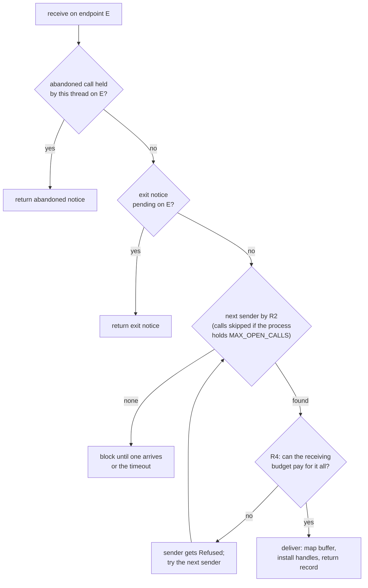

# IPC: calls, sends and replies

Processes talk only through the kernel's IPC. A client **calls** an endpoint and blocks until a
server **replies**, or **sends** one-way. The kernel carries a few words, a few handles and at
most one run of pages, and it stamps every message with who sent it. There is no message queue:
a queued message is a sender blocked on the endpoint.

## Purpose

IPC is how authority is used. Holding an endpoint handle is the right to call the server behind
it; the handle's badge tells the server which grant is in use. Everything a server offers (a
file, a socket, a key operation) is a call on an endpoint. So IPC has to do three things well:
say truthfully who is calling, keep one caller from crowding out the others, and never let a
page change hands in a way either side did not agree to.

## Interface

### Messages

Status: built · tested: bench:ipc, bench:redoubt-ipc, bench:all-together, host:redoubt-sys::received_layout

A message carries:
- `WORDS` (4) machine words, widened to 64 bits in records so one layout serves rv32 and rv64;
- up to `MAX_MSG_HANDLES` (4) handles, **copied**: the sender keeps its own, and each copy keeps
  its stamp (the budget whose destruction revokes it; [objects](objects.md#r9-stamps));
- at most one buffer of whole pages: a **lend** on a `call`, or a **transfer** on a `send`.

A **lend** is up to `MAX_LEND_PAGES` (16 pages, 64 KiB) of the caller's own writable memory. The
pages leave the caller's address space while the call is open and come back with the reply.
The server sees them at an address the kernel picks. A **transfer** is pages given away for
good: they leave the sender and become the receiver's, owner and payer both. A receiver takes a
transfer only if its `receive` named a `max_transfer` at least that large.

```svgbob
 caller                                   server
+-----------------+    call (lend)     +-----------------+
| words[4]        |------------------->| words[4]        |
| handles[<=4]    |                    | handles (copies)|
| lend: pages     |=== pages move ===> | lend at kernel- |
|  (unmapped      |                    |  chosen address |
|   until reply)  |<=== pages back ====|                 |
+-----------------+    reply           +-----------------+
```
*Figure: what a call carries. The lent pages are mapped in exactly one address space at a time.*

The kernel attaches three facts the sender cannot choose ([R14](#r14-unforgeable-sender)): the
**badge** of the handle the message came through, the sender budget's **account** (the principal
it bills to; 0 for none) and its **label set** (the information-flow labels,
[containment](../servers/README.md#labels)). It also gives each message a **message id**,
non-zero and never reused within the receiving process, which `reply` and `serve` name.

### The calls

Status: built · tested: bench:redoubt-ipc, bench:redoubt-ipc-attack, host:redoubt-sys::every_call_round_trips, host:redoubt-sys::malformed_calls_are_refused

| Call | Arguments -> result | What it does |
| --- | --- | --- |
| `call` | endpoint, body record, lend or none, timeout -> status, lend disposition, reply disposition | Queue a message and block until the reply, an error or the timeout. The reply is written back into the body record. |
| `send` | endpoint, body record, transfer or none, timeout | Queue a message and block until a receiver takes it, or it fails. No reply. |
| `receive` | badge-0 endpoint, IRQ handle or none, timeout, `max_transfer` -> one record | Take the next message or notice. With no handle it sleeps until the timeout. |
| `reply` | message id, body record -> delivered or discarded, installed-handle mask | Answer an open call and close it. |
| `serve` | message id | Make an open call the thread's current call, the one a crash blames. |

A server that holds a call without answering it yet **holds** it open: `receive` took it, and
nothing forces a prompt `reply`. The thread may keep receiving. Each call it holds is an **open
call**, and the one it is working on is its **current call**: `receive` sets it to the call just
taken (or to none), `serve` switches it, and replying to it clears it.

Every blocking call takes a timeout in microseconds; `FOREVER` never expires
([timer](timer.md), I13 (every blocking call returns by its timeout)). Argument checks run in a
fixed order, the same in the kernel and the [model](model.md); the full rows are in the
[ABI reference](abi.md#errors-and-the-order-of-checks).

### What `receive` returns

Status: built · partly tested: a record made unwritable while its thread waits is attacked only for an exit notice (`process-attack`); for a message, an interrupt or an abandoned-call notice it is not attacked by a case · tested: bench:redoubt-ipc, bench:timeouts, bench:process-attack, host:redoubt-sys::received_layout

One record layout for every result: `(kind, msg_id, badge, account, labels, words, handles,
buffer, pages)`. A field a kind does not use is 0.

| Kind | Meaning | Fields used |
| --- | --- | --- |
| `call` | a message that owes a reply; its buffer, if any, is a lend | all |
| `send` | a message that owes nothing; its buffer, if any, is a transfer | all |
| `interrupt` | the IRQ handle `receive` named has fired ([devices](devices.md)) | `kind` |
| `exit` | a process whose exit endpoint this is has ended ([processes](processes.md#exit-notices)) | words 0-2 = pid, cause, code; `account`, `labels` = who is blamed |
| `abandoned` | an open call this thread holds lost its caller ([R3](#r3-lends-and-abandoned-calls)) | `msg_id` |

`Timeout` is an error, not a record. Notices come before messages: first an abandoned-call
notice for the receiving thread, then an exit notice, then the next message by
[R2](#r2-fair-waiting). A handle revoked while its message was queued arrives as 0 in its slot,
so slots keep their positions.

The record is checked when `receive` starts, and again just before a message or exit notice is
delivered, because another thread of the process may have unmapped it meanwhile. If it can no
longer be written, the receiver gets `InvalidArgument` and the message or notice stays pending
for the next `receive`: nothing is taken that the receiver cannot be told about. An interrupt
or an abandoned-call notice is not re-checked first; see Residual risks.


*Figure: what one `receive` on an endpoint returns, in order.*

### How a call completes

Status: built · partly tested: completion races between harts are not attacked by a case · tested: bench:ipc-outcomes, bench:timeouts, host:redoubt-sys::ipc_outcomes_round_trip_and_reject_impossible_combinations

A `call` returns three separate facts, and a caller must read all three
([R13](#r13-one-outcome-per-call)):
- the **status**: success or an error;
- the **lend disposition**: `none` (no lend), `returned` (the pages are the caller's again) or
  `consumed` (they are gone; never touch or unmap them);
- the **reply disposition**: `present` (the whole reply record was written) or `absent` (the
  record holds nothing; never decode it).

A successful `reply` tells the server `delivered` or `discarded`, and a mask of the reply's
handle slots that were installed in the caller.

| What happened | Caller status | Lend | Reply | Server's `reply` result |
| --- | --- | --- | --- | --- |
| Refused, timed out or revoked while still queued | the error (`Timeout`, `Dead`, ...) | `returned` | `absent` | (never taken) |
| Taken, then the caller timed out or was revoked | `Timeout` or `Dead` | `consumed` | `absent` | `discarded`, mask 0 |
| The server died holding it | `Dead` | `returned` | `absent` | (no reply) |
| Normal reply | success | `returned` | `present` | `delivered`, mask |
| Reply whose handles do not all fit the caller ([R4](#r4-delivery)) | `OutOfMemory` | `returned` | `present` | `delivered`, mask of those that fit |
| The caller's record can no longer be written | `InvalidArgument` | `returned` | `absent` | `discarded`, mask 0 |
| The caller died after the server took it | (none) | consumed ([R3](#r3-lends-and-abandoned-calls)) | (none) | `discarded`, mask 0 |

With no lend every row reports `none`. The dispositions come back in registers, outside user
memory, on every return including errors:

| Call | `a0` | `a1` | `a2` |
| --- | --- | --- | --- |
| `call` | 0 or the error code | lend: 0 `none`, 1 `returned`, 2 `consumed` | reply: 0 `absent`, 1 `present` |
| `reply` (success) | 0 | 0 `discarded`, 1 `delivered` | installed-handle mask, bits 0-3 |
| `reply` (error) | the error code | 0 | 0 |

Registers `a3`-`a7` are 0. `redoubt_sys::decode_result` refuses any other combination: for
`call`, `present` with a status other than success or `OutOfMemory`, success without `present`,
`present` with a consumed lend, and `consumed` without `Timeout` or `Dead`; for `reply`, a mask
bit past the fourth handle, or any mask bit with `discarded`. The runtime then checks the mask
against the handles its reply actually supplied.

The Rust runtime (`libs/rt/src/ipc.rs`) makes the rules hard to break. `Endpoint::call` takes the
lend as an owned `Buffer` and returns a `CallOutcome` holding the status, the buffer only if it
was returned, and the reply only if it is present. `Request::reply` consumes the request, and hands it back with the error if the reply is refused, so the server can still answer it.

```mermaid
sequenceDiagram
    participant C as Client thread
    participant K as Kernel
    participant S as Server thread
    S->>K: receive(E, timeout, max_transfer)
    Note over S,K: blocks: nothing queued
    C->>K: call(E, words, handles, lend 4 pages, timeout)
    Note over K: checks; R1 labels; R2 cap;<br/>lend unmapped from client
    K->>S: record: kind=call, msg_id, badge,<br/>account, labels, words, handles, lend at A
    Note over K: open call page charged to server (R4a);<br/>lend charged to both sides (R3)
    S->>S: read and write the lend at A
    S->>K: reply(msg_id, words, handles)
    Note over K: lend unmapped from server, remapped<br/>in client; reply record written
    K-->>C: status 0, lend returned, reply present
    K-->>S: delivered, mask
```
*Figure: a call with a lend, from receive to reply.*

## Authority

Status: built · tested: bench:redoubt-ipc-attack, mutation:R1ChecksReceiverNotOwner

- **An endpoint handle with badge 0 is the receive right.** Only it may `receive`, and only its
  holder can [`mint`](objects.md#mint) handles with other badges. `endpoint_create` returns it.
- **Any other endpoint handle is the right to call or send**, identified to the server by its
  badge. Handles carry no rights bits: whoever holds a copy may use it. A server narrows a
  grant by minting a new badge and meaning less by it.
- **IPC can grant** only what the sender already holds: a message copies the sender's handles,
  each with its own stamp. It creates no authority.
- **IPC never gives** the receiver anything of the sender's but the words, the copied handles
  and the buffer: not the sender's other handles, budget, address or identity beyond the three
  attached facts. The raw budget id never travels.
- Handing a receive right to another budget is delegation of the whole endpoint, and it is
  never handed across label sets (I7 (every flow obeys R1)).

## Security properties

### R1 (flow)

Status: built · partly tested: a call or send between user budgets with different labels is attacked only in the model; on the target only a `budget_usage` read and an exit notice are · tested: bench:process-attack, bench:process-review, mutation:R1SkipLabelCheck, mutation:R1ChecksReceiverNotOwner, mutation:R1ExitNoticeIgnoresLabels, mutation:R1UsageIgnoresLabels

Information flows from budget A to budget B only if B is class `system` or B's labels include
all of A's. A message is a flow from the sender's budget to the endpoint's **owner** (the budget
that created it), whoever takes it, so the check is made when the message is sent. Because every
call is answered or refused, it is also a flow back. So between two `user`-class budgets the
label sets must be **equal**, or the call gets `LabelDenied`. When either side is `system`
class the kernel does not check: system servers serve many label sets and check them
themselves ([servers](../servers/README.md#labels)). An exit notice is a flow from the
exiting budget to the owner of the exit endpoint; one that fails the rule is dropped. A
`budget_usage` read is a flow from the budget read to the reader
([budgets](budgets.md)).

### R2 (fair waiting)

Status: built · partly tested: turns between several groups, and how groups are keyed (account, label set, and budget for account 0), are attacked only in the model; the case fills one group's cap · tested: bench:redoubt-ipc, mutation:R2FifoAcrossAccounts, mutation:R2NoWaitCap, mutation:R2KeyByAccountOnly, mutation:R2KeyByStampLabels, mutation:R2SystemCallersShareGroup

Senders blocked on an endpoint are grouped by their budget's account and label set, and, for
account 0 (no principal: the boot budgets, and any budget carved without one, of either class),
by budget as well. Each `receive` takes the oldest message of the
next group after the one served last, round-robin. A group that already has `WAIT_CAP` (16)
messages queued on the endpoint gets `Busy` at once. Only queued messages count; a taken call is
bounded by [R4a](#r4a-open-calls) instead. Keying by label set keeps a vault session and its
owner's ordinary session, which share an account, from sharing a turn or a cap. Keying
account-0 callers by budget keeps one busy system server from filling another's cap. With k groups
waiting and the receiver below its open-call limit, each group's oldest message is taken within
k receives (I11 (fair turns)).

### R3 (lends and abandoned calls)

Status: built · tested: bench:redoubt-revoke, bench:timeouts, bench:ipc-outcomes, bench:uaf-lent-page, bench:process-lifecycle, mutation:R3UnmapAbandonedLend, mutation:R3ChargeStaysWithCaller, mutation:AbandonNoticeMissing, mutation:AbandonNoticeRepeated

A lend's range must be the caller's own writable RAM. Pages in it that were never touched are
backed first, charged to the caller like `map_anon`'s; a caller that cannot pay for them gets
`InvalidArgument`, since `call` has no `OutOfMemory` of its own. A lent page stays charged to
the caller. Taking the call charges it to the receiving process's budget as well, until `reply`
gives it back. The page tables that map the lend in the receiver are charged to the receiver
too, and stay charged after the reply, like any page table of that process, until it ends
([memory](memory.md#residual-risks)).

A taken call is **abandoned** when its caller dies, times out, or is failed by revocation. Then:
- the caller's charge ends and the lend becomes the server's alone, still mapped there;
- the thread holding the call gets one abandoned-call notice, on the endpoint the call arrived
  on (I15 (abandoned calls reported once));
- the call stays open, and counts against the server's limit, until the server replies; that
  reply reaches nobody, and replying frees the lend.

A reply that comes before the abandonment is delivered, and nothing is abandoned. If the
abandonment comes first and the server replies before it has received the notice, `reply`
returns `discarded`, mask 0, and no notice follows: the reply closed the call.

The destruction of the endpoint a call arrived on ([budgets](budgets.md#r10-destruction)) also
abandons the calls taken through it, and fails their callers with `Dead`, but offers no notice:
the kernel fails the endpoint's receivers first, so there is nowhere left to receive one. A
server learns it only from its `receive` returning `Dead`. Whether that `Dead` is the stated
cue that every call taken through the endpoint is abandoned is open
([todo](../todo/endpoint-destroyed-open-calls.md)).

```mermaid
stateDiagram-v2
    [*] --> Queued: call
    Queued --> [*]: Refused / Timeout / Dead<br/>(lend returned)
    Queued --> Open: receive takes it
    Open --> [*]: reply (delivered)<br/>lend returned
    Open --> [*]: server dies<br/>caller gets Dead, lend returned
    Open --> Abandoned: caller dies, times out,<br/>or is revoked
    Abandoned --> [*]: server replies<br/>(discarded; lend freed)
    Abandoned --> [*]: server dies<br/>(lend freed)
```


*Figure: the life of a call. The lend is mapped in exactly one address space in every state.*

### R4 (delivery)

Status: built · tested: bench:redoubt-ipc, bench:redoubt-dead, bench:redoubt-tight, mutation:R4IgnoreMaxTransfer, mutation:R4OverdrawOnDelivery, mutation:IpcDropPartial

A message is delivered only if the receiving process's budget can pay for everything it
brings: the handle-table pages for its handles, a call's open-call page, its lent or transferred
pages and the page tables to map them. A lend is charged to the receiver even when both sides
share a budget (R3). A transfer is charged to the receiver instead of the sender, so between two
processes of one budget it moves no charge and costs nothing. A transfer also needs a
`max_transfer` at least its size. Handles that would take the receiver past `MAX_HANDLES`
(4096) are a cost it cannot pay, and so is a buffer with no free run of pages for it in the
receiver's message area. Otherwise the sender gets `Refused` and the kernel moves on to the
next sender. A `receive` never fails for want of pages.

A **reply is never refused**: its caller is blocked and has nowhere else to put the error.
Reply handles that do not fit the caller are dropped, each 0 in its slot. The words and the
other handles arrive, and the caller's `call` returns `OutOfMemory` with the reply `present`.

### R4a (open calls)

Status: built · tested: bench:redoubt-ipc, mutation:R4aOpenCallsPerThread, mutation:R4aFullTakesNothing

Taking a call opens it and charges one page to the receiving process's budget; `reply` closes
it and frees the page. A process holding `MAX_OPEN_CALLS` (64) open calls takes no more: calls
stay queued and R2's turns skip them, while its `receive` still delivers sends, interrupts and
notices. A `send` is never an open call, so `reply` to a send's id is `InvalidArgument`.

### R4b (a server dies)

Status: built · tested: bench:redoubt-dead, bench:process-lifecycle, mutation:R4bDeadServerFakesReply

When a thread or process exits, faults or is killed holding open calls, each waiting caller
gets `Dead` and its lend back intact; the lend of an abandoned call is freed. Senders still
queued on the endpoint keep waiting: the endpoint outlives the server, and a restarted server
receives them ([init](../servers/init.md#restarts-and-reboots)).

### R13 (one outcome per call)

Status: built · partly tested: completion races between harts are not attacked by a case · tested: bench:ipc-outcomes, mutation:IpcWrongLend, mutation:IpcFalseDelivery, mutation:IpcSkipOutputCheck, mutation:IpcLeakRollback

Every `call` ends in exactly one row of the completion table, and the caller and server agree
on it. `present` means the whole reply record was written, and only then may the caller decode
it. `consumed` means the lend's mapping and charge have ended. The body record is checked
readable and writable before anything is delivered, and checked again at completion, because
another thread may have unmapped it while the call waited. If the reply cannot be written, every
handle this reply installed in the caller is closed again and its table pages released; the
caller gets `InvalidArgument`, its lend back and `absent`, and the server gets `discarded`.
Checking the record, copying, installing or rolling back handles and publishing the outcome are
one step: the kernel runs with interrupts off and holds the memory manager's guard throughout,
so no unmap, remap or teardown can fall between them.

### R14 (unforgeable sender)

Status: built · partly tested: every case delivers account 0 and no labels, so a non-zero account or a label set reaching the receiver unchanged is attacked only in the model · tested: bench:redoubt-ipc, bench:bench-attack-forgery, bench:pid-reuse-authority, mutation:MsgNoLabels, mutation:MsgAccountZero

The badge, account and labels a receiver sees are the kernel's: the badge of the handle used,
and the sender budget's account and labels at the time of sending. No argument of `call` or
`send` can set them. Message ids are per receiving process, so they reveal nothing of anyone
else's traffic, and a stale id cannot reach a later message (I12 (ids never reused)).

## Failure and restart

Status: built · tested: bench:redoubt-dead, bench:redoubt-revoke, bench:budget-deadline, bench:timeouts

- **The server dies** holding calls: callers get `Dead` and their lends back (R4b). Queued
  senders wait for the restarted server on the same endpoint.
- **The caller dies, times out or is revoked** after the server took the call: the call is
  abandoned (R3). The server keeps the lend until it replies and pays for it.
- **A budget is destroyed:** endpoints it owns are destroyed and everything waiting on them gets
  `Dead`; queued messages sent through a handle it stamped fail with `Dead`; a taken call sent
  through one is abandoned ([R10 (destruction)](budgets.md#r10-destruction)). A taken call on a
  destroyed endpoint is abandoned with no notice (R3): the server's `Dead` from `receive` is all
  it learns ([todo](../todo/endpoint-destroyed-open-calls.md)).
- **Crash blame:** when a server process faults, or exits while it holds open calls, the exit
  notice blames the account and labels of the sender of the ending thread's current call, or
  nobody if it has none ([R21 (crash blame)](processes.md#r21-crash-blame)). A `send` is never blamed. A server calls `serve`
  before resuming a held call so that a crash blames the right caller.
- No argument to any IPC call can make the kernel panic (I14 (no call panics the kernel)).

## Residual risks

- **System-class servers are trusted to check labels.** R1 does not constrain a flow into or out
  of a `system` budget. A system server that serves two label sets and mixes their data breaks
  label separation, and the kernel cannot see it ([servers](../servers/README.md#labels)).
- **`Refused` and `Busy` are signals.** `Refused` tells a sender one bit about the receiver's
  budget; `Busy` tells it its own group is full. A sender with a clock learns as much from
  timing. Covert and timing channels are out of scope ([TENETS](../TENETS.md#threat-model)).
- **A server pays for the calls it holds.** An abandoned call's lend stays charged to the server
  until it replies; a server that never replies keeps paying. That is the server's own cost,
  never another budget's.
- **A `consumed` lend is gone.** A caller whose taken call times out loses those pages. Callers
  that cannot afford that must not lend them with a short timeout.
- **Delivery walks every thread, twice over.** Finding a receiver scans all threads, and for
  each waiting receiver finding the next sender scans them all again: up to the square of
  `MAX_PROCESS_COUNT` x `MAX_THREADS`, compile-time constants no process can change. It costs
  time on every delivery, and that cost is not charged to the caller's budget.
- **Completion races between harts** are argued from the code, not attacked by a case. On one
  hart the kernel runs with interrupts off. On several (a build for more than one hart), each
  kernel global is guarded by its own lock, and the completion holds the memory manager's for
  the whole step.
- **A notice can be lost to a bad record.** If a thread's `receive` record becomes unwritable
  while it waits, an interrupt or abandoned-call notice delivered to it is consumed and the
  thread gets `InvalidArgument` instead. A lost abandoned-call notice leaves the thread holding a
  call whose id it never learned, until the process ends (I15's report is made but not
  received). Only the process's own threads can cause this. Follow-up:
  [todo](../todo/receive-output-late-invalid.md).

## Why

- **No queue, no allocation for the queue.** A queued message is its blocked sender, and the
  sender's own thread page (already paid for) holds it. So queueing a `call` or `send`
  allocates no kernel memory and cannot make the kernel allocate on a receiver's behalf. The
  only pages they may allocate are the sender's own untouched buffer pages, backed and charged
  to the sender (R3). The cost is the thread walk above; clarity wins over speed.
- **Lend, not copy.** A 9P message is up to 64 KiB. Moving pages costs page-table updates, not
  copies, and unmapping them from the caller means neither side can see the other change them
  mid-call.
- **The reply is never refused**, because the caller is blocked and has no other way to learn
  the outcome; dropping the handles that do not fit, and saying so, is the only safe partial.
- **An abandoned lend stays with the server** so the server never has a page pulled from under
  it mid-request; it frees the page by replying.
- **Owner, not receiver, for R1.** The check is made at send time against the endpoint's owner,
  so it cannot depend on which thread later receives, and a receive right cannot be passed
  across label sets to get around it.
- **Groups, not senders, for fairness.** One principal with many processes gets one turn, not
  one per process, and a full group gets `Busy` at once instead of blocking others.
