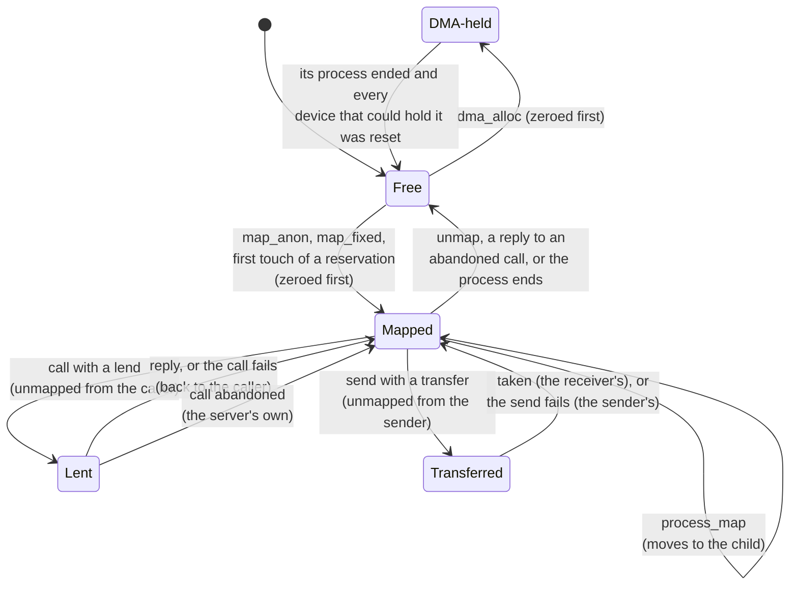

# Memory

A process gets memory only from the kernel, in whole 4 KiB pages, paid for by its budget. Five
calls change what a process has mapped: `map_anon`, `map_fixed`, `unmap`, `set_flags` and
`process_map`. The kernel zeroes every page before a process first sees it, never maps a RAM page
writable and executable, and chooses every address but the ones `map_fixed` and `process_map`
name. Lends and transfers move pages between processes by changing page-table entries, never
by copying.

## Purpose

Memory is what every process consumes, and a page is the easiest thing to leak between two
processes: a frame freed by one and handed to the next still holds what the first wrote. So
the memory calls have four jobs. Hand out pages that hold nothing of anyone else's. Keep every
RAM page W^X, so data a process writes cannot run as code. Keep a page's owner and payer
straight as it moves by lend, transfer or `process_map`. And keep the cost of each call bounded
by what the caller has, because the kernel runs a call to its end with interrupts off.

## Interface

### The mapping calls

Status: built · tested: bench:device, bench:write-only-attack, bench:process-attack, bench:map-fixed-attack, bench:return-lent-unmapped, bench:dma-rules

| Call | Arguments -> result | What it does |
| --- | --- | --- |
| `map_anon` | len, flags -> addr | Map `len` bytes of zeroed pages at an address the kernel chooses, each backed and charged to the caller's budget at once. |
| `map_fixed` | addr, len, flags | The same, at exactly `addr`. Never replaces a mapping ([below](#map_fixed)). |
| `unmap` | addr, len | Remove the caller's own pages. A RAM frame goes back to the free pool and its charge to the budget; a device's registers or a `dma_alloc` page only lose the mapping. |
| `set_flags` | addr, len, flags | Give each of the caller's own pages exactly these permissions. It may add a permission as well as drop one. |
| `process_map` | h(process), src, dst, len, flags | Move the caller's own RAM pages, contents and all, into a process that has not started, at `dst`, with `flags`. The child's budget pays for them and for the page tables that map them ([processes](processes.md)). |

A range is page-aligned and non-empty, and for every call but `map_anon` it lies below
`USER_AREA_END` (the end of user space: 0x8000_0000, 2 GiB, on rv32; 0x40_0000_0000, 256 GiB,
on rv64). Flags are `READ`, `WRITE` and `EXECUTE`: at least one, never `WRITE` with
`EXECUTE`, never `WRITE` without `READ`. "The caller's own page" is a live user mapping that is
neither side of a loan and is credited to the caller in the kernel's frame ownership table (or
is a `dma_alloc` page of its own, or device registers it mapped). A reservation not yet touched
is not a mapping.

Each call checks the whole range before it changes any page, so an error leaves every mapping
as it was. Only `map_anon`'s rollback can leave a charge behind: the page tables it allocated
(Residual risks). The errors are `InvalidArgument` and `OutOfMemory`, and for
`process_map` also `BadHandle`, `WrongObject` and `NotPermitted` (the child has started). The
order of the checks, the same in the kernel and the [model](model.md), is in the
[ABI reference](abi.md#errors-and-the-order-of-checks).

### Backing and zeroing

Status: built · partly tested: that a frame freed with data in it comes back zero is attacked only in the model, because no case can tell which frames it was handed · tested: bench:device, bench:mem-attack, bench:map-fixed-attack, bench:lend-untouched-page, bench:touch-beyond-ram, mutation:R11NoZeroing

`map_anon` and `map_fixed` back every page when they map it. Each takes a free frame, charges it
to the caller's budget ([R6 (charging)](budgets.md#r6-charging)), zeroes it through the
[physmap](memory-layout.md#the-direct-physical-map), and only then writes the entry that maps
it. So a page is zero the first time its process can see it, whoever held the frame before. The
page tables a mapping needs are allocated, zeroed and charged as it goes, to the budget of the
process they map into.

The one exception is the stack of a program the loader starts: it is **reserved**, its entries
holding permissions but no frame. A page of it is backed with a zeroed, charged frame on first
touch: a load or store fault, or a call that lends, transfers or `process_map`s it. A process
started by `process_start` has no reservations: its parent gave it every page it has.

Running out is the caller's error: `map_anon` of more than the budget or RAM can supply is
`OutOfMemory`, and every page it had taken goes back.

### Where `map_anon` puts pages

Status: built · partly tested: a full placement area is not attacked by a case · tested: bench:map-fixed-attack, bench:touch-beyond-ram

The kernel chooses the address, and nothing may depend on it. `map_anon` takes the first free
run of pages in its placement area, 256 MiB from `DEFAULT_BASE` (0x6000_0000 to 0x7000_0000),
searching from the start of the run it placed last to the area's end, then from the area's
start. A page is free only if its entry is empty: a reservation or either side of a loan is
taken. A request that finds no run, or is larger than the area, is `OutOfMemory`.
`map_device` and `dma_alloc` place their mappings the same way ([devices](devices.md#map_device)). A
receiver's lends and transfers land in a second area, 4 MiB from `DEFAULT_MESSAGE_BASE`
(0x4000_0000), found the same way. The rest of the user layout is on
[memory layout](memory-layout.md#regions).

The [model](model.md) places runs differently: above the highest mapping, falling back to the
first gap large enough. The two agree on outcomes, not addresses, except where the kernel's
area is full (Residual risks).

### `map_fixed`

Status: built · partly tested: attacked on rv64 only · tested: bench:map-fixed-attack, bench:map-fixed-tables, bench:return-lent-unmapped, host:redoubt-model::bad_ranges_are_refused, host:redoubt-model::partial_overlap_is_refused_whole, host:redoubt-model::page_tables_half_of_the_charge_check

`map_fixed(addr, len, flags)` maps zeroed pages at exactly `addr` in the caller's own address
space, charged as `map_anon`'s are. It is the one call that puts new pages at an address the
caller names, so that the [loader stub](../servers/init.md) can place a program's segments at
their link addresses from inside the process it is loading.

Unlike POSIX `MAP_FIXED` it **never replaces** a mapping. A range that touches any occupied
entry of the caller's (a mapping, a reservation, either side of a loan) is `InvalidArgument`,
and nothing is mapped. The checks run in this order, all before anything is allocated:
1. the range: aligned, non-empty, no overflow, below `USER_AREA_END` (page 0 is user space);
2. the overlap, over the whole range;
3. the flags;
4. the charge: the pages alone first, then the pages and every page table the range still
   lacks, counted across table boundaries.

Only then does the mapping loop run, and it cannot fail. So a `map_fixed` maps everything it
was asked or nothing, and a refused one charges nothing.

### Instruction fetch after mapping

Status: built · partly tested: no case can see a missing `fence.i`, because QEMU keeps instruction fetch coherent with stores

A hart may fetch stale instructions from a page just written unless it fences. After any call
that installs an executable mapping (`map_anon`, `map_fixed`, `set_flags` or `process_map`
with `EXECUTE`), the kernel runs `fence.i`, so the hart's later fetches see every store it made
before. It runs one more at boot, before the first process, for the images the loader wrote.

W^X makes one fence per call enough: a page is written while it is writable and not
executable, and becomes executable only through one of these calls. The fence covers the one
hart the kernel runs on. A kernel on several harts must also fence the others, and fence when a
thread moves ([SMP](../beyond/smp.md)).

### Lending at the page-table level

Status: built · partly tested: a lend within one process is not attacked across harts · tested: bench:process-lifecycle, bench:return-lent-unmapped, bench:ipc-outcomes, bench:map-fixed-attack, bench:move-borrowed-page, bench:uaf-lent-page, bench:lend-untouched-page, mutation:R11LendStaysMapped

A [lend or a transfer](ipc.md#messages) is page-table edits:
- **When the message is sent**, each page is checked first: backed (a reserved page is backed at
  this point), the sender's own RAM, and for a lend writable. Then each is taken out of the
  sender: its entry keeps the frame, loses `VALID` and gains the lent bit `S` (a software bit of
  the entry; [memory layout](memory-layout.md#the-lent-bit)). That entry is the loan's only
  record.
- **When a receiver takes it**, the frames are mapped read-write in the receiver's message
  area. A lend's entries there carry `S` too, marking them as the borrower's side.
- **At the reply** the kernel checks that the borrower's entry and the lender's entry name the
  same frame, clears the borrower's, and makes the lender's valid again. A message refused or
  timed out while still queued was never mapped in a receiver: the lender's entries are simply
  made valid again.
- **A transfer**'s sender entry is cleared when the receiver takes it, and the frame's owner
  and payer change together ([R4 (delivery)](ipc.md#r4-delivery)). A lend whose call is
  abandoned goes the same way to the server
  ([R3 (lends and abandoned calls)](ipc.md#r3-lends-and-abandoned-calls)).

Only these steps of the kernel's own (the return, a transfer's delivery, an abandonment)
touch an entry with `S`. `unmap`, `set_flags`, `map_fixed` and `map_anon`'s search treat both
sides of a loan as occupied, so the lender cannot unmap, remap or re-flag a lent page, and the
borrower cannot unmap or re-flag its side. A borrowed page stays
credited to its lender, so the borrower cannot lend it on, transfer it or `process_map` it. The
kernel never reads or writes a call's record in a borrowed page. When caller and server are the
same process, both sides of the loan sit in one address space, and the return still checks both
markers and the frame before changing either.

### A page's life

Status: built · tested: bench:device, bench:ipc-outcomes, bench:lend-untouched-page, bench:uaf-lent-page, bench:process-attack, bench:dma-rules, bench:dma-reset-reuse

*Figure: the states of a RAM frame. A frame is mapped by at most one process at a time, and is
zeroed whenever it leaves Free.*

## Authority

Status: built · partly tested: that no call names a physical frame is argued from the call table, not attacked · tested: bench:process-attack, bench:device, bench:ipc-outcomes, bench:map-fixed-attack

- **A process maps only into its own address space.** `map_anon`, `map_fixed`, `unmap` and
  `set_flags` act on the caller's own pages; none names another process.
- **`process_map` needs a process handle** to a child that has not started. A started process
  is closed to its parent: nothing can be slipped into a process that is already running.
- **Pages come from the budget.** Every frame and page table is charged to a budget, so a
  process can map no more than its budget allows ([budgets](budgets.md)).
- **No call names a physical frame.** There is no call that maps RAM by physical address, so
  holding memory never gives a way to reach anyone else's.
- The memory calls create no authority: they change pages the caller already has, or move them
  to a child it already holds.

## Security properties

### R11 (memory)

Status: built · partly tested: the kernel departs from per-frame W^X, because `set_flags` makes device registers and `dma_alloc` pages executable on request, and no case attacks it; that a frame freed with data in it comes back zero is attacked only in the model; the absence of any physical-address argument is argued from the call table, not attacked · tested: bench:wx, bench:write-only-attack, bench:map-fixed-attack, bench:device, bench:mem-attack, bench:process-attack, bench:return-lent-unmapped, bench:dma-rules, bench:dma-reset-reuse, mutation:R11NoZeroing, mutation:R11SetFlagsAllowsWx, mutation:R11AllowsWriteOnly, mutation:R11LendStaysMapped, mutation:R11MapFixedSkipsOverlap

- **No RAM page is ever mapped writable and executable** ([W^X](../GLOSSARY.md#wx)): not by one
  entry, and not by two, since a RAM frame has at most one user entry at a time (the kernel's
  physmap aside). W+X is refused when any call is decoded (`WRITE` with `EXECUTE`, or an unknown
  bit, is `InvalidArgument`), again by `map_fixed` and `process_map` before they charge, and
  again by the page-table layer, which refuses to build such an entry, so no check rests on
  another. `set_flags` may add `EXECUTE` only to a page it makes not writable in the same call.
- **W^X holds per frame, not only per mapping.** Only RAM that a process owns is ever
  executable. Device registers and DMA frames are never mapped executable: the device, or
  another mapping of the same registers (in this process or a co-holder's, since a mapping
  outlives its handle), can write them underneath. `map_device` and `dma_alloc` map read-write
  and never executable, and `process_map` refuses device and DMA pages. The kernel departs from
  this in `set_flags`, which grants `EXECUTE` on both (Residual risks).
- **Writable implies readable.** The privileged architecture reserves the write-only entry, so
  `map_anon`, `map_fixed`, `set_flags` and `process_map` refuse `WRITE` without `READ`.
- **Flags are checked before anything is charged or moved** for the new mapping, so a step
  that cannot fail never meets bad flags. (`process_map` backs a reserved source page before
  it checks the flags, as touching the page would.)
- **Every page is zeroed** before a process first sees it: anonymous and fixed pages, backed
  reservations, page tables, and `dma_alloc` pages. Pages moved by lend, transfer or
  `process_map` carry their contents, because moving them is the point.
- **No physical addresses.** No call takes one, and none maps RAM by one: `map_device` maps a
  device object's registers, and the boot refuses any device object that overlaps RAM. The one
  physical address a process learns is that of its own `dma_alloc` pages, which its device
  needs ([devices](devices.md#dma_alloc)).
- **DMA pages are held until reset.** A `dma_alloc` page stays with the process that allocated
  it until that process ends: `unmap` drops only its mapping, and it is never lent, transferred
  or `process_map`ped. It returns to the pool only after every DMA device that could hold its
  address has confirmed a reset, and a quarantined device never counts as reset
  ([devices](devices.md#reset-before-reuse), I16 (DMA pages reset before reuse)).
- **A lent page is unmapped from its lender** until the call ends
  ([above](#lending-at-the-page-table-level)).
- **`map_fixed` never replaces** a mapping, so it can neither discard a page nor alias one.

Together these are I9 (pages W^X, zeroed, lends unmapped) of the
[invariants](invariants.md#i9-pages-wx-zeroed-lends-unmapped).

### R19 (kernel W^X)

Status: built · partly tested: no case plants a writable kernel code page to show that the check stops the boot, and the case boots rv64 only · tested: bench:kernel-wx

The kernel's own mappings are W^X. At boot, before any process runs, the kernel walks its own
area of the address space and checks three things: no executable page is writable, no
executable frame has a writable alias in the physmap, and no physmap page is executable. If one
fails, the kernel panics instead of running. It then prints `W^X verified: N executable kernel
pages, none writable under any alias`, the line the case checks. Every mapping the kernel makes
later goes through the same entry constructor that refuses W+X; its one later window, for DMA
device registers, is read-write and never executable.

### R22 (range cost)

Status: built · partly tested: only `map_fixed`'s huge length is attacked, and `map_anon`'s search is an exception no case measures · tested: bench:map-fixed-attack, host:redoubt-model::huge_len_is_refused_promptly

A call that takes a range costs what the page tables hold and what the budget can pay for,
never what the length asks. A process could otherwise ask for a huge range for free, and the
kernel, running the call to its end with interrupts off, would stall every other process.
- `unmap`, `set_flags` and `process_map` check the range page by page and stop at the first
  page that is not the caller's, so their cost follows what is mapped there.
- `map_fixed` checks overlap by walking the page-table tree and skipping every absent subtree
  whole: at most the root entries the range spans, plus `ENTRIES` (512 on Sv39, 1024 on Sv32)
  for each table present in it. It then refuses a range the budget cannot pay for by
  arithmetic alone, before counting page tables. A `map_fixed` of the whole of user space above
  4 GiB, which no budget in the case can pay for, is refused well inside the case's 10 ms bound.
- A lend or transfer checks at most the pages mapped in its range, and a lend is at most
  `MAX_LEND_PAGES` (16).

`map_anon` does not meet R22: its search is bounded by its 256 MiB area, not by what is mapped
in it, so it also breaks the bound R12 (scheduling) sets on a call's kernel time (Residual
risks).

## Failure and restart

Status: built · tested: bench:touch-beyond-ram, bench:lend-untouched-page, bench:wx, bench:uaf-lent-page, bench:map-fixed-attack, bench:return-lent-unmapped

- **Out of memory is the caller's error.** A mapping call that cannot be paid for returns
  `OutOfMemory`; a process that exhausts RAM gets `OutOfMemory` and every other process keeps
  running. A refused `map_fixed` charges nothing, and a refused `process_map` charges the child
  nothing; `map_anon`'s rollback keeps the page tables it allocated (Residual risks).
- **A permission fault ends the process.** A store to a page that is not writable, or a fetch
  from one that is not executable, is never mistaken for a page to back. The process faults,
  and its exit notice carries the RISC-V cause (12 for an instruction page fault, 15 for a store
  page fault; [processes](processes.md#exit-notices)).
- **A process ends:** every frame it owns returns to the pool and its charge to its budget. A
  page it had lent is its server's until the server replies (R3), and is never reused while the
  server has it mapped. Its `dma_alloc` pages wait for the device reset (R11).
- No argument to any memory call makes the kernel panic (I14 (no call panics the kernel)).
  Lending untouched or half-mapped ranges, unmapping a lent page, and exhausting RAM are each
  attacked by a case that passes only on a clean power-off.

## Residual risks

- **`unmap` keeps empty page tables.** A page table is freed only when its process ends, not
  when it maps nothing, and `map_anon`'s rollback after a failure keeps the tables it allocated
  too. Such tables stay charged to the process's own budget, so a process can strand only its
  own pages, but its usage stays above what it has mapped. Follow-up:
  [todo](../todo/page-table-freeing.md).
- **`map_anon`'s search costs what the area allows, not what is mapped.** It runs before any
  budget check. It tries each start in its 256 MiB area (65536 pages) and tests the pages of
  the run from there until one is taken. One page mapped in the middle of the area makes a
  request for half of it test about 5 × 10^8 pages before it fails. The search's kernel time is
  billed to the caller, as every call's is, so the caller pays for it in CPU share. The harm is
  latency: the kernel runs the search with interrupts off, so every wake, timeout, deadline and
  interrupt on the machine waits for it, and a bill after the fact gives nobody that time back.
  The kernel departs here from R12, which bounds a call's kernel time by what it
  maps or names ([scheduling](scheduling.md#r12-scheduling)). The receiver's message area uses
  the same search over 1024 pages. No case measures it. Follow-up:
  [todo](../todo/map-anon-search-cost.md).
- **`map_fixed` can fill `map_anon`'s area.** A process that maps the whole area with
  `map_fixed` makes its own later `map_anon` calls fail with `OutOfMemory`, where the
  [model](model.md), whose placement is unbounded, succeeds. It harms only that process.
- **`set_flags` departs from R11 on device memory.** It accepts `EXECUTE` on mapped device
  registers and on a held `dma_alloc` page, because both count as the caller's own pages. A
  process that maps one device twice with `map_device` gets two mappings of the same physical
  memory, and can make one read-write and the other read-execute. A DMA page made executable
  is not writable through its mapping, but the device can still write it. So a process holding
  a device object, such as a block or network driver, can make device registers or its DMA
  buffers executable, and hostile device input can become injected code in a compromised
  driver, where W^X would have left the attacker only the driver's own code to reuse. No case
  attacks it. Follow-up: [todo](../todo/device-mapping-exec.md).
- **One hart.** `fence.i` and the TLB flush act on the hart that runs the call. Running user
  code on several harts needs them on every hart, and when a thread moves
  ([SMP](../beyond/smp.md)).
- **A lend within one process** (a thread calling an endpoint its own process receives on) is
  argued from the code, not attacked, when its threads run on several harts. `process-lifecycle`
  attacks it on one hart, the process ending with the call open included.
- **The physmap maps every user frame writable for the kernel,** code included. Only the
  kernel can use that alias ([memory layout](memory-layout.md#residual-risks)).

## Why

- **Back at map time, not on first touch.** A process told it has memory, which then faults for
  want of it, has been told a lie. `map_anon` charges and backs every page before it returns,
  so a process's memory is its own the moment it has the address. Only the loader-started
  stacks are reserved, because their programs have no parent to map them.
- **Zero on allocation, through the physmap.** Every path that hands a frame to a process
  zeroes it before the entry exists, so no path can forget and no process ever sees a page
  before it is zero. Freeing costs nothing.
- **The kernel chooses addresses,** so no program depends on a layout and no call lands on
  another mapping. `map_fixed` exists because a program's segments must sit at their link
  addresses and the loader stub, running inside the new process, is the only code that parses
  its ELF. The other ways were worse: mapping the segments from the parent would make the
  launcher parse ELF images, and relocatable programs would differ from every other binary's
  fixed-address link. `map_fixed` never replaces, so it cannot discard or alias a page.
- **The lender's entry is the loan's record.** There is no side table to fall out of step. The
  `S` bit makes the entry one that only the kernel's own lend steps may overwrite, and the
  return checks both sides against each other first.
- **Flags checked more than once, and before charging.** Decoding and the page-table layer
  each refuse W+X, and `map_fixed` and `process_map` check again, so a slip in one leaves the
  others. Checking before anything is charged means the steps after it cannot fail, so a bad
  combination is a clean `InvalidArgument`, never a half-done call or a kernel panic.
- **Cost follows occupancy.** The kernel does not preempt itself, so every loop in a call must be
  bounded by something the caller paid for: pages it has mapped, or pages its budget can buy.
- **One fence per executable mapping.** A frame reused from another process may still sit in a
  hart's instruction cache. That is a correctness hazard, not a privilege one, since the code
  runs in the new owner's context, and the fence each executable mapping gets on this hart
  clears it.
