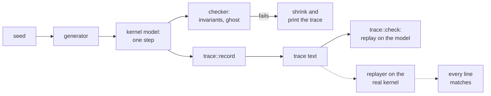

# The executable model

The executable model is a Rust crate, `redoubt-model` in `model/`, that states the kernel's
objects, calls, errors, rules and invariants as code, with the steward's policy core on top. Seeded
random sequences of calls drive it, and after every step a checker recomputes each invariant
from the objects themselves. Deliberate breaks of each rule, the **mutations**, show that the
checks catch what they claim to catch. Every run can be written as a text **trace** and
replayed; replaying those traces on the real kernel compares the kernel with the model.

## Purpose

A rule in prose can be read two ways; a rule in code cannot. The model is the design in a form a
machine checks: if any sequence of calls it generates reaches a state that breaks an invariant,
it reports the seed and a shrunk trace that shows how. It is the reference the kernel is built
to: the same call names, the same errors, the same constants and the same order of argument
checks ([ABI](abi.md#errors-and-the-order-of-checks)). A design change is tried in the model
first, because a change that breaks a property fails there in seconds, on a laptop, with the
failing sequence in hand.

## What the model is

Status: built · partly tested: independence from the kernel's source and the empty dependency list are held by `model/Cargo.toml` and `#![forbid(unsafe_code)]`, not attacked by a case · tested: host:redoubt-model::overflow_checks_are_on, host:redoubt-model::map_fixed_near_user_top_does_not_starve_map_anon, host:redoubt-model::event_free_tick_matches_slice_reference

- **Independent.** The crate is `no_std` with `alloc`, `#![forbid(unsafe_code)]`, and its
  `[dependencies]` table is empty: it links no kernel crate, not `redoubt-sys`, nothing from
  crates.io. It states its constants itself, with the kernel's names and values: `WORDS` (4),
  `MAX_MSG_HANDLES` (4), `MAX_HANDLES` (4096), `MAX_LEND_PAGES` (16), `MAX_THREADS` (255),
  `WAIT_CAP` (32), `MAX_OPEN_CALLS` (256), `SLICE` (1,000 µs), `STRIDE` (2^20). Two crates
  use the model, each as a dev-dependency: `redoubt-stride`, for its differential test
  ([below](#where-the-model-meets-the-kernels-code)), and the test bench, whose scheduling
  oracle must reject traces from the model's scheduler with its tie rules broken.
- **One method per call.** `Kernel` in `model/src/kernel.rs` has one method for each call, with
  the call's name. Every argument arrives as a raw `u64`, as from user mode, and the checks run
  in the kernel's order: decoding as `redoubt-sys` decodes, then each argument from left to
  right, then permission, then resources.
- **Overflow is a failure.** The root `Cargo.toml` keeps overflow checks on for this crate in
  both dev and release builds, so an arithmetic overflow is a panic, and the runner counts any
  panic as a failure of I14 (no call panics the kernel). `overflow_checks_are_on` fails if a
  build turns them off.

| File | What it holds |
| --- | --- |
| `spec.rs` | constants, errors and the small value types of the calls |
| `syscall.rs` | calls as data, their results, and the other events: user loads, stores and fetches, faults, interrupts, time passing, a thread's record changing validity |
| `kernel.rs` | the kernel's objects and one method per call |
| `sched.rs` | the stride scheduler |
| `ghost.rs` | ghost state: facts the checks need that the kernel does not keep |
| `invariants.rs` | the checker run after every step |
| `check.rs` | the property families, the trace epilogue, shrinking |
| `gen.rs` | the seeded generator of operation sequences |
| `mutation.rs` | the deliberate breaks |
| `trace.rs` | the trace format: writing, reading, replaying on the model |
| `steward.rs`, `policy.rs` | the embedder of the steward's policy core, and its properties |
| `serving.rs` | a server's admission share ([R26 (admission fairness)](../servers/serving.md#r26-admission-fairness)) |

### What it abstracts

- **Memory** is page frames with one word of content each. Loads, stores and fetches check the
  mapping's permissions. A process's own mapping, a server's view of a lend and the lender's
  reservation are separate states. Page tables follow Sv39's layout as a placement rule, even
  when the cost table is rv32's.
- **Threads** have no registers. A call is instantaneous and atomic; time is logical and
  advances only on a `tick`. So the model tests accounting and state changes, not real-time
  latency, and not races between harts. A tick charges time slice by slice, but where nothing
  is due, to deliver or to wake, its whole slices are charged at once: with one budget queued, or
  with several (the same picks, charges and requeues, on the queued budgets alone).
  `event_free_tick_matches_slice_reference` holds every such tick equal to the slice-by-slice
  reference, field by field, on boundary worlds of one to five queued budgets and on random
  histories, with no mutation and under every one.
- **Records** (the user memory a call reads and writes) are abstracted as a whole: owned,
  unmapped, read-only, borrowed, device memory, a copy that faults, or an address whose every
  page, for the call's record size, is checked against the modelled mappings. Byte layouts are
  not modelled.
- **PIDs** are drawn by a seeded generator from 2 to `0xffff`; `init` is 1. This tests reuse
  and accounting, not unpredictability.
- **Addresses the kernel chooses** are the kernel's: a `map_anon`, `map_device` or `dma_alloc`
  run is placed in the 256 MiB area from `DEFAULT_BASE`, and a receiver's lend or transfer in
  the 4 MiB area from `DEFAULT_MESSAGE_BASE`, each searched as the kernel searches it
  ([memory](memory.md#where-map_anon-puts-pages)). A full area is refused as the kernel
  refuses it.
- **Costs** come from a `costs` table: by default the kernel's table (one header page per
  process, one page for each other object, 64 handles per handle-table page). The property
  tests use 8 handles per page, so handle-table growth and its charge show up in short runs.
- **Boot.** `root`, `system` and `users` get the kernel's weight split: `root` 1,000,000,
  `system` 250,000, `users` 749,000, so `root` keeps 1,000 free for `init`. Page and process
  limits are small fixed numbers (`root`: 1,024 pages, 24 processes), not derived from RAM. The
  default boot has seven device objects: an MMIO range without DMA, an MMIO range with DMA, IRQ
  lines 10 and 11, the reset device, a DMA device whose first reset is not confirmed, and a
  second DMA device whose resets always confirm.
- Where the design leaves a detail open, the model makes a choice and the code says so at the
  site.

## Property families

<details><summary>Status: built · tested (6)</summary>

- host:redoubt-model::kernel_sequences
- host:redoubt-model::budget_lifecycles
- host:redoubt-model::scheduler_fairness
- host:redoubt-model::flood
- host:redoubt-model::every_call_and_error_is_reached
- host:redoubt-model::reset_at_one_death_does_not_cover_a_co_holder

</details>

A family is a function of one seed and an optional mutation. The runner
(`model/tests/common/mod.rs`) runs seeds on several threads, keeps the lowest failing seed, and
counts a panic as an I14 failure. A failing kernel sequence is shrunk to the steps that matter
and printed as a trace. Rerunning the seed reproduces the failure exactly.

The generator (`model/src/gen.rs`) first builds a world worth attacking: principals' budgets
under `users`, some labelled and with accounts, a system budget, shared endpoints, handles
minted into the principals' budgets, and a process in each budget. One sequence in five skips
this setup and starts from `init` alone. Then it picks operations
from the model's state: a handle the actor holds, a page it has mapped, a message it serves.
About one argument in ten is hostile instead (a handle index the actor lacks, an unaligned
address, a list over its cap). `every_call_and_error_is_reached` checks over 5,000 seeds that
every call succeeds at least once, every error is returned by some call, and lends, transfers,
each exit cause, interrupts and replies all happen, so no property holds only because nothing
reached it.

| Test | Default sequences | What must hold |
| --- | --- | --- |
| `kernel_sequences` | 20,000, up to 150 steps each | every check of the checker, after every step |
| `budget_lifecycles` | 20,000 | I10 (create-destroy leaves the parent unchanged): a child created, used only from inside its subtree and destroyed leaves every other budget's counters as they were |
| `scheduler_fairness` | 20,000 | R12 (scheduling), as the scenarios below |
| `steward_policy`, `steward_noninterference` | 20,000 and 10,000 | [the steward model](#the-steward-model) |
| `flood` | 20 scenarios of up to 10,000 senders | R2 (fair waiting), I11 (fair turns) and R4a (open calls) under a flood |

A default run is 90,020 sequences. The bench case `model-host-tests` runs it but for the steward
families, in about two minutes; `steward-model-host-tests` runs those two, each a job of its own
on eight threads ([fanout](../testbench.md#the-case-file)), in about half an hour. Their seeds
cost about 0.6 s (`steward_policy`) and 0.94 s (`steward_noninterference`) each on one thread,
in release and dev alike, against under a millisecond for the kernel's: the cost is the steward
model's own ([residual risks](#residual-risks)).
`REDOUBT_MODEL_SEQUENCES` sets the count per family. A bound on cargo's test threads is a bound
on the whole binary: each test's runner spawns `MODEL_THREADS` threads if it is set (a positive
integer; anything else fails the test, naming it), else one if `RUST_TEST_THREADS` is set, else
one per core. The test `million` runs 1,000,000 sequences in each of the five non-flood families
and 1,000 floods; it is marked ignored and runs only when asked for.

### The checker

After every step, `Checker::check` (`model/src/invariants.rs`) runs its checks in a fixed order:
- the objects' structure and serving state;
- handles: I1 (handles name live objects), I2 (revocation is complete),
  I3 (minted badges are non-zero and narrow) and I4 (only badge-0 handles receive);
- charging: I5 (usage within limits), and R6 (charging)'s backing: `root`'s limit and its own
  page fit in the boot's `ram_frames`;
- budgets: I6 (labels only grow downward) and I8 (class and account inherited);
- the step's flows and call outcomes;
- memory: I9 (pages W^X, zeroed, lends unmapped) and I16 (DMA pages reset before reuse);
- queued messages, then abandoned-call notices: I15 (abandoned calls reported once);
- delivery, exit notices owed, and timeouts: I13 (every blocking call returns by its timeout).

I12 (ids never reused) is checked from ghost records as ids are issued.

Each check recomputes what should be true from the primary objects (handle tables, budgets,
frames, each thread's wait state) and from **ghost state**, never from the counters and derived
fields the kernel model keeps. Ghost state (`model/src/ghost.rs`) is recorded from the primary
objects at the moment of each event, and nothing in the kernel model reads it. So a bug, or a
mutation, cannot hide itself by also changing what the check believes.

The flow checks judge each step against the ghost records:
- a delivered message is the one sent: its kind, badge, account, labels and handles are what
  the sender's handles and budget gave, a handle revoked meanwhile arriving as 0 and every other
  keeping its stamp;
- it reached a thread receiving through a badge-0 handle to its endpoint, and between user
  budgets only equal label sets flow, the receiver being the endpoint's owner (R1 (flow),
  I7 (every flow obeys R1));
- `LabelDenied` and `Busy` happen only when R1 and R2 say so;
- a caller gets a reply only when its server replied, and an abandoned-call notice goes to the
  thread holding the call, once;
- every completed `call` reports the lend disposition its history implies, and a `present`
  reply only with success or `OutOfMemory`.

For I16, the ghost **arms** each DMA frame against every device its holder could reach, and
disarms a device only on a reset that the device object confirms (not on what the kernel
model reports). No frame in the free pool may be armed. A confirmed reset at one process's death
disarms only that process's frames: a live co-holder that still reaches the device can program
it again, so its frames stay armed until its own death resets the device. A quarantined frame
must be mapped nowhere, and a quarantined device used again is a violation. The default boot's
second healthy DMA device exists so the generator can build the co-holder shape;
`reset_at_one_death_does_not_cover_a_co_holder` builds it by hand.

### Scheduler scenarios

`scheduler_fairness` draws one scenario per seed and drives the scheduler alone through time:

| Scenario | Property |
| --- | --- |
| classic | spinners and sleepers: a spinner gets its weight's share over every interval it was runnable |
| gaming | short bursts, below a slice or at a large weight, buy no more than the weight |
| idle gap | a sleeper waking into an empty queue banks no credit |
| exit churn | exiting, faulting or being killed on the CPU is charged, and a timer's work for the exiter's timeouts is its |
| budget churn | creating, running and destroying children (blocking, with a spinning parent, by deadline, parked) gains nothing |
| carve inflation | carving moves share to the child and never duplicates it |
| debt lift | a light grandchild's work reaches a shared parent, normalized by weight |
| idempotence | creating and destroying a child with no run leaves the parent's pass unchanged and its remainder unchanged or smaller by rounding (exactly 0 if it was 0), because the carve rescales the remainder; a carve under a running parent first charges the pending runtime at the weight it ran at |
| rank | every pick among equal passes follows the rank rules, checked by an independent oracle; a wake never preempts |
| shell | a parent that gives each short command a heavy child keeps its share |

The rules themselves are on [scheduling](scheduling.md).

### The flood

`flood` is the endpoint-flooding attack, in the model. A system server receives on one endpoint
with two threads. Bob's processes, with two label sets under one account (so two R2 groups),
run up to a fixed 31 threads each (the attack's shape, not `MAX_THREADS`), all calling with no
timeout. Enough other accounts that more than `MAX_OPEN_CALLS` calls can queue (seven to twelve)
queue `WAIT_CAP` calls each, and the server's budget has a page for each open call. Alice makes
one call in the middle of the flood. Most of Bob's calls must get `Busy`, no crowd process may
get `Busy` within its own group's cap, and Alice's call must be taken within as many receives as
there are groups. In half the seeds the server hoards: it receives without replying until the
process holds `MAX_OPEN_CALLS`, spread over both threads, and it must still take a send. The
checker runs every 512 steps and at the end.

## Scripted contracts

<details><summary>Status: built · tested (6)</summary>

- host:redoubt-model::ipc_completion_table_and_rollback
- host:redoubt-model::sparse_committed_reply_mask_is_positional
- host:redoubt-model::scheduler_contracts_hold
- host:redoubt-model::pid_reuse_only_after_notice_receipt
- host:redoubt-model::deaf_device_quarantines_the_co_holder_too
- host:redoubt-model::partial_overlap_is_refused_whole

</details>

Some cases are rare in random runs, so fixed sequences pin them. The IPC contracts are written
from the completion table, not from the model's output. They cover:
- every row of the completion table and the rollback of a reply that cannot be written, for
  R13 (one outcome per call); reply masks that are positional, not a count
  (`model/tests/current_contracts.rs`);
- a timeout wakes without preempting, a timeout and a budget deadline at one instant expire in
  that order, budgets with no free weight are refused a process, and the pick and switch into a
  budget are billed to the budget picked, not to the one whose thread blocked before it;
- a PID is reused only after its exit notice is received or dropped;
- DMA frames stay held through `unmap`, return to the pool only after a confirmed reset, and are
  quarantined, with the co-holder's, when a reset is not confirmed
  (`model/tests/dma_contracts.rs`);
- `map_fixed`'s ranges, flags, overlap and cost checks (`model/tests/map_fixed_contracts.rs`).

The mutation check runs the IPC and scheduling contracts first, for every variant, and a
steward scenario for each of the three breaks the steward families catch only after many seeds
([mutations](#mutations)).

## Mutations

Status: built · tested: host:redoubt-model::every_rule_has_a_mutation, host:redoubt-model::mutations_are_caught, host:redoubt-model::declassify_unfit_scenario, host:redoubt-model::one_cursor_scenario, host:redoubt-model::agent_other_set_scenario

A **mutation** is one deliberate break planted in the model. Each variant of `enum Mutation`
(`model/src/mutation.rs`) breaks one rule, at the sites in the model marked
`self.broken(Mutation::...)`: one site for most variants, two or three where the rule is kept in
more than one place, and a direct comparison with the mutation for `AbandonNoticeMissing` and
`R11LendStaysMapped`. With no mutation, the model is the specified kernel.
`Mutation::ALL` lists all 153 variants. `Mutation::rule()` returns the ID each one breaks, as in
the table below; the steward's variants, named `Policy...`, break the server rules the steward
model checks. Each of those but four is one broken entry of the core's `Policy` table
(`mutation::policy`), since the crate that ships has no mutation switch; the other four break the
model's embedder: its entropy, its admission, a volume's write check and the server's start.

- `every_rule_has_a_mutation` requires at least one variant for every kernel rule the model
  holds (each R row of the table below, before the steward's) and for I16.
- `mutations_are_caught` plants each variant in turn. It runs the scripted IPC and scheduling
  contracts, the variant's steward scenario if it has one (below), then every property family,
  the one that pressures the rule first (`scheduler_fairness` for R12, the steward families for the `Policy` variants, `flood` for the open-call
  limit, `steward_noninterference` for the breaks that show as one domain's work in another's
  view, `R2OneCursor`'s turns among them), up to 20,000 seeds each (20 for the flood) but 500
  in each steward family. A variant not caught within those caps fails it, by name: one the
  steward families catch only past seed 500 is caught too late, and so is a failure, not a wait.
  It prints the property and seed that caught each one. `REDOUBT_MODEL_MUTATIONS` narrows the run
  to the variants whose names contain one of its comma-separated words, or to the one a word
  names whole. The bench case `model-mutations` runs it once per variant, each a job of its own
  in release, the names coming from `cargo run --example mutations`
  ([fanout](../testbench.md#the-case-file)); `model-host-tests` skips it. Every variant is
  caught within the caps, each job in under 20 seconds on one core.
- Three variants the steward families' random search catches only after many seeds have a
  **directed scenario** each (`model/tests/common/contracts.rs`), a few operations that build
  the state the break needs, tried before any family. Each is a named test that holds on the
  specified model and catches its variant with the property it names, so these catches are
  deterministic and the random search is the backstop:
  - `declassify_unfit_scenario`: a {7} session writes an item one byte over `DECLASSIFY_MAX`, or
    one with a control character, asks to declassify it and its owner approves; without the
    item's check, P6 sees it copied out. The random search: `steward_policy`'s seed 4709.
  - `one_cursor_scenario`: alice's and bob's unlabelled sessions and bob's {9} session call the
    server, which takes alice's call, then the {9} call, then bob's and alice's next; with one
    cursor over every group the last round starts after the {9} group with the vault's work and
    after alice's without, so P10 sees the unlabelled calls taken in another order. The random
    search: `steward_noninterference`'s seed 345.
  - `agent_other_set_scenario`: a {7} session asks for an unlabelled agent and its owner
    approves; without the own-set check, P10 sees the request in the unlabelled audit view. The
    random search: `steward_noninterference`'s seed 96.

| ID | Variants | What they break |
| --- | --- | --- |
| [R1 (flow)](ipc.md#r1-flow) | `R1SkipLabelCheck`, `R1ExitNoticeIgnoresLabels`, `R1UsageIgnoresLabels`, `R1UsageExemptBySystemTarget`, `R1ExitExemptBySystemExiting`, `R1ChecksReceiverNotOwner`, `R1SenderClassFromStamp` | the label check on messages, exit notices and usage reads, and which side's class exempts it |
| [R2 (fair waiting)](ipc.md#r2-fair-waiting) | `R2FifoAcrossAccounts`, `R2NoWaitCap`, `R2KeyByAccountOnly`, `R2KeyByStampLabels`, `R2SystemCallersShareGroup`, `R2OneCursor` | turns, the cap, how groups are keyed, and one label set's turns apart from another's |
| [R3 (lends and abandoned calls)](ipc.md#r3-lends-and-abandoned-calls) | `R3UnmapAbandonedLend`, `R3ChargeStaysWithCaller`, `AbandonNoticeMissing`, `AbandonNoticeRepeated`, `BadRecordConsumesNotice`, `EndpointDestroyNoticeKept` | an abandoned lend's mapping and charge; the notice, once, kept for a good record, and none on a destroyed endpoint |
| [R4 (delivery)](ipc.md#r4-delivery) | `R4IgnoreMaxTransfer`, `R4OverdrawOnDelivery` | `max_transfer`; paying for a delivery |
| [R4a (open calls)](ipc.md#r4a-open-calls) | `R4aOpenCallsPerThread`, `R4aFullTakesNothing`, `OpenCallsUnlimited`, `ReceiveDropsOpenCalls` | the limit, per process; sends and notices at the limit; keeping open calls across a `receive` |
| [R4b (a server dies)](ipc.md#r4b-a-server-dies) | `R4bDeadServerFakesReply` | `Dead` for a dead server's callers |
| [R5 (interrupts)](devices.md#r5-interrupts) | `R5NoMaskOnFire`, `R5NoUnmaskOnReceive`, `R5BadRecordConsumesInterrupt` | masking on fire, unmasking on `receive`; an interrupt kept for a good record |
| [R6 (charging)](budgets.md#r6-charging) | `R6ChargeAncestors`, `R6OwnPageChargedToItself`, `R6EndpointsFree`, `R6PageTablesFree`, `R6EmptyTableKept`, `R6OpenCallsFree`, `R6ProcessObjectFree`, `R6ProcessObjectChargedToBudget`, `R6LendChargedOnce`, `R6RootPageUncounted`, `R6PidUncountedAtEnd` | who pays for each object, and for how long a page table; `root`'s own page; how long a PID counts |
| [R7 (carving)](budgets.md#r7-carving) | `R7NoCarveCheck`, `R7CarveToZeroFree`, `ProcessInWeightlessBudget` | carving within free limits; no process in a budget with free weight 0 |
| [R8 (accounts)](budgets.md#r8-accounts) | `R8AccountFromArgument` | inheriting the parent's account |
| [R9 (stamps)](objects.md#r9-stamps) | `R9ReceivedHandleRestamped`, `R9MintStampsCaller`, `R9MsgStampIsSenderBudget` | which budget a handle is stamped with |
| [R10 (destruction)](budgets.md#r10-destruction) | `R10KeepForeignHandles`, `R10KeepCarvedLimits`, `R10SpareDescendantProcesses`, `R10ExitNoticesOutlivePayer`, `R10RevokedMessageDelivered`, `R10RevokedCallAnswered`, `R10SweptHandlesDropped`, `R10CreatorDeathSparesProcess`, `R10HeldPidsDropped`, `R10ReapDestroysParent`, `R10ReapKeepsCarve`, `R10ReapSkipsGrandchildren`, `BudgetDeadlineIgnored` | everything a destruction reaches, a deadline destroying the budget, and a reap destroying one child and keeping the budget |
| [R11 (memory)](memory.md#r11-memory) | `R11NoZeroing`, `R11SetFlagsAllowsWx`, `R11SetFlagsAllowsWriteOnly`, `R11LendStaysMapped`, `R11MapFixedSkipsOverlap`, `R11ExecOnDeviceMemory`, `R11ProcessMapSkipsFlags` | zeroing, W^X per mapping and per frame, write without read, lends unmapped, `map_fixed` never replacing, `process_map`'s own flag check |
| [R12 (scheduling)](scheduling.md#r12-scheduling) | `R12PriorityById`, `R12IgnoreWeight`, `R12WakeBanksCredit`, `R12TieQueuedFirst`, `R12RequeueAhead`, `R12RequeueLifo`, `R12PreemptOnWake`, `R12TimeoutWakePreempts`, `R12NoFloorWhenIdle`, `R12ShortRunsFree`, `R12DropRemainder`, `R12ExitRunsFree`, `R12DestroyDropsDebt`, `R12CreateAtFloorOnly`, `R12LiftByMax`, `R12StrideWeightIsLimit`, `R12UnnormalizedLift`, `R12LiftCountsEntryWait`, `R12FoldAtNewWeight`, `R12NoMinimumCharge`, `R12DeadlineWorkUnbilled`, `R12RescaleOnlyOnReturn`, `R12SliceCountsExitWork`, `R12TimerWorkUnbilled`, `R12SwitchBilledToPrevious` | one flat queue, charging, the floor, ranks, preemption, the slice as user time, inheritance at create and destroy |
| [R13 (one outcome per call)](ipc.md#r13-one-outcome-per-call) | `IpcWrongLend`, `IpcDropPartial`, `IpcFalseDelivery`, `IpcSkipOutputCheck`, `IpcLeakRollback` | the lend disposition, a partial reply, `delivered`, the completion-time record check, rollback |
| [R14 (unforgeable sender)](ipc.md#r14-unforgeable-sender) | `MsgNoLabels`, `MsgBadgeZero`, `MsgAccountZero`, `MsgIdsGlobal` | the attached labels, badge and account; message ids per receiving process |
| [R18 (device authority)](devices.md#r18-device-authority) | `R18DeviceByNumber`, `DeviceInfoWrongKind` | a device reached only through a handle to it; `device_info` naming the device the handle names |
| [R20 (PID reuse)](processes.md#r20-pid-reuse) | `R20NoticePidReused` | no PID reused while a notice names it |
| [R21 (crash blame)](processes.md#r21-crash-blame) | `BlameNobody`, `BlameNewestCall`, `ExitWithOpenCallsNotFaulted`, `CurrentNeverSet`, `ReceiveKeepsCurrent`, `ServeIgnored`, `ExitEndpointBadged`, `ExitNoticeDroppedIfNoReceiver` | blaming the current call's sender; how `receive` and `serve` set the current call; a badge-0 exit endpoint; a notice kept until received |
| [R22 (range cost)](memory.md#r22-range-cost) | `R22MapFixedWalksFirst` | `map_fixed`'s pages refused by arithmetic before any walk |
| [I3 (minted badges are non-zero and narrow)](invariants.md#i3-minted-badges-are-non-zero-and-narrow) | `MintFromUnservedMessage` | minting only from an open call of the caller's own thread |
| [I4 (only badge-0 handles receive)](invariants.md#i4-only-badge-0-handles-receive) | `ReceiveWithBadgedHandle` | `receive` through a minted handle |
| [I6 (labels only grow downward)](invariants.md#i6-labels-only-grow-downward) | `LabelsAddedByParentClass` | adding labels needs a system-class caller |
| [I8 (class and account inherited)](invariants.md#i8-class-and-account-inherited) | `ClassNotInherited` | a child's class is its parent's |
| [I13 (every blocking call returns by its timeout)](invariants.md#i13-every-blocking-call-returns-by-its-timeout) | `TimeoutIgnoredWhileOthersRun`, `ExpireBudgetsFirst` | timeouts expire while others run; at one instant, timeouts before deadlines |
| [I16 (DMA pages reset before reuse)](invariants.md#i16-dma-pages-reset-before-reuse) | `DmaFreeBeforeReset`, `DmaQuarantinedSlotCountsAsReset`, `DmaUnmapFrees`, `DmaQuarantineChargeDropped`, `DmaQuarantinedDeviceUsable`, `DmaResetClearsCoHolderReach` | pooling only after a confirmed reset, co-holders included; `unmap` keeping DMA frames; quarantine's charge and sweep |
| [R33 (no server holds a system budget)](../servers/init.md#r33-no-server-holds-a-system-budget) | `PolicyServerHoldsSystemBudget` | the steward starts with no system-class budget handle |
| [R35 (key separation)](../servers/init.md#r35-key-separation) | `PolicyLoginWithKeydKey`, `PolicyApproveWithLoginKey` | no login with a key `keyd` holds; no approval channel with a login key |
| [R36 (unpredictable ids)](../servers/steward.md#r36-unpredictable-ids) | `PolicySequentialIds` | random ids |
| [R37 (vault non-interference)](../servers/steward.md#r37-vault-non-interference) | `PolicyVaultWithoutOwnership`, `PolicyWriteUp`, `PolicyLabelledStartsAgent`, `PolicyAgentOtherSet`, `PolicyAuditUnfiltered` | vault ownership, no write up, a labelled session starting nothing and asking for agents only in its own set, filtered audit reads |
| [R38 (out-of-band approval)](../servers/steward.md#r38-out-of-band-approval) | `PolicyApproveIgnoresHash`, `PolicyApproveOtherChannel`, `PolicyShowLabelledToAll`, `PolicyRenderNotWhitelisted`, `PolicyLabelledFreeTextShown`, `PolicyNotifyLabelledToAll`, `PolicyNoPendingCap`, `PolicyDeadSessionRequestsKept` | approval of the frozen request on the channel that rendered it, by its owner; what the screen and the notices show; the pending cap |
| [R39 (leases end)](../servers/steward.md#r39-leases-end) | `PolicyUnboundedLease`, `PolicySubAgentOutlivesAgent`, `PolicyEndLeaseAdmitted`, `PolicyEndLeaseFromVault`, `PolicyNoFairShare` | bounded leases, sub-agents ending with them, ending always admitted and only from the sponsor's unlabelled session, a fair share |
| [R40 (blame by label set)](../servers/steward.md#r40-blame-by-label-set) | `PolicyBlameNoWindow`, `PolicyNoLockout` | the blame window and the lockout |
| [R42 (one approved item)](../servers/steward.md#r42-one-approved-item) | `PolicyDeclassifyLive`, `PolicyDeclassifyWithoutReader`, `PolicyDeclassifyFromUnlabelled`, `PolicyDeclassifyUnfit` | a snapshot, through a reader or writer with the labelled side's labels, from a session with them, of printable text within `DECLASSIFY_MAX` |

Five of the steward's former variants are retired, because the core's types or another rule's
keeper keep their rules and they cannot be written: blame or a pending cap counted per account and
a session carved from another label set's sub-budget each need a second domain,
[R41 (narrowing by revocation scope)](../servers/steward.md#r41-narrowing-by-revocation-scope)'s
narrowing to a session's budget needs a budget where the core's `Connect` takes only a scope, and
an approval granting more than its approver holds needs a request whose labels its principal does
not own, which `owns_labels` refuses at entry and at submission (`PolicyVaultWithoutOwnership`)
([guards and effects](../servers/steward.md#guards-and-effects)).

Six rules are outside the model and have no variant: R15 (verified boot), R16 (image confinement), R17 (fail closed), R19 (kernel W^X), R23 (no test channels) and R24 (SUM and MXR clear). The model has no
loader, no bundle, no kernel mappings of its own and no test build.

## Traces

<details><summary>Status: built · tested (4)</summary>

- host:redoubt-model::traces_round_trip
- host:redoubt-model::a_rule_breaking_kernel_fails_replay
- host:redoubt-model::the_example_trace_is_what_the_model_does
- host:redoubt-model::hostile_traces_are_refused_cleanly

</details>

A trace is a run as ASCII text: the boot, then each event with the result the model gave.
`trace::record` writes one, `trace::parse` reads it back, and `trace::check` replays it on the
model and requires every line to match. The module is `no_std` and works on `&str`, so a
replayer running on the kernel can use `trace::tokens` as it is.

| Line | Meaning |
| --- | --- |
| `redoubt-model-trace 2` | the header; any other version is refused |
| `boot`, `costs`, `device` | the boot budgets' limits, the cost table, and each device object in `init`'s handle order |
| `start p:1 t:1` | `init`'s first thread |
| `do p:P t:T <call> <arguments> -> <result>` | a call and its result, or `blocked` |
| `read`, `write`, `exec` | a user load, store or fetch of one word: `ok` or `fault` |
| `fault`, `irq N`, `tick DT` | a thread faults; a line is raised; time passes |
| `record p:P t:T <state>` | a thread's record changes validity, as when another thread of its process remaps it |
| `note` | a process or thread the kernel created, naming its PID or TID |
| `wake p:P t:T -> <result>` | a blocked call returns |

**Names** mark the values the kernel chooses, so a replayer can bind each to its own: `p:` a
PID, `t:` a TID, `h:` a handle index, `m:` a message id, `a:BASE+OFF` an address `OFF` bytes
into a region the kernel placed, `pa:` a physical address, `tm:` a time read (compared only for
order). A call's result carries the three facts of R13: `call status=... lend=none|returned|consumed
reply=absent|present`, with the reply's words and handles only when present. A reply's result is
`ok reply delivery=delivered|discarded mask=N`.

Results alone miss a kernel whose state has diverged but not yet shown it, such as a handle that
should have been revoked but is never used again. So random traces end with an **epilogue**
(`check::epilogue`): time passes until every finite timeout has returned; each process with a
runnable thread reads one word of every readable page it maps and the usage of every budget it
holds; `init` destroys the budgets it made, one at a time, reading usage after each; and each
live process closes every handle index from 1 to `EPILOGUE_HANDLES` (64). A thread blocked for
ever, a budget's account (it travels only in messages) and an IRQ source's mask stay unseen.

`model/traces/lender-dies-mid-call.trace` is the checked-in example: a client lends two pages to
a system server, and `init` destroys the client's budget while the server holds them (R3). Its
end:

```
do p:61415 t:3 call h:1 [1,2,3,4] [] a:0x60000000+0x0@2 forever -> blocked
wake p:38622 t:2 -> ok message call m:1 badge=5 account=1001 labels=[] words=[1,2,3,4] handles=[] buffer=[lend,a:0x40000000,2]
read p:38622 t:2 a:0x40000000+0x0 -> ok word 42
write p:38622 t:2 a:0x40000000+0x0 99 -> ok
do p:1 t:1 budget_usage h:13 -> ok usage [32,10,1,1,50,0]
do p:1 t:1 budget_destroy h:12 -> ok
read p:38622 t:2 a:0x40000000+0x0 -> ok word 99
do p:1 t:1 budget_usage h:13 -> ok usage [32,10,1,1,50,0]
do p:38622 t:2 receive h:1 0 0 -> ok abandoned m:1
do p:38622 t:2 reply m:1 [0,0,0,0] [] -> ok reply delivery=discarded mask=0
do p:1 t:1 budget_usage h:13 -> ok usage [32,5,1,1,50,0]
do p:38622 t:2 receive h:1 0 0 -> ok exit p:61415 cause=killed code=0 blamed=0 blamed_labels=[]
```
*Figure: the end of the example trace. The server keeps the lent pages after the lender's budget
is destroyed, is told the call was abandoned, and frees them by replying.*

The tests:
- `traces_round_trip` writes 3,000 random sequences, reads each back to the same operations and
  replays it.
- `a_rule_breaking_kernel_fails_replay` lets a mutated model stand in for a kernel that breaks a
  rule. It replays 2,000 random traces with epilogues, plus four scripted ones (a partial reply,
  current-call blame, the equal-instant expiry order, a quarantined device named again), and
  requires some trace to fail for every variant that results can show. Not required, because
  results cannot show them: the `Policy` variants; R12's, since scheduling shows only in timing;
  `R5NoMaskOnFire`, since every result is the same and the model's own R5 check catches it; the
  three open-call-limit variants, since random traces never reach the limit (the flood does);
  and `DmaResetClearsCoHolderReach`, which only the I16 ghost check sees.
- `the_example_trace_is_what_the_model_does` rebuilds the example and requires the same text.
- `hostile_traces_are_refused_cleanly` feeds fixed worst cases and 500 randomly damaged traces
  to the replayer. Each worst case must give an error; a damaged trace must not panic, and may
  still replay (a damaged line can be one the model accepts).


```mermaid
flowchart LR
    S[seed] --> G[generator]
    G --> K[kernel model:<br/>one step]
    K --> C[checker:<br/>invariants, ghost]
    C -- fails --> X[shrink and<br/>print the trace]
    K --> R[trace::record]
    R --> T[trace text]
    T --> P[trace::check:<br/>replay on the model]
    T -.-> Q[replayer on the<br/>real kernel]
    Q -.-> V[every line<br/>matches]
```
*Figure: how a run becomes a trace and where it is replayed. Solid parts are built; dashed parts
are planned.*

## The steward model

<details><summary>Status: built · tested (6)</summary>

- host:redoubt-model::steward_policy
- host:redoubt-model::steward_noninterference
- host:redoubt-model::random_lineage_sequences_and_deliberate_rule_break
- host:redoubt-model::audit_authority_binds_purpose_signer_domain_length_and_every_byte
- host:redoubt-model::confined_read_down_and_owner_approved_one_item_snapshot_push
- host:redoubt-model::approve_and_deny_authenticate_direct_channels_before_any_effect

</details>

`model/src/steward.rs` embeds the steward's policy core, the crate that ships
([the policy core](../servers/steward.md#the-policy-core)), on the kernel model, and
`model/src/policy.rs` holds its properties. `init` creates the shared server's endpoint and the
steward's own, and starts the steward in `system`, with handles to `users`, `system` and both
endpoints. The steward starts the **server**, a system-class process standing in for `littlefsd` that
holds no budget handle, receiving on the shared endpoint. Every principal's budget and its fixed
sub-budget per label set is a `budget_create` at boot. Then the core decides every call, and the
embedder runs each batch it returns as calls on the kernel model, in order, stopping at the first
failure, and reports it back. So each session and each agent's lease is a budget carved from its
domain's sub-budget, a revocation scope inside it, connections to the steward's endpoint and the
server narrowed to that scope, and a process holding them. Sessions' work is real calls to the
server; crash blame comes from the kernel's exit notices of the server, and a session's end from
those of its process. So every kernel check runs under everything the policy does. The embedder
keeps only its own half: admission, the volumes and their write check, an ideal `keyd` signing
every audit record, and entropy, one stream per domain for the events that draw ids. The policy is
described on [the steward](../servers/steward.md).

| Property | What must hold |
| --- | --- |
| sessions | a session's or lease's budget is carved from its domain's sub-budget (a sub-agent's from its agent's), with the principal's account and the domain's labels, which the principal owns |
| login | a login used one of the principal's login keys, never one `keyd` holds |
| approvals | an approval channel opened with the principal's approval key; an approval was answered on the channel that rendered the request last, named the hash it showed, which never changed, and granted no label the approver lacks |
| screens | a channel sees only its own principal's requests, and labelled ones only if it owns every label; rendered text is printable ASCII with capped free text; a labelled request shows none of its free text; an approval-waiting notice reaches only sessions whose labels include the request's |
| pending cap | at most `PENDING_CAP` (4) pending requests per domain, all from live sessions and agents; each holds at most its fair share |
| crossings | a declassification comes from a session with exactly the item's labels and a push from an unlabelled one; what is copied out or pushed is exactly the snapshot taken at submission, a declassified item at most `DECLASSIFY_MAX` bytes of printable text, through a reader or writer budget with exactly the labelled side's labels |
| crash blame | a domain's sessions and leases end exactly when three server crashes blamed on it fall within ten minutes; nothing else is touched; nothing of it starts for the next ten minutes |
| labelled sessions | a labelled session or agent starts nothing; it only submits requests |
| leases | an agent's budget has a deadline at most `MAX_LEASE` (24 hours) away; a sub-agent sits in its agent's budget and ends no later; an expired lease is gone |
| non-interference | a vault session's work changes nothing an unlabelled session observes: its results, its requests' ids, the usage of `users` and of every principal's budget and unlabelled sub-budget, and the audit records an unlabelled reader may read |
| writes | every write to an item is through a budget with exactly the item's labels; the steward's own write goes only to the unlabelled volume |
| system budgets | only `init` and the steward hold a handle to a system-class budget; a session's connections are narrowed to a revocation scope inside its budget |
| leases end | a lease's sponsor can always end it from an unlabelled session, and nothing else can |

`steward_policy` runs 20 to 160 random policy operations per seed and checks the properties and
the kernel's checks after each, and that the steward never exits. `steward_noninterference` runs
one sequence twice, the second time without the vault sessions' work (their item writes, requests
and calls to the server, and the owner's approvals and denials of their requests), and compares
everything an unlabelled session observes, the order the server takes its calls in included. The
other host tests pin connection lineage (a delegated badge shares its root's pending share,
checked by an oracle that walks parent edges itself, with a deliberate break it must catch), audit
signatures bound to purpose, signer, domain, length and every byte, a confined session refused a
read of lower data while its owner pushes one approved item up, and `approve` and `deny` refused
on a channel that did not open, before any effect.

What the steward model leaves out: SSH (a login is "this key for this user name"), the approval
terminal (a channel is "a connection that authenticated with this key"), and real entropy: the
words come from a keyed mixer, where the server draws them from the kernel's `random`. Audit
signatures are ideal tokens, and no chaining, truncation detection or ordering is claimed. The
volumes are maps the steward's batches read and write directly; its reader and writer budgets
stand for the processes that would. The steward's constants are the core's: `PENDING_CAP` (4),
`DECLASSIFY_MAX` (256 bytes of printable ASCII), `FIELD_CAP` (64 characters), `MAX_LEASE` (24
hours), and the blame window (3 crashes in 10 minutes).

## Where the model meets the kernel's code

Status: built · tested: host:redoubt-stride::the_crate_and_the_model_agree, host:redoubt-stride::a_broken_model_disagrees, host:redoubt-ipclist::the_groups_follow_the_model

`redoubt-stride` (`libs/stride`) holds the stride arithmetic and ranks that the kernel links. Its
differential test drives the crate, wired as the kernel's `sched.rs` calls it, and the model's
`Scheduler` through the same random sequences: budget creations and destructions (a leaf whose
threads blocked first, the budget on the CPU, a whole subtree bottom-up), wakes, blocks, runs,
slice ends and preemptions. Over 3,000 seeds every pass, entry, remainder, tie, queue
membership, the floor, the tie counters and the running thread must agree after every step.
`a_broken_model_disagrees` shows the comparison bites: with any of 20 of the 25 R12 variants
planted in the model, some sequence disagrees. It leaves out `R12TimeoutWakePreempts`, whose
site is the kernel model's timer path, not the scheduler, and `R12SliceCountsExitWork`,
`R12DeadlineWorkUnbilled`, `R12TimerWorkUnbilled` and `R12SwitchBilledToPrevious`, kernel work
around a run (the exit work before a slice starts, a deadline's destruction, a timer's expiry, the
switch into a budget), which the differential does not drive; the model's own checks catch
all five. The bench case `stride-host-tests` runs both tests. This compares one kernel crate with the
model, on the host; the kernel's own use of it runs in boot cases
([scheduling](scheduling.md)).

`redoubt-ipclist` (`libs/ipclist`) holds the kernel's IPC lists: the links of what waits on each
endpoint, device and budget, of the exit notices owed on an endpoint and the processes that
report there, and of each process's waits with a deadline; R2's groups in the order their turns
fall due, the expiry's sort, and each list's audit. The kernel links it and keeps every rule in
`message.rs`. `the_groups_follow_the_model` states R2 beside it as the model's `next_sender` and
`served` do, and in 200 seeds of 300 random queues, leaves and takes each, the two must pick the
same message, for a receiver below `MAX_OPEN_CALLS` and for one at it. The `host-tests` case runs
it.

## Replaying traces on the real kernel

Status: planned · M1 (separation and containment)

A bench case boots the real kernel with a replayer program and a set of model traces as files
in the bundle ([test bench](../testbench.md)). The replayer reads each trace with
`trace::tokens`, binds each name to the value the kernel gives, makes each call from the process
and thread the line names, and compares every result, note and wake, the epilogue included. A
trace passes only if every line matches. A line the replayer cannot drive is a failure, never a
pass, and a trace that exercises a question the design has not settled does not count until it
is settled. Usage is compared under the model's placement of page tables. Traces include the
timer-driven rows of the completion table (a taken call timing out, a budget deadline firing),
run on the real timer. The case passes when 100,000 model traces replay with identical results.

Replay is what turns the model from a reference into evidence about the kernel.

**Open:** how the replayer gets `init`'s boot handles and devices without an interface that exists only for testing; how `tick`, `irq`, `fault` and `record` lines are produced on the real machine; the boot sizes (the model's fixed limits against the kernel's, which follow RAM); `map_device`'s result (the kernel returns the address and the length, the model only the address); a `receive` record that passes decoding but faults when written (`Record::CopyFault`), which has no kernel counterpart and stays out of traces; completion races between harts, which a sequential trace cannot express; scheduling and IRQ masking, which results do not show.

## Residual risks

- **The model checks its own abstraction.** Properties that hold and mutations that are caught
  show that the model agrees with itself and that its checks bite on it. They say nothing about
  the kernel. No trace has been replayed on the real kernel, so every "attacked only in the
  model" on the kernel pages rests on the model and the kernel agreeing, which nothing has
  shown. A model that has drifted from the design keeps passing its own tests; only replay or a
  reader finds the drift.
- **Host tests do not reach the kernel's boundaries.** Timer-driven cancellation, the kernel's
  locking and completion races between harts are outside the model: a step is atomic and time
  is a counter. Passing model runs establish none of them. The kernel crate itself has no host
  tests: its binary says so (`test = false`), and its rules are tested on the target by the
  bench.
- **One boot case copies model results by hand.** `tests/programs/src/bin/budget-test.rs` runs a
  short budget sequence whose expected results were read off the model. Nothing re-derives them
  from the model, so a change to the model leaves them stale without a failure.
- **Finite worlds.** The default run is 90,020 sequences on small boots (the testing boot's
  `root` has 1,024 pages and 24 processes), and random record changes target blocked calls only.
  Sizes and mapping geometry bound what the runs explore. The million-sequence run is a separate
  test that the bench does not run.
- **The steward model's embedder is the model's own.** The core it runs ships, but the server's
  embedder (transport, admission, running batches) is not this one. Its entropy is ideal, and the
  non-interference comparison leaves out a server crash on its own and one a vault's call causes:
  which call such a crash blames, and when the server takes the calls before it, is service timing,
  a stated residual of [R37 (vault non-interference)](../servers/steward.md#residual-risks).
- **The steward families are slow.** A steward seed costs most of a second in the model's own
  code, a thousand times a kernel family's, so their 30,000 default seeds are six to seven
  core-hours, a bench case of their own. The three breaks their random search catches only after
  many seeds (`PolicyDeclassifyUnfit` at `steward_policy`'s seed 4709) are caught first by
  directed scenarios ([mutations](#mutations)), which pin the state each break needs rather than
  show that the generator finds it.
- **Rules outside the model** (R15, R16, R17, R19, R23, R24) have no model check at all; their
  boot cases are their only attack.

## Why

- **Independent of the kernel's source.** A model that shared code with the kernel would share
  its bugs. Its one dependency is the steward's policy core, which it embeds so that the steward's
  families attack the code that ships. Otherwise the model can be read side by side with the
  design, and every failure is reproduced from one seed.
- **Ghost state apart from the kernel model.** The checks read facts recorded at each event from
  the primary objects, never the kernel model's own counters, so a wrong update cannot also
  correct the check that should catch it.
- **Mutations, because a property can hold for the wrong reason.** A check that nothing reaches
  passes every seed. A planted break that no property catches names the gap, and every rule
  keeps at least one planted break so that a weakened check shows up as a surviving variant.
- **Text traces, with an epilogue.** Text is easy to diff, to shrink and to carry into a bundle,
  and a `no_std` parser serves the model and a replayer alike. The epilogue exists because a
  kernel can diverge silently; probing memory, usage and handle tables at the end makes the
  divergence show in a result.
- **The steward on the kernel model, not beside it.** Running the policy on real modelled calls
  means every kernel invariant holds under everything the policy does, and non-interference is
  judged on what the kernel actually returns.
