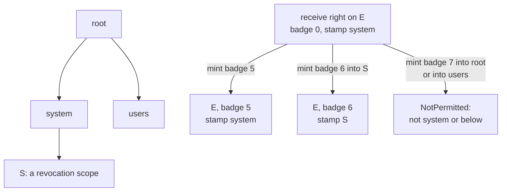

# Handles and objects

A **handle** is how a process holds authority: an index into a table the kernel keeps for that
process, naming one kernel object together with a **badge** and a **stamp**. The kernel has four
kinds of object (budgets, endpoints, devices and processes), each one page of RAM charged to one
budget. Handles carry no rights bits: whoever holds one may use it in full. A server narrows a
grant by minting a handle whose badge means less, and a grant is revoked by destroying the budget
its handle is stamped with.

## Purpose

Apart from its own memory and threads, the clock and random numbers, a process reaches
everything through a handle: a server through an endpoint, resources through a budget, a child
through a process handle, hardware through a device. So a process's handle table is the whole of
what it may do beyond itself, and three questions decide whether that is safe. Can a process name
something it was not given? It names only indices into its own table, and only the kernel writes
the table. Can a grant outlive the decision to revoke it? Every handle is stamped with a budget,
and destroying that budget closes every copy. Can holding objects and handles use up memory
someone else needs? Every object and every table page is charged to a budget. This page describes
those three walls and the tests that attack them.

## Interface

### The four object kinds

Status: built · tested: bench:budget, bench:redoubt-ipc, bench:redoubt-dead, bench:process, bench:process-attack, bench:device

| Kind | What it is | Made by | Ends when |
| --- | --- | --- | --- |
| budget | limits on pages, processes and CPU weight, with a class, labels, an account and an optional deadline ([budgets](budgets.md)) | `budget_create`; `root`, `system` and `users` by the kernel at boot | it or a budget above it is destroyed, by `budget_destroy` or a deadline |
| endpoint | what clients call and servers receive on; it holds no queue ([IPC](ipc.md)) | `endpoint_create` | its **owner**, the budget of the process that created it, is destroyed |
| device | an MMIO range with a DMA flag, an interrupt line, or the right to power off or reboot ([devices](devices.md)) | the kernel at boot, from the loader's device list; never later | its owner is destroyed, or a DMA device fails its reset |
| process | a program with its address space and threads, and afterwards its exit notice ([processes](processes.md)) | `process_create` | its exit notice is received or dropped, or its creator's budget is destroyed |

Nothing else is an object: no handle names a thread, a page or an open call. Threads are named by
their TID within their process, pages by address, open calls by message id.

Each object lives in one RAM frame of its own. The frame's first word marks its kind, and its
second is the object's **id**, drawn from one 64-bit counter that never repeats, so no two objects
of any kind ever share an id (I12 (ids never reused)). That frame is the page the cost table
charges. No call destroys an endpoint or a device: each dies with the budget it is charged to,
and a DMA device also when its reset fails (Residual risks).

### Handles

Status: built · tested: bench:budget, bench:budget-table-attack, bench:budget-forge-attack, bench:budget-destroy-attack, bench:redoubt-ipc, bench:device, host:redoubt-sys::malformed_calls_are_refused

A handle is an index into the calling process's handle table. The slot at that index holds:
- the **object**: its kind, its frame and its id;
- the **badge**, a 64-bit number. For an endpoint, badge 0 is the **receive right** and any other
  badge was chosen by whoever minted the handle ([`mint`](#mint)). Handles to budgets, processes
  and devices carry badge 0;
- the **stamp**, the budget whose destruction revokes the handle ([R9](#r9-stamps)).

Indices start at 1. **Index 0 is never allocated**: in a register or a record slot it means "no
handle", for an optional argument left out or a message slot whose handle was revoked. An index
that is 0 where a handle is required, wider than 32 bits, or not in the caller's table is
`BadHandle`; a handle of the wrong kind for the call is `WrongObject`. A process cannot read its
table: it learns nothing of a handle's object, badge or stamp except by using it.

A slot is four 64-bit words, 32 bytes, so a 4 KiB table page holds `HANDLES_PER_PAGE` (128)
handles; a compile-time check in `kernel/src/handle.rs` confirms that 128 slots fill one page
exactly. Index i is slot (i - 1) mod 128 of table page (i - 1) / 128. A table has at most
`MAX_HANDLES` (4096: 32 pages) handles.

```svgbob
 one slot: four 64-bit words, 32 bytes; 128 slots fill a 4 KiB table page

          63     56 55                  28 27                   0
         +---------+----------------------+----------------------+
 word 0  |  kind   |   stamp's frame      |   object's frame     |
         +---------+----------------------+----------------------+
 word 1  |                     object's id                       |
         +-------------------------------------------------------+
 word 2  |                        badge                          |
         +-------------------------------------------------------+
 word 3  |                  stamp's budget id                    |
         +-------------------------------------------------------+

 kind: 0 empty slot, 1 budget, 2 endpoint, 3 device, 4 process
```
*Figure: a handle as the kernel stores it. A compile-time check confirms every frame index fits
its 28 bits.*

A new handle takes the **lowest free index**. A table page is a frame of its own, allocated and
charged one page to the process's budget when its first handle arrives, and freed when its last
handle goes. Handles are never moved to fill holes, so an index stays valid until it is closed,
and a table with holes costs one page per table page in use. A table already holding
`MAX_HANDLES` handles refuses one more with `TooLarge`, which a caller can tell apart from its
budget being unable to pay for the next table page (`OutOfMemory`). At delivery, a handle that
would take the receiver past `MAX_HANDLES` is a cost it cannot pay, and the sender gets `Refused`
([R4 (delivery)](ipc.md#r4-delivery)).

```svgbob
 process P's handle table                          kernel objects
+-------+------------+-------+--------+          +-------------------------+
| index | object     | badge | stamp  |          |                         |
+-------+------------+-------+--------+          |                         |
|   1   | budget B   |   0   | system |--------->| budget B                |
|   2   | endpoint E |   0   | system |---+      |                         |
|   3   | endpoint E |   5   | S      |---+----->| endpoint E              |
|   4   | process Q  |   0   | system |--------->| process Q               |
|   5   | (empty)    |       |        |          |                         |
|  ...  |            |       |        |          |                         |
|  128  | (empty)    |       |        |          |                         |
+-------+------------+-------+--------+          +-------------------------+
 table page 0: indices 1-128, one frame, charged to P's budget
 table page 1: indices 129-256, no frame until a handle needs index 129
 ... table page 31 ends at index 4096 (MAX_HANDLES)
```
*Figure: a handle table and the objects it names. Handles 2 and 3 name the same endpoint: 2 is
its receive right, 3 a handle minted with badge 5 and stamped with S, a budget below `system`.*

Every lookup checks the id in the handle against the id in the object's frame, and the stamp's id
against its budget's. A mismatch would mean a handle outlived its object. The sweeps of
[R10 (destruction)](budgets.md#r10-destruction) rule that out (I2 (revocation is complete)), and
the kernel stops rather than use a frame that may hold something else
(I1 (handles name live objects)).

### Making, copying and closing handles

Status: built · tested: bench:budget, bench:process, bench:process-attack, bench:redoubt-ipc, bench:redoubt-revoke

| Call | Arguments -> result | The handle |
| --- | --- | --- |
| `endpoint_create` | -> h | the receive right (badge 0) to a new endpoint, owned by and charged to the caller's budget |
| `budget_create` | h(parent), spec -> h | a new child budget ([budgets](budgets.md)) |
| `process_create` | h(budget), h(exit endpoint) -> h | a new process object ([processes](processes.md)) |
| `mint` | source, badge, h(budget) or none -> h | another handle to an existing endpoint, with a non-zero badge ([below](#mint)) |
| `handle_close` | h | removed; the object is untouched |

Each call that makes a handle installs it at the lowest free index of the caller's table,
stamped as [R9](#r9-stamps) says. If the table cannot take it (`TooLarge`, or `OutOfMemory` for
a new table page), the call is undone and costs nothing.

Handles are **copied**, never moved:
- a message carries up to `MAX_MSG_HANDLES` (4) handles, installed in the receiver's table when it
  is delivered while the sender keeps its own ([IPC](ipc.md#messages));
- `process_start` copies up to `MAX_START_HANDLES` (64) of the caller's handles into the new
  process's table, at indices 1 to n in the order given ([processes](processes.md)).

A copy is the same object, badge and stamp at a new index in another table. Copies are equal:
none is the original, and closing one leaves the others. There is no call that copies a handle
within one table.

`handle_close(h)` removes the handle at index h, and frees its table page if it was the page's
last; `BadHandle` if the caller holds no handle at h. It never destroys the object: a budget,
endpoint or device lives on under its own rules, and a process handle closed early leaves the
exit notice pending. The index is free again, and the process's next new handle may take it.
When a process ends, every handle in its table closes. When a process object is freed, every
handle to it closes, in every table.

### What objects cost

Status: built · partly tested: an endpoint's page is attacked only in the model, a device's page by no case, and the saved-context pages (1 on rv32, 2 on rv64) are pinned by no case · tested: bench:budget, bench:budget-table-attack, bench:budget-mem-churn, bench:process-attack, bench:process-review, bench:process-lifecycle, mutation:R6EndpointsFree, mutation:R6ProcessObjectChargedToBudget, mutation:R6OwnPageChargedToItself, mutation:R6OpenCallsFree

Everything the kernel stores is charged in whole pages to one budget (R6 (charging)):

| What | Pages | Charged to |
| --- | --- | --- |
| budget | 1 | its parent (`root`'s is charged to nobody) |
| endpoint | 1 | its owner, the budget of the process that created it |
| device | 1 | its owner: `system`, the budget the loader's programs run in |
| process object (it holds the exit notice) | 1 | the creator's budget, the budget of `process_create`'s caller |
| saved thread contexts | `PROCESS_IMPL_PAGES`: 1 on rv32, 2 on rv64 | the budget the process runs in |
| thread IPC page | 1 per thread | the budget the process runs in |
| page tables | 1 per page-table page, the root table included | the budget the process runs in |
| handle table | 1 per table page holding a handle | the budget the process runs in |
| open call | 1 while open | the receiving process's budget ([R4a (open calls)](ipc.md#r4a-open-calls)) |

Pages a process maps, lends or is given are charged as [memory](memory.md) and [IPC](ipc.md)
say. `PROCESS_IMPL_PAGES` holds 32 slots of 32 registers: a header, and one saved register set
for each of `MAX_THREADS` (31) threads. Each saved-context frame and each IPC page is counted
once, and neither is the process object's page.

A budget's own page is its parent's, so the whole of a budget's page limit is usable and a
**revocation scope** (a budget with zero limits, made only to be destroyed) is no special case.
The process object is charged to its creator, not to the budget the process runs in, because it
holds the exit notice, and that notice must outlive the budget it ran in; the page was paid at
`process_create`, so delivering a notice never allocates. Everything the running process needs
(contexts, page tables, thread pages, handle table) is charged where it runs, and comes back when
it ends.

Every charge comes back exactly. Closing a handle, unmapping, replying, receiving an exit notice
and destroying a budget each return what they freed; a refused call charges nothing. A table of
n handles filled without closing any costs exactly ceil(n / 128) pages.

### `mint`

Status: built · partly tested: `Dead` from a message source whose stamp has gone is attacked by no case · tested: bench:redoubt-ipc, bench:redoubt-ipc-attack, bench:redoubt-revoke, host:redoubt-sys::malformed_calls_are_refused, mutation:MintFromUnservedMessage

`mint(source, badge, budget?) -> h` makes a new handle to an endpoint, with a badge the caller
chooses. The source is one of:
- **a receive right** the caller holds: the new handle is to that endpoint, and its **default
  stamp** is the receive right's stamp;
- **the message id of an open call held by the calling thread**: the new handle is to the
  endpoint the call arrived on, and its default stamp is the stamp of the handle the call came
  through. A `send`'s id, another thread's call and an id the thread never received are
  `InvalidArgument`; if the call's stamp has been destroyed meanwhile, `Dead`.

The rules:
- The badge is never 0: 0 is the receive right, and `mint` never makes one. The decoder in
  `redoubt-sys` refuses it, and the kernel checks again
  (I3 (minted badges are non-zero and narrow)).
- Only a receive right mints: a source handle with any other badge is `NotPermitted`. So only a
  holder of the receive right hands out badges for an endpoint
  (I4 (only badge-0 handles receive)).
- With no budget handle, the new handle gets the default stamp. With one, that budget must be the
  default stamp or below it in the budget tree, or the call is `NotPermitted`: a budget handle
  only narrows.
- The new handle is installed like any other: the lowest free index, `TooLarge` or `OutOfMemory`
  if the table cannot take it.

The badge means whatever the server says: a 9P root and its mode, one client's session, one
grant in a typed protocol ([the servers](../servers/README.md)). The kernel only guarantees it:
every message sent through the handle carries it ([R14 (unforgeable sender)](ipc.md#r14-unforgeable-sender)).
Minting from a call is how a server answers a request with a new capability: the handle it
returns is stamped like the handle the request came through, so it dies with the client's grant.
The full order of checks is in the [ABI reference](abi.md#errors-and-the-order-of-checks).


*Figure: narrowing. A receive right stamped with `system` mints handles stamped with `system` or a
budget below it, never above or beside it. Destroying S revokes the badge-6 handle and every copy
of it; the badge-5 handle lasts as long as `system`.*

## Authority

Status: built · tested: bench:redoubt-ipc-attack, bench:budget-forge-attack, bench:device, bench:process-attack, mutation:ReceiveWithBadgedHandle, mutation:ExitEndpointBadged

What each handle lets its holder do:

| Handle | Its holder may |
| --- | --- |
| budget | carve a child from it (`budget_create`), destroy it and everything below it (`budget_destroy`), read its usage (`budget_usage`, subject to [R1 (flow)](ipc.md#r1-flow)), run a process in it (`process_create`), and name it to narrow a `mint` |
| endpoint, badge 0 (the receive right) | `receive` on it, `mint` handles to it, `call` and `send` through it, and name it as a new process's exit endpoint |
| endpoint, any other badge | `call` and `send` through it; the server sees the badge |
| process | `process_map` into it and `process_start` it, both only before it starts |
| device, MMIO | `map_device`; `dma_alloc` too if it has the DMA flag |
| device, IRQ | `receive` on it |
| device, Reset | `system_reset` |

A handle of another kind gets `WrongObject`. A device handle is the only way to hardware
([R18 (device authority)](devices.md#r18-device-authority)).

- **A process uses only its own table.** An index is looked up in the caller's table and nowhere
  else, so no number a process passes names another process's handle, and a forged index is
  `BadHandle` (I1).
- **No rights bits.** Whoever holds a copy of a handle may do everything in its row. A grant is
  narrowed by the server minting a badge that means less, or by giving a child budget in place of
  a budget, never by a flag on the handle.
- **Authority grows only three ways:** a creating call makes a new object paid from the caller's
  own budget; `mint` makes a new badge on an endpoint whose receive right the caller holds or
  whose call it took; a copy passes on a handle the sender already holds. None gives the caller
  authority over anything it did not already hold or pay for.
- **A budget handle is the right to end that budget.** Any holder may destroy it and everything
  below it, so a budget handle is given only to a party that may end it. A party that needs a
  budget only to narrow a `mint` is given a revocation scope, whose destruction ends no process
  ([budgets](budgets.md)).

## Security properties

### R9 (stamps)

Status: built · partly tested: a handle minted from a call taking that call's stamp is attacked only in the model · tested: bench:process-attack, bench:redoubt-revoke, bench:budget-deadline, mutation:R9ReceivedHandleRestamped, mutation:R9MintStampsCaller, mutation:R9MsgStampIsSenderBudget, mutation:R10KeepForeignHandles

Every handle has a stamp, a budget. Destroying that budget, or any budget above it, closes the
handle and every copy of it, in every table; a copy in a message not yet received arrives as 0
([R10 (destruction)](budgets.md#r10-destruction), I2). Which budget the stamp is:
- `endpoint_create`, `budget_create` and `process_create` stamp the new handle with the
  **caller's budget**, the one its process runs in. A budget handle made by a process in budget A
  dies with A, even though the budget it names sits under another parent and outlives it.
- **A copy keeps its stamp.** A handle delivered in a message or a reply, or placed by
  `process_start`, is stamped as the sender's was. No path restamps a handle.
- **`mint` stamps with the source's default stamp**, or with a budget the caller names at or below
  it ([`mint`](#mint)). The default stamp of a call is the stamp of the handle the call came
  through, not the caller's budget.
- Handles the kernel places at boot, before any process runs, are stamped with `root` for the
  first program's budgets and devices ([boot](boot.md)).

So a stamp only moves down the budget tree. A handle minted from another dies no later than its
source, and a handle minted in answer to a call dies no later than the handle the call came
through: a client whose grant is revoked loses what servers minted for it as well.

The stamp is not the object's owner. An object dies with the budget it is charged to; a handle
dies with its stamp; either ends the handle, because R10 closes every handle whose object or stamp
is being destroyed.

## Failure and restart

Status: built · tested: bench:budget-destroy-attack, bench:budget-table-attack, bench:process, bench:process-attack, bench:redoubt-revoke

- **A process ends:** every handle in its table closes and its table pages return to its budget.
  The objects they named are untouched: an endpoint it received on stays for a restarted server
  ([R4b (a server dies)](ipc.md#r4b-a-server-dies)).
- **A budget is destroyed:** every handle naming it or a budget below it, naming an endpoint,
  device or process object charged to one of them, or stamped with one of them, closes in every
  table, and a copy in a message not yet received arrives as 0 (R10).
- **A process object is freed**, when its notice is received or dropped or its creator's budget
  is destroyed: every handle to it closes.
- **A creating call cannot install its handle:** the object is freed and its charge returned, so
  a refused create costs nothing.
- **A handle whose object has gone** is a kernel bug, not an error a call returns. Every lookup
  compares ids, and on a mismatch the kernel stops rather than use a frame that may hold something
  else (I1). R10's sweeps keep it from happening (I2), and no argument to any call reaches it
  (I14 (no call panics the kernel)); `budget-destroy-attack` reuses frames and indices after a
  destruction to look for one.

## Residual risks

- **No call destroys an endpoint.** An endpoint lives, and costs its owner a page, until the owner
  budget is destroyed; closing every handle to it frees nothing. The owner is always the creating
  process's own budget, so a server that makes an endpoint per client pays for each until that
  budget goes, bounded by the budget's page limit. Whether an endpoint should be reclaimable on
  its own is open. Follow-up: [todo](../todo/endpoint-reclaim.md).
- **A device object is never remade.** None is created after boot; one destroyed with its owner,
  or for failing a DMA reset, is gone until reboot ([devices](devices.md)).
- **Revocation is by budget only.** A grant is revoked by destroying the budget it is stamped
  with, and with it everything else stamped there. A server that means to cut off one client alone
  must have minted that client's handle into a revocation scope of its own. Otherwise it can only
  stop honouring the badge: the handle still reaches the endpoint, and the refusal is the
  server's, not the kernel's.
- **A budget handle cannot be narrowed.** Every holder may destroy the budget and everything
  below it: a handle to `system` is the right to end every system server, and a handle to `root`
  the right to end every process.
- **A stale handle stops the machine.** The kernel's answer to a broken I1 is to stop. A bug in
  R10's sweep would stop the kernel, and every process with it; it would not let a process use a
  freed object.
- **Sweeps and slot searches scan.** Destroying a budget scans every table of every process (up
  to `MAX_PROCESS_COUNT` (64) processes of 32 table pages) and every object frame; installing a
  handle searches for the lowest free slot. The time is bounded by compile-time constants, not by
  anything a process chooses.
- **Accounting on both widths.** One row of the cost table depends on the width: saved contexts
  take 1 page on rv32 and 2 on rv64. The bench runs every accounting case on both widths and checks
  that each charge comes back exactly, but no case pins the per-width figure, and the model's cost
  table is the rv64 one.

## Why

- **No rights bits.** A read-only or non-transferable handle would not hold: its holder can
  proxy for anyone it talks to. So the kernel checks one thing, that the caller's table holds the
  handle, and meaning lives where it is enforced: in the badge, which the server chose and checks
  (a 9P root, read-only), and in the stamp, which bounds how long the grant lasts.
- **Budgets are the only revocation.** There is no per-handle revoker and no derivation tree to
  walk. Every handle already names a budget in its stamp, and destroying a budget is already the
  one way resources come back, so revocation reuses it. A revocation scope, a budget with zero
  limits, makes any grant revocable on its own for one page. Budget ids are never reused, so a
  stale stamp never matches a later budget.
- **Stamps only narrow.** A server answering a call mints under the call's stamp by default, so
  what it hands a client dies with the client's grant, and the server never holds the client's
  budget.
- **Stamp and owner are separate.** Who pays for an object and who may revoke a handle to it are
  different questions. A process in budget A may create a budget under B for someone else; B's
  child lives as long as B, while A's own handle to it dies with A.
- **Every object is a page of its own.** There is no kernel table of fixed size that one budget
  could fill for everyone: creating an object fails only on the caller's own budget
  ([R7 (carving)](budgets.md#r7-carving)). Handle tables work the same way, a page at a time.
- **Lowest free index, never compacted.** An index stays valid until it is closed, so a program
  can keep a number. A table with holes costs a page per page in use, which is what its memory
  costs, and the [model](model.md) charges the same.
- **`TooLarge` at `MAX_HANDLES`**, so a caller can tell a full table from a budget out of pages;
  the limit also bounds every scan of a table.
- **0 means none**, so optional arguments and revoked message slots need no second encoding.
- **The process object is its creator's**, because its exit notice must outlive the budget the
  process ran in; the page was paid at creation, so a notice never allocates.
