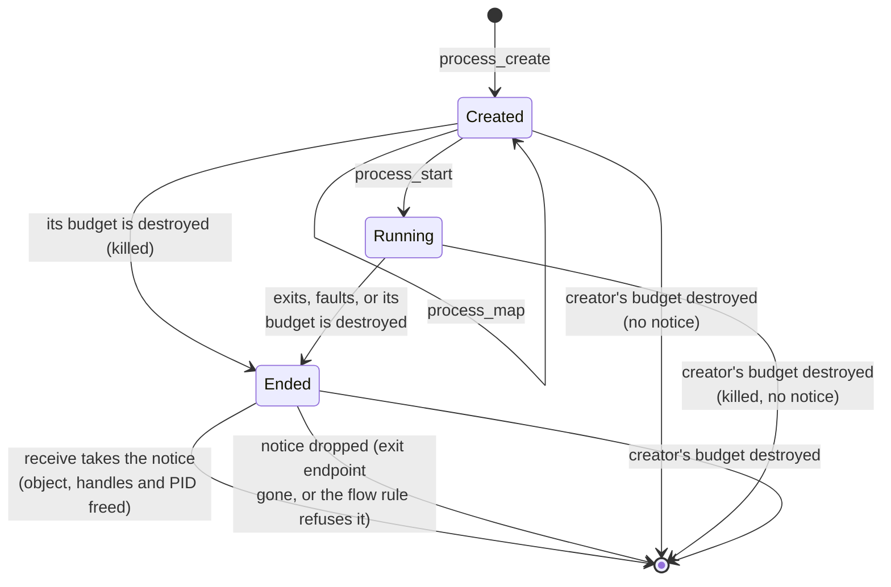
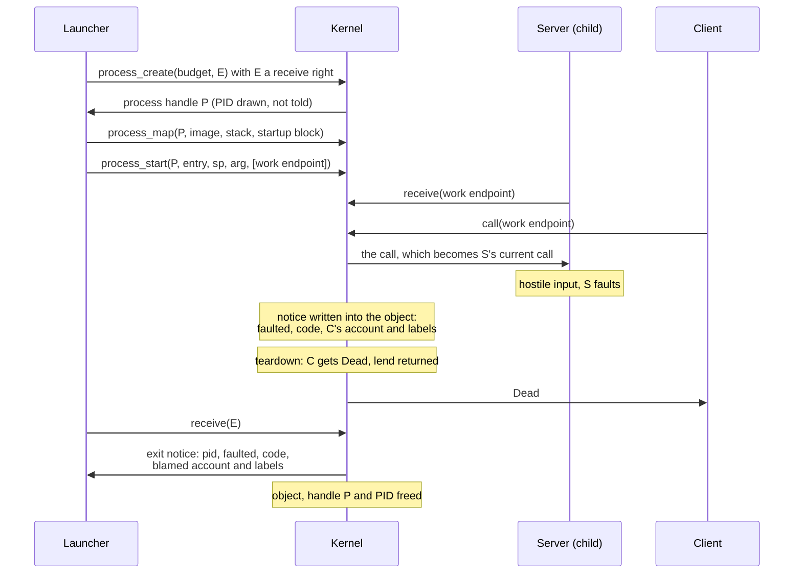

# Processes

A process is an address space, a handle table and up to 31 threads, running in one budget. A
parent makes one in three steps: `process_create` makes it empty, `process_map` moves pages into
it, and `process_start` gives it its handles and starts its first thread. After that the parent
cannot touch it. When a process ends, the kernel sends one **exit notice** to the endpoint its
creator named, saying how it ended and, for a crash, whose call it was working on.

## Purpose

A process is the unit of containment. It holds nothing it was not given: the pages its parent
moved in, the handles its parent listed and one argument. It can reach only what those handles
name, and nothing it does can widen the list. It is also the unit of failure. When a server
crashes on hostile input, the kernel ends the whole process, fails its callers cleanly and tells
its launcher whose call was running, so policy can restart the server and hold the right
principal to account. The PID is only a name for reports: no authority is keyed by it, and a
process that draws a PID used before inherits nothing.

## Interface

### Processes and PIDs

Status: built · partly tested: that PIDs are drawn at random is not attacked by a case · tested: bench:process, bench:process-attack, bench:process-lifecycle, host:redoubt-model::pid_reuse_only_after_notice_receipt

A process has:
- a **PID**, which is also its hardware address-space id (the ASID in `satp`);
- the **budget it runs in**, which pays for everything it holds and sets its CPU share
  ([scheduling](scheduling.md));
- an address space, a handle table ([objects](objects.md)) and up to `MAX_THREADS` (31) threads;
- an **exit endpoint**, named by its creator, where its exit notice goes;
- its open calls, at most `MAX_OPEN_CALLS` (64) ([IPC](ipc.md#r4a-open-calls));
- a **process object**: one page charged to its creator's budget, which holds the exit notice
  (see [Exit notices](#exit-notices)), and one count against that budget's process limit. A
  process handle names this object.

PIDs run from 2 to `MAX_PROCESS_COUNT` (64: the PIDs there are, the kernel's included); PID 1 is
the kernel. `process_create` draws the PID at random from the free ones: a PID is free when no
process holds it and no process object still names it. So a PID is held from `process_create`
until the process object is freed, which is after the process has ended (PID lifetime, below).
The creator is not told the PID. It appears only in the exit notice, so a launcher that must
tell children apart gives each an exit endpoint of its own.

The programs the loader starts at boot have PIDs but no process object: nobody created them, so
nobody is owed their notice ([boot](boot.md)).

*Figure: the life of a process and its process object. From Ended on, only the object is left:
the exit notice and the PID it holds.*

Closing a process handle ends nothing. A created process that is never started keeps its PID
and its pages until its budget or its creator's is destroyed.

### Threads

Status: built · partly tested: a `thread_create` refused for want of a page, and a first thread returning from its entry, are not attacked by a case · tested: bench:thread-limit, bench:process, bench:process-lifecycle, bench:process-review

A thread's number within its process, its **TID**, runs from 1 to `MAX_THREADS` (31); the first
thread is 1. A process holds at most 31 threads, the first one included.

| Call | Arguments -> result | What it does |
| --- | --- | --- |
| `thread_create` | entry, sp, arg -> TID | Start a thread of the caller's process at `entry`, with stack pointer `sp` and `arg` in its first argument register. `TooManyThreads` past 31; `OutOfMemory` if the budget cannot pay the thread's page. |
| `thread_exit` | none; does not return | End the calling thread. |
| `process_exit` | code (32 bits); does not return | End the whole process with `code`. A code wider than 32 bits is `InvalidArgument`, and the process goes on. |

A thread costs its budget one page, its IPC page, which holds everything it waits for and the
calls it holds open ([IPC](ipc.md)). The kernel does not check `entry` or `sp`: a thread given a
bad one is created, and faults when it runs. TIDs are handed out round-robin from the last one
given, so a TID freed by one thread is used again by a later one.

A thread made by `thread_create` that returns from its entry ends as if it called
`thread_exit`, whatever it returns: its return address is one the kernel never maps, and the
fault there is read as the thread's exit. The first thread has no such return address, and
returning from its entry is a fault.

`thread_exit` with other threads still running frees only that thread: whatever it was waiting
for is withdrawn, and every call it holds open fails its caller with `Dead`, lend returned
([R4b (a server dies)](ipc.md#r4b-a-server-dies)). No notice is sent. The last thread's
`thread_exit`, or its return, is `process_exit(0)`, so a started process never lives on with no
threads. A fault in any thread ends the whole process.

### Creating and starting

Status: built · partly tested: `OutOfProcesses` from `process_create` and `OutOfMemory` from `process_start` are not attacked by a case, and the kernel departs from R6 (charging)'s process-object count (Residual risks) · tested: bench:process, bench:process-attack, bench:stub-launch, host:redoubt-model::contexts_are_separate_from_creator_object_on_both_widths, host:redoubt-model::process_map_destination_validation_precedes_started_state, mutation:ProcessInWeightlessBudget, mutation:R6ProcessObjectFree, mutation:R6ProcessObjectChargedToBudget

| Call | Arguments -> result | What it does |
| --- | --- | --- |
| `process_create` | budget, exit endpoint -> process handle | Make an empty process in `budget`: an address space and a PID, no thread. |
| `process_map` | process, src, dst, len, flags | Move whole pages of the caller's own memory into the process at `dst`, before it starts. |
| `process_start` | process, entry, sp, arg, handle list -> nothing | Copy the listed handles into the process and start its first thread. |

**`process_create`** refuses, in this order: a bad budget or exit-endpoint handle (`BadHandle`,
`WrongObject`); a budget with no free weight, which could never be scheduled
([R12 (scheduling)](scheduling.md#r12-scheduling)) (`InvalidArgument`); an exit endpoint that is
not a receive right, badge 0 (`NotPermitted`; see [R21](#r21-crash-blame)); no free PID, or the
budget at its process limit (`OutOfProcesses`); then `OutOfMemory` for the budget's pages, then
the caller's, and `OutOfMemory` or `TooLarge` if the caller's handle table cannot take the
handle.
A refused `process_create` costs nothing. The returned handle has badge 0 and is stamped with
the caller's budget ([R9 (stamps)](objects.md#r9-stamps)).

What a process costs ([objects](objects.md)):
- the process object: one page, charged to the **creator's** budget (the caller of
  `process_create`), because it holds the notice and the notice must outlive the budget the
  process ran in;
- its saved thread contexts, `PROCESS_IMPL_PAGES` (1 page on rv32, 2 on rv64), its root page
  table and every other page-table page, its handle-table pages, one IPC page per thread and the
  pages mapped in it: all charged to **the budget it runs in**, and all given back when it ends.

A process object counts one against its creator's budget's process limit, from `process_create`
until the object is freed, as its page is charged there
([R6 (charging)](budgets.md#r6-charging)). The process also counts against the budget it runs in
while it lives. Because every process limit is carved from `root`'s, live PIDs never exceed
`root`'s limit, and no budget can take another's PIDs. The kernel departs from this: it counts a
process only in the budget it runs in, and only while it lives, so an ended process's PID is held
outside every limit until its notice goes (Residual risks).

**`process_map`** moves pages from the caller into a process that has not started. The source
must be whole pages of the caller's own RAM, not lent (a reserved page is backed first); device
and DMA pages stay put. Every check runs before any page moves. The ranges, the source and the
flags are `InvalidArgument` (flags never empty, never writable and executable together, never
writable without readable: [R11 (memory)](memory.md#r11-memory)); a process that has started or
ended is `NotPermitted`; a destination page already in use is `InvalidArgument`; last, the
process's budget must pay for the page tables and, unless parent and child share a budget, the
pages (`OutOfMemory`). The exact order is in the
[ABI reference](abi.md#errors-and-the-order-of-checks). The pages then belong to the process and
are charged to its budget; the page rules are in [memory](memory.md#the-mapping-calls). The
image and the startup block reach a process this way.

**`process_start`** takes a record of up to `MAX_START_HANDLES` (64: the handles one start
copies) handle slots. It refuses a longer list (`TooLarge`) before reading it, an unreadable
record (`InvalidArgument`), a slot that is 0 or not a handle (`BadHandle`), a bad process handle
(`BadHandle`, `WrongObject`), any listed handle the caller does not hold (`BadHandle`), a process
already started or ended (`NotPermitted`), and a budget that cannot pay for the first thread and
the handle-table pages (`OutOfMemory`). Then nothing fails:
- the handles are **copied** into the child's empty table in list order, so they land in slots
  1 to n; the parent keeps its own, and each copy keeps its stamp;
- the first thread, TID 1, starts at `entry` with `sp` and with `arg` in its first argument
  register.

The kernel passes `arg` on unchanged and never reads it. By convention it is the address of the
**startup block**, the read-only page the parent mapped with the child's namespace, named
handles and arguments; the parent chooses where it goes ([init](../servers/init.md)). How a
launcher lays out the image, the stack and the startup block, and the loader stub that maps an
ELF image inside the child, are [init](../servers/init.md)'s.

### Exit notices

Status: built · partly tested: a notice dropped because its exit endpoint was destroyed is not attacked by a case · tested: bench:process, bench:process-attack, bench:process-review, bench:process-lifecycle, host:redoubt-sys::received_layout, host:redoubt-model::exited_object_handles_and_queued_copies_live_until_notice_receipt, mutation:ExitNoticeDroppedIfNoReceiver, mutation:R10ExitNoticesOutlivePayer, mutation:R10CreatorDeathSparesProcess, mutation:R1ExitNoticeIgnoresLabels, mutation:R1ExitExemptBySystemExiting

A process ends in one of three ways, and its exit notice says which:

| Cause | Value | When | Code | Blamed |
| --- | --- | --- | --- | --- |
| `exited` | 1 | `process_exit(code)`, or the last thread ends, with no open calls | the code given (0 for the last thread) | nobody |
| `faulted` | 2 | a thread faults; or the process exits as above while holding open calls | the RISC-V exception cause (15: a store page fault), or the code given | the sender of the ending thread's current call, or nobody ([R21](#r21-crash-blame)) |
| `killed` | 3 | the budget it runs in is destroyed ([R10 (destruction)](budgets.md#r10-destruction)) | 0 | nobody |

`receive` on the exit endpoint returns the notice as a record of kind `exit`: words 0 to 2 are
the PID, the cause and the code, and the record's account and labels fields are the blamed
account (0 for nobody) and its labels (empty for nobody)
([IPC](ipc.md#what-receive-returns)).

When a process ends, the kernel first writes the notice into the process object, reading the
blame before anything is freed. Then it tears the process down: every open call fails its
caller (R4b), every call it made is withdrawn or abandoned
([R3 (lends and abandoned calls)](ipc.md#r3-lends-and-abandoned-calls)), and its threads,
memory, handle table and DMA runs ([devices](devices.md)) go. It stops counting against its
budget's process limit at once, and its budget is back where it was before the process was
created. Last, the notice is delivered or dropped:
- **Delivered** to whichever thread receives on the exit endpoint next; notices come before
  messages. Nothing is allocated, because the notice's page was paid for at `process_create`.
  A notice with no receiver waits for one.
- **Dropped** if the exit endpoint has been destroyed, or if
  [R1 (flow)](ipc.md#r1-flow) refuses it. An exit notice is a one-way flow from the budget the
  process ran in to the endpoint's owner: it is delivered only if the owner is class `system` or
  its labels include all of that budget's. A `system`-class exiting budget gets no exemption.
- **Never made** if the creator's budget is destroyed: that frees the process object, killing
  the process first if it still runs, and there is no notice at all, even for a receiver already
  waiting on the exit endpoint (R10).

The receive record is checked before a notice is delivered. If it cannot be written, the
receiver gets `InvalidArgument` and the notice stays, with its PID and its page, for the next
`receive`.

**PID lifetime.** Taking or dropping the notice frees the process object: every handle that
names it closes, in every table (a copy still in a queued message arrives as 0), its page goes
back to the creator's budget, and its PID becomes free. Until then the PID is held, and a
process handle still names an ended process: `process_map` and `process_start` get
`NotPermitted`. So no PID is reused while a notice still names it. A launcher that leaves its
children's notices untaken keeps their PIDs and their pages, and its next `process_create` can
get `OutOfProcesses`.

*Figure: a server's life from `process_create` to the exit notice that blames the call it
crashed on.*

## Authority

Status: built · tested: bench:process-attack, bench:pid-reuse-authority, mutation:ExitEndpointBadged

- **A budget handle is the right to create a process in that budget.** The budget pays for the
  process; the caller's own budget pays for the process object.
- **A process handle is the right to map into and start the process**, and only until it
  starts. A started process is closed to its parent: everything it is given, it is given before
  it runs, so nothing can be slipped into a process that is already working. After that the
  handle only names the object; `budget_usage` on it is `WrongObject`.
- **The exit endpoint must be named by its receive right.** Only the endpoint's receiver can
  have a process report there, so nobody can aim notices at an endpoint they merely hold a
  badged handle to.
- **A child gets only what its parent gives it**: the pages `process_map` moved, the handles
  `process_start` listed, in slots 1 to n, and `arg`. Nothing is inherited, and there is no
  ambient authority. A child cannot reach any object the parent did not list.
- **No call ends another process.** A process ends itself, faults, or is killed by destroying
  its budget or its creator's; killing is budget authority
  ([budgets](budgets.md#r10-destruction)). The process handle is stamped with the creator's
  budget, so destroying that budget revokes it everywhere (R9).

## Security properties

### R20 (PID reuse)

Status: built · tested: bench:pid-reuse-authority, bench:process-attack, bench:process-lifecycle, host:redoubt-model::pid_reuse_only_after_notice_receipt

A reused PID inherits nothing. A process that draws a PID another process held gets none of that
process's handles, mappings, badges, open calls, messages, notices, interrupts or device
access. Everything the kernel keeps per PID is emptied when a process ends (its handle table, its
frames, its threads' IPC pages and open calls, its message-id counter, the DMA devices its death
must reset) and made afresh by `process_create`. The hardware address-space id is reused with
the PID, and every address-space switch flushes the whole TLB, so no cached translation of the
earlier process survives. No authority is keyed by PID: a handle is an entry in a table, an
interrupt reaches whoever receives on its device's handle, and message ids are per receiving
process ([R14 (unforgeable sender)](ipc.md#r14-unforgeable-sender)). And a PID is not reused
while a notice still names it, so every notice names exactly one ended process.

The attack case gives a first child a badged send handle, an endpoint, the console's interrupt,
a device mapping and a budget, lets it exit holding a call, and then spawns children until one
draws its PID. That child holds nothing at any index but its own slot 1, its messages carry only
its own badge, reading where the device was mapped faults, and the console's interrupt wakes the
parent.

### R21 (crash blame)

Status: built · partly tested: blame after the blamed sender's budget is destroyed is not attacked by a case, and a thread that holds a parked call, then receives a send and faults (blaming nobody), is attacked only in parts · tested: bench:process, bench:process-attack, mutation:BlameNobody, mutation:BlameNewestCall, mutation:ExitWithOpenCallsNotFaulted, mutation:CurrentNeverSet, mutation:ReceiveKeepsCurrent, mutation:ServeIgnored, mutation:ExitEndpointBadged

Crash blame names the sender of the current call, or nobody. When a process ends `faulted`, its
notice blames the account and labels of the sender of the **current call** of the thread that
faulted or ended the process. If that thread has no current call, nobody is blamed (account 0,
labels empty), even when other threads of the process hold open calls; there is no fallback to
another call. `exited` and `killed` blame nobody.
- A thread's current call is set by `receive` to the call it takes, and to none whenever
  `receive` returns anything else; `serve` names another open call of the thread; replying to it
  sets it to none ([IPC](ipc.md#the-calls)). A server that parks calls and resumes one
  calls `serve` first, so a crash blames that call's sender and not whoever called last.
- A `send` is never an open call, so it is never blamed.
- `process_exit` while the process holds open calls is `faulted`, with the code given, and so are
  the last thread's `thread_exit` and return. A Rust panic ends in `process_exit`, so a server
  that panics on a request is blamed like one that faults. A server that means to exit replies
  to every open call first.
- The account and labels are copies taken when the call was delivered, so blame survives the
  sender's budget being destroyed in between.
- The exit endpoint is a receive right, or `process_create` is `NotPermitted`. So blame goes
  only to an endpoint whose receiver chose to hear it: a process cannot be made to report its
  crashes, and whom they blame, to the steward or any other server through a badged handle.

The kernel only reports. What blame costs a principal is policy: the steward counts it by
account and label set, so a vault session that keeps crashing a shared server does not log out
its owner's other sessions ([steward](../servers/steward.md)). The labels in the notice are what
let it key by label set.

## Failure and restart

Status: built · tested: bench:process-lifecycle, bench:process-attack, bench:stub-launch, bench:sched-exit-churn

- **A process ends** by exiting, faulting or being killed. Its callers get `Dead` and their
  lends back (R4b); a call it made that a server had taken is abandoned, and the server is told
  once (R3). Its budget gets back every page the process held, exactly.
- **A thread ends** while others run: only its own calls end, and its process goes on.
- **A process destroys its own budget, or its creator's:** the call does not return, because
  the process is killed with everything else that budget pays for.
- **A hostile image** can only make its own process exit or fault: the launcher keeps running
  and the children's budget is back where it was ([init](../servers/init.md)).
- **Exiting costs CPU like running.** A thread or process that exits, faults or is killed on the
  CPU is charged for the slice it used ([scheduling](scheduling.md)).
- **Restart is policy.** The kernel restarts nothing. The endpoint a server received on outlives
  it, so callers queued there wait for the server `init` starts again
  ([init](../servers/init.md#restarts-and-reboots)).
- No argument to any process or thread call can make the kernel panic (I14 (no call panics the kernel)).

## Residual risks

- **Delayed corruption can misattribute blame.** If one principal's request corrupts a server's
  state without crashing it, and another's later trips over the damage, the second is blamed.
  The consequence is a wrongful logout.
- **A crash can blame nobody.** Corruption left by a call that was already answered can crash a
  thread later, when it has no current call; nobody is blamed, and the crash counts only toward
  `init`'s restart limit and, past it, a reboot.
- **A thread that ends itself is not a crash.** A server thread that calls `thread_exit`, or
  returns, while its siblings run fails its callers with `Dead` but sends no notice and blames
  nobody. Only the end of the whole process is reported.
- **Blame is not label-checked on its own.** R1 checks an exit notice against the labels of the
  budget the process ran in, not those of the blamed sender. A `system`-class server's notice
  can carry a labelled caller's account and labels to a `user`-class owner of its exit endpoint.
  Only a creator holding a `system`-class budget handle can set this up.
- **PIDs are one global pool of 63, and untaken notices hold them outside every limit.** The
  kernel departs from R6's process-object count: an ended process's PID stays held while its
  notice is untaken, and it no longer counts against any process limit. What bounds these PIDs is the
  creator's pages, so one creator can hold every free PID with a single one-process budget, and
  every other `process_create`, in any part of the budget tree, then gets `OutOfProcesses`.
  Follow-up: [todo](../todo/pid-pool-pinning.md).
- **Finding a process object scans every object frame.** Drawing a PID and matching a notice to
  its endpoint walk all kernel object frames, a cost bounded by RAM and not charged to the
  caller's budget.
- **`process_map` backs its source before it checks the flags.** A `process_map` with bad flags
  may first make the caller's untouched source pages real, at the caller's cost, before it
  refuses. The model's proof of the write-without-read refusal goes through `set_flags`, not
  `process_map`. Follow-up: [todo](../todo/process-map-flag-order.md).
- **The loader's own programs send no notice.** Nothing hears when one of them ends
  ([boot](boot.md)).

## Why

- **The process object is the exit slot.** It is charged to the creator, not to the budget the
  process runs in, because a `killed` notice must outlive that budget, paid by someone still
  alive. Paying at `process_create` means delivering a notice never allocates, and the pending
  notices a creator can pile up are bounded by its own pages.
- **The PID lives as long as the notice.** A notice names a PID; if the PID could be reused
  first, a launcher could take a later process's notice for an earlier one's.
- **Random PIDs.** A counter would let one process watch another's rate of process creation,
  including a vault session's. A PID drawn at random from the free ones says nothing about when
  other processes were made, and a creator learns it only from the notice.
- **Closed once started.** Everything a process holds it was given before its first instruction,
  so a parent can be checked once, at launch, and cannot change a running child.
- **No kill call.** Budgets are the one revocation mechanism; ending a process is destroying the
  budget it runs in, which ends everything else it holds in the same step.
- **Blame follows the current call, or nobody.** Event-driven servers such as `ipd` (the TCP/IP
  server) and `sshd` (the SSH server) park calls and resume them on an interrupt or a send.
  Blaming the newest call would let one principal crash the server on its own connection while
  another's call is newest, and log out the bystander. `serve` lets the server say which call it
  is working on; work with no current call blames nobody, because a wrong guess costs a
  bystander its session.
- **Exiting with open calls is a fault**, because a Rust panic exits through `process_exit`, and
  panics are the commonest way hostile input brings a server down.
- **Handles in slots 1 to n.** The child finds what it was given by position, and the startup
  block names the positions; there is nothing to search and nothing inherited by accident.
