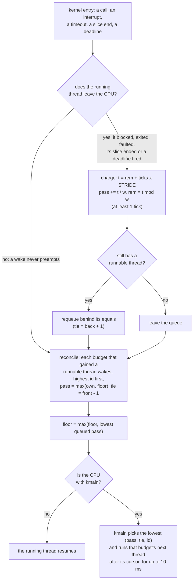

# Scheduling

The kernel runs threads from one stride queue over every budget with a runnable thread. Each
budget has a **pass**; the lowest pass runs next, for a slice of at most 10 ms, and running
raises the pass in inverse proportion to the budget's free weight. There is no priority: `init`,
the steward and the drivers are scheduled by weight like everyone else. A waking budget joins at
no less than the queue's current minimum, a wake never preempts, and every run is charged,
however short it is and however it ends.

## Purpose

CPU is a resource like pages, and a hostile budget must not get more of it than its share, nor
delay anyone else beyond its weight. The scheduler has two jobs: hold every budget to its weight
whatever pattern of running, sleeping, exiting and budget churn it tries, and keep the steward
and the drivers responsive enough that a person can end a session under load. It does both with
one mechanism and no exceptions, so the rule that contains a hostile agent is the same rule that
serves the steward.

## Interface

### One flat stride queue

Status: built · partly tested: round-robin among one budget's threads is not attacked by a case · tested: bench:sched-share, bench:sched-large-weight, bench:sched-server-busy, bench:sched-carve-inflation, host:redoubt-stride::the_crate_and_the_model_agree, mutation:R12PriorityById, mutation:R12IgnoreWeight, mutation:R12StrideWeightIsLimit

Every budget with a runnable thread is in one queue, whatever its class. There is no priority,
no second queue and no flag that jumps it. The kernel runs the queued budget with the lowest
pass, and running raises its pass by its runtime times `STRIDE` (2^20) divided by its weight. So
over any stretch in which budgets stay runnable, each gets CPU in proportion to its weight.

The weight the queue uses is the budget's **free weight**: its weight limit less what its
children carved ([R7 (carving)](budgets.md#r7-carving)). Carving moves share to the child and
never duplicates it. Weights are 32-bit and matter only relative to each other. At boot the
kernel gives `root` 1,000,000; `system` gets a quarter (250,000) and `users` the rest less
1,000 (`INIT_WEIGHT`), which `root` keeps so that a process in it has free weight
([budgets](budgets.md)). Below that, the budget that carves a child chooses the child's weight.

Class (`system` or `user`) decides trust, never order ([budgets](budgets.md)). A system-class
server doing a user's work waits its turn like the user.

Within a budget, threads take turns. Each pick runs the budget's next runnable thread after the
one it ran last, in (pid, tid) order, wrapping. The code is `kernel/src/sched.rs`, which keeps
each budget's scheduling state in the budget's own frame, and `libs/stride`, which holds the
arithmetic, the ranks and the order of steps. `libs/stride` is `#![forbid(unsafe_code)]` and has
no dependencies.

### Preemption points

Status: built · partly tested: that an interrupt's wake does not preempt, and that another budget's deadline does, are not attacked by a case · tested: bench:sched-wake-no-preempt, bench:budget-deadline, host:redoubt-model::scheduler_contracts_hold, mutation:R12PreemptOnWake, mutation:R12TimeoutWakePreempts

The running thread keeps the CPU until one of these:
- its slice ends: `SLICE_US` (10,000 µs) from the pick;
- it blocks, exits, faults or is killed;
- a budget deadline fires.

Nothing else takes the CPU. A timeout expiring or an interrupt firing only makes a thread
runnable; it runs when the queue next picks it. The hart timer is always armed for the earliest
of the slice end, the next timeout and the next budget deadline ([timer](timer.md)).

A budget deadline preempts whatever runs, because the destruction lifts passes and removes
budgets, so the queue must be picked again. A thread that entered the kernel just as the deadline
fired takes its trap again when it next runs.

The kernel itself is never preempted. It runs with interrupts off (`sstatus.SIE` clear) and takes
the timer and device interrupts only from user mode or while idle, so a system call or a
destruction runs to its end. Picking is done by `kmain`, the kernel's own loop (PID 1). It runs
its pick through a private S-mode `ecall` into the kernel's trap handler, which saves `kmain`'s
context as it saves a thread's.

### The current minimum and ties

Status: built · partly tested: wakers ahead of requeued budgets, and requeues in order, are checked on the target only when a run happens to produce such a tie; the host tests and the model attack them · tested: bench:sched-ties, bench:sched-idle-gap, host:redoubt-stride::ranks_follow_all_four_clauses, host:redoubt-stride::the_floor_survives_an_empty_queue, host:redoubt-stride::a_running_budget_stays_queued_and_counts_for_the_floor, mutation:R12WakeBanksCredit, mutation:R12NoFloorWhenIdle, mutation:R12TieQueuedFirst, mutation:R12RequeueAhead, mutation:R12RequeueLifo

A budget **wakes** when it goes from no runnable thread to one. Its pass becomes
`max(own pass, floor)`. The **floor** is the current minimum: the lowest pass among queued
budgets, the running one included at the pass it was last charged. The floor only rises, and it
holds while the queue is empty. So a budget that slept while others ran, or through an idle gap,
comes back at the floor and not with credit it banked while away.

A pick takes the lowest **rank**, `(pass, tie, id)`. At an equal pass:
1. a waker ranks ahead of a budget that was requeued;
2. of two wakers, the later kernel entry's ranks first;
3. within one entry, the lower budget id first (ids are the kernel's, I12 (ids never reused));
4. requeued budgets run in the order they were requeued.

The tie key encodes this. Each wake takes `front - 1`, and one entry's wakes are processed in
descending id, so the lowest id ends frontmost. Each requeue of a still-runnable budget takes
`back + 1`. Both counters reset when the queue empties. Wakes are reconciled once per kernel
entry: as the kernel leaves, budgets that lost their last runnable thread leave the queue and
budgets that gained one wake. Ranking later wakers first starves nobody: a waker that has run is
charged, its pass rises above the floor, and it no longer ties.

`bench:sched-ties` runs a kernel built with the scheduling trace ([R23](#r23-no-test-channels)).
The bench's own oracle (`tools/testbench/src/sched_oracle.rs`) rebuilds the order from the trace's
events with its own reading of the four clauses and checks every pick, keeps its own floor, and
requires every pass never to fall.


*Figure: the pass and wake rule at one kernel entry. `w` is the budget's free weight.*

### Charging

Status: built · partly tested: interrupt handling billed to the device's owner is not attacked by a case, and the kernel departs from whole-cost billing on a deadline's destruction (Residual risks) · tested: bench:sched-sleep-gaming, bench:sched-exit-churn, bench:sched-timer-flood, bench:sched-server-busy, bench:sched-destroy-billing, host:redoubt-stride::a_split_charge_equals_the_whole, host:redoubt-stride::every_charge_counts_at_any_weight, host:redoubt-stride::a_deschedule_charges_at_least_one_unit_and_a_destroy_only_what_ran, mutation:R12ShortRunsFree, mutation:R12DropRemainder, mutation:R12ExitRunsFree, mutation:R12NoMinimumCharge, mutation:R12FoldAtNewWeight

Runtime is counted in timebase ticks at the trap boundary. There are two ways into user mode
(resuming a thread, returning from a call) and one way out (the trap handler). On every trap from
user mode the kernel adds the user time since the last return to the running budget's pending
runtime. So no path runs user code unaccounted, whatever ends the run.

Pending runtime is folded into the pass at a deschedule, before a weight change, at a
destruction, and when work is billed to a budget that is not running:

```
t = rem + ticks x STRIDE;   pass += t / w;   rem = t mod w      (w: the free weight)
```

- **The remainder is exact**, so a run split into pieces costs what one run would, at any weight.
  Without it a weight above `STRIDE` would round a one-tick run to nothing.
- **A deschedule charges at least `MIN_CHARGE`** (1 tick), so a run too short for the clock to
  see is not free.
- **One fold counts at most `RUNTIME_CAP`** (2^40 ticks), so the product fits 64 bits on rv32 and
  rv64 alike. The pass is a 128-bit number that is only added to and compared, so it never wraps.
- **A weight change** (a carve, or a carve returned) folds first, so runtime is charged at the
  weight it ran at, and then rescales the remainder, losing under one pass unit.

Kernel time is billed as well:
- a system call's time is its caller's;
- an expired timeout is billed to its thread's budget, and a deadline's destruction as below;
  each walk that finds an expired item is billed with it, and the last walk, which finds
  nothing, is nobody's, so one entry does at most one walk nobody pays for;
- an interrupt's handling is billed to the owner of its device object
  ([R5 (interrupts)](devices.md#r5-interrupts)); one with no device object, to nobody;
- `kmain`'s pick and switch after a deschedule are the descheduled budget's;
- idle time is nobody's.

The top of a destruction returns its carve to its parent before any of the destruction's work is
billed. So the parent, often the caller of `budget_destroy`, pays for the destruction at the
weight it has once the child is gone, not at the sliver it kept while the child held the rest.
In `bench:sched-destroy-billing` a parent that kept 10 of 1000 destroys the child holding 990 and
is back on the CPU within twice the destruction's cost and four slices; billed at 10, it would wait
for seconds.

Every destruction's whole cost is billed to someone. For `budget_destroy` that is the caller, as
the call's own kernel time. For a deadline it is the top's parent, after its carve returns, or the
nearest ancestor with free weight above 0 if the parent has none; `root` always has. No part of a
destruction is billed to nobody ([R10 (destruction)](budgets.md#r10-destruction)). The kernel
departs from this on a deadline: it bills the dying budget up to the lift, whose debt then moves
to its parent ([Inheritance](#inheritance)), and the rest to nobody (Residual risks).

A server that works for a caller spends its own budget's CPU: no time is donated
([Residual risks](#residual-risks)). CPU charging is separate from page charging
([R6 (charging)](budgets.md#r6-charging)). The model charges runtime only; billing kernel work is the
kernel's alone, and the boot cases are its only check.

### Inheritance

Status: built · tested: bench:sched-budget-churn, bench:sched-debt-lift, bench:sched-idle-gap, host:redoubt-stride::create_then_destroy_without_a_run_moves_nothing, host:redoubt-stride::a_churned_child_adds_to_a_leading_parent, host:redoubt-stride::the_inherited_wait_is_not_counted_again, mutation:R12DestroyDropsDebt, mutation:R12CreateAtFloorOnly, mutation:R12LiftByMax, mutation:R12UnnormalizedLift, mutation:R12LiftCountsEntryWait

A child budget enters at `e = max(floor, parent's pass)`, and keeps `e` as its **entry**. A
running parent is charged first. So a child never starts behind the parent it came from, and
making a child buys no turn.

When a budget is destroyed ([R10 (destruction)](budgets.md#r10-destruction): descendants first,
bottom-up), its own work since entry moves to its parent:

```
W = (pass - max(e, floor))+ x w_child + rem_child
parent's pass = max(parent's pass, floor) + W / w_parent      (the remainder carried)
```

`w_parent` is the parent's free weight after the child's carve has returned. A parent below the
floor starts from the floor, without its remainder: it cannot bank what it did not run. Only
work after entry counts, so creating and destroying a budget that never ran moves nothing. The
child's debt adds to the parent's own lead instead of hiding under it, so a parent that spins and
churns children pays for both.

`bench:sched-budget-churn` runs a churner that creates a weight-1 child, lets it run a slice and
destroys it, over and over (blocked, spinning, by a deadline, and through fresh intermediates),
against an equal-weight victim who keeps half; the oracle recomputes every lift from the trace.
Its last variant, a shell that keeps giving a child half its weight and taking it back with no
run between, leaves the victim neither more nor less than half.

### Running while carved down

Status: built · tested: bench:sched-carve-inflation, bench:sched-budget-churn, bench:sched-destroy-billing, host:redoubt-stride::a_rescale_loses_under_one_unit, mutation:R12StrideWeightIsLimit, mutation:R12FoldAtNewWeight

A budget that runs while most of its weight is carved away accrues its lead at the small weight
it kept. That lead is not rescaled when the weight comes back. A destroyed child's work is lifted
at the child's weight at its destruction, whatever the child kept while it ran. Both only
over-charge the budget that carved; neither under-charges, so no share is gained by carving. In
`bench:sched-carve-inflation` a spinning budget that carves spinning children, one deep and four
deep, gets at most half against an equal victim.

A budget that holds a process keeps free weight above 0. A carve that would take its last free
weight gets `InvalidArgument`, and so does `process_create` into a budget whose weight is all
carved ([R7](budgets.md#r7-carving)).

### Responsiveness

Status: built · partly tested: the rv64 steward decision-wake p99 target is missed in some runs, and decision wake plus R10 time is not asserted as one sum · tested: bench:sched-latency

No wake latency follows from weight. A wake waits out the running thread's slice, a waking
budget keeps a pass above the floor if it has one, and several budgets can tie at the floor. So
wakeup is prompt but not bounded, and responsiveness is a **measured target** under a named
workload, not a bound derived from the queue.

The workload (`tests/programs/src/bin/sched-latency.rs`): a driver stand-in (weight 1000, from
`system`) that waits for the goldfish RTC's alarm interrupt; a steward stand-in (1000, from
`system`) that sleeps on timeouts, destroys leases by hand after a timeout (its decision) and
waits for other leases' deadlines; and N spinning sessions of weight 100 from `users`, for
N = 1, 4 and 16. At N = 16 a spinning server of weight 1000 joins them. Each run takes 200 wakes
and 50 destructions of each kind, in virtual (instruction-count) time on QEMU, on rv64 and rv32.

| Measure | Target |
| --- | --- |
| driver wake: the RTC's time when the driver runs, less the alarm it set | p50 <= 15 ms, p99 <= 50 ms |
| steward timer wake: `time_now` when it runs, less its timeout's deadline | p50 <= 15 ms, p99 <= 50 ms |
| steward decision wake: the same, for the timeout after which it destroys a lease | p50 <= 15 ms, p99 <= 50 ms |
| deadline notice: the lease's `killed` notice received, less the lease's deadline | p99 <= 30 ms |
| R10 kernel time of one destruction, from the trace | p99 <= 30 ms |
| a lease's end from the steward's decision: decision wake + R10 | p99 <= 80 ms, as the sum of the two |
| `budget_destroy`, call to return | recorded against one round: 30 ms plus (runnable budgets + 2) slices |
| the 1000-weight server's share of the spinning CPU at N = 16 | at least 384 less 30 per thousand |

The case fails on any `missed`. `bench:sched-latency-tcg` runs the same workload in host time and
only reports, with the oracle still checking every pick.

## Authority

Status: built · tested: bench:sched-carve-inflation, bench:legacy-gone, host:redoubt-model::scheduler_contracts_hold

- **Weight is the only lever.** No call sets a pass, a rank, a priority or a slice, and there is
  no yield: a thread gives up the CPU by blocking, for instance in a `receive` with a timeout.
- **Weight is carved.** A budget's weight comes out of its parent's free weight at
  `budget_create`, by whoever holds a handle to the parent (R7), and goes back when the child is
  destroyed. A budget's free weight rises only when a child it carved is destroyed.
- **Ties are the kernel's.** The budget ids that break ties are assigned by the kernel and never
  reused; no caller chooses one.
- **`kmain`'s switch is not a call.** Its tag lies outside the call table; a user-mode `ecall`
  with it gets `InvalidArgument` like any unknown number ([ABI](abi.md)).
- **Passes are not readable.** No call returns another budget's pass or rank. The scheduling
  trace would, which is why the production kernel has none ([R23](#r23-no-test-channels)).

## Security properties

### R12 (scheduling)

Status: built · partly tested: the bound on a call's kernel time is not attacked by a case, and the kernel departs from it in `map_anon`'s search; a deadline's destruction is billed only in part · tested: bench:sched-share, bench:sched-sleep-gaming, bench:sched-idle-gap, bench:sched-exit-churn, bench:sched-budget-churn, bench:sched-carve-inflation, bench:sched-debt-lift, bench:sched-timer-flood, bench:sched-server-busy, bench:sched-large-weight, host:redoubt-stride::the_crate_and_the_model_agree, host:redoubt-stride::a_broken_model_disagrees, host:redoubt-model::scheduler_fairness, host:redoubt-model::scheduler_contracts_hold, mutation:R12PriorityById, mutation:R12IgnoreWeight, mutation:R12WakeBanksCredit, mutation:R12TieQueuedFirst, mutation:R12RequeueAhead, mutation:R12RequeueLifo, mutation:R12PreemptOnWake, mutation:R12TimeoutWakePreempts, mutation:R12NoFloorWhenIdle, mutation:R12ShortRunsFree, mutation:R12DropRemainder, mutation:R12ExitRunsFree, mutation:R12DestroyDropsDebt, mutation:R12CreateAtFloorOnly, mutation:R12LiftByMax, mutation:R12StrideWeightIsLimit, mutation:R12UnnormalizedLift, mutation:R12LiftCountsEntryWait, mutation:R12FoldAtNewWeight, mutation:R12NoMinimumCharge

A budget's CPU follows its free weight, in one queue with no priority. While it has a runnable
thread, a budget gets at least its weight's share of the CPU the runnable budgets share. No
pattern of spinning, sleeping and waking, exiting or faulting, creating, carving and destroying
budgets, or arming timeouts and deadlines gets it more. The rule's parts are the sections above:
free weight, the preemption points, the wake rule and ranks, charging and inheritance.

A system call's kernel time is bounded by a constant plus a term linear in the pages it maps or
the objects it names. It never depends on the extent of an address area or on what other
processes hold. Billing it to the caller does not excuse it, because every wake waits for it.
R10's scan of every kernel-object frame is the one stated exception
([todo](../todo/budget-destroy-cost.md)). The kernel departs from this bound in `map_anon`'s
address search ([memory](memory.md#residual-risks)).

It is attacked three ways:
- **Boot cases, in virtual time**, count each budget's work over a window and compare it with
  its weight's share, within 50 per thousand: spinners at 100, 100 and 300; near-slice, 20 µs
  and long-sleep bursts; a sleeper waking into an idle gap; threads and processes that exit or
  fault just before their slice ends; budget churn; carving; 30 sleepers a microsecond apart and
  64 staggered deadlines; a system server flooded by one user; a weight-1000 server among eight
  users of 100.
- **The differential** drives `libs/stride`, wired as the kernel wires it, and the model's
  scheduler through 3,000 random sequences of creations, destructions (leaf, on the CPU, and
  whole subtrees), wakes, blocks, runs and preemptions, and requires every pass, entry,
  remainder, tie, queue membership, floor and pick to agree after every step. A model with any of
  18 scheduling rules broken must disagree.
- **The model's mutations**: each `R12*` variant breaks one part, and `scheduler_fairness` (ten
  scenarios, each with an independent check) or the scheduler contracts must catch it
  ([model](model.md)).

### R23 (no test channels)

Status: built · partly tested: no case builds the production kernel and checks that it carries no trace

The production kernel carries no test-only diagnostic channel. The scheduling trace is one: a
record of every budget's id and pass at every wake, requeue, pass change, pick and lift, which
tells whoever reads the console who runs when. It exists only under the Cargo feature
`sched-trace`, and no default build enables it:
- the kernel's default features are `print-panics` alone, and `./build` adds only the board
  (`qemu-virt`);
- every trace site in `kernel/src/{sched,budget,mem,main,redoubt}.rs` sits under
  `#[cfg(feature = "sched-trace")]`, so with the feature off the ring, its records and its
  `SCHED-TRACE` console lines are not compiled;
- the bench turns it on per case (`kernel_features`), only for `sched-ties`,
  `sched-budget-churn`, `sched-latency` and `sched-latency-tcg`, whose `sched_oracle` post-check
  reads the trace printed at `system_reset`.

The other diagnostic features are off by default in the same way: `sched-inject-tie-fault`, a
debug-only break of the tie rule that implies the trace, and `debug-print`, which prints every
pick's PID and thread and every trap. `dma-reset-deaf` is a test-only fault, not a channel
([devices](devices.md)).

## Failure and restart

Status: built · partly tested: a picked thread that dies before the switch, and a full queue, are not attacked by a case · tested: bench:sched-exit-churn, bench:budget-deadline, bench:sched-idle-gap, host:redoubt-stride::a_deschedule_charges_at_least_one_unit_and_a_destroy_only_what_ran, host:redoubt-stride::the_floor_survives_an_empty_queue, host:redoubt-model::scheduler_stays_fair_past_the_old_pass_saturation_boundary

- **A thread exits, faults or is killed on the CPU:** its budget is descheduled and charged what
  it ran, at least one tick, like any other deschedule.
- **A budget is destroyed:** bottom-up, each budget is charged what it ran, its work is lifted into
  its parent, and it leaves the queue. A budget destroyed on the CPU (its deadline, with nothing
  descheduling it first) is charged, and the CPU is free.
- **A deadline ends the entering process:** the trap handler resumes whatever is current and uses
  nothing of the dead process (I14 (no call panics the kernel)).
- **The picked thread died since the pick:** `kmain` does not run it and picks again.
- **Nothing is runnable:** `kmain` idles, billing stops, and the floor holds for the next waker.
- **Arithmetic cannot stop the kernel.** Passes are 128-bit and never wrap; a lift saturates
  rather than overflow. The queue has one slot per process, and a queued budget has a runnable
  thread, so it cannot fill; if it ever did, a budget would be left out rather than anything
  stopping (a debug assertion in checked builds).
- **A restarted server** in a fresh budget enters like any child, at `max(floor, parent's pass)`,
  and carries no credit from the one that died. Restarted in the same budget, it keeps that
  budget's pass.

## Residual risks

- **Server work is paid by the server's weight.** Work a server does for a user is paid by the
  server's weight, not the requester's; the steward's work, by the steward. No time is donated, so
  a user who floods a server takes that server's share away from the server's other callers,
  never more: in `bench:sched-server-busy` the server's work for one user stays within its
  weight's share and the other users keep theirs. Servers therefore bound the work of one
  request, and the steward, whose weight is large, bounds its per-request work and relies on its
  per-(account, label set) caps ([steward](../servers/steward.md)).
- **Wakeup is prompt but not bounded.** A wake waits out the running slice, may keep a larger
  pass, and may tie. Human control rests on a measured steward lease-termination latency, not a
  proven bound, until something needs a real-time rule ([TENETS](../TENETS.md#guarantees)).
- **The steward decision-wake target is missed on rv64.** In some runs at N = 16 the steward
  stand-in lands behind several weight-100 spinners' slices, and its decision-wake p99 passes
  the 50 ms target (up to about 100 ms). The run-to-run difference comes from the guest's boot RNG
  seed, which shifts PID allocation and so the instruction-count phase. It is a real miss under
  this workload, not a measurement fault. Still to decide: re-pin the target with evidence, assert the true
  sum (decision wake plus R10 time, 80 ms), or change the steward stand-in; and pin the guest seed
  so runs repeat. Follow-up: [todo](../todo/sched-latency-target.md).
- **The kernel is not preemptible.** A call's or a destruction's kernel time delays every wake
  on the machine, which is why R12 bounds a call's kernel time whoever pays for it. R10's time
  is the stated exception: it dominates lease termination and grows with the objects it walks
  ([budgets](budgets.md); follow-up: [todo](../todo/budget-destroy-cost.md)). `map_anon`'s
  search breaks the bound ([memory](memory.md#residual-risks); follow-up:
  [todo](../todo/map-anon-search-cost.md)). Ending a DMA driver
  adds up to `RESET_US` (1 ms) of reset polling for each device it held, at most
  `MAX_DMA_DEVICES` (16) ([devices](devices.md)).
- **A deadline's last steps are billed to nobody.** The kernel departs from the whole-cost
  billing rule ([Charging](#charging)). On a deadline the dying budget is billed for
  the destruction's work up to the lift. The rest (closing handles in every table, freeing
  frames) comes after the bill and is charged to no budget. A budget of free weight 0 is charged
  nothing at all, so the deadline of an empty revocation scope costs its creator only the
  `budget_create`. The 64 staggered weight-0 deadlines of `bench:sched-timer-flood` leave the
  victim its half; larger floods are not attacked. Follow-up:
  [todo](../todo/deadline-destroy-billing.md).
- **Carving while running over-charges.** A budget's lead accrued while carved down is never
  rescaled when its weight returns. That is never a gain, but an honest shell or steward that
  carves heavily while running can be held off the CPU well past its restored share. A rescale
  (the lead times the weight it ran at, over the weight restored) waits for real carve patterns. Follow-up:
  [todo](../todo/carve-lead-rescale.md).
- **A destroyed lineage can delay one sibling by a round.** Debt lifted onto a shared parent (such
  as `users`) can delay one sibling created under it in the same round by at most one round,
  decaying once the floor passes the parent's pass. A lifted pass loses the wake-first tie to
  spinners still at the floor and waits out the round; `bench:sched-debt-lift` bounds a sibling's
  first run at (runnable budgets + 2) slices. Rounding loses under one pass unit per destroyed
  budget and per weight change, and the loss falls on the budget that churns.
- **Scheduling is observable.** `rdtime` is readable in user mode, so a thread that times its own
  gaps learns how busy the machine is. Timing channels are out of scope
  ([TENETS](../TENETS.md#threat-model)).
- **Measured on QEMU, on one hart.** The targets are virtual time under `icount`; no hardware run
  is measured. The queue and its accounting drive one hart. The cases that read the trace run a
  kernel built with it, which has a record at every queue event and 2 MiB less RAM for the budget
  tree.

## Why

- **Weights, not priorities.** A server ahead of everyone would let one user make `fsd` or `keyd`
  do expensive work while no user budget runs. Large weights from the boot manifest
  ([init](../servers/init.md)) keep `init`, the steward and the drivers responsive without that; a driver that spins while others are runnable is a bug for
  the bench to find, not a mode to support.
- **Free weight.** Carving is how budgets delegate, so a child's share must come out of its
  parent's; counting the limit instead would let a tree of carves multiply its share.
- **The floor.** Without it a sleeper keeps a stale low pass and dominates when it wakes. With
  it, a waker is still prompt: it joins at the front of the current minimum.
- **Wake-first, deterministic ties.** A budget that just woke has usually waited, and one that was
  requeued has just run. Fixed clauses over kernel ids let an independent oracle check every pick.
- **No preemption on wake.** One preemption source, the timer, keeps accounting to a single point
  and makes a flood of wakes cost nothing extra. The price is that wake latency is measured, not
  derived.
- **Ticks, an exact remainder, one tick at least.** Whole microseconds would let a run under 1 µs
  go free, and a large weight would round short runs to nothing. Counting at the trap boundary
  means no exit path runs unaccounted.
- **Additive, normalized inheritance from entry.** Otherwise a budget sheds debt by destroying the
  child that ran, or a light grandchild's raw pass stalls an unrelated sibling, or an honest
  parent pays twice for the wait it gave the child.
- **No time donation.** A server thread running on its caller's budget could be stopped mid-call
  by that caller's lease and hold the server's locks for good. Servers pay for their own CPU
  until measured priority inversion says otherwise ([beyond](../beyond/scheduling-extensions.md)).
- **No trace in production.** A per-pick record of every budget is a cross-principal channel that
  the containment claims do not cover, so it exists only in test builds.
