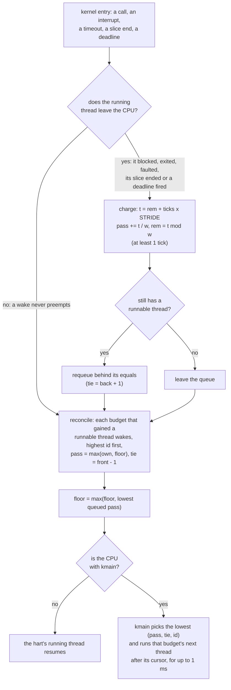

# Scheduling

The kernel runs threads from one stride queue over every budget with a runnable thread. Each
budget has a **pass**; the lowest pass runs next, for a slice of at most 1 ms, and running
raises the pass in inverse proportion to the budget's free weight. There is no priority: `init`,
the steward and the drivers are scheduled by weight like everyone else. A waking budget joins at
no less than the queue's current minimum, a wake never preempts, and every run is charged,
however short it is and however it ends.

## Purpose

CPU is a resource like pages, and a hostile budget must not get more of it than its share, nor
delay anyone else beyond its weight. The scheduler has two jobs: hold every budget to its weight
whatever pattern of running, sleeping, exiting and budget churn it tries, and keep the steward
and the drivers responsive enough that a person can end a session under load. It does both with
one mechanism and no exceptions, so the rule that contains a hostile agent is the same rule that
serves the steward.

## Interface

### One flat stride queue

<details><summary>Status: built · partly tested: round-robin among one budget's threads is not attacked by a case · tested (15)</summary>

- bench:sched-share
- bench:sched-large-weight
- bench:sched-server-busy
- bench:sched-carve-inflation
- bench:smp-boot
- bench:smp-shootdown
- host:redoubt-stride::the_crate_and_the_model_agree
- host:redoubt-stride::a_pick_passes_over_a_budget_whose_threads_all_run_on_harts
- host:redoubt-stride::a_budget_with_two_runnable_threads_runs_on_two_harts_at_one_pass
- host:redoubt-stride::a_budget_running_on_another_hart_stays_queued_through_this_harts_reconcile
- mutation:R12PriorityById
- mutation:R12IgnoreWeight
- mutation:R12StrideWeightIsLimit
- mutation:R12OneRunnerPerBudget
- mutation:R12SpreadChargesOnce

</details>

Every budget with a runnable thread is in one queue, whatever its class. There is no priority,
no second queue and no flag that jumps it. The kernel runs the queued budget with the lowest
pass, and running raises its pass by its runtime times `STRIDE` (2^20) divided by its weight. So
over any stretch in which budgets stay runnable, each gets CPU in proportion to its weight.
On several harts each hart picks the lowest-pass budget that has a runnable thread no hart is
running, so a budget runs on as many harts as it has runnable threads. Its stride state stays one
per budget: each hart charges its own runner, under the kernel lock, to the budget's one pass. A
reconcile keeps a budget queued while any hart runs it.

The weight the queue uses is the budget's **free weight**: its weight limit less what its
children carved ([R7 (carving)](budgets.md#r7-carving)). Carving moves share to the child and
never duplicates it. Weights are 32-bit and matter only relative to each other. At boot the
kernel gives `root` 1,000,000; `system` gets a quarter (250,000) and `users` the rest less
1,000 (`INIT_WEIGHT`), which `root` keeps so that a process in it has free weight
([budgets](budgets.md)). Below that, the budget that carves a child chooses the child's weight.

Class (`system` or `user`) decides trust, never order ([budgets](budgets.md)). A system-class
server doing a user's work waits its turn like the user.

Within a budget, threads take turns. Each pick runs the budget's next runnable thread that no
hart is running, after the one it last picked, in (pid, tid) order, wrapping. The code is `kernel/src/sched.rs`, which keeps
each budget's scheduling state in the budget's own frame, and `libs/stride`, which holds the
arithmetic, the ranks and the order of steps. `libs/stride` is `#![forbid(unsafe_code)]` and has
no dependencies.

### Preemption points

<details><summary>Status: built · partly tested: that an interrupt's wake does not preempt, and that another budget's deadline does, are not attacked by a case · tested (6)</summary>

- bench:sched-wake-no-preempt
- bench:budget-deadline
- host:redoubt-model::scheduler_contracts_hold
- mutation:R12PreemptOnWake
- mutation:R12TimeoutWakePreempts
- mutation:R12SliceCountsExitWork

</details>

The running thread keeps the CPU until one of these:
- its slice ends: `SLICE_US` (1,000 µs) from its return to user mode after the pick;
- it blocks, exits, faults or is killed;
- a budget deadline fires.

Nothing else takes the CPU. A timeout expiring or an interrupt firing only makes a thread
runnable; it runs when the queue next picks it. The hart timer is always armed for the earliest
of the slice end, the next timeout and the next budget deadline ([timer](timer.md)).

A budget deadline preempts whatever runs, because the destruction lifts passes and removes
budgets, so the queue must be picked again. A thread that entered the kernel just as the deadline
fired takes its trap again when it next runs.

The kernel itself is never preempted. It runs with interrupts off (`sstatus.SIE` clear) and takes
the timer and device interrupts only from user mode or while idle, so a system call or a
destruction runs to its end. Picking is done by `kmain`, the kernel's own loop (PID 1). It runs
its pick through a private S-mode `ecall` into the kernel's trap handler, which saves `kmain`'s
context as it saves a thread's.

### The current minimum and ties

<details><summary>Status: built · partly tested: wakers ahead of requeued budgets, and requeues in order, are checked on the target only when a run happens to produce such a tie; the host tests and the model attack them · tested (18)</summary>

- bench:sched-ties
- bench:sched-idle-gap
- host:redoubt-stride::ranks_follow_all_four_clauses
- host:redoubt-stride::the_floor_survives_an_empty_queue
- host:redoubt-stride::a_running_budget_stays_queued_and_counts_for_the_floor
- host:redoubt-stride::a_slice_end_reads_no_more_states_for_a_longer_queue
- host:redoubt-stride::a_rank_out_of_step_with_its_frame_trips_the_audit
- host:redoubt-stride::a_budget_capped_at_its_threads_is_left_out_of_the_floor
- host:redoubt-stride::a_budget_no_longer_capped_is_lifted_to_the_floor
- mutation:R12CappedHoldsFloor
- mutation:R12CapOnce
- mutation:R12AllCappedHoldsFloor
- mutation:R12UncapBanksCredit
- mutation:R12WakeBanksCredit
- mutation:R12NoFloorWhenIdle
- mutation:R12TieQueuedFirst
- mutation:R12RequeueAhead
- mutation:R12RequeueLifo

</details>

A budget **wakes** when it goes from no runnable thread to one. Its pass becomes
`max(own pass, floor)`. The **floor** is the current minimum: the lowest pass among queued
budgets, the running ones included, each once, at the pass it was last charged. The floor only rises, and it
holds while the queue is empty. So a budget that slept while others ran, or through an idle gap,
comes back at the floor and not with credit it banked while away. The floor is raised only when it
can have moved (a budget at it was charged or left, or wakes filled an empty queue), from ranks the
queue keeps beside its slots, each written where the queue changes a queued budget's pass or tie;
the pick compares the same ranks. Neither reads a budget's frame, which stays the record: a checked
kernel audits the ranks against the frames with the marks' audit. So a slice end's scheduler work
is under 3 µs per queued budget (2.4 µs measured in a checked build, "Charging"), the frame reads
it makes being its hart's running budget's own.

On several harts the floor leaves out a **capped** budget, one whose weight's share of the harts
is more than it has runnable threads. Running every thread it has, its pass lags, and counting it
would hold the floor below the budgets that share the other harts, so a waker would enter far
behind them and take their harts until it caught up. The cap is found as the shares are: in
descending weight per runnable thread, a budget is capped if `w x H > k x W` (`H` the harts, `k`
its runnable threads, waiting or on a hart, `W` the queued budgets' free weight), and the next is
tested with the capped one's harts and weight taken out. At one hart no budget is ever capped. When
every queued budget is capped, fewer runnable threads than harts, the floor rises to the highest
of their passes instead of holding: uncontested time banks for no one, so a budget waking then
cannot take the others' harts later for time no budget wanted. A budget that stops being capped
is lifted to `max(own pass, floor)`, as a waker is: it cannot bank what it had no thread to run.
With more than one hart online the queue keeps each budget's free weight, its threads no hart runs
(as the kernel's settle counts them) and its harts beside its slot, counted afresh as a hart comes
online and kept by no scan at one hart, so every floor raise finds the cap set in one scan, keeping the top `H - 1` by `w / k`, linear in the queue, with no frame read
but a lifted budget's. A checked kernel audits the set, with the marks' audit, against
water-filling done its own way over every queued budget.

A pick takes the lowest **rank**, `(pass, tie, id)`. At an equal pass:
1. a waker ranks ahead of a budget that was requeued;
2. of two wakers, the later kernel entry's ranks first;
3. within one entry, the lower budget id first (ids are the kernel's, I12 (ids never reused));
4. requeued budgets run in the order they were requeued.

The tie key encodes this. Each wake takes `front - 1`, and one entry's wakes are processed in
descending id, so the lowest id ends frontmost. Each requeue of a still-runnable budget takes
`back + 1`. Both counters reset when the queue empties. Wakes are reconciled once per kernel
entry: as the kernel leaves, budgets that lost their last runnable thread leave the queue and
budgets that gained one wake. The reconcile visits only the budgets whose runnable state changed
in the entry, with the same wakes and leaves, the wakes in the same order: each budget counts its
ready threads, and a change of a process's ready threads marks the process, whose count then moves
to its budget. Leaves have no order a pick can see. Ranking later wakers first starves nobody: a
waker that has run is charged, its pass rises above the floor, and it no longer ties.

`bench:sched-ties` runs a kernel built with the scheduling trace ([R23](#r23-no-test-channels)).
The bench's own oracle (`tools/testbench/src/sched_oracle.rs`) rebuilds the order from the trace's
events with its own reading of the four clauses and checks every pick, keeps its own floor, and
requires every pass never to fall but at a weight change, which it recomputes
([the lead follows the weight](#the-lead-follows-the-weight)). In the guest, two groups of three
each wake in one entry, by one destruction each, and each group runs lowest id first. The oracle
alone judges which group runs first: a slice end between the waker's two destructions may run the
earlier group before the later one wakes.


```mermaid
flowchart TD
    K["kernel entry: a call, an interrupt,<br/>a timeout, a slice end, a deadline"] --> D{"does the running<br/>thread leave the CPU?"}
    D -- "no: a wake never preempts" --> REC
    D -- "yes: it blocked, exited, faulted,<br/>its slice ended or a deadline fired" --> F["charge: t = rem + ticks x STRIDE<br/>pass += t / w, rem = t mod w<br/>(at least 1 tick)"]
    F --> S{"still has a<br/>runnable thread?"}
    S -- yes --> RQ["requeue behind its equals<br/>(tie = back + 1)"]
    S -- no --> LV[leave the queue]
    RQ --> REC
    LV --> REC
    REC["reconcile: each budget that gained a<br/>runnable thread wakes, highest id first,<br/>pass = max(own, floor), tie = front - 1"] --> FL["floor = max(floor, lowest queued pass)"]
    FL --> R{"is the CPU<br/>with kmain?"}
    R -- no --> RUN[the hart's running thread resumes]
    R -- yes --> P["kmain picks the lowest (pass, tie, id)<br/>and runs that budget's next thread<br/>after its cursor, for up to 1 ms"]
```
*Figure: the pass and wake rule at one kernel entry. `w` is the budget's free weight.*

### Charging

<details><summary>Status: built · partly tested: interrupt handling billed to the device's owner is not attacked by a case · tested (18)</summary>

- bench:sched-sleep-gaming
- bench:sched-exit-churn
- bench:sched-timer-flood
- bench:sched-server-busy
- bench:sched-destroy-billing
- bench:deadline-flood-billed
- host:redoubt-stride::a_split_charge_equals_the_whole
- host:redoubt-stride::every_charge_counts_at_any_weight
- host:redoubt-stride::a_deschedule_charges_at_least_one_unit_and_a_destroy_only_what_ran
- host:testbench::a_timer_interrupt_bills_the_budgets_whose_items_it_expired
- mutation:R12ShortRunsFree
- mutation:R12DropRemainder
- mutation:R12ExitRunsFree
- mutation:R12NoMinimumCharge
- mutation:R12FoldAtNewWeight
- mutation:R12DeadlineWorkUnbilled
- mutation:R12TimerWorkUnbilled
- mutation:R12SwitchBilledToPrevious

</details>

Runtime is counted in timebase ticks at the trap boundary. There are two ways into user mode
(resuming a thread, returning from a call) and one way out (the trap handler). On every trap from
user mode the kernel adds the user time since that hart's last return to the pending runtime of
the budget whose thread it ran. So no path runs user code unaccounted, whatever ends the run.

Pending runtime is folded into the pass at a deschedule, before a weight change, at a
destruction, and when work is billed to a budget that is not running:

```
t = rem + ticks x STRIDE;   pass += t / w;   rem = t mod w      (w: the free weight)
```

- **The remainder is exact**, so a run split into pieces costs what one run would, at any weight.
  Without it a weight above `STRIDE` would round a one-tick run to nothing.
- **A deschedule charges at least `MIN_CHARGE`** (1 tick), so a run too short for the clock to
  see is not free.
- **One fold counts at most `RUNTIME_CAP`** (2^40 ticks), so the product fits 64 bits on rv32 and
  rv64 alike. The pass is a 128-bit number that is only added to and compared, so it never wraps.
- **A weight change** (a carve, or a carve returned) folds first, so runtime is charged at the
  weight it ran at, and then rescales what the budget owes to the new weight
  ([the lead follows the weight](#the-lead-follows-the-weight)).

Kernel time is billed as well:
- a system call's time is its caller's;
- an expired timeout is billed to its thread's budget, and a deadline's destruction as below,
  each with its share of the walk that found it. The timer is armed for a timeout only when its
  thread blocks; a wait that ends before its timeout leaves it early, and the walk that finds the
  wait gone is billed to that thread's budget. The rest of an entry that found either, the
  timer's own handling included, is billed to the budget it found last: the budget it
  interrupted pays for none of it. Each bill closes its interval at the tick that opens the next,
  so a bill's own handling is in the interval after it and no part of a timeout's expiry is
  nobody's ([residual risks](#residual-risks)). A
  timer interrupt that found neither is the budget's its hart runs when it ends that budget's slice,
  and nobody's otherwise;
- an interrupt's handling is billed to the owner of its device object
  ([R5 (interrupts)](devices.md#r5-interrupts)); one with no device object, to nobody;
- `kmain`'s pick and switch into a budget are paid by the budget picked, whatever ended the run
  before: a block or an exit is paid by its actor, a timer entry's handling by the budget it
  served, and the pick that follows by the budget it picks (a pick that cannot run leaves the
  next pick owing it; a pick of nothing is nobody's);
- idle time is nobody's.

A slice end costs about 0.12 ms of kernel time on rv64 and 0.17 ms on rv32 in the release build
under QEMU (about 15,000 and 22,000 instructions) under nine runnable budgets, billed to the budget
picked after it: the trap, two SBI timer calls, the deschedule, the reconcile, the pick and the
switch, with under 3 µs of it per queued budget (the checked, traced build measures 2.4 µs per
queued budget per slice end from three to seventeen queued, net of its audits, over a fixed
175 µs). At a 1 ms slice the nine spinners of `bench:sched-large-weight-release` do 0.91 (rv64)
and 0.87 (rv32) of the useful work the 10 ms build does; the case requires 0.85, the fixed part
being the rest. A count of user work still falls short of the window: in the checked build, `bench:sched-share`'s three
spinners count 975 (rv64) and 964 (rv32) of 1000 of what the loop's rate alone would fill, the
rest being what a slice end that switches budgets costs over a lone spinner's, the checked
build's audits among it (the marks' audit after about every slice end, the queue's ranks audited
with it), so the case judges each spinner's share of what the three counted (600 of 1000 for the
weight-300 spinner on both widths, against its 600; 585 and 578 of the window), not of the
window. It reports the sum beside, with no verdict; `bench:sched-share-release` requires the
release build's sum to reach 960.

The top of a destruction returns its carve to its parent before any of the destruction's work is
billed. So the parent, often the caller of `budget_destroy`, pays for the destruction at the
weight it has once the child is gone, not at the sliver it kept while the child held the rest.
In `bench:sched-destroy-billing` a parent that kept 10 of 1000 destroys the child holding 990 and
is back on the CPU within twice the destruction's cost and four slices; billed at 10, it would wait
for seconds.

Every destruction's whole cost is billed to someone. For `budget_destroy` and `budget_reap` that is
the caller, as the call's own kernel time. For a deadline it is the top's parent, after its carve
returns, or the nearest ancestor with free weight above 0 if the parent has none; `root` always
has. No part of a destruction is billed to nobody
([R10 (destruction)](budgets.md#r10-destruction)). On a deadline the kernel names the payer once the
carve is back, and bills it after the subtree is gone for everything from the walk that found the
deadline. In `bench:deadline-flood-billed` a creator floods its own budget with empty weight-0
budgets on short deadlines: its count falls as the flood grows from 16 to 64 a round, and an
equal-weight victim keeps its half. With the bill planted out, the victim fell to 137 of 1000.

The trace checks every timer interrupt from user mode (`bench:sched-timer-flood`): after its
expiry it charges only the budget it found last, an expired item's or a wait's that ended before
its timeout, and with neither, only the budget it interrupted, when it ends that budget's slice.
Against 30 sleepers a microsecond apart, the same with 64 staggered budget deadlines, and two
waits answered at once 15 ms before their timeouts, the victim gets 473, 473 and 477 of 1000 net
on rv64 and 468, 469 and 481 on rv32, and no timer interrupt is nobody's. The last case requires
interrupts that found the attacker's waits ended early inside the victim's window, so the check
cannot pass for want of them: 73 on rv64 and 19 to 20 on rv32. Its attacker holds no other
timed wait that times out within the window: one due at every expiry walk of its process would
reset the timer's hint each slice, and a hint 15 ms ahead would never come. A sleep of a
microsecond has passed before its call would block, so it arms nothing; when every call armed
the timer, each such sleep made an interrupt that found nothing. With the rest of each timer
interrupt billed to the budget it interrupted (`timer-tail-billed`, the recorded negative run),
the check fails on both widths: the victim pays for the attacker's waits that ended early.

A server that works for a caller spends its own budget's CPU: no time is donated
([Residual risks](#residual-risks)). CPU charging is separate from page charging
([R6 (charging)](budgets.md#r6-charging)). The model charges runtime, and three kinds of kernel
work billed to a payer: a deadline's destruction (`R12DeadlineWorkUnbilled`), a timer's expiry
of the timeouts it ends (`R12TimerWorkUnbilled`), and the pick and switch into a budget
(`R12SwitchBilledToPrevious`). Billing other kernel work is the kernel's alone, and the boot
cases are its only check.

Against threads that each run nine tenths of a slice and exit, beside a main thread polling on a
1 ms timeout (`sched-exit-churn`'s first share), the victim got 439 of 1000 net on rv64 and 432
on rv32 while it paid the pick and switch at each of its own slice ends, about 90 µs at the 1 ms
slice, a tenth of what it was charged, and while each expiry of the attacker's poll left about
50 µs, its bills' own handling, to nobody. Billed as above it gets 492 and 487.

### Inheritance

<details><summary>Status: built · tested (19)</summary>

- bench:sched-budget-churn
- bench:sched-debt-lift
- bench:sched-lift-delay
- bench:sched-idle-gap
- host:redoubt-stride::create_then_destroy_without_a_run_moves_nothing
- host:redoubt-stride::a_churned_child_adds_to_a_leading_parent
- host:redoubt-stride::the_inherited_wait_is_not_counted_again
- host:testbench::a_marked_wake_picked_within_one_round_passes
- host:testbench::a_budget_picked_twice_before_the_marked_one_fails
- host:testbench::a_sibling_delayed_as_its_parents_lift_predicts_passes
- host:testbench::a_sibling_held_a_round_past_its_parents_lift_fails
- host:testbench::a_lift_the_floor_had_passed_fails
- host:testbench::each_phase_is_reported_on_its_own
- host:testbench::the_floor_is_recorded_at_each_record
- mutation:R12DestroyDropsDebt
- mutation:R12CreateAtFloorOnly
- mutation:R12LiftByMax
- mutation:R12UnnormalizedLift
- mutation:R12LiftCountsEntryWait

</details>

A child budget enters at `e = max(floor, parent's pass)`, and keeps `e` as its **entry**. A
running parent is charged first. So a child never starts behind the parent it came from, and
making a child buys no turn.

When a budget is destroyed ([R10 (destruction)](budgets.md#r10-destruction): descendants first,
bottom-up), its own work since entry moves to its parent:

```
W = (pass - max(e, floor))+ x w_child + rem_child
parent's pass = max(parent's pass, floor) + W / w_parent      (the remainder carried)
```

`w_parent` is the parent's free weight after the child's carve has returned. A parent below the
floor starts from the floor, without its remainder: it cannot bank what it did not run. Only
work after entry counts, so creating and destroying a budget that never ran moves nothing. The
child's debt adds to the parent's own lead instead of hiding under it, so a parent that spins and
churns children pays for both.

`bench:sched-budget-churn` runs a churner that creates a weight-1 child, lets it run a slice and
destroys it, over and over (blocked, spinning, by a deadline, and through fresh intermediates),
against an equal-weight victim who keeps half; the oracle recomputes every lift from the trace.
Its last variant, a shell that keeps giving a child half its weight and taking it back with no
run between, leaves the victim at least half, and the recomputed lifts show that creating and
destroying moved nothing. Its victim's share has no ceiling: the shell pays at its halved weight
for what it runs while carved, its own calls included
([running while carved down](#running-while-carved-down)), so how far above half the victim gets
follows the kernel's speed.

### Running while carved down

<details><summary>Status: built · tested (8)</summary>

- bench:sched-carve-inflation
- bench:sched-carve-return
- bench:sched-budget-churn
- bench:sched-destroy-billing
- host:redoubt-stride::a_carve_and_its_return_leave_the_state
- mutation:R12StrideWeightIsLimit
- mutation:R12FoldAtNewWeight
- mutation:R12RescaleOnlyOnReturn

</details>

A budget that runs while most of its weight is carved away accrues its lead at the small weight
it kept, and owes that runtime at whatever weight it has later
([the lead follows the weight](#the-lead-follows-the-weight)). A destroyed child's work is lifted
at the child's weight at its destruction, whatever the child kept while it ran. That only
over-charges the budget that carved; it never under-charges, so no share is gained by carving. In
`bench:sched-carve-inflation` a spinning budget that carves spinning children, one deep and four
deep, gets at most half against an equal victim.

A budget that holds a process keeps free weight above 0. A carve that would take its last free
weight gets `InvalidArgument`, and so does `process_create` into a budget whose weight is all
carved ([R7](budgets.md#r7-carving)).

### The lead follows the weight

<details><summary>Status: built · tested (6)</summary>

- bench:sched-carve-return
- bench:sched-budget-churn
- host:redoubt-stride::a_carve_and_its_return_leave_the_state
- host:redoubt-stride::the_crate_and_the_model_agree
- host:testbench::weight_changes_are_recomputed
- mutation:R12RescaleOnlyOnReturn

</details>

What a budget owes is runtime, and a weight change keeps it exactly. Every weight change, a
carve and a carve returned alike, folds at the old weight and then converts the budget's lead
and remainder to the new weight, the same way a lift converts a child's work:

```
W = (pass - floor)+ x w_old + rem
pass = floor + W / w_new;   rem = W mod w_new
```

So a carve raises the lead by the ratio of the weights and its return lowers it by the same
ratio, and a carve returned with no run between leaves the budget where it was. If the carve
raised the floor (the budget had the lowest pass), the return converts from the higher floor and
the budget ends a little higher: over-charged, never ahead. Both directions
are needed: rescaling only on a return would let a budget carve just before a burst and return
just after, and its lead would shrink at the return without having grown at the carve. A budget
at or below the floor owes only its remainder, and waking would lift it to the floor anyway. At a
destruction the carve returns first, so the parent's lead is converted before the child's work
is lifted onto it at the parent's restored weight ([inheritance](#inheritance)). A budget at
weight 0 holds no process, and what it owes is stated at weight 1 meanwhile, so it is carried
exactly through 0: carving everything away and then getting back only part of it is the same as
the one carve from the old weight to the new.

`libs/stride`'s `rescale` is the conversion; the model makes the same one, and the bench's oracle
recomputes every weight change a traced kernel records, the one place it lets a pass fall. A host
test checks that a carve and its return leave pass and remainder unchanged. In
`bench:sched-carve-return` a budget of weight 1000 carves 999 away at the start of a slice, runs on
the 1 it kept until nine tenths of the slice into it, and takes the weight back: from then on it
gets 496 to 499 of 1000 against an equal victim. With the remainder alone rescaled, as before, it
got 0.

### Responsiveness

<details><summary>Status: built · tested (18)</summary>

- bench:sched-latency
- bench:sched-lock-contention
- bench:sched-lock-contention-4
- bench:sched-cluster
- bench:sched-cluster-old-control
- bench:budget-destroy-growth
- bench:sched-budget-churn
- bench:sched-exit-churn
- bench:sched-timer-flood
- bench:sched-carve-return
- host:testbench::destructions_are_timed_and_bounded
- host:testbench::audits_are_subtracted_inside_each_window
- host:testbench::a_hart_share_is_judged_of_every_charge_against_water_filling
- host:testbench::latency_targets_are_gated_up_to_gate_harts
- host:testbench::an_unmatched_audit_fails
- host:testbench::cluster_envelope_qualifies_where_the_old_rtc_interval_did_not
- host:testbench::the_old_control_must_fail_on_its_lower_witness
- host:testbench::a_control_that_misses_its_slot_is_classified_net_of_audits

</details>

No wake latency follows from weight. Unless a hart is idle, a wake waits out a running thread's
slice, a waking
budget keeps a pass above the floor if it has one, and several budgets can tie at the floor. So
wakeup is prompt but not bounded, and responsiveness is a **measured target** under a named
workload, not a bound derived from the queue.

The workload (`tests/programs/src/bin/sched-latency.rs`): a driver stand-in (weight 1000, from
`system`) that waits for the goldfish RTC's alarm interrupt; a steward stand-in (1000, from
`system`) that sleeps on timeouts, destroys leases by hand after a timeout (its decision) and
waits for other leases' deadlines; and N spinning sessions of weight 100 from `users`, for
N = 1, 4 and 16. At N = 16 a spinning server of weight 1000 joins them. Each run takes 200 wakes
and 50 destructions of each kind, on QEMU, on rv64 and rv32.

**Targets are guest instructions.** The case runs under `-icount shift=3,sleep=off` with the RTC
on the same clock (`-rtc clock=vm`; [`tests/sched-latency.toml`](../../tests/sched-latency.toml)):
every guest instruction advances virtual time by 2^3 ns, and idle time skips to the next timer
deadline. So 1 ms is 125,000 instructions, and each target below is that many instructions; the
milliseconds are for reading. Host load does not change a result.

**Targets exclude the checked build's audits.** The case is a checked build, since the trace needs
one ([R23](#r23-no-test-channels)). A checked build runs full audit scans after each destruction
and at each process-object free, and a release build compiles none of them. It also checks the
reconcile's marks. Each reconcile asserts that every budget it visited is queued exactly when it
has a ready thread. At most once a slice, and whenever the hart is about to idle, a full walk of
every live process must find the runnable budgets the marks hold. So a mark missed in one entry is
found within a slice of the next reconcile that visits a budget, or at the next idle. A miss that a
later change undoes before then is not seen, and costs a budget a turn late or lost, never a wrong
thread run. Each target counts the kernel a release build runs, a share as well as a window, so an
audit neither fills a window nor moves the schedule. The audit time inside each window, a share's
included, is subtracted, from the trace's audit records, and reported beside it
([checked builds](../testbench.md#checked-builds)). The scheduler does not see an audit either: its
time is charged to no budget, and its hart's running slice's end and the start of the kernel time being
billed both move forward by its length, so the thread that ran it is picked and preempted as in a
release build (`sched::audit`). With two full handle tables live, the audits are about 24 ms after
a destruction and 8 ms at a free.

Measured at seed 3 with the 1 ms slice in the checked, traced build, p99 in µs, net / gross
(audit time inside the windows): the audits hold the deadline notice, which waits out the audit
after its own destruction, and little else. They are the sixth sweep's seed 3, the seed the gate
pins; the earlier sweeps' figures stay as measured.

| Measure (p99, N = 1 / 4 / 16) | rv64 | rv32 |
| --- | --- | --- |
| deadline notice | 3465 / 3985 / 9798 net, 25754 / 28370 / 42262 gross | 3736 / 4046 / 11353 net, 30296 / 32854 / 46806 gross |
| driver wake | 1701 / 2410 / 17871 net, 1944 / 2788 / 21328 gross | 1834 / 2670 / 17229 net, 2137 / 3152 / 20328 gross |
| steward timer wake | 2557 / 2322 / 21075 net, 2998 / 3039 / 24791 gross | 2464 / 3033 / 24001 net, 3000 / 3626 / 28949 gross |
| steward decision wake | 644 / 1024 / 6463 net, 672 / 1078 / 7119 gross | 837 / 2754 / 16897 net, 890 / 2913 / 19259 gross |
| a lease's end (worst decision wake + R10) | 6463 + 4132 = 10595 | 16897 + 4221 = 21118 |

The run's 49,535 audits total 12.7 s (rv64), and its 50,037 total 15.3 s (rv32), of the hart; R10
itself has none inside it, which the oracle asserts. Beside each destruction's R10 time the oracle
reports its threads' time: the processes' threads ending inside it, their pumps included (the
trace's `T` and `t` records), at seed 3 a p99 of 54 µs on rv64 and 60 µs on rv32. In the containment gate, with two
full leases live at a deadline's end (seed 13, at one hart), the deadline notice's p99 is 25,794 µs
net and 95,579 µs gross on rv64, with 1,158,114 µs of audit inside its windows, and 26,197 µs net
and 97,703 µs gross on rv32; the sweep is on [containment](README.md#containment). With the audit
after a destruction left unstamped (`audit-unstamped`, the recorded negative run), it is 84,710 µs
net on rv64: the target misses, since the oracle subtracts only what the trace shows it. With each
audit's time billed to the budget that ran it and counted against its slice (`audit-billed`, the
second recorded negative run), it is 44,761 and 45,577 µs net: the target misses. The steward
stand-in spends its slice on the audit at the first `killed` notice, is requeued, and the victim
and a hostile budget run a slice each before it takes the second.

A share is judged from the same trace: what the kernel charged the budget in the window, against
what it charged every budget, never a count, since under `icount` a count is the machine's
instructions ([checked builds](../testbench.md#checked-builds)). An audit is charged to no budget,
so every share is net of the audits, and on several harts net of the lock waits too. Each is
owed its water-filling share, which at one hart is its weight's; the victims of churn, floods and
gaming are owed at least theirs. Measured at 1 ms in the checked build, of 1000, rv64 / rv32:

| Share (owed at one hart, at two) | One hart | Two harts |
| --- | --- | --- |
| `sched-share`, the 300 spinner (600, 500) | 599 / 599 | 505 / 519 |
| `sched-share`, each 100 spinner (200, 250) | 200 / 200 | 247 / 240 |
| `sched-large-weight`'s server (557, kept at one hart) | 555 / 553 | |
| `sched-idle-gap`, B after the gap (333) | 333 / 332 | 332 / 332 |
| `sched-sleep-gaming`, the near-slice victim (500) | 500 / 499 | 535 / 522 |
| `sched-budget-churn`, the spinning parent's victim (500) | 486 / 486 | 607 / 473 |
| `sched-exit-churn`, against processes that exit (500) | 499 / 500 | 548 / 549 |
| `sched-exit-churn`, against processes that fault (500) | 499 / 499 | 526 / 533 |
| `sched-timer-flood`, against sleepers and staggered deadlines (500) | 499 / 499 | 593 / 530 |
| `sched-timer-flood`, against waits ended early (500) | 499 / 500 | 536 / 537 |
| `sched-carve-inflation`, four deep (500) | 499 / 498 | 474 / 474 |
| `sched-carve-return`, after the carve's return (500, kept at one hart) | 500 / 499 | |
| `deadline-flood-billed-traced`, 64 deadlines (500, kept at one hart) | 498 / 498 | |
| the containment gate's bystander (833, 500 reported) | 833 / 833 | 480 / 445 |

`sched-large-weight`'s users and `sched-server-busy` judge a ratio of counts between budgets alike,
which the machine's rate leaves as it is: the least user gets 992 and 988 per 1000 of the users'
mean, against a floor of 900, and the server's work for A is 351 and 363 per 1000 of the users'
mean (one hart, rv64 then rv32).

**The gate runs one pinned seed.** The guest's boot RNG seed decides the PIDs the kernel draws,
which shift instruction counts and so the phase of every later event; with it pinned, a run
repeats exactly, and the case prints the seed so that a failure replays. One seed hides the
spread, so a **sweep** of about 16 seeds measures it. A target that the stride rank decides (how
many spinners' slices a waking budget with a lead lands behind) is the sweep's worst case plus a
stated margin. The sweep's seeds and worst case are recorded here with the target they set.

| Measure | Target |
| --- | --- |
| driver wake: the RTC's time when the driver runs, less the alarm it set | p50 <= 15 ms, p99 <= 50 ms |
| steward timer wake: `time_now` when it runs, less its timeout's deadline | p50 <= 15 ms, p99 <= 50 ms |
| steward decision wake: the same, for the timeout after which it destroys a lease | p50 <= 25 ms, p99 <= 95 ms (from the fourth sweep below; the third sweep set the same 25 and 95 ms) |
| deadline notice: the lease's `killed` notice received, less the lease's deadline | p99 <= 40 ms (back from 54 ms when destruction scanned every object frame; [budgets](budgets.md#residual-risks)) |
| R10 kernel time of one destruction, from the trace | p99 <= 30 ms (back from 39 ms when destruction scanned every object frame; [budgets](budgets.md#residual-risks)) |
| a lease's end from the steward's decision: the worst decision-wake p99 + R10's p99 | <= 95 + 30 = 125 ms, asserted as one sum by the post-check |
| `budget_destroy`, call to return | recorded against one round: R10's 30 ms plus (runnable budgets + 2) slices |
| the 1000-weight server's share of the spinning CPU at N = 16 | at least 384 less 30 per thousand |

In instructions: 15 ms is 1,875,000, 25 ms is 3,125,000, 30 ms is 3,750,000, 40 ms is 5,000,000,
50 ms is 6,250,000, 95 ms is 11,875,000, 125 ms is 15,625,000, and one 1 ms slice is 125,000.

At 2 harts the targets above are gated; at 4 they are recorded (`gate_harts`). Under `icount` with
several harts the clock counts every running hart's instructions: the harts take turns on one host
thread, so a millisecond is still 125,000 instructions, now of the whole machine, and a hart that
halts gives its turns to the others. Measured at the pinned seed 3 in the checked, traced build,
p99 in µs, net / gross:

| Measure (p99, N = 1 / 4 / 16) | rv64, 2 harts | rv32, 2 harts |
| --- | --- | --- |
| deadline notice | 4312 / 4144 / 4369 net, 27733 / 29428 / 40113 gross | 4465 / 4366 / 5352 net, 32146 / 34232 / 46496 gross |
| driver wake | 2700 / 4395 / 7177 net, 4807 / 5395 / 14640 gross | 3285 / 6186 / 11816 net, 5777 / 7607 / 22218 gross |
| steward timer wake | 2663 / 4847 / 16086 net, 3582 / 6525 / 30816 gross | 4066 / 8777 / 20959 net, 7744 / 12428 / 38813 gross |
| steward decision wake | 2115 / 2496 / 5209 net, 2306 / 2777 / 7645 gross | 2087 / 1676 / 9264 net, 2307 / 1890 / 14821 gross |
| a lease's end (worst decision wake + R10) | 5209 + 2956 = 8165 | 9264 + 2894 = 12158 |

| Measure (p99, N = 1 / 4 / 16) | rv64, 4 harts | rv32, 4 harts |
| --- | --- | --- |
| deadline notice | 4556 / 9490 / 3971 net, 31333 / 36374 / 45392 gross | 5904 / 10897 / 4231 net, 36140 / 42978 / 51390 gross |
| driver wake | 5745 / 17617 / 26569 net, 13543 / 22239 / 44502 gross | 7325 / 21054 / 36694 net, 16467 / 26857 / 67374 gross |
| steward timer wake | 6186 / 17173 / 25141 net, 14497 / 21241 / 45379 gross | 9080 / 18145 / 25771 net, 17931 / 23633 / 46649 gross |
| steward decision wake | 5221 / 13631 / 19727 net, 9871 / 17125 / 40918 gross | 5522 / 16758 / 21598 net, 10683 / 21050 / 34622 gross |
| a lease's end (worst decision wake + R10) | 19727 + 2962 = 22689 | 21598 + 2902 = 24500 |

Every target is met at two harts on both widths, and over a 16-seed sweep there too: the worst
net p99s over the sweep's N = 1, 4 and 16 are, rv64 then rv32, 11.5 and 13.0 ms for the driver
wake, 18.2 and 26.5 ms for the steward timer wake, 6.8 and 13.7 ms for its decision wake and 5.4
and 12.0 ms for the deadline notice, and a lease's end at most 9.8 and 16.6 ms; the worst p50 is
7.2 ms (rv32's timer wake at N = 16). At four, every p99 is met, and one p50 is not:
rv32's driver wake at N = 16, 17.2 ms against 15 ms; rv64's is 12.6 ms. At four harts a wake can
wait for the kernel lock behind three sections ([residual risks](#residual-risks)).
`sched-lock-contention` holds the lock's order under R12's costliest call at two and four harts,
and records the driver's wake there ([R78](#r78-fair-kernel-entry)).

A slice end adds its own kernel time ([charging](#charging)). In the release build that is about
15,000 instructions on rv64 and 22,000 on rv32, so a 1 ms slice takes about 1.12 ms and 1.17 ms
on the hart under nine runnable budgets. The checked, traced build takes longer, its slice end
growing by 2.4 µs per queued budget net of its audits: the median gap between slice ends, the
marks' audit included, is about 1.22 ms under three, 1.30 ms under nine and 1.39 ms under
seventeen (rv64). A round of N budgets' slices is N such periods, not N ms.

The decision wake is measured by the stand-in itself (`time_now` against its own deadline), and
the post-check reads its sample windows, net of audits, while R10's time comes from the kernel's
trace: that half of the lease-end sum is the program's own report, not the kernel's.

**The sweep** (2026-09-27, seeds 1 to 16, on rv64 and rv32, `TESTBENCH_QEMU_SEED`; the gate runs
seed 3, this sweep's worst, and no gate sets the variable). The steward decision wake, p50 / p99 in µs at N = 1, 4 and 16, and a lease's end (the
worst decision-wake p99 plus R10's p99 from the trace):

| Seed | rv64 N=1 | rv64 N=4 | rv64 N=16 | rv64 lease end | rv32 N=1 | rv32 N=4 | rv32 N=16 | rv32 lease end |
| --- | --- | --- | --- | --- | --- | --- | --- | --- |
| 1 | 5919 / 5920 | 6130 / 6131 | 17903 / 82467 | 108846 | 6700 / 17101 | 6394 / 6396 | 7597 / 29468 | 56874 |
| 2 | 5919 / 5920 | 6130 / 6131 | 17903 / 82466 | 108845 | 6701 / 17099 | 6395 / 6397 | 7596 / 29466 | 56872 |
| 3 | 5918 / 5920 | 6130 / 16512 | 17902 / 103984 | 130363 | 6700 / 17097 | 6394 / 6398 | 7598 / 29476 | 56882 |
| 4 | 5919 / 5920 | 6130 / 16512 | 17902 / 82468 | 108847 | 6701 / 17097 | 6395 / 6397 | 7597 / 29469 | 56875 |
| 5 | 5919 / 5920 | 6130 / 16511 | 17902 / 86653 | 113032 | 6700 / 17098 | 6394 / 6396 | 7597 / 29464 | 56870 |
| 6 | 5919 / 5920 | 6130 / 16511 | 17904 / 82467 | 108846 | 6701 / 17099 | 6394 / 6396 | 7596 / 29469 | 56876 |
| 7 | 5919 / 5920 | 6130 / 6131 | 17902 / 82466 | 108845 | 6700 / 17099 | 6394 / 6396 | 7597 / 29465 | 56870 |
| 8 | 5919 / 5920 | 6130 / 6130 | 17903 / 60947 | 87326 | 6700 / 17098 | 6395 / 6397 | 7598 / 29469 | 56875 |
| 9 | 5919 / 5920 | 6130 / 16512 | 17901 / 82463 | 108842 | 6701 / 17098 | 6394 / 16883 | 7596 / 40403 | 67809 |
| 10 | 5919 / 5920 | 6130 / 16512 | 17900 / 94272 | 120651 | 6700 / 17100 | 6395 / 6397 | 7597 / 40399 | 67805 |
| 11 | 5919 / 5920 | 6130 / 6131 | 17902 / 93225 | 119604 | 6701 / 17095 | 6394 / 16873 | 7596 / 29461 | 56867 |
| 12 | 5919 / 5920 | 6130 / 6131 | 17904 / 82464 | 108843 | 6700 / 17100 | 6395 / 6397 | 7596 / 40407 | 67814 |
| 13 | 5919 / 5920 | 6130 / 16512 | 17901 / 94273 | 120652 | 6700 / 17099 | 6395 / 16882 | 7596 / 40401 | 67807 |
| 14 | 5919 / 5920 | 6130 / 26893 | 17902 / 93225 | 119604 | 6701 / 17098 | 6395 / 6397 | 7597 / 40396 | 67802 |
| 15 | 5919 / 5920 | 6130 / 16510 | 17903 / 93224 | 119603 | 6701 / 17097 | 6394 / 6396 | 7597 / 40403 | 67810 |
| 16 | 5919 / 5920 | 6130 / 16512 | 17902 / 82464 | 108843 | 6700 / 17096 | 6395 / 6397 | 7597 / 29466 | 56872 |

The worst case is rv64 at N = 16: decision-wake p50 17,904 µs (every seed within 4 µs of it) and
p99 103,984 µs (seed 3); R10's p99 is 26,379 µs (rv64) and 27,407 µs (rv32) on every seed. The
targets were 15 ms (p50) and 50 ms (p99) before the sweep, which rv64 missed on every seed; the
sweep sets them at the worst case plus a margin of a tenth, rounded up to 5 ms: p50 17.9 x 1.1 =
19.7, so 20 ms; p99 104 x 1.1 = 114.4, so 115 ms. Every other measure met its fixed target on every seed; their worst p99s
were driver wake 33.3 ms, steward timer wake 34.2 ms and deadline notice 23.7 ms (all rv32), and
the server's share never fell below 380 of 1000.

**The second sweep** (2026-09-29, the same seeds and widths) followed a change that found process
objects by index instead of scanning frames. The change made most destructions cheaper, which
moved the workload's timeline: the last lease destructions at N = 16 now overlap the live
sessions. There, taking a lease's exit notice inside R10 frees its process object, and that
object's handle sweep walks every live process's handle pages. The N = 16 deadline notice and
R10's kernel time, p99 in µs, and a lease's end:

| Seed | rv64 notice | rv64 R10 | rv64 lease end | rv32 notice | rv32 R10 | rv32 lease end |
| --- | --- | --- | --- | --- | --- | --- |
| 1 | 36195 | 33863 | 73287 | 37902 | 35107 | 86435 |
| 2 | 36316 | 33985 | 73409 | 38023 | 35235 | 86561 |
| 3 | 36287 | 33943 | 94886 | 37989 | 35190 | 86530 |
| 4 | 36331 | 34000 | 94941 | 38042 | 35251 | 97523 |
| 5 | 36156 | 33823 | 73245 | 37868 | 35069 | 75474 |
| 6 | 36495 | 34164 | 84347 | 38220 | 35421 | 86759 |
| 7 | 37940 | 34116 | 84297 | 38164 | 35370 | 75771 |
| 8 | 37836 | 34084 | 105786 | 38144 | 35337 | 97606 |
| 9 | 36174 | 33843 | 73264 | 37882 | 35089 | 86413 |
| 10 | 36198 | 33866 | 94809 | 39346 | 35113 | 86447 |
| 11 | 37919 | 34131 | 84313 | 38177 | 35386 | 75790 |
| 12 | 36486 | 34156 | 73581 | 38203 | 35412 | 86748 |
| 13 | 36432 | 34101 | 73522 | 38146 | 35355 | 75757 |
| 14 | 36177 | 33844 | 94786 | 37885 | 35090 | 86416 |
| 15 | 36291 | 33948 | 105650 | 48851 | 35196 | 75600 |
| 16 | 38661 | 33878 | 73301 | 37924 | 35124 | 86458 |

The worst are the deadline notice at 48,851 µs (rv32, seed 15) and R10 at 35,421 µs (rv32, seed
6). Their targets became the worst case plus a tenth, rounded up to 1 ms: 48.9 x 1.1 = 53.7, so
54 ms, and 35.4 x 1.1 = 39.0, so 39 ms. The lease end's bound moved with R10's, to 154 ms; its
worst is 105.8 ms. The difference from 30 ms was the handle-sweep term of budget destruction's
cost. A destruction now follows the dying subtree and folds that sweep into one pass, so the term
is gone and the targets are back at 30 and 40 ms above ([budgets](budgets.md#residual-risks)).
Every other measure met its target on every seed. The gate stays on seed 3.

**The third sweep** (2026-09-29, the same seeds and widths) followed a change that frees a page
table once it maps nothing. It found the first sweep's rv64 median was one phase, not a property
of rv64: the N = 16 decision wake's p50 is about 7 ms on most seeds and about 18 ms on some, on
either width (rv64 on seeds 6, 7, 11, 12 and 16, rv32 on seeds 5 and 9). The decision wake, p50 /
p99 in µs, and a lease's end:

| Seed | rv64 N=1 | rv64 N=4 | rv64 N=16 | rv64 lease end | rv32 N=1 | rv32 N=4 | rv32 N=16 | rv32 lease end |
| --- | --- | --- | --- | --- | --- | --- | --- | --- |
| 1 | 5919 / 5920 | 6130 / 16511 | 7143 / 39423 | 73286 | 6155 / 6157 | 6395 / 16883 | 7599 / 51328 | 86437 |
| 2 | 5919 / 5920 | 6130 / 16512 | 7142 / 50181 | 84166 | 6155 / 6157 | 6395 / 16883 | 7598 / 51335 | 86570 |
| 3 | 5919 / 5920 | 6130 / 16512 | 7143 / 50182 | 84125 | 6155 / 6157 | 6395 / 16884 | 7598 / 51340 | 86530 |
| 4 | 5919 / 5920 | 6130 / 16512 | 7142 / 60941 | 94941 | 6155 / 6157 | 6395 / 16881 | 7598 / 62271 | 97522 |
| 5 | 5919 / 5920 | 6130 / 16510 | 7143 / 39422 | 73246 | 6154 / 6157 | 6395 / 16883 | 18523 / 40403 | 75472 |
| 6 | 5919 / 5920 | 6130 / 16512 | 17899 / 50182 | 84346 | 6155 / 6157 | 6396 / 16884 | 7599 / 51336 | 86756 |
| 7 | 5919 / 5920 | 6130 / 16512 | 17900 / 50181 | 84297 | 6155 / 6157 | 6395 / 16881 | 7598 / 40400 | 75770 |
| 8 | 5919 / 5920 | 6130 / 16512 | 7143 / 71702 | 105786 | 6155 / 6157 | 6395 / 16881 | 7599 / 40402 | 75739 |
| 9 | 5919 / 5920 | 6130 / 16512 | 7142 / 39421 | 73264 | 6155 / 6158 | 6395 / 16881 | 18529 / 51325 | 86413 |
| 10 | 5919 / 5920 | 6130 / 16512 | 7143 / 39422 | 73288 | 6155 / 6157 | 6395 / 16883 | 7599 / 40403 | 75516 |
| 11 | 5919 / 5920 | 6130 / 16511 | 17900 / 50182 | 84313 | 6155 / 6157 | 6395 / 16881 | 7599 / 40404 | 75789 |
| 12 | 5919 / 5920 | 6130 / 16511 | 17900 / 50184 | 84340 | 6155 / 6157 | 6395 / 16883 | 7598 / 40407 | 75818 |
| 13 | 5919 / 5920 | 6130 / 16512 | 7141 / 82463 | 116564 | 6155 / 6158 | 6395 / 16882 | 7597 / 40398 | 75752 |
| 14 | 5919 / 5920 | 6130 / 16511 | 7143 / 60942 | 94786 | 6155 / 6157 | 6395 / 16885 | 7599 / 51342 | 86433 |
| 15 | 5919 / 5920 | 6130 / 16512 | 7143 / 71701 | 105649 | 6154 / 6157 | 6395 / 16883 | 7599 / 51332 | 86527 |
| 16 | 5919 / 5920 | 6130 / 16512 | 17899 / 39423 | 73301 | 6155 / 6157 | 6395 / 16883 | 7599 / 51334 | 86458 |

The worst are p50 18,529 µs (rv32, seed 9) and p99 82,463 µs (rv64, seed 13). By the same rule, a
tenth over the worst rounded up to 5 ms: p50 18.5 x 1.1 = 20.4, so 25 ms; p99 82.5 x 1.1 = 90.7,
so 95 ms. The lease end's bound follows, to 95 + 39 = 134 ms; its worst is 116.6 ms. Every other
measure met its target on every seed. The gate stays on seed 3, which is no longer the worst
seed; the targets come from the sweep, not from the seed the gate runs.

**The fourth sweep** (2026-09-30, the same seeds and widths) followed a destruction that walks what
it destroys instead of every object frame ([budgets](budgets.md#residual-risks)), which cheapens
R10 and moves the phase of every later event. R10 and the deadline notice return to the 30 ms and
40 ms they had before the second sweep. The decision wake's worst p50 is 18,541 µs (rv32, seed 11)
and its worst p99 82,497 µs (rv64, seed 6); a tenth over the worst rounded up to 5 ms sets the p50
at 25 ms and the p99 at 95 ms. A lease's end follows to 95 + 30 = 125 ms. Every other measure met
its target on every seed; the gate stays on seed 3. The decision wake, p50 / p99 in µs at N = 1, 4
and 16, and a lease's end (the worst decision-wake p99 plus R10's p99 from the trace):

| Seed | rv64 N=1 | rv64 N=4 | rv64 N=16 | rv64 lease end | rv32 N=1 | rv32 N=4 | rv32 N=16 | rv32 lease end |
| --- | --- | --- | --- | --- | --- | --- | --- | --- |
| 1 | 5926 / 5926 | 6137 / 16521 | 7149 / 60964 | 82485 | 6162 / 6165 | 6402 / 16894 | 7606 / 62296 | 84795 |
| 2 | 5926 / 5926 | 6137 / 16522 | 7149 / 50199 | 71841 | 6162 / 6164 | 6402 / 16894 | 18537 / 51367 | 73994 |
| 3 | 5926 / 5926 | 6136 / 16521 | 7149 / 60967 | 82567 | 6161 / 6164 | 6402 / 16893 | 7608 / 51364 | 73947 |
| 4 | 5926 / 5926 | 6137 / 16521 | 7149 / 82492 | 104149 | 6162 / 6164 | 6401 / 16892 | 18539 / 62295 | 84939 |
| 5 | 5926 / 5926 | 6137 / 16521 | 7149 / 50202 | 71683 | 6162 / 6164 | 6401 / 16894 | 7607 / 51363 | 73824 |
| 6 | 5926 / 5926 | 6137 / 16521 | 7149 / 82497 | 104318 | 6162 / 6164 | 6402 / 16893 | 18539 / 40424 | 63236 |
| 7 | 5926 / 5926 | 6137 / 16522 | 7149 / 39440 | 61213 | 6162 / 6164 | 6402 / 16894 | 18538 / 51355 | 74116 |
| 8 | 5925 / 5926 | 6137 / 16522 | 7149 / 50202 | 71943 | 6162 / 6164 | 6402 / 16894 | 18538 / 51364 | 74094 |
| 9 | 5926 / 5926 | 6137 / 16522 | 7149 / 50202 | 71702 | 6162 / 6164 | 6402 / 16894 | 7607 / 51357 | 73836 |
| 10 | 5926 / 5926 | 6137 / 16522 | 7149 / 39440 | 60962 | 6162 / 6164 | 6402 / 16893 | 7608 / 51357 | 73860 |
| 11 | 5926 / 5926 | 6136 / 16521 | 7148 / 7149 | 38309 | 6162 / 6165 | 6402 / 16892 | 18541 / 51360 | 74136 |
| 12 | 5926 / 5926 | 6137 / 16521 | 7149 / 82494 | 104307 | 6162 / 6164 | 6402 / 16894 | 18540 / 51357 | 74160 |
| 13 | 5926 / 5926 | 6137 / 16522 | 7149 / 60965 | 82723 | 6162 / 6164 | 6402 / 16894 | 18539 / 51355 | 74101 |
| 14 | 5926 / 5926 | 6137 / 16522 | 7149 / 50204 | 71705 | 6162 / 6164 | 6402 / 16892 | 7607 / 62294 | 84775 |
| 15 | 5925 / 5926 | 6137 / 16521 | 7149 / 50202 | 71807 | 6162 / 6164 | 6402 / 16892 | 18536 / 51353 | 73940 |
| 16 | 5926 / 5926 | 6137 / 16522 | 7149 / 50204 | 71739 | 6162 / 6164 | 6402 / 16893 | 18538 / 51353 | 73869 |

**The fifth sweep** (2026-09-30, the same seeds and widths) followed a destruction that closes
only the handles chained to what it destroys and frees the dying tables whole
([budgets](budgets.md#residual-risks)). R10's p99 is 5,462 µs on rv64 and 5,723 µs on rv32 at
most, on every seed, and the deadline notice's worst p99 is 27,089 µs (rv64, seed 7). The
decision wake's worst p50 is 7,606 µs (rv32, seed 5) and its worst p99 50,993 µs (rv64, seed 15);
a lease's worst end is 56,454 µs. The targets stay where the fourth sweep set them. The steward
now sets each by-deadline lease's deadline 300 ms ahead, not 150: a budget's deadline is fixed
at its creation, before the spawn, and at N = 16 the spawn takes about 150 ms, so on one seed
every lease ended before its process started and the notice took no sample. The lead is the
fixture's; the notice is measured from the deadline, and its target stays 40 ms. The decision
wake, p50 / p99 in µs at N = 1, 4 and 16, and a lease's end:

| Seed | rv64 N=1 | rv64 N=4 | rv64 N=16 | rv64 lease end | rv32 N=1 | rv32 N=4 | rv32 N=16 | rv32 lease end |
| --- | --- | --- | --- | --- | --- | --- | --- | --- |
| 1 | 5926 / 5927 | 6137 / 16521 | 7149 / 28676 | 34137 | 6162 / 6165 | 7079 / 17572 | 7604 / 45854 | 51576 |
| 2 | 5926 / 5927 | 6137 / 16522 | 7149 / 28675 | 34136 | 6162 / 6165 | 7078 / 28060 | 7604 / 29479 | 35202 |
| 3 | 5926 / 5927 | 6137 / 16521 | 7150 / 39440 | 44901 | 6162 / 6164 | 7079 / 17571 | 7605 / 29479 | 35200 |
| 4 | 5926 / 5927 | 6137 / 16521 | 7149 / 28676 | 34137 | 6162 / 6164 | 7078 / 17570 | 7604 / 29483 | 35205 |
| 5 | 5926 / 5927 | 6137 / 16522 | 7149 / 39440 | 44902 | 6162 / 6165 | 7078 / 28061 | 7606 / 32510 | 38232 |
| 6 | 5926 / 5927 | 6138 / 16522 | 7150 / 50203 | 55664 | 6163 / 6164 | 7078 / 17571 | 7605 / 40422 | 46143 |
| 7 | 5926 / 5927 | 6138 / 6138 | 7149 / 28676 | 34137 | 6163 / 6165 | 7079 / 28060 | 7605 / 40419 | 46140 |
| 8 | 5926 / 5927 | 6137 / 16522 | 7150 / 28674 | 34135 | 6162 / 6164 | 7078 / 17570 | 7605 / 40418 | 46139 |
| 9 | 5926 / 5927 | 6137 / 16521 | 7149 / 28675 | 34136 | 6162 / 6165 | 7078 / 17570 | 7605 / 29478 | 35200 |
| 10 | 5926 / 5927 | 6137 / 16522 | 7150 / 28677 | 34138 | 6162 / 6165 | 7077 / 17569 | 7605 / 40418 | 46139 |
| 11 | 5926 / 5927 | 6137 / 16522 | 7148 / 17911 | 23372 | 6163 / 6165 | 7078 / 17571 | 7604 / 29475 | 35197 |
| 12 | 5926 / 5927 | 6138 / 16522 | 7149 / 17915 | 23376 | 6162 / 6164 | 7078 / 17571 | 7606 / 29482 | 35203 |
| 13 | 5926 / 5927 | 6137 / 16521 | 7149 / 28673 | 34134 | 6163 / 6164 | 7079 / 28060 | 7604 / 40423 | 46145 |
| 14 | 5926 / 5927 | 6137 / 16522 | 7149 / 39434 | 44895 | 6162 / 6165 | 7078 / 17570 | 7604 / 40419 | 46141 |
| 15 | 5926 / 5926 | 6138 / 6138 | 7149 / 50993 | 56454 | 6162 / 6165 | 7078 / 17570 | 7605 / 40423 | 46144 |
| 16 | 5926 / 5927 | 6137 / 16521 | 7149 / 7149 | 21982 | 6162 / 6165 | 7079 / 17572 | 7604 / 29479 | 35201 |

The worst are p50 18,541 µs (rv32, seed 11) and p99 82,497 µs (rv64, seed 6); R10's p99 is
22,812 µs (rv64, seed 6) and the deadline notice's is 37,450 µs (rv32, seed 15), both inside 30 and
40 ms. The lease end's worst is 104,318 µs, inside 125 ms.

**The sixth sweep** (2026-10-05, seeds 1 to 20, on rv64 and rv32) followed the 1 ms slice. Every
seed passes on both widths. The N = 16 decision wake, p50 / p99 in µs, and a lease's end (the
worst decision-wake p99 plus R10's p99); at N = 1 and N = 4 the decision wake stays under 1 ms and
under 3 ms on every seed:

| Seed | rv64 N=16 | rv64 lease end | rv32 N=16 | rv32 lease end |
| --- | --- | --- | --- | --- |
| 1 | 3217 / 11328 | 15460 | 9998 / 15165 | 19386 |
| 2 | 3220 / 8083 | 12215 | 11677 / 15170 | 19393 |
| 3 | 1600 / 6463 | 10595 | 11679 / 16897 | 21118 |
| 4 | 1601 / 6461 | 10591 | 11657 / 15149 | 19370 |
| 5 | 3218 / 9706 | 13838 | 11657 / 15112 | 19332 |
| 6 | 3217 / 9702 | 13832 | 8241 / 15148 | 19369 |
| 7 | 3216 / 8081 | 12213 | 8262 / 15148 | 19369 |
| 8 | 3217 / 8086 | 12216 | 8229 / 15139 | 19361 |
| 9 | 3218 / 8083 | 12213 | 8218 / 15121 | 19341 |
| 10 | 1600 / 8084 | 12215 | 9954 / 16870 | 21092 |
| 11 | 3216 / 9703 | 13835 | 11688 / 13445 | 17667 |
| 12 | 3218 / 6463 | 10594 | 8220 / 11670 | 15890 |
| 13 | 1599 / 11325 | 15457 | 8234 / 15154 | 19375 |
| 14 | 1600 / 8083 | 12215 | 8225 / 15128 | 19348 |
| 15 | 1601 / 11328 | 15460 | 8258 / 15150 | 19372 |
| 16 | 1601 / 14568 | 18698 | 9975 / 18591 | 22812 |
| 17 | 1600 / 6461 | 10593 | 11670 / 18588 | 22810 |
| 18 | 1599 / 6464 | 10594 | 11667 / 18581 | 22801 |
| 19 | 1600 / 6464 | 10596 | 11661 / 16853 | 21073 |
| 20 | 3217 / 8082 | 12214 | 9974 / 16861 | 21080 |

The worst are p50 11,688 µs (rv32, seed 11) and p99 18,591 µs (rv32, seed 16). R10's p99 is at
most 4,223 µs (rv32), the deadline notice's at most 12,738 µs (rv32, seed 18), the driver wake's
23,924 µs (rv64, seed 2) and the timer wake's 26,937 µs (rv32, seed 12). The lease end's worst is
22,812 µs. The targets stay where the fourth sweep set them; every measure is well inside them.

**The cluster workload** (`tests/programs/src/bin/sched-cluster.rs`) measures the same driver and
timer wakes where retained stride debt bites: sixteen weight-100 spinners released by one common
timeout, a busy weight-1000 server, and 200 attempts each from the two weight-1000 stand-ins, at
fixed 80 ms slots and programmed offsets of 100, 300, 600 and 850 µs. Its whole window is on the
kernel clock (`time_now`, µs): one reading T gives start H = T + 200 ms, release R = H + 50 ms and
end F = R + 16 s, sent to every child and printed from the same values. H only anchors R: nothing
waits for it, so the server counts from its go to F and the spinners from R to F, each span as
printed. The spinners, the server and a stand-in's spin to a slot run in fixed chunks and read
`time_now` between them; that work is billed alike in a candidate and its control. Each attempt
reads B before arming,
fixes L = B + delay before it arms, and reads P after the wake (the driver also reads E and the
RTC's service time s between them); its **envelope** is `[L, U)` with U = P + 1, which holds all of
P's floored microsecond. The clocks run at one rate and a timeout never ends before its deadline
([time](timer.md#time), [timeouts](timer.md#timeouts-and-forever)), so the physical span from the
deadline to the service lies inside the envelope, and the envelope's length, net of the audit time
the trace certifies inside it ([checked builds](../testbench.md#checked-builds)), is an upper bound
on the wake's non-audit latency. The bench requires R <= L <= P and U <= F for every attempt, and
judges the same p50 <= 15 ms and p99 <= 50 ms on all 200 envelopes of each stand-in. Before
that, the trace must show at least 25 wakes per stand-in in each category, five at each offset:
zero lead, a zero-intent attempt whose wake's pass is at the floor the oracle replays, and
positive lead, a positive-intent attempt whose wake's pass is above it. A wake that is neither
joins no category but still counts in the percentiles, and how many spinners ranked before each
wake is reported beside the categories. A met target proves the bound; a missed one alone does
not prove the latency is over it. So the known-bad control (the
10 ms slice) must miss an envelope target **and** have a driver **lower witness**, the RTC's
service lateness less the union of every audit's outer bin `[u, v + 1)` inside the envelope, above
the matching target, on each width. A control that misses only on the envelope demonstrates
nothing, and so does one whose positive-lead wakes are not behind the cluster: it needs at least
25 per stand-in with eight or more spinners ranked before them, which under a 1 ms slice a
weight-1000 waker never has, since it is picked within one of its own slices of the lowest
spinner. A control can also fail to take its samples: a stand-in that comes back after a
zero-intent attempt's target has passed cannot arm it, and the construction stops there. That
counts as the demonstrated miss only when the oracle classifies it from the console and the
trace: the attempt is zero-intent and not the first, the stand-in's earlier attempts joined the
trace as blocked waits, and B less the target, less the certified audit time between them, is
over the p99 target. Any other construction failure, a smaller miss, or a run without its trace
is no control. The control is `sched-cluster-old-control`: the same program and gates with the
oracle's `cluster_old_control`, run by name only, on the kernel built with its test-only
`slice-10ms`, which keeps the old 10 ms slice. It expects the trace rather than the program's
pass, so a failure the guest reports still reaches the oracle. The RTC lateness is reported beside
each envelope, not as its length.

Measured at seed 3 in the checked, traced build, envelope net p50 / p99 in µs, the targets
15,000 / 50,000:

| Stand-in | rv64 | rv32 |
| --- | --- | --- |
| driver wake | 3962 / 11610 (98 positive, 100 zero lead) | 4200 / 17727 (97 positive, 100 zero) |
| timer wake | 5887 / 15629 (100 positive, 100 zero) | 5311 / 16364 (99 positive, 100 zero) |

The certified audit credit inside the envelopes was 288 ms and 320 ms on rv64, 384 ms and 376 ms
on rv32; the driver's lower witness p99 was 10,902 and 17,195 µs. At most ten spinners ranked
before a positive-lead wake. The control fails as
required on both widths, by the classified miss: on rv64 both stand-ins could not take attempt 1,
B exceeding its target by 104,188 and 109,853 µs (102,676 and 106,472 µs net of audits); on rv32
the timer could not take attempt 1, by 71,624 µs (69,515 net), and the driver missed attempt 2
by a net 29,843 µs, under the target.

The case fails on any `missed`. `bench:sched-latency-tcg` runs the same workload in host time and
only reports, with the oracle still checking every pick.

On hardware (the softcores) the same workload is measured in cycles, from `rdcycle` or `mtime`
at the stated clock rate. That is a characterisation of the board, not a gate.

## Authority

Status: built · tested: bench:sched-carve-inflation, bench:legacy-gone, host:redoubt-model::scheduler_contracts_hold

- **Weight is the only lever.** No call sets a pass, a rank, a priority or a slice, and there is
  no yield: a thread gives up the CPU by blocking, for instance in a `receive` with a timeout.
- **Weight is carved.** A budget's weight comes out of its parent's free weight at
  `budget_create`, by whoever holds a handle to the parent (R7), and goes back when the child is
  destroyed. A budget's free weight rises only when a child it carved is destroyed.
- **Ties are the kernel's.** The budget ids that break ties are assigned by the kernel and never
  reused; no caller chooses one.
- **`kmain`'s switch is not a call.** Its tag lies outside the call table; a user-mode `ecall`
  with it gets `InvalidArgument` like any unknown number ([ABI](abi.md)).
- **Passes are not readable.** No call returns another budget's pass or rank. The scheduling
  trace would, which is why the production kernel has none ([R23](#r23-no-test-channels)).

## Security properties

### R12 (scheduling)

<details><summary>Status: built · partly tested: the bound on a call's kernel time is attacked only for `map_anon`'s search, `map_fixed`'s range, `process_create` and, after RAM fills, a one-page `map_anon`, `budget_create` and a rolled-back `process_create` (with a recorded negative run, `alloc-first-fit`); and at full occupancy, every PID in use with every thread, for a delivery, a timer expiry ending 250 waits at once and the reconcile that wakes their 250 budgets (over 8-seed sweeps, 7.8 ms on rv64 and 6.8 to 9.1 ms on rv32, bounded at 10 ms: the sweeps' worst and a tenth) and a destruction (at most 17.1 ms on rv64, 18.2 ms on rv32) (`bench:worst-walk`) · tested (59)</summary>

- bench:sched-share
- bench:sched-share-release
- bench:sched-capped
- bench:sched-capped-holds-floor
- bench:sched-sleep-gaming
- bench:sched-idle-gap
- bench:sched-exit-churn
- bench:sched-budget-churn
- bench:sched-budget-churn-shell
- bench:sched-carve-inflation
- bench:sched-debt-lift
- bench:sched-lift-delay
- bench:sched-timer-flood
- bench:sched-server-busy
- bench:sched-large-weight
- bench:sched-large-weight-release
- bench:deadline-flood-billed
- bench:deadline-flood-billed-traced
- bench:sched-carve-return
- bench:map-anon-search-bound
- bench:scan-bounds
- bench:worst-walk
- host:redoubt-stride::the_crate_and_the_model_agree
- host:redoubt-stride::a_broken_model_disagrees
- host:redoubt-stride::a_slice_end_reads_no_more_states_for_a_longer_queue
- host:redoubt-stride::a_rank_out_of_step_with_its_frame_trips_the_audit
- host:redoubt-model::scheduler_fairness
- host:redoubt-model::scheduler_contracts_hold
- mutation:R12PriorityById
- mutation:R12IgnoreWeight
- mutation:R12WakeBanksCredit
- mutation:R12TieQueuedFirst
- mutation:R12RequeueAhead
- mutation:R12RequeueLifo
- mutation:R12PreemptOnWake
- mutation:R12TimeoutWakePreempts
- mutation:R12NoFloorWhenIdle
- mutation:R12ShortRunsFree
- mutation:R12DropRemainder
- mutation:R12ExitRunsFree
- mutation:R12DestroyDropsDebt
- mutation:R12CreateAtFloorOnly
- mutation:R12LiftByMax
- mutation:R12StrideWeightIsLimit
- mutation:R12UnnormalizedLift
- mutation:R12LiftCountsEntryWait
- mutation:R12FoldAtNewWeight
- mutation:R12NoMinimumCharge
- mutation:R12DeadlineWorkUnbilled
- mutation:R12RescaleOnlyOnReturn
- mutation:R12SliceCountsExitWork
- mutation:R12TimerWorkUnbilled
- mutation:R12SwitchBilledToPrevious
- mutation:R12CappedHoldsFloor
- mutation:R12CapOnce
- mutation:R12AllCappedHoldsFloor
- mutation:R12UncapBanksCredit
- mutation:R12OneRunnerPerBudget
- mutation:R12SpreadChargesOnce

</details>

A budget's CPU follows its free weight, in one queue with no priority, on every hart. While it
has a runnable thread, a budget gets at least its weight's share of the harts the runnable budgets
share, but never more harts than it has runnable threads; what it cannot use goes to the others in
proportion to their weights, so spreading its threads across harts gains it nothing. The shares are
of hart time, as the kernel charges it, each hart's runner by that hart's clock; a hart runs at a
rate that does not depend on what the others run on real harts and on a strict barrel
([the FPGA platform](../beyond/fpga-platform.md#the-system-on-chip)), but not under QEMU's
`icount`, whose clock counts every running hart's instructions, so what a budget's loop counts
there is a share of the machine's instructions. No
pattern of spinning, sleeping and waking, exiting or faulting, creating, carving and destroying
budgets, or arming timeouts and deadlines gets it more. The rule's parts are the sections above:
free weight, the preemption points, the wake rule and ranks, charging and inheritance. A slice is
the picked thread's user time: it starts when the thread returns to user mode, so the kernel's
work between the pick and that return, however long, never uses it up, and a picked thread runs
its slice unless a budget deadline fires at the return.

A system call's kernel time is bounded by a constant plus a term linear in the pages it maps or
the objects it names. It never depends on the extent of an address area or on what other processes
hold. `map_anon`'s search is linear in the fixed-size area it searches, a constant, and never in
`len` (`bench:map-anon-search-bound`). A RAM frame is taken from the free-frame bitmap and given
back to it, so backing a page, a page table or an object costs no search of RAM, however much of it
is in use (`bench:scan-bounds`). A term linear in a fixed kernel constant (`MAX_PROCESS_COUNT`, the
platform's interrupt count, `MAX_DMA_DEVICES`, a fixed table size) is a constant. A term linear in
RAM frames or kernel-object frames is not. Billing it to the caller does not excuse it, because
every wake waits for it. R10 (destruction) walks only the dying subtree, its owner lists, the
dying processes' own tables and page tables, and the chains of the handles held outside it
([budgets](budgets.md#residual-risks)), so it is no exception. Delivery visits only the endpoint's
own receivers, groups and notices, so it is no exception either. What a call looks up by PID or by
interrupt number it finds in an index the kernel keeps as objects are made and freed: a process
object in one of `MAX_PROCESS_COUNT` slots, an IRQ object in one of `MAX_IRQS` (1024, the PLIC's
sources; a boot naming a higher interrupt stops). PID 1 is the kernel's, which has no process
object, so processes take PIDs 2 to `MAX_PROCESS_COUNT` (511): `process_create`'s PID draw looks
at most at those 510 slots, an owed exit notice is sought among at most 510 process objects, and
an interrupt finds its object in one lookup; a checked build proves each index against a scan of
every object frame. A checked build checks the delivery lists. At each kernel exit that changed
one, it starts from every thread and its open calls, checking each list it meets whole and the
totals by kind. After each destruction, at each process-object free and before the hart idles, it
starts from every budget and endpoint instead, so a list no waiting thread belongs to is checked
there.
In `bench:scan-bounds`, after one budget fills 20,000 pages with endpoints, `process_create` with
its exit notice and an interrupt take what they took on an empty system; with the old scans, the
first took 1.2 s against 22 ms. So do a one-page `map_anon`, a `budget_create` and a
`process_create` rolled back for want of pages, on both widths; a kernel built with
`alloc-first-fit`, which takes each frame by the first-fit scan of RAM the bitmap replaced,
fails the case on both widths in a recorded negative run (a one-page `map_anon`: 1174 µs against
374 µs on rv64, 1274 against 474 on rv32).

It is attacked three ways:
- **Boot cases, in virtual time**, judge what the kernel charged each budget over a window, net of
  the harts' lock waits, against its water-filling share of the harts, within 50 per thousand, at
  one hart and two ([checked builds](../testbench.md#checked-builds)): spinners at 100, 100 and
  300; near-slice, 20 µs and long-sleep bursts; a sleeper waking into an idle gap; threads and
  processes that exit or fault just before their slice ends; budget churn; carving; 30 sleepers a
  microsecond apart, 64 staggered deadlines, and waits ended before their timeouts; a system
  server flooded by one user; a weight-1000 server among eight users of 100. On two, three and
  four harts, `sched-capped` runs the model's scenarios: a heavy budget with one thread on two
  harts while others join, a second cap at three, a capped budget gaining a thread, and one
  budget spread over four harts. A kernel whose floor counts the capped budgets
  (`sched-capped-holds-floor`, a debug-only feature whose queue audit reads the same broken rule)
  passes every rank the oracle checks, and fails late join's shares at two harts, on both widths:
  B gets 52 of 1000 (rv64) and 56 (rv32) against 250 while C takes its hart
  (`bench:sched-capped-holds-floor`, a case that must fail).
- **The differential** drives `libs/stride`, wired as the kernel wires it, and the model's
  scheduler through 3,000 random sequences of creations, destructions (leaf, on a hart, and
  whole subtrees), wakes, blocks, runs and preemptions, at 1, 2 and 4 harts, and requires every
  pass, entry, remainder, tie, queue membership, floor, cap set and pick to agree after every
  step. A model with any of 26 scheduling rules broken must disagree.
- **The model's mutations**: each `R12*` variant breaks one part, and `scheduler_fairness` (eleven
  scenarios, each with an independent check) or the scheduler contracts must catch it
  ([model](model.md)).

### R78 (fair kernel entry)

Status: built · tested: bench:smp-boot, bench:smp-lock-wait, bench:sched-lock-contention, bench:sched-lock-contention-4, host:testbench::lock_waits_take_the_lock_in_ticket_order

On several harts, kernel entry is fair across them: the one kernel lock is a FIFO ticket lock,
so a hart that arrives at the kernel waits behind at most `MAX_HARTS` - 1 kernel sections, never
for ever. The rule exists for R12. A test-and-set lock is unfair: a hart can lose the lock to
later arrivals indefinitely, and the budget running on that hart loses its share with it, so one
budget's harts can starve another's of kernel entry, which no pattern of calls may do. FIFO
bounds the wait by the hart count, and the bound is part of how R12's shares are judged across
harts ([several harts](../plan/m2-usable-shell.md#several-harts)).

The lock (`kernel/src/cell.rs`, `TicketLock`) draws a ticket with a relaxed `fetch_add`, waits
until `serving` reads it (acquire), and releases by `serving + 1`. A hart waits halted, not
spinning: it marks itself in the lock's `halted` set, reads `serving` again and, if its turn has
not come, halts (`wfi`) until an interrupt is pending; the release sends each marked hart the
reschedule interrupt (through the firmware, SBI), and the woken hart reads `serving` again. The
mark, the read, the release's store and its read of the set are sequentially consistent, so either
the release sees the mark or the waiter sees the new ticket: no hart halts past its turn. Under
QEMU's `icount`, where the harts take turns on one host thread and the clock counts every running
hart's instructions, a spinning hart would spend its turns and the guest's time while the holder
waited for them, and a halted one gives them up. Spinning cost every case at two harts:
`ipc-client`'s 1000 lend round trips took 17.4 s on rv64 and 20.0 s on rv32 against 2.0 s at
one hart, and take 2.1 s on both widths halted; `sched-latency`'s N = 16 driver wake p99 was 345
ms, and is 6.3 ms (gross, rv64). On real harts the halt costs one interrupt at each contended
release: without `icount`, at two harts, the same round trips take 546 ms halted against 505 ms
spinning on rv64 (+8 %) and 563 against 508 ms on rv32 (+11 %), each a mean of five runs alone;
a spin of 300 turns before the halt took back most of that on rv32 and little on rv64, and cost
7.5 % under `icount`, so there is none. The halt is the Zawrs hook: a `wrs.nto` reservation wait
on `serving` would stall the hart with no interrupt, but QEMU runs `wrs.nto`, like the pause
hint, as a no-op that keeps the hart's turn. The lock is taken once at trap entry and released
before the return to user mode or an idle wait. A checked build asserts, at every acquisition,
that the hart waited behind fewer sections than harts were started (the draw, the read and the
release are sequentially consistent there, so the count can only under-count); `bench:smp-boot` prints
the most any hart waited (one section at two harts, three at four, on both widths). Under the
ticket lock the count cannot exceed the harts less one by construction, so the assertion is
structural for the real lock, and the test-and-set negative below is the one attack. It is
attacked by a kernel built with the ticket lock replaced by test-and-set
(`sched-test-and-set-entry`, a debug-only kernel feature like the tie fault,
[below](#failure-and-restart); not a model mutation, since the model has one hart): with it,
`smp-boot` fails at the FIFO assertion at two and at four harts on both widths, in a recorded
negative run. The one-hart kernel is the uncontended case of the same lock.

`bench:smp-lock-wait` holds the halt: two threads of one process make 20,000 system calls each
at once on two harts, every call contended, then one thread makes all 40,000 alone, and the calls
at once may take at most three times as long. Halted they take 1.87 s against 1.26 s on rv64 and
4.87 s against 1.97 s on rv32: each hand-off of the lock is an interrupt through the firmware,
dearer on rv32. A kernel whose waiting hart spins (`sched-spin-entry`, a debug-only kernel
feature) fails it on both widths in a recorded negative run: 250 s against 1.25 s on rv64, 170 s
against 1.97 s on rv32.

`bench:sched-lock-contention` holds the order in time, under R12's costliest call: on every hart
but one a budget asks in a loop for a `map_anon` refused after a search of the whole area
(`map-anon-search-bound`'s worst case, 9.6 ms of kernel time in a checked build), beside
`sched-latency`'s driver stand-in. A kernel built with `lock-trace` records each wait's ticket,
and the oracle requires the waits to take the lock in ticket order, each drawn behind fewer
sections than harts ([the scheduler oracle](../testbench.md#the-scheduler-oracle)): at two harts
1696 waits on rv64 and 1702 on rv32, each behind at most one section; at four harts
(`sched-lock-contention-4`, three such budgets) 2306 and 2362, behind at most three. The driver's
wake is recorded against the [responsiveness](#responsiveness) targets, not gated: net of the
audits its p50/p99 is 18.5/19.2 ms on rv64 and 18.3/19.1 ms on rv32 at two harts, against 15 and
50 ms, and 4.3/59.3 ms and 7.1/86.9 ms at four. At two harts each wake waits about two searches: the
alarm's interrupt reaches only the boot hart, so it waits out that hart's search, and the woken
hart, halted for its turn, draws its ticket after the searcher's next call
([residual risks](#residual-risks)).

### R23 (no test channels)

Status: built · partly tested: no case builds the production kernel and checks that it carries no trace, or that a test-only feature is refused without debug assertions

The production kernel carries no test-only diagnostic channel. The scheduling trace is one: a
record of every budget's id and pass at every wake, requeue, pass change, pick and lift, which
tells whoever reads the console who runs when. It exists only under the Cargo feature
`sched-trace`, and no default build enables it:
- the kernel's default features are `print-panics` alone, and `./build` adds only the board
  (`qemu-virt`);
- every trace site in `kernel/src/{sched,budget,mem,main,message,process,redoubt,time}.rs` and
  `kernel/src/arch/riscv/irq.rs` sits under
  `#[cfg(feature = "sched-trace")]`, so with the feature off the ring, its records and its
  `SCHED-TRACE` console lines are not compiled;
- the bench turns it on per case (`kernel_features`), only for the cases whose `sched_oracle`
  post-check reads the trace printed at `system_reset`: the share cases (`sched-share`,
  `sched-large-weight`, `sched-idle-gap`, `sched-sleep-gaming`, `sched-capped`,
  `sched-budget-churn`, `sched-budget-churn-shell`, `sched-exit-churn`, `sched-timer-flood`,
  `sched-carve-return`, `sched-carve-inflation`, `deadline-flood-billed-traced`), `sched-ties`,
  `sched-debt-lift`, `sched-lift-delay`, `sched-wake-no-preempt`, `sched-cluster`,
  `sched-cluster-old-control`, `sched-latency`, `sched-latency-tcg`, `sched-lock-contention`,
  `sched-lock-contention-4`, `kernel-containment`, `endpoint-destroy-full`, `smp-fence` and
  `worst-walk`.

The other diagnostic features are off by default in the same way: `walk-trace`, which implies
the trace and brackets each receive's pump, timer expiry and reconcile in it, for `worst-walk`
alone; `lock-trace`, which implies the trace and records after each wait for the kernel lock its
ticket and the sections ahead of it when drawn (`k`), for `sched-lock-contention` and
`sched-lock-contention-4`; `sched-inject-tie-fault`, a debug-only break of the tie rule that implies the trace;
`sched-capped-holds-floor`, whose floor counts the capped budgets, for R12's negative case at two
harts; `sched-test-and-set-entry`, which replaces the kernel lock by test-and-set, and
`sched-spin-entry`, which makes a hart wait for it spinning, each for one of
[R78](#r78-fair-kernel-entry)'s recorded negative runs;
`audit-unstamped`, which leaves the audit
after a destruction out of the trace, and `audit-billed`, which bills each audit's time to the
budget that ran it and counts it against its slice, each for one recorded negative run
([responsiveness](#responsiveness)); `timer-tail-billed`, which bills the rest of a timer
interrupt after its expiry, and its return, to the budget it interrupted, for one recorded
negative run ([charging](#charging)); `alloc-first-fit`, the first-fit frame scan, for one
recorded negative run ([R12](#r12-scheduling)); `slice-10ms`, the old 10 ms slice, for the
cluster's known-bad control ([responsiveness](#responsiveness)); and `debug-print`, which prints
every pick's PID and thread and every trap. `dma-reset-deaf` is a test-only fault, not a channel
([devices](devices.md)), and so are `handle-chain-fault` and `process-chain-fault`, a handle
installed without its stamp entry or its process object entry for the chain audit to catch
([budgets](budgets.md#residual-risks)), `sum-probe`, a stray
kernel load that must fault ([R24 (SUM and MXR clear)](memory-layout.md#r24-sum-and-mxr-clear)),
and `panic-in-print`, a
panic inside `print!` ([boot](boot.md#failure-and-restart)). Each of these implies the feature
`test-only`, which the kernel refuses to compile without debug assertions, so the release build
`./build` makes cannot carry one; a checked build, as `./build --debug` makes, still can.

## Failure and restart

<details><summary>Status: built · partly tested: a picked thread that dies before the switch, and a full queue, are not attacked by a case · tested (6)</summary>

- bench:sched-exit-churn
- bench:budget-deadline
- bench:sched-idle-gap
- host:redoubt-stride::a_deschedule_charges_at_least_one_unit_and_a_destroy_only_what_ran
- host:redoubt-stride::the_floor_survives_an_empty_queue
- host:redoubt-model::scheduler_stays_fair_past_the_old_pass_saturation_boundary

</details>

- **A thread exits, faults or is killed on the CPU:** its budget is descheduled and charged what
  it ran, at least one tick, like any other deschedule.
- **A budget is destroyed:** bottom-up, each budget is charged what it ran, its work is lifted into
  its parent, and it leaves the queue. A budget destroyed on the CPU (its deadline, with nothing
  descheduling it first) is charged, and the CPU is free.
- **A deadline ends the entering process:** the trap handler resumes whatever is current and uses
  nothing of the dead process (I14 (no call panics the kernel)).
- **The picked thread died since the pick:** `kmain` does not run it and picks again.
- **Nothing is runnable:** `kmain` idles, billing stops, and the floor holds for the next waker.
- **Arithmetic cannot stop the kernel.** Passes are 128-bit and never wrap; a lift saturates
  rather than overflow. The queue has one slot per process, and a queued budget has a runnable
  thread, so it cannot fill; if it ever did, a budget would be left out rather than anything
  stopping (a debug assertion in checked builds).
- **A restarted server** in a fresh budget enters like any child, at `max(floor, parent's pass)`,
  and carries no credit from the one that died. Restarted in the same budget, it keeps that
  budget's pass.

## Residual risks

- **Two bills still leave their own handling to nobody.** An interrupt's handling is measured,
  billed to its device's owner, and then the interrupted budget's billing restarts, so the bill's
  own work is between the two; and a deadline's destruction is billed to its payer inside the
  destruction, so what follows that bill until the expiry's next interval is nobody's. Each is a
  bill's own handling, about 25 µs in a checked rv64 build, once per interrupt or destruction. A
  traced kernel measures all the kernel time no budget is charged, these two and what the rules
  leave to nobody (a walk that finds nothing, a pick of nothing, a timer interrupt that ends no
  slice), as a share of its time net of audits (`nobody N of 1000`,
  [checked builds](../testbench.md#checked-builds)); an interrupt's bill leaves out an audit its
  handling runs, as billing does. Of 1000, rv64 then rv32: 14 and 26 in `sched-exit-churn`, which
  has neither an interrupt's bill nor a deadline's destruction, so that is all time the rules
  leave to nobody; 27 and 44 in `sched-latency`, which can also show the interrupt's gap; and 17
  and 35 in `sched-timer-flood`, 29 and 47 in `sched-budget-churn` and 61 and 84 in
  `kernel-containment`, which can also show the destruction's. The two gaps are at most that. The
  counters read the billing's clock and decide nothing: like the audits, they move no schedule.
- **Server work is paid by the server's weight.** Work a server does for a user is paid by the
  server's weight, not the requester's; the steward's work, by the steward. No time is donated, so
  a user who floods a server takes that server's share away from the server's other callers,
  never more. In `bench:sched-server-busy`, by ratio of counts, the server's work for one user is
  at most what each other user runs, and the other users run alike. The flooding user's calls are
  kernel time that no count measures, so the case does not check that it takes no more than its
  own share. Its trace did show that: the flooding user charged 229 of 1000, against 257 for
  each other user and 258 for the server. Servers therefore bound the work of one
  request, and the steward, whose weight is large, bounds its per-request work and relies on its
  per-(account, label set) caps ([steward](../servers/steward.md)).
- **Wakeup is prompt but not bounded.** Unless a hart is idle, a wake waits out a running slice, may keep a larger
  pass, and may tie. Human control rests on a measured steward lease-termination latency, not a
  proven bound, until something needs a real-time rule ([TENETS](../TENETS.md#guarantees)).
- **The steward decision wake is late by whole slices.** A wake never preempts: at N = 16 the
  steward stand-in waits out a running slice, then the slices of any budgets that rank ahead of
  it. With the 1 ms slice (the sixth sweep above) its p50 falls in a few modes, depending on where
  its timeout lands against the running slices: about 1.6 ms or 3.2 ms on rv64, and about 8.2,
  10.0 or 11.7 ms on rv32. Its p99 is a wake that lands behind several of the sixteen budgets, so
  it falls in steps of about 1.6 ms (rv64) and 1.7 ms (rv32), one slice and what runs between
  them: from 6.5 to 14.6 ms on rv64 and from 11.7 to 18.6 ms on rv32 (seed 16). The exact chain
  from a seed to its mode was not traced. The targets (25 and 95 ms) were set from the sweeps
  under the 10 ms slice and stay; a lease's end from the steward's decision is at most 22.8 ms in
  the sweep against its 125 ms. A pinned seed repeats one run; a change that moves the phase can
  land on a worse one than the sweep saw, which the margin covers and a new sweep re-measures.
- **Fair kernel entry is bounded by count, not time.** On several harts, R78 bounds the wait
  for the kernel lock by `MAX_HARTS` - 1 kernel sections, each as long as the call or
  destruction holding it: a long section delays every waiting hart by its length, which is one
  more reason R12 bounds a call's kernel time. So one budget's kernel work under the one lock costs
  the other harts up to its own length, bounded by count, not by share: the wait is the waiting
  hart's runner's time, billed to it and counted against its slice, and no billing gives it back.
  A traced kernel records each wait from user mode and the oracle reports them as a share of the
  harts' time, `lock waits N of 1000`, beside `nobody`. Shares across harts are judged net of
  these waits ([checked builds](../testbench.md#checked-builds)), and the cases whose waits decide
  the share keep one hart (below). Taking them out has a blind spot: the judge subtracts each wait
  from the budget the hart's runner record names, so a kernel that billed a wait to the wrong
  budget, or to none, would pass it, and no case checks the billing of a wait itself. Once the
  waits are short (step 5 below), the shares can be judged without taking them out, which closes
  it. At two harts they are 84 to 210 of 1000 in the share cases
  (rv64 then rv32: `sched-exit-churn` 146 and 139, `sched-timer-flood` 185 and 194,
  `sched-budget-churn` 131 and 125, `sched-share` 130 and 195) and 229 and 280 in the containment
  gate. In
  `deadline-flood-billed-traced`, whose creator's deadlines end in destructions, one hart waited
  about 1000 ms of a 2 s window. A wake behind R12's costliest call waits about two of its
  sections at two harts (`sched-lock-contention`, [R78](#r78-fair-kernel-entry)): a device's
  interrupt reaches only the boot hart, which finishes its section first, and the hart the wake
  goes to, halted for its turn, draws its ticket after that caller's next call. Destruction's work
  moving outside the lock ([several harts](../plan/m2-usable-shell.md#several-harts), step 5) is
  what shortens the waits. Enabling device interrupts in every hart's interrupt-controller
  context, so an idle hart takes them, is what removes the second section; the driver's wake is
  then gated on the one-hart targets at two and four harts.
- **Some cases keep one hart.** A case that does not keep its hart count runs at the count the
  bench is given (`--smp`); these keep theirs (`keep_smp`), each for one of four reasons: the lock
  waits above, which destruction's work leaving the lock removes (step 5 of
  [several harts](../plan/m2-usable-shell.md#several-harts) un-keeps them); where a
  checked build's audits fall; a count with no trace, which under `icount` is the machine's
  instructions, not a hart's time; or a scenario that measures one queue's rounds. Each kept
  property has a case at two harts that covers it, or says none:

  | Case | Class | Why | At two harts |
  | --- | --- | --- | --- |
  | `sched-budget-churn-shell` | lock waits | the shell's create and destroy calls hold the lock; the victim waits 848 ms of 2 s and keeps 326 (rv64) and 406 (rv32) of 1000 net of its waits | `sched-budget-churn`'s other variants |
  | `deadline-flood-billed-traced` | lock waits | the creator's deadline destructions hold the lock; the victim's share net of the waits swings from 407 to 884 | `sched-timer-flood`'s staggered budget deadlines |
  | `sched-wake-no-preempt` | lock waits | the hart taking the timeout waited for the lock past its own slice's end, so no nap of twenty ended mid-slice | none |
  | `sched-large-weight` | audits | its users' hart switches budgets each slice and takes most audits, charged to no one, so the server reads 572 of 1000 on rv32 against 450 to 550 | `sched-share` (its 300 holds a hart) |
  | `deadline-flood-billed` | a count | a release build with no trace | `deadline-flood-billed-traced` (kept itself) and `sched-timer-flood` |
  | `sched-share-release` | a count | a release build with no trace | `sched-share` |
  | `sched-large-weight-release` | a count | a release build with no trace | `sched-share` |
  | `sched-lift-delay` | one queue's rounds | the capped launcher runs on a hart of its own and the peers spread over more than a round | `sched-debt-lift` |
  | `sched-carve-return` | one queue's rounds | V is capped at two budgets on two harts, so U alone sets the floor and never leads it | `sched-carve-inflation` |
  | `sched-cluster`, `sched-cluster-old-control` | one queue's rounds | the envelope is calibrated against one runner's slice period | `sched-latency`'s targets |

  `kernel-containment` runs at two harts but judges its bystander's share at one (`@1`), for the
  lock waits and audits too: the bystander's hart, the one waiting longer for the lock and taking
  the audits or the other, puts it at 445 or 543 to 546 of 1000 on rv32 against 450 to 550; every
  other verdict and target of the gate holds at two harts ([containment](README.md#containment)).
  `sched-exit-churn` judges its victim against threads that exit at one hart too (`@1`): at two,
  the victim's hart takes 4.6M of the 8.4M ticks of lock waits the attacker's exits cause, and it
  keeps 448 of 1000 on rv32 against at least 450 (482 on rv64); against processes that exit or
  fault it is judged at two. Work moving out of the lock (step 5) is what lets both shares be
  judged at two.
  `bench-poweroff-missing` keeps one hart too, a bound of the bench's own.
  `sched-latency-tcg` runs at two harts: the kernel's lines wait, whole, for a program's line in
  progress ([the console's one writer](devices.md#the-consoles-one-writer)).
  `sched-capped` (two, three and four harts), `sched-lock-contention` (two) and
  `sched-lock-contention-4` (four) keep the counts they are about.
- **A call within one budget crosses harts.** A wake sends an idle hart the reschedule interrupt
  even when the woken thread's budget runs elsewhere, so a server and its client in one budget
  hand each call and reply across two harts, each hand-off an interrupt and a wait for the lock,
  where one hart would run them in turn. Under `icount`, `ipc-client`'s 1000 lend round trips
  against `log-server` in `system` take 2.07 s at two harts against 2.02 s at one (rv64; 2.06 and
  2.01 s on rv32), since a hart waiting for the lock halts ([R78](#r78-fair-kernel-entry)). No
  rule keeps a woken thread on its waker's hart. A call's or a destruction's kernel time delays every wake
  on the machine, which is why R12 bounds a call's kernel time whoever pays for it. R10's time
  dominates lease termination and follows the dying subtree and the handles that depend on it, so its target
  and the deadline notice's are 30 and 40 ms, not the 39 and 54 ms a whole-frame scan had
  ([budgets](budgets.md)). Ending a DMA driver adds up to `RESET_US` (1 ms) of reset polling for each device it held, at most
  `MAX_DMA_DEVICES` (16) ([devices](devices.md)).
- **A destroyed lineage's debt is carried onto its siblings as the parent's lead.** Debt lifted onto
  a shared parent is normalized to the parent's weight, and a sibling created under it enters at the
  parent's pass; the oracle recomputes every lift. A fresh lift delays the sibling by the child's
  lead, in slices of the other runnable budgets (the peers), times the peers' weight over the
  parent's weight; the sibling's own weight does not enter. In a checked build a child that ran to
  the end of a slice leads by 1.4 peer slices, so under a parent of a peer's weight the next child
  waits 1.4 rounds, and under a parent of a tenth of it 14. `bench:sched-lift-delay` measures it
  in a checked build in virtual time, under sixteen weight-20 peers, with parents of weight 20, 10
  and 2 and siblings of weight 2, 5 and 1. The oracle computes the delay from the lift's records as
  the child's work over the parent's weight over a round's pass step: 1.4, 2.8 and 14.0 rounds on
  rv64 (1.4, 2.8 and 13.8 on rv32), and no other budget is picked more than 1, 3 and 14 times
  before the sibling's first run (2, 3 and 14 on rv32). The oracle requires that count to be less
  than a round from the prediction and from the sibling's lead at its wake, and the floor to have
  moved less than half a round between the lift and the wake (under 0.3 rounds on rv64, 0.32 on
  rv32), so each phase's lead at the wake is within half a round of the prediction. Under a parent
  as wide as `users` the lift is a few thousandths of a slice. The lead fades as the floor rises,
  so a sibling made later waits less; with peers of weight 100 the floor passed the lift of a
  weight-100 parent while the launcher started the sibling, so the case uses weight-20 peers,
  which the launcher outweighs.
  `bench:sched-debt-lift` checks that a sibling created after a weight-1 lineage's destruction
  runs before any other budget is picked twice, which its raw debt, unlifted, would have cost about
  six rounds. Rounding loses under one pass unit per destroyed budget, and the loss falls on the
  budget that churns.
- **Scheduling is observable.** `rdtime` is readable in user mode, so a thread that times its own
  gaps learns how busy the machine is. Timing channels are out of scope
  ([TENETS](../TENETS.md#threat-model)).
- **Measured on QEMU.** The targets are guest instructions under `icount`; no hardware
  run is measured, and a hardware run will characterise in cycles, not gate. A target set from a
  sweep holds for the seeds swept, not for every seed. The queue and its accounting are judged at
  1, 2 and 4 harts; the targets are gated at 1 and 2 and recorded at 4
  ([several harts](../plan/m2-usable-shell.md#several-harts)). The cases
  that read the trace run a kernel built with it, which has a record at every queue event and 64
  MiB less RAM for the budget tree, taken from the top of RAM below the DMA pool so the frames
  below sit where a release kernel's do.

## Why

- **Weights, not priorities.** A server ahead of everyone would let one user make `littlefsd` or `keyd`
  do expensive work while no user budget runs. Large weights from the boot manifest
  ([init](../servers/init.md)) keep `init`, the steward and the drivers responsive without that; a driver that spins while others are runnable is a bug for
  the bench to find, not a mode to support.
- **Free weight.** Carving is how budgets delegate, so a child's share must come out of its
  parent's; counting the limit instead would let a tree of carves multiply its share.
- **The floor.** Without it a sleeper keeps a stale low pass and dominates when it wakes. With
  it, a waker is still prompt: it joins at the front of the current minimum.
- **Wake-first, deterministic ties.** A budget that just woke has usually waited, and one that was
  requeued has just run. Fixed clauses over kernel ids let an independent oracle check every pick.
- **No preemption on wake.** One preemption source, the timer, keeps accounting to a single point
  and makes a flood of wakes cost nothing extra. The price is that wake latency is measured, not
  derived.
- **Instructions, a pinned seed and a sweep.** Host time makes a gate depend on the machine it
  runs on; guest instructions do not. A pinned seed makes a failure replay exactly, and the sweep
  keeps the pinned seed from hiding a worse phase. The lease-end target stays the sum of its two
  parts, so a slower wake cannot hide inside the destruction's allowance, or the reverse.
- **Ticks, an exact remainder, one tick at least.** Whole microseconds would let a run under 1 µs
  go free, and a large weight would round short runs to nothing. Counting at the trap boundary
  means no exit path runs unaccounted.
- **Additive, normalized inheritance from entry.** Otherwise a budget sheds debt by destroying the
  child that ran, or a light grandchild's raw pass stalls an unrelated sibling, or an honest
  parent pays twice for the wait it gave the child.
- **No time donation.** A server thread running on its caller's budget could be stopped mid-call
  by that caller's lease and hold the server's locks for good. Servers pay for their own CPU
  until measured priority inversion says otherwise ([beyond](../beyond/scheduling-extensions.md)).
- **No trace in production.** A per-pick record of every budget is a cross-principal channel that
  the containment claims do not cover, so it exists only in test builds.
