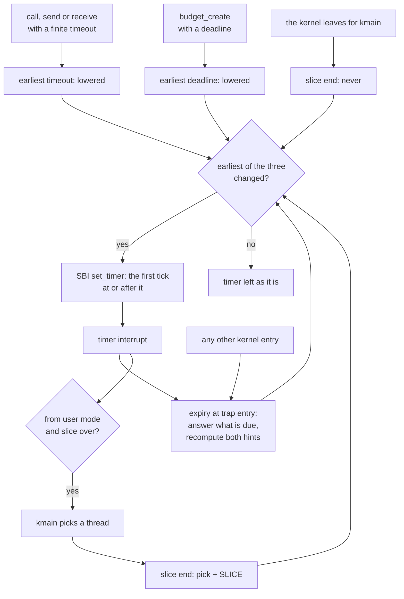

# Time and timeouts

The kernel owns the hart timer and keeps it armed for the earliest thing
due: the running thread's slice end, a blocking call's timeout or a budget's deadline. Time is
monotonic microseconds since the kernel started, read with `time_now`; user mode also reads the
raw counter with `rdtime`. Every blocking call takes a timeout, and a budget with a deadline is
destroyed when it passes. No process programs the timer, and the kernel keeps no date.

## Purpose

Time is how the kernel keeps its promises to waiting threads and to whoever grants a lease. A
caller must never block past its timeout because a server stalls or a spinner holds the CPU. A
lease must end when its deadline passes, whatever the budget inside it is doing. So the timer is
the kernel's alone, it is armed whenever anything is due, and every kernel entry answers what
has passed before it does anything else.

## Interface

### Time

Status: built · partly tested: that `time_now` counts from the kernel's start is not checked by a case · tested: bench:timeouts, bench:timeouts-tcg, host:redoubt-sys::every_result_and_error_round_trips

| Source | Unit | What it is |
| --- | --- | --- |
| `time_now` | microseconds | Monotonic time since the kernel started, rounded down. No arguments, no errors; the value comes back as one 64-bit result in two registers ([ABI](abi.md)). |
| `rdtime` | timebase ticks | The hardware `time` counter, read directly in user mode (the kernel sets `scounteren.TM`). It counts from reset, not from boot. On rv32 a program reads `rdtimeh`, `rdtime`, `rdtimeh` and retries until the high halves agree. |

`time_now` is the clock with a unit. `rdtime` is for fine relative timing: it costs no kernel
entry and resolves single ticks. No call returns the timebase frequency; a program that needs
ticks per microsecond measures `rdtime` against `time_now` over a sleep. Microseconds in a `u64`
last about 584,000 years, so the kernel never handles a wrap; every sum saturates instead.

The loader reads the frequency from the device tree (`/cpus/timebase-frequency`) and passes it
in the `Time` tag of the argument block ([boot](boot.md)). The kernel converts with it both
ways: ticks to microseconds rounding down, microseconds to ticks rounding up. So a timer set for
a time never fires before `time_now` reaches it.

### The hart timer

Status: built · partly tested: that a stale early hint costs one early interrupt and misses nothing is argued from the code, not attacked · tested: bench:timeouts, bench:budget-deadline, bench:sched-share, mutation:TimeoutIgnoredWhileOthersRun

The kernel keeps three times (`kernel/src/time.rs`) and arms the hardware for the earliest:
- the **slice end** of the running thread: set to the pick time plus `SLICE` (10,000 µs) when
  `kmain` picks a thread, and to never while `kmain` itself runs;
- the **earliest timeout** of any blocked thread;
- the **earliest deadline** of any budget.

The last two are hints, and a hint is only ever early. A blocking call or a new deadline lowers
it at once. A wait that ends another way, or a budget destroyed by hand, leaves it where it was.
A stale hint costs one early interrupt and one walk, which recomputes it; nothing is missed. The
kernel re-arms only when the earliest time changes, through the SBI TIME extension
(`kernel/src/arch/riscv/timer_sbi.rs`): one `ecall` to the firmware per arming. With nothing
due at all (the kernel idle, no timeouts, no deadlines) the timer is set to never.

While a user thread runs, its slice end is always pending. So the kernel is always entered
within one slice, whatever the thread does. The kernel itself runs with supervisor interrupts
off. A timer interrupt is taken from user mode, or while `kmain` sleeps in `wfi` with nothing
runnable; a time that passed while the kernel was busy is already pending, so `wfi` returns at
once.

*Figure: what arms the timer. Every arrow is built; nothing in user space reaches the timer.*

### Timeouts and `FOREVER`

Status: built · tested: bench:timeouts, bench:timeouts-tcg, bench:sched-wake-no-preempt, mutation:R12TimeoutWakePreempts

`call`, `send` and `receive` each take a **timeout**: relative microseconds from the moment the
call is made. The kernel adds it to the current time with saturation, so the deadline it
records never wraps. `FOREVER` (`u64::MAX`) never expires, and neither does any timeout large
enough to saturate. There is no maximum timeout and no minimum. A timeout of 0 is a poll: the
call delivers what it can at once and otherwise returns `Timeout` without blocking.

A **sleep** is `receive` with no handle: it can only time out. The Rust runtime's `sleep`
(`libs/rt/src/handle.rs`) is exactly that.

When a timeout passes, the blocked call returns `Timeout` with what it waited for unwound. A
queued `call` or `send` gets its buffer back. A `call` the server already took is abandoned: the
lend is consumed and the server gets one abandoned-call notice
([IPC](ipc.md#how-a-call-completes)). A `receive` on an endpoint or an interrupt simply ends.

A timeout **wakes**; it does not preempt. At the first kernel entry at or after the deadline
the kernel commits the `Timeout` result and makes the thread runnable. When it then runs is the
scheduler's choice under R12 (scheduling) ([scheduling](scheduling.md#r12-scheduling)): a
thread whose timeout falls mid-slice runs when that slice ends, or later.

### Budget deadlines

Status: built · partly tested: that a destroyed child's later deadline is dropped is seen only as the kernel surviving it · tested: bench:budget-deadline, bench:sched-latency, mutation:BudgetDeadlineIgnored

A budget's **deadline** is absolute microseconds since boot, set once by its creator in
`budget_create`; `FOREVER` means none. The field and what a lease is belong to
[budgets](budgets.md#deadlines); this section is how the timer fires it.

The kernel links every budget with a deadline into one list, so finding the next deadline never
scans every budget. When a deadline passes, the kernel destroys the budget and its subtree
exactly as `budget_destroy` does, with nobody asking ([R10 (destruction)](budgets.md#r10-destruction)):
every process in it is killed (an exit notice, where one is sent, blames nobody), its calls
are failed or abandoned, and every handle to it or stamped with it is revoked. A deadline already past at
`budget_create` destroys the budget at the next kernel entry, so the handle the caller receives
is dead by the time it can use it.

A child's own deadline may be later than its parent's. It never fires then: the parent's
destruction takes the child with it, and a destroyed budget leaves the list.

A deadline is a preemption point (R12). If a deadline fires at a kernel entry from user mode,
the entering thread gives up the CPU before its trap is handled. If its own process was
destroyed, nothing of it is left to handle. Otherwise its trap is taken again when it next
runs.

### Expiry

Status: built · partly tested: the order at an equal instant is attacked only in the model · tested: bench:budget-deadline, bench:timeouts, mutation:ExpireBudgetsFirst

**Expiry** answers everything due at or before the current time. It runs first at every kernel
entry except `kmain`'s switch to a thread, before anything reads the entering process. `kmain`
itself expires, then picks, then switches, with no kernel entry between. So a time that has
passed beats any operation that enters after it.

Expiry takes the earliest item first. At an equal instant, timeouts come before deadlines;
timeouts among themselves go in (pid, tid) order, and deadlines by budget id. The order
matters: a caller whose taken call times out at the instant its server's budget reaches its
deadline gets `Timeout` with its lend consumed, not `Dead` with it returned.

Finding what is due walks the threads of each process whose cached earliest timeout has come,
and the deadline list. Both walks are skipped while the hints are in the future. After expiry
the kernel recomputes both hints and re-arms.

### Wall-clock time and time sync

Status: planned · M5 (persist, install, share)

The kernel keeps no date: `time_now`, timeouts, slices and deadlines stay monotonic time
since boot. Wall-clock time (dates, time zones) is a user-space offset over
`time_now`. A server holds the offset and answers it on an endpoint. At boot it sets the offset
from the board's real-time clock, reached as a device object by its driver
([devices](devices.md)). While the box runs, it corrects the offset by an authenticated time
source reached through [`gatewayd`](../servers/gatewayd.md). Every date a server stamps (audit
records, file times, certificate checks) comes from this offset. A lease granted for a wall-clock span is turned into a deadline in
`time_now` units when it is granted, so a wrong or attacked wall clock can mislabel logs and
files but cannot lengthen a lease or a timeout.

**Open:** which server owns the offset (the steward, the RTC driver or a server of its own);
which authenticated source syncs it (NTS, Roughtime) and what happens with no network; whether
TLS certificate checks in `gatewayd` (M4 (self-hosted development)) need wall time earlier;
whether a correction may step the offset backwards or only slews it; how the offset persists
across reboots and how a clock set backwards is detected; how audit records bind monotonic and
wall time.

## Authority

Status: built · tested: bench:timeouts, bench:budget-deadline, bench:legacy-gone

- **Reading time needs no handle.** Every process may call `time_now` and read `rdtime`. Time
  is not a capability, because hiding it protects nothing (see Why).
- **Nothing in user space programs the timer.** There is no timer call, no timer device object
  and no timer interrupt a process can receive. Numbers outside the call table are refused
  ([ABI](abi.md)). A process affects the timer only by running (its slice), by its own
  timeouts and by the deadlines of budgets it creates.
- **A deadline is chosen once, by the creator.** `budget_create` takes it from whoever holds a
  handle to the parent budget. No call changes it later. The holder of a handle to the budget
  can end it sooner with `budget_destroy` ([budgets](budgets.md)).
- **A timeout is the caller's own.** It bounds only the calling thread's wait; no argument sets
  another thread's.

## Security properties

### I13 (every blocking call returns by its timeout), on the timer

Status: built · partly tested: timeouts on more than one hart are not attacked by a case · tested: bench:timeouts, bench:timeouts-tcg, bench:sched-latency, bench:sched-wake-no-preempt, mutation:TimeoutIgnoredWhileOthersRun

I13 is owned by [invariants](invariants.md#i13-every-blocking-call-returns-by-its-timeout); this
is how the timer keeps it. No thread stays blocked past its timeout. The timer is armed for the
earliest timeout whether or not another thread runs, and every kernel entry expires first. The
conversion rounds up, so no timeout ends early. `FOREVER` and saturated timeouts are the only
ones that never end. A reply racing a timeout lands on exactly one side: either the caller gets
the reply and the server `delivered`, or the caller gets `Timeout` and the server `discarded`
(R13 (one outcome per call), [IPC](ipc.md#r13-one-outcome-per-call)).

"Returns by" means the result is committed and the thread is runnable. It runs when R12 picks
it, and a wake never preempts; the bench measures that delay as a target, not a bound
([scheduling](scheduling.md)).

### R10 (destruction) at a deadline: a passed deadline comes first

Status: built · partly tested: a process entering the kernel in a tight loop to put its deadline off is not attacked by a case · tested: bench:budget-deadline, mutation:BudgetDeadlineIgnored

R10 is owned by [budgets](budgets.md#r10-destruction), which states the deadline path and the
equal-instant order; this is how the timer keeps it. A budget whose deadline has passed is
destroyed before any operation that enters the kernel at or after that instant, because
`expire_due` (`kernel/src/time.rs`) runs first at every kernel entry. Nothing defers expiry: no kernel state, no interrupt handling and no
call a process can make postpones it. A budget cannot outlive its deadline by spinning, because
its slice end brings the kernel back, nor by blocking, because the timer is armed for the
deadline itself. The only delay is the kernel work already in progress when the deadline passes.

### R12 (scheduling) for timer work

Status: built · partly tested: the kernel departs from this for a deadline's destruction, and floods of weight-0 deadline budgets past the 64 of the case are not attacked · tested: bench:sched-timer-flood

R12 is owned by [scheduling](scheduling.md#r12-scheduling); this is how its charging applies to
the timer's work. Each expired item's work is billed under it: a timeout to its thread's budget, a deadline's
whole destruction to the dying budget's parent, after its carve returns, or to the nearest
ancestor with free weight above 0 ([scheduling](scheduling.md#charging)). So is the walk that
found the item. A budget with many timeouts due at once pays one walk for each. The one walk per
entry that finds nothing more is the kernel's. So a process that arms many timers a microsecond
apart, or creates many budgets with staggered deadlines, spends its own CPU share, not a
neighbour's.

The kernel departs from this for a deadline: it bills the dying budget only up to the lift,
whose debt then moves to its parent, and the rest, all of it for a budget of free weight 0, to
nobody (Residual risks).

## Failure and restart

Status: built · partly tested: a boot with no `Time` tag is not attacked by a case · tested: bench:budget-deadline, bench:timeouts

- **No timebase, no boot.** If the argument block has no `Time` tag, or it is 0, the kernel stops
  at start and powers off, because no timeout, slice or deadline would mean anything
  (R17 (fail closed), [boot](boot.md#r17-fail-closed)).
- **A deadline hits the running process.** The budget is destroyed with the process that was
  interrupted killed last; the kernel then runs whatever is current and never resumes the dead
  thread.
- **A server holds a call past its caller's timeout.** The caller gets `Timeout` and its lend is
  consumed; the server keeps the call open until it replies (R3 (lends and abandoned calls),
  [IPC](ipc.md#r3-lends-and-abandoned-calls)).
- **A reboot resets time.** `time_now` starts again from 0. No timeout or deadline survives,
  because no thread or budget does.
- No timeout or deadline value, however large, can make the kernel panic: every sum
  saturates and every conversion is checked (I14 (no call panics the kernel)).

## Residual risks

- **A timeout is a wake, not a run.** I13 bounds when the result is committed, not when the
  thread runs. Under load a woken thread waits for R12's turn. The bench holds lateness to
  1,000 µs for an idle sleep and asserts wake targets under load only in virtual time
  (`bench:timeouts`, `bench:sched-latency`); `bench:timeouts-tcg` reports real-time lateness
  without judging it.
- **Kernel work is not interrupted.** The kernel runs with interrupts off, so a timeout or
  deadline that passes during a long kernel operation (a budget's destruction, a large range
  call) is answered when that operation ends. `bench:budget-deadline` bounds a deadline's
  lateness by the cost of the same destruction by hand plus 1,000 µs.
- **Every process has a perfect clock.** `rdtime` resolves single ticks and `time_now` single
  microseconds, and both are free to read. Anything a process can time, it learns. Timing and
  covert channels are out of scope ([TENETS](../TENETS.md#threat-model)).
- **The timebase is the platform's word.** The frequency comes from the device tree, which the
  bundle's signature does not cover ([boot](boot.md)). A wrong value scales every timeout, slice
  and deadline alike. Only the firmware and the emulator or board supply it, and they are TCB.
- **The firmware arms the timer.** The kernel does not check the result of the SBI `set_timer`
  call. A firmware that failed to arm it would stop slices, timeouts and deadlines. The firmware
  is TCB ([boot](boot.md)).
- **Expiry walks threads.** A walk is bounded by `MAX_PROCESS_COUNT` x `MAX_THREADS` (64 x 31,
  compile-time constants no process can change) plus the deadline list. Each walk that finds an
  item is billed to the item's budget; the last walk of each entry is paid by nobody.
- **Part of a deadline's destruction is billed to nobody**, all of it for a budget of free
  weight 0, so a creator of many empty weight-0 budgets with staggered deadlines has the machine
  spend time no budget pays for. The 64 deadlines of `bench:sched-timer-flood` leave a victim its
  share; larger floods are not attacked ([scheduling](scheduling.md#residual-risks)). Follow-up:
  [todo](../todo/deadline-destroy-billing.md).
- **Equal-instant order is argued, not attacked.** Timeouts before deadlines at one instant is
  checked by the model's mutation only; no bench case lands a timeout and a deadline on the same
  microsecond.
- **A destroyed child's later deadline** is shown dropped only by the kernel surviving past it:
  `bench:budget-deadline` cannot observe the deadline list directly.

## Why

- **The kernel owns the timer.** Timeouts and deadlines are promises the kernel makes; a timer
  server could be starved or killed and take every promise with it. So there is no timer server,
  no timer interrupt for user space and no call that programs the hardware.
- **Always armed for the earliest.** One target, the minimum of three, is the whole design. The
  slice end alone guarantees the kernel back within 10 ms of any user code, so expiry never
  depends on a thread choosing to enter.
- **Expire first, at every entry.** A deadline that passed must win over whatever the entering
  thread asks for; checking first makes that true at every entry without a special case per call.
- **Hints that are only ever early.** Lowering a hint is cheap and raising it would need a walk.
  An early hint costs one spare interrupt; a late one would break I13. So the kernel only lowers.
- **Relative timeouts, absolute deadlines.** A timeout is how long the caller will wait from the
  moment it asks, so it is relative and cannot be stale. A deadline is when a lease ends,
  whatever happens to its creator meanwhile, so it is absolute.
- **Microseconds in the interface, ticks inside.** Microseconds are the same on every board, so
  programs and the model need no frequency. Charging CPU time in ticks is the scheduler's
  business ([scheduling](scheduling.md)).
- **`rdtime` is open, and its frequency is not a call.** Hiding time protects nothing: an
  attacker can count loop iterations just as well ([TENETS](../TENETS.md#threat-model)).
  `time_now` is the clock with a unit, so the kernel keeps no second way to learn one.
- **SBI TIME, not Sstc.** It works under every SBI firmware on both widths with no firmware
  configuration (Sstc needs `menvcfg.STCE`), and one `ecall` per arming is nothing against a
  10 ms slice.
- **Timeouts first at an equal instant**, so a caller whose server's lease ends at its own timeout
  sees the timeout it asked for, with the lend accounting that goes with it.
- **No date in the kernel.** Wall-clock time comes from outside the box and can be wrong or
  attacked. Keeping it in user space means no kernel rule depends on it.
