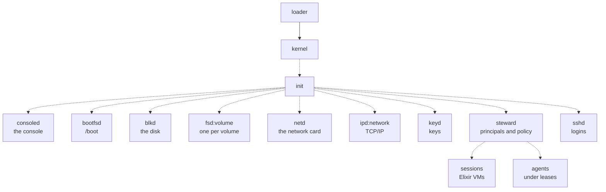
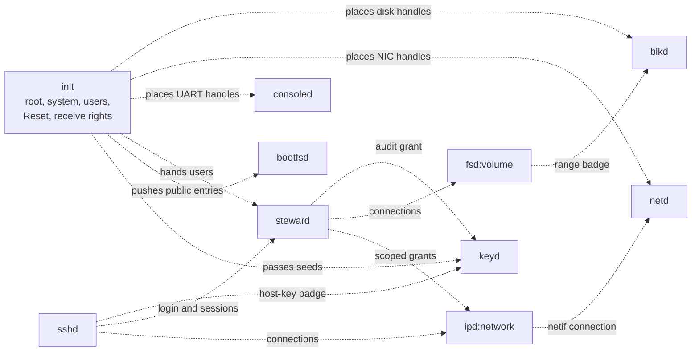
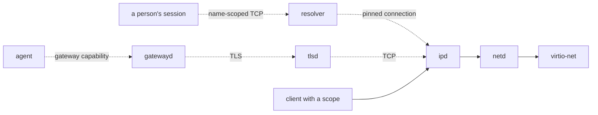

# The servers

Everything the kernel does not keep runs as an unprivileged server: drivers, file systems, the
network, keys, logins and policy. A server is a process that receives on an endpoint and answers
calls. It reaches hardware only through device handles, other servers only through endpoint
handles, and the kernel only through the system calls every process has. This page is the map:
who starts whom, which server is trusted with what, how servers apply labels, how a client gets a
connection of its own, what happens when a server crashes, and which capabilities each server
holds.

## Purpose

The kernel enforces labels only between `user`-class budgets
([R1 (flow)](../kernel/ipc.md#r1-flow)). The servers every principal shares run in the `system`
class, where the kernel does not check, so their code is where separation between principals is
kept or lost. A reader auditing Redoubt needs to know, for each server, what it holds, whom it
serves, and which rule stops one client reaching another's data through it. The pages below this
one take one server each; this page states what they share.

## The server graph

Status: planned · M1 (separation and containment)

The loader starts only the kernel and `init` ([boot](../kernel/boot.md)). `init` reads the boot
manifest and starts every system server from the bundle, through the loader stub
([init](init.md)). It then starts the steward, which holds the `users` budget and starts every
session and agent. Nothing else starts a server.

*Figure: who starts whom. Solid arrows are built; dashed are planned for
M1 (separation and containment).*

`init` starts the drivers and the servers that need no principal first (`consoled`, `bootfsd`,
`blkd`, each `fsd`, `netd`, each `ipd`, `keyd`), then the steward and `sshd`. It keeps each
server's receive right, so a restarted server receives on the same endpoint (Restarts and crash
blame, below). The servers planned for later milestones join the same graph:
the [resolver](resolver.md) and [`gatewayd`](gatewayd.md) in M4 (self-hosted development), and
the [package server](pkg.md) and the [supervisor](supervisor.md) in
M5 (persist, install, share).

**Open:** whether the supervisor of M5 (persist, install, share) takes over restarting from
`init` or runs beside it ([supervisor](supervisor.md)).

## Trust tiers

Status: planned · M1 (separation and containment)

| Tier | Members | Trusted for | A compromise reaches |
| --- | --- | --- | --- |
| TCB | firmware, loader, kernel; `blkd` and `netd` while there is no IOMMU | everything | the whole machine |
| Trusted system servers | `init`, the steward, `keyd`, `sshd` | crossing principals: logins, keys, approvals, launching | every principal |
| Shared servers | `consoled`, `bootfsd`, each `fsd`, each `ipd`; later the resolver and `gatewayd` | serving many principals and keeping them apart by badge and label | the principals that server serves |
| Per-principal code | sessions, agents, native programs | nothing beyond their own capabilities | that principal's own capabilities |

- **The DMA drivers are TCB.** A driver that holds a DMA-flagged device handle can point a bus
  master at any physical address ([devices](../kernel/devices.md#authority)). `blkd` and `netd`
  are small and parse only their own device's structures for that reason.
- **Every trusted system server is Rust.** Everything whose compromise could cross principals
  (the steward, `keyd`, `sshd`) is written in Rust and runs outside the Elixir VMs. The BEAM is
  userland: a compromised session VM holds exactly its principal's capabilities, like a native
  program.
- **A shared server is split by network or medium,** so one parser bug does not reach every
  principal: one `fsd` per volume, one `ipd` per network or trust domain.
- **Server work is paid by the server's weight,** not the caller's; no time is donated. Each
  shared server therefore bounds the work one request can cause and admits by caps
  ([scheduling](../kernel/scheduling.md#residual-risks), [serving](serving.md)).

**Open:** none.

## Labels

### The rule servers apply

Status: built · tested: host:redoubt-rt::matches_the_set_definition, host:redoubt-rt::properties, host:redoubt-rt::labels_are_checked_on_every_request, host:redoubt-rt::every_write_needs_equal_labels, host:redoubt-rt::labelled_metadata_does_not_flow_down, host:redoubt-rt::an_unlabelled_caller_cannot_reach_labelled_data_to_destroy_or_probe_it

Labels are information-flow labels on budgets and volumes. The kernel checks them between user
budgets; system servers check them themselves, on every request, using the label set the kernel
attaches to each message ([R14 (unforgeable sender)](../kernel/ipc.md#r14-unforgeable-sender)).
A system server applies one check, written once in the serving library
([R25 (the label check)](serving.md#r25-the-label-check)):
- **Read** an object only if the object's labels are a subset of the caller's: no read up.
- **Write** an object only if the two label sets are equal: no write down, and no blind write
  up. A write up could truncate or remove what the writer cannot read.
- **Metadata is a read.** A 9P qid and a `stat` are reads of their node: a walk into a node the
  caller cannot read is refused, and a directory listing leaves out the entries the caller cannot
  read. Otherwise every write in a vault would change what an unlabelled caller sees.

Label sets are compared as sets. Data enters a label only by being read down: a vault session
reads it from where it is. Nothing writes into a label from outside it.

The labels are the kernel's; the server trusts only them, never a label named in a request. Two
budgets with equal label sets are one trust domain: a handle passed between them crosses
nothing.

### Who checks, and sinks

Status: built · partly tested: only `ipd`'s refusal of labelled callers is attacked in a boot; the skeleton's checks are attacked in host tests · tested: bench:d3-net-attacks, host:redoubt-rt::labels_are_checked_on_every_request

- **Every 9P server** gets the check from the skeleton, against the labels its file server
  reports for each node ([serving](serving.md#the-9p-server-skeleton)).
- **A sink** is a server whose output leaves a principal or the machine. A sink is cleared for no
  label and refuses every labelled caller before it reads the request. `ipd` is one
  ([ipd](ipd.md)); in `d3-net-attacks` a labelled caller's connect reaches nothing on the
  network while its unlabelled twin's does.
- **User-level servers get no exemption.** A server in a `user` budget is under
  [R1](../kernel/ipc.md#r1-flow): a vault session cannot call an unlabelled user server. A
  service that must serve several label sets runs one instance per label set, or in the `system`
  class.
- **A receive right is never handed across label sets.** R1 compares a sender with the
  endpoint's owner, not with whichever process receives, so a badge-0 handle given to a budget
  with other labels would deliver messages nobody compared with it. A system server that does
  this is at fault, not the kernel.

### Labels on the running system

Status: planned · M1 (separation and containment)

The steward creates every labelled budget, after an approval, and a child inherits its parent's
labels ([budgets](../kernel/budgets.md#labels-on-budgets)). A volume has one label set, fixed by
the boot manifest or the steward and never read from the medium ([fsd](fsd.md)). The steward
mounts known-sensitive places (`~/.ssh`, credential directories) on the principal's labelled
volume, and keys belong in `keyd`, which uses them without releasing them. `sshd` is the one
sink cleared for a label, and only on the channel whose owner authenticated it
([sshd](sshd.md)); `gatewayd` is a sink cleared for nothing ([gatewayd](gatewayd.md)). Each shared server's
page states what its objects are and which label set each carries, so that nothing a labelled
caller influences is visible to a caller without that label: `fsd` keeps state per volume,
`sshd` per channel, and the steward applies the check to its own records.

**Open:** none.

## Connections

Status: built · partly tested: the rule runs in host tests against the runtime's fake kernel; no boot has a launcher hand a child a fresh connection · tested: host:redoubt-rt::a_launcher_gives_its_child_a_fresh_connection_and_disconnects_it, host:redoubt-rt::new_connection_is_rooted_below_the_callers_root, host:redoubt-rt::a_disconnect_frees_its_fids_and_every_connection_minted_under_it, host:redoubt-rt::a_strangers_id_is_refused_like_one_that_does_not_exist, host:redoubt-rt::copies_of_one_badge_in_other_accounts_or_label_sets_share_nothing, host:redoubt-rt::self_minting_does_not_multiply_the_share

A capability to a server is an endpoint handle whose **badge** names the grant: for a 9P server,
a connection with its own attach root and fid table. The pattern is one endpoint per service and
one badge per client ([objects](../kernel/objects.md#mint)).

- **One badge, one client.** Every copy of a handle carries the same badge, and the kernel gives a
  server no per-process identity, so every holder of a copy shares one connection. So **a
  launcher never passes its own connection to a child.** It asks the server for a fresh one with
  `new_connection` (9P servers) or `grant` (typed servers) and passes that. Otherwise a hostile
  agent started from Alice's shell could read, close or wipe her open files.
- **A second line of defence.** Servers key per-client state by badge, account and label set, so
  holders of one copied handle in different accounts or label sets never share fids.
- **Disconnect, not a kernel notice.** The kernel does not tell a server when a client's handles
  are gone. `new_connection` returns a random connection id with the handle; only the client that
  received the id can `disconnect(id)`, which frees that connection and everything minted under
  it. Anyone else, like an id that does not exist, gets the same `not_yours`.
- **The launcher cleans up.** A launcher disconnects a child's connections, and releases its
  grants from typed servers, when it receives the child's exit notice
  ([processes](../kernel/processes.md#exit-notices)). The steward does the same at logout and at
  a lease's end.

The serving library implements all of it once ([serving](serving.md#minted-connections)).

## Restarts and crash blame

Status: planned · M1 (separation and containment)

- **`init` restarts every server** that ends, on the same endpoint. Calls the server had taken
  get `Dead`, and clients retry; senders still queued wait and are served by the restarted server
  ([R4b (a server dies)](../kernel/ipc.md#r4b-a-server-dies)). A server keeps no state across a
  restart: what a badge meant lived in its memory. It draws its first minted badge at random, so
  its clients' old handles do not name its new grants
  ([R27 (badge allocation)](serving.md#r27-badge-allocation)).
- **More than five restarts of one server within 60 seconds** reboot the machine: fail closed
  ([init](init.md#restarts-and-reboots)).
- **Crash blame.** A server's exit notice blames the sender of the call it was working on
  ([R21 (crash blame)](../kernel/processes.md#r21-crash-blame)). `init` passes the blame to the
  steward, and three crashes blamed on one account and label set within ten minutes end every
  budget of that account and label set ([steward](steward.md)). A crash that blames nobody counts
  only toward the restart limit.
- **Session VMs are not restarted.** A dead session is a logout.

**Open:** none.

## Capability holdings

Status: planned · M1 (separation and containment)

| Server | Receives on | Holds | Never holds |
| --- | --- | --- | --- |
| `init` | the exit endpoint of every server | `root`, `system` and `users`; every device object and the Reset right; every server's receive right; the bundle's pages | network, user data, keys |
| steward | its own endpoint | `users`; a connection to each `fsd` and `ipd`; a `keyd` grant for the `audit` purpose | any key; a budget of a server |
| `keyd` | its own endpoint | the keys the manifest names | a key a person logs in or approves with; the bundle key |
| `sshd` | its own endpoint | the network through `ipd`; a `keyd` badge for the host key; the steward's endpoint | any login key |
| `consoled` | its own endpoint | the UART's MMIO and IRQ handles | anything else |
| `bootfsd` | its own endpoint | the public bundle entries, pushed by `init` | the bundle itself |
| `blkd` | its own endpoint | the disk's MMIO (DMA) and IRQ handles | anything else |
| `fsd:volume` | its own endpoint | a `blkd` range for its volume | another volume |
| `netd` | its own endpoint | the network card's MMIO (DMA) and IRQ handles | anything else |
| `ipd:network` | its own endpoint | a `netd` connection | a budget; a labelled caller's request |

No server's startup block carries a budget handle. A manifest that gives a server one is refused,
because a budget handle is a destroy right and a create right: a compromised `ipd` holding its
budget could create `system`-class children with any labels and any account. A server that must
revoke a grant on its own is given a **revocation scope**, a budget with zero limits used only to
be destroyed ([init](init.md), [steward](steward.md)).

*Figure: the capabilities each server holds. An edge from `init` is a handle it places; any other
edge runs from a holder to the server its handle reaches. All are planned for
M1 (separation and containment).*

**Open:** whether `init` keeps a copy of each device handle it places, so it can restart a driver,
and so stays a co-holder ([devices](../kernel/devices.md#which-process-gets-which-device)).

## The network path

### `netd` and `ipd`

Status: built · tested: bench:d3-net-tcp, bench:d3-net-attacks

`netd`, the network card's driver, moves Ethernet frames between the card and one client, `ipd`.
`ipd`, the TCP/IP server, serves the `/net` tree to its callers, each scoped to the prefixes and
ports its badge allows ([ipd](ipd.md), [netd](netd.md)). A test program in the first program's
place launches the real `netd` and `ipd` through the loader stub and starts the cases' clients:
`d3-net-tcp` carries TCP both ways through them, and `d3-net-attacks` shows a scope's refusals
from the bench's own network peers.

*Figure: the network path. Solid is built; dashed is planned: the resolver and `gatewayd`
for M4 (self-hosted development), `tlsd` beyond M5.*

### The path for people and agents

Status: planned · M4 (self-hosted development)

Agents never get sockets. An agent holds gateway capabilities to `gatewayd`, which makes the
request itself, over TLS, to one allowed service, checks it and logs it
([gatewayd](gatewayd.md)). Only people get TCP, and only by name: the resolver answers only the
names in the caller's allowlist, and a connection is made by name and pinned to what the name
resolved to ([resolver](resolver.md)). The host's and the cloud metadata addresses, the box's
own services from inside, and inbound traffic other than SSH are always refused.

**Open:** whether TLS for `gatewayd` runs in a separate `tlsd` in M4 (self-hosted development) or
inside `gatewayd` until the web stack needs `tlsd` beyond M5.

## Residual risks

- **System servers are trusted to check labels.** The kernel does not check a flow into or out of
  a `system` budget ([R1](../kernel/ipc.md#r1-flow)). A shared server that mixes two label sets'
  data breaks label separation, and nothing below it can see that.
- **A dead launcher leaks its children's connections.** A launcher that dies without
  disconnecting leaves its children's connections in each server until its own connection is
  freed; the leak counts against its own account and label set
  ([serving](serving.md#residual-risks)).
- **Server work is paid by the server's weight.** A client that floods a shared server takes that
  server's share of the CPU from its other callers, never more
  ([scheduling](../kernel/scheduling.md#residual-risks)).
- **The DMA drivers are TCB** while there is no IOMMU ([devices](../kernel/devices.md#residual-risks)).
- **Until `init` places them, servers run only under test launchers.** Their rules hold where a
  test launches them; the planned sections above are what the running system adds.

## Why

- **Servers, not kernel code.** A driver, a file system or a TCP stack in the kernel would put
  its parser in the TCB. As a server it holds only its handles, and a bug in it reaches only what
  those handles reach.
- **One endpoint per service, one badge per client.** Endpoints cost their owner a page each and
  are not reclaimed until the owner budget goes ([objects](../kernel/objects.md#residual-risks));
  badges cost nothing and carry the grant.
- **Servers keep no authority across a restart.** A server that saved what its badges meant could
  be made to write itself a root badge. Endpoints outlive servers, so clients keep their handles;
  the grants behind them are re-made by whoever made them.
- **Sinks refuse labels.** Whatever enters a sink can leave the machine, so a sink cleared for a
  label would be a declassification nobody approved.
