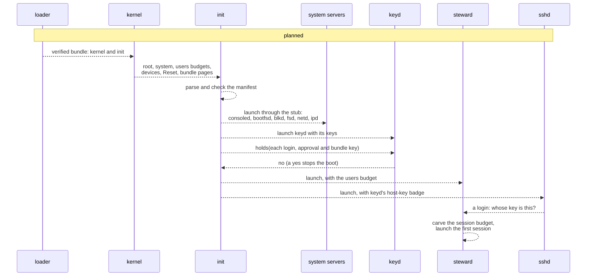

# Init

`init` is the first process. It reads the boot manifest from the signed bundle, starts every
system server from the bundle's pages through the loader stub, gives each its handles, names and
arguments in a startup block, and restarts a server that exits. It holds the boot budgets and
every device, and it has no network and no user data. The startup block and the loader stub
every launcher uses are described here as well.

## Purpose

Something must turn the kernel's handful of boot handles into a running system, and it must do
so from one signed, checked description rather than from code that decides as it goes. `init`
is that step: the manifest says what runs, with which devices, volumes, labels, weights and
arguments, and `init` refuses a manifest that breaks a rule before anything runs. It parses only
that one file and no ELF, so the most privileged process after the kernel has the smallest input.

## Interface

### The boot manifest

Status: planned · M1 (separation and containment)

The boot manifest is one strict JSON file ([wire](wire.md#strict-json)) in the signed bundle,
and `init`'s only input. Its entries:

| Entry | Holds |
| --- | --- |
| `system` | the `system` budget's pages, processes and weight |
| `devices` | each device's name, its device-tree node path, and whether it may do DMA |
| `labels` | each label's name, owner principal and 64-bit id |
| `volumes` | each volume's name, `blkd` partition and label set |
| `servers` | each server's name, program (a bundle entry), budget (pages, processes, weight), device names, volume, the endpoints it receives on, the endpoints it is handed, and arguments |
| `public` | the bundle entries `bootfsd` serves at `/boot`, by exact name |
| `principals` | each principal's name, SSH public keys for login and approval, budget, account, owned labels, the label sets it works under (each with a fixed sub-budget: pages, processes, weight), home (volume and path), and network scope (IP prefixes and ports) |
| `confined` | optional; a boolean at the top level ([confinement](#the-confinement-check)) |

- **Types.** Each field has one JSON type. A 64-bit quantity (a label id, an account, a size in
  pages or bytes, a deadline) is a decimal string; a small count (processes, a weight, a depth, a
  restart limit, a port) is a number. A wrong type, an unknown member or a repeated one is an
  error, and an error refuses the boot.
- **Names.** Every name (device, label, volume, server, endpoint, principal) is 1 to 64 bytes of
  `[a-z0-9_:+-]`, starting with a letter (`fsd:data`, `alice+secrets`), compared byte for byte.
  Names become endpoint names, volume names and 9P paths, so no empty name, NUL, U+FEFF or control
  character may reach them. The startup block applies the same rule (`valid_name`).
- **One entry per device.** A `devices` entry names one device-tree node, and `init` hands that
  node's objects together to the one server that holds the entry: `NAME` for the register region
  and `NAME-irq` for the interrupt, whichever exist. Two entries for one device would let a
  manifest split it between two holders, and the interrupt's holder could then mask the other's
  device and time its activity. A device name is at most 60 bytes and may not end in `-irq`, so
  `NAME-irq` never collides and fits the name rule. `consoled` departs from it: it takes
  `uart:irq` ([todo](../todo/consoled-irq-name.md)).
- **No server gets a budget handle.** A `servers` entry names the budget `init` creates for the
  server, never a handle to one; a manifest that grants a server a budget handle is refused
  ([R33 (no server holds a system budget)](#r33-no-server-holds-a-system-budget)).
- **Arguments** are opaque strings. `init` passes them unchanged and in order as the startup
  block's `argv` and never interprets them; each server's page defines its own (`keyd`'s keys,
  `ipd`'s addresses and bucket count). `init` checks only that each is UTF-8 with no NUL, and that
  together they leave the startup block inside its page.
- **Sizing.** Every shared server takes `buckets=N` as an argument, parsed once in the serving
  library; none has a compiled-in count. `init` refuses the boot unless N is at least the number
  of distinct (account, label set)s the manifest routes to that server, plus its system callers.
  So a server's bucket count never binds in normal use, and a full server cannot tell a latecomer
  that others hold state ([serving](serving.md#residual-risks)). `bootfsd`, `consoled` and `keyd`
  depart from it: they compile their counts in ([todo](../todo/server-bucket-counts.md)).
- **Weights.** One stride queue serves every budget ([scheduling](../kernel/scheduling.md)), so
  the manifest's weights are the whole scheduling policy. `init`, the steward and the drivers
  (`consoled`, `blkd`, `netd`) get weights an order of magnitude above a session's (1000 against
  a principal's 100), so they are served promptly without running ahead of the queue; the servers
  that work for principals (`bootfsd`, `fsd`, `ipd`, `keyd`, `sshd`) get ordinary weights and
  bound the work of one request. The weights carve the `system` budget like every other limit.
- **What `/boot` shows.** `bootfsd` serves exactly the entries `public` names, matched byte for
  byte, as one flat read-only directory. `init` pushes their bytes to `bootfsd` itself
  ([bootfsd](bootfsd.md)), and refuses a `public` list that names an entry the bundle does not
  hold, or the manifest. **The manifest is never public:** it holds `keyd`'s seeds and every
  principal's account and keys.

```json
{ "servers": [ { "name": "fsd:data", "program": "fsd", "volume": "data",
                 "budget": { "pages": "4096", "processes": 1, "weight": 100 },
                 "receives": ["fsd:data"], "handed": ["blkd"] } ],
  "principals": [ { "name": "alice", "account": "1001", "labels": ["alice-secrets"],
                    "ssh_keys": ["ssh-ed25519 AAAA..."], "home": "data:/home/alice",
                    "net": [ { "prefix": "0.0.0.0/0", "ports": [22, 443] } ] } ] }
```
*A fragment: one file server and one principal.*

The attack tests: a manifest that splits a device between two entries, or names a device ending
in `-irq`, is refused; a manifest giving a server fewer buckets than it serves refuses the boot.

**Open:** none. Sizing a server when principals are added at run time is the steward's, in
M5 (persist, install, share).

### The confinement check

Status: planned · M1 (separation and containment)

A manifest may set `confined`, a deployment profile for the whole boot, never per domain. Set, it
makes `init` **refuse the boot** whenever two entries with differing label sets share any of:

- a **server instance**: one `servers` entry serving both;
- a **volume**: one `volumes` entry both attach;
- an **endpoint**: one name in a `servers` entry's receives or handed list both hold;
- a **network instance**: one `ipd` or `netd` both use (a labelled domain gets no `/net` at all);
- a **device object**: one `devices` entry both hold, since a shared disk or NIC is a shared
  scheduler, cache and timing surface;
- a **core**: a hardware core both budgets run on; a confined manifest naming fewer cores than
  budget groups is refused rather than time-sharing a core between two label sets.

The label set compared is a budget's labels (a server's `labels`, a principal's label sets) and,
for a volume, its `volumes` entry's label set. Two sets differ when they are not equal: `{a}`
differs from `{}`, from `{b}` and from `{a,b}`. A system server such as the steward carries no
labels, so it is a domain of its own. A confined manifest in which a labelled domain reads a
shared unlabelled volume is refused too; data enters such a domain by an audited push from the
steward ([steward](steward.md)). The refusal is a boot failure, not a warning
([R34 (confined placement)](#r34-confined-placement)).

**The one named exception** is the control plane: the steward and `sshd` may reach across label
sets, and only by three kinds of edge: the request and owner-approval path; per-item reader and
writer budgets, each carrying exactly one label set and dying after one item (declassification and
push); and lease-ending supervision. No shared data server, device or core is exempt. `init`
checks the declared graph at boot, and the steward enforces the same rule for the budgets and
grants it creates later.

It is a check on the manifest, not a run-time invariant: a capability handed over after boot (by
`mint`, by a `grant`, by a system server) is outside it, and a system server that hands one
across label sets is at fault, not the kernel. Without `confined`, a shared server is ordinary
multi-tenancy and the serving library's residual risks apply.

**Open:** none.

### Starting the servers

Status: planned · M1 (separation and containment)

The kernel gives `init` the `root`, `system` and `users` budgets, every device object, the Reset
right, and the bundle's pages, read-only ([boot](../kernel/boot.md)). `init` then:

1. parses and checks the manifest, refusing the boot on any error;
2. creates the `system` budget's children and starts the drivers and the servers below the
   steward: `consoled`, `bootfsd`, `blkd`, `fsd` (one per volume), `netd`, `ipd`, `keyd`, each
   through the loader stub straight from the bundle's pages, so no file server is needed to start
   anything;
3. pushes the `public` entries to `bootfsd`;
4. runs the [key-separation check](#the-key-separation-check) against `keyd`;
5. starts the steward, handing it the `users` budget, and `sshd`.

`init` holds every device and places each driver's handles, by name, in that driver's startup
block (R33).


*Figure: the boot from the loader to the first session. All of it is planned.*

**Open:** how the bundle's pages reach `init` and who pays for them (open on
[boot](../kernel/boot.md)).

### The key-separation check

Status: planned · M1 (separation and containment)

`init` refuses a manifest that hands `keyd` a key the box is authenticated by: a key listed both
as a principal's login or approval key and as a `keyd` key, or the key the loader verifies the
boot bundle with, which `init` carries as the same compiled-in constant. `keyd` cannot see either
itself: it is given seeds and purposes, not what the rest of the system does with the public keys.
`init` holds no cryptography, so once `keyd` is started and before anything else runs, it asks
`keyd` `holds(public key)` for each such key ([keyd](keyd.md)), and a yes stops the boot
([R35 (key separation)](#r35-key-separation)).

**Open:** none.

### The startup block

Status: built · partly tested: the parser's host tests and fuzz target run in no bench case; in a boot, only the blocks the net rig and `stub-launch` write are parsed · tested: host:redoubt-rt::round_trip, host:redoubt-rt::the_page_is_the_wire_message, host:redoubt-rt::image_round_trips_and_is_validated, host:redoubt-rt::resolve_takes_the_longest_prefix, host:redoubt-rt::handle_names_follow_the_manifest_rule, host:redoubt-rt::hostile_blocks_are_refused, host:redoubt-rt::fields_hold_whole_entries, host:redoubt-rt::handle_counts_are_what_process_start_can_install, host:redoubt-rt::random_bytes_never_panic, fuzz:redoubt-rt/startup, bench:stub-launch, bench:d3-net-tcp

A launcher gives each child one read-only page, the **startup block**, naming the handles it
installed in the child's slots 1 to n (`process_start`,
[processes](../kernel/processes.md#creating-and-starting)). `process_start`'s argument register
carries the page's address; there is no fixed address. The runtime (`libs/rt/src/startup.rs`)
parses it before the program's `main` runs, and a program started with no block (address 0) gets
an empty one.

The page holds the block's length as a little-endian `u32`, then one typed message, `startup`,
laid out as a typed operation written into a file: its opcode as a `u32`, then the buffer-shape
encoding of its fields ([wire](wire.md#the-message-convention)). The rest of the page is not read.

| Field | Holds |
| --- | --- |
| `version` | 1 |
| `handle_count` | n, the handles `process_start` installed, at most `MAX_START_HANDLES` (64) |
| `namespace` | entries `handle: u32`, `path: string`: where a handle is bound, a clean absolute path (`/`, `/dev/cons`) |
| `handles` | entries `handle: u32`, `name: string`: a named handle, the name under the manifest's rule |
| `argv` | `string`s, the arguments in order (each may be empty) |
| `image_addr`, `image_len` | where the program's ELF image sits in the child and its exact length, for the loader stub; both 0 for none |

**Checked whole.** The parent may be hostile, so the parser bounds everything and checks
everything before handing the block to the program: every handle is in 1 to n, paths are unique
and clean, names are unique and valid, each `bytes` field holds whole entries and nothing else,
`image_addr` is 0 exactly when `image_len` is, is page-aligned, and does not overflow with its
length, and the block fits its page. A block breaking any rule is refused whole, and the process
exits with code 102 before `main` runs ([R31 (startup block checked whole)](#r31-startup-block-checked-whole)).

**Using it.** `resolve(path)` finds the namespace entry with the longest matching prefix and the
rest of the path; `handle(name)` finds a named handle; `args` gives the arguments. The runtime
notes the handle bound at `/dev/cons` for its panic report. `StartupBuilder` writes a block for a
launcher, and its `finish` runs the parser on the result, so a launcher can only write blocks a
child accepts.

The table: [libs/wire/tables/startup.md](../../libs/wire/tables/startup.md).

{{#include ../../libs/wire/tables/startup.md:tables}}

### Launching through the loader stub

Status: built · partly tested: the stub's host tests run in no bench case (`bench:stub-launch` attacks the stub in a boot on both widths) · tested: bench:stub-launch, fuzz:stub/plan, host:stub::plan_maps_a_well_formed_segment, host:stub::plan_refuses_a_segment_reaching_outside_the_image, host:stub::plan_refuses_a_segment_overlapping_an_excluded_range, host:stub::plan_refuses_writable_and_executable, host:stub::plan_refuses_writable_without_readable, host:stub::plan_refuses_a_non_riscv_machine, host:stub::plan_refuses_an_entry_outside_any_executable_segment, host:stub::plan_refuses_two_segments_that_overlap_each_other, host:stub::plan_refuses_a_misaligned_p_align, host:stub::plan_refuses_more_than_max_phnum_segments, host:stub::plan_refuses_a_segment_touching_page_zero, host:stub::plan_refuses_a_segment_reaching_into_the_stub_region, host:stub::plan_refuses_a_non_exec_type, host:stub::image_in_bounds_refuses_an_image_overlapping_the_stub, host:stub::image_in_bounds_refuses_an_image_overlapping_the_startup_page, host:stub::read_image_refuses_a_short_page, host:stub::read_image_refuses_an_image_len_over_the_cap

Every process after `init` starts the same way, and no launcher parses an ELF: the **loader
stub** (`stub/`), a small flat binary mapped into the new process, does it there, where a hostile
image can hurt only the process it was going to become.

1. The launcher creates the child's budget and process (`process_create`) with an exit endpoint.
2. It maps into the child, with `process_map`: the stub, read-only and executable, at
   `STUB_ENTRY` (`0x1FF0_0000`); a copy of the program's ELF image, read-write; the stack; and
   the startup block, read-only, naming the image with `image_addr` and `image_len`. Where each
   goes is on [memory layout](../kernel/memory-layout.md#launcher-placement).
3. It starts the child's first thread at `STUB_ENTRY`, with the startup block's address as the
   argument, installing the child's handles.
4. The stub reads `image_addr` and `image_len` from the block, checks that the image lies clear
   of the stub and the startup page and is at most `MAX_IMAGE_LEN`, and plans every `PT_LOAD`
   segment before mapping any (`stub::plan`, pure and allocation-free).
5. It maps each segment at its link address with `map_fixed`, copies its bytes in, sets its final
   permissions, unmaps the image copy, and jumps to the ELF's entry with the startup block's
   address in `a0`. From then on the process is the program.

**What the stub refuses,** whole, before mapping anything: an ELF that does not parse, is not
`ET_EXEC`, is not RISC-V of the stub's own width, or has more than 64 program headers; a segment
whose bytes reach outside the image, whose pages touch page 0, reach past `STUB_ENTRY`, or
overlap the image, the startup block, the stub or another segment; a segment both writable and
executable, or writable without readable; a `p_align` that is not a power of two or disagrees
with the segment's offset; an entry outside every executable segment. The stub holds no writable
data and depends only on `redoubt-sys` and `redoubt-wire`.

**Exit codes.** The stub exits with 110 for a startup block that is missing, does not parse or
names no image; 111 for a hostile image, including a segment the kernel refuses to map (one over
the stack); 112 when `map_fixed` is out of memory in the child's budget; and 101 if it panics.
After the jump, the exit code is the program's.

The bench's launcher, `stub-launch`, and the net rig (`tests/net/src/rig.rs`, which stands in for
`init` to launch the real `netd` and `ipd`) both launch this way
([R32 (a hostile image hurts only its process)](#r32-a-hostile-image-hurts-only-its-process)).

### Fresh connections per child

Status: planned · M1 (separation and containment)

A launcher never passes its own connection to a child. Every handle in a child's namespace is a
fresh connection the server made for that child with `new_connection`
([wire](wire.md#ninep_common)), rooted where the child's view of that server begins, and the
launcher disconnects it when the child exits ([releasing grants](wire.md#a-launcher-releases-its-childs-grants)).
A copied connection would share the launcher's fids and admission with the child, and the
launcher could not free the child's state without losing its own.

**Open:** none.

### Restarts and reboots

Status: planned · M1 (separation and containment)

- **Restart.** A server that exits is restarted on the same endpoint. Calls it had taken get
  `Dead` ([R4b (a server dies)](../kernel/ipc.md#r4b-a-server-dies)), and clients see the error
  and retry; senders still waiting on the endpoint are served by the restarted server. The new
  instance gets the same manifest name, arguments and receive endpoint, but a new startup block:
  `init`, as its launcher, disconnects the dead instance's connections at every server
  ([releasing grants](wire.md#a-launcher-releases-its-childs-grants)) and mints new ones. The
  server's own tables start empty, with a newly drawn first badge
  ([R27 (badge allocation)](serving.md#r27-badge-allocation)), so a client's old connection ids
  are dead.
- **Blame.** Each exit notice for a fault names the account and label set of the call the faulting
  thread was serving ([R21 (crash blame)](../kernel/processes.md#r21-crash-blame)). `init` passes
  them to the steward in one typed call, `blame(account, labels, server)`, in the steward's table,
  where `server` is the faulting server's manifest name for the audit record; the steward's rule
  counts by (account, label set) only ([steward](steward.md#crash-blame)).
- **Only `init` can blame.** The steward accepts `blame` only through a root badge it gives `init`
  alone: anyone who could send it could have another principal's sessions ended by forging three
  crashes.
- **A wedged steward cannot stall restarts.** `init` restarts the server first, then blames, with a
  timeout; a blame lost to the timeout is reported on the console.
- **Reboot.** More than 5 restarts of one server within 60 seconds, not stopped by blame, reboots
  the machine: failing closed beats a server that cannot stay up.
- **The steward** is part of the trusted base; its crash is a bug. If it dies, `init` destroys and
  recreates the `users` budget, which logs every session out, and starts it again.

```mermaid
stateDiagram-v2
    [*] --> Running: launched through the stub
    Running --> Exited: exit or fault
    Exited --> Blamed: fault notice names<br/>(account, label set)
    Blamed --> Running: steward told;<br/>restarted on the same endpoint
    Exited --> Running: clean exit;<br/>restarted on the same endpoint
    Exited --> Reboot: more than 5 restarts<br/>in 60 seconds
    Reboot --> [*]
```


*Figure: a system server's restarts. All of it is planned.*

The attack tests: `blame` from any badge but `init`'s is refused; a restarted server's old
connection ids are dead.

**Open:** none.

### A worked configuration

Status: planned · M1 (separation and containment)

Alice and Bob each log in over SSH; Alice has a vault label `alice-secrets` and an agent,
`alice/researcher`, on a two-hour lease.

```
kernel
└── init                                              root
    ├── consoled bootfsd blkd fsd:data fsd:alice-secrets  system
    │   netd ipd:lan keyd steward sshd
    ├── session alice-1                               users/alice/{}/session-1
    ├── agent alice/researcher [lease 2 h]            users/alice/{}/researcher
    ├── vault session alice+secrets-1                 users/alice/{alice-secrets}/session-1
    └── session bob-1                                 users/bob/{}/session-1
```
*Figure: the budget tree. `{}` and `{alice-secrets}` are the fixed sub-budgets, one per label set.*

| Name | Alice's session | Bob's session | Enforced by |
| --- | --- | --- | --- |
| `/` | `fsd:data` at `/home/alice`, read-write | `fsd:data` at `/home/bob`, read-write | `fsd` (badge) |
| `/dev/cons` | her SSH channel | his | `sshd` (badge, channel labels) |
| `/net` | `ipd:lan`, connect out to ports 22 and 443, not the box's own addresses | `ipd:lan`, connect out to 443 | `ipd` (badge) |
| `powerbox`, `budget` | hers | his | the steward, the kernel |

- Weights: Alice 100, Bob 100; the agent 20, carved from Alice's, sharing her account. `init`,
  the steward and the drivers are 1000 each in the same queue.
- The vault session reads and writes `fsd:alice-secrets`, reads (never writes) her home on the
  unlabelled `fsd:data`, which is how data enters the vault, has no `/net`, and prints only to its
  own channel.
- The agent has its own principal, `/work` only and no `/net`; its escalations wait for Alice's
  approval, and the lease's end destroys its budget and everything it passed on.
- No session or lease holds a `keyd` grant: `keyd`'s purposes are the host key and audit signing.
- Bob crashing `fsd:data` three times is blamed on his account each time: his sessions end and he
  is locked out for a while; Alice is not affected.

**Open:** none.

## Authority

Status: planned · M1 (separation and containment)

- `init` holds the `root`, `system` and `users` budgets, every device object, the Reset right and
  the bundle's pages. It gives each driver only its own device objects, each server only the
  endpoints the manifest names, and the steward the `users` budget.
- It holds no keys and no cryptography, and parses no ELF: launching goes through the loader stub,
  inside the child.
- It has no network and no user data, and after boot it receives only exit notices.
- The loader stub holds nothing but what the child holds: it runs as the child, in the child's
  budget, with the child's handles.

**Open:** none.

## Security properties

### R31 (startup block checked whole)

Status: built · partly tested: the parser's tests run in no bench case · tested: host:redoubt-rt::hostile_blocks_are_refused, host:redoubt-rt::fields_hold_whole_entries, host:redoubt-rt::handle_names_follow_the_manifest_rule, host:redoubt-rt::image_round_trips_and_is_validated, host:redoubt-rt::handle_counts_are_what_process_start_can_install, host:redoubt-rt::random_bytes_never_panic, fuzz:redoubt-rt/startup

A program runs only with a startup block that passed every rule: handles within what
`process_start` installed, clean unique paths, unique names under the manifest's rule, whole
entries, a well-formed image range. A block breaking one is refused whole and the process exits
before `main`, so a hostile or buggy parent cannot hand its child a namespace the program would
read two ways, or a name no rule allows.

### R32 (a hostile image hurts only its process)

Status: built · tested: bench:stub-launch, fuzz:stub/plan, host:stub::plan_refuses_a_segment_overlapping_an_excluded_range, host:stub::plan_refuses_writable_and_executable, host:stub::plan_refuses_two_segments_that_overlap_each_other, host:stub::plan_refuses_a_segment_touching_page_zero, host:stub::plan_refuses_a_segment_reaching_into_the_stub_region, host:stub::image_in_bounds_refuses_an_image_overlapping_the_stub, host:stub::read_image_refuses_an_image_len_over_the_cap

No launcher parses an ELF. The loader stub, running as the child, refuses an image whose segments
overlap each other, the image, the stub, the startup block or page 0, reach past the link range,
or ask to be writable and executable, before it maps anything; a segment the kernel refuses (one
over the stack) makes the child exit too. So a hostile image can at most exit or fault the process
it was going to become. `stub-launch` launches hostile images on both widths and checks that each
only exits or faults the child, that the parent's budget returns to the same usage after each,
and that a well-formed child still runs afterwards.

### R33 (no server holds a system budget)

Status: planned · M1 (separation and containment)

Only `init` and the steward ever hold a handle to a `system`-class budget. A server's startup
block carries no budget handle, and `init` refuses a manifest that grants one. A compromised
server holding its budget could create `system`-class children with any labels and any account,
and so forge admission keys and crash blame at every other server. The attack test starts a
server from a manifest that grants it a budget and expects the boot refused.

**Open:** none.

### R34 (confined placement)

Status: planned · M1 (separation and containment)

With `confined` set, no two entries with differing label sets share a server instance, volume,
endpoint, network instance, device object or core, and no labelled domain reads a shared
unlabelled volume; a manifest that would place them so fails the boot. The one exception is the
control plane: the steward and `sshd`, by the request and owner-approval path, per-item single-label
reader and writer budgets, and lease-ending supervision only. The attack verdict is the boot
failing, not the manifest's claim.

**Open:** none.

### R35 (key separation)

Status: planned · M1 (separation and containment)

`keyd` never holds a key that authenticates anyone to the box: not a principal's login or
approval key, and not the key the loader verifies the bundle with. `init` asks `keyd` about each
before anything else runs, and a yes stops the boot. So the boot root and a key some badge may
sign with are never one key, and no badge at `keyd` can sign a login.

**Open:** none.

## Failure and restart

Status: built · partly tested: the runtime's exit on a refused block is read from the code, not attacked · tested: bench:stub-launch, host:redoubt-rt::hostile_blocks_are_refused

- **A child's startup block is refused:** the runtime exits with 102 before `main`; the stub
  exits with 110 if it cannot find the image.
- **A child's image is refused or does not fit:** the stub exits with 111 or 112, and only the
  child is affected; its launcher sees the exit notice and the child's budget returns what it held.
- What `init` does when a server exits is under [restarts and reboots](#restarts-and-reboots).

## Residual risks

- **The manifest is a secret held in the bundle.** It carries `keyd`'s seeds, so whoever can read
  the bundle image holds the box's private keys; the bundle is signed, never encrypted, and what
  keeps the seeds off `/boot` is that the manifest is never public. Sealing the keys to the
  machine is [keyd](keyd.md)'s.
- **A confined boot is checked once.** Capabilities handed over after boot are outside the check;
  a system server that hands one across label sets breaks confinement without the kernel noticing.
- **Every child pays for a copy of its image.** There is no shared text: a launcher copies the ELF
  into pages charged to the child, and the stub copies each segment again. A read-only image cache
  shared between principals would be a cross-principal timing surface, and is set aside with the
  shared content store, beyond M5 (persist, install, share).
- **A blame can be lost.** If the steward does not take `init`'s blame within its timeout, the
  crash is reported on the console but counts toward no lockout.
- **The mediators are trusted across labels.** The steward and `sshd` are the confinement check's
  one exception; a bug in either reaches every label set they serve.
- **The stub cannot see the stack.** A segment that names the stack's pages is refused by
  `map_fixed`, but nothing checks for a gap between a segment and the stack
  ([memory layout](../kernel/memory-layout.md#residual-risks)).
- **The startup block and stub host tests are not in the bench.** Follow-up:
  [todo](../todo/host-tests-in-bench.md).
- **A restart loop reboots the machine.** A client that can crash a server repeatedly without
  being blamed (a bug the blame rule does not reach) can reboot the box.

## Why

- **One signed manifest.** A boot decided by code is reviewed by reading code; one checked file
  is reviewed by reading the file, and a rule it breaks stops the boot before anything runs.
- **The stub, not the launcher, parses ELF.** An ELF parser is a large surface on hostile input.
  Run inside the child, a bug in it compromises only the process being made, never `init` or the
  steward, which launch everything.
- **The startup block as one typed message.** A second framing format would need its own parser
  and fuzzing; the typed-message codec is already both. The parent writes both sides, so checksums
  would protect nothing.
- **Strings for 64-bit numbers in the manifest.** Every JSON tool agrees on integers up to 2^53;
  an account or a page count written as a string is read the same way by every tool.
- **A fresh connection per child.** A launcher that could not free a child's state without freeing
  its own would leak every dead child's fids for its own lifetime.
- **Reboot on a restart loop.** A server that cannot stay up is a server whose rules are not being
  enforced; stopping the box is the closed failure.
