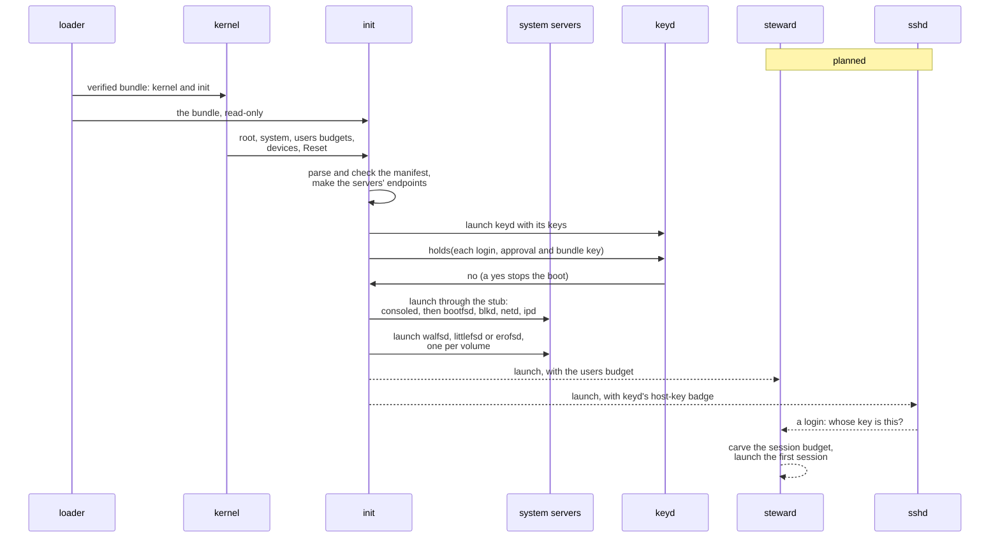
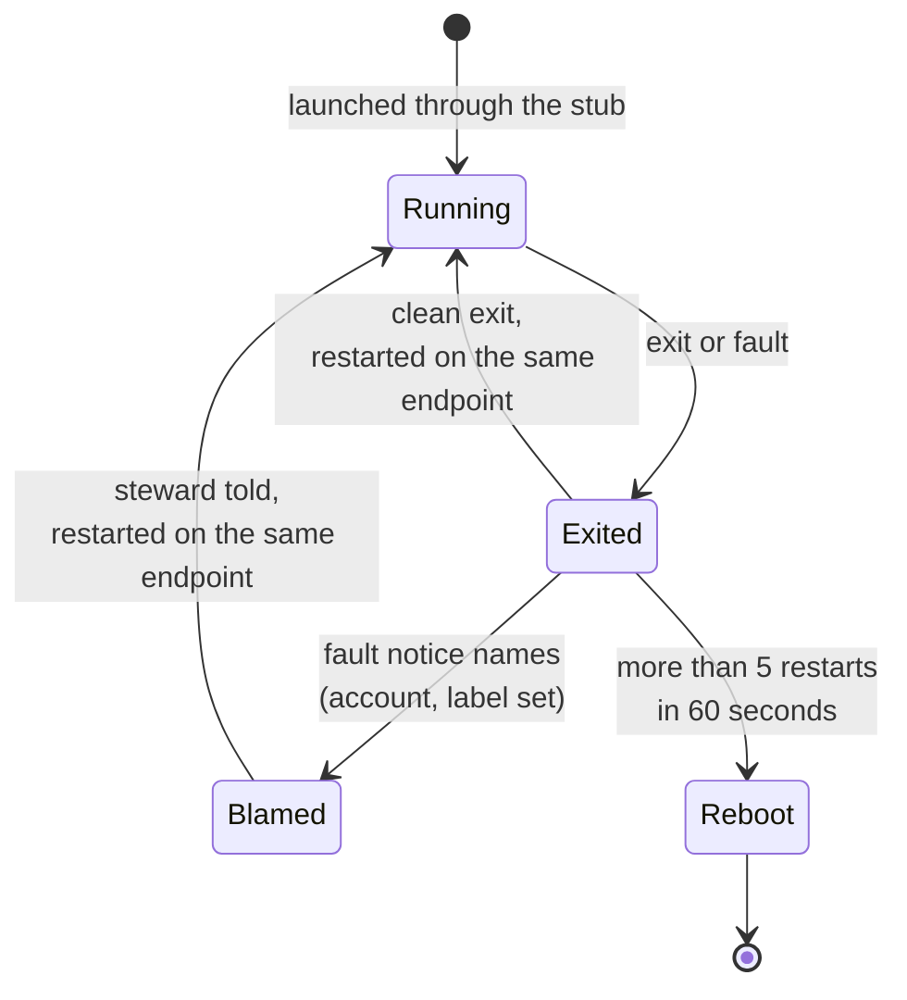

# Init

`init` is the first process. It reads the boot manifest from the signed bundle, starts every
system server from the bundle's pages through the loader stub, gives each its handles, names and
arguments in a startup block, and restarts a server that exits. It holds the boot budgets and
every device, and it has no network and no user data. The startup block and the loader stub
every launcher uses are described here as well.

## Purpose

Something must turn the kernel's handful of boot handles into a running system, and it must do
so from one signed, checked description rather than from code that decides as it goes. `init`
is that step: the manifest says what runs, with which devices, volumes, labels, weights and
arguments, and `init` refuses a manifest that breaks a rule before anything runs. It parses only
that one file and no ELF, so the most privileged process after the kernel has the smallest input.

## Interface

### The boot manifest

<details><summary>Status: built · tested (27)</summary>

- bench:init-boot
- bench:init-refuses-public-manifest
- bench:init-refuses-device-dma
- bench:init-refuses-stack
- host:redoubt-init::what_is_not_strict_json_is_refused_with_where
- host:redoubt-init::names_follow_the_rule_and_differ
- host:redoubt-init::references_name_what_the_manifest_and_bundle_hold
- host:redoubt-init::a_handed_badge_is_a_root_badge_given_once_at_its_endpoint
- host:redoubt-init::principals_values_are_checked
- host:redoubt-init::a_device_name_is_at_most_60_bytes_and_never_ends_in_irq
- host:redoubt-init::a_device_split_between_two_entries_is_refused
- host:redoubt-init::the_dma_flag_must_be_the_kernel_s
- host:redoubt-init::one_device_has_one_holder
- host:redoubt-init::public_names_entries_the_bundle_holds_never_the_manifest
- host:redoubt-init::a_shared_server_needs_a_bucket_per_declared_domain_and_root_badge
- host:redoubt-init::handles_and_arguments_must_fit_one_startup_block
- host:redoubt-init::the_fuzz_corpus_still_passes
- host:redoubt-init::each_volume_s_range_is_minted_at_its_own_disk_s_blkd
- host:redoubt-init::a_blkd_receives_where_init_mints_its_ranges
- host:redoubt-init::a_server_stack_defaults_and_is_checked_against_its_budget
- host:redoubt-init::a_verified_volume_s_server_reads_through_its_verifier
- host:redoubt-init::a_verified_volume_s_key_and_verifier_are_refused_naming_the_field
- host:redoubt-init::a_verified_volume_is_pinned_or_signed_and_never_both
- host:redoubt-init::the_steward_s_entry_alone_is_given_the_manifest_lines
- host:redoubt-init::the_steward_object_and_console_name_what_the_manifest_holds
- host:redoubt-init::the_steward_s_sizes_fit_every_principal_s_smallest_share
- host:redoubt-init::a_key_in_two_roles_across_principals_is_refused
- host:redoubt-init::the_steward_s_own_lines_bind_homes_vaults_and_scopes

</details>

The boot manifest is one strict JSON file ([wire](wire.md#strict-json)) in the signed bundle,
and `init`'s only input. Its entries:

| Entry | Holds |
| --- | --- |
| `devices` | each device's name, its register base and its interrupt number (either may be absent, not both), and whether it may do DMA |
| `labels` | each label's name, owner principal and 64-bit id |
| `volumes` | each volume's name, `blkd` partition, label set and disk (the `servers` entry of the `blkd` serving it), and for a verified volume `verity`: its verifier (the `servers` entry of a [`verityd`](verityd.md)) and one mode, pinned, the root and data blocks it pins, `{ "server", "root": 64 lowercase hex digits, "blocks": a decimal string }`, or signed, the key its root block is signed under and the lowest version it may carry, `{ "server", "key": 64 lowercase hex digits or "bundle", "floor": a decimal string }` |
| `servers` | each server's name, program (a bundle entry), budget (pages, processes, weight), the devices it gets (each a `devices` name and the name the program looks it up by), volume (its range badge, minted by `init`, and its label ids as `labels=`; a volume's server has `program` `walfsd` or `littlefsd` for a writable volume, or `erofsd` for a read-only one, and no other key says the format), the endpoints it receives on, the endpoints it is handed (each an endpoint name and the root badge `init` mints for it: a decimal string below `FIRST_MINTED_BADGE`, never used twice at one endpoint), arguments, and its stack in pages (`stack_pages`, 16 if absent, at most 128), and its heap cap in pages (`heap_pages`, none if absent) |
| `public` | the bundle entries `bootfsd` serves at `/boot`, by exact name |
| `principals` | each principal's name, SSH public keys (`ssh-ed25519` only, each once across every principal's login and approval lists) for login and approval, budget, account, owned labels, the label sets it works under (each a fixed, equal share of the principal's budget), home (volume and path), and network scope (IP prefixes and ports) |
| `steward` | optional; the `servers` entry that is the steward, which alone `init` hands `users` at step 6, and the sizes it carves (`sizes`: `session`, `agent`, `sub_agent` and `crossing`, each a budget, and `cost`, a budget object's own pages). `init` checks every limit nonzero and each size within every principal's smallest share, and hands the steward the principals and sizes as the manifest lines, then its own lines: label names, and each principal's home, labelled volumes and network scope, whose servers the steward's entry must be handed ([steward](steward.md#the-manifest-lines)) |
| `console` | optional; the principal whose unlabelled session the steward opens on the UART console ([steward](steward.md#authentication-and-sessions)); it needs a `steward`, and a name that is not a `principals` entry refuses the boot |
| `confined` | optional; a boolean at the top level ([confinement](#the-confinement-check)) |

- **Types.** Each field has one JSON type. A 64-bit quantity (a label id, an account, a size in
  pages or bytes, a deadline) is a decimal string; a small count (processes, a weight, a depth, a
  restart limit, a port) is a number. `heap_pages` is a decimal string of at most 4294967295, the
  startup block's `u32`; a larger one is the wrong type. A wrong type, an unknown member or a
  repeated one is an error, and an error refuses the boot.
- **Names.** Every name (device, label, volume, server, endpoint, principal) is 1 to 64 bytes of
  `[a-z0-9_:+-]`, starting with a letter (`walfsd:data`, `alice+secrets`), compared byte for byte.
  Names become endpoint names, volume names and 9P paths, so no empty name, NUL, U+FEFF or control
  character may reach them. The startup block applies the same rule (`valid_name`).
- **Stacks.** A server's `stack_pages` is the size of its first thread's stack, charged to its
  budget. `init` refuses zero, more than 128 pages, or a stack not smaller than its budget's pages,
  before it starts any server. A budget that holds the stack but not the image beside it makes that
  server's launch fail, which refuses the boot, or on a restart reboots the machine
  ([restarts and reboots](#restarts-and-reboots)). The bench measures each server's peak across
  the required boot and userland paths and requires the declaration to hold at least twice the
  largest peak ([the memory budget](../testbench.md#the-memory-budget)).
- **Heaps.** A server's heap cap is the most pages its runtime's allocator holds; past it an
  allocation fails in the runtime before the kernel is asked. The budget stays the bound on
  everything else. `init` refuses 0, or a cap and stack the budget cannot hold. The bench requires
  each image server's cap to hold at least twice its largest heap peak
  ([the memory budget](../testbench.md#the-memory-budget)).
- **One entry per device.** A `devices` entry names one device, by its register region and its
  interrupt, and `init` hands that device's objects together to the one server that holds the
  entry. They go under the name the server's entry gives the device: `NAME` for the register region and `NAME-irq` for the
  interrupt, whichever exist. Two entries for one device would let a manifest split it between
  two holders, and the interrupt's holder could then mask the other's device and time its
  activity. A device name, and a name a server looks a device up by, is at most 60 bytes and may
  not end in `-irq`, so `NAME-irq` never collides and fits the name rule. `consoled` takes `uart`
  and `uart-irq`, so two machines' manifests may call the same UART by different names. A
  `devices` entry is held by at most one server, and an endpoint is received on by at most one; a
  manifest naming either twice is refused, confined or not.
- **No server gets a budget handle.** A `servers` entry names the budget `init` creates for the
  server, never a handle to one; a manifest that grants a server a budget handle is refused
  ([R33 (no server holds a system budget)](#r33-no-server-holds-a-system-budget)). `root`,
  `system` and `users` are reserved: no endpoint takes one of those names, and a `receives` or
  `handed` item that names one is refused as a budget grant.
- **Arguments** are opaque strings. `init` passes them unchanged and in order as the startup
  block's `argv` and never interprets them; each server's page defines its own (`keyd`'s keys,
  `ipd`'s addresses and bucket count). `init` checks only that each is UTF-8 with no NUL, and that
  together they leave the startup block inside its page. A badge a server's arguments name for a
  caller is that caller's `handed` badge, written in both places by the manifest's author; `init`
  mints it from the `handed` item, never from the argument. Where `init` calls a server itself
  (`keyd`, `consoled` and `bootfsd`, at the first endpoint each receives on), its own handle
  carries the smallest badge from 1 that no `handed` item there uses. A manifest names each of
  these programs at most once, `keyd` exactly once: a second would run beside the one `init`
  calls, unchecked, and a second `keyd` could hold keys `init` never asked about (R35). A program
  that may run more than once (`blkd`, one per disk; `walfsd`, `littlefsd` or `erofsd`, one per volume) is told the endpoint
  it receives on by its argument `endpoint=NAME`, which the manifest gives it; a `blkd`'s must
  name the endpoint it receives on first, where `init` mints its volumes' ranges.
- **Volumes.** A `volumes` entry is one GPT entry of its disk, which no other entry names on
  that disk, and at most one server attaches it, and no entry is handed a badge at the endpoint
  any `blkd` receives on ([R47 (one volume per instance)](littlefsd.md#r47-one-volume-per-instance)).
  Its `disk` names the `servers` entry of the `blkd` serving its disk: required when the manifest
  has more than one `blkd`, and refused if it names no `blkd`; with one, it may be left out. For
  the attaching server `init` mints the range badge, the entry number + 1, at the endpoint its
  disk's `blkd` receives on first, hands it as `volume`, and adds `labels=` the volume's label
  ids after the entry's own arguments (none for an unlabelled volume); it gives each `blkd` one
  `labels.P=ID,...` per labelled volume on its disk, P its entry number
  ([blkd](blkd.md#ranges-and-badges)). A volume a server attaches without its disk's `blkd`, and
  an entry carrying one of these arguments itself, are refused.
- **Verified volumes.** A volume with `verity` is read through its verifier, a `verityd` entry
  ([verityd](verityd.md)): its server still lists the volume, but `init` mints that server's
  `volume` badge, 1, at the verifier's endpoint instead of at `blkd`, and mints the range badge at
  the disk's `blkd` for the verifier, handed as its `volume`. The verifier gets `endpoint=` the
  endpoint it receives on first, `labels=` the volume's ids, and `root=` and `blocks=`, or, signed,
  `key=` and `floor=`, `bundle` given in hex as the key the loader verified the bundle with,
  named so no copy drifts ([verityd](verityd.md)). Refused, each naming the field: both modes,
  neither, or a part of one; a root that is not 64 lowercase hex digits, or a block count of 0 or
  one whose tree does not count in sectors; a key that is neither 64 lowercase hex digits nor
  `bundle`; a floor that is not a decimal string (the wrong type); a `server` naming no entry, or
  one that is not a `verityd`; a verifier named by two volumes, or by none; a verifier attaching
  a volume itself, receiving on no endpoint, or carrying any argument (each is `init`'s); a verifier whose labels differ from its
  volume's; and a `handed` item at a verifier's endpoint, since the one badge there is the
  volume's range.
- **Sizing.** Every shared server takes `buckets=N` as an argument, parsed once in the serving
  library; none has a compiled-in count. `init` refuses the boot unless N is at least the number
  of (account, label set)s the manifest declares (each principal's unlabelled set and every label
  set it works under) plus the root badges `init` mints at that server, one per system caller. It
  counts every declared domain at every shared server, not only those a session will reach: an
  over-count costs buckets, and an under-count would bind. `init` reads `buckets=N` from a
  server's arguments, with the serving library's parser, and no other argument. So a server's
  bucket count never binds in normal use, and a full server cannot tell a latecomer that others
  hold state ([serving](serving.md#residual-risks)). A server whose block has no `buckets=N`, or
  one outside 1 to 32, does not start.
- **Weights.** One stride queue serves every budget ([scheduling](../kernel/scheduling.md)), so
  the manifest's weights are the whole scheduling policy. `init`, the steward and the drivers
  (`consoled`, `blkd`, `netd`) get weights an order of magnitude above a session's (1000 against
  a principal's 100), so they are served promptly without running ahead of the queue; the servers
  that work for principals (`bootfsd`, the file servers, `ipd`, `keyd`, `sshd`) get ordinary weights and
  bound the work of one request. The weights carve the `system` budget like every other limit.
  The kernel sizes `system`, not the manifest, and `init` refuses a manifest whose servers' pages,
  processes or weights add up to more than `system` holds
  ([budgets](../kernel/budgets.md#the-tree-from-the-boot-manifest)).
- **Devices are matched by address.** `init` asks the kernel which device each of its handles
  names, finds each `devices` entry's base and interrupt among the answers, and the DMA flags must
  agree
  ([devices](../kernel/devices.md#which-process-gets-which-device)).
- **What `/boot` shows.** `bootfsd` serves exactly the entries `public` names, matched byte for
  byte, as one flat read-only directory. `init` pushes their bytes to `bootfsd` itself
  ([bootfsd](bootfsd.md)), and refuses a `public` list that names an entry the bundle does not
  hold, or the manifest. **The manifest is never public:** it holds `keyd`'s seeds and every
  principal's account and keys.

```json
{ "servers": [ { "name": "walfsd:data", "program": "walfsd", "volume": "data",
                 "budget": { "pages": "4096", "processes": 1, "weight": 100 },
                 "receives": ["walfsd:data"], "args": ["endpoint=walfsd:data", "buckets=4"] } ],
  "principals": [ { "name": "alice", "account": "1001", "labels": ["alice-secrets"],
                    "ssh_keys": ["ssh-ed25519 AAAA..."], "home": "data:/home/alice",
                    "net": [ { "prefix": "0.0.0.0/0", "ports": [22, 443] } ] } ] }
```
*A fragment: one file server and one principal.*

The attack tests: a manifest that splits a device between two entries, or names a device ending
in `-irq`, is refused; a manifest giving a server fewer buckets than it serves refuses the boot.

Sizing a server when principals are added at run time is the steward's, in
M5 (persist, install, share).

### The confinement check

<details><summary>Status: built · partly tested: the steward's half, for what it creates after the boot, is the steward's, not built · tested (10)</summary>

- bench:init-refuses-confined-server
- host:redoubt-init::confined_refuses_two_label_sets_on_one_endpoint
- host:redoubt-init::confined_refuses_two_label_sets_on_one_volume
- host:redoubt-init::confined_gives_a_labelled_domain_no_network
- host:redoubt-init::confined_refuses_two_label_sets_on_one_disk
- host:redoubt-init::confined_refuses_a_server_instance_serving_two_label_sets
- host:redoubt-init::confined_counts_only_a_shared_servers_own_label_set
- host:redoubt-init::confined_lets_label_sets_that_share_nothing_share_the_cores
- host:redoubt-init::confined_gives_each_label_set_its_own_userland_disk
- host:redoubt-init::confined_gives_each_label_set_its_own_verifier

</details>

A manifest may set `confined`, a deployment profile for the whole boot, never per domain. Set, it
makes `init` **refuse the boot** whenever two entries with differing label sets share any of:

- an **endpoint**: one name in a `servers` entry's receives or handed list both hold;
- a **volume**: one `volumes` entry both attach;
- a **network instance**: one `ipd` or `netd` both use (a labelled domain gets no `/net` at all);
- a **device object**: one `devices` entry both hold, since a shared disk or NIC is a shared
  scheduler, cache and timing surface;
- a **server instance**: one `servers` entry serving both.

The kernel and the cores are not on the list. Every label set shares the one kernel, which is the
trusted base, and its cores, whose timing is no more partitioned than the caches around them
([side channels](../TENETS.md#side-channels)).

The label set compared is a budget's labels (a server's `labels`, a principal's label sets) and,
for a volume, its `volumes` entry's label set. Two sets differ when they are not equal: `{a}`
differs from `{}`, from `{b}` and from `{a,b}`. A system server such as the steward carries no
labels, so it is a domain of its own. A confined manifest in which a labelled domain reads a
shared unlabelled volume is refused too; data enters such a domain by an audited push from the
steward ([steward](steward.md)). The refusal is a boot failure, not a warning
([R34 (confined placement)](#r34-confined-placement)).

The domains compared are each `servers` entry, under its `labels` (`{}` if none), and each
principal's label sets. A server's users are the servers handed one of its endpoints, or a
volume's range at it (a volume's server on that `blkd`'s disk, or a verified volume's `verityd`; the
server attaching a verified volume at its `verityd`, which counts at the verifier's first endpoint too),
and, for a shared server (one that takes
`buckets=N`), every principal domain with the server's own label set. Only such a domain may later
be granted a connection there, since the steward grants within a label set by this same rule, so
a server a session may later reach is never missed; a domain with another set is not counted, and
the bucket rule still sizes the server for every principal domain. The kinds are checked in the
order listed, and the refusal names the kind. So in a confined boot each disk holds one label
set's volumes, and its `blkd` carries that set, and each label set reading a verified volume has
its own `verityd`.

**The one named exception** is the control plane: the steward and `sshd` may reach across label
sets, and only by three kinds of edge: the request and owner-approval path; per-item reader and
writer budgets, each carrying exactly one label set and dying after one item (declassification and
push); and lease-ending supervision. No shared data server or device is exempt. `init`
checks the declared graph at boot, and the steward enforces the same rule for the budgets and
grants it creates later.

It is a check on the manifest, not a run-time invariant: a capability handed over after boot (by
`mint`, by a `grant`, by a system server) is outside it, and a system server that hands one
across label sets is at fault, not the kernel. Without `confined`, a shared server is ordinary
multi-tenancy and the serving library's residual risks apply.

### Starting the servers

<details><summary>Status: built · partly tested: step 6, the steward and `sshd` are not built · tested (17)</summary>

- bench:init-boot
- bench:init-servers
- bench:littlefsd-boot
- bench:init-refuses-system-fit
- bench:init-refuses-device-unmatched
- bench:init-refuses-bound
- bench:init-refuses-held-bundle-key
- bench:init-refuses-consoled-handed
- host:redoubt-init::the_image_manifest_passes_and_its_plan_is_what_the_boot_follows
- host:redoubt-init::a_manifest_without_keyd_is_refused_and_init_calls_each_server_at_an_endpoint
- host:redoubt-init::init_calls_one_of_each_server_it_calls
- host:redoubt-init::more_servers_than_init_has_threads_to_watch_are_refused
- host:redoubt-init::no_server_is_handed_a_root_badge_at_consoled
- host:redoubt-init::a_volume_s_labels_go_to_its_server_and_to_blkd
- host:redoubt-init::a_volume_is_one_entry_for_one_server_at_one_blkd
- host:redoubt-init::no_server_is_handed_a_badge_at_blkd
- host:redoubt-init::a_verifier_costs_init_one_server_and_its_range

</details>

The kernel gives `init` the `root`, `system` and `users` budgets, every device object and the
Reset right. The loader maps the bundle into it, read-only
([boot](../kernel/boot.md#the-loader-loads-only-the-kernel-and-init)). `init` then:

1. parses and checks the manifest, and refuses the boot on any error, or if what the manifest
   will cost `init` does not fit in what `root` keeps for it
   ([budgets](../kernel/budgets.md#the-tree-from-the-boot-manifest)), or if it names more servers
   than `init` can watch, one thread each beside its own: at most `MAX_THREADS` - 1. Until
   `consoled` starts, `init` writes its own lines to the UART, which it maps for itself. A refusal
   is printed there, and the machine powers off with a system-failure status, before any other
   process has run;
2. creates every endpoint the manifest's servers receive on. Each is owned by and charged to
   `root`, so it outlives any one instance of its server, and R1 (flow) does not bind it because `root`
   is `system` class ([IPC](../kernel/ipc.md#r1-flow)). `init` keeps the receive right, hands the
   server a copy, and mints, for each `handed` item that names the endpoint, a handle with the
   item's badge for the server whose entry lists it, and at `blkd`'s, each volume's range badge
   for the server attaching it;
3. starts `keyd` and runs the [key-separation check](#the-key-separation-check) against it. A
   manifest with no `keyd` entry is refused at step 1, since the bundle's key always needs
   asking about;
4. unmaps the UART and starts `consoled` with it. From then on, `init` writes through its own
   connection to `consoled`, and it prints each child's console connection id when it starts
   the child ([consoled](consoled.md#started-by-init)). The check refuses a manifest that hands
   any server an endpoint `consoled` receives on: a root badge there writes bare lines, and only
   `init` holds one. Without a `consoled` entry, `init` keeps the UART;
5. starts the rest of the drivers and the servers below the steward: `bootfsd`, `blkd`, each
   volume's `walfsd`, `littlefsd` or `erofsd`, `netd` and `ipd`, then pushes the `public` entries to
   `bootfsd`;
6. starts the steward, the entry `steward.server` names, handing it the `users` budget (that entry
   alone, by name in its startup block; no `handed` item names a budget) and the manifest lines
   as its arguments, after its entry's own; and `sshd`.

Each server runs in a budget of its own, carved from `system`, and is started through the loader
stub straight from the bundle's pages, so no file server is needed to start anything. `init`
holds every device and places each driver's handles, by name, in that driver's startup block
(R33).


```mermaid
sequenceDiagram
    participant L as loader
    participant K as kernel
    participant I as init
    participant S as system servers
    participant KD as keyd
    participant ST as steward
    participant SH as sshd
    Note over ST,SH: planned
    L->>K: verified bundle: kernel and init
    L->>I: the bundle, read-only
    K->>I: root, system, users budgets,<br/>devices, Reset
    I->>I: parse and check the manifest,<br/>make the servers' endpoints
    I->>KD: launch keyd with its keys
    I->>KD: holds(each login, approval and bundle key)
    KD->>I: no (a yes stops the boot)
    I->>S: launch through the stub:<br/>consoled, then bootfsd, blkd, netd, ipd
    I->>S: launch walfsd, littlefsd or erofsd,<br/>one per volume
    I-->>ST: launch, with the users budget
    I-->>SH: launch, with keyd's host-key badge
    SH-->>ST: a login: whose key is this?
    ST-->>ST: carve the session budget,<br/>launch the first session
```
*Figure: the boot from the loader to the first session. Dashed: planned (the steward and `sshd`).*

The attack tests: a manifest whose servers do not fit in `system`, or whose device entries do not
match the kernel's device objects, is refused before any server runs. The verdict is `init`'s
refusal line, printed when nothing else has run, and the power-off status.

### The key-separation check

<details><summary>Status: built · tested (5)</summary>

- bench:init-refuses-held-login-key
- bench:init-refuses-held-bundle-key
- bench:init-refuses-second-keyd
- host:redoubt-init::every_login_and_approval_key_then_the_bundle_key_is_asked_about
- host:redoubt-init::init_calls_one_of_each_server_it_calls

</details>

`init` refuses a manifest that hands `keyd` a key the box is authenticated by: a key listed both
as a principal's login or approval key and as a `keyd` key, or the key the loader verifies the
boot bundle with, which `init` carries as the same compiled-in constant. `keyd` cannot see either
itself: it is given seeds and purposes, not what the rest of the system does with the public keys.
`init` holds no cryptography, so once `keyd` is started and before anything else runs, it asks
`keyd` `holds(public key)` for each such key ([keyd](keyd.md)), and a yes stops the boot
([R35 (key separation)](#r35-key-separation)).

### The startup block

<details><summary>Status: built · partly tested: the parser's fuzz target runs in no bench case; in a boot, only the blocks `init` and `stub-launch` write are parsed · tested (15)</summary>

- bench:rt-host-tests
- host:redoubt-rt::round_trip
- host:redoubt-rt::the_page_is_the_wire_message
- host:redoubt-rt::image_round_trips_and_is_validated
- host:redoubt-rt::heap_pages_and_tag_round_trip
- host:redoubt-rt::resolve_takes_the_longest_prefix
- host:redoubt-rt::handle_names_follow_the_manifest_rule
- host:redoubt-rt::hostile_blocks_are_refused
- host:redoubt-rt::fields_hold_whole_entries
- host:redoubt-rt::handle_counts_are_what_process_start_can_install
- host:redoubt-rt::random_bytes_never_panic
- fuzz:redoubt-rt/startup
- bench:stub-launch
- bench:net-tcp
- bench:heap-cap

</details>

A launcher gives each child one read-only page, the **startup block**, naming the handles it
installed in the child's slots 1 to n (`process_start`,
[processes](../kernel/processes.md#creating-and-starting)). `process_start`'s argument register
carries the page's address; there is no fixed address. The runtime (`libs/rt/src/startup.rs`)
parses it before the program's `main` runs, and a program started with no block (address 0) gets
an empty one.

The page holds the block's length as a little-endian `u32`, then one typed message, `startup`,
laid out as a typed operation written into a file: its opcode as a `u32`, then the buffer-shape
encoding of its fields ([wire](wire.md#the-message-convention)). The rest of the page is not read.

| Field | Holds |
| --- | --- |
| `version` | 2; a block of any other version is refused |
| `handle_count` | n, the handles `process_start` installed, at most `MAX_START_HANDLES` (128) |
| `namespace` | entries `handle: u32`, `path: string`: where a handle is bound, a clean absolute path (`/`, `/dev/cons`) |
| `handles` | entries `handle: u32`, `name: string`: a named handle, the name under the manifest's rule |
| `argv` | `string`s, the arguments in order (each may be empty) |
| `image_addr`, `image_len` | where the program's ELF image sits in the child and its exact length, for the loader stub; both 0 for none |
| `heap_pages` | the child's heap cap in pages ([Heaps](#the-boot-manifest)), 0 for none |
| `tag` | the launch tag the bench measures the child's stack and heap by, 0 for none: `init` gives each server its place in the manifest, from 1 |

**Checked whole.** The parent may be hostile, so the parser bounds everything and checks
everything before handing the block to the program: every handle is in 1 to n, paths are unique
and clean, names are unique and valid, each `bytes` field holds whole entries and nothing else,
`image_addr` is 0 exactly when `image_len` is, is page-aligned, and does not overflow with its
length, and the block fits its page. A block breaking any rule is refused whole, and the process
exits with code 102 before `main` runs ([R31 (startup block checked whole)](#r31-startup-block-checked-whole)).

**Using it.** `resolve(path)` finds the namespace entry with the longest matching prefix and the
rest of the path; `handle(name)` finds a named handle; `args` gives the arguments. The runtime
notes the handle bound at `/dev/cons` for its panic report, caps its heap at `heap_pages`, and
marks its heap record with `tag`, all before `main`. `StartupBuilder` writes a block for a
launcher, and its `finish` runs the parser on the result, so a launcher can only write blocks a
child accepts.

The table: [libs/wire/tables/startup.md](../../libs/wire/tables/startup.md).

{{#include ../../libs/wire/tables/startup.md:tables}}

### Launching through the loader stub

<details><summary>Status: built · partly tested: on target the kernel's refusal masks the stub's overlap checks, which only host tests pin · tested (21)</summary>

- bench:rt-host-tests
- bench:stub-launch
- host:redoubt-client::an_image_moves_one_batch_at_a_time
- host:redoubt-client::a_refusal_on_the_third_batch_leaves_the_launcher_as_it_was
- host:stub::plan_maps_a_well_formed_segment
- host:stub::plan_refuses_a_segment_reaching_outside_the_image
- host:stub::plan_refuses_a_segment_overlapping_an_excluded_range
- host:stub::plan_refuses_writable_and_executable
- host:stub::plan_refuses_writable_without_readable
- host:stub::plan_refuses_a_non_riscv_machine
- host:stub::plan_refuses_an_entry_outside_any_executable_segment
- host:stub::plan_refuses_two_segments_that_overlap_each_other
- host:stub::plan_refuses_a_misaligned_p_align
- host:stub::plan_refuses_more_than_max_phnum_segments
- host:stub::plan_refuses_a_segment_touching_page_zero
- host:stub::plan_refuses_a_segment_reaching_into_the_stub_region
- host:stub::plan_refuses_a_non_exec_type
- host:stub::image_in_bounds_refuses_an_image_overlapping_the_stub
- host:stub::image_in_bounds_refuses_an_image_overlapping_the_startup_page
- host:stub::read_image_refuses_a_short_page
- host:stub::read_image_refuses_an_image_len_over_the_cap

</details>

Every process after `init` starts the same way, and no launcher parses an ELF: the **loader
stub** (`stub/`), a small flat binary mapped into the new process, does it there, where a hostile
image can hurt only the process it was going to become.

1. The launcher creates the child's budget and process (`process_create`) with an exit endpoint.
2. It maps into the child, with `process_map`: the stub, read-only and executable, at
   `STUB_ENTRY` (`0x1FF0_0000`); a copy of the program's ELF image, read-write, placed 64 pages
   at a time; the stack, zeroed, or painted with a pattern the bench reads when the launcher tags
   it, as `init` tags each server's ([the memory budget](../testbench.md#the-memory-budget)); and
   the startup block, read-only, naming the image with `image_addr` and `image_len`. Where each
   goes is on [memory layout](../kernel/memory-layout.md#launcher-placement).
3. It starts the child's first thread at `STUB_ENTRY`, with the startup block's address as the
   argument, installing the child's handles.
4. The stub reads `image_addr` and `image_len` from the block, checks that the image lies clear
   of the stub and the startup page and is at most `MAX_IMAGE_LEN`, and plans every `PT_LOAD`
   segment before mapping any (`stub::plan`, pure and allocation-free).
5. It maps each segment at its link address with `map_fixed`, copies its bytes in, sets its final
   permissions, unmaps the image copy, and jumps to the ELF's entry with the startup block's
   address in `a0`. From then on the process is the program.

**What the stub refuses,** whole, before mapping anything: an ELF that does not parse, is not
`ET_EXEC`, is not RISC-V of the stub's own width, or has more than 64 program headers; a segment
whose bytes reach outside the image, whose pages touch page 0, reach past `STUB_ENTRY`, or
overlap the image, the startup block, the stub or another segment; a segment both writable and
executable, or writable without readable; a `p_align` that is not a power of two or disagrees
with the segment's offset; an entry outside every executable segment. The stub holds no writable
data and depends only on `redoubt-sys` and `redoubt-wire`.

**Exit codes.** The stub exits with 110 for a startup block that is missing, does not parse or names
no image, or whose image overlaps the stub or the startup block or is over `MAX_IMAGE_LEN`; 111 for
a hostile image, including a segment the kernel refuses to map (one over the stack); 112 when
`map_fixed` is out of memory in the child's budget; and 101 if it panics. After the jump, the exit
code is the program's.

The stub allocates nothing. It links the wire crate, which declares an allocator, so it installs
a zero-sized global allocator, `NullAlloc` (`stub/src/lib.rs`), whose `alloc` returns null and is
never reached: the typed decoding the stub uses does not allocate.

The bench's launcher, `stub-launch`, and `init` both launch this way
([R32 (a hostile image hurts only its process)](#r32-a-hostile-image-hurts-only-its-process)).

### Fresh connections per child

<details><summary>Status: built · tested (3)</summary>

- bench:init-servers
- bench:init-console-forgery
- bench:init-restart

</details>

A launcher never passes its own connection to a child. Every handle in a child's namespace is a
fresh connection the server made for that child with `new_connection`
([wire](wire.md#ninep_common)), rooted where the child's view of that server begins, and the
launcher disconnects it when the child exits ([releasing grants](wire.md#a-launcher-releases-its-childs-grants)).
A copied connection would share the launcher's fids and admission with the child, and the
launcher could not free the child's state without losing its own.

### Restarts and reboots

<details><summary>Status: built · partly tested: blame, `blame`'s badge, a wedged steward and the steward's restart are the steward's, not built; a restarted `consoled`'s attach is read from the code, not attacked · tested (10)</summary>

- bench:init-restart
- bench:init-handed-revoked
- bench:init-reboot
- bench:init-driver-restart
- bench:netd-restart
- bench:init-quarantine-reboot
- host:redoubt-init::the_fifth_restart_goes_ahead_and_the_sixth_exit_reboots
- host:redoubt-init::a_restart_older_than_the_window_is_dropped_from_the_count
- host:redoubt-init::restarts_spread_wider_than_the_window_never_reboot
- host:redoubt-init::a_clock_that_reads_earlier_counts_the_restart_as_recent

</details>

- **Restart.** A server that exits is restarted on the same endpoint. Calls it had taken get
  `Dead` ([R4b (a server dies)](../kernel/ipc.md#r4b-a-server-dies)), and clients see the error
  and retry; senders still waiting on the endpoint are served by the restarted server. The new
  instance gets the same manifest name, arguments and receive endpoint, but a new startup block:
  `init`, as its launcher, disconnects the dead instance's connections at every server
  ([releasing grants](wire.md#a-launcher-releases-its-childs-grants)) and mints new ones. The
  server's own tables start empty, with a newly drawn first badge
  ([R27 (badge allocation)](serving.md#r27-badge-allocation)), so a client's old connection ids
  are dead.
- **A fresh budget.** `init` destroys the dead instance's budget and carves a new one from the
  manifest entry, so nothing the dead instance made or held outlives it
  ([R10 (destruction)](../kernel/budgets.md#r10-destruction)). The receive endpoint is `init`'s,
  owned by `root`, so the budget's destruction does not reach it, and every client's handle to it
  stays good. The badges `init` hands the instance are stamped with its budget
  ([R9 (stamps)](../kernel/objects.md#r9-stamps)), so a copy it passed on dies with it, and the
  badge minted again for the next instance has no other holder.
- **A driver** gets its device handles again from `init`'s copies. The kernel reset the device at
  the dead instance's end, before its DMA pages were reused
  ([devices](../kernel/devices.md#reset-before-reuse)), and the new instance brings it up from a
  reset of its own. A driver whose device was quarantined is not restarted: `init` finds its own
  copy of the device handle closed, and reboots
  ([devices](../kernel/devices.md#which-process-gets-which-device)).
- **The boot's own steps, again.** A restart repeats what the boot did after starting that
  server: `keyd` is checked again ([the key-separation check](#the-key-separation-check)),
  `init` attaches to a new `consoled` again, and it pushes the `public` entries to a new
  `bootfsd` and seals it again. Until then a client meets the new instance as the boot left
  it: `bootfsd` answers "does not exist", never a half-written entry. If one of these steps
  fails, `init` reboots.
- **During the boot too.** A server that exits before the boot is done is restarted and
  counted the same way, and a step that was calling it waits for the new instance and tries
  again. So a server that cannot start reboots the machine by the rule below: `consoled`
  refusing a `buckets=N` its budget cannot hold is one.
- **Blame.** Each exit notice for a fault names the account and label set of the call the faulting
  thread was serving ([R21 (crash blame)](../kernel/processes.md#r21-crash-blame)). `init` passes
  them to the steward in one typed call, `blame(account, labels, server)`, in the steward's table,
  where `server` is the faulting server's manifest name for the audit record; the steward's rule
  counts by (account, label set) only ([steward](steward.md#crash-blame)).
- **Only `init` can blame.** The steward accepts `blame` only through a root badge it gives `init`
  alone: anyone who could send it could have another principal's sessions ended by forging three
  crashes.
- **A wedged steward cannot stall restarts.** `init` restarts the server first, then blames, with a
  timeout; a blame lost to the timeout is reported on the console. A fault before the steward
  runs is reported on the console and blamed on nobody.
- **Reboot.** More than 5 restarts of one server within 60 seconds, not stopped by blame, reboots
  the machine: failing closed beats a server that cannot stay up. So does a restart `init`
  cannot make: a budget it cannot carve, a badge or console connection it cannot mint, or a
  launch the kernel refuses.
- **The steward** is part of the trusted base; its crash is a bug. If it dies, `init` destroys and
  recreates the `users` budget, which logs every session out, and starts it again.


```mermaid
stateDiagram-v2
    [*] --> Running: launched through the stub
    Running --> Exited: exit or fault
    Exited --> Blamed: fault notice names<br/>(account, label set)
    Blamed --> Running: steward told,<br/>restarted on the same endpoint
    Exited --> Running: clean exit,<br/>restarted on the same endpoint
    Exited --> Reboot: more than 5 restarts<br/>in 60 seconds
    Reboot --> [*]
```
*Figure: a system server's restarts. Until the steward runs, a fault is reported on the
console and blamed on nobody.*

The attack tests: `blame` from any badge but `init`'s is refused; a restarted server's old
connection ids are dead; a killed driver, `netd` among them, is restarted and its clients are
served again ([netd](netd.md#started-by-init)); more than 5 restarts in 60 seconds reboot the
machine.

### A worked configuration

Status: planned · M1 (separation and containment)

Alice and Bob each log in over SSH; Alice has a vault label `alice-secrets` and an agent,
`alice/researcher`, on a two-hour lease.

```
kernel
└── init                                              root
    ├── consoled bootfsd blkd walfsd:data walfsd:alice-secrets  system
    │   netd ipd:lan keyd steward sshd
    ├── session alice-1                               users/alice/{}/session-1
    ├── agent alice/researcher [lease 2 h]            users/alice/{}/researcher
    ├── vault session alice+secrets-1                 users/alice/{alice-secrets}/session-1
    └── session bob-1                                 users/bob/{}/session-1
```
*Figure: the budget tree. `{}` and `{alice-secrets}` are the fixed sub-budgets, one per label set.*

| Name | Alice's session | Bob's session | Enforced by |
| --- | --- | --- | --- |
| `/` | `walfsd:data` at `/home/alice`, read-write | `walfsd:data` at `/home/bob`, read-write | `walfsd` (badge) |
| `/dev/cons` | her SSH channel | his | `sshd` (badge, channel labels) |
| `/net` | `ipd:lan`, connect out to ports 22 and 443, not the box's own addresses | `ipd:lan`, connect out to 443 | `ipd` (badge) |
| `powerbox`, `budget` | hers | his | the steward, the kernel |

- Weights: Alice 100, Bob 100; the agent 20, carved from Alice's, sharing her account. `init`,
  the steward and the drivers are 1000 each in the same queue.
- The vault session reads and writes `walfsd:alice-secrets`, reads (never writes) her home on the
  unlabelled `walfsd:data`, which is how data enters the vault, has no `/net`, and prints only to its
  own channel.
- The agent has its own principal, `/work` only and no `/net`; its escalations wait for Alice's
  approval, and the lease's end destroys its budget and everything it passed on.
- No session or lease holds a `keyd` grant in M1 (separation and containment): `keyd`'s purposes are
  the host key and audit signing.
- Bob crashing `walfsd:data` three times is blamed on his account each time: his sessions end and he
  is locked out for a while; Alice is not affected.

**Open:** none.

## Authority

<details><summary>Status: built · partly tested: the steward's `users` budget is not exercised; `init-boot` shows each copy `init` closed gone from the kernel's side, but no call lists a handle table, so a copy `init` never closed would not be caught · tested (4)</summary>

- bench:init-boot
- bench:init-restart
- bench:init-driver-restart
- host:redoubt-init::a_server_handed_a_budget_is_refused

</details>

- `init` holds the `root`, `system` and `users` budgets, every device object, the Reset right and
  the bundle's pages. It gives each driver only its own device objects, each server only the
  endpoints the manifest names, and the steward the `users` budget.
- It keeps what it needs to restart a server: the receive right of every endpoint it made, a copy
  of every device handle it placed, and the bundle. It never receives on a server's endpoint, and
  it maps no device once `consoled` has the UART.
- Beside those it holds only its own handle at each server it calls, its own connection to
  `consoled`, and each server's exit endpoint. It closes its copy of every badge it minted for a
  `handed` item or a volume's range, and of each child's console connection, once the child is
  started, so it calls as no system caller and writes as no child.
- It holds no keys and no cryptography, and parses no ELF: launching goes through the loader stub,
  inside the child.
- It has no network and no user data, and after boot it receives only exit notices.
- The loader stub holds nothing but what the child holds: it runs as the child, in the child's
  budget, with the child's handles.

## Security properties

### R31 (startup block checked whole)

<details><summary>Status: built · tested (8)</summary>

- bench:rt-host-tests
- host:redoubt-rt::hostile_blocks_are_refused
- host:redoubt-rt::fields_hold_whole_entries
- host:redoubt-rt::handle_names_follow_the_manifest_rule
- host:redoubt-rt::image_round_trips_and_is_validated
- host:redoubt-rt::handle_counts_are_what_process_start_can_install
- host:redoubt-rt::random_bytes_never_panic
- fuzz:redoubt-rt/startup

</details>

A program runs only with a startup block that passed every rule: handles within what
`process_start` installed, clean unique paths, unique names under the manifest's rule, whole
entries, a well-formed image range. A block breaking one is refused whole and the process exits
before `main`, so a hostile or buggy parent cannot hand its child a namespace the program would
read two ways, or a name no rule allows.

### R32 (a hostile image hurts only its process)

<details><summary>Status: built · partly tested: on target the kernel's own refusal masks the stub's overlap checks, which only host tests pin · tested (10)</summary>

- bench:stub-launch
- host:stub::plan_refuses_a_segment_overlapping_an_excluded_range
- host:stub::plan_refuses_writable_and_executable
- host:stub::plan_refuses_two_segments_that_overlap_each_other
- host:stub::plan_refuses_a_segment_touching_page_zero
- host:stub::plan_refuses_a_segment_reaching_into_the_stub_region
- host:stub::image_in_bounds_refuses_an_image_overlapping_the_stub
- host:stub::read_image_refuses_an_image_len_over_the_cap
- host:stub::plan_refuses_a_segment_over_its_own_image
- host:stub::the_fuzz_corpus_still_passes

</details>

No launcher parses an ELF. The loader stub, running as the child, refuses an image whose segments
overlap each other, the image, the stub, the startup block or page 0, reach past the link range,
or ask to be writable and executable, before it maps anything; a segment the kernel refuses (one
over the stack) makes the child exit too. So a hostile image can at most exit or fault the process
it was going to become. `stub-launch` launches hostile images on both widths and checks that each
only exits or faults the child, that the parent's budget returns to the same usage after each,
and that a well-formed child still runs afterwards and finds the image copy unmapped. A segment
the child's budget cannot hold exits 112, and the same image runs in a budget that holds it. The
stub's parser was fuzzed for an hour; its kept corpus (`stub/fuzz/seeds/plan`) reruns in the
stub's host tests.

### R33 (no server holds a system budget)

<details><summary>Status: built · partly tested: the steward's half is the steward's, not built · tested (2)</summary>

- bench:init-refuses-budget-handle
- host:redoubt-init::a_server_handed_a_budget_is_refused

</details>

Only `init` and the steward ever hold a handle to a `system`-class budget. A server's startup
block carries no budget handle, and `init` refuses a manifest that grants one. A compromised
server holding its budget could create `system`-class children with any labels and any account,
and so forge admission keys and crash blame at every other server. The attack test starts a
server from a manifest that grants it a budget and expects the boot refused.

### R34 (confined placement)

<details><summary>Status: built · partly tested: the control plane's exception is the steward's and `sshd`'s, not built · tested (10)</summary>

- bench:init-refuses-confined-server
- host:redoubt-init::confined_refuses_two_label_sets_on_one_endpoint
- host:redoubt-init::confined_refuses_two_label_sets_on_one_volume
- host:redoubt-init::confined_gives_a_labelled_domain_no_network
- host:redoubt-init::confined_refuses_two_label_sets_on_one_disk
- host:redoubt-init::confined_refuses_a_server_instance_serving_two_label_sets
- host:redoubt-init::confined_counts_only_a_shared_servers_own_label_set
- host:redoubt-init::confined_lets_label_sets_that_share_nothing_share_the_cores
- host:redoubt-init::confined_gives_each_label_set_its_own_userland_disk
- host:redoubt-init::confined_gives_each_label_set_its_own_verifier

</details>

With `confined` set, no two entries with differing label sets share a server instance, volume,
endpoint, network instance or device object, and no labelled domain reads a shared
unlabelled volume; a manifest that would place them so fails the boot. The one exception is the
control plane: the steward and `sshd`, by the request and owner-approval path, per-item single-label
reader and writer budgets, and lease-ending supervision only. The attack verdict is the boot
failing, not the manifest's claim.

### R35 (key separation)

<details><summary>Status: built · tested (5)</summary>

- bench:init-refuses-held-login-key
- bench:init-refuses-held-bundle-key
- bench:init-refuses-second-keyd
- host:redoubt-init::every_login_and_approval_key_then_the_bundle_key_is_asked_about
- host:redoubt-init::init_calls_one_of_each_server_it_calls

</details>

`keyd` never holds a key that authenticates anyone to the box: not a principal's login or
approval key, and not the key the loader verifies the bundle with. `init` asks `keyd` about each
before anything else runs, and a yes stops the boot. So the boot root and a key some badge may
sign with are never one key, and no badge at `keyd` can sign a login.

## Failure and restart

Status: built · partly tested: the runtime's exit on a refused block is read from the code, not attacked · tested: bench:stub-launch, host:redoubt-rt::hostile_blocks_are_refused

- **A child's startup block is refused:** the runtime exits with 102 before `main`; the stub
  exits with 110 if it cannot find the image or the image lies outside its bounds.
- **A child's image is refused or does not fit:** the stub exits with 111 or 112, and only the
  child is affected; its launcher sees the exit notice and the child's budget returns what it held.
- What `init` does when a server exits is under [restarts and reboots](#restarts-and-reboots).

## Residual risks

- **The manifest is a secret held in the bundle.** It carries `keyd`'s seeds, so whoever can read
  the bundle image holds the box's private keys; the bundle is signed, never encrypted, and what
  keeps the seeds off `/boot` is that the manifest is never public. Sealing the keys to the
  machine is [keyd](keyd.md)'s.
- **A confined boot is checked once.** Capabilities handed over after boot are outside the check;
  a system server that hands one across label sets breaks confinement without the kernel noticing.
- **Every child pays for a copy of its image.** There is no shared text: a launcher copies the ELF
  into pages charged to the child, and the stub copies each segment again. This is decided, for
  M1 (separation and containment) and after. A read-only image-page cache shared between principals
  is not planned: it would be a cross-principal timing surface
  ([a shared image cache](../beyond/image-cache.md)). The steward may still cache an image's
  bytes, to avoid reading them again, because each child still gets its own copy.
- **A blame can be lost.** If the steward does not take `init`'s blame within its timeout, the
  crash is reported on the console but counts toward no lockout.
- **The mediators are trusted across labels.** The steward and `sshd` are the confinement check's
  one exception; a bug in either reaches every label set they serve.
- **The stub cannot see the stack.** A segment that names the stack's pages is refused by
  `map_fixed`, but nothing checks for a gap between a segment and the stack
  ([memory layout](../kernel/memory-layout.md#residual-risks)).
- **The startup block's fuzz target runs outside the bench.** Its host tests and the stub's run
  in `rt-host-tests`; the fuzz target needs `cargo fuzz`, which a host-tests case does not run,
  so it is run by hand.
- **On target, the kernel's refusal hides the stub's overlap checks.** Dropping one still ends
  in exit 111, because `map_fixed` never replaces a mapping; only the host tests pin the stub's
  own.
- **A restart loop reboots the machine.** A client that can crash a server repeatedly without
  being blamed (a bug the blame rule does not reach) can reboot the box.
- **A restarted `consoled` forgets every server's console.** The servers' connections lived
  in the dead instance's tables, and `init` has no way to hand a running server a new one, so
  a server's lines are refused until it restarts too. `init` attaches again and says so.
- **A console that cannot start reboots silently.** `init` has given up the UART, so its
  lines about `consoled`'s restarts and the reboot go nowhere.

## Why

- **One signed manifest.** A boot decided by code is reviewed by reading code; one checked file
  is reviewed by reading the file, and a rule it breaks stops the boot before anything runs.
- **The stub, not the launcher, parses ELF.** An ELF parser is a large surface on hostile input.
  Run inside the child, a bug in it compromises only the process being made, never `init` or the
  steward, which launch everything.
- **The startup block as one typed message.** A second framing format would need its own parser
  and fuzzing; the typed-message codec is already both. The parent writes both sides, so checksums
  would protect nothing.
- **Strings for 64-bit numbers in the manifest.** Every JSON tool agrees on integers up to 2^53;
  an account or a page count written as a string is read the same way by every tool.
- **A fresh connection per child.** A launcher that could not free a child's state without freeing
  its own would leak every dead child's fids for its own lifetime.
- **Reboot on a restart loop.** A server that cannot stay up is a server whose rules are not being
  enforced; stopping the box is the closed failure.
