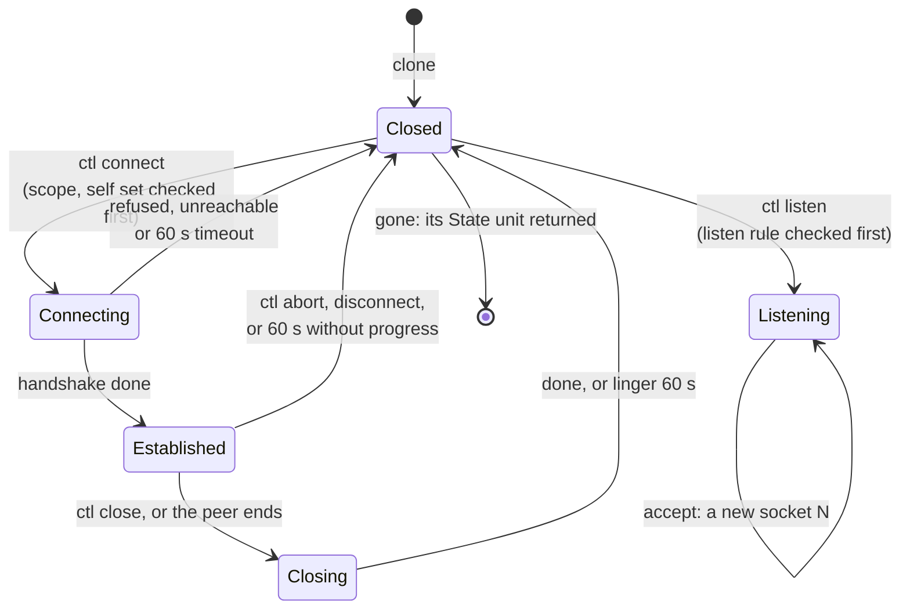

# ipd

`ipd` is the TCP/IP stack for one network: it serves `/net` over 9P, a Plan 9 style tree of TCP
sockets, and talks to the network card through [`netd`](netd.md). A socket capability is a
connection to `/net` carrying a **scope** of IP prefixes and ports; a connection reaches only what
its scope allows and never the box's own addresses, whatever the scope says. `ipd` is a sink: it
refuses every labelled caller. It runs smoltcp 0.14.0, vendored, with IPv4, Ethernet and TCP only.

## Purpose

People's sessions need the network, and the network is where data leaves the box; agents reach it
only through `gatewayd`, never a socket of their own. `ipd` puts the rule at the socket: a capability names exactly the prefixes and ports it may connect to or
listen on, a grant can only narrow it, and no scope can reach back into the box, where a forwarded
port could lead a session to `approve@box`. Because `ipd` is a sink, no labelled data reaches it
at all.

## Interface

### The `/net` tree

Status: built · tested: bench:d3-net-tcp, bench:ipd-host-tests, host:redoubt-ipd::clone_makes_a_socket_and_tcp_lists_only_the_callers, host:redoubt-ipd::a_connect_waits_then_carries_data_through_the_files, host:redoubt-ipd::ctl_refusals_are_named_and_checked_before_the_stack, host:redoubt-ipd::a_listener_accepts_through_ctl, host:redoubt-ipd::numbers_are_per_connection_and_invisible_to_others, host:redoubt-ipd::a_connection_carries_bytes_both_ways_and_ends, host:redoubt-ipd::a_far_host_is_reached_through_the_gateway, host:redoubt-ipd::a_write_waits_while_the_send_buffer_is_full, host:redoubt-ipd::a_listener_accepts_its_backlog_and_listens_again, host:redoubt-ipd::the_conformance_vectors_run_against_ipd, host:redoubt-ipd::a_client_connects_and_echoes_through_the_program

`/net` is served over the [9P server skeleton](serving.md#the-9p-server-skeleton). Everything a
file holds is typed, in the wire encoding ([wire](wire.md#the-encoding)), never text.

```
/              the connection's root; it carries the connection's scope
/tcp/          lists only this connection's sockets
/tcp/clone     read at offset 0: a new socket N, as n: u32
/tcp/N/ctl     write: one net_ctl operation; read: state: u32, n: u32 (waits)
/tcp/N/data    read: bytes (waits; 0 bytes is the peer's end); write: bytes (waits)
/tcp/N/remote  read: addr: bytes[4] (network order), port: u16
```
*The tree one connection sees.*

- **`clone`**: a read at offset 0 makes a new socket, charged to the caller, and returns its number,
  the lowest free one for this connection. `/tcp` lists only the connection's own sockets, and a
  walk to another connection's number is "not found".
- **`ctl`**: a write is one `net_ctl` operation, its opcode as a `u32` then its fields
  ([wire](wire.md#the-message-convention)): `connect(addr, port)`, `listen(port, backlog)` (backlog
  at most 8), `close` (the graceful end) or `abort`. A read returns the state (1 connecting,
  2 established, 3 closing, 4 closed, 5 listening) and, for a listener that accepted, the new
  socket's number; it **waits** while a connect is in progress or a listener has nothing accepted,
  at most `CTL_WAIT_US` (60 s), then `timeout`.
- **`data`**: the byte stream. A read waits while there is nothing to read, a write while the send
  buffer (8 KiB) is full; either at most `DATA_WAIT_US` (30 s), then `timeout`, and the client asks
  again. Waiting calls are parked ([parked calls](serving.md#parked-calls)).
- **A socket lives** until `close`, `abort`, or the `disconnect` of its connection (which aborts
  every socket of it), then lingers at most 60 s before `ipd` resets it, plus TCP's TIME-WAIT; it
  stays charged to its owner until it is gone. An established socket without acknowledged progress
  for 60 s is ended; a half-open one gives its slot back after 3 s.
- **Ports.** A listened port belongs to its connection and the connections `new_connection` minted
  from it, not to grants; an ephemeral port is drawn at random and drawn again if in use.
- **What is not there:** no IPv6, DHCP, DNS, UDP, raw or ICMP sockets, and no fragment reassembly (a
  fragment is dropped). Non-TCP IPv4 and datagrams from martian sources get no answer.


*Figure: a TCP socket's states as its `ctl` file reports them.*

The table: [libs/wire/tables/net_ctl.md](../../libs/wire/tables/net_ctl.md).

{{#include ../../libs/wire/tables/net_ctl.md:tables}}

### Scopes and grants

Status: built · tested: bench:d3-net-attacks, host:redoubt-ipd::a_scope_permits_exactly_what_its_rules_contain, host:redoubt-ipd::a_grant_only_narrows, host:redoubt-ipd::a_grant_never_widens_or_adds_listen, host:redoubt-ipd::the_encoding_is_canonical_and_round_trips, host:redoubt-ipd::only_a_root_badge_with_a_scope_attaches, host:redoubt-ipd::new_connection_keeps_the_scope, host:redoubt-ipd::a_grant_narrows_and_disconnect_frees_everything, host:redoubt-ipd::grant_mints_a_narrower_connection, host:redoubt-ipd::a_grant_nobody_received_is_undone, host:redoubt-ipd::connects_outside_the_scope_or_to_the_box_are_refused_and_send_nothing

- **A scope** is at most `MAX_RULES` (8) rules, each a **connect** rule (an IPv4 prefix and a port
  range) or a **listen** rule (a port range). A connection may connect to an address and port only
  if some connect rule contains both, and listen on a port only if some listen rule contains it
  ([R58 (a scope reaches only what it allows)](#r58-a-scope-reaches-only-what-it-allows)).
- **Where scopes come from.** A root badge's scope is in `ipd`'s arguments; only a root badge with a
  scope may attach. A connection minted by `new_connection` keeps its parent's scope (rooted at `""`
  or `"tcp"` only). A connection made by `grant` has the scope the grant asked for.
- **`grant(scope)`** mints a connection whose scope is `scope`, only if every rule of it lies inside
  one rule of the caller's own, of the same kind, prefix within prefix and ports within ports. So a
  grant never widens a scope or adds `listen` to it
  ([R61 (scopes only narrow)](#r61-scopes-only-narrow)). It replies with the connection and its id,
  and follows the typed grant pattern ([wire](wire.md#granting-and-releasing)); the connection is
  an ordinary one in the skeleton's table (`mint_rooted`), freed by `disconnect`, and undone if its
  reply is lost.
- **The scope's encoding** in a `grant`: `count: u8`, then per rule `kind: u8` (1 connect,
  2 listen), `addr: bytes[4]` (network order; zero for listen), `len: u8` (zero for listen),
  `lo: u16`, `hi: u16`. It is canonical and round-trips.
- **Scopes are kept by an id never reused**, so a node that outlives its connection names no scope,
  which permits nothing.
- Refusals are checked before smoltcp sees the operation, so a refused connect sends nothing.

The table: [libs/wire/tables/ipd.md](../../libs/wire/tables/ipd.md).

{{#include ../../libs/wire/tables/ipd.md:tables}}

`frame` is `netd`'s: each received frame, as a `send` on the ingress badge with the frame in one
transferred page ([netd](netd.md#serving-ipd)). Frames count only from the unlabelled ingress badge.

### The box's own addresses

Status: built · tested: bench:d3-net-attacks, bench:d3-net-self-unrefused, host:redoubt-ipd::the_self_set, host:redoubt-ipd::connects_outside_the_scope_or_to_the_box_are_refused_and_send_nothing

Before any scope is looked at, `ipd` refuses every address of the box itself: its own address, its
network's network and broadcast addresses, the limited broadcast, the loopback and "this host"
networks, multicast, the reserved class E, and every `self=` prefix its arguments list (on QEMU
`10.0.2.0/24`, which the emulator maps to the host, where a forwarded port leads back to the
guest). So a manifest that wrongly scoped `0.0.0.0/0` still cannot reach the box
([R59 (never the box's own addresses)](#r59-never-the-boxs-own-addresses)). `d3-net-attacks` tries
a forwarded self address, `ipd`'s own address, loopback and the gateway from a scope allowing
everything, and checks the capture shows no SYN to them; the broadcast, "this host", multicast and
class E refusals are attacked by the host test `the_self_set`;
`d3-net-self-unrefused` is the same boot without the `self=` entry, and must fail, which proves the
case catches a missing check.

### Labelled callers

Status: built · tested: bench:d3-net-attacks, host:redoubt-ipd::a_labelled_caller_gets_nothing_and_holds_no_bucket, host:redoubt-ipd::frames_count_only_from_the_unlabelled_ingress_badge

`ipd` is a sink, cleared for nothing. A caller whose message carries any label is refused before
its request is decoded: before 9P, `ninep_common`, `grant` or admission. So it opens no bucket and
cannot even make a socket by reading `clone`, which the label check alone would let it read
([R60 (a sink refuses labels)](#r60-a-sink-refuses-labels)).

### Pinned and abandoned calls

Status: built · tested: bench:d3-net-pinned, host:redoubt-ipd::parked_calls_are_freed_when_abandoned_and_capped_by_the_share, host:redoubt-ipd::two_reads_one_byte_one_answer_and_ipd_goes_on, host:redoubt-ipd::an_accept_nobody_answers_ends_with_the_ctl_deadline

Every waiting read or write is parked with a server-side deadline, in the caller's bucket and share
([R28 (parked-call accounting)](serving.md#r28-parked-call-accounting)); it is served again once
the stack says it would not wait, and an abandoned one is answered at once. The stack is polled only
right after a `receive` that returned something other than a call, so no call is current while
smoltcp runs, and a crash inside it blames no parked caller
([R21 (crash blame)](../kernel/processes.md#r21-crash-blame)). In `d3-net-pinned` a client abandons
64 parked reads, each answered and freed; a read with nothing coming ends at the 30 s deadline, a
listener's `ctl` read at the 60 s one, and the connection still works after.

### Sizing

Status: built · tested: host:redoubt-ipd::the_rig_and_the_milestone_parse, host:redoubt-ipd::anything_else_stops_ipd, host:redoubt-ipd::the_rig_and_the_milestone_fit, host:redoubt-ipd::the_worst_case_must_fit_or_ipd_does_not_start, host:redoubt-ipd::clone_stops_at_the_buckets_socket_cap, host:redoubt-ipd::sockets_stop_at_the_buckets_cap, host:redoubt-ipd::an_agent_cannot_take_all_its_sponsors_sockets, host:redoubt-ipd::a_lingering_socket_keeps_its_bucket, host:redoubt-ipd::a_lingering_socket_is_bounded, host:redoubt-ipd::a_disconnect_aborts_and_returns_the_charges, host:redoubt-ipd::a_half_open_connection_gives_its_slot_back, fuzz:redoubt-ipd/args

**Arguments**, parsed strictly and all at once; anything `ipd` does not understand stops it before
it serves:

- `addr=A.B.C.D/LEN`: the box's address and network, once, a unicast host address;
- `gateway=A.B.C.D`: the default route, at most once, on the network and not `addr`;
- `self=A.B.C.D/LEN`: more of the box's own addresses, at most 8;
- `ingress=BADGE`: the badge `netd`'s frames arrive on, once; it has no `/net`;
- `scope=BADGE:RULE[,RULE...]`: one root badge's scope, at most 8 badges of at most 8 rules; a rule
  is `c:A.B.C.D/LEN:PORTS` or `l:PORTS`, `PORTS` being `P` or `LO-HI`;
- `buckets=N`: admission buckets, 1 to 32 (default 6), parsed by `ipd` itself where the rule has the
  serving library parse it for every shared server ([todo](../todo/server-bucket-counts.md));
- `limits=BADGE:INFLIGHT:STATE:SOCKETS`: caps for one scope badge's bucket in place of the defaults,
  at most 8 (an account-0 override, [serving](serving.md#admit)).

Numbers are decimal without leading zeros; badges are non-zero, below `FIRST_MINTED_BADGE`, and
each appears once.

**Admission.** Fids, minted connections, parked calls and sockets all go through the skeleton's
admission ([R26 (admission fairness)](serving.md#r26-admission-fairness)): by default 5 parked
calls, 4 connections and 8 sockets per bucket. A socket is one `State` unit, reserved around each
request that may make one and held until the socket is gone, lingering included, so one badge
cannot take all its bucket's sockets. Every bucket at its cap must fit `ipd`'s 8 MiB budget, less 1 MiB for
its own use, or `ipd` does not start.

### Sequence numbers and the link

Status: built · tested: host:redoubt-ipd::each_active_open_takes_one_seed_and_its_isn_is_that_seeds, host:redoubt-ipd::each_passive_open_takes_one_seed_and_its_isn_is_that_seeds, host:redoubt-ipd::without_a_seed_nothing_opens, host:redoubt-ipd::no_link_is_unreachable_until_it_comes_back, host:redoubt-ipd::martian_sources_are_dropped, host:redoubt-ipd::non_tcp_and_martian_datagrams_get_no_answer, host:redoubt-ipd::randomized_frames, host:redoubt-ipd::randomized_sessions, fuzz:redoubt-ipd/frames, fuzz:redoubt-ipd/session

- **Every initial sequence number** comes from a fresh seed drawn from the kernel's random words, one
  per connection, never from smoltcp's own generator; without a seed nothing opens
  ([R62 (sequence numbers from the kernel)](#r62-sequence-numbers-from-the-kernel)).
- **Receiving** is one slot: each frame from `netd` is processed at once, and one arriving while
  the slot is full is dropped, as a full wire drops.
- **Transmitting** is a call to `netd` per frame. `busy` or a timeout drops the frame (TCP sends it
  again); `failed` puts the link down, and `ipd` answers `unreachable` and asks `netd` again with
  backoff. `ipd` never exits on a link fault.

### Started by `init`

Status: planned · M1 (separation and containment)

`init` starts one `ipd` per network, with its arguments from the manifest: its addresses, its
`self=` prefixes, the ingress badge, a root scope per badge it hands out, and its bucket count
([init](init.md#the-boot-manifest)). It hands each session's launcher a root badge with that
session's scope, never including the box's own addresses. The net rig (`tests/net/src/rig.rs`)
does this in the bench.

**Open:** none.

### Name-scoped connections

Status: planned · M4 (self-hosted development)

A person's session connects by name, never by address: its connection's rule names the domains
it may reach, and it writes `connect(name, port)` to a socket's `ctl`.

1. `ipd` checks the name against the connection's rule (a suffix matches only at a label boundary:
   `example.com` covers `a.example.com`, never `evilexample.com`; a blocklist entry always wins).
2. `ipd` asks the [resolver](resolver.md) through its own resolver connection.
3. `ipd` drops every always-forbidden address from the answer: the box's own addresses
   ([the self set](#the-boxs-own-addresses)), the host, metadata addresses, anything that routes
   back to the box. It connects to one of the rest, on a port the rule allows.
4. The connection is pinned to that address for its whole life, so an answer's expiry never
   matters and nothing is granted per answer.

So a name that resolves to a forbidden address is refused at `ipd`, whatever the resolver said,
which is also the defence against DNS rebinding. A name the rule does not allow is `refused`, and
`net_ctl` gains the name-taking `connect` for it. Agents get no sockets at all: an agent reaches
outside the box only through its `gatewayd` capabilities ([gatewayd](gatewayd.md)).

The attack tests: a name resolving to a forbidden address is refused; a rebinding attempt (a
first answer allowed with a lifetime of 0, a second forbidden) fails.

**Open:** none.

## Authority

Status: built · tested: host:redoubt-ipd::only_a_root_badge_with_a_scope_attaches, host:redoubt-ipd::a_labelled_caller_gets_nothing_and_holds_no_bucket, host:redoubt-ipd::frames_count_only_from_the_unlabelled_ingress_badge

- `ipd` holds its endpoint, a handle to `netd` for transmitting, and the connections it minted. It
  holds no device and no DMA.
- A connection's authority is its scope: which prefixes and ports it may connect to and listen on.
- Only the ingress badge's frames reach the stack.
- `ipd` has no `unsafe` of its own.

## Security properties

### R58 (a scope reaches only what it allows)

Status: built · tested: bench:d3-net-attacks, host:redoubt-ipd::a_scope_permits_exactly_what_its_rules_contain, host:redoubt-ipd::connects_outside_the_scope_or_to_the_box_are_refused_and_send_nothing, host:redoubt-ipd::numbers_are_per_connection_and_invisible_to_others

A connection connects only to an address and port some connect rule of its scope contains, and
listens only on a port some listen rule contains; a refused connect sends nothing. In
`d3-net-attacks` a client scoped to one host reaches nothing at another (the peer counts none)
while its control to the scoped host succeeds.

### R59 (never the box's own addresses)

Status: built · tested: bench:d3-net-attacks, bench:d3-net-self-unrefused, host:redoubt-ipd::the_self_set

No connection reaches an address of the box itself, whatever its scope: `ipd`'s own address,
loopback, broadcast, multicast and every `self=` prefix are refused before the scope is consulted.
So a hijacked session cannot reach `approve@box` or any other service of the box over the network.

### R60 (a sink refuses labels)

Status: built · tested: bench:d3-net-attacks, host:redoubt-ipd::a_labelled_caller_gets_nothing_and_holds_no_bucket

`ipd` refuses every caller whose message carries a label, before decoding its request or admitting
it, so no labelled data leaves the box through the network and a labelled caller opens no bucket
that an unlabelled one could observe.

### R61 (scopes only narrow)

Status: built · tested: host:redoubt-ipd::a_grant_only_narrows, host:redoubt-ipd::a_grant_never_widens_or_adds_listen, host:redoubt-ipd::new_connection_keeps_the_scope

Every connection's scope is contained in the scope of the connection it came from: `new_connection`
keeps it, and a `grant` succeeds only if each rule it asks for lies inside one of the caller's own
of the same kind. No chain of grants reaches further than its root badge.

### R62 (sequence numbers from the kernel)

Status: built · tested: host:redoubt-ipd::each_active_open_takes_one_seed_and_its_isn_is_that_seeds, host:redoubt-ipd::each_passive_open_takes_one_seed_and_its_isn_is_that_seeds, host:redoubt-ipd::without_a_seed_nothing_opens

Every TCP connection's initial sequence number comes from its own seed drawn from the kernel's
random words, so an off-path attacker cannot predict one from another connection's.

## Failure and restart

Status: built · tested: host:redoubt-ipd::no_link_is_unreachable_until_it_comes_back, host:redoubt-ipd::anything_else_stops_ipd, host:redoubt-ipd::a_disconnect_aborts_and_returns_the_charges

- **Bad arguments, or limits that do not fit its budget:** `ipd` exits before serving.
- **`netd` fails:** `ipd` answers `unreachable` and asks `netd` again with backoff; it stays up.
- **A client disconnects:** every socket of the connection is aborted and its charges returned.
- **`ipd` restarts:** every socket is gone; clients ask for fresh connections
  ([init](init.md#restarts-and-reboots)).

## Residual risks

- **A NAT hairpin is refused only if listed.** An address outside `self=` that the network loops back
  to the box is reachable unless the manifest lists it; `sshd`'s refusal of `keyd`'s keys is the
  backstop for `approve@box`.
- **A full backlog costs one ARP per SYN.** A flood of SYNs at a listener with a full backlog makes
  `ipd` resolve each sender.
- **Blind injection.** An off-path attacker needs about 2^19 guesses per connection to inject into
  one, and gains at most a reset; SSH's MAC rejects injected bytes.
- **A SYN flood holds a listener's backlog.** Each half-open connection keeps a backlog slot for up to
  3 s before it gives it back, so a flooder can keep a listener from accepting others meanwhile; the
  listener listens again once its backlog clears.
- **Connection rates are observable.** Unlabelled principals sharing one `ipd` can see each other's
  connection rate in admission-slot occupancy and CPU and queue timing; no label boundary is crossed,
  since labelled callers are refused.
- **A shared `ipd` is shared state.** Its clients share one stack's memory, timers and link; where
  that matters, each trust domain gets its own `ipd`.
- **smoltcp is vendored code.** It is read and built from the tree, not fetched, but a bug in it is a
  bug in `ipd`; it is fuzzed only through `ipd`'s own targets.

## Why

- **Names resolved at `ipd`, at connect time.** A name a client resolved for itself could stand for
  any address; `ipd` resolving the name itself, filtering the answer and pinning the connection
  makes the name the thing checked, and defeats rebinding.
- **The box's addresses before the scope.** A scope is written by people and can be wrong; the
  self set is a check no manifest can widen.
- **A sink.** Labelled data may not leave the box, and the network is the widest way out; refusing
  labelled callers outright, before admission, leaves nothing to leak through.
- **Vendored smoltcp.** A TCP stack is too large to write first and too important to fetch at build
  time; vendoring pins the exact source that was read.
- **Kernel-random sequence numbers.** smoltcp's generator is seeded once; a fresh seed per connection
  from the kernel keeps one connection's numbers from predicting another's.
