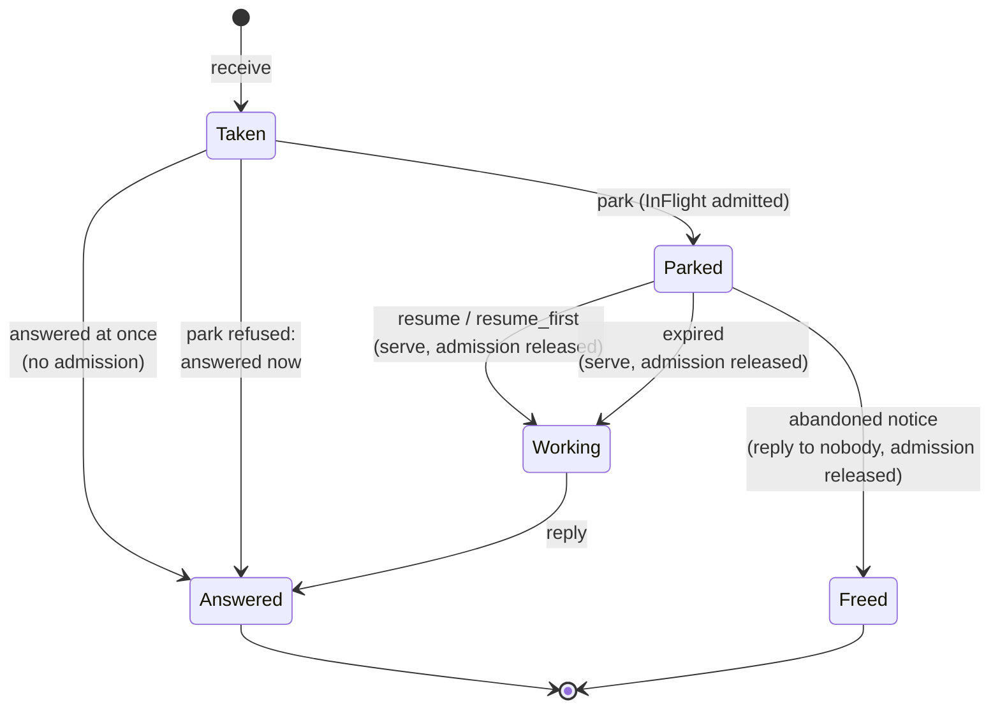
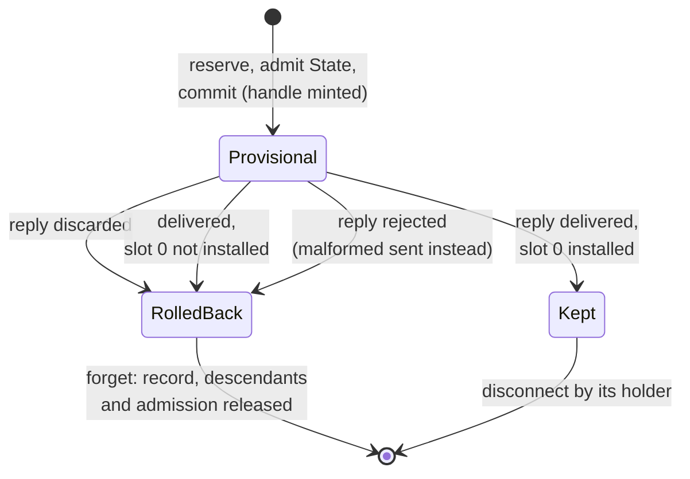

# The serving library

Every Redoubt server links one serving library, `redoubt_rt::server` in `libs/rt/src/server/`.
It holds the rules a shared server must never get wrong, written once: admission (how much one
client may hold in the server), the label check, the connections and grants a server mints for
its clients, calls parked for later, typed-message dispatch, and a 9P2000 server skeleton. It
also finishes every call, so that a reply that never reached its caller undoes what the request
made.

## Purpose

A shared server serves many principals from one `system`-class budget, where the kernel does not
check labels ([R1 (flow)](../kernel/ipc.md#r1-flow)) and does not bound what one client makes the
server hold. So each server needs the same answers: whose request is this, may it read or write
that object, how much of the server may it use, and what happens to a grant whose reply was lost.
Written once, those answers are tested once and cannot drift between servers.

## Interface

### `admit`

Status: built · tested: host:redoubt-rt::the_key_is_the_account_and_the_label_set, host:redoubt-rt::limits_are_per_key_and_per_resource, host:redoubt-rt::an_agent_flooding_a_bucket_leaves_its_sponsor_a_share, host:redoubt-rt::caps_are_big_enough_for_a_share_to_mean_anything, host:redoubt-rt::buckets_are_bounded_so_caps_fit, host:redoubt-rt::open_calls_leave_headroom, host:redoubt-rt::caps_fit_the_budget, host:redoubt-rt::released_keys_leave_the_table, host:redoubt-rt::an_override_is_its_root_badge_s_alone, host:redoubt-rt::overrides_are_sized_and_checked, host:redoubt-rt::the_worst_order_never_passes_the_headroom, host:redoubt-rt::fits_counts_overrides_at_their_caps

`Admission` (`libs/rt/src/server/admit.rs`) limits what one client may hold in a server at once,
per kind of resource:

| `Resource` | Counts |
| --- | --- |
| `InFlight` | calls the server has taken and holds open (parked calls) |
| `Files` | open files, or 9P fids |
| `State` | any other per-client state: connections and grants minted for the client |

- **Buckets.** Limits are kept per **bucket**, keyed by the caller's account and label set
  (`AdmitKey::of`, the one place the key is made). Accounts, not badges or budgets, because both
  of those are cheap to create. With the label set, so that a vault session filling a server's
  slots is invisible to its owner's unlabelled session, which shares the account. Account 0 (no
  principal: every `system`-class caller) is keyed by badge as well, so one daemon cannot fill a
  bucket the steward needs.
- **A fair share per badge.** Within a bucket each badge is a **share**, and the bucket is the
  ceiling. A share may take one more of a resource only while it holds less than
  `limit / (n + 1)` of it, where n is the number of shares in the bucket holding that resource,
  itself included (and at least one). So an agent flooding its sponsor's bucket alone gets half
  of it, and the sponsor can still take a third ([R26 (admission fairness)](#r26-admission-fairness)).
- **Caps sized to fit.** `Limits` names each resource's cap per bucket and the number of buckets
  that may hold anything at once. `Admission::new` refuses limits (`Unsized`) whose buckets could
  hold more open calls than `MAX_OPEN_CALLS` (64) less `OPEN_CALL_HEADROOM` (16), or with a
  non-zero cap below `SMALLEST_CAP` (2): below two, a lone badge's share is the whole bucket.
  `Limits::fits` says whether every bucket at its cap fits a budget of so many bytes; a server
  checks it against its own budget at start.
- **Overrides.** `Admission::with_overrides` gives named account-0 root badges (non-zero, below
  the minted range, each named once) caps of their own. The worst case, each override slot at the
  larger of its cap and the default, must still leave the headroom.
- **Refusal.** `admit` refuses when the bucket or the share is at its cap, when a new bucket is
  needed and `buckets` already hold something, or when there is no memory to track one more.
  Tables grow with `try_reserve`, and room for both entries is made before either changes, so a
  refusal changes nothing. `release` gives one back; an entry holding nothing leaves the table.

A request the server answers at once takes no admission. That is how a request that must always
get through, the sponsor ending a lease, is answered ahead of admission: straight from the
receive loop, never parked, in the headroom the caps leave.

### `check`

Status: built · tested: host:redoubt-rt::matches_the_set_definition, host:redoubt-rt::properties

`check(caller_labels, object_labels, access)` (`libs/rt/src/server/label.rs`) is the label check
([R25 (the label check)](#r25-the-label-check)). `Read` passes if the object's labels are a subset
of the caller's; `Write` only if they are equal. It compares sets: order and repeats do not
matter. The caller's labels are those the kernel attached to the message, never ones named in
it.

### Minted connections

Status: built · tested: host:redoubt-rt::the_first_badge_is_random_and_leaves_room, host:redoubt-rt::badges_are_never_reused_and_ids_are_never_zero, host:redoubt-rt::a_chain_a_client_minted_for_itself_folds_into_its_own_share, host:redoubt-rt::disconnect_frees_everything_minted_under_it_and_only_for_its_holder, host:redoubt-rt::disconnect_all_frees_everything_one_holder_minted, host:redoubt-rt::a_mint_that_fails_records_nothing, host:redoubt-rt::the_badge_space_runs_out_cleanly, host:redoubt-rt::a_strangers_id_is_refused_like_one_that_does_not_exist, host:redoubt-rt::minted_connections_are_admitted_and_fold_into_the_share_they_came_from

`Minted<T>` (`libs/rt/src/server/minted.rs`) is the table of capabilities a server mints for its
clients: a 9P server's connections (`new_connection`, `disconnect`) and a typed server's grants
(`grant`, `release`) alike, with a different payload `T`.

- **Two steps.** `reserve` draws the badge and a random id and reserves the record; `commit`
  mints the handle and records it. Between them the server has the last word (a file server's
  quota) before any handle exists. A dropped reservation mints nothing and spends no badge; a
  commit whose mint fails spends its badge and records nothing.
- **The badge** comes from a counter that only goes up, starting at a point drawn from the
  kernel's random words ([R27 (badge allocation)](#r27-badge-allocation)). Badges below
  `FIRST_MINTED_BADGE` (2^63) are the server's own, given meaning by whoever set it up; a badge
  at or above it that is not in the table is no capability at all.
- **The handle** is minted from the message in hand (`mint` naming the message id), so it carries
  the stamp of the handle the request came through and dies with it
  ([objects](../kernel/objects.md#mint)).
- **The id** is a random non-zero 64-bit word no live entry has, never a counter, which would
  tell every client how many the others made.
- **`disconnect(id)`** frees the entry with that id, and every entry minted under it, only for
  the client that received the id: the same badge, account and label set. Anyone else, and an id
  that does not exist, get the same `NotYours`. The table is kept in mint order, so the entry's
  descendants all follow it and one forward pass frees them. It allocates nothing, so it cannot
  stop halfway. `disconnect_all` frees everything one client minted, for a client that has lost
  its ids.
- **Shares.** A capability a client mints for itself counts in the share of the one it minted it
  through (`Minted::share` walks up the chain while the requester is the same client), so minting
  more badges buys no bigger share. One minted by someone else for a client (the steward, for a
  lease's agent) is a share of its own. Within account 0 every capability minted through a root
  badge counts in that root's share however deep the chain; the code departs from that rule
  (R26).

The server admits one `State` before reserving, gives it back if the mint fails, and gives it
back for each entry `disconnect` frees.

### Parked calls

Status: built · tested: host:redoubt-rt::parked_calls_are_served_abandoned_and_expired, host:redoubt-rt::parking_is_admitted_per_bucket_and_share, host:redoubt-rt::an_agent_flooding_a_bucket_leaves_its_sponsor_a_share_and_its_lease_end, host:redoubt-rt::a_waiting_write_is_parked_abandoned_and_expired

A server that cannot answer yet (a console read with no input, a connect waiting for the
network) **parks** the call rather than blocking or answering a default. `Parked<T>`
(`libs/rt/src/server/parked.rs`) holds the calls one thread has parked, each with the server's
state for it.

- **`park`** takes one `InFlight` from the caller's bucket and share, in the same `Admission`
  the server's fids are charged to, so a client cannot fill a server's fid table and its parked
  calls separately. A full bucket or share, or no memory, hands the request back to be answered
  now ([R28 (parked-call accounting)](#r28-parked-call-accounting)).
- **A server-side deadline.** Every parked call has one, at most the `longest` wait the table was
  made with. `expired` hands back the calls past it, for the server to answer with its protocol's
  timeout error; `next_deadline` bounds the thread's next `receive`. A server whose calls wait on a
  person (`consoled`, for a key press) passes `FOREVER`: its calls never expire, and what reclaims
  one is its caller giving up.
- **`serve` before resuming.** `resume`, `resume_first` and `expired` each make the call the
  thread's current call (`serve`) before handing it back, so a crash while working on it blames
  its caller and not whoever called last ([R21 (crash blame)](../kernel/processes.md#r21-crash-blame)).
  `resume_first` serves the call that has waited longest among those its test accepts.
- **Abandoned calls.** On an abandoned-call notice ([R3 (lends and abandoned calls)](../kernel/ipc.md#r3-lends-and-abandoned-calls)),
  `abandoned` replies to the call at once, which frees it and its lend (the reply reaches
  nobody), releases its admission and hands back the server's state.
- **One thread.** A call is replied to by the thread that took it, and its notice arrives at that
  thread's `receive`, so every serving thread keeps receiving on the endpoint its calls came in
  on. A thread that parked calls and stopped receiving would never learn they were abandoned.

*Figure: the life of a parked call. Admission is held exactly while the call is parked.*

### Typed dispatch

Status: built · tested: host:redoubt-rt::requests_replies_and_errors, host:redoubt-rt::handles_travel_and_unread_ones_come_back, host:redoubt-rt::malformed_requests_and_oversized_replies, host:redoubt-rt::random_words_never_panic, host:redoubt-rt::typed_replies_close_the_handles_made_for_the_caller, host:redoubt-rt::a_reply_that_cannot_be_encoded_gives_the_request_back

A typed server (`libs/rt/src/server/typed.rs`) names its protocol by implementing `Protocol`, a
few lines over the codecs generated from its wire table ([wire](wire.md)), and answers requests
by implementing `TypedServer::handle`. `serve_call` decodes the request, calls the server, and
replies with the encoded reply or the error's status.

- A request that does not decode, arrives with a handle slot empty (revoked on the way), or
  whose reply does not fit the lend is **malformed**: status 1, the same in every protocol. Its
  handles are closed unread.
- A reply names its handles and whether to close them once sent: true for a handle made for the
  caller (a minted connection), false for one the server keeps using.
- Typed messages are served as calls. A protocol's few one-way messages (`send`) are decoded by
  the server itself.

### The 9P server skeleton

Status: built · tested: fuzz:redoubt-rt/ninep_server, bench:r4-host-tests, host:redoubt-rt::the_9p_conformance_vectors_hold_for_a_minimal_server, host:redoubt-rt::attach_walk_open_read_write, host:redoubt-rt::dot_dot_never_leaves_the_attach_root, host:redoubt-rt::walk_names_are_components, host:redoubt-rt::depth_is_bounded, host:redoubt-rt::fids_are_bounded_per_connection_and_per_account, host:redoubt-rt::copies_of_one_badge_in_other_accounts_or_label_sets_share_nothing, host:redoubt-rt::offsets_counts_and_modes_are_not_trusted, host:redoubt-rt::malformed_requests_get_errors, host:redoubt-rt::random_requests_never_panic, host:redoubt-rt::labels_are_checked_on_every_request, host:redoubt-rt::unasked_handles_are_closed_and_other_opcodes_are_malformed, host:redoubt-rt::a_client_at_its_connection_cap_costs_the_server_no_walk

`NineServer` (`libs/rt/src/server/ninep.rs`) keeps a 9P2000 server's protocol state
(connections, fids, open modes, directory offsets) and applies every rule that does not depend on
what the files are. A `FileServer` supplies the files: `attach`, `walk`, `open`, `read`, `write`,
`create`, `remove`, `stat`, and `labels` for each node.

**On the wire.** A request whose word 0 is 0 is 9P: a `call` whose words are all zero, with the
T-message at the start of its lend; the R-message is written over it ([wire](wire.md)). Any other
word 0 is a typed opcode: 1 to 15 belong to `ninep_common`, which the skeleton serves itself, and
higher ones go to the server's own protocol (`serve_with`). A 9P call with a non-zero word or no
lend, or an unknown opcode in 1 to 15, is malformed. Handles sent with a 9P call are closed
unread.

**What the skeleton guarantees a `FileServer`,** whatever a client sends:
- At most `MAX_FIDS` (64) fids per connection, each admitted as a `Files` of its client; both
  limits are checked before the server is asked to attach or walk.
- Every fid is looked up; no request reaches the server for a fid that does not exist. Fids are
  keyed by badge, account and label set.
- Walk names are valid path components. A fid keeps the node and qid of every step from its attach
  root, so `..` is the step before and never a question to the server, and at the root it stays at
  the root. A fid is at most `MAX_COMPONENTS` below its root.
- Only directories are walked from or created in, and opened only for reading. Reads need a fid
  opened for reading, writes one opened for writing.
- `offset + count` never overflows; a read asks for at most what fits the caller's lend and the
  `msize`; a directory read continues only from where the last one ended.
- The label check runs on every request against the labels of the node named: `Read` on the
  attach root, on the directory walked from and every node walked into, on the node for `Tstat`,
  `Tread` and opening for reading, and on each directory entry listed (entries the caller cannot
  read are left out); `Write` on the node for `Twrite`, opening for writing, `OTRUNC` and
  `Tremove`, and on the directory for `Tcreate`.

**Protocol corners.** `Tversion` is accepted at any time and clunks every fid of the connection;
the `msize` is fixed. `Tauth` and `Twstat` are refused: access is by capability. `Tflush` is
answered at once, since requests are handled one at a time. An `Rerror` carries one of a fixed set
of texts, so a hostile request cannot choose it. Every allocation a request makes fails cleanly
with an `Rerror`, never by killing the server.

**`ninep_common`** (the table is on [wire](wire.md)): `new_connection(root, quota)` mints a
connection rooted at `root`, a path relative to the caller's own root, cleaned so it never climbs
above it and walked with the same label checks as a `Twalk`. It is admitted as a `State` of the
caller's share, and the file server's `minted` hook may refuse it (a quota it cannot grant).
`disconnect(id)` frees the connection and everything minted under it: their fids are clunked,
their admission released, and the file server told (`disconnected`). `mint_rooted` mints a
connection at a root the file server chose, in the same table, for a typed `grant` whose scope the
server has already checked ([ipd](ipd.md)).

**Waiting.** A read whose answer is not there yet (`Read::Wait`) or a write that cannot be taken
yet (`Write::Wait`) is not answered: `serve_parking` hands the request back with its T-message
still in its lend and its handles closed, the server parks it, and serves it again when it can.
Nothing of the request stays in the skeleton meanwhile, so a `Tclunk` or `Tversion` in between
makes the second serving an `Rerror`. A server that asks to wait through `serve_with`, which cannot
hand a call back, gets the call refused, never stranded.

**The conformance corpus.** `libs/wire/vectors/9p.txt` holds 9P2000 request and reply vectors.
Every 9P server runs them against its own skeleton (`libs/rt/tests/common/vectors.rs`): no vector
panics, every answer decodes and carries the request's tag, a malformed request gets an `Rerror`,
an R-message sent to a server is refused, and nothing a vector sends mints a connection.
`r4-host-tests` runs them for `bootfsd` and `consoled`.

### Replies and rollback

Status: built · partly tested: the rollback on a discarded reply is tested through unmint and keyd's grant, not through the 9P skeleton's serve path · tested: host:redoubt-rt::what_was_minted_here_can_be_undone, host:redoubt-rt::a_rooted_mint_is_an_ordinary_connection_rooted_where_the_server_says, host:redoubt-rt::mapping_reborrows_and_failed_reply_recovery, host:redoubt-rt::ownership_lifecycle_partial_reply_and_address_reuse, host:redoubt-keyd::serving_grant_rolls_back_discard_missing_capability_and_error

A successful `reply` says `delivered` or `discarded`, and which of the reply's handle slots were
installed in the caller ([IPC](../kernel/ipc.md#how-a-call-completes)). Reply success is not
acceptance: a caller can abandon a call after the server made a grant and before the reply
reached it. So a server that creates a connection or grant keeps it **provisional** until the
outcome is known:
- `discarded`, or `delivered` without every handle slot the new resource needs, rolls back the
  new record and its admission charge. `new_connection` and `keyd`'s `grant` need slot 0, the
  capability itself (`ReplyOutcome::accepted(1)`). No abandoned-call notice is needed to learn it.
- `Minted::answering` starts each request clean; `minted_here` names what the request minted, and
  `forget` (or `NineServer::unmint`) undoes it and everything under it.
- `delivered` means the kernel committed the reply record. It does not mean the caller read it,
  or that its handles survive a later revocation; ordinary `disconnect` and the admission caps
  bound what a client that vanishes afterwards leaves behind.

Rollback reaches only provisional records: a file write already made stays made. A bench case that
makes the skeleton's `new_connection` replies undeliverable is a follow-up:
[todo](../todo/ninep-discard-rollback-test.md).

**`finish`** is the one place a call is finished, for 9P, `ninep_common` and typed protocols
alike. It closes the handles that do not travel before replying, so a caller holding its reply
knows the server no longer holds them, and closes those that travel once the reply has copied
them. If the kernel rejects the reply, the call is still open: `finish` answers it with the
handle-free malformed reply, and if even that is rejected the server exits, so the caller gets
`Dead` ([R4b (a server dies)](../kernel/ipc.md#r4b-a-server-dies)) rather than waiting for good.

*Figure: the outcome of a reply that carries a new connection or grant.*

### Parking a typed call

Status: planned · M2 (usable shell)

A typed request that must wait (the console's `resize`, which returns when the window's size
changes) parks like a 9P read: the server's `handle` answers "wait", the dispatcher hands the
request back unanswered with its words and lend intact, and the server parks it in the same
`Admission` and serves it again later. Its admission, deadline, `serve` and abandonment follow
the rules of [parked calls](#parked-calls) exactly.

**Open:** how a typed server says "wait" (a third outcome of `TypedServer::handle`, or a separate
dispatch entry point like `serve_parking`); whether the waiting request's decoded fields are kept
or decoded again when it is served; which typed operations may park at all
([consoled](consoled.md)).

## Authority

Status: built · tested: host:redoubt-rt::a_strangers_id_is_refused_like_one_that_does_not_exist, host:redoubt-rt::unasked_handles_are_closed_and_other_opcodes_are_malformed, host:redoubt-rt::labels_are_checked_on_every_request

- **The library adds no authority.** It uses the server's own handles and the facts the kernel
  attaches to each message: badge, account and labels. It trusts nothing a request says about who
  sent it.
- **A badge is the grant.** What a badge below `FIRST_MINTED_BADGE` means is the server's, given
  by whoever set it up; a badge the table minted means what was recorded when it was minted.
- **Minting keeps the stamp.** A minted handle is stamped like the handle the request came
  through, so it is revoked with it ([R9 (stamps)](../kernel/objects.md#r9-stamps)).
- **Only the recipient of an id can name it.** `disconnect` and `release` check the requester's
  badge, account and label set, and answer a stranger as they answer an id that does not exist.
- **Unasked handles are closed.** Every handle a request carries that its protocol did not ask
  for is closed, so a client cannot grow the server's handle table.

## Security properties

### R25 (the label check)

Status: built · partly tested: the check and its use in the 9P skeleton are attacked in host tests; in a boot only `ipd`'s refusal of labelled callers is · tested: host:redoubt-rt::matches_the_set_definition, host:redoubt-rt::properties, host:redoubt-rt::labels_are_checked_on_every_request, host:redoubt-rt::every_write_needs_equal_labels, host:redoubt-rt::labelled_metadata_does_not_flow_down, host:redoubt-rt::an_unlabelled_caller_cannot_reach_labelled_data_to_destroy_or_probe_it, bench:d3-net-attacks

A system server lets information flow from an object to a caller only if the object's labels
are a subset of the caller's, and from a caller into an object only if their label sets are
equal. Metadata (a qid, a `stat`, a directory entry) is a read of its node. The caller's labels
are the ones the kernel attached to the message
([R14 (unforgeable sender)](../kernel/ipc.md#r14-unforgeable-sender)). With the kernel's R1
between user budgets, this makes every flow through a shared server one the kernel would have
allowed between the two budgets directly: a write then a read carries a's data to x only if x
could read a's labels itself (`properties` checks exactly that).

### R26 (admission fairness)

Status: built · partly tested: the library departs from the rule for an account-0 client's self-minted chain; the rule is attacked in host tests with the runtime's fake kernel, and no boot floods a real server · tested: host:redoubt-rt::the_key_is_the_account_and_the_label_set, host:redoubt-rt::an_agent_flooding_a_bucket_leaves_its_sponsor_a_share, host:redoubt-rt::an_agent_flooding_a_bucket_leaves_its_sponsor_a_share_and_its_lease_end, host:redoubt-rt::self_minting_does_not_multiply_the_share, host:redoubt-rt::caps_are_big_enough_for_a_share_to_mean_anything, host:redoubt-rt::open_calls_leave_headroom, host:redoubt-rt::the_worst_order_never_passes_the_headroom

One client cannot use up a shared server that serves others. What a client holds in a server is
counted per (account, label set), and per badge for account 0; within a bucket each badge may
hold less than `limit / (n + 1)`, so a lone badge never fills its bucket and a second always finds
room; minting more badges for oneself buys no bigger share; and every bucket at its cap together
holds fewer open calls than `MAX_OPEN_CALLS` by at least `OPEN_CALL_HEADROOM`, so the server keeps
room to take calls beyond what its clients hold, including one answered ahead of admission.
Within account 0, every capability minted through a root badge (one below `FIRST_MINTED_BADGE`,
given by whoever set the server up) counts in that root's share, however many links deep and
whoever holds it: a chain of self-mints spends one share, and system callers get separate shares
only from separate root badges, which the manifest gives. A capability used under a non-zero
account is keyed by that account. The kernel's [R2 (fair waiting)](../kernel/ipc.md#r2-fair-waiting)
shares turns at the endpoint the same way; this rule shares what the server holds afterwards.
The code departs from the account-0 rule: `Minted::share` stops folding when the requester's key
changes, so each self-minted link opens a bucket (Residual risks).

### R27 (badge allocation)

Status: built · tested: host:redoubt-rt::the_first_badge_is_random_and_leaves_room, host:redoubt-rt::badges_are_never_reused_and_ids_are_never_zero, host:redoubt-rt::the_badge_space_runs_out_cleanly, host:redoubt-rt::a_mint_that_fails_records_nothing

A server never gives out one badge twice. Its minted badges start at a point drawn uniformly from
2^62 values above 2^63, from the kernel's random words, and count up; the badge space runs out
rather than wrapping into the server's own badges. So a handle revoked in flight never reaches a
later connection, and two runs of a server (before and after a restart, on the same endpoint)
agree on a badge with probability 2^-62 per badge, not with certainty.

### R28 (parked-call accounting)

Status: built · partly tested: attacked in host tests with the runtime's fake kernel; `consoled` and `ipd`, which park, are attacked only in part in a boot · tested: host:redoubt-rt::parking_is_admitted_per_bucket_and_share, host:redoubt-rt::parked_calls_are_served_abandoned_and_expired, host:redoubt-rt::a_waiting_write_is_parked_abandoned_and_expired, bench:d3-net-pinned

A parked call holds exactly one `InFlight` of its caller's bucket and share, from `park` to the
moment it is resumed, expires or is abandoned; the caps keep every bucket's parked calls under
`MAX_OPEN_CALLS` with the headroom free; every parked call has a server-side deadline unless it
waits on a person; and an abandoned one is answered at once. So a client that parks calls and
walks away cannot pin a server's open calls ([R4a (open calls)](../kernel/ipc.md#r4a-open-calls)).
In `d3-net-pinned` a client abandons 64 parked reads at `ipd`, which answers and frees each one;
a read with nothing coming ends at `ipd`'s deadline, and the connection still works after.

## Failure and restart

Status: built · partly tested: the exit after a rejected fallback reply is argued from the code, not attacked · tested: host:redoubt-rt::a_reply_that_cannot_be_encoded_gives_the_request_back, host:redoubt-rt::a_held_9p_call_closes_what_it_brought_exactly_once, host:redoubt-rt::disconnect_all_frees_everything_one_holder_minted, host:redoubt-rt::a_panic_is_reported_on_the_console_once

- **A request the server cannot answer** (it does not decode, its reply does not fit) gets the
  malformed reply; a reply the kernel rejects is replaced by it; if that too is rejected the
  server exits rather than strand the caller (R4b).
- **The server panics.** The runtime's panic handler prints once on the console, runs the
  program's panic hook if it set one (`netd` resets its device there), and exits through
  `process_exit` with code 101. Holding open calls, that is a fault that blames the current
  call's sender (R21).
- **A client dies** holding connections or parked calls: its parked calls come back as
  abandoned-call notices and are freed. Its connections stay until its launcher disconnects them,
  or until a client that lost its ids calls `disconnect_all`.
- **The server restarts.** It keeps nothing: its tables start empty and its first badge is drawn
  again (R27). A client's old handle names no connection until it asks for a new one.

## Residual risks

- **An account-0 client can spend every bucket.** Account 0 is admitted per badge, so a
  `system`-class client minting connections for itself through a 9P server looks, through each
  new badge, like a new client: the share does not fold, and each link of the chain opens a fresh
  bucket, until the server's bucket count is spent and new connections are refused. This is the
  code departing from R26, which counts the whole chain in its root's share (`Minted::share`
  stops folding when the requester's key changes). `keyd` allows no chain (only a root badge may
  grant); the 9P skeleton cannot take that rule. Follow-up:
  [todo](../todo/account0-share-chain.md).
- **An undersized server is a channel.** A server sized for fewer buckets than the (account,
  label set)s it serves refuses the latecomers, which tells them others hold state: across
  accounts, and between the label sets of one account, where it is a channel out of a vault. The
  manifest must size each server's bucket count to the label sets it serves ([init](init.md)).
- **A full bucket makes the last comer wait.** With three or more badges in one bucket, the
  bucket can fill, and a further badge is refused until one gives something back.
- **A parked call costs its caller and the server.** Each holds one of the caller's
  `MAX_OPEN_CALLS` and one of the server's admission slots for as long as it waits. A console read
  has no deadline and is reclaimed only by its caller giving up.
- **A dead launcher leaks its children's connections** until its own connection is freed; the leak
  counts against its own account and label set, never another's.
- **Rollback ends at provisional state.** A client that abandons a request after the server
  performed a non-provisional effect (a file write) keeps the effect without learning of it.
- **The library's host tests are not in the bench.** No bench case runs `redoubt-rt`'s own tests,
  so a change can break them without a bench run noticing. Follow-up:
  [todo](../todo/host-tests-in-bench.md).
- **Admission counts objects, not bytes.** Bytes are the file server's to meter (`fsd`'s quotas);
  every other server keeps no byte count.

## Why

- **Buckets by account and label set.** Badges and budgets are cheap to create, so a limit per
  badge is no limit. An account is what a principal cannot multiply; the label set keeps a vault
  session's use of a server invisible to its owner's other sessions.
- **A fair share inside the bucket.** An agent shares its sponsor's account. Without shares it
  could fill the bucket for a lease's whole life and lock its sponsor out, even of ending the
  lease.
- **Headroom under `MAX_OPEN_CALLS`.** Parked calls count against the kernel's open-call limit;
  if the caps could reach it, the server could take no new call at all, including the one that
  would free the others.
- **A random first badge.** Endpoints outlive servers and a server keeps no state across a
  restart, so a restarted server that began at a fixed number would reissue badges its clients
  still hold, and their old handles would match its new grants.
- **Provisional until delivered.** A grant whose reply never arrived can never be disconnected,
  since only the recipient of its id can name it; left in place, it would hold its admission for
  the life of the server.
- **Written once and fuzzed.** 9P parses untrusted bytes; one skeleton, fuzzed and run against a
  shared corpus, is cheaper to trust than one per server.
