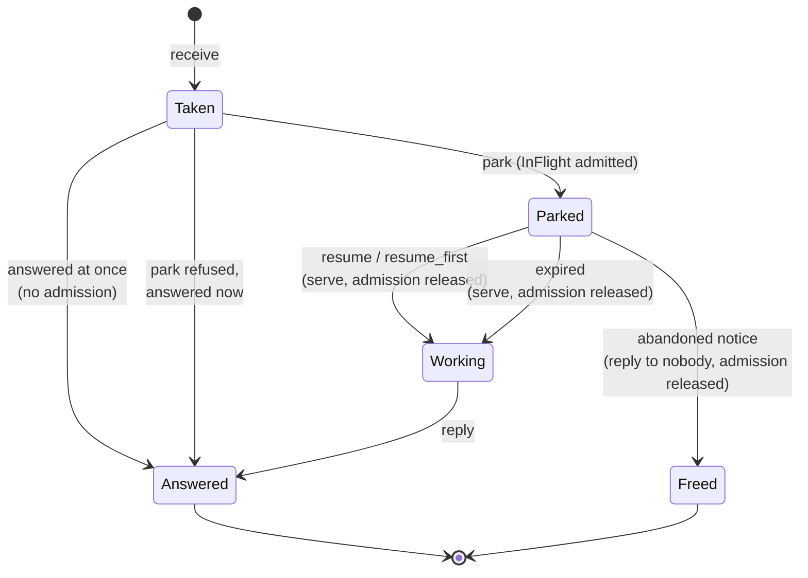
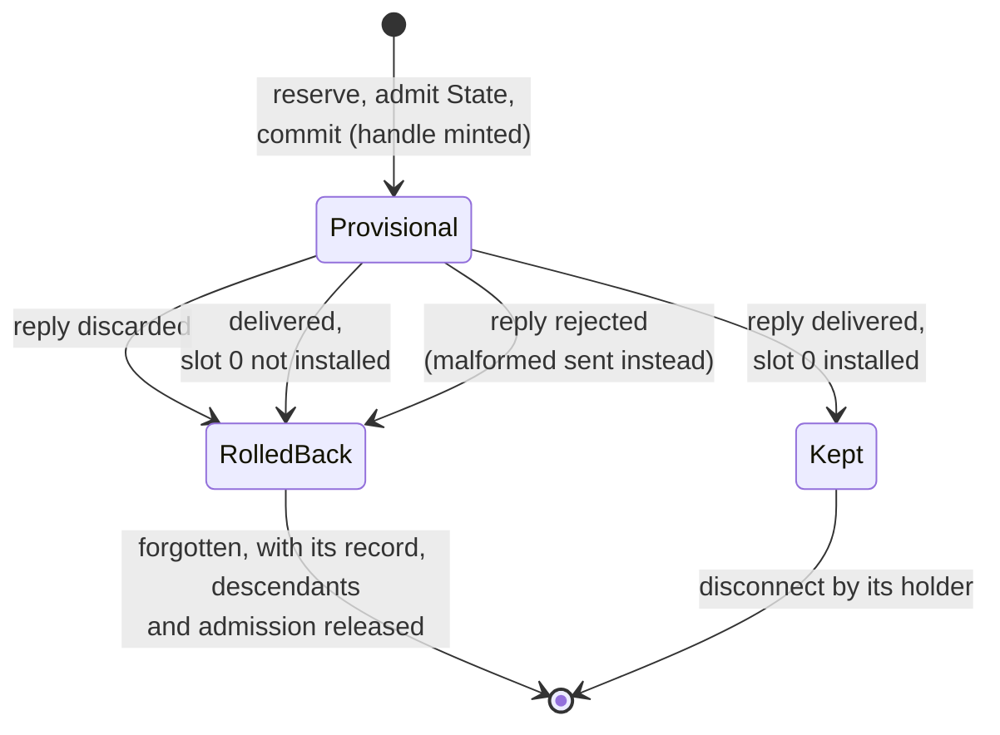

# The serving library

Every Redoubt server links one serving library, `redoubt_rt::server` in `libs/rt/src/server/`.
It holds the rules a shared server must never get wrong, written once: admission (how much one
client may hold in the server), the label check, the connections and grants a server mints for
its clients, calls parked for later, connections with many requests outstanding, typed-message
dispatch, and a 9P2000 server skeleton. It
also finishes every call, so that a reply that never reached its caller undoes what the request
made.

## Purpose

A shared server serves many principals from one `system`-class budget, where the kernel does not
check labels ([R1 (flow)](../kernel/ipc.md#r1-flow)) and does not bound what one client makes the
server hold. So each server needs the same answers: whose request is this, may it read or write
that object, how much of the server may it use, and what happens to a grant whose reply was lost.
Written once, those answers are tested once and cannot drift between servers.

## Interface

### `serve`

Status: built · tested (4)

- host:redoubt-rt::serve_answers_calls_and_closes_what_a_send_brought
- host:redoubt-rt::serve_survives_abandoned_and_exit_notices
- host:redoubt-rt::serve_exits_ok_when_the_endpoint_dies
- host:redoubt-rt::serve_exits_receive_failed_on_any_other_error

A server that takes only calls runs `redoubt_rt::server::serve`, the one receive loop. Each call
goes to the server's handler, which replies to it; a send is dropped and what it brought closed.
The endpoint's death ends the server with `OK`, and any other failure to receive with
`RECEIVE_FAILED` (3). A server whose handler must still reply or undo after an error keeps a
loop of its own, closing a send's handles with `close_delivery`: `consoled`, `netd` and `ipd`.

### `admit`

Status: built · tested (12)

- host:redoubt-rt::the_key_is_the_account_and_the_label_set
- host:redoubt-rt::limits_are_per_key_and_per_resource
- host:redoubt-rt::an_agent_flooding_a_bucket_leaves_its_sponsor_a_share
- host:redoubt-rt::caps_are_big_enough_for_a_share_to_mean_anything
- host:redoubt-rt::buckets_are_bounded_so_caps_fit
- host:redoubt-rt::open_calls_leave_headroom
- host:redoubt-rt::caps_fit_the_budget
- host:redoubt-rt::released_keys_leave_the_table
- host:redoubt-rt::an_override_is_its_root_badge_s_alone
- host:redoubt-rt::overrides_are_sized_and_checked
- host:redoubt-rt::the_worst_order_never_passes_the_headroom
- host:redoubt-rt::fits_counts_overrides_at_their_caps

`Admission` (`libs/rt/src/server/admit.rs`) limits what one client may hold in a server at once,
per kind of resource:

| `Resource` | Counts |
| --- | --- |
| `InFlight` | calls the server has taken and holds open (parked calls) |
| `Files` | open files, or 9P fids |
| `State` | any other per-client state: connections and grants minted for the client |
| `Requests` | a multiplexed connection's requests, each held until its answer is delivered ([multiplexed connections](#multiplexed-connections)) |
| `Pages` | the pages their transfers brought, one per page however many requests it carries, held until the last of its requests too long for the words is answered: one that fits them is copied out as it is taken |

`Requests` and `Pages` are both outside the open-call headroom, since a request is a send, not an
open call, and each has its own share ([R26](#r26-admission-fairness)).

- **Buckets.** Limits are kept per **bucket**, keyed by the caller's account and label set
  (`AdmitKey::of`, the one place the key is made). Accounts, not badges or budgets, because both
  of those are cheap to create. With the label set, so that a vault session filling a server's
  slots is invisible to its owner's unlabelled session, which shares the account. Account 0 (no
  principal: every `system`-class caller) is keyed by badge as well, so one daemon cannot fill a
  bucket the steward needs.
- **A fair share per badge.** Within a bucket each badge is a **share**, and the bucket is the
  ceiling. A share may take one more of a resource only while it holds less than
  `limit / (n + 1)` of it (and at least one), where n is the number of shares in the bucket
  holding that resource, itself included. So an agent flooding its sponsor's bucket alone gets
  half of it, and the sponsor can still take a third
  ([R26 (admission fairness)](#r26-admission-fairness)). An account-0 bucket is one badge, so it
  has one share and the bucket's cap is that share's.
- **Caps sized to fit.** `Limits` names each resource's cap per bucket and the number of buckets
  that may hold anything at once. `Admission::new` refuses limits (`Unsized`) whose buckets could
  hold more open calls than `MAX_OPEN_CALLS` (256) less `OPEN_CALL_HEADROOM` (64), or with a
  non-zero cap below `SMALLEST_CAP` (2): below two, a lone badge's share is the whole bucket.
  `Limits::fits` says whether every bucket at its cap fits a budget of so many bytes; a server
  checks it against its own budget at start.
- **Overrides.** `Admission::with_overrides` gives named account-0 root badges (non-zero, below
  the minted range, each named once) caps of their own. The worst case, each override slot at the
  larger of its cap and the default, must still leave the headroom.
- **Refusal.** `admit` refuses when the bucket or the share is at its cap, when a new bucket is
  needed and `buckets` already hold something, or when there is no memory to track one more.
  Tables grow with `try_reserve`, and room for both entries is made before either changes, so a
  refusal changes nothing. `release` gives one back; an entry holding nothing leaves the table.

A request the server answers at once takes no admission. That is how a request that must always
get through, the sponsor ending a lease, is answered ahead of admission: straight from the
receive loop, never parked, in the headroom the caps leave.

### `check`

Status: built · tested: host:redoubt-rt::matches_the_set_definition, host:redoubt-rt::properties

`check(caller_labels, object_labels, access)` (`libs/rt/src/server/label.rs`) is the label check
([R25 (the label check)](#r25-the-label-check)). `Read` passes if the object's labels are a subset
of the caller's; `Write` only if they are equal. It compares sets: order and repeats do not
matter. The caller's labels are those the kernel attached to the message, never ones named in
it.

### Minted connections

Status: built · tested (9)

- host:redoubt-rt::the_first_badge_is_random_and_leaves_room
- host:redoubt-rt::badges_are_never_reused_and_ids_are_never_zero
- host:redoubt-rt::a_chain_a_client_minted_for_itself_folds_into_its_own_share
- host:redoubt-rt::disconnect_frees_everything_minted_under_it_and_only_for_its_holder
- host:redoubt-rt::disconnect_all_frees_everything_one_holder_minted
- host:redoubt-rt::a_mint_that_fails_records_nothing
- host:redoubt-rt::the_badge_space_runs_out_cleanly
- host:redoubt-rt::a_strangers_id_is_refused_like_one_that_does_not_exist
- host:redoubt-rt::minted_connections_are_admitted_and_fold_into_the_share_they_came_from

`Minted<T>` (`libs/rt/src/server/minted.rs`) is the table of capabilities a server mints for its
clients: a 9P server's connections (`new_connection`, `disconnect`) and a typed server's grants
(`grant`, `release`) alike, with a different payload `T`.

- **Two steps.** `reserve` draws the badge and a random id and reserves the record; `commit`
  mints the handle and records it. Between them the server has the last word (a file server's
  quota) before any handle exists. A dropped reservation mints nothing and spends no badge; a
  commit whose mint fails spends its badge and records nothing.
- **The badge** comes from a counter that only goes up, starting at a point drawn from the
  kernel's random words ([R27 (badge allocation)](#r27-badge-allocation)). Badges below
  `FIRST_MINTED_BADGE` (2^63) are the server's own, given meaning by whoever set it up; a badge
  at or above it that is not in the table is no capability at all.
- **The handle** is minted from the message in hand (`mint` naming the message id), so it carries
  the stamp of the handle the request came through and dies with it
  ([objects](../kernel/objects.md#mint)).
- **The id** is a random non-zero 64-bit word no live entry has, never a counter, which would
  tell every client how many the others made.
- **`disconnect(id)`** frees the entry with that id, and every entry minted under it, only for
  the client that received the id: the same badge, account and label set. Anyone else, and an id
  that does not exist, get the same `NotYours`. The table is kept in mint order, so the entry's
  descendants all follow it and one forward pass frees them. It allocates nothing, so it cannot
  stop halfway. `disconnect_all` frees everything one client minted, for a client that has lost
  its ids; `keyd`'s `release(0)` reaches it, and no 9P operation does.
- **Shares.** A capability a client mints for itself counts in the share of the one it minted it
  through (`Minted::share` walks up the chain while the requester is the same client), so minting
  more badges buys no bigger share. One minted by someone else for a client (the steward, for a
  lease's agent) is a share of its own. Within account 0 every capability minted through a root
  badge counts in that root's share however deep the chain; the code departs from that rule
  (R26).

The server admits one `State` before reserving, gives it back if the mint fails, and gives it
back for each entry `disconnect` frees.

### Parked calls

Status: built · tested (4)

- host:redoubt-rt::parked_calls_are_served_abandoned_and_expired
- host:redoubt-rt::parking_is_admitted_per_bucket_and_share
- host:redoubt-rt::an_agent_flooding_a_bucket_leaves_its_sponsor_a_share_and_its_lease_end
- host:redoubt-rt::a_waiting_write_is_parked_abandoned_and_expired

A server that cannot answer yet (a console read with no input, a connect waiting for the
network) **parks** the call rather than blocking or answering a default. `Parked<T>`
(`libs/rt/src/server/parked.rs`) holds the calls one thread has parked, each with the server's
state for it.

- **`park`** takes one `InFlight` from the caller's bucket and share, in the same `Admission`
  the server's fids are charged to, so a client cannot fill a server's fid table and its parked
  calls separately. A full bucket or share, or no memory, hands the request back to be answered
  now ([R28 (parked-call accounting)](#r28-parked-call-accounting)).
- **A server-side deadline.** Every parked call has one, at most the `longest` wait the table was
  made with. `expired` hands back the calls past it, for the server to answer with its protocol's
  timeout error; `next_deadline` bounds the thread's next `receive`. A server whose calls wait on a
  person (`consoled`, for a key press) passes `FOREVER`: its calls never expire, and what reclaims
  one is its caller giving up.
- **`serve` before resuming.** `resume`, `resume_first` and `expired` each make the call the
  thread's current call (`serve`) before handing it back, so a crash while working on it blames
  its caller and not whoever called last ([R21 (crash blame)](../kernel/processes.md#r21-crash-blame)).
  `resume_first` serves the call that has waited longest among those its test accepts.
- **Abandoned calls.** On an abandoned-call notice ([R3 (lends and abandoned calls)](../kernel/ipc.md#r3-lends-and-abandoned-calls)),
  `abandoned` replies to the call at once, which frees it and its lend (the reply reaches
  nobody), releases its admission and hands back the server's state.
- **One thread.** A call is replied to by the thread that took it, and its notice arrives at that
  thread's `receive`, so every serving thread keeps receiving on the endpoint its calls came in
  on. A thread that parked calls and stopped receiving would never learn they were abandoned.
- **A server never pushes.** Delivery the server starts is a call the client makes and the server
  parks, answered when the event happens (a console's `resize`); no endpoint is ever handed to the
  server for it, and the client calls again for the next event.

```mermaid
stateDiagram-v2
    [*] --> Taken: receive
    Taken --> Answered: answered at once<br/>(no admission)
    Taken --> Parked: park (InFlight admitted)
    Taken --> Answered: park refused,<br/>answered now
    Parked --> Working: resume / resume_first<br/>(serve, admission released)
    Parked --> Working: expired<br/>(serve, admission released)
    Parked --> Freed: abandoned notice<br/>(reply to nobody, admission released)
    Working --> Answered: reply
    Answered --> [*]
    Freed --> [*]
```
*Figure: the life of a parked call. Admission is held exactly while the call is parked.*

### Multiplexed connections

Status: built · partly tested: attacked in host tests with the runtime's fake kernel; a boot runs it only in `aio-many-reads` and `aio-many-reads-two` · tested (14)

- bench:aio-many-reads
- bench:aio-many-reads-two
- host:redoubt-rt::a_sends_pages_count_once_and_go_back_with_its_last_request
- host:redoubt-rt::a_parked_read_sent_in_a_page_leaves_the_page_to_a_write
- host:redoubt-rt::a_completion_call_is_held_at_most_its_hold_and_the_servers_bound
- host:redoubt-rt::a_never_polling_client_holds_only_its_share
- host:redoubt-rt::death_with_requests_parked_frees_the_connection
- host:redoubt-rt::a_death_between_completion_calls_is_found_at_the_session_bound
- host:redoubt-rt::a_request_late_in_a_hold_leaves_the_session_its_whole_bound
- host:redoubt-rt::a_flush_racing_a_completion_answers_once
- host:redoubt-rt::a_flood_of_sends_at_wait_cap_never_blocks_the_server
- host:redoubt-rt::a_reused_or_out_of_range_tag_ends_the_connection
- host:redoubt-rt::a_second_completion_call_is_refused
- fuzz:redoubt-rt/ninep_server

A call holds its caller's thread until the reply, so a client with one call per request needs a
thread per outstanding request. The 9P skeleton also serves a connection **multiplexed**: many
requests outstanding on its one badge, sent without waiting, and answered together through one
long-poll call. Both ways are served on one endpoint, and a client may use both on one
connection; the client half is the client library's hub
([native programs](../userland/native.md#many-requests-at-once)).
(`libs/rt/src/server/ninep_mux.rs`.)

- **A request** is a `send` on the connection's badge with word 0 = 0: one T-message, packed into
  words 1 to 3 (three machine words: 24 bytes on rv64, 12 on rv32), or one or more T-messages end
  to end at the start of a transfer, word 1 their length, so 64 reads cost one page on either
  width. A T-message that fits the words (24 bytes, three 64-bit words, on either width) is kept
  in the request's own record whichever way it came, copied out of its page as it is taken, so a
  page is held only by requests too long for that: on rv32, where every read comes in a page, a
  read that waits (a console's, for typing) pins no page. A send is never an open call, so the server takes requests even while it holds
  `MAX_OPEN_CALLS` ([R4a (open calls)](../kernel/ipc.md#r4a-open-calls)), and it never waits on
  the client: everything it says goes back as a reply.
- **The completion call** is a 9P call with words `[0, COLLECT, hold, 0]` (`COLLECT` is 1) and a
  lend: the server holds it at most `hold` µs or the **session bound**, whichever is shorter (the
  server's longest wait or `COLLECT_WAIT`, 10 s, whichever is shorter), and `hold` 0 answers at
  once. The first opens the connection's **session**, answered at once with 1
  in word 2; the server holds nothing for a connection before it, and drops a request that comes
  with no session open. Later ones are parked, one at a time (a second is malformed), and answered
  `[0, bytes, 0, 0]` with R-messages end to end at the front of the lend, or empty when the hold
  runs out. The client's own timeout on the call is its hold and a margin (`COLLECT_MARGIN_US`,
  1 s), so a client waits until its next deadline and abandons nothing, and a completion call
  that times out means the server broke its promise.
- **Served only into a parked completion call's lend.** Requests are answered when a completion
  call is parked, straight into its lend, in the order they came: nothing is copied out or held
  in the server, and a request waiting for a call holds its admission. A read is served only where
  its whole count fits what is left of the lend, so packing never shortens a read; the rest wait
  for the next call. A
  request the file server asks to hold (`Read::Wait`) stays where it is, served again at the next
  completion call, the next request, or the server's wake-up, and is answered `Rerror` "timeout"
  at the server's deadline for it (none for `consoled`, whose reads wait on a person).
- **Tags.** At most `MAX_TAGS` (256) are outstanding on a connection: a request's tag from its
  arrival until its answer is delivered. A tag in use or out of range, a message that does not
  frame, or a `Tversion` (whose tag is `NOTAG`) is a protocol error, which ends the session.
- **Flush.** `Tflush(oldtag)` drops oldtag's request when it arrives, and is answered `Rflush` in
  its turn. Whatever was delivered for oldtag was delivered before, so a client sees an answer
  then `Rflush`, or `Rflush` alone, and never an answer after it (intro(5), flush).
- **Admission** ([R77 (multiplexed requests)](#r77-multiplexed-requests)). The session holds one
  `InFlight` of the connection's bucket and share for its completion call, its one open call. Each
  request holds one `Requests`, and the pages a send brought one `Pages` each, counted once for the
  send and held until the last of its requests too long for the words is answered or dropped (a
  send whose requests all fit them holds no page past its taking); each resource has its own
  share. A request that would take its badge past either share is not served: its tag joins the
  session's refused set, a 256-bit map, answered `Rerror` "busy" first in the next completion
  call. Pages the share cannot pay for refuse every request they came with, and go at once; a
  batched page whose requests are partly refused is held only by those admitted.
- **The end.** The session ends when its completion call is abandoned (its client died or gave up:
  [R3 (lends and abandoned calls)](../kernel/ipc.md#r3-lends-and-abandoned-calls)), when a reply
  to it reaches nobody, at a protocol error, at the connection's `disconnect`, and when no
  completion call has been parked for the session bound since the last returned. Every request
  goes with it, its admission released, and a parked completion call is answered status 4. So a
  client that dies between two completion calls is found at the session bound, and a live client
  keeps a completion call parked whenever it has requests outstanding.
- **Crash blame.** Requests are served with the completion call as the thread's current call, so
  a crash while serving them blames their client
  ([R21 (crash blame)](../kernel/processes.md#r21-crash-blame)).

**Who runs it.** A 9P server runs `NineServer::run`: calls, sends, transfers of up to
`MAX_LEND_PAGES`, abandoned-call notices and deadlines (`littlefsd`, `bootfsd`). One that keeps state
beside its files runs `run_around` with its `Around`, which is given the calls, the abandoned-call
notices that are no completion call's, and a turn before each receive, after what the deadlines made
due, for whatever moved since: `consoled` parks its own reads, and at each turn reads its UART and
serves again the reads that wait for input. `ipd` keeps a loop of its own: it polls its network
stack only after a `receive` that returned no call, so never with a call current
([R21](../kernel/processes.md#r21-crash-blame)), receives without waiting after each call, takes
frames from `netd`, and bounds each wait by its stack's timers and its link's retry, so hooks for
all of that would be its loop again. It hands each send to `deliver` and each abandoned-call notice
to `abandoned` first, calls `expire` and bounds its `receive` by `next_deadline`, and calls `wake`
after each poll. `sshd`'s driver keeps one too, around its channel's console, for the same reasons
(the SSH core and its reader's calls), and does the same, calling `wake` after each turn of the
core. A loop of its own owes all of this: a server that never calls `expire`, or receives without
the bound, never answers a parked completion call at its hold, so a client whose console is quiet
for longer than its hold and margin reads the server's silence and its session ends. A `receive`
bounded so that runs out (`Timeout`) is a turn, never the server's end. A file server that pays
for what a request makes around it does so in the `serving` and `served` hooks (`ipd`'s sockets,
[ipd](ipd.md)).

### Typed dispatch

Status: built · tested (5)

- host:redoubt-rt::requests_replies_and_errors
- host:redoubt-rt::handles_travel_and_unread_ones_come_back
- host:redoubt-rt::malformed_requests_and_oversized_replies
- host:redoubt-rt::random_words_never_panic
- host:redoubt-rt::typed_replies_close_the_handles_made_for_the_caller

A typed server (`libs/rt/src/server/typed.rs`) names its protocol by implementing `Protocol`, a
few lines over the codecs generated from its wire table ([wire](wire.md)), and answers requests
by implementing `TypedServer::handle`. `serve_call` decodes the request, calls the server, and
replies with the encoded reply or the error's status.

- A request that does not decode, arrives with a handle slot empty (revoked on the way), or
  whose reply does not fit the lend is **malformed**: status 1, the same in every protocol. Its
  handles are closed unread.
- A reply names its handles and whether to close them once sent: true for a handle made for the
  caller (a minted connection), false for one the server keeps using.
- Typed messages are served as calls. A protocol's few one-way messages (`send`) are decoded by
  the server itself.

### The 9P server skeleton

Status: built · tested (16)

- fuzz:redoubt-rt/ninep_server
- bench:r4-host-tests
- host:redoubt-rt::the_9p_conformance_vectors_hold_for_a_minimal_server
- host:redoubt-rt::attach_walk_open_read_write
- host:redoubt-rt::dot_dot_never_leaves_the_attach_root
- host:redoubt-rt::walk_names_are_components
- host:redoubt-rt::depth_is_bounded
- host:redoubt-rt::fids_are_bounded_per_connection_and_per_account
- host:redoubt-rt::copies_of_one_badge_in_other_accounts_or_label_sets_share_nothing
- host:redoubt-rt::a_typed_operation_resolves_only_the_callers_own_fids
- host:redoubt-rt::offsets_counts_and_modes_are_not_trusted
- host:redoubt-rt::malformed_requests_get_errors
- host:redoubt-rt::random_requests_never_panic
- host:redoubt-rt::labels_are_checked_on_every_request
- host:redoubt-rt::unasked_handles_are_closed_and_other_opcodes_are_malformed
- host:redoubt-rt::a_client_at_its_connection_cap_costs_the_server_no_walk

`NineServer` (`libs/rt/src/server/ninep.rs`) keeps a 9P2000 server's protocol state
(connections, fids, open modes, directory offsets) and applies every rule that does not depend on
what the files are. A `FileServer` supplies the files: `attach`, `walk`, `open`, `read`, `write`,
`create`, `remove`, `stat`, and `labels` for each node.

**Beside the skeleton,** the volume servers (`littlefsd`, `walfsd`, `erofsd`, and `verityd` on
`blkd`'s protocol) share `redoubt-fileserver` (`libs/fileserver`): the arguments `init` passes
them, `endpoint=NAME` and `labels=ID[,ID...]`, parsed once under the manifest's rules
(host:redoubt-fileserver::arguments_it_does_not_understand_stop_it_before_serving,
host:redoubt-fileserver::a_number_and_a_label_set_follow_the_manifests_rules); and their range,
`blkd`'s protocol on the `volume` badge ([blkd](blkd.md#messages)) or a `verityd`'s, as a format
needs it (`Range`: whole sectors read, written and flushed, and bytes from any offset for a
format whose structures are not sector-aligned,
host:redoubt-fileserver::a_byte_read_over_a_sector_range_reads_whole_sectors) with the one client
of the protocol (`Blkd`), which checks every reply before it is believed, splits a read at
`MAX_SECTORS`, the limit `blkd` and its clients take from the wire crate's `blkd` module, and
refuses a read of part of a sector as a fault
(host:redoubt-fileserver::reads_split_at_the_lend_and_part_of_a_sector_is_a_fault). The
servers' host tests drive the client against a fake `blkd`, and their files against one range in
memory, the crate's `Memory` (feature `test-support`, never in a target build). `littlefsd` and
`walfsd` share the quota ledger too ([littlefsd](littlefsd.md#quotas)): what each live root holds
and keeps in reserve, told every change by its server, which counts a root when it goes live
(host:redoubt-fileserver::a_mint_at_a_new_root_counts_it_and_charges_the_root_above,
host:redoubt-fileserver::a_mint_past_the_room_above_is_refused,
host:redoubt-fileserver::a_quota_at_the_granters_own_root_is_refused,
host:redoubt-fileserver::connections_at_one_root_sum_and_the_last_disconnect_returns_its_bytes,
host:redoubt-fileserver::a_root_over_its_quota_after_a_disconnect_grows_no_further); the
servers' quota tests drive it through their 9P. What a format needs of its medium stays with its
server: how a range is mounted as its blocks, and the files.

**On the wire.** A request whose word 0 is 0 is 9P: a `call` whose words are all zero, with the
T-message at the start of its lend; the R-message is written over it ([wire](wire.md)). Any other
word 0 is a typed opcode: 1 to 15 belong to `ninep_common`, which the skeleton serves itself, and
higher ones go to the server's own protocol (`serve_with`). A 9P call with a non-zero word or no
lend, or an unknown opcode in 1 to 15, is malformed, except a multiplexed connection's completion
call, words `[0, 1, hold, 0]` ([multiplexed connections](#multiplexed-connections)). Handles sent
with a 9P call are closed unread.

**What the skeleton guarantees a `FileServer`,** whatever a client sends:
- At most `MAX_FIDS` (64) fids per connection, each admitted as a `Files` of its client; both
  limits are checked before the server is asked to attach or walk.
- Every fid is looked up; no request reaches the server for a fid that does not exist. Fids are
  keyed by badge, account and label set.
- Walk names are valid path components. A fid keeps the node and qid of every step from its attach
  root, so `..` is the step before and never a question to the server, and at the root it stays at
  the root. A fid is at most `MAX_COMPONENTS` below its root.
- Only directories are walked from or created in, and opened only for reading. Reads need a fid
  opened for reading, writes one opened for writing.
- `offset + count` never overflows; a read asks for at most what fits the caller's lend and the
  `msize`; a directory read continues only from where the last one ended.
- The label check runs on every request against the labels of the node named: `Read` on the
  attach root, on the directory walked from and every node walked into, on the node for `Tstat`,
  `Tread` and opening for reading, and on each directory entry listed (entries the caller cannot
  read are left out); `Write` on the node for `Twrite`, opening for writing, `OTRUNC` and
  `Tremove`, and on the directory for `Tcreate`.

**Protocol corners.** `Tversion` is accepted at any time and clunks every fid of the connection;
the `msize` is fixed. `Tauth` and `Twstat` are refused: access is by capability. `Tflush` on a
call is answered at once, since a call's request is handled whole; on a multiplexed connection it
drops the request it names ([multiplexed connections](#multiplexed-connections)). An `Rerror`
carries one of a fixed set of texts, so a hostile request cannot choose it. Every allocation a
request makes fails cleanly with an `Rerror`, never by killing the server.

**`ninep_common`** (the table is on [wire](wire.md)): `new_connection(root, quota)` mints a
connection rooted at `root`, a path relative to the caller's own root, cleaned so it never climbs
above it and walked with the same label checks as a `Twalk`. A mint at the caller's own root (an
empty path) walks nothing and reads nothing: the reply carries a handle and an id, no qid, and the
first read of that root is the holder's `Tattach`, checked against the holder's labels like every
request after it, so a server may hand out a connection to data it cannot read itself and learns
nothing by it. It is admitted as a `State` of the caller's share, and the file server's `minted` hook may refuse it (a quota it cannot grant).
`disconnect(id)` frees the connection and everything minted under it: their fids are clunked,
their admission released, and the file server told (`disconnected`). `mint_rooted` mints a
connection at a root the file server chose, in the same table, for a typed `grant` whose scope the
server has already checked ([ipd](ipd.md)).

**Waiting.** A read whose answer is not there yet (`Read::Wait`) or a write that cannot be taken
yet (`Write::Wait`) is not answered: `serve_parking` hands the request back with its T-message
still in its lend and its handles closed, the server parks it, and serves it again when it can.
Nothing of the request stays in the skeleton meanwhile, so a `Tclunk` or `Tversion` in between
makes the second serving an `Rerror`. A server that asks to wait through `serve_with`, which cannot
hand a call back, gets the call refused, never stranded.

**The conformance corpus.** `libs/wire/vectors/9p.txt` holds 9P2000 request and reply vectors.
Every 9P server runs them against its own skeleton (`libs/rt/fake/src/vectors.rs`): no vector
panics, every answer decodes and carries the request's tag, a malformed request gets an `Rerror`,
an R-message sent to a server is refused, and nothing a vector sends mints a connection.
`r4-host-tests` runs them for `bootfsd` and `consoled`.

### Replies and rollback

Status: built · partly tested: the exit when even the malformed reply is rejected is host-tested only, since no caller can make the kernel reject it · tested (7)

- bench:ninep-newconn-discard
- bench:init-rollback
- bench:init-restart
- host:redoubt-rt::what_was_minted_here_can_be_undone
- host:redoubt-rt::a_rooted_mint_is_an_ordinary_connection_rooted_where_the_server_says
- host:redoubt-rt::mapping_reborrows_and_failed_reply_recovery
- host:redoubt-keyd::serving_grant_rolls_back_discard_missing_capability_and_error

A successful `reply` says `delivered` or `discarded`, and which of the reply's handle slots were
installed in the caller ([IPC](../kernel/ipc.md#how-a-call-completes)). Reply success is not
acceptance: a caller can abandon a call after the server made a grant and before the reply
reached it. So a server that creates a connection or grant keeps it **provisional** until the
outcome is known:
- `discarded`, or `delivered` without every handle slot the new resource needs, rolls back the
  new record and its admission charge. `new_connection` and `keyd`'s `grant` need slot 0, the
  capability itself (`ReplyOutcome::accepted(1)`). No abandoned-call notice is needed to learn it.
- `Minted::answering` starts each request clean; `minted_here` names what the request minted, and
  `forget` (or `NineServer::unmint`) undoes it and everything under it.
- `delivered` means the kernel committed the reply record. It does not mean the caller read it,
  or that its handles survive a later revocation; ordinary `disconnect` and the admission caps
  bound what a client that vanishes afterwards leaves behind.

Rollback reaches only provisional records: a file write already made stays made. An operation
that makes more than one resource needs an explicit policy for each: which of them a missing slot
rolls back. The bench attacks the skeleton's own serve path: a client whose handle table is full
has every `new_connection` reply's capability dropped by the kernel, more times than its bucket
holds, and the server's tables show each one rolled back (`ninep-newconn-discard`).

**`finish`** is the one place a call is finished, for 9P, `ninep_common` and typed protocols
alike. It closes the handles that do not travel before replying, so a caller holding its reply
knows the server no longer holds them, and closes those that travel once the reply has copied
them. If the kernel rejects the reply, the call is still open: `finish` answers it with the
handle-free malformed reply, and if even that is rejected the server exits, so the caller gets
`Dead` ([R4b (a server dies)](../kernel/ipc.md#r4b-a-server-dies)) rather than waiting for good.

```mermaid
stateDiagram-v2
    [*] --> Provisional: reserve, admit State,<br/>commit (handle minted)
    Provisional --> Kept: reply delivered,<br/>slot 0 installed
    Provisional --> RolledBack: reply discarded
    Provisional --> RolledBack: delivered,<br/>slot 0 not installed
    Provisional --> RolledBack: reply rejected<br/>(malformed sent instead)
    RolledBack --> [*]: forgotten, with its record, descendants<br/>and admission released
    Kept --> [*]: disconnect by its holder
```
*Figure: the outcome of a reply that carries a new connection or grant.*

### Parking a typed call

Status: planned · M2 (usable shell)

A typed request that must wait (the console's `resize`, which returns when the window's size
changes) parks like a 9P read: the server's `handle` answers "wait", the dispatcher hands the
request back unanswered with its words and lend intact, and the server parks it in the same
`Admission` and serves it again later. Its admission, deadline, `serve` and abandonment follow
the rules of [parked calls](#parked-calls) exactly.

**Open:** how a typed server says "wait" (a third outcome of `TypedServer::handle`, or a separate
dispatch entry point like `serve_parking`); whether the waiting request's decoded fields are kept
or decoded again when it is served; which typed operations may park at all
([consoled](consoled.md)).

## Authority

Status: built · tested (8)

- host:redoubt-rt::a_strangers_id_is_refused_like_one_that_does_not_exist
- host:redoubt-rt::unasked_handles_are_closed_and_other_opcodes_are_malformed
- host:redoubt-rt::labels_are_checked_on_every_request
- host:redoubt-rt::a_hostile_client_does_not_hurt_the_server_or_other_clients
- host:redoubt-rt::parked_calls_are_served_abandoned_and_expired
- host:redoubt-consoled::a_refused_typed_request_leaves_no_handle_behind
- host:redoubt-rt::a_dropped_request_is_refused_and_closes_what_it_carried
- host:redoubt-rt::a_rejected_reply_closes_no_carried_handle_twice

- **The library adds no authority.** It uses the server's own handles and the facts the kernel
  attaches to each message: badge, account and labels. It trusts nothing a request says about who
  sent it.
- **A badge is the grant.** What a badge below `FIRST_MINTED_BADGE` means is the server's, given
  by whoever set it up; a badge the table minted means what was recorded when it was minted.
- **Minting keeps the stamp.** A minted handle is stamped like the handle the request came
  through, so it is revoked with it ([R9 (stamps)](../kernel/objects.md#r9-stamps)).
- **Only the recipient of an id can name it.** `disconnect` and `release` check the requester's
  badge, account and label set, and answer a stranger as they answer an id that does not exist.
- **Unasked handles are closed.** Every handle a request carries that its protocol did not ask
  for is closed, so a client cannot grow the server's handle table.
- **A refusal closes what it refuses.** A request is answered through `finish`, which closes the
  handles that do not travel, or through a refusal built on it: `refuse` (a 9P `Rerror`),
  `refuse_malformed` (a typed opcode the server does not serve: what `NineServer::serve` and
  `consoled` answer) and `Parked::abandoned`. None of them leaves a carried handle open. The
  places the runtime and the servers combine the raw calls (`Request::reply`, `Request::serve`,
  `handle::close`) with the owning views (`Request`, `Delivery`, `Parked`, `NineServer`):
  - `NineServer::serve`'s answer to a typed opcode, `serve_with`'s answer to a wait it cannot
    hold, and `consoled`'s own-protocol callback replied raw and kept the handles: now
    `refuse_malformed`.
  - `refuse` and `Parked::abandoned` closed nothing; their requests had already been emptied by
    `serve_parking`, but a server may park any request: both now close what it still carries.
  - `finish`'s fallback reply after a rejected one: the handles were closed before the first
    try, so it carries none. Sound.
  - `Parked::resume`'s `Request::serve` changes which call a fault blames, not what it holds.
    Sound.
  - Every server's `Event::Send` arm closes the delivery's handles, in `serve` or with
    `close_delivery`; a `Delivery` owns none of them. Sound. `serve_parking` closes a held
    call's handles and empties its list, so
    serving it again cannot close them twice. Sound.
  - `Request::reply` is the library's alone (a `compile_fail` test in `ipc.rs`), so there is no
    raw reply left to add, and a `Request` dropped unanswered is refused: its carried handles
    are closed and the caller gets the malformed reply.

## Security properties

### R25 (the label check)

Status: built · tested (9)

- host:redoubt-rt::matches_the_set_definition
- host:redoubt-rt::properties
- host:redoubt-rt::labels_are_checked_on_every_request
- host:redoubt-rt::every_write_needs_equal_labels
- host:redoubt-rt::labelled_metadata_does_not_flow_down
- host:redoubt-rt::an_unlabelled_caller_cannot_reach_labelled_data_to_destroy_or_probe_it
- host:redoubt-rt::a_mint_at_its_own_root_reads_nothing
- bench:net-attacks
- bench:littlefsd-label-check

A system server lets information flow from an object to a caller only if the object's labels
are a subset of the caller's, and from a caller into an object only if their label sets are
equal. Metadata (a qid, a `stat`, a directory entry) is a read of its node. The caller's labels
are the ones the kernel attached to the message
([R14 (unforgeable sender)](../kernel/ipc.md#r14-unforgeable-sender)). With the kernel's R1
between user budgets, this makes every flow through a shared server one the kernel would have
allowed between the two budgets directly: a write then a read carries a's data to x only if x
could read a's labels itself (`properties` checks exactly that). Minting a connection is not a
read: nothing of the node flows to the minter, and the holder's requests are checked against the
holder's labels.

### R26 (admission fairness)

Status: built · partly tested: the rule is attacked in host tests with the runtime's fake kernel, and no boot floods a real server · tested (14)

- host:redoubt-rt::the_key_is_the_account_and_the_label_set
- host:redoubt-rt::an_agent_flooding_a_bucket_leaves_its_sponsor_a_share
- host:redoubt-rt::an_agent_flooding_a_bucket_leaves_its_sponsor_a_share_and_its_lease_end
- host:redoubt-rt::self_minting_does_not_multiply_the_share
- host:redoubt-rt::an_account_0_chain_holds_one_bucket
- host:redoubt-rt::an_account_0_rooted_chain_holds_one_bucket
- host:redoubt-rt::caps_are_big_enough_for_a_share_to_mean_anything
- host:redoubt-rt::open_calls_leave_headroom
- host:redoubt-rt::the_worst_order_never_passes_the_headroom
- host:redoubt-rt::a_bucket_count_is_given_once_and_never_defaulted
- host:redoubt-bootfsd::a_bad_public_list_stops_the_server
- host:redoubt-consoled::a_console_with_no_device_does_not_start
- host:redoubt-keyd::bad_key_arguments_stop_keyd_starting
- host:redoubt-ipd::every_scope_and_the_milestone_parse

One client cannot use up a shared server that serves others. What a client holds in a server is
counted per (account, label set), and per badge for account 0; within a bucket of a non-zero account
each badge may hold less than `limit / (n + 1)` (at least one), so a lone badge never fills its
bucket and a second always finds room; minting more badges for oneself buys no bigger share; and
every bucket at its cap together holds fewer open calls than `MAX_OPEN_CALLS` by at least
`OPEN_CALL_HEADROOM`, so the server keeps room to take calls beyond what its clients hold, including
one answered ahead of admission. Within account 0, every capability minted through a root badge (one
below `FIRST_MINTED_BADGE`, given by whoever set the server up) counts in that root's share, however
many links deep and whoever holds it: a chain of self-mints spends one share, and system callers get
separate shares only from separate root badges, which the manifest gives. A capability used under a
non-zero account is keyed by that account. The kernel's
[R2 (fair waiting)](../kernel/ipc.md#r2-fair-waiting) shares turns at the endpoint the same way;
this rule shares what the server holds afterwards. `Minted::key` is the one fold every charge
goes through: an account-0 caller's key names the root badge its chain was minted through, so the
skeleton's fids and connections, a server's parked calls and `ipd`'s sockets all land in that
root's bucket. A multiplexed request is admitted in the same bucket and share as a call, under
its own resource, `Requests`, until its answer is delivered ([R77](#r77-multiplexed-requests)).
How many buckets a shared server has is `buckets=N` in its startup block, parsed
once by the serving library with no default: a server not told, or told a count outside 1 to 32
or its budget, does not start, so no count is fixed in code where the manifest cannot follow it.

### R27 (badge allocation)

Status: built · tested (4)

- host:redoubt-rt::the_first_badge_is_random_and_leaves_room
- host:redoubt-rt::badges_are_never_reused_and_ids_are_never_zero
- host:redoubt-rt::the_badge_space_runs_out_cleanly
- host:redoubt-rt::a_mint_that_fails_records_nothing

A server never gives out one badge twice. Its minted badges start at a point drawn uniformly from
2^62 values above 2^63, from the kernel's random words, and count up; the badge space runs out
rather than wrapping into the server's own badges. So a handle revoked in flight never reaches a
later connection, and two runs of a server (before and after a restart, on the same endpoint)
agree on a badge with probability 2^-62 per badge, not with certainty.

### R28 (parked-call accounting)

Status: built · partly tested: attacked in host tests with the runtime's fake kernel; `consoled` and `ipd`, which park, are attacked only in part in a boot · tested (4)

- host:redoubt-rt::parking_is_admitted_per_bucket_and_share
- host:redoubt-rt::parked_calls_are_served_abandoned_and_expired
- host:redoubt-rt::a_waiting_write_is_parked_abandoned_and_expired
- bench:net-pinned

A parked call holds exactly one `InFlight` of its caller's bucket and share, from `park` to the
moment it is resumed, expires or is abandoned; the caps keep every bucket's parked calls under
`MAX_OPEN_CALLS` with the headroom free; every parked call has a server-side deadline unless it
waits on a person; and an abandoned one is answered at once. So a client that parks calls and
walks away cannot pin a server's open calls ([R4a (open calls)](../kernel/ipc.md#r4a-open-calls)).
A multiplexed request is never an open call: only its connection's completion call is, and that call
is held as any parked call is; the requests count under `Requests`
([R77](#r77-multiplexed-requests)).
In `net-pinned` a client abandons 64 parked reads at `ipd`, which answers and frees each one;
a read with nothing coming ends at `ipd`'s deadline, and the connection still works after.

### R77 (multiplexed requests)

Status: built · partly tested: attacked in host tests with the runtime's fake kernel; no boot floods a real server with requests · tested (9)

- host:redoubt-rt::a_never_polling_client_holds_only_its_share
- host:redoubt-rt::a_sends_pages_count_once_and_go_back_with_its_last_request
- host:redoubt-rt::death_with_requests_parked_frees_the_connection
- host:redoubt-rt::a_death_between_completion_calls_is_found_at_the_session_bound
- host:redoubt-rt::a_request_late_in_a_hold_leaves_the_session_its_whole_bound
- host:redoubt-rt::a_flush_racing_a_completion_answers_once
- host:redoubt-rt::a_flood_of_sends_at_wait_cap_never_blocks_the_server
- host:redoubt-rt::a_reused_or_out_of_range_tag_ends_the_connection
- host:redoubt-rt::a_second_completion_call_is_refused

A multiplexed connection's requests, and the pages they brought, are bounded by its admission
shares of `Requests` and `Pages`, and a request whose answer is not yet delivered still counts. So a
client that floods requests, or never collects their answers, holds no more of a server than one
share, and its excess is answered `busy`, never queued without bound. A session ends, freeing
every request it held, when its completion call is abandoned (the client died or gave up), or
when no completion call has been parked for the session bound: the server's longest wait or
`COLLECT_WAIT` (10 s), whichever is shorter. A flushed request is answered at most once, before
its `Rflush`, never after.

## Failure and restart

Status: built · partly tested: the exit after a rejected fallback reply is argued from the code, not attacked · tested (4)

- host:redoubt-rt::mapping_reborrows_and_failed_reply_recovery
- host:redoubt-rt::a_held_9p_call_closes_what_it_brought_exactly_once
- host:redoubt-rt::disconnect_all_frees_everything_one_holder_minted
- host:redoubt-rt::a_panic_is_reported_on_the_console_once

- **A request the server cannot answer** (it does not decode, its reply does not fit) gets the
  malformed reply; a reply the kernel rejects is replaced by it; if that too is rejected the
  server exits rather than strand the caller (R4b).
- **The server panics.** The runtime's panic handler runs the program's panic hook first, if it
  names one in `entry!` (`netd` resets its device there), then prints once on the console, and
  exits through `process_exit` with code 101. Holding open calls, that is a fault that blames the
  current call's sender (R21).
- **A client dies** holding connections or parked calls: its parked calls come back as
  abandoned-call notices and are freed, and so does a session's completion call, which ends the
  session and frees its requests. Its connections stay until its launcher disconnects them
  ([servers](README.md#cleaning-up-after-a-child)).
- **The server restarts.** It keeps nothing: its tables start empty and its first badge is drawn
  again (R27). A client's old handle names no connection until it asks for a new one.

## Residual risks

- **An undersized server is a channel.** A server sized for fewer buckets than the (account,
  label set)s it serves refuses the latecomers, which tells them others hold state: across
  accounts, and between the label sets of one account, where it is a channel out of a vault. The
  manifest sizes each server's bucket count to the label sets it serves, and a server not sized
  does not start, and `init` refuses a boot whose N for a server is below the domains the
  manifest declares there ([init](init.md#the-boot-manifest)).
- **A full bucket makes the last comer wait.** With three or more badges in one bucket, the
  bucket can fill, and a further badge is refused until one gives something back.
- **A parked call costs its caller and the server.** Each holds one of the caller's
  `MAX_OPEN_CALLS` and one of the server's admission slots for as long as it waits. A console read
  has no deadline and is reclaimed only by its caller giving up; a multiplexed one is reclaimed with
  its session, which ends a session bound (at most `COLLECT_WAIT`) after its last completion call
  returned if none is parked.
- **A dead launcher leaks its children's connections** until its own connection is freed; the leak
  counts against its own account and label set, never another's.
- **Rollback ends at provisional state.** A client that abandons a request after the server
  performed a non-provisional effect (a file write) keeps the effect without learning of it.
- **Admission counts objects, not bytes.** Bytes are the file server's to meter (`littlefsd`'s and
  `walfsd`'s quotas); every other server keeps no byte count.
- **A share of two pages is one page.** At a server whose cap is 2 `Pages` (`consoled`, `erofsd`,
  `bootfsd`) a badge of a non-zero account may hold one page at a time
  ([R26](#r26-admission-fairness): less than half, and at least one), so of two requests too long
  for the words outstanding at once (two writes) the second is answered `busy`, and is its
  caller's to send again. beamlet's console keeps one write out at a time.

## Why

- **Buckets by account and label set.** Badges and budgets are cheap to create, so a limit per
  badge is no limit. An account is what a principal cannot multiply; the label set keeps a vault
  session's use of a server invisible to its owner's other sessions.
- **A fair share inside the bucket.** An agent shares its sponsor's account. Without shares it
  could fill the bucket for a lease's whole life and lock its sponsor out, even of ending the
  lease.
- **Headroom under `MAX_OPEN_CALLS`.** Parked calls count against the kernel's open-call limit;
  if the caps could reach it, the server could take no new call at all, including the one that
  would free the others.
- **A random first badge.** Endpoints outlive servers and a server keeps no state across a
  restart, so a restarted server that began at a fixed number would reissue badges its clients
  still hold, and their old handles would match its new grants.
- **Provisional until delivered.** A grant whose reply never arrived can never be disconnected,
  since only the recipient of its id can name it; left in place, it would hold its admission for
  the life of the server.
- **Written once and fuzzed.** 9P parses untrusted bytes; one skeleton, fuzzed and run against a
  shared corpus, is cheaper to trust than one per server.
