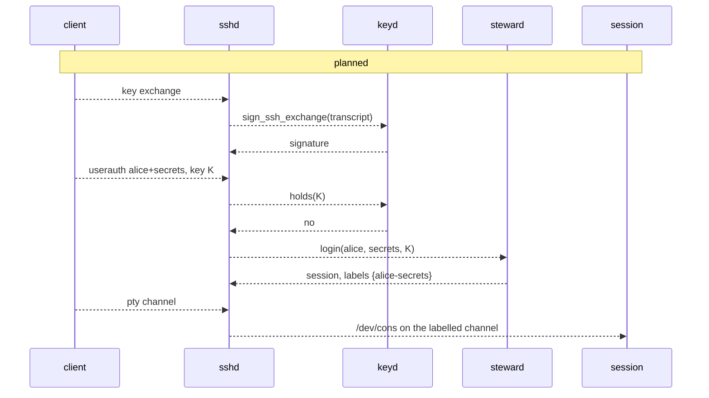

# sshd

`sshd` is the box's front door: SSH, on `ipd`'s port 22. It authenticates a person's key with the
steward's answer, has `keyd` sign the key exchange with the host key it never holds, and carries
each session over its own channel, labelled with the session's labels. It serves `/dev/cons` to
each session on that channel, and `ssh approve@box`, where only the steward talks. For file
transfers it only relays: the steward starts a transfer server per channel, holding the session's
file binds and nothing else. It uses `sunset`, an SSH library in `no_std` Rust without allocation.

## Purpose

People reach the box only over SSH, so the one process that parses every byte from the network
before login is also the one that decides which channel a session's output may reach. `sshd` keeps
both small: it holds no keys and decides no policy. Whose key a login used is the steward's
question, the host key's signature is `keyd`'s, and a channel's labels come from the session the
steward started.

## Interface

### Sessions over SSH

Status: planned · M1 (separation and containment)

- **Listening.** `sshd` is the sole holder of an `ipd` scope that listens on TCP port 22.
- **The host key.** `sshd` holds `keyd`'s `ssh_host` root badge, handed to it by the manifest, and
  asks `keyd` to sign each key exchange; `keyd` builds the exchange hash itself
  ([keyd](keyd.md#messages)). The host key is never in `sshd`'s memory, and the steward never holds
  its badge.
- **Login.** A user name is `principal` or `principal+label`. `sshd` rejects a login key that `keyd`
  holds (`holds`), then asks the steward whose key it is; the steward answers with a session, or
  refuses ([steward](steward.md#authentication-and-sessions)). Login keys are the person's own and
  never live in `keyd` ([R35 (key separation)](init.md#r35-key-separation)).
- **A pty session.** A session gets one channel with a pty, on which `sshd` serves its `/dev/cons`
  ([consoled](consoled.md#the-consol-protocol) has the same protocol): input from the channel,
  output to it, and the window's size and its changes.
- **State is per channel**, and each channel carries its session's labels (`alice@`: none;
  `alice+secrets@`: `{alice-secrets}`); `sshd` applies the label check to them
  ([R25 (the label check)](serving.md#r25-the-label-check)).
- **The one sink cleared for a label.** A vault session's output may reach its own channel, which
  the steward opened for the label's owner, and only a pty channel its owner authenticated: no
  forwarding, no subsystems, no `exec` on a labelled channel. No other sink has an owner exemption
  ([R67 (a channel keeps its labels)](#r67-a-channel-keeps-its-labels)).
- **Ending.** A session's channel closes when the steward ends the session or its VM dies; a closed
  channel ends the session.

*Figure: an SSH login to a vault session. All of it is planned.*

**Open:** how many channels and connections one principal may hold at once. The operations
`sshd` sends the steward are in the steward's table ([steward](steward.md#the-stewards-protocol)).

### `approve@box`

Status: planned · M1 (separation and containment)

`ssh approve@box` authenticates with the person's own approval key, and on that connection only the
steward talks: `sshd` relays the steward's rendered requests and the person's answers, and nothing
a session or agent sends reaches it ([steward](steward.md#the-powerbox-and-approvals)). A session's
network scope never includes the box's own addresses ([ipd](ipd.md#the-boxs-own-addresses)), so a
hijacked session cannot log in to `approve@box` over loopback
([R68 (only the steward on approve@box)](#r68-only-the-steward-on-approvebox)). An address that
loops back to the box without being listed as the box's own (a NAT hairpin) is refused only if the
manifest lists it; the backstop is that `sshd` refuses any login key `keyd` holds, so a hijacked
session that reaches `approve@box` that way still has no key to sign with.

**Open:** none.

### Files in and out

Status: planned · M3 (files in and out)

File transfer is SFTP, for unlabelled sessions only
([transfer](../userland/transfer.md) has the operation table).

- **`sshd` relays bytes only.** On a `subsystem sftp` request it asks the steward to start the
  transfer server for that session and pipes the channel to it, as it does `/dev/cons`. `sshd` never
  parses SFTP.
- **The transfer server** is a small native Rust program. The steward starts one per channel, in a
  budget carved from the session's, holding only the session's file binds: no `/net`, no
  `/dev/cons`, no powerbox, no budget or process handles. An SFTP-only connection gets a session
  budget as a login does, with the transfer server in place of the VM.
- **Confinement is by capability,** not by path strings: the server holds namespace handles and
  nothing else, so no path, however written, reaches anything outside them, and `..` at a root stays
  at the root.
- **Unsupported operations fail visibly.** Symlink, readlink and link get "operation unsupported";
  setting a size truncates, and mtime is set where `fsd` stores it; mode, owner and group get
  "operation unsupported" rather than a silent no-op.
- **SCP is served only as SFTP.** Current `scp` clients use SFTP by default; legacy `scp -O`, which
  runs `scp` on the server, is refused, since there is no `exec` and no shell to run it. Old clients
  use `sftp` or `scp -s`.
- **Vault sessions get no SFTP or SCP.** A labelled channel has no subsystems
  ([R67 (a channel keeps its labels)](#r67-a-channel-keeps-its-labels)); vault input enters by an
  audited push and output leaves by declassification ([steward](steward.md#declassification-and-push)).
- **Every operation is audited:** each open (reading and writing), each close with its byte count,
  remove, rename, mkdir, rmdir and setting attributes gets one record, signed as every audit record
  is ([steward](steward.md#the-transfer-audit-log)). The principal and labels in a record come from
  the badge the steward minted for the transfer server, never from the server's own claim.

The attack tests: a path-escape suite (`..`, absolute paths, long and odd names) reaches only the
session's binds; symlink, chmod and chown are refused; `scp -O` is refused; a subsystem request on a
vault channel is refused; every operation yields exactly one signed audit record with the right
principal; a second principal's files are unreachable.

**Open:** auditing at `fsd` of the transfer server's handles, needed only if the audit must survive
a compromised transfer server.

## Authority

Status: planned · M1 (separation and containment)

- `sshd` holds its `ipd` listen scope for port 22, `keyd`'s `ssh_host` root badge, a connection to the
  steward, and the `/dev/cons` endpoints it serves to sessions.
- It holds no private key and decides no login: it asks the steward whose key a login used, and
  asks the steward to start a transfer server for an SFTP request ([files in and out](#files-in-and-out)).
  It never holds a session's file binds itself.
- It is trusted across the labels of the channels it carries: with the steward it is the
  confinement check's one named exception ([init](init.md#the-confinement-check)), as the owner
  decided.

**Open:** none.

## Security properties

### R67 (a channel keeps its labels)

Status: planned · M1 (separation and containment)

Each SSH channel carries its session's labels, and a labelled session's output reaches only its own
pty channel, authenticated by the label's owner, with no forwarding, subsystem or `exec`. So vault
data leaves the box over SSH only to the person who owns the label, on the channel they opened.

**Open:** none.

### R68 (only the steward on approve@box)

Status: planned · M1 (separation and containment)

On an `approve@box` connection, authenticated with the person's own approval key, every byte shown
comes from the steward and every answer goes to it; no session, agent or other channel can write to
it or open one from inside the box. A route back to the box that the manifest does not list as the
box's own is the gap in the second half; `sshd`'s refusal of every key `keyd` holds is the backstop,
so such a session still cannot authenticate there with a `keyd` key.

**Open:** none.

## Failure and restart

Status: planned · M1 (separation and containment)

- **`sshd` crashes:** every SSH connection drops; sessions lose their channel and are ended by the
  steward. `init` restarts `sshd` ([init](init.md#restarts-and-reboots)).
- **`keyd` fails a signature:** the key exchange fails and the client sees a closed connection.

**Open:** none. A closed channel ends its session (above); there is no reattaching.

## Residual risks

- **`approve@` shares `sshd` with the most hostile input.** A `sunset` bug reached from any channel,
  before or after login, controls every channel and the approval screen, and a network flood delays
  approvals. A separate `sshd` instance for `approve@`, or the physical console, is planned for
  M5 (persist, install, share).
- **`sshd` is trusted across labels.** As one of the confinement check's named mediators it carries
  every session's channel; a bug in it reaches all of them.
- **The transfer audit is accountability, not a wall.** A principal who compromises their own
  transfer server with crafted input holds only their session's file capabilities, which they had
  already, and could suppress their own records; they could move data out unaudited through the pty
  anyway.
- **An `ssh_host` badge speaks as the box.** A compromised `sshd` can complete key exchanges as the box
  for as long as it runs.

## Why

- **Keys elsewhere.** The process that parses pre-authentication bytes from the whole network is the
  last place for a key; `keyd` signs, and `sshd` asks.
- **The steward decides logins.** Principals and their keys are the steward's; `sshd` asking keeps one
  place that knows them.
- **One cleared sink.** A vault's output must reach its owner somewhere; one sink, one kind of
  channel, the owner's own authentication, and nothing else keeps the exemption as narrow as it can be.
- **`sunset`.** An SSH implementation in `no_std` Rust with no allocation, by an author of dropbear,
  is small enough to read.
- **Relay, never parse, transfers.** An SFTP parser inside `sshd` would put a second protocol in the
  process that carries every channel; a transfer server per channel, holding only that session's
  file binds, keeps a bug in it inside one session's own files. Running SFTP in the session's own VM
  would let the principal skip the audit records.
