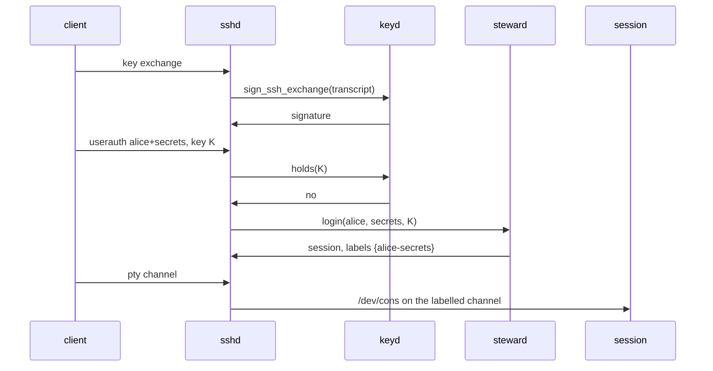

# sshd

`sshd` is the box's front door: SSH, on `ipd`'s port 22. It authenticates a person's key with the
steward's answer, has `keyd` sign the key exchange with the host key it never holds, and carries
each session over its own channel, labelled with the session's labels. It serves `/dev/cons` to
each session on that channel, and `ssh approve@box`, where only the steward talks. For file
transfers it only relays: the steward starts a transfer server per channel, holding the session's
file binds and its audit connection, and nothing else. It uses `sunset`, an SSH library in `no_std` Rust without allocation.

## Purpose

People reach the box only over SSH, so the one process that parses every byte from the network
before login is also the one that decides which channel a session's output may reach. `sshd` keeps
both small: it holds no keys and decides no policy. Whose key a login used is the steward's
question, the host key's signature is `keyd`'s, and a channel's labels come from the session the
steward started.

## Interface

### The core and its platforms

Status: built · tested (10)

- bench:sshd-host-tests
- bench:sshd-build
- bench:sshd-loopback-logins
- bench:sshd-loopback-r67
- bench:sshd-loopback-interrupt
- bench:sshd-loopback-independent
- bench:sshd-loopback-window-change
- bench:sshd-loopback-window-change-zero
- bench:sshd-loopback-env-refused
- bench:bench-ssh-loopback

`sshd` is a core and a platform. The core runs `sunset` over byte slices and makes every decision
this page states: the login name, the key checks, a channel's labels, and what a channel may not
do. The platform is only what the core asks for, and is one trait:

- **sign an exchange:** `keyd`'s `sign_ssh_exchange`, given the transcript's parts
  ([keyd](keyd.md#messages));
- **`holds(key)`:** `keyd`'s answer;
- **login:** the steward's answer, a session and its labels or a refusal
  ([steward](steward.md#authentication-and-sessions));
- **a session's console:** its bytes each way, the window size, the interrupt, and its end;
- **a refusal:** the kind of each channel request the core refuses (`env`, `exec`, `subsystem`,
  and any `pty-req`, `shell`, `window-change`, `signal` or `break` it does not pass on), as a name
  the core chooses; a labelled session's shell without a pty is named apart, `shell-without-pty`,
  for the audit of R67. Never the request's content:
  an `env` name or value is the client's bytes, and a log line built from it would be a line the
  client wrote.

The connection's bytes are not in the trait: the core takes and gives slices, and the platform
moves them. On the box the platform is `ipd`'s listen scope, `keyd`'s `ssh_host` badge, the
steward and `/dev/cons`. On the build host it is a host tool, so the bench logs in with OpenSSH's
`ssh` long before `init` and the steward exist
([against Redoubt's sshd](../testbench.md#against-redoubts-sshd)):

- **Transport:** standard input and output, one connection per process, as `ssh` starts it for
  a `ProxyCommand`; a log file of the server's own lines. A client that hangs up, as `ssh` does
  after a refused login, ends the connection without an error. A write to a client that has
  gone can still fail (a broken pipe, after `ssh` refuses the host key); the bench sends the
  server's standard error to its log, so nothing of the server's follows `ssh`'s own last line.
- **Signer:** `keyd`'s own server code, in the same process, given one key in `keyd`'s argument
  form, `name,ssh_host,seed`. So OpenSSH verifies a signature over the exchange hash `keyd`
  built, end to end. The host tool tests the protocol, the login flow and the channel rules, not
  key separation: its `keyd` shares its memory, where on the box it is a separate process.
- **Logins:** a fixed table. Principal `P` logs in with its test key from `tests/keys/`, as `P`
  (no labels) or `P+L` (labels `{P-L}`); anything else is refused.
- **Console:** a scripted line console, no shell: `echo`, `sleep`, `tty` (whether the channel has
  a pty), `labels` (the channel's labels), `exit N`, with `;` between commands. It logs each window
  change and interrupt it receives, and the platform logs each refusal by its name.

The key exchange is `curve25519-sha256` only, the one `keyd` signs, with Ed25519 host and login
keys. `sunset` is used as published with one patch ([patched
crates](../testbench.md#patched-crates)), which changes three things:

- **The server's host key signs outside it.** Given a host key's public half only, `sunset`
  hands out the exchange's parts (`V_C`, `V_S`, `I_C`, `I_S`, `Q_C`, `Q_S`, `K`) and waits for the
  signature, as its client already does for an SSH agent. It keeps a bounded copy of the peer's
  `KEXINIT` for this, since after the first exchange only `sunset` sees one in the clear, and
  refuses a larger one (over 4 KiB). It still computes the hash itself for the session keys, and
  checks the signature against it before sending it, so a disagreement fails the exchange on the
  server; the client checks it too.
- **A client's `window-change`, `signal` and `break` requests reach the core**, and so does a
  pty's starting size; published `sunset` drops the three requests on a server, and does not hand
  out the size. Its client gains `term_signal`, beside the `term_break` and
  `term_window_change` it has, so the patch's tests send all three. The server gains
  `session_exit`, which sends a session's exit status, then its EOF, then its close, where
  published `sunset` sends EOF and close only as echoes of the client's. The server no longer
  echoes the client's EOF, which is one direction only (RFC 4254): published `sunset` would end
  the session's output there. A public key request gains `signed()`, which tells a signed
  request from a query.
- **Its X25519 and Ed25519 verification use `ed25519-compact`,** the crate the loader and `keyd`
  already link, in place of the `dalek` crates. The box then has one implementation of each
  curve operation.

### Under Miri

Status: built · partly tested: a recorded run, not a bench case

The vendored crates' `unsafe` sits outside the ratchet, so Miri checks it instead, as for
[`ipd`'s](ipd.md#under-miri): nightly 2026-09-23 (rustc 1.100.0, Miri 0.1.0 of the same
nightly), Stacked Borrows, `MIRIFLAGS=-Zmiri-disable-isolation` (`cmov`'s property tests and
`getrandom`'s read the working directory or the system's random source), and
`RUSTFLAGS='--cfg aes_backend="soft" --cfg chacha20_backend="soft" --cfg poly1305_backend="soft"
--cfg sha2_backend="soft"'`, so that each crate runs the software backend the box compiles. Each
crate's own tests run in an unedited copy outside the tree, with the features the box builds it
with. Two of the box's paths are not the ones Miri runs: on RISC-V, `cmov` makes its masks and
`zeroize` its optimisation barrier with inline assembly, which Miri does not interpret, so under
Miri both crates take their portable Rust paths. Those two assembly blocks are read
([vendor/README.md](../../vendor/README.md#sshds-ssh-library)).

| Run | Result |
| --- | --- |
| `sshd`: `core` (19 tests, each a whole SSH connection) | pass, in four groups, about 25 minutes in all |
| aes 0.9.3 (`zeroize`) | 2 pass |
| chacha20 0.10.2 (`cipher`, `zeroize`) | 5 pass |
| poly1305 0.9.1 | 6 pass |
| sha2 0.11.0 (no default features) | 14 pass; `sha256_rand` and `sha512_rand`, which hash a long generated stream, run too long under Miri to finish |
| inout 0.2.2 | 1 pass |
| block-buffer 0.12.1 (`zeroize`) | 14 pass |
| hybrid-array 0.4.15 (`zeroize`) | 70 pass |
| cmov 0.5.4 | 121 pass; its 73 property tests run too long under Miri to finish (7 in nine minutes) |
| zeroize 1.9.0 | 27 pass |
| subtle 2.6.1 (no default features) | 33 pass |
| ascii 1.1.0 (the vendored copy: as published it does not compile on this nightly: a pattern binding named like an `AsciiChar` variant is now an error, which its patch fixes by renaming two bindings) | 94 pass; `is_digit_strange_radixes` fails natively too, since `char::is_digit` now panics on a radix below 2, and two doctests hit the same error |
| getrandom 0.4.3 | 16 pass, on its Linux backend; the box's custom backend calls a function the program provides, which no test defines |

### Sessions over SSH

Status: built · partly tested: a channel's window size reaches the session only once `consol`'s `size` and `resize` are served (consoled.md, "The `consol` protocol") · tested (16)

- bench:steward-ssh-two-principals
- bench:steward-ssh-idle
- bench:steward-vault-session
- bench:steward-vault-launch
- bench:steward-login-refused
- bench:steward-session-ends
- bench:steward-sub-budget-flood
- host:redoubt-sshd::a_read_waits_for_input_and_takes_what_was_typed
- host:redoubt-sshd::a_write_waits_for_room_and_the_channel_takes_it
- host:redoubt-sshd::an_accept_ipd_s_wait_ran_out_on_is_asked_again
- host:redoubt-sshd::a_data_call_refused_too_many_is_asked_again_a_bounded_number_of_times
- host:redoubt-sshd::an_ended_session_reads_the_end_and_cannot_write
- host:redoubt-sshd::the_console_is_one_file_carrying_the_channel_s_labels
- host:redoubt-sshd::a_slot_returns_when_the_client_hangs_up_first
- host:redoubt-sshd::a_slot_returns_when_the_server_ends_the_connection_first
- bench:steward-restart-ssh

- **Listening.** `sshd` is the sole holder of an `ipd` scope that listens on TCP port 22. Its
  accept, and each connection's reads and writes, are asked again when `ipd` answers `timeout`
  (its wait ran out, [ipd](ipd.md#the-net-tree)), and after 10 ms, up to 500 times in a row, when
  it answers `too many` (every in-flight call of `sshd`'s share taken: the accept, the slots'
  parked reads and a driver's waiting write). Any other failure of the accept ends `sshd`
  ([failure and restart](#failure-and-restart)), and of a connection's call that connection only.
- **The host key.** `sshd` holds `keyd`'s `ssh_host` root badge, handed to it by the manifest, and
  asks `keyd` to sign each key exchange; `keyd` builds the exchange hash itself
  ([keyd](keyd.md#messages)). The host key is never in `sshd`'s memory, and the steward never holds
  its badge.
- **Login.** A user name is `principal` or `principal+label`. `sshd` rejects a login key that `keyd`
  holds (`holds`), then asks the steward whose key it is with the typed call `login(principal,
  label, key, console)`; the steward answers with a session, or refuses
  ([steward](steward.md#authentication-and-sessions)). Login keys are the person's own and never
  live in `keyd` ([R35 (key separation)](init.md#r35-key-separation)).
- **A key is tried twice.** A client first asks whether a key would do, then sends a signature
  with it. `sshd` answers the question with `holds` alone: a key `keyd` holds is refused, any other
  may be tried. It asks the steward only once the signature has verified. So the steward never
  weighs a key whose private half the client has not shown, and a client that has not
  authenticated learns nothing about whose keys are whose. Passwords, keyboard-interactive and
  `none` authentication are refused.
- **A pty session.** A session gets one channel with a pty, on which `sshd` serves its `/dev/cons`
  ([consoled](consoled.md#the-consol-protocol) has the same protocol): input from the channel,
  output to it, and the window's size and its changes. The channel's `signal` request (INT) and
  `break` request reach the session as its own interrupt key, the 0x1C byte (Ctrl+\\), which no
  full-screen program can take ([the shell](../userland/shell.md#interrupting-and-killing-jobs)):
  protocol messages, not signals, since nothing in Redoubt has signals. The core checks what
  arrives raw before the session sees it: any other signal is refused, a break's length is not
  passed on, and a window size over 1,024 columns or rows reaches the session cut to 1,024. A
  zero means no size, as RFC 4254 says (a client whose input is not a terminal sends zeros): a
  `window-change` carrying one is refused, and a pty asked for with one starts at 80 by 24. The
  console's parked completion call is answered at the end of each hold
  ([multiplexed connections](serving.md#multiplexed-connections)), so a session stays however
  long its channel is quiet. A program the session launches
  gets a connection of its own to the same console, which the session mints with `new_connection`
  ([the serving library](serving.md#the-9p-server-skeleton)); its writes meet the channel's label
  check like the session's, so on a vault channel only a program carrying the channel's labels
  is shown.
- **Randomness.** The program provides `getrandom`'s `__getrandom_v03_custom`, the only source
  `getrandom` has on bare metal, and it writes all of the buffer it is given before it returns
  `Ok`: `getrandom` then reads every byte as initialised
  ([vendor/README.md](../../vendor/README.md#sshds-ssh-library)).
- **State is per channel**, and each channel carries its session's labels (`alice@`: none;
  `alice+secrets@`: `{alice-secrets}`); `sshd` applies the label check to them
  ([R25 (the label check)](serving.md#r25-the-label-check)). Channels are independent: one
  channel's close, logout or VM death leaves every other channel, `approve@box`'s included, usable,
  and a channel learns nothing of another's window size or waiting reads.
- **The one sink cleared for a label.** A vault session's output may reach its own channel, which
  the steward opened for the label's owner, and only a pty channel its owner authenticated: no
  forwarding, no subsystems, no `exec` on a labelled channel. No other sink has an owner exemption
  ([R67 (a channel keeps its labels)](#r67-a-channel-keeps-its-labels)).
- **The box's platform** serves four connections at once, each on two threads started once: a
  driver that runs the core, serves the channel's `/dev/cons` and makes the connection's calls
  to `keyd`, the steward and `ipd`, and a reader that waits in `ipd` for the client's bytes and
  hands each read to the driver. A call to `keyd` or the steward holds up only its own
  connection; a fifth connection is closed when it arrives. A slot is free again once the
  reader's last call for its connection is taken, whichever side ended the connection first.
- **The steward's end.** `sshd` keeps one `watch` call at the steward, which the steward holds
  unanswered while it runs. When the steward ends, the call ends with it (`Dead`,
  [R4b (a server dies)](../kernel/ipc.md#r4b-a-server-dies), or an answer as it exits), and
  every session it ran is over: `sshd` ends each of their channels with status 1 and says
  `sshd: session <id> ended: the steward is gone`, and calls `watch` again, which waits at the
  steward's endpoint for its next instance (a second's pause first if the call ended at once).
  A login, or a channel's close, waits at most 30 seconds for the steward's answer and is then
  refused, so a steward that is slow to come back holds no slot.
- **Ending.** A session's channel closes when the steward ends the session or its VM dies, which
  the steward tells `sshd` with `ended` on the channel's connection; a closed channel ends the
  session.

```mermaid
sequenceDiagram
    participant C as client
    participant SH as sshd
    participant KD as keyd
    participant ST as steward
    participant S as session
    C->>SH: key exchange
    SH->>KD: sign_ssh_exchange(transcript)
    KD->>SH: signature
    C->>SH: userauth alice+secrets, key K
    SH->>KD: holds(K)
    KD->>SH: no
    SH->>ST: login(alice, secrets, K)
    ST->>SH: session, labels {alice-secrets}
    C->>SH: pty channel
    SH->>S: /dev/cons on the labelled channel
```
*Figure: an SSH login to a vault session.*

The operations `sshd` sends the steward are in the steward's table
([steward](steward.md#the-stewards-protocol)).

Measured in `steward-ssh-two-principals` (QEMU, one hart, release build, seconds on the host's
clock beside other work), a login reaches its shell's prompt 2 to 4 s after `ssh` starts: the
session's VM writes its first line after 1.1 and 1.1 s on rv64 and 1.8 and 2.0 s on rv32 (alice,
then bob beside her), and the prompt comes at 2.1 and 2.1 s on rv64 and 3.9 and 4.0 s on rv32. The
key exchange, the login and the steward's batch, which streams the VM's image from `/boot`, are
the first part; the shell's start from the boot pack the rest.

### `approve@box`

Status: planned · M3 (agents, approvals and the attack suite)

`ssh approve@box` authenticates with the person's own approval key, one of their own SSH keys that
the manifest lists for approval, and on that connection only the
steward talks: `sshd` relays the steward's rendered requests and the person's answers, and nothing
a session or agent sends reaches it ([steward](steward.md#the-powerbox-and-approvals)). A session's
network scope never includes the box's own addresses ([ipd](ipd.md#the-boxs-own-addresses)), so a
hijacked session cannot log in to `approve@box` over loopback
([R68 (only the steward on approve@box)](#r68-only-the-steward-on-approvebox)). An address that
loops back to the box without being listed as the box's own (a NAT hairpin) is refused only if the
manifest lists it; the backstop is that `sshd` refuses any login key `keyd` holds, so a hijacked
session that reaches `approve@box` that way still has no key to sign with.

**Open:** none.

### Files in and out

Status: planned · M4 (files in and out)

File transfer is SFTP, for unlabelled sessions only
([transfer](../userland/transfer.md) has the operation table).

- **`sshd` relays bytes only.** On a `subsystem sftp` request it asks the steward to start the
  transfer server for that session and pipes the channel to it, as it does `/dev/cons`. `sshd` never
  parses SFTP.
- **The transfer server** is a small native Rust program. The steward starts one per channel, in a
  budget carved from the session's, holding only the session's file binds and one connection to
  the steward's audit path: no `/net`, no `/dev/cons`, no powerbox, no budget or process handles. An SFTP-only connection gets a session
  budget as a login does, with the transfer server in place of the VM.
- **Confinement is by capability,** not by path strings: the server holds namespace handles and
  nothing else, so no path, however written, reaches anything outside them, and `..` at a root stays
  at the root.
- **Unsupported operations fail visibly.** Symlink, readlink and link get "operation unsupported";
  setting a size truncates, and mtime is set where `littlefsd` stores it; mode, owner and group get
  "operation unsupported" rather than a silent no-op.
- **SCP is served only as SFTP.** Current `scp` clients use SFTP by default; legacy `scp -O`, which
  runs `scp` on the server, is refused, since there is no `exec` and no shell to run it. Old clients
  use `sftp` or `scp -s`.
- **Vault sessions get no SFTP or SCP.** A labelled channel has no subsystems
  ([R67 (a channel keeps its labels)](#r67-a-channel-keeps-its-labels)); vault input enters by an
  audited push and output leaves by declassification ([steward](steward.md#declassification-and-push)).
- **Every operation is audited:** each open (reading and writing), each close with its byte count,
  remove, rename, mkdir, rmdir and setting attributes gets one record, signed as every audit record
  is ([steward](steward.md#the-transfer-audit-log)). The principal and labels in a record come from
  the badge the steward minted for the transfer server, never from the server's own claim.

The attack tests: a path-escape suite (`..`, absolute paths, long and odd names) reaches only the
session's binds; symlink, chmod and chown are refused; `scp -O` is refused; a subsystem request on a
vault channel is refused; every operation yields exactly one signed audit record with the right
principal; a second principal's files are unreachable.

**Open:** auditing at `littlefsd` of the transfer server's handles, needed only if the audit must survive
a compromised transfer server.

## Authority

Status: built · partly tested: the transfer server request comes with M4 (files in and out) · tested: bench:steward-ssh-two-principals

- `sshd` holds its `ipd` listen scope for port 22, `keyd`'s `ssh_host` root badge, a connection to the
  steward, and the `/dev/cons` endpoints it serves to sessions.
- It holds no private key and decides no login: it asks the steward whose key a login used, and
  asks the steward to start a transfer server for an SFTP request ([files in and out](#files-in-and-out)).
  It never holds a session's file binds itself.
- It is trusted across the labels of the channels it carries: with the steward it is the
  confinement check's one named exception ([init](init.md#the-confinement-check)).

## Security properties

### R67 (a channel keeps its labels)

Status: built · tested: bench:sshd-loopback-r67, bench:steward-vault-session, bench:steward-vault-launch, host:redoubt-sshd::the_console_is_one_file_carrying_the_channel_s_labels

Each SSH channel carries its session's labels, and a labelled session's output reaches only its own
pty channel, authenticated by the label's owner, with no forwarding, subsystem or `exec`. So vault
data leaves the box over SSH only to the person who owns the label, on the channel they opened.

### R68 (only the steward on approve@box)

Status: planned · M3 (agents, approvals and the attack suite)

On an `approve@box` connection, authenticated with the person's own approval key, every byte shown
comes from the steward and every answer goes to it; no session, agent or other channel can write to
it or open one from inside the box. A route back to the box that the manifest does not list as the
box's own is the gap in the second half; `sshd`'s refusal of every key `keyd` holds is the backstop,
so such a session still cannot authenticate there with a `keyd` key.

**Open:** none.

## Failure and restart

Status: planned · M1 (sessions over SSH, kept apart)

- **`sshd` crashes:** every SSH connection drops; sessions lose their channel and are ended by the
  steward. `init` restarts `sshd` ([init](init.md#restarts-and-reboots)).
- **`keyd` fails a signature:** the key exchange fails and the client sees a closed connection.

**Open:** none. A closed channel ends its session (above); there is no reattaching.

## Residual risks

- **`approve@` shares `sshd` with the most hostile input.** A `sunset` bug reached from any channel,
  before or after login, controls every channel and the approval screen, and a network flood delays
  approvals. A separate `sshd` instance for `approve@`, or the physical console, is planned for
  M6 (persist, install, share).
- **`sshd` is trusted across labels.** As one of the confinement check's named mediators it carries
  every session's channel; a bug in it reaches all of them.
- **The transfer audit is accountability, not a wall.** A principal who compromises their own
  transfer server with crafted input holds only their session's file capabilities, which they had
  already, and could suppress their own records; they could move data out unaudited through the pty
  anyway.
- **An `ssh_host` badge speaks as the box.** A compromised `sshd` can complete key exchanges as the box
  for as long as it runs.
- **`sunset` carries our patch.** The patch is ours to read and keep: a `sunset` release that
  changes the code it touches needs it redone and read again.
- **A few unusual clients fail closed.** `sunset` hashes its own re-encoding of the peer's
  `KEXINIT`, so a client whose `KEXINIT` does not re-encode to the same bytes fails the exchange;
  and `ed25519-compact` refuses a non-canonical X25519 public value.
- **Ed25519 signatures are checked cofactored**, as the loader's are
  ([boot](../kernel/boot.md#residual-risks)): a client's signature can be made into another valid
  one for the same exchange, which authenticates nobody new.
- **Agent forwarding is refused where no platform sees it.** `sunset` has no agent code:
  `auth-agent-req@openssh.com` is left out of its request types, so it parses as an unknown request,
  which `sunset` refuses before the core (with a failure only if the client wants a reply, and
  `ssh` does not). Read from the vendored source; no case shows it, since nothing reaches the log.
- **The key exchange is not post-quantum.** Traffic recorded now could be read by whoever later
  breaks X25519. A post-quantum exchange (`mlkem768x25519-sha256`) changes the transcript `keyd`
  signs.
- **Connections are first come, first served.** `sshd` serves four connections at once, whoever
  opened them, and closes any beyond; how many one principal may hold is not decided, so one
  principal's open connections can keep another's logins out until they end.

## Why

- **Keys elsewhere.** The process that parses pre-authentication bytes from the whole network is the
  last place for a key; `keyd` signs, and `sshd` asks.
- **The steward decides logins.** Principals and their keys are the steward's; `sshd` asking keeps one
  place that knows them.
- **One cleared sink.** A vault's output must reach its owner somewhere; one sink, one kind of
  channel, the owner's own authentication, and nothing else keeps the exemption as narrow as it can be.
- **`sunset`.** An SSH implementation in `no_std` Rust with no allocation and no `unsafe`, by an
  author of dropbear, is small enough to read. Its core does no I/O, so the platform is a thin
  trait, and the host tool tests the same core the box runs.
- **A patch, not a fork.** Carrying the published crate and one patch keeps what we changed
  visible and small; its signer and channel-request changes are offered to `sunset`'s author.
- **One curve implementation.** `ed25519-compact` is already read for the loader and `keyd`, has
  no dependencies, and does X25519 as well; the `dalek` crates would add about 30,000 lines for
  the same arithmetic.
- **Relay, never parse, transfers.** An SFTP parser inside `sshd` would put a second protocol in the
  process that carries every channel; a transfer server per channel, holding only that session's
  file binds and its audit connection, keeps a bug in it inside one session's own files. Running SFTP in the session's own VM
  would let the principal skip the audit records.
