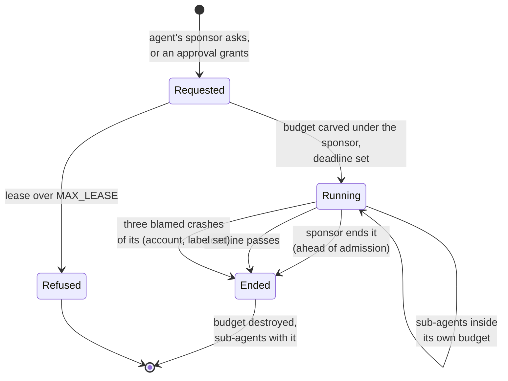

# The steward

The steward holds the system's policy about people and agents. It knows the principals,
authenticates logins that `sshd` passes it, carves every session and agent lease from the
`users` budget and launches it, runs the powerbox where a principal asks for authority it lacks,
declassifies and pushes single items across a label under an out-of-band approval, decides what a
crash blamed on a principal costs it, and keeps the audit log. It holds no keys and parses no ELF.
Its policy is modelled on the executable model of the kernel (`model/src/steward.rs`).

## Purpose

The kernel enforces budgets, labels and handles; it does not know who Alice is. Something must
turn "Alice logged in with this key" into a budget with Alice's account and labels and a
namespace of fresh connections, and must decide when an agent may have more than it was given.
Putting all of that in one `system`-class server keeps the policy in one place, reviewable and
modelled, and keeps the kernel free of it. The steward parses the most untrusted input in the
system (every agent's requests), so it holds nothing it could leak: no keys, no ELF parser, no
standing labelled reader.

## Interface

### Principals

Status: planned · M1 (separation and containment)

- A **principal** is a named, accountable identity: a way to authenticate, a set of capabilities
  (a namespace and service grants), and an audit identity. People, agents and projects are the same
  kind of principal; they differ in how they authenticate and in default policy, not in mechanism.
- Each principal's top budget carries its **account**, which the steward sets. Everything under
  it, its agents included, shares that account.
- **No root, no sudo.** Administration means holding specific capabilities over shared things.
- The principals come from the boot manifest ([init](init.md#the-boot-manifest)): each one's login
  and approval keys, budget, account, owned labels, the label sets it works under, home and
  network scope. The steward is stateless across boots.
- **Nesting.** Every principal has its own space, and its sponsor can destroy its budget.
  Principals can run their own servers and delegate into them.

**Open:** none.

### Fixed sub-budgets per label set

Status: planned · M1 (separation and containment)

At boot the steward splits each principal's top budget into fixed sub-budgets, one per label set
the manifest names for it (`users/alice/{}`, `users/alice/{alice-secrets}`), each with its own
pages, processes and weight. Every session and lease of one (principal, label set) is carved from
its own sub-budget. So a vault session's leases never change what the unlabelled side can carve:
carving under one shared top budget would let the unlabelled side read the vault's activity in
its free limits ([R37 (vault non-interference)](#r37-vault-non-interference)). The model checks
that every session is carved from its label set's sub-budget (its P1; the mutation
`PolicyCarveFromUnlabelled` breaks it).

**Open:** none.

### Authentication and sessions

Status: planned · M1 (separation and containment)

- **Login.** `sshd` runs SSH and asks the steward whose key a login used. The steward accepts only
  one of that principal's login keys, never a key `keyd` holds, and `sshd` itself refuses any key
  `keyd` holds ([keyd](keyd.md)). The model checks both (its P2; `PolicyLoginWithKeydKey`).
- **A session** is processes started with capabilities derived from the principal's set, never
  more. The steward carves the session budget from the right sub-budget, with the principal's
  account and the session's labels, gives it a namespace of fresh connections it asked each server
  for ([init](init.md#fresh-connections-per-child)), and launches it through the loader stub.
- **Normal sessions are unlabelled** (`ssh alice@box`): full network and every tool; they cannot
  read labelled volumes.
- **A vault session carries exactly one label.** `ssh alice+secrets@box` opens a session labelled
  `{alice-secrets}`, only if the person who authenticated owns that label. It reads and writes its
  labelled volume; outside a confined deployment it may read, never write, unlabelled volumes, which
  is how data enters the vault. It reaches no external sink, and its output reaches only its own SSH
  channel, which the steward opened for the label's owner. The model checks the ownership rule
  (`PolicyVaultWithoutOwnership`).
- **A labelled session starts nothing.** It can only submit requests to the steward; everything it
  asks for is started, if at all, by the steward (its P8).
- **Every id is unpredictable.** Session, request and connection ids are random 64-bit words from
  a keyed generator, never a counter, which would tell every principal how many the others made
  ([R36 (unpredictable ids)](#r36-unpredictable-ids)).
- **Defaults.** The steward mounts known-sensitive places (`~/.ssh`, credential directories) from
  the principal's labelled volume.

```mermaid
sequenceDiagram
    participant C as client
    participant SH as sshd
    participant KD as keyd
    participant ST as steward
    participant F as fsd, ipd, consoled
    participant S as session
    Note over C,S: planned
    C-->>SH: SSH, user alice+secrets, key K
    SH-->>KD: sign the exchange (host key)
    SH-->>KD: holds(K)?
    KD-->>SH: no
    SH-->>ST: login(alice, secrets, K)
    ST-->>ST: K is a login key of alice;<br/>alice owns secrets
    ST-->>ST: carve users/alice/{alice-secrets}/session-1
    ST-->>F: new_connection for the session's namespace
    ST-->>S: launch through the stub with the namespace
    ST-->>SH: session id; the channel's labels
    SH-->>C: the session on its labelled channel
```
*Figure: a vault login. All of it is planned.*

**Open:** none.

### The steward's protocol

Status: planned · M1 (separation and containment)

The steward serves one typed protocol, its table `libs/wire/tables/steward.md`, included by this
page: `login` (from `sshd`), `submit` (from sessions and agents), `approve` and `deny` (from the
approval channel), `end_lease` (from a sponsor), and `blame(account: u64, labels: bytes,
server: string)` (from `init`, [init](init.md#restarts-and-reboots)).

**Each operation is accepted only through the badge class it belongs to.** The steward gives a
root badge per caller role (`sshd`, `init`, the approval channel), and sessions get minted badges.
An operation on any other badge is refused, with the same answer as an unknown one, so a session
cannot send `login`, `approve` or `blame`.

**Open:** the table's other operations' fields; it is written with the steward.

### Leases

Status: planned · M1 (separation and containment)

An agent is its own principal, never an impersonation, with an accountable **sponsor**: a person,
or an agent with a person at the top of the chain.

- **An agent's budget sits under its sponsor's**, so it shares the sponsor's account. Its requests
  count against the sponsor's admission for its label set, with a fair share per badge inside
  ([R26 (admission fairness)](serving.md#r26-admission-fairness)), so an agent cannot lock its
  sponsor out.
- **A lease is task-scoped**: "read `~/project`, write `~/project/out`, connect to
  `203.0.113.0/24:443`, 2 hours, 256 MB, 4 processes, weight 20". Its budget has a deadline
  ([budgets](../kernel/budgets.md)) at most `MAX_LEASE` (24 hours) away. The steward refuses a
  longer lease rather than shortening it silently; the kernel knows only deadlines, not leases.
- **Delegation only narrows.** An agent may start sub-agents as budgets inside its own budget. It
  holds only its own budget handle, so it cannot create siblings, and its lease's end destroys its
  sub-agents with it, whatever their own deadlines. A new durable principal, or a budget with more
  labels than its parent, needs the steward and an approval.
- **Ending a lease is always accepted from the sponsor**, ahead of admission: the steward answers
  it straight from its receive loop ([serving](serving.md#admit)).
- **Narrowing is a revocation scope.** To give a server a way to narrow a session's or lease's
  connections, the steward passes it a revocation scope made for that purpose, never a budget
  that holds processes, which would let a compromised server end every session
  ([R41 (narrowing by revocation scope)](#r41-narrowing-by-revocation-scope)).
- **An agent holds no credentials.** It uses keys through `keyd` and models through `gatewayd`. No
  session or lease holds a `keyd` grant: `keyd`'s purposes are the host key and audit signing
  ([keyd](keyd.md)).
- **Assume every agent is compromised** by something it read: it can do what its capabilities
  allow until its lease ends, and nothing more.
- **Each agent runs in its own VM**; sub-agents with different authority are separate VMs.

The model checks leases and their end (its P9 and P13; `PolicyUnboundedLease`,
`PolicySubAgentOutlivesAgent`, `PolicyEndLeaseAdmitted`, `PolicyNoFairShare`) and the lease
lifecycle ([R39 (leases end)](#r39-leases-end)).


*Figure: a lease's life. All of it is planned.*

**Open:** none.

### The powerbox and approvals

Status: planned · M1 (separation and containment)

The **powerbox** grants authority a principal lacks and confirms a principal's own high-stakes
steps: an agent asking its sponsor, a principal asking the holder of a shared resource, a new
trusted key, a declassification. Most things need none.

- **Out of band.** An approval happens only where the steward alone talks to the terminal:
  `ssh approve@box`. Sessions and agents only notify that an approval is waiting. The requester can
  never influence the approval channel.
- **The approval key is the person's own.** Keys that authenticate a person to the box stay on the
  person's machine and never live in `keyd` ([R35 (key separation)](init.md#r35-key-separation));
  the steward refuses to enrol one key in both roles; a session's network scope never includes the
  box's own addresses. Otherwise a hijacked session could log in to `approve@box` over loopback,
  signing with `keyd`, and approve itself.
- **Rendering.** The steward renders from the structured request: the requester's kind (agent,
  session) and steward-assigned name (`agent-7`) beside its principal, what, where, how long, and
  the label consequences. Every rendered field is printable ASCII (0x20 to 0x7E; anything else is
  escaped), with no control character (U+0000 to U+001F, U+007F to U+009F) and so no ESC, so no terminal escape can repaint the approval
  screen and no bidi or format character (U+202E, U+2066, U+200B) can disguise it. A
  requester-supplied field is at most `FIELD_CAP` (64) characters, counted as Unicode scalar
  values, and is shown marked as the requester's text. An unlabelled requester's free-text reason
  is quoted, escaped and marked untrusted.
  A **labelled** requester's request shows only text the steward generates (kind, target, size):
  its free text would be a channel out of the vault.
- **Binding.** Each request has a random 64-bit id and a hash of its exact content; approving
  names both. The request is frozen until answered, and any change makes it a new request.
- **Limits and labels.** Each (account, label set) has a cap on pending requests, and a session
  holds at most a fair share of it; a dead session's requests are dropped. A labelled request is
  shown only to principals owning every label it carries, and otherwise refused at submission. Its
  "approval waiting" notification reaches only channels whose labels include all of the request's,
  and `approve@box`.
- **An approval grants no more than the approver holds.**

```mermaid
sequenceDiagram
    participant A as agent
    participant ST as steward
    participant SH as sshd (approve@box)
    participant P as Alice
    Note over A,P: planned
    A-->>ST: submit(content, reason)
    ST-->>ST: freeze; id, hash(content);<br/>check the pending cap
    ST-->>A: request id
    ST-->>P: notification on her channels:<br/>an approval is waiting
    P-->>SH: ssh approve@box with her approval key
    SH-->>ST: approval channel for alice
    ST-->>SH: rendered request (printable ASCII)
    P-->>SH: approve(id, hash)
    SH-->>ST: approve(id, hash)
    ST-->>ST: hash matches; grant at most<br/>what Alice holds; audit
    ST-->>A: the grant
```
*Figure: an agent's request approved out of band. All of it is planned.*

The model checks binding, screens, caps and the approval channel (its P3, P4 and P5;
`PolicyApproveIgnoresHash`, `PolicyRenderNotWhitelisted`, `PolicyLabelledFreeTextShown`,
`PolicyShowLabelledToAll`, `PolicyCapPerAccount`, `PolicyNoPendingCap`,
`PolicyDeadSessionRequestsKept`) ([R38 (out-of-band approval)](#r38-out-of-band-approval)).

**The steward's constants** are the model's, changed only by a new system bundle, never per
principal: `PENDING_CAP` 4 pending requests per (account, label set); `FIELD_CAP` 64 characters;
`DECLASSIFY_MAX` 256 bytes; `BLAME_COUNT` 3 blamed crashes within `BLAME_WINDOW`, 10 minutes;
`MAX_LEASE` 24 hours.

The attack test: a field full of ANSI escapes renders inert.

**Open:** none.

### Declassification and push

Status: planned · M1 (separation and containment)

**Declassification** moves one item from a label down to an unlabelled volume. Only the label's
owner declassifies, one item at a time, after a high-stakes approval:

1. At submission the steward **snapshots** the item and hashes the snapshot. The steward is
   unlabelled and cannot read the item, so it creates a short-lived **reader budget** carrying
   exactly the item's labels, with a deadline, and `call`s it; the reader reads the item and fills
   the steward's lend with it. A labelled budget only ever answers a request, never starts one, and
   the steward's `system` class lets the call through
   ([R1 (flow)](../kernel/ipc.md#r1-flow)). There is no standing reader, and the steward stays
   unlabelled. Any other labelled read the steward needs (a labelled volume's `stat`) goes the same
   way.
2. The approval shows all of it. Items over `DECLASSIFY_MAX` (256 bytes), or not printable text,
   are refused.
3. On approval, the steward copies exactly that snapshot to an unlabelled volume.

A **push** is the mirror, low to high: how input enters a labelled domain in a confined deployment,
where the domain reads no shared unlabelled volume ([init](init.md#the-confinement-check)). One
push moves one item from an unlabelled volume into the labelled domain's volume. The target
label's owner triggers it through the powerbox with an out-of-band approval; the confined domain
cannot trigger one, name the item, or pull one. The steward reads the source (it is unlabelled)
and writes the item through a short-lived **writer budget** carrying exactly the target label set,
since a write needs equal labels. There is no standing path, queue or batch, and the push is
audited with the request's labels. The steward declines a labelled session's mount of a shared
unlabelled volume in a confined deployment and offers the push instead.

```mermaid
sequenceDiagram
    participant P as Alice (owner)
    participant ST as steward
    participant R as reader budget {alice-secrets}
    participant V as fsd:alice-secrets
    participant U as fsd:data
    Note over P,U: planned
    P-->>ST: declassify(item)
    ST-->>R: create (exact labels, deadline); call
    R-->>V: read the item
    R-->>ST: the snapshot, in the steward's lend
    ST-->>ST: size and text checks; hash
    ST-->>P: approve@box shows all of it
    P-->>ST: approve(id, hash)
    ST-->>U: write exactly the snapshot
    ST-->>ST: destroy the reader; audit
```
*Figure: declassifying one item. All of it is planned.*

The model checks that what is copied out is exactly the snapshot, read through a reader with the
item's labels, and the push's shape (its P6 and P11; `PolicyDeclassifyLive`,
`PolicyDeclassifyWithoutReader`, `PolicyWriteUp`)
([R42 (one approved item)](#r42-one-approved-item)).

The steward's reader and writer budgets are edges of the confinement check's one named
exception: each carries exactly one label set and dies after one item
([init](init.md#the-confinement-check)).

**Open:** none.

### Crash blame

Status: planned · M1 (separation and containment)

A server that faults, or exits holding open calls, names in its exit notice the account and
labels of the current call of the thread that failed
([R21 (crash blame)](../kernel/processes.md#r21-crash-blame)), and `init` passes them on
([init](init.md#restarts-and-reboots)) through `blame`, which the steward accepts only on `init`'s
root badge. **Three crashes blamed on one (account, label set) within
ten minutes destroy every budget of that (account, label set)**, sessions and leases alike, their
agents with them, and the steward refuses new sessions for it until the window passes, recording
both in the audit log. A logout alone would not stop a principal logging straight back in, or its
agent carrying on. Keyed by the label set too: a vault session crashing a shared server must not
end its owner's unlabelled sessions, which would be a channel out of the vault. A crash with no
current call blames nobody and counts only toward `init`'s restart limit.

The model checks it on the kernel model's own exit notices (its P7; `PolicyBlameNoWindow`,
`PolicyBlamePerAccount`, `PolicyNoLockout`) ([R40 (blame by label set)](#r40-blame-by-label-set)).

**Open:** none.

### The transfer audit log

Status: planned · M3 (files in and out)

The audit log begins with file transfers. The steward appends a record for every file-transfer
operation ([sshd](sshd.md#files-in-and-out)) to a file only it can write, append-only, each record
signed through `keyd`'s `audit` purpose exactly as [below](#the-audit-log).

**Open:** none.

### The audit log

Status: planned · M4 (self-hosted development)

The same log extends to every steward action: the steward appends a record for every mint, delegation, revocation, approval, denial, lease end,
blame and lockout, with the principal chain, to a file only it can write. Each record carries the
request's labels and is read under the label check
([R25 (the label check)](serving.md#r25-the-label-check)), so a labelled request's target never
reaches an unlabelled reader. **Each record is signed**: the steward asks `keyd` to sign it under
the `audit` purpose over the preimage `"redoubt.audit.v1\0" || u64_le(len) || record`, whose
digest `keyd` computes itself, and stores the signature beside the record. The steward holds a
`keyd` grant for that one purpose, never a key. A record cannot be altered undetected by anything
that can write the file later.

The model checks that audit views are filtered by labels and that every record's signature binds
purpose, signer, domain, length and every byte (`PolicyAuditUnfiltered`,
`audit_authority_binds_purpose_signer_domain_length_and_every_byte`).

**Open:** none.

### Retention, chaining and the verifier

Status: planned · M5 (persist, install, share)

Records are chained, each naming the one before, so a record dropped or reordered is found as
well as one edited; an operator tool verifies the chain and the signatures; and the log is kept
for a set time and rotated without breaking the chain.

**Open:** the retention period and rotation; where the verifier runs and which key it trusts.

### Persistence, run-time principals and enrolment

Status: planned · M5 (persist, install, share)

The steward keeps its state across boots: principals, their keys and label sets can be added and
removed at run time, and the capabilities it minted are re-minted after a restart from its
records, since every server restarts with empty tables. The first owner is enrolled at first boot
on the physical console, a trusted path, and delegates from there; approvals can then also be
given on that console.

**Open:** where the steward's state lives and how it is protected; how re-minted capabilities
reach sessions that held the old ones; how a key is enrolled and revoked at run time.

### Projects and sharing

Status: planned · M5 (persist, install, share)

A **project** is a principal sponsored by several members, with its own budget, volume
(`fsd:project-x`), package directory and profile, and optionally a label. Membership is
capabilities minted into a revocation scope per member; removing a member destroys the scope. A
labelled project is worked on in project vault sessions (`ssh alice+project-x@box`), and
declassifying one of its items needs a project owner's approval. No kernel mechanism is involved.

**Open:** which members count as owners for an approval (project policy).

## Authority

Status: planned · M1 (separation and containment)

- The steward holds the `users` budget and a `system`-class budget of its own, the only process
  besides `init` that holds a `system`-class budget handle
  ([R33 (no server holds a system budget)](init.md#r33-no-server-holds-a-system-budget)).
- It holds connections to the servers it builds namespaces from, and a `keyd` grant for the
  `audit` purpose. It never holds the host key's badge: the manifest hands that to `sshd`.
- It holds no keys and no cryptography of its own, and parses no ELF.
- It filters every request by the caller's labels, as the kernel attached them; a labelled caller
  can only submit requests.
- It passes a server a narrowing handle only as a revocation scope made for that purpose (R41).
- Its work is paid for by the steward, not the requester, and it runs at a large manifest weight
  in the one stride queue, bounding the work of any one request and relying on its caps.
- The steward and `sshd` are the confinement check's one named exception, and only by three kinds
  of edge: the request and owner-approval path, per-item reader and writer budgets, and
  lease-ending supervision ([init](init.md#the-confinement-check)). The steward enforces the same
  rule for every budget and grant it creates.

**Open:** none.

## Security properties

### R36 (unpredictable ids)

Status: planned · M1 (separation and containment)

Every id the steward hands out (session, request, connection) is a random 64-bit word from a keyed
generator, never a counter. So no principal learns how many sessions or requests another started.
The model found the leak with sequential ids and checks the rule (`PolicySequentialIds`).

**Open:** none.

### R37 (vault non-interference)

Status: planned · M1 (separation and containment)

A vault session's work (item writes, requests, calls to a shared server) changes nothing an
unlabelled session observes: its results, the usage of `users`, of every principal's budget and
unlabelled sub-budget, and the audit records an unlabelled reader may read. The model checks this
on kernel results by replaying sequences with the vault's operations removed
(`steward_noninterference`, its P10).

**Open:** none.

### R38 (out-of-band approval)

Status: planned · M1 (separation and containment)

An approval takes effect only if it came through `approve@box` with the approver's own approval
key, named the frozen request's id and content hash, and grants no label or authority the approver
lacks; a labelled request is shown only to owners of all its labels and shows none of its free
text.

**Open:** none.

### R39 (leases end)

Status: planned · M1 (separation and containment)

Every lease's budget has a deadline at most `MAX_LEASE` away, every sub-agent sits inside its
agent's budget and ends no later, an expired lease is gone, and its sponsor can always end it,
ahead of admission, however hard the agent floods the servers they share.

**Open:** none.

### R40 (blame by label set)

Status: planned · M1 (separation and containment)

An (account, label set)'s sessions and leases are ended exactly when three server crashes blamed
on it fall within ten minutes, no new session of it starts for the next ten minutes, and no other
(account, label set)'s sessions are touched.

**Open:** none.

### R41 (narrowing by revocation scope)

Status: planned · M1 (separation and containment)

A server that narrows a session's connection to that session's life holds a revocation scope made
for it, never a budget holding processes. So a compromised server can revoke what it minted,
never destroy a session. The model checks it (its P12; `PolicyNarrowToSessionBudget`,
`PolicyServerHoldsSystemBudget`), and the attack test hands a server a session's budget and
expects it refused.

**Open:** none.

### R42 (one approved item)

Status: planned · M1 (separation and containment)

Data crosses a label only as one item per owner-approved request: declassification copies out
exactly the snapshot taken at submission, read through a reader budget with exactly the item's
labels; a push writes one item through a writer budget with exactly the target's labels, triggered
only by the target label's owner. Every other write to an item is by a session with exactly the
item's labels.

**Open:** none.

## Failure and restart

Status: planned · M1 (separation and containment)

- **The steward is part of the trusted base; its crash is a bug.** If it dies, `init` destroys and
  recreates the `users` budget, which logs every session out and ends every lease, and restarts the
  steward ([init](init.md#restarts-and-reboots)).
- **A session crashes:** the steward destroys its budget; `sshd` closes its channel; nobody else is
  affected.
- **A reader or writer budget** outlives nothing: it has a deadline, and the steward destroys it
  when its one item is done.

**Open:** none.

## Residual risks

- **An approved text can carry a hidden message.** Text an agent wrote and a person approved for
  declassification can still hide one; no rule on the item's form prevents that.
- **A push is one human action,** so a confined domain's input rate is a person's approval rate.
- **`approve@box` shares `sshd` with every channel.** A `sunset` bug reached from any channel
  controls the approval screen, and a network flood delays approvals. Its own `sshd` instance or
  the console is [sshd](sshd.md)'s to give.
- **Steward work is paid by the steward.** A principal's requests cost the steward's budget and
  time, bounded by its caps and per-request work, not by the requester's budget.
- **Blame follows the current call.** A request that corrupts a server which crashes later, while
  serving someone else, blames the wrong account, and one that crashes an idle thread later blames
  nobody; the consequence is a logout or a restart, not data loss.
- **Per-record signatures catch edits, not drops.** Until records are chained, a record dropped or
  reordered wholesale is not detected.
- **The mediators are trusted across labels.** The steward and `sshd` are the confinement check's
  one named exception and see several label sets; a bug in either reaches all of them.
- **The model is not the steward.** It leaves out SSH, the approval terminal and real
  cryptography; the properties it checks hold for the model, and the steward must be shown to follow
  it.

## Why

- **Policy in one server.** People, agents, approvals and blame change more often than kernel
  mechanism; keeping them out of the kernel keeps it small, and keeping them in one server keeps
  them in one reviewable, modelled place.
- **Agents are principals, not impersonations.** Every action is attributable, and a sponsor
  answers for its agents without the agent borrowing its identity.
- **Fixed sub-budgets.** Anything a vault session changes that its owner's unlabelled side can
  observe is a channel; fixed sub-budgets remove the shared free limit.
- **Approvals out of band.** A request that could reach the approval screen through the channel
  the requester controls could approve itself; the approval key and terminal are the person's.
- **Short-lived readers and writers.** A standing labelled reader in the steward would make the
  steward a labelled process, or a universal one; a budget per item, with exactly its labels and a
  deadline, gives each crossing its own audited authority.
- **Blame destroys, not logs out.** A logout the principal can undo at once, or that leaves its
  agents running, bounds nothing; three crashes then a lockout bounds how often one principal can
  restart a shared server.
