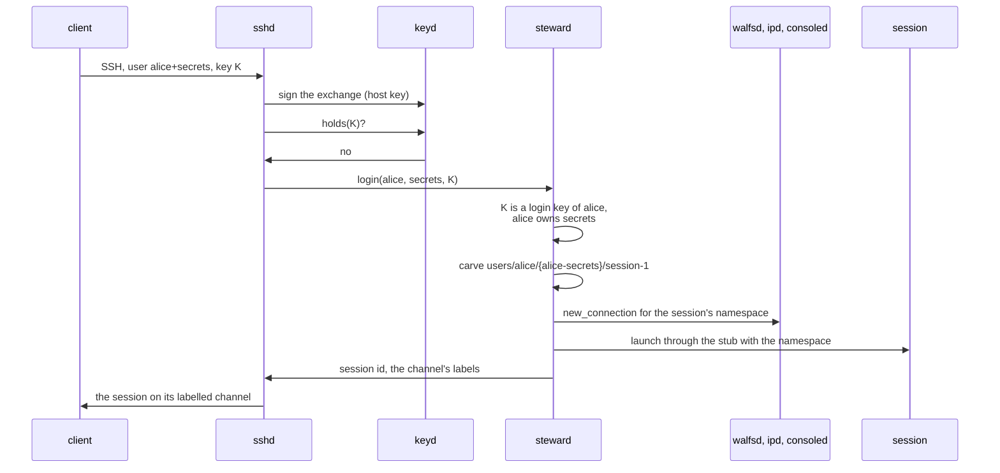
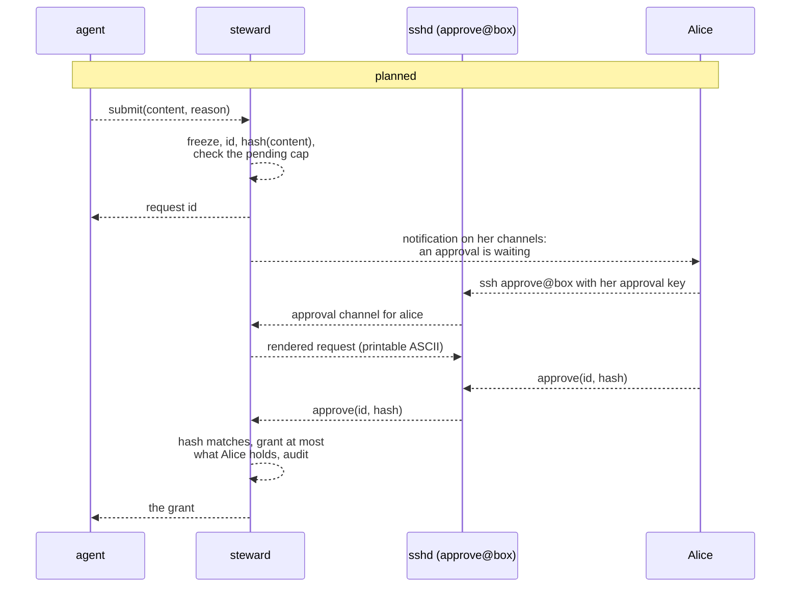
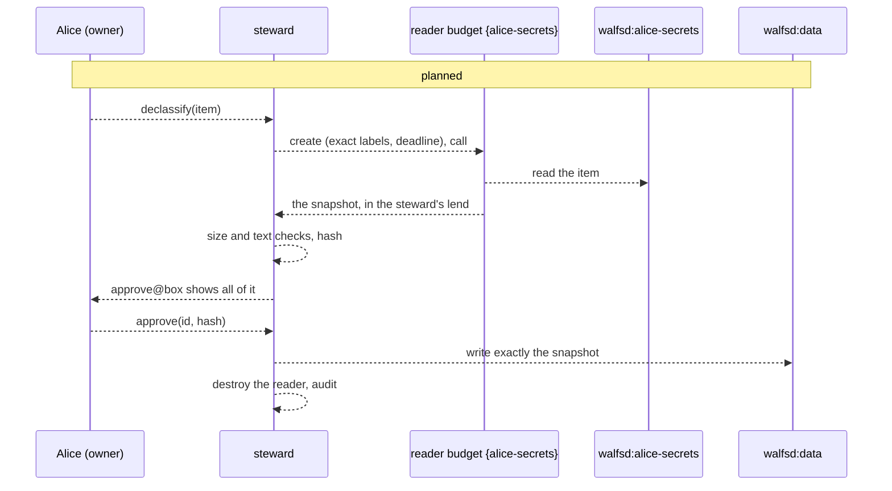

# The steward

The steward holds the system's policy about people and agents. It knows the principals,
authenticates logins that `sshd` passes it, carves every session and agent lease from the
`users` budget and launches it, runs the powerbox where a principal asks for authority it lacks,
declassifies and pushes single items across a label under an out-of-band approval, decides what a
crash blamed on a principal costs it, and keeps the audit log. It holds no keys and parses no ELF.
Its policy is one pure state machine ([the policy core](#the-policy-core)), which the model also
runs, on the executable model of the kernel.

## Purpose

The kernel enforces budgets, labels and handles; it does not know who Alice is. Something must
turn "Alice logged in with this key" into a budget with Alice's account and labels and a
namespace of fresh connections, and must decide when an agent may have more than it was given.
Putting all of that in one `system`-class server keeps the policy in one place, reviewable and
modelled, and keeps the kernel free of it. The steward parses the most untrusted input in the
system (every agent's requests), so it holds nothing it could leak: no keys, no ELF parser, no
standing labelled reader.

## Interface

### The policy core

Status: built · tested (58)

- host:redoubt-steward::a_manifest_with_a_key_in_two_roles_is_refused
- host:redoubt-steward::the_lines_read_as_the_manifest_and_write_back_the_same
- host:redoubt-steward::keyd_and_servers_are_empty_when_absent_and_sizes_is_required
- host:redoubt-steward::a_malformed_line_is_refused_with_its_number
- host:redoubt-steward::a_name_with_any_bytes_writes_back_the_same
- host:redoubt-steward::the_key_id_is_the_first_eight_bytes_of_the_key_s_sha_256_little_endian
- host:redoubt-steward::the_kept_corpus_reads_or_is_refused_without_a_panic
- host:redoubt-steward::boot_carves_a_fixed_sub_budget_per_label_set
- host:redoubt-steward::login_key
- host:redoubt-steward::owns_labels_reads_the_manifest_not_the_domains
- host:redoubt-steward::a_login_s_refusals_tell_nothing_apart
- host:redoubt-steward::context_free_holds_one_session_per_name
- host:redoubt-steward::a_session_is_carved_from_its_domain_with_a_scope_for_its_connections
- host:redoubt-steward::the_batch_steps_for_a_session
- host:redoubt-steward::approval_key
- host:redoubt-steward::caller_unlabelled
- host:redoubt-steward::lease_bounded_and_carve_lease
- host:redoubt-steward::blame_window_and_not_locked
- host:redoubt-steward::pending_cap_and_fair_share
- host:redoubt-steward::drop_requests
- host:redoubt-steward::exact_labels_and_item_fits
- host:redoubt-steward::agent_own_set
- host:redoubt-steward::reaches_and_render
- host:redoubt-steward::rendered_here_and_hash_matches
- host:redoubt-steward::a_closed_channels_id_reopened_answers_nothing_it_rendered
- host:redoubt-steward::reaches_only_requests_whose_labels_the_principal_owns
- host:redoubt-steward::a_granted_lease_starts_in_its_own_domain
- host:redoubt-steward::not_locked_keeps_a_grant_pending
- host:redoubt-steward::a_declassification_copies_out_exactly_its_snapshot
- host:redoubt-steward::a_push_writes_its_snapshot_through_a_writer_with_the_target_labels
- host:redoubt-steward::sponsor_session_and_notify_sponsor
- host:redoubt-steward::a_lease_ends_at_its_deadline_or_its_process_exit
- host:redoubt-steward::notify_reaches_only_channels_with_the_requests_labels
- host:redoubt-steward::audit_visible
- host:redoubt-steward::a_failed_start_ends_the_session
- host:redoubt-steward::an_excluded_event_makes_the_steward_exit
- host:redoubt-steward::an_event_naming_nothing_gets_one_answer
- host:redoubt-steward::the_same_events_give_the_same_effects
- host:redoubt-steward-gen::parses_tables
- host:redoubt-steward-gen::refuses_unknown_names
- host:redoubt-steward-gen::refuses_bad_rows
- host:redoubt-steward-gen::refuses_bad_machines
- host:redoubt-steward-gen::every_row_is_read_or_refused
- host:redoubt-steward-gen::fenced_code_is_not_a_table
- host:redoubt-steward-gen::link_checks_names_and_vocabulary
- host:redoubt-steward-gen::dispatch_takes_rows_in_order
- host:redoubt-steward-gen::the_tables_parse
- host:redoubt-steward-gen::generated_files_are_current
- host:redoubt-model::steward_policy
- host:redoubt-model::steward_noninterference
- host:redoubt-steward-trace::equal_outputs_pass
- host:redoubt-steward-trace::a_changed_output_line_is_caught
- host:redoubt-steward-trace::the_reference_output_splits_into_traces_and_rows
- host:redoubt-steward-trace::a_written_trace_reads_back
- host:redoubt-steward-trace::strings_round_trip
- bench:elixir-oracles
- bench:bench-elixir-oracles-broken-guard
- host:redoubt-steward-server::the_binding_table_binds_each_slot_as_the_page_says

Everything the steward decides is one pure state machine, the crate `redoubt-steward` (`no_std`,
no `unsafe`, no I/O), shared by the steward server and the model. The server is its embedder:
it turns messages and exit notices into events, carries out the effects the core returns, and
decides nothing itself.

#### One decision function

`decide(&mut Store, Event) -> Effects`. An event carries the time (`now`, the embedder's clock)
and the fresh random words the event may need for ids (R36: the embedder draws them from the
kernel's `random`, so the core holds no generator and no counter). Effects are data: budgets to
create and destroy, connections to ask for, a program to launch, an item to read or write
through a crossing budget, a reply, a notification or a rendered screen for an approval
channel, and audit records. An effect that produces something (a budget, a connection, a
process, a snapshot) names a token. One event's effects form a batch, which the embedder runs in
order, giving a later effect the result of an earlier one by its token. It stops at the first
failure, and then reports the batch as one `Done` event, with every result or the step that
failed. A machine waiting for a batch is in a state of its own, so every failure has a
transition.

Events one machine raises for another (a grant's lease, a crossing's snapshot for its request, a
lockout, a session's end for its requests) are the core's own and never a batch's steps: `decide`
runs them in the order they were raised before it returns, and drops without an answer one that
names an object already gone. An event the embedder's guarantee excludes is a steward bug, and
the server fails closed: it exits, and `init` restarts it ([below](#failure-and-restart)).

The embedder guarantees, and the core assumes, that:
- events come one at a time, and a batch's `Done` arrives before any other event about that
  object;
- each event's caller is the one the kernel stamped. The badge class decides the role (`sshd`,
  `init`, an approval channel, a session's minted badge, the steward's exit reports), and the
  embedder maps a session's badge to its session through the core's routing index;
- `now` never goes back, and the random words come from the kernel's generator.

The server's own work is transport, admission and effects, all read from the tables: it decodes
the protocol, admits by [R26 (admission fairness)](serving.md#r26-admission-fairness) except for
the events the tables mark ahead of admission (`EndLease`), runs each batch through the client
library, and signs audit records through `keyd`. Rendering, every check and every audit record
are the core's.

#### Domains

The store is partitioned by **domain**: `(account, label set)`, where the account is a
principal's (never 0) and the label set is sorted and at most `MAX_LABELS` long. System-class
callers (`sshd`, `init`, an approval channel) are roles of an event, never domains. A domain
holds:
- its fixed sub-budget ([below](#fixed-sub-budgets-per-label-set)), the one budget its sessions
  and leases are carved from;
- its sessions and leases, and the counters that number and name them (R37);
- the pending requests its sessions submitted, with their cap and fair shares;
- its blame window and lockout (R40).

Outside every domain is what the boot manifest fixes and nothing changes: principals, keys,
owned labels, the keys `keyd` holds. Then the routing index, which says where each session and
lease is and holds nothing else of a domain: it is written when one starts or ends, and read to
route an event and to address a notice. And the approval channels, which belong to a principal
across its label sets.

A handler sees one domain: it gets `&mut DomainState` for the domain of the event's caller and
no other domain's. Exactly three functions take two domains, one for each of
[R34 (confined placement)](init.md#r34-confined-placement)'s control-plane edges:
- **the request and approval path:** an approval acts on a request in the requester's domain,
  and a grant may start a lease in another domain of the same account;
- **the crossing:** declassification and push move one item between a labelled domain and the
  unlabelled domain of the same account, through a reader or writer budget;
- **lease supervision:** a sponsor ends a lease, and learns that it ended.

Only the module that holds these three can borrow two domains at once. So no other handler can
read or change a second domain: [R37 (vault non-interference)](#r37-vault-non-interference) is
kept by the type, not by review. Audit records have one constructor, which takes a domain and
stamps its account and labels, so no record can lack the labels it must be read under. An edge's
record is stamped with the labelled side's domain. So a request an unlabelled session submits for
a labelled target (a labelled agent, a push) is recorded under its target's domain from
submission on: whether it was approved depends on that domain's lockout. A labelled caller's
request for an agent names its own label set (`agent_own_set`), so its record, its lease and its
number stay in its own domain.

#### Machines

Each object is a plain `enum` with one transition table: a session, a lease, a request, a
crossing, a domain's blame and an approval channel. A request is rendered before it can be
answered: `Approve` and `Deny` are transitions only from `Rendered`, on the channel that rendered
it last. What an approval starts belongs to the machine it starts (a lease, a crossing), so
`Approved` is final and a failure after it is that machine's transition. A crossing's kind is fixed
when it opens and each kind has rows of its own: a declassification's read and a push's write go
through a budget carrying exactly the labelled side's labels; a declassification's copy out is
the steward's own write to the unlabelled volume, with no budget.

The events are `Boot` (the manifest), `Login`, `ChannelClosed`, `ApprovalOpened` and
`ApprovalClosed` from `sshd`; `StartAgent`, `Submit`, `EndLease` and `EndSession` from a session;
`Pending`, `Approve` and `Deny` from an approval channel; `Blame` from `init`; `Exited` from the
steward's exit reports (a session, a lease or a crossing budget's process); and `Done` for a
batch.

Each machine's table has the rows `| From | Event | Guard | To | Effects |`. Guards and effects are
named in the table and written by hand in the core. A generator in the style of the
[wire generator](wire.md#wire-tables-and-the-generator) writes from the tables the core's
dispatch (an exhaustive `match` on state and event) and the state diagrams on this page, both
checked in, with a drift check; with the Elixir reference it writes that reference's clause
skeletons too. No state-machine library and no macro.

##### The session

{{#include ../../libs/steward/tables/session.md:table}}
{{#include ../../libs/steward/tables/session.mermaid.md}}

##### The lease

{{#include ../../libs/steward/tables/lease.md:table}}
{{#include ../../libs/steward/tables/lease.mermaid.md}}

##### The request

{{#include ../../libs/steward/tables/request.md:table}}
{{#include ../../libs/steward/tables/request.mermaid.md}}

##### The crossing

{{#include ../../libs/steward/tables/crossing.md:table}}
{{#include ../../libs/steward/tables/crossing.mermaid.md}}

##### A domain's blame

{{#include ../../libs/steward/tables/blame.md:table}}
{{#include ../../libs/steward/tables/blame.mermaid.md}}

##### The approval channel

{{#include ../../libs/steward/tables/approval_channel.md:table}}
{{#include ../../libs/steward/tables/approval_channel.mermaid.md}}

#### Guards and effects

Each guard and each effect that carries a rule is one function, and each has a mutation in the
model that breaks it, which a property family must catch. The shipped crate carries no mutation
switch: the dispatch calls guards and effects through a table of functions, the shipped one by
default. The model swaps one entry for a broken one.

| Guard or effect | Rule | Mutation |
| --- | --- | --- |
| `login_key`, `approval_key` | a login uses only one of the principal's login keys and an approval channel only one of its approval keys; the boot manifest fixes both sets and `keyd`'s keys, and keeps all three apart ([R35 (key separation)](init.md#r35-key-separation)). The mutations widen a guard to the key an attacker could sign with: one `keyd` holds, or a login key | `PolicyLoginWithKeydKey`, `PolicyApproveWithLoginKey` |
| `owns_labels` | a vault login, a labelled agent, a declassification or a push needs the labels' owner, read from the manifest's owned labels, never from a domain's existence; a login it refuses is answered as a wrong key is ([contexts](#contexts)) | `PolicyVaultWithoutOwnership` |
| `context_free` | [R79 (one session per context)](#r79-one-session-per-context) | `PolicyContextTwice` |
| `take_over`, `detach_relay` | [R80 (one channel per context)](#r80-one-channel-per-context): a takeover only after every authentication guard; the channel taken over let go before the new one is attached; a channel's attachment id forgotten when it is let go | `PolicyTakeoverBeforeAuth`, `PolicyBothAttached`, `PolicyStaleCloseDetaches` |
| `caller_unlabelled` | a labelled session or agent starts nothing; it only submits requests | `PolicyLabelledStartsAgent` |
| `agent_own_set` | an agent request names a labelled agent: a labelled caller's, exactly its own label set, so its lease and records stay in its domain (R37); an unlabelled agent is `StartAgent`'s | `PolicyAgentOtherSet` |
| `not_locked`, `blame_window` | R40 | `PolicyNoLockout`, `PolicyBlameNoWindow` |
| `pending_cap`, `fair_share` | the pending cap per domain, a fair share per session | `PolicyNoPendingCap`, `PolicyNoFairShare` |
| `drop_requests` | a session's end drops its requests | `PolicyDeadSessionRequestsKept` |
| `lease_bounded`, `carve_lease` | R39: a lease at most `MAX_LEASE`; a sub-agent inside its agent's budget, ending no later | `PolicyUnboundedLease`, `PolicySubAgentOutlivesAgent` |
| `reaches`, `render`, `notify` | R38's screens: an approval channel reaches only its own account's requests, whose every label its principal owns; printable ASCII, capped, no labelled free text; an approval-waiting notice reaches only channels whose labels include all the request's | `PolicyShowLabelledToAll`, `PolicyRenderNotWhitelisted`, `PolicyLabelledFreeTextShown`, `PolicyNotifyLabelledToAll` |
| `rendered_here`, `hash_matches` | R38's binding | `PolicyApproveOtherChannel`, `PolicyApproveIgnoresHash` |
| `exact_labels`, `item_fits` | R42: a declassification is submitted from a session with exactly the item's labels, a push from an unlabelled session; a declassified item is at most `DECLASSIFY_MAX` bytes of printable text | `PolicyDeclassifyFromUnlabelled`, `PolicyDeclassifyUnfit` |
| `carve_crossing`, `copy_out` | R42: a reader or writer budget carries exactly the labelled side's labels; a copy out writes exactly the snapshot | `PolicyDeclassifyWithoutReader`, `PolicyDeclassifyLive` |
| `sponsor_session` | a lease is ended only from an unlabelled session of its sponsor | `PolicyEndLeaseFromVault` |
| `audit_visible` | every audit read goes through it: a record is read under [R25 (the label check)](serving.md#r25-the-label-check) | `PolicyAuditUnfiltered` |

A guard that reads only an object's kind (which crossing it is, whether a request snapshots)
carries no rule, is named only in the tables, and has no mutation.

Each rule has one keeper, and its mutation breaks that keeper: a second check of the same rule
would hide the mutation. So the approval edge's `reaches`, a function of the policy table, keeps
R38's screens to their owners, and no guard repeats it.

`not_locked` guards every start in a domain, and its keeper is the login. A session's `StartAgent`
in a locked domain is reached only if time goes back: a lockout ends every session of the domain,
and none starts there again until the window has passed. The row stays, because the core takes
`now` from its embedder and does not assume that it only goes forward. It is the same guard, not a
second keeper, so it hides no mutation.

Five of the model's mutations break a rule the types or the keepers now keep, and they cannot be
written. Blame or a pending cap counted per account (`PolicyBlamePerAccount`,
`PolicyCapPerAccount`) and a session carved from another label set's sub-budget
(`PolicyCarveFromUnlabelled`) each need a second domain. A narrowing handle for a session's
budget (`PolicyNarrowToSessionBudget`) needs a budget where the effect takes only a revocation
scope, a type of its own that only a zero-limit `CreateScope` makes (R41). An approval granting
more than its approver holds (`PolicyApproverExceeds`) needs a request whose labels or asked
labels its principal does not own, and `owns_labels` refuses every one at entry and at
submission (its mutation is `PolicyVaultWithoutOwnership`), while `reaches` keeps a request to
its own principal's channels. They are retired, and this table says why. Ids drawn from a counter
(`PolicySequentialIds`) and end-lease admitted behind others (`PolicyEndLeaseAdmitted`) break the
embedder's half, and stay mutations of the model's embedder.
So does an item written by a session without exactly its labels (`PolicyWriteUp`): that check is
the volume's ([R25](serving.md#r25-the-label-check)), and no steward event.

The request binding hash is SHA-256 over the request's canonical encoding, through the box's
own `libs/sha256`, which `keyd` and `init` use too: one function with no dependencies
([tenet 5](../TENETS.md#5-dependencies-are-part-of-the-trusted-computing-base)). It is the
core's one cryptographic function, with a login key's id. It binds content and signs nothing,
so the steward still holds no key.

#### Two embedders and a reference

- **The steward server** (`servers/steward`) binds effects to the client library and the kernel:
  it runs each batch's steps in order, stopping at the first that fails, and reports the batch
  as one `Done`. Its binding table maps each `Shared` slot to a server, a root and a badge per
  domain class; a slot bound to nothing for that class is produced without a call. One function
  is the table (`own::binding`): the connections and the launch both read it. The slots, in
  order: `bootfsd` at `/boot`; the home volume's server at the home's path; the label set's
  volume's server at `/vault` (a vault session only); `ipd` at `/net`, granted the
  principal's scope (an unlabelled session only); the console at `/dev/cons` (`sshd`'s channel,
  or `consoled` for the console principal's session); and the system volume's `erofsd`. The
  child finds the first and last also under beamlet's handle names, `bootfsd` and
  `erofsd:system`, the latter named by its `endpoint=` argument. Every
  random word it hands the core has its top bit set, so every id and badge the core draws is in
  the minted range ([R27 (badge allocation)](serving.md#r27-badge-allocation)) and no session's
  badge is a root badge. It says on its console each audit record, each step that failed with the
  kernel's error, and each sub-budget's usage when it changes, before it answers the call that
  caused them.
- **The model** binds the same crate to the kernel model, in place of its own copy of the
  policy, so the property families (P1 to P18) and the mutations attack the code that ships. The
  model's families drive events; its checks read the core's state through a read-only
  inspection API that the server does not use.
- **The Elixir reference** (`libs/steward/elixir/`, its clause skeletons generated from the same
  tables into `gen/`), `decide/2` as multi-clause functions over a `defstruct` state, runs on
  beamlet on the build host as a differential oracle, in the bench's `elixir-oracles` case
  ([the test bench](../testbench.md#elixir-oracles)). The same event traces must give equal
  states, effects and audit records. Its guards, effects, rendering and binding hash (SHA-256
  through `:crypto`) are written by hand from this page and the tables; they follow the core's
  in order and shape, so the two are not independent readings
  ([residual risks](#residual-risks)). It is a test oracle in the sense
  [tenet 3](../TENETS.md#3-rust-and-assembly-only-where-rust-cannot-reach)
  allows on the build host. It is never authoritative and never runs on the box.

#### The manifest lines

The core's view of the boot manifest is a few text lines, which `init` hands the steward as its
arguments, one line each after its entry's own ([init](init.md#starting-the-servers), step 6):
the manifest is never public, so `/boot` cannot carry it. A trace begins with the same lines.
- `principal "NAME" account=N login=[..] approval=[..] owned=[..] sets=[[..],..] top=P,N,W`: one
  per principal, its keys by id, its owned labels and each label set by label ids, its unlabelled
  set first, and its budget.
- `keyd [..]`, the ids of keys `keyd` holds; `init` writes `keyd []` (see
  [residual risks](#residual-risks)).
- `servers N`, the shared servers' slots a session connects to.
- `sizes session=P,N,W agent=.. sub_agent=.. crossing=.. cost=N`, the budgets the steward carves.

After the core's lines `init` appends the steward's own, which the server parses and the core
never sees, each naming only what `init`'s check found in the manifest:
- `label "NAME" id=N`, a label's name, for a login's label;
- `home "PRINCIPAL" handle=H path=/P quota=N`, its home at the server `init` handed the steward
  as the named handle `H`, holding at most `N` bytes, 1 or more
  ([home quotas and vaults](#home-quotas-and-vaults));
- `vault "PRINCIPAL" labels=[..] handle=H`, the labelled volume of one label set it works under
  (a set with no volume has no line);
- `net "PRINCIPAL" PREFIX:PORTS ...`, its network scope in the manifest's form, `*` for every
  port, which the steward passes to `ipd`'s `grant`.
- `console "PRINCIPAL"`, the manifest's `console`: the principal whose unlabelled session the
  steward opens on the UART.

The parser is the core's (`libs/steward/src/manifest.rs`), `no_std` and strict: each field once and
no other, `keyd`, `servers` and `sizes` at most once and `sizes` required, a number digits only.
A line it refuses is a start failure, said once on the console. `init` writes the lines with the
core's own writer, so the two cannot drift. A key's id is the first eight bytes, little-endian, of
SHA-256 over its 32 raw bytes (`hash::key_id`): `init` computes it for the lines, and the steward
for a login, so the core never sees a key. The parser is fuzzed
([tenet 6](../TENETS.md#6-tested-to-hell-and-back)).

#### The trace encoding

A trace is a text file, `libs/steward/trace/traces/*.trace`, and the crate
`redoubt-steward-trace` (host-only, outside the shipped core) reads it, runs it through the core
and checks the reference's output against the core's. Its input is the boot manifest, then one
event per line:
- the [manifest lines](#the-manifest-lines), read by the core's own parser; blank lines are
  skipped and `#` starts a comment.
- `event now=N random=[..] reply=N Kind field=value...` is one event: its time, at most the core's
  count of random words (the rest zero), the reply slot, and the event with its fields by name. An
  object is `kind@account/labels#id` (`session@1/7#101`). A string is quoted, with the escapes
  `\"`, `\\`, `\n` and `\xNN`. A `Done` carries `ok=[..]`, what each step made in order
  (`budget(N)`, `scope`, `connection`, `process(N)`, `bytes("..")` or `done`), or
  `failed=STEP,ERROR`. A `Login` without `context=` names the default context, `""`.
- `hash=shown` in an `Approve` stands for the hash the last screen of that request showed, as an
  approver copies it, so a hand-written trace names no SHA-256. Both sides substitute it alike.

The output is `boot`, then what boot fixed and carved, once (`principal`, `fixed`, `carve`,
`carve-sub` lines; what is fixed never changes, so it is not repeated). Then for each event,
`event N` and its effects in order: replies, notices, screens, audit records and forgets as
`reply`, `notice`, `screen`, `audit` and `forget` lines, then each batch as `batch OBJECT` and its
`step` lines, and `exit` if the event makes the steward exit. Then `store` and the store read
through `inspect`: each domain in the manifest's order with its objects by id, the routing index
(`route`, `id`), the approval channels, and `exited`. Each side writes its output, and the two are
compared byte for byte, so a map is written in key order on both.

The reference also writes `row MACHINE LINE` for each row it takes, the row's line in its table,
which is not compared: coverage is the reference's claim, and the core has no row hook to
confirm it ([residual risks](#residual-risks)). A trace's output
follows a line `trace NAME`, and the run ends with `done`, so a run cut short is refused.
`steward-trace check` fails on a trace whose outputs differ, naming its first differing event, the
event's input line, the first differing line from each side (the core's, then the reference's)
and the rest of that event's output from both, and goes on to the next trace. It also fails on a
trace with no events, a trace the reference did not run and a row the hand-written traces leave
untaken.

The model writes the events its steward families drive (`steward_policy` at seeds 1 to 4,
`steward_noninterference` at seed 1) as `model-*.trace`, afresh on each run, so they never drift
from the model; `check` lists the rows they never reach. `libs/steward/elixir/run-traces` runs
both sets; `--break GUARD` holds one of the reference's guards always, the negative run, which
`bench-elixir-oracles-broken-guard` requires to fail.

### Principals

Status: built · tested: bench:steward-boot, bench:steward-ssh-two-principals, host:redoubt-steward-server::each_principal_gets_a_top_budget_under_users_and_a_sub_budget_per_label_set

- A **principal** is a named, accountable identity: a way to authenticate, a set of capabilities
  (a namespace and service grants), and an audit identity. People, agents and projects are the same
  kind of principal; they differ in how they authenticate and in default policy, not in mechanism.
- Each principal's top budget carries its **account**, which the steward sets. Everything under
  it, its agents included, shares that account.
- **No root, no sudo.** Administration means holding specific capabilities over shared things.
- The principals come from the boot manifest ([init](init.md#the-boot-manifest)): each one's login
  and approval keys, budget, account, owned labels, the label sets it works under, home and
  network scope. The steward is stateless across boots.
- **Nesting.** Every principal has its own space, and its sponsor can destroy its budget.
  Principals can run their own servers and delegate into them.

### Fixed sub-budgets per label set

Status: built · tested: bench:steward-boot, bench:steward-vault-session, bench:steward-sub-budget-flood, host:redoubt-steward-server::a_vault_login_carves_from_the_vault_s_sub_budget_and_has_no_network

At boot the steward splits each principal's top budget into fixed sub-budgets, one per label set
the manifest names for it (`users/alice/{}`, `users/alice/{alice-secrets}`), each an equal share
of the principal's top budget, less a budget's own cost. Every session and lease of one
(principal, label set) is carved from its own sub-budget. So a vault session's leases never
change what the unlabelled side can carve: carving under one shared top budget would let the
unlabelled side read the vault's activity in its free limits
([R37 (vault non-interference)](#r37-vault-non-interference)). The model checks that every
session and lease is carved from its label set's sub-budget (its P1). A carve from another label
set's sub-budget would need a second domain, which no handler can borrow, so it has no mutation
([guards and effects](#guards-and-effects)). Sizes per label set may return with run-time
principals in M6 (persist, install, share), if evidence asks for them.

The steward carves at its start: for each principal a top budget under `users` with its account,
and under it a sub-budget per label set with that set's labels; a carve the kernel refuses is a
start failure, and the box has no users.

### Home quotas and vaults

Status: built · tested: bench:steward-home-quota, bench:init-refuses-overcommit, host:redoubt-fileserver::sessions_minted_through_one_carve_share_its_quota_across_a_restart, host:redoubt-steward-server::a_malformed_line_is_refused, host:redoubt-init::home_quotas_are_checked_against_their_volume, host:redoubt-init::a_vault_is_one_principals, host:redoubt-init::no_home_is_another_s_or_inside_it

- **A home's quota is the principal's, whatever its sessions.** The manifest gives each home a
  byte quota (`home_quota`, [init](init.md#home-quotas)), which reaches the steward on its `home`
  line. The first time a session of the principal needs its home, the steward mints one
  connection at the home's server, rooted at the home, with that quota, and keeps it for its own
  life; every session's home is minted through it with no quota of its own, at its root, so they
  all share the one quota: two sessions, or a session and the console session, stop together at
  it, and so do a principal's named contexts. A session's connection is disconnected through the
  kept one when the session ends. A write past the quota is the server's `enospc`
  ([walfsd](walfsd.md#quotas)); the principal's other homes' room, and every other principal's,
  is untouched.
- **A restart re-carves.** A dead steward's kept connections go with it: `init` disconnects the
  fresh connection it made for the steward at each server, and every connection minted under it
  with it ([failure and restart](#failure-and-restart)). The restarted steward carves each home
  again when it is next needed, and the server counts what the home already holds against the new
  carve, so what was written counts once.
- **The quotas fit their volume.** `init` refuses a manifest whose homes on one volume ask for more
  than the bytes it gives, or in which one principal's home is another's or inside it, so the
  steward can carve every principal's home at once, each its own root; the volume's
  server refuses a carve its room cannot hold all the same, and a session then has no home.
- **A vault is its labelled volume, with no quota of its own.** A vault session's slot is minted
  at the labelled volume's own root, which carves nothing: it is bounded by the volume's room. A
  labelled volume is one principal's: `init` refuses a manifest in which two principals' label
  sets name it (a label set need not be owned, so the manifest alone could otherwise share one),
  as principals are kept apart.

### Authentication and sessions

Status: built · partly tested: a session's badge sending `login` is refused in a host test only (a session runs only beamlet) · tested (9)

- bench:userland-boot
- bench:steward-ssh-two-principals
- bench:steward-vault-session
- bench:steward-login-refused
- bench:steward-session-ends
- host:redoubt-steward-server::a_login_runs_the_session_batch_and_answers_the_session
- host:redoubt-steward-server::a_refused_login_makes_nothing
- host:redoubt-steward-server::the_console_session_opens_at_the_start_and_again_when_it_ends
- host:redoubt-steward-server::sessions_coming_and_going_reuse_the_watchers

- **Login.** `sshd` runs SSH and asks the steward whose key a login used. The steward accepts only
  one of that principal's login keys, never a key `keyd` holds, and `sshd` itself refuses any key
  `keyd` holds ([keyd](keyd.md)). The model checks both (its P2; `PolicyLoginWithKeydKey`).
  A login carries two connections to its channel's console: the steward keeps the first and
  hands the second to the context's relay ([contexts](#contexts)). When the channel is let go,
  the steward tells the first `ended`, then releases it; only that one ends the channel
  ([sshd](sshd.md#sessions-over-ssh)).
- **A session** is processes started with capabilities derived from the principal's set, never
  more. The steward carves the session budget from the right sub-budget, with the principal's
  account and the session's labels, gives it a namespace of fresh connections it asked each server
  for ([init](init.md#fresh-connections-per-child)), and launches it through the loader stub,
  streaming the session's image from `bootfsd` through a 16-page lend, the most a call may lend,
  so the console session's VM is running within a second of the steward's start
  ([beamlet on Redoubt](../userland/beamlet.md#beamlet-on-redoubt)). Its arguments tell it what
  it is (`own::session_args`): `principal=NAME`, `label=NAME:ID` for each label of its set, and
  `context=NAME` for a named context, none for the default context or the console's session
  ([sessions](../userland/sessions.md#what-a-session-is-told)); they are the steward's word to the
  session and grant nothing. Each
  session's process has an exit endpoint of its own, which a watcher thread of the steward's waits
  on and reports on the steward's endpoint when the process ends. A thread's stack is never given
  back, so a watcher that has reported waits for the next session, and a new one starts only when
  every watcher is watching: there are never more watchers than sessions alive at once.
- **Normal sessions are unlabelled** (`ssh alice@box`): full network and every tool; they cannot
  read labelled volumes.
- **A vault session carries exactly one label.** `ssh alice+secrets@box` opens a session labelled
  `{alice-secrets}`, only if the person who authenticated owns that label. It reads and writes its
  labelled volume; outside a confined deployment it may read, never write, unlabelled volumes, which
  is how data enters the vault. It reaches no external sink, and its output reaches only its own SSH
  channel, which the steward opened for the label's owner. The model checks the ownership rule
  (`PolicyVaultWithoutOwnership`).
- **A labelled session starts nothing.** It can only submit requests to the steward; everything it
  asks for is started, if at all, by the steward (its P8; `PolicyLabelledStartsAgent`).
- **Every id is unpredictable.** Session, request and connection ids are random 64-bit words from
  a keyed generator, never a counter, which would tell every principal how many the others made
  ([R36 (unpredictable ids)](#r36-unpredictable-ids)).
- **The console is one principal's session.** The manifest's `console` names a principal; at
  boot the steward opens that principal's unlabelled session on the UART console (`consoled`'s
  connection at `/dev/cons`) and reopens it when it ends. The console's authority is that
  principal's, stated in the manifest, never an unnamed one: physical access to the box is
  already outside the threat model ([the tenets](../TENETS.md#threat-model)), so the field
  records who the cable is, it does not grant more. A manifest without `console` starts no
  console session; one naming no principal is refused by `init` at the manifest check, so the
  steward never sees a bad name. Reopening is the server's decision, not the core's: when the core
  forgets the console session, the server opens a new one through the core's `Console` event, and
  a console session that cannot start is said once, not retried.
- **Defaults.** The steward mounts known-sensitive places (`~/.ssh`, credential directories) from
  the principal's labelled volume.

```mermaid
sequenceDiagram
    participant C as client
    participant SH as sshd
    participant KD as keyd
    participant ST as steward
    participant F as walfsd, ipd, consoled
    participant S as session
    C->>SH: SSH, user alice+secrets, key K
    SH->>KD: sign the exchange (host key)
    SH->>KD: holds(K)?
    KD->>SH: no
    SH->>ST: login(alice, secrets, K)
    ST->>ST: K is a login key of alice,<br/>alice owns secrets
    ST->>ST: carve users/alice/{alice-secrets}/session-1
    ST->>F: new_connection for the session's namespace
    ST->>S: launch through the stub with the namespace
    ST->>SH: session id, the channel's labels
    SH->>C: the session on its labelled channel
```
*Figure: a vault login.*

### Contexts

Status: built · tested: bench:steward-context-login, bench:steward-login-refused, bench:steward-session-ends, host:redoubt-steward::a_login_s_refusals_tell_nothing_apart, host:redoubt-steward::context_free_holds_one_session_per_name, host:redoubt-steward::a_context_is_attached_to_one_channel_at_a_time, host:redoubt-steward-server::a_refused_login_makes_nothing, host:redoubt-steward-server::a_login_to_an_attached_context_takes_it_over, host:redoubt-steward-server::a_takeover_from_a_stalled_channel_still_takes_it_over, host:redoubt-steward-server::closing_the_channel_detaches_the_context_and_a_login_reattaches, host:redoubt-steward-server::sshd_gone_detaches_every_attached_context, host:redoubt-init::principal_and_label_names_hold_no_separator_and_none_is_reserved

A login's session is a **context** of its principal: `ssh alice@box` the default one, whose name
is empty, `ssh alice.work@box` the context `work` ([sessions](../userland/sessions.md#contexts)).
`sshd` splits the user name and sends each part; the steward trusts none of its parse.
- **Names.** A principal's, a label's and a context's name is 1 to 64 bytes of `[a-z0-9_-]`,
  starting with a letter (`manifest::name`). `init` holds principals and labels to it and
  refuses a principal named `approve`, the approval terminal's user name; the steward holds a
  login's context to it.
- **The key first, then the rest.** A login's key is checked against the principal alone
  (`login_key`); the label set and the context are looked at only after it, and each is a table
  lookup. A key that is not the principal's, a principal the manifest does not name, a label the
  manifest does not hold or the principal does not own, and a context that is not a name are all
  refused `bad_key`, so a login cannot tell them apart by the answer. The model checks that every
  such login gets that answer (its P17). The answers are uniform in content, not in time: an
  unknown principal or label set is refused before any machine runs, and a wrong key for a known
  principal runs the blame and session machines before `login_key` refuses it; nothing is counted
  ([R40](#r40-blame-by-label-set) counts server crashes). The difference lies inside one steward
  call, and how far it shows through SSH is not yet measured ([residual risks](#residual-risks)).
- **Identity.** A context is (account, label set, name): its sessions are numbered and carved in
  its domain, as every session is, so the same name in another label set is another context, and
  nothing about it crosses the label sets ([R37](#r37-vault-non-interference)).
- **One session at a time.** A context has at most one session ([R79](#r79-one-session-per-context)).
  A login naming a context whose session is still starting is refused `in_use`; one naming a
  context that runs reaches that session, as below. The console's session is no context. The
  audit record of a login carries its context, and each later attach is recorded `Attached`
  with its key, the client's address and whether it took the context over.
- **A context outlives its channel.** Its VM's `/dev/cons` is served by a console relay,
  [`consrelay`](consrelay.md), that the steward launches in the session's budget beside the VM
  and attaches to one SSH channel at a time ([R80](#r80-one-channel-per-context)). The session's
  budget holds 128 pages for it, and the VM is told the rest as its `budget_pages` and capped
  there ([budgets](../kernel/budgets.md#the-tree-from-the-boot-manifest)). Closing that
  channel detaches the context: the relay lets the channel go, the steward gives its console back
  (`sshd` closes the channel with status 0), and the VM runs on, its output kept by the relay.
  `exit`, a VM that ends, and the steward's other ends still end the session.
- **Reattach and takeover.** A login to a detached context attaches the new channel, which is
  told `[context NAME: reattached]` before the kept output. A login to an attached context takes
  it over, only after every authentication guard has passed: the old channel is told
  `[context NAME taken over from ADDRESS at up XhYm]` and ended, and the new one is told
  `[context NAME: reattached; taken over from OLD-ADDRESS]`. The addresses are the clients',
  which `sshd` reads from `ipd`'s `/tcp/N/remote`; the steward builds both notes, so the relay
  writes only text it was given. Each attach answers the login with a fresh attachment id, the
  name `sshd` gives the channel's close: a close naming an id let go names nothing and changes
  nothing. A takeover from a channel that has stopped reading still takes the context over, and
  that channel may close untold: the relay gives up on the note after 150 ms, and a relay's
  `detach` that runs past its 1 s bound is counted as done, since the relay lets the channel go
  as it takes the call and only the old channel's note was late
  ([consrelay](consrelay.md#the-consrelay-protocol)).
- **`sshd`'s end detaches every context.** When `sshd`'s `watch` call ends, every channel has
  gone with it, so the steward detaches each attached context, and the next login reattaches.

A cap on live contexts per label set and an idle expiry for detached ones are planned
([M2 (usable shell)](../plan/m2-usable-shell.md#the-shell)).

### The steward's protocol

Status: built · tested: bench:steward-login-refused, host:redoubt-steward-server::every_operation_on_another_badge_class_is_malformed, host:redoubt-steward-server::closing_the_channel_detaches_the_context_and_a_login_reattaches

The steward serves one typed protocol, its table `libs/wire/tables/steward.md`, included by this
page. Its sessions' operation is `login` (from `sshd`); the operations for leases, approvals and
crash blame are below ([the lease and approval operations](#the-lease-and-approval-operations)).

**Each operation is accepted only through the badge class it belongs to.** The steward gives a
root badge per caller role (`sshd` 1, the approval channel 2, `init` 3, each a `handed` badge in
the manifest), and sessions get minted badges. An operation on any other badge is malformed, the
same answer as an unknown one, so a session cannot send `login`, `approve` or `blame`.

- **`login`** carries the principal's name, the label's name (empty for an unlabelled session),
  the context's name (empty for the default one), the raw key and the channel's console
  connection, which `sshd` made for the session and which becomes its `/dev/cons`. The steward
  derives the key's id ([the manifest lines](#the-manifest-lines)), then checks the label's name
  against the manifest's; a name the manifest does not hold is `bad_key`, as every refusal before
  the session is but a live context's `in_use` ([contexts](#contexts)). The reply is the session's
  id, its name and the channel's labels.
- **`channel_closed`** ends the session the channel carried.
- **Not yet bound:** `submit`, `start_agent`, `end_lease`, `approve`, `deny`, `pending`,
  `approval_opened`, `approval_closed` and `blame` are in the table and accepted only on their
  badge classes, and answered `unknown` until their batches are built.

The table: [libs/wire/tables/steward.md](../../libs/wire/tables/steward.md).

{{#include ../../libs/wire/tables/steward.md:tables}}

### The lease and approval operations

Status: planned · M3 (agents, approvals and the attack suite)

The steward's protocol adds `submit` (from sessions and agents), `approve` and `deny` (from the
approval channel), `end_lease` (from a sponsor), and `blame(account: u64, labels: bytes,
server: string)` (from `init`, [init](init.md#restarts-and-reboots)), each accepted only through
its badge class, as above.

**Open:** these operations' fields; they are written with the steward's second half.

### Leases

Status: planned · M3 (agents, approvals and the attack suite)

An agent is its own principal, never an impersonation, with an accountable **sponsor**: a person,
or an agent with a person at the top of the chain.

- **An agent's budget sits under its sponsor's**, so it shares the sponsor's account: it is
  carved from the sponsor's fixed sub-budget for the lease's label set, never from a session's
  budget. So a lease outlives the login session that started it, and ends only by its sponsor,
  its deadline or blame. Its requests
  count against the sponsor's admission for its label set, with a fair share per badge inside
  ([R26 (admission fairness)](serving.md#r26-admission-fairness)), so an agent cannot lock its
  sponsor out.
- **A lease is task-scoped**: "read `~/project`, write `~/project/out`, the `model` gateway, 2
  hours, 256 MB, 4 processes, weight 20". An agent never holds a socket or a name rule: it reaches
  outside the box only through `gatewayd` capabilities ([gatewayd](gatewayd.md)). Its budget has a
  deadline ([budgets](../kernel/budgets.md)) at most `MAX_LEASE` (24 hours) away. The steward
  refuses a longer lease rather than shortening it silently; the kernel knows only deadlines, not
  leases.
- **Delegation only narrows.** An agent may start sub-agents as budgets inside its own budget. It
  holds only its own budget handle, so it cannot create siblings, and its lease's end destroys its
  sub-agents with it, whatever their own deadlines. A new durable principal, or a budget with more
  labels than its parent, needs the steward and an approval. An agent request asks for a labelled
  agent: from a labelled session, in exactly its own label set; from an unlabelled session, in a
  label set its principal owns. An unlabelled agent is started with `StartAgent`, never through an
  approval.
- **Ending a lease is always accepted from the sponsor**, ahead of admission: the steward answers
  it straight from its receive loop ([serving](serving.md#admit)). The sponsor ends it from any of
  its unlabelled sessions. A vault session cannot, since ending a lease it does not share labels
  with would be a flow out of the vault.
- **The sponsor learns that a lease ended**, however it ended: the steward notifies the sponsor's
  unlabelled sessions through the lease-supervision edge, naming the lease and not why it ended.
- **Narrowing is a revocation scope.** To give a server a way to narrow a session's or lease's
  connections, the steward passes it a revocation scope made for that purpose, never a budget
  that holds processes, which would let a compromised server end every session
  ([R41 (narrowing by revocation scope)](#r41-narrowing-by-revocation-scope)).
- **An agent holds no credentials.** It uses keys through `keyd` and, from
  M5 (self-hosted development), models through `gatewayd`. Until M6 (persist, install, share),
  which brings keys in leases, no session or lease holds a `keyd` grant, since `keyd`'s purposes
  are the host key and audit signing ([keyd](keyd.md)).
- **Assume every agent is compromised** by something it read: it can do what its capabilities
  allow until its lease ends, and nothing more.
- **Each agent runs in its own VM**; sub-agents with different authority are separate VMs.

The model checks leases and their end (its P9 and P13; `PolicyUnboundedLease`,
`PolicySubAgentOutlivesAgent`, `PolicyEndLeaseAdmitted`, `PolicyEndLeaseFromVault`,
`PolicyNoFairShare`) and the lease lifecycle ([R39 (leases end)](#r39-leases-end)): the lease
machine's, whose table and generated diagram are [above](#the-lease).

**Open:** none.

### The powerbox and approvals

Status: planned · M3 (agents, approvals and the attack suite)

The **powerbox** grants authority a principal lacks and confirms a principal's own high-stakes
steps: an agent asking its sponsor, a principal asking the holder of a shared resource, a new
trusted key, a declassification. Most things need none.

- **Out of band.** An approval happens only where the steward alone talks to the terminal:
  `ssh approve@box`. Sessions and agents only notify that an approval is waiting. The requester can
  never influence the approval channel.
- **The approval key is the person's own.** Keys that authenticate a person to the box stay on the
  person's machine and never live in `keyd` ([R35 (key separation)](init.md#r35-key-separation));
  the steward refuses to enrol one key in both roles; a session's network scope never includes the
  box's own addresses. Otherwise a hijacked session could log in to `approve@box` over loopback,
  signing with `keyd`, and approve itself.
- **Rendering.** The steward renders from the structured request: the requester's kind (agent,
  session) and steward-assigned name (`agent-7`) beside its principal, what, where, how long, and
  the label consequences. Every rendered field is printable ASCII (0x20 to 0x7E; anything else is
  escaped), with no control character (U+0000 to U+001F, U+007F to U+009F) and so no ESC, so no
  terminal escape can repaint the approval screen and no bidi or format character (U+202E, U+2066,
  U+200B) can disguise it. A requester-supplied field is at most `FIELD_CAP` (64) characters,
  counted as Unicode scalar values, and is shown marked as the requester's text. An unlabelled
  requester's free-text reason is quoted, escaped and marked untrusted. A **labelled** requester's
  request shows only text the steward generates (kind, target, size): its free text would be a
  channel out of the vault.
- **Binding.** Each request has a random 64-bit id and a hash of its exact content; approving
  names both. The request is frozen until answered, and any change makes it a new request.
- **Limits and labels.** Each (account, label set) has a cap on pending requests, and a session
  holds at most a fair share of it; a dead session's requests are dropped. A labelled request is
  shown only to principals owning every label it carries, and otherwise refused at submission. Its
  "approval waiting" notification reaches only channels whose labels include all of the request's,
  and `approve@box`.
- **An approval grants no more than the approver holds.** A request reaches only its own
  principal's approval channels, and that principal owns every label the request carries or asks
  for, checked when it entered and when it was submitted. A project's requests, which several
  members may approve from M6 (persist, install, share), bring a check of their own.

```mermaid
sequenceDiagram
    participant A as agent
    participant ST as steward
    participant SH as sshd (approve@box)
    participant P as Alice
    Note over A,P: planned
    A-->>ST: submit(content, reason)
    ST-->>ST: freeze, id, hash(content),<br/>check the pending cap
    ST-->>A: request id
    ST-->>P: notification on her channels:<br/>an approval is waiting
    P-->>SH: ssh approve@box with her approval key
    SH-->>ST: approval channel for alice
    ST-->>SH: rendered request (printable ASCII)
    P-->>SH: approve(id, hash)
    SH-->>ST: approve(id, hash)
    ST-->>ST: hash matches, grant at most<br/>what Alice holds, audit
    ST-->>A: the grant
```
*Figure: an agent's request approved out of band. All of it is planned.*

The model checks binding, screens, caps and the approval channel (its P3, P4 and P5;
`PolicyApproveIgnoresHash`, `PolicyRenderNotWhitelisted`, `PolicyLabelledFreeTextShown`,
`PolicyShowLabelledToAll`, `PolicyNoPendingCap`, `PolicyDeadSessionRequestsKept`,
`PolicyApproveWithLoginKey`, `PolicyNotifyLabelledToAll`, `PolicyApproveOtherChannel`)
([R38 (out-of-band approval)](#r38-out-of-band-approval)).

**The steward's constants** are the model's, changed only by a new system bundle, never per
principal: `PENDING_CAP` 4 pending requests per (account, label set); `FIELD_CAP` 64 characters;
`DECLASSIFY_MAX` 256 bytes; `BLAME_COUNT` 3 blamed crashes within `BLAME_WINDOW`, 10 minutes;
`MAX_LEASE` 24 hours.

The attack test: a field full of ANSI escapes renders inert.

**Open:** none.

### Declassification and push

Status: planned · M3 (agents, approvals and the attack suite)

**Declassification** moves one item from a label down to an unlabelled volume. Only the label's
owner declassifies, from a session carrying that label, one item at a time, after a high-stakes
approval:

1. At submission the steward **snapshots** the item and hashes the snapshot. The steward is
   unlabelled and cannot read the item, so it creates a short-lived **reader budget** carrying
   exactly the item's labels, with a deadline, and `call`s it; the reader reads the item and fills
   the steward's lend with it. A labelled budget only ever answers a request, never starts one, and
   the steward's `system` class lets the call through
   ([R1 (flow)](../kernel/ipc.md#r1-flow)). There is no standing reader, and the steward stays
   unlabelled. Any other labelled read the steward needs (a labelled volume's `stat`) goes the same
   way.
2. The approval shows all of it. Items over `DECLASSIFY_MAX` (256 bytes), or not printable text,
   are refused.
3. On approval, the steward copies exactly that snapshot to an unlabelled volume.

A **push** is the mirror, low to high: how input enters a labelled domain in a confined deployment,
where the domain reads no shared unlabelled volume ([init](init.md#the-confinement-check)). One
push moves one item from an unlabelled volume into the labelled domain's volume. The target
label's owner triggers it through the powerbox with an out-of-band approval; the confined domain
cannot trigger one, name the item, or pull one. The owner submits it from an unlabelled session.
At submission the steward reads the source (it is unlabelled), snapshots it and hashes the
snapshot, as a declassification does. A pushed item is not held to `DECLASSIFY_MAX`: its screen
shows the source and the target, the item's size and the snapshot's hash. On approval it writes
exactly that snapshot through a short-lived **writer budget** carrying exactly the target label
set, since a write needs equal labels. There is no standing path, queue or batch, and the push is
audited with the request's labels. The steward declines a labelled session's mount of a shared
unlabelled volume in a confined deployment and offers the push instead.

```mermaid
sequenceDiagram
    participant P as Alice (owner)
    participant ST as steward
    participant R as reader budget {alice-secrets}
    participant V as walfsd:alice-secrets
    participant U as walfsd:data
    Note over P,U: planned
    P-->>ST: declassify(item)
    ST-->>R: create (exact labels, deadline), call
    R-->>V: read the item
    R-->>ST: the snapshot, in the steward's lend
    ST-->>ST: size and text checks, hash
    ST-->>P: approve@box shows all of it
    P-->>ST: approve(id, hash)
    ST-->>U: write exactly the snapshot
    ST-->>ST: destroy the reader, audit
```
*Figure: declassifying one item. All of it is planned.*

The model checks that what is copied out is exactly the snapshot, read through a reader with the
item's labels, and the push's shape (its P6 and P11; `PolicyDeclassifyLive`,
`PolicyDeclassifyWithoutReader`, `PolicyDeclassifyFromUnlabelled`, `PolicyDeclassifyUnfit`,
`PolicyWriteUp`) ([R42 (one approved item)](#r42-one-approved-item)).

The steward's reader and writer budgets are edges of the confinement check's one named
exception: each carries exactly one label set and dies after one item
([init](init.md#the-confinement-check)).

**Open:** none.

### Crash blame

Status: planned · M3 (agents, approvals and the attack suite)

A server that faults, or exits holding open calls, names in its exit notice the account and
labels of the current call of the thread that failed
([R21 (crash blame)](../kernel/processes.md#r21-crash-blame)), and `init` passes them on
([init](init.md#restarts-and-reboots)) through `blame`, which the steward accepts only on `init`'s
root badge. **Three crashes blamed on one (account, label set) within
ten minutes destroy every budget of that (account, label set)**, sessions and leases alike, their
agents with them, and the steward refuses new sessions for it until the window passes, recording
both in the audit log. A logout alone would not stop a principal logging straight back in, or its
agent carrying on. Keyed by the label set too: a vault session crashing a shared server must not
end its owner's unlabelled sessions, which would be a channel out of the vault. A crash with no
current call blames nobody and counts only toward `init`'s restart limit.

The model checks it on the kernel model's own exit notices (its P7; `PolicyBlameNoWindow`,
`PolicyNoLockout`) ([R40 (blame by label set)](#r40-blame-by-label-set)). Blame counted per account
would need a second domain, which no handler can borrow.

**Open:** none.

### The transfer audit log

Status: planned · M4 (files in and out)

The audit log begins with file transfers. On `sshd`'s request the steward starts a transfer server
for an unlabelled session's channel, in a budget carved from the session's, with the session's file
binds and a badge on the steward's own endpoint for its records ([sshd](sshd.md#files-in-and-out)).
The steward appends a record for every file-transfer operation it receives there, taking the
principal and labels from that badge, to a file only it can write, append-only, each record signed
through `keyd`'s `audit` purpose exactly as [below](#the-audit-log).

**Open:** none.

### The audit log

Status: planned · M5 (self-hosted development)

The same log extends to every steward action: the steward appends a record for every mint,
delegation, revocation, approval, denial, lease end, blame and lockout, with the principal chain, to
a file only it can write. Each record carries the request's or target's labels and is read under
the label check ([R25 (the label check)](serving.md#r25-the-label-check)), so a labelled
request's target never reaches an unlabelled reader. A lease's end is audited with the lease's
labels, though its sponsor is unlabelled. **Each record is signed**: the steward asks `keyd` to sign it under
the `audit` purpose over the preimage `"redoubt.audit.v1\0" || u64_le(len) || record`, whose digest
`keyd` computes itself, and stores the signature beside the record. The steward holds a `keyd` grant
for that one purpose, never a key. A record cannot be altered undetected by anything that can write
the file later.

The model checks that audit views are filtered by labels and that every record's signature binds
purpose, signer, domain, length and every byte (`PolicyAuditUnfiltered`,
`audit_authority_binds_purpose_signer_domain_length_and_every_byte`).

**Open:** none.

### Retention, chaining and the verifier

Status: planned · M6 (persist, install, share)

Records are chained, each naming the one before, so a record dropped or reordered is found as
well as one edited; an operator tool verifies the chain and the signatures; and the log is kept
for a set time and rotated without breaking the chain.

**Open:** the retention period and rotation; where the verifier runs and which key it trusts.

### Persistence, run-time principals and enrolment

Status: planned · M6 (persist, install, share)

The steward keeps its state across boots: principals, their keys and label sets can be added and
removed at run time, and the capabilities it minted are re-minted after a restart from its
records, since every server restarts with empty tables. The first owner is enrolled at first boot
on the physical console, a trusted path, and delegates from there; approvals can then also be
given on that console.

**Open:** how a shared server's bucket count is sized when principals are added at run time; where
the steward's state lives and how it is protected; how re-minted capabilities
reach sessions that held the old ones; how a key is enrolled and revoked at run time.

### Packages and trust

Status: planned · M6 (persist, install, share)

The steward keeps each principal's package records and never parses a package
([packages](pkg.md)):
- it starts a pkg server per install, handing it the archive, a write handle to that principal's
  package directory, the principal's trust list and the system bundle's module names, and a badge
  on which it asks the steward to record;
- it keeps the profile, `use` records, trust lists, the signer of each installed program and the
  grants a manifest's requests were given;
- it launches a package's code with those grants only if a key on the principal's trust list signed
  it, and refuses at `use` two packages in one profile that define one module;
- on a key's removal from a trust list it refuses that key's launches and stops the principal's
  running processes it signed, by destroying their budgets.

**Open:** none.

### Projects and sharing

Status: planned · M6 (persist, install, share)

A **project** is a principal sponsored by several members, with its own budget, volume
(`walfsd:project-x`), package directory and profile, and optionally a label. Membership is
capabilities minted into a revocation scope per member; removing a member destroys the scope. A
labelled project is worked on in project vault sessions (`ssh alice+project-x@box`), and
declassifying one of its items needs a project owner's approval. No kernel mechanism is involved.

**Open:** which members count as owners for an approval (project policy).

## Authority

Status: built · partly tested: the `keyd` grant for `audit` comes with the audit file in M4 (files in and out) · tested: bench:steward-boot

- The steward holds the `users` budget and a `system`-class budget of its own, the only process
  besides `init` that holds a `system`-class budget handle
  ([R33 (no server holds a system budget)](init.md#r33-no-server-holds-a-system-budget)).
- It holds connections to the servers it builds namespaces from, and a `keyd` grant for the
  `audit` purpose. It never holds the host key's badge: the manifest hands that to `sshd`.
- It holds no keys and signs nothing itself, and parses no ELF. Its one cryptographic function
  is the request binding hash ([the policy core](#guards-and-effects)).
- It filters every request by the caller's labels, as the kernel attached them; a labelled caller
  can only submit requests.
- It passes a server a narrowing handle only as a revocation scope made for that purpose (R41).
- Its work is paid for by the steward, not the requester, and it runs at a large manifest weight
  in the one stride queue, bounding the work of any one request and relying on its caps.
- The steward and `sshd` are the confinement check's one named exception, and only by three kinds
  of edge: the request and owner-approval path, per-item reader and writer budgets, and
  lease-ending supervision ([init](init.md#the-confinement-check)). The steward enforces the same
  rule for every budget and grant it creates.

## Security properties

### R36 (unpredictable ids)

Status: built · tested: bench:steward-session-ends, host:redoubt-steward-server::a_login_runs_the_session_batch_and_answers_the_session

Every id the steward hands out (session, request, connection) is a random 64-bit word from a keyed
generator, never a counter. So no principal learns how many sessions or requests another started.
The model found the leak with sequential ids and checks the rule (`PolicySequentialIds`).

### R37 (vault non-interference)

Status: built · tested: bench:steward-vault-session, bench:steward-sub-budget-flood, host:redoubt-steward-server::a_vault_login_carves_from_the_vault_s_sub_budget_and_has_no_network

A vault session's work (item writes, requests, calls to a shared server) changes nothing an
unlabelled session observes: its results, the usage of `users`, of every principal's budget and
unlabelled sub-budget, and the audit records an unlabelled reader may read. No counter is shared
across a principal's label sets: sessions and agents are numbered and named per (account, label
set), as `users/alice/{alice-secrets}/session-1` is, so a vault agent started on approval does not
move the number of its owner's next unlabelled session. The model checks this
on kernel results by replaying sequences with the vault's operations removed
(`steward_noninterference`, its P10). It also checks the order a shared server takes unlabelled
calls in, which [R2 (fair waiting)](../kernel/ipc.md#r2-fair-waiting) keeps the same whatever a
vault sends. The crashes P10 replays are ones an unlabelled session's call causes. A server that
crashes on its own, or on a vault's call, is a stated residual
([residual risks](#residual-risks)): which call it holds, and when it takes the calls queued
before, is service timing.

### R38 (out-of-band approval)

Status: planned · M3 (agents, approvals and the attack suite)

An approval takes effect only if it came through `approve@box` with the approver's own approval
key, named the frozen request's id and content hash, and grants no label or authority the approver
lacks; a labelled request is shown only to owners of all its labels and shows none of its free
text.

**Open:** none.

### R39 (leases end)

Status: planned · M3 (agents, approvals and the attack suite)

Every lease's budget has a deadline at most `MAX_LEASE` away, every sub-agent sits inside its
agent's budget and ends no later, an expired lease is gone, and its sponsor can always end it,
ahead of admission, however hard the agent floods the servers they share.

**Open:** none.

### R40 (blame by label set)

Status: planned · M3 (agents, approvals and the attack suite)

An (account, label set)'s sessions and leases are ended exactly when three server crashes blamed
on it fall within ten minutes, no new session of it starts for the next ten minutes, and no other
(account, label set)'s sessions are touched.

**Open:** none.

### R41 (narrowing by revocation scope)

Status: planned · M3 (agents, approvals and the attack suite)

A server that narrows a session's connection to that session's life holds a revocation scope made
for it, never a budget holding processes. So a compromised server can revoke what it minted,
never destroy a session. The model checks it (its P12; `PolicyServerHoldsSystemBudget`): a
connection narrowed to a session's budget cannot be written, since `Connect` takes only a scope,
which only a zero-limit `CreateScope` makes. The attack test hands a server a session's budget and
expects it refused.

**Open:** a connection does not carry the revocation scope the steward makes for it:
`new_connection` has no scope, and only the process that makes a handle stamps it. Narrowing by
scope needs a means (a scope handle a server accepts at `new_connection` and kills by, or a
disconnect-by-scope), designed before any lease relies on R41; until then connections
end by the launcher's disconnect.

### R42 (one approved item)

Status: planned · M3 (agents, approvals and the attack suite)

Data crosses a label only as one item per owner-approved request: declassification copies out
exactly the snapshot taken at submission, read through a reader budget with exactly the item's
labels; a push writes one item through a writer budget with exactly the target's labels, triggered
only by the target label's owner. Every other write to an item is by a session with exactly the
item's labels.

**Open:** none.

### R79 (one session per context)

Status: built · tested: bench:steward-context-login, host:redoubt-steward::context_free_holds_one_session_per_name, host:redoubt-steward-server::a_login_to_an_attached_context_takes_it_over, host:redoubt-model::steward_policy

A domain holds at most one live session of a context's name: a login naming a context whose
session lives carves nothing. While that session starts the login is refused `in_use`; once it
runs, the login reaches it ([R80](#r80-one-channel-per-context)). The guard `context_free` keeps
it, reading only the login's own domain, so a name in another label set or of another principal
is never looked at. The model checks it after every operation (its P17; `PolicyContextTwice`).

### R80 (one channel per context)

Status: built · tested: bench:steward-context-login, bench:steward-session-ends, bench:steward-context-labels, bench:sshd-restart-detaches, host:redoubt-steward::a_context_is_attached_to_one_channel_at_a_time, host:redoubt-steward-server::a_login_to_an_attached_context_takes_it_over, host:redoubt-steward-server::closing_the_channel_detaches_the_context_and_a_login_reattaches, host:redoubt-steward-server::sshd_gone_detaches_every_attached_context, host:redoubt-sshd::a_login_s_two_consoles_and_only_the_steward_s_ends_the_channel, host:redoubt-model::steward_policy

A context's console is attached to at most one SSH channel, and only to a channel of a login
that passed every authentication guard for that context's own domain. A takeover lets the old
channel go, told who took it, before the new one is attached, and the old channel's attachment
id names nothing from then on, so its close cannot detach the new one. Only the steward's own
connection ends a channel; the relay's, in the context's budget, can read and write it but not
end it or keep it past its end ([sshd](sshd.md#sessions-over-ssh)). The relay runs in the context's
budget, so every write it makes to a channel carries the context's labels and meets `sshd`'s
label check (R25) a second time. `steward-context-labels` attacks that second check: a steward
built with a test-only probe, a broken embedder, also hands a vault context's relay the console
of an unlabelled login's channel; `sshd` refuses the relay's writes there, so the vault VM's
output stays in the relay and only the vault's next login is shown it. The relay's calls may also
take that channel's session bucket at `sshd`, whose console admits two, so the unlabelled channel
may show nothing at all: admission refusing a broken embedder, not a leak. The model checks the attachment rules after every operation
(its P18): `PolicyTakeoverBeforeAuth` takes over before the key is checked,
`PolicyBothAttached` attaches the new channel without letting the old one go, and
`PolicyStaleCloseDetaches` keeps the old id, so the old channel's close detaches the new one.

## Failure and restart

Status: built · partly tested: `steward-restart` proves the release of a dead steward's connections by count at `bootfsd`, `erofsd:system`, `walfsd:data` and `ipd`, and at `littlefsd:alice-secrets` only by the code they share, since it opens no vault session · tested: bench:steward-restart, bench:steward-restart-ssh, bench:steward-restart-reboot, bench:steward-session-ends, host:redoubt-steward-server::users_not_empty_is_a_start_failure_before_any_carve, host:redoubt-steward-server::watch_is_held_only_from_sshd_and_malformed_on_any_other_badge

- **The steward is part of the trusted base; its crash is a bug.** If it dies, `init` reaps
  `users`, which logs every session out and ends every lease, and restarts the steward; the
  console session starts again ([init](init.md#restarts-and-reboots)). The steward says what
  `users` holds as it starts (`users holds N pages, M processes`), and checks it: a `users`
  holding any pages, process or child is a start failure, said once (`users not empty`), never a
  second set of carves beside the first. A steward that dies the same way at every start ends in
  `init`'s reboot.
- **A session crashes:** the steward destroys its budget and tells its console `ended`; `sshd`
  closes its channel; nobody else is affected.
- **A reader or writer budget** outlives nothing: it has a deadline, and the steward destroys it
  when its one item is done.

**What a dead steward held at the shared servers goes with it.** `init` hands the steward a
fresh connection at each server it is handed (`bootfsd`, the volumes' file servers, `ipd`), not
the server's badge, and disconnects it at the steward's exit
([init](init.md#fresh-connections-per-child)). Every connection the steward minted for a
session's namespace hangs under one of these, so the disconnect frees them all, at every depth
([releasing grants](wire.md#a-launcher-releases-its-childs-grants)): a steward that dies over
and over leaves no session's connections holding the servers' admission. Revoking the handles
alone would not do it: a server tracks no exits and keeps a connection whose holders are gone
until it is disconnected.

**The steward learns of `sshd`'s end the same way:** the held `watch` call is abandoned, and the
steward detaches every attached context ([contexts](#contexts)); each runs on, detached, until a
login reattaches it.

**`sshd` learns of the steward's end from the kernel.** It keeps one `watch` call at the steward,
accepted on its root badge only and held, unanswered, for as long as the steward runs; a dying
steward fails it (`Dead`, [R4b (a server dies)](../kernel/ipc.md#r4b-a-server-dies)) and one
that exits answers it, so either way `sshd` ends the channels of every session the steward ran
([sshd](sshd.md#sessions-over-ssh)). The steward holds two at most: a restarted `sshd`'s, and
the last one's until the kernel says its caller is gone.

**The restart probe** is a test-only feature, `restart-probe` (`src/bin/steward.rs`,
`PROBE_EXIT`), off in every default build; the bench's `steward-restart` builds the steward with
it. Every instance then serves as usual and exits 14 seconds after it starts the console session,
so the case restarts it thirteen times, each time with that session and its connections live, without meeting
`init`'s reboot rule.

## Residual risks

- **A login's refusals are uniform in content, not in time.** An unknown principal or label set
  is refused before any machine runs; a wrong key for a known principal runs the blame and session
  machines before `login_key` refuses it, and nothing is counted. The difference is inside one
  steward call, behind SSH's key exchange and signature check, and is not yet measured
  ([contexts](#contexts)).
- **An approved text can carry a hidden message.** Text an agent wrote and a person approved for
  declassification can still hide one; no rule on the item's form prevents that.
- **A push is one human action,** so a confined domain's input rate is a person's approval rate.
- **`approve@box` shares `sshd` with every channel.** A `sunset` bug reached from any channel
  controls the approval screen, and a network flood delays approvals. Its own `sshd` instance or
  the console is [sshd](sshd.md)'s to give.
- **The core's `keyd`-key guard is vacuous on the box:** `init`'s and `sshd`'s `holds` checks are
  the live ones. `init` writes `keyd []` in the [manifest lines](#the-manifest-lines), since it
  holds `keyd`'s seeds, not their public keys; it refuses the boot if `keyd` holds any login or
  approval key, and `sshd` refuses a key `keyd` holds before a login reaches the steward. The
  guard stays, exercised by the model and the traces.
- **Steward work is paid by the steward.** A principal's requests cost the steward's budget and
  time, bounded by its caps and per-request work, not by the requester's budget.
- **A context's relay holds the steward's one thread for a bounded time.** The steward waits up to
  2 s for a relay's `hello` at each SSH login that starts a context, and up to 1 s for each
  `attach` and `detach`, so a relay that never answers delays every other principal's call by that
  much, outside [R26 (admission fairness)](serving.md#r26-admission-fairness), which orders calls
  but cannot shorten one in service. The relay runs in the context's budget and shares the VM's
  CPU, so a VM that keeps its harts busy slows its own relay's answers toward those bounds.
- **Blame follows the current call.** A request that corrupts a server which crashes later, while
  serving someone else, blames the wrong account, and one that crashes an idle thread later blames
  nobody; the consequence is a logout or a restart, not data loss.
- **A shared server's own crash shows whose call it was serving.** A server that serves a vault
  and unlabelled sessions, and crashes on its own, holds whichever call it took last. If a vault's
  calls were queued ahead, the vault's call is in service. The vault is blamed
  ([R21 (crash blame)](../kernel/processes.md#r21-crash-blame)), and the unlabelled call waits for
  the restarted server ([R4b (a server dies)](../kernel/ipc.md#r4b-a-server-dies)). Without them,
  the unlabelled caller is blamed and gets `Dead`, and three such crashes end its sessions (R40).

  This is service timing from one server instance serving two label sets. No fair turn order
  hides it, and blaming nobody would not either, since the `Dead` result alone shows it. A
  confined deployment has no such server
  ([R34 (confined placement)](init.md#r34-confined-placement)). A crash a vault's call causes is
  the same timing: it moves when the server takes the unlabelled calls queued before it. R37 holds
  for crashes an unlabelled session's call causes, which is what P10 checks.
- **Per-record signatures catch edits, not drops.** Until records are chained, a record dropped or
  reordered wholesale is not detected.
- **The mediators are trusted across labels.** The steward and `sshd` are the confinement check's
  one named exception and see several label sets; a bug in either reaches all of them.
- **The reference shares the core's reading.** Its guards and effects were written by hand from
  the page and the tables, but follow the core's in order and shape. A misreading of the page
  shared by the core and the reference passes both; the broken-guard run shows that the harness
  catches a difference, not that the two readings are independent.
- **Row coverage is the reference's claim.** The core takes rows with no hook to report them, so
  a row counts as taken when the reference says it took it. Two rows whose effects and next state
  give identical output could not be told apart.
- **The model checks the core, not the embedder.** The model runs the core that ships, but
  with its own embedder. It leaves out SSH, the approval terminal and real randomness, and the
  server's embedder (transport, admission, running batches) is shown only by the server's own
  cases.

## Why

- **Policy in one server.** People, agents, approvals and blame change more often than kernel
  mechanism; keeping them out of the kernel keeps it small, and keeping them in one server keeps
  them in one reviewable, modelled place.
- **One pure machine, keyed by domain.** The steward parses the most hostile input in the system
  and stands across every label set, so the classes of bug that matter are a step the policy
  forgot and a function that saw two domains. A pure core with exhaustive tables leaves no event
  without a row, and a store keyed by domain lets only R34's three edges see two. Sharing the
  core with the model means the properties are checked on the code that ships.
- **Agents are principals, not impersonations.** Every action is attributable, and a sponsor
  answers for its agents without the agent borrowing its identity.
- **Fixed sub-budgets.** Anything a vault session changes that its owner's unlabelled side can
  observe is a channel; fixed sub-budgets remove the shared free limit.
- **Approvals out of band.** A request that could reach the approval screen through the channel
  the requester controls could approve itself; the approval key and terminal are the person's.
- **Short-lived readers and writers.** A standing labelled reader in the steward would make the
  steward a labelled process, or a universal one; a budget per item, with exactly its labels and a
  deadline, gives each crossing its own audited authority.
- **Blame destroys, not logs out.** A logout the principal can undo at once, or that leaves its
  agents running, bounds nothing; three crashes then a lockout bounds how often one principal can
  restart a shared server.
