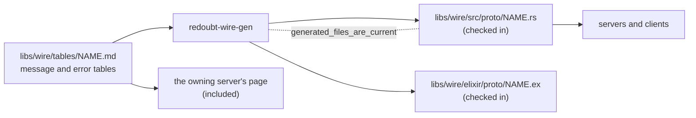

# Wire formats

Every message between Redoubt processes uses one of two wire formats: plain 9P2000 for files, or
a **typed message** whose layout is fixed by a table. Both share one encoding and one codec
library, `redoubt_wire` in `libs/wire/`, which also holds the strict JSON parser for files people
write. The typed codecs are generated from the tables, so a sender and a receiver cannot disagree
on a layout.

## Purpose

Every server parses bytes from processes it does not trust. One codec, written once without
`unsafe`, fuzzed and shared, is cheaper to trust than one per server, and a table that is also
the source of the code cannot drift from it. The library holds no state and no authority: it
turns bytes into values and values into bytes.

## Interface

### The message convention

Status: built · tested: host:redoubt-wire::inline_packs_little_endian_into_three_words, host:redoubt-wire::inline_overflow_is_refused, host:redoubt-wire::words_must_fit_in_32_bits, host:redoubt-wire::buffer_length_is_bounded, host:redoubt-wire::error_replies_carry_only_a_status, host:redoubt-wire::file_framing, host:redoubt-wire::example_vectors, host:redoubt-wire::layouts_by_hand, fuzz:redoubt-wire/typed

A message is four machine words, up to four handles (`MAX_MSG_HANDLES`) and at most one buffer
([IPC](../kernel/ipc.md#messages)). `libs/wire/src/typed.rs` lays a typed message out in them:

- **Word 0 of a request is its opcode**, from the protocol's table. Opcode 0 is not one: word 0
  of a reply is a **status**, and 0 is success.
- **Inline shape.** If the request's fields and the reply's fields each have a fixed size and
  fit in `INLINE_BYTES` (12), they are packed into words 1 to 3, four bytes per word,
  little-endian, zero-padded. There is no buffer; an inline message that arrives with one is
  refused.
- **Buffer shape.** Otherwise the request's fields go in the buffer (a lend for a `call`, a
  transfer for a `send`) with their length in word 1, and words 2 and 3 are zero. The reply's
  fields are written back into the caller's lend, their length in word 1, because a reply carries
  only words and handles. So a small request whose reply carries data (a block read) is a buffer
  message. The shape is fixed per message type by its table.
- **Every word fits in 32 bits**, on both widths, and a word the layout does not use must be
  zero. So a layout is the same on rv32 and rv64.
- **Handles** travel in the message's slots, never in the bytes. The codec checks their number
  against the layout; a table names each slot's kind for the reader, but nothing checks the kind
  on receipt. A handle of the wrong kind is found by use: its first use fails with `WrongObject`
  ([the ABI](../kernel/abi.md#errors-and-their-codes)) and the server answers `malformed`.
- **Errors.** An error reply carries its code in word 0, zeros in words 1 to 3, and no handles;
  the caller ignores the buffer. **Code 1 is `malformed` in every protocol**: a request that does
  not decode (unknown opcode, wrong shape, bad lengths, a missing handle, or one of the wrong
  kind). A protocol's own codes start at 2. A reply does not repeat the opcode: the caller knows
  what it sent and names it when decoding.
- **9P in a lend.** A 9P request is a `call` whose four words are all zero, with the T-message at
  the front of its lend; the server writes the R-message over it and replies with four zero
  words. A 9P call with a non-zero word or no lend is malformed (status 1).
- **Typed operations on a 9P endpoint.** Word 0 non-zero on a 9P endpoint is a typed opcode.
  Opcodes 1 to 15 belong to `ninep_common` ([below](#ninep_common)); a protocol served on a 9P
  endpoint starts at 16, and the generator refuses a lower opcode in its table.
- **In a 9P file.** A typed operation written into a file (`ipd`'s `ctl` files) has no words, so
  it is its opcode as a `u32` followed by the buffer-shape encoding of its fields, one operation
  per `Twrite`. A message that carries handles cannot be written into a file.

```svgbob
 request                      reply
 +---------+---------+        +---------+---------+
 | word 0  | opcode  |        | word 0  | status  |  0 = ok, 1 = malformed,
 +---------+---------+        +---------+---------+  2.. the protocol's own
 | word 1  |         |        | word 1  |         |
 +---------+ fields, |        +---------+ fields, |
 | word 2  | 12 bytes|        | word 2  | 12 bytes|   inline shape
 +---------+         |        +---------+         |
 | word 3  |         |        | word 3  |         |
 +---------+---------+        +---------+---------+

 +---------+---------+        +---------+---------+
 | word 0  | opcode  |        | word 0  | status  |
 +---------+---------+        +---------+---------+
 | word 1  | length -+--.     | word 1  | length -+--.   buffer shape
 +---------+---------+  |     +---------+---------+  |
 | word 2  |    0    |  |     | word 2  |    0    |  |
 | word 3  |    0    |  |     | word 3  |    0    |  |
 +---------+---------+  |     +---------+---------+  |
 +-------------------+  |     +-------------------+  |
 | lend: fields      |<-'     | same lend: reply  |<-'
 +-------------------+        | fields            |
                              +-------------------+
 handle slots 0..3: separate from the bytes, counted against the layout
```
*Figure: a typed request and its reply, in the inline and buffer shapes; every word holds at most 32 bits.*

### The encoding

Status: built · tested: host:redoubt-wire::integers_are_little_endian, host:redoubt-wire::lengths_are_bounded_by_the_input, host:redoubt-wire::writer_refuses_overflow, host:redoubt-wire::atomic_writes_leave_nothing_on_failure, host:redoubt-wire::trailing_and_padding, fuzz:redoubt-wire/typed, fuzz:redoubt-wire/ninep

9P and typed messages share 9P's encoding (`libs/wire/src/codec.rs`): little-endian `u8`, `u16`,
`u32` and `u64`; a string as a `u16` length and UTF-8; bytes as a `u32` length and the bytes.
There are no compound types: a label set or an address travels as `bytes`, its inner layout
stated in the table's page.

- A `Reader` hands out borrowed views of its input and never reads past it: a length may claim
  anything, but the bytes it names must be present.
- A `Writer` fills a buffer the caller supplies and refuses to run past its end. Writes are
  atomic: an encoding that fails leaves nothing in the buffer.
- Decoding is strict: bytes left over after the last field, a string that is not UTF-8, or a
  word the layout does not use that is not zero are refused. So a value has exactly one
  encoding ([R29 (strict decoding)](#r29-strict-decoding)).
- Nothing in 9P or typed decoding allocates; only JSON does.

### 9P2000 as Redoubt uses it

Status: built · tested: host:redoubt-wire::tversion_bytes, host:redoubt-wire::twalk_bytes, host:redoubt-wire::rstat_sizes_nest, host:redoubt-wire::framing_is_strict, host:redoubt-wire::walk_limit, host:redoubt-wire::encode_respects_msize_and_buffer, host:redoubt-wire::a_directory_entry_that_does_not_fit_is_not_written, host:redoubt-wire::directory_reads, host:redoubt-wire::ninep_vectors, fuzz:redoubt-wire/ninep

`libs/wire/src/ninep.rs` is plain 9P2000, as in Plan 9's intro(5): no `.u`, no `.L`.

- **`msize` is fixed** at `MSIZE` (64 KiB: `MAX_LEND_PAGES`, 16 pages of 4 KiB), the largest lend.
  The only version string is `9P2000`.
- **One connection per endpoint handle.** A 9P connection is a badge on the server's endpoint:
  fids are kept per badge, account and label set, so each badge the server mints is a
  connection of its own ([the 9P server skeleton](serving.md#the-9p-server-skeleton)).
- **Strict framing.** The size field must frame the message exactly, every string is UTF-8, a
  walk has at most `MAXWELEM` (16) names, and a stat's own size fields must agree with its
  contents. So `encode(decode(b)) == b` for every accepted `b`.
- **What the codec does not judge:** whether a walk name is `..` or holds a `/`, whether a fid is
  in use, whether the version is right. Those are protocol state, and the
  [serving library](serving.md) checks them.
- **The conformance corpus.** `libs/wire/vectors/9p.txt` holds request and reply vectors, each
  accepted one checked against a message built by hand; every 9P server also runs it against its
  own skeleton.

### Wire tables and the generator

Status: built · partly tested: the generated Elixir codec is checked against the Rust one by `libs/wire/elixir/run-vectors`, which no bench case runs · tested: host:redoubt-wire-gen::generated_files_are_current, host:redoubt-wire-gen::parses_tables, host:redoubt-wire-gen::refuses_bad_tables, host:redoubt-wire-gen::every_row_is_read_or_refused, host:redoubt-wire-gen::ninep_marker_sets_the_opcode_floor, host:redoubt-wire-gen::malformed_is_code_one_everywhere, host:redoubt-wire-gen::kind_column_is_checked, host:redoubt-wire-gen::inline_boundary_is_twelve_bytes, host:redoubt-wire::generated_vectors_are_current, bench:wire-host-tests

Each typed protocol is defined by one file, `libs/wire/tables/<protocol>.md`: a message table and
an error table, each under a marker line (`<!-- wire: NAME -->`, `<!-- wire-errors: NAME -->`).
Its owning server's page includes the file, so the table on the page is the definition.
`libs/wire/tables/example.md` is the guide to writing one; the generator (`libs/wire/gen/`,
crate `redoubt-wire-gen`) enforces every rule in it:

- **Rows.** A message row is `| Opcode | Message | Fields | Reply |`: a non-zero decimal opcode
  with one spelling, unique in the table; a snake_case name that clashes with nothing in the
  generated code; the request's fields and the reply's, each `` `name: type` `` (`u8`, `u16`,
  `u32`, `u64`, `string`, `bytes`, or `handle[N] KIND`) or `-` for none. An error row is a code
  and a name; the generator adds `malformed` as code 1 and refuses a table that names code 1
  itself.
- **Sends.** A table's messages are `call`s. A protocol that needs a `send` adds a `Kind` column
  after Opcode, and a `send`'s reply must be `-`, since nothing answers a send.
- **A 9P endpoint.** A table marked `<!-- wire: NAME ninep -->` is served on a 9P endpoint, and
  its opcodes start at 16.
- **No silent rows.** A table ends at its first blank line, and a row-like line right after it is
  refused, so a stray blank line cannot drop rows. A table with the header but no marker is
  refused. Tables inside fenced code blocks are ignored.
- **Output.** `cargo run -p redoubt-wire-gen` writes `libs/wire/src/proto/NAME.rs` and
  `libs/wire/elixir/proto/NAME.ex` for each protocol. The generated files are checked in, and
  `generated_files_are_current` fails if they differ from the tables or if a generated file has
  no table any more (`-- --check` names them). So changing a table means regenerating, in the
  same commit ([R30 (one layout per message)](#r30-one-layout-per-message)).


*Figure: one table feeds the page, the Rust codec and the Elixir codec; the drift check compares the checked-in code with the tables.*

Each generated Rust module has a `Message` and a `Reply` enum with `decode`, `encode`,
`decode_file` and `encode_file`, and an `ErrorCode` enum. The vector files
`libs/wire/vectors/example.txt` (written by hand) and `example-generated.txt` (thousands of
hostile inputs with the Rust codec's verdict on each) are run by both codecs, through the
fixture protocol `example`, which no server speaks.

### Granting and releasing

Status: built · tested: host:redoubt-rt::typed_replies_close_the_handles_made_for_the_caller, host:redoubt-rt::a_strangers_id_is_refused_like_one_that_does_not_exist, host:redoubt-keyd::serving_grant_rolls_back_discard_missing_capability_and_error

A typed protocol that mints a narrower capability for a client names two operations for it: a
**grant** that replies with the new endpoint handle and a random id, and a **release** that frees
it by id. `keyd`'s `grant` and `release` are the pattern ([keyd](keyd.md)). A 9P server has the
same pair in `ninep_common`, `new_connection` and `disconnect`. Both are served by the one table of
minted capabilities ([minted connections](serving.md#minted-connections)): only the client that
received an id may release it, and a stranger's id is answered like one that does not exist.

### A launcher releases its child's grants

Status: planned · M1 (separation and containment)

A process that launches a child and asks servers to grant capabilities for it keeps each grant's
id. On the child's exit notice ([processes](../kernel/processes.md#exit-notices)) the launcher
releases every grant it made for that child, at every server, and disconnects the child's fresh
connections ([init](init.md#fresh-connections-per-child)), so a dead child's grants do not hold
their servers' admission for the life of the launcher.

**Open:** whether a launcher that dies itself leaves the release to its own launcher through
`disconnect_all`, or whether each server learns of the child's exit directly.

### `ninep_common`

Status: built · tested: host:redoubt-rt::minted_connections_are_admitted_and_fold_into_the_share_they_came_from, host:redoubt-rt::disconnect_frees_everything_minted_under_it_and_only_for_its_holder, host:redoubt-rt::a_strangers_id_is_refused_like_one_that_does_not_exist, host:redoubt-rt::unasked_handles_are_closed_and_other_opcodes_are_malformed

Every 9P endpoint also serves `ninep_common`, typed opcodes 1 to 15. `new_connection(root, quota)`
mints a fresh connection rooted at `root`, a path relative to the caller's own root that never
climbs above it, and replies with the connection's endpoint handle and its id. `quota` is the
byte quota asked for (0: none of its own), which a file server may refuse (`refused`); a server
that meters no bytes ignores it. `disconnect(id)` frees the connection with that id and
everything minted under it; an id the caller did not receive is `not_yours`, the same answer as
an id that does not exist. Opcodes 1 and 4 to 15 are reserved and malformed. How the skeleton
serves them is on [the serving library](serving.md#the-9p-server-skeleton).

The table: [libs/wire/tables/ninep_common.md](../../libs/wire/tables/ninep_common.md).

{{#include ../../libs/wire/tables/ninep_common.md}}

### Strict JSON

Status: built · tested: fuzz:redoubt-wire/json, host:redoubt-wire::accepts_json, host:redoubt-wire::integers_only_within_2_to_53, host:redoubt-wire::big_integers_as_strings, host:redoubt-wire::duplicate_members_are_refused, host:redoubt-wire::depth_is_bounded, host:redoubt-wire::size_is_bounded, host:redoubt-wire::text_rules, host:redoubt-wire::syntax_errors, host:redoubt-wire::unknown_members_are_errors, host:redoubt-wire::schema_errors_name_the_path, host:redoubt-wire::heap_is_bounded, host:redoubt-wire::stack_is_bounded

`libs/wire/src/json.rs` is the one parser for files people write (the boot manifest, package
manifests, configuration): RFC 8259 syntax under the I-JSON profile (RFC 7493), narrowed so
each value has one spelling.

- UTF-8 only, no byte-order mark, no surrogates or Unicode noncharacters, escaped or raw.
- No object has two members with the same name, compared byte for byte after unescaping.
- **Each field's JSON type is fixed by its schema.** A 64-bit quantity (an id, an account, a size
  in bytes or pages, a deadline) is a canonical decimal string (digits only, no sign or leading
  zeros); a small count (a weight, a depth, a restart limit) is a number. The wrong type is an
  error. Numbers are integers within ±(2^53 − 1): no fractions, exponents or `-0`, so the parser
  has no floating point.
- Nesting at most `MAX_DEPTH` (32) deep; a file at most `MAX_LEN` (64 KiB).
- **Unknown members are errors.** An object is decoded only through `Value::object`, which refuses
  any member the decoder did not take.
- An error names where it happened (`servers[2].budget.pages`).
- **Cost is bounded** for a caller that must size its memory before parsing: time linear in the
  input, heap at most 32 bytes per input byte (2 MiB for the largest file), stack bounded by the
  depth.

The fuzz target checks it against `serde_json`: whatever it accepts, `serde_json` accepts with the
same value, and whatever it refuses as plain syntax, `serde_json` refuses.

## Authority

Status: built · tested: host:redoubt-wire::lengths_are_bounded_by_the_input, host:redoubt-wire-gen::kinds_are_documentation_only

The library has none. It holds no handles and makes no calls; it decodes what a server received
and encodes what the server sends. Nothing in a message says who sent it: the badge, account and
labels are the kernel's, attached to the message outside the bytes
([R14 (unforgeable sender)](../kernel/ipc.md#r14-unforgeable-sender)). A table's handle kinds
grant nothing either: they are documentation, and the kernel checks a handle by use.

## Security properties

### R29 (strict decoding)

Status: built · tested: fuzz:redoubt-wire/ninep, fuzz:redoubt-wire/typed, fuzz:redoubt-wire/json, host:redoubt-wire::lengths_are_bounded_by_the_input, host:redoubt-wire::framing_is_strict, host:redoubt-wire::trailing_and_padding, host:redoubt-wire::words_must_fit_in_32_bits, host:redoubt-wire::buffer_length_is_bounded, host:redoubt-wire::heap_is_bounded, host:redoubt-wire::stack_is_bounded

Decoding untrusted bytes never panics, never reads outside its input, and never loops without
consuming it; a 9P or typed value that decodes re-encodes to exactly the bytes it came from, so
every value has one encoding; and JSON's time, heap and stack are bounded by its input. The crate
forbids `unsafe`. So a hostile client can make a server refuse a message, never crash it through
the codec or make two servers read one message two ways. The fuzz targets check the round trip
for every accepted input.

### R30 (one layout per message)

Status: built · tested: host:redoubt-wire-gen::generated_files_are_current, host:redoubt-wire-gen::refuses_bad_tables, host:redoubt-wire-gen::every_row_is_read_or_refused, host:redoubt-wire-gen::malformed_is_code_one_everywhere, host:redoubt-wire-gen::ninep_marker_sets_the_opcode_floor, bench:wire-host-tests

Each typed message has exactly one layout, defined by one table, and the codecs every sender and
receiver use are generated from it and checked against it in the bench. Code 1 means
`malformed` in every protocol, and no protocol on a 9P endpoint uses an opcode `ninep_common`
owns. So a server and its client cannot disagree on what a message says, and a table on a page
cannot say something the code does not do.

## Failure and restart

Status: built · tested: host:redoubt-rt::malformed_requests_and_oversized_replies, host:redoubt-wire::atomic_writes_leave_nothing_on_failure, host:redoubt-wire::encode_respects_msize_and_buffer

The library keeps no state, so it has nothing to restart. A message that does not decode is an
`Error` its server answers with `malformed` (or an `Rerror` for 9P). An encoding that does not
fit its buffer fails with `TooLarge` and leaves the buffer untouched; the serving library then
answers the call with the malformed reply ([replies and rollback](serving.md#replies-and-rollback)).

## Residual risks

- **Handle kinds are not checked on receipt.** A server that keeps a received handle without
  using it keeps a handle of whatever kind was sent, until it first uses it.
- **The Elixir codec's differential run is outside the bench.** `libs/wire/elixir/run-vectors`
  needs the BEAM and a beamlet checkout; a change that breaks the Elixir codec passes the bench.
- **JSON costs 32 times its input in heap.** A caller parsing the largest file needs 2 MiB free;
  one that cannot spare it must refuse the file before parsing.
- **The fuzz targets run outside the bench.** No bench case runs the wire codecs' fuzz targets;
  they are run by hand.
- **The codec does not judge paths.** `..` and `/` in walk names pass the codec; a server that
  bypassed the serving library would have to check them itself.

## Why

- **Tables as the source.** A layout written in prose and again in code drifts; one table that
  the page shows and the generator reads cannot.
- **9P's encoding for everything.** One encoding means one codec to fuzz, and typed messages
  gain its bounds for free.
- **32-bit words.** One layout on rv32 and rv64 means a codec tested on one width is tested on
  both.
- **Reply data in the caller's lend.** A reply carries only words and handles, so data can only
  come back where the caller lent room for it; a message whose reply carries data is buffer-shaped
  for that reason.
- **Kinds checked by use.** The kernel does not report a received handle's kind, and every call
  already checks the kind of the object it acts on; a second check on receipt would need a new
  call and add nothing.
- **Strings above 2^53 in JSON.** I-JSON's safe range is where every parser agrees on a number;
  a 64-bit id written as a number would be read differently by different tools.
