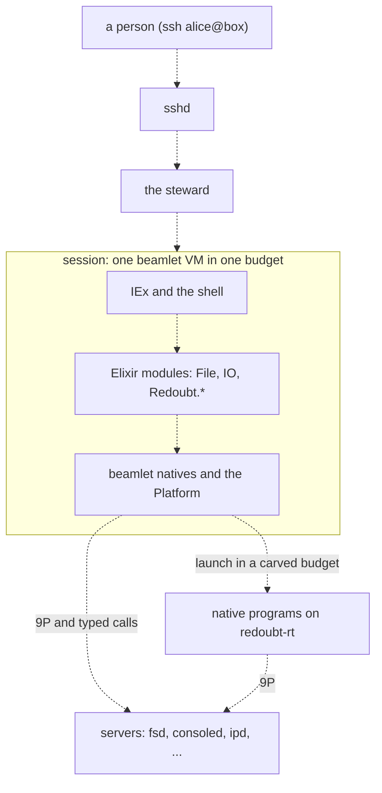

# Userland

Userland is everything above the servers: what a person, an agent or a developer meets on the
box. A person logs in over SSH and gets an Elixir session, an interactive IEx prompt running in a
beamlet VM of its own, in a budget of its own, with a namespace the steward built for it. An agent
gets the same kind of VM under a lease, with capabilities narrowed from its launcher's. Native
programs, written in Rust against `redoubt-rt`, run in budgets the session carves for them. There
is no POSIX shell, no `fork`, no signals, no root and no global file tree: a session reaches
exactly what its handles name, and nothing else.

## Purpose

These pages say what userland looks like from the prompt, and why. Each one takes one thing a
person or agent does:

| Page | What it covers |
| --- | --- |
| [Sessions and namespaces](sessions.md) | logging in, the session VM and its budget, vault sessions, namespaces, `approve@` |
| [beamlet, the Elixir VM](beamlet.md) | the BEAM interpreter every session and agent runs in, and its boundary with the system |
| [The shell](shell.md) | IEx as the shell: helpers, command mode, jobs, line editing, completion, help, the editor |
| [Files and binds](files.md) | files over 9P, what `File` and `Path` do, labels on files, binds, sharing |
| [Native programs](native.md) | launching Rust programs, standard I/O and pipes, killing jobs, `redoubt-rt` |
| [Agents, leases and labels](agents.md) | an agent as a principal with a sponsor, leases, delegation, the agent harness |
| [File transfer](transfer.md) | SFTP and SCP inside SSH |
| [Development on Redoubt](development.md) | `git`, compilers on the box, Rust built off the box |
| [Packages](packages.md) | `pkg add`, `use`, `gc`, trust lists, profiles |

The mechanisms underneath belong to other pages: handles, IPC, budgets and processes to
[the kernel](../kernel/README.md); the steward, the file server, `sshd` and the rest to
[the servers](../servers/README.md).

## What a person sees

Status: planned · M1 (separation and containment)

Alice runs `ssh alice@box`. `sshd` and the steward authenticate her with her own key, the steward
starts her session, and she is at an IEx prompt. The session is one beamlet VM in one budget carved
from hers; everything she types runs there, and every call it makes carries her account and the
session's label set, which the kernel stamps and no process can forge
([R14 (unforgeable sender)](../kernel/ipc.md#r14-unforgeable-sender)).

```text
$ ssh alice@box
iex(1)> File.read!("/home/alice/notes.txt")
"buy milk\n"
iex(2)> File.read!("/home/bob/notes.txt")
** (File.Error) could not read file "/home/bob/notes.txt": no such file or directory
```

Bob's home is not refused; it is absent. Alice's namespace has no entry for it, and nothing is
inherited, so the path matches nothing ([sessions](sessions.md)). Bob's session is a different
VM in a different budget, and destroying either budget ends that session and nothing else
([R10 (destruction)](../kernel/budgets.md#r10-destruction)).

`ssh alice+tax@box` opens a **vault session**: one carrying Alice's `tax` label, which can read
her labelled data and cannot send it anywhere unlabelled
([R1 (flow)](../kernel/ipc.md#r1-flow)). `ssh approve@box` is the one place Alice answers
requests for authority nobody has granted; only the steward talks to that terminal.

In M1 (separation and containment) the session is IEx with the helpers the attack suite needs:
the console, files, and launching native programs. The working shell (command mode, file
operations, pipes, jobs, line editing, completion, help and the editor) is
[the shell](shell.md)'s, for M2 (usable shell). Files in and out over SFTP and SCP are
[file transfer](transfer.md)'s, for M3 (files in and out).

**Open:** none.

## What an agent sees

Status: planned · M1 (separation and containment)

An agent is its own principal with a **sponsor**, the principal who answers for it. It runs in
its own beamlet VM, under a **lease**: a budget with a kernel deadline, placed under its
sponsor's budget ([budgets](../kernel/budgets.md#deadlines)). It holds only the capabilities its
launcher narrowed for it, and a sub-agent it starts holds only what it narrows again. When the
lease ends, everything in it ends, sub-agents included. The design assumes every agent has been
hijacked by something it read: it can do what its capabilities allow, until its lease ends, and
nothing more ([agents](agents.md)).

An agent never inherits network access. From M4 (self-hosted development) it reaches a model
provider through a `gatewayd` capability that holds the API key, never through a socket
([gatewayd](../servers/gatewayd.md)).

**Open:** none.

## What a developer sees

Status: planned · M4 (self-hosted development)

Redoubt is developed on Redoubt. A developer works in a session like any other: `git` reaches its
remotes through a `gatewayd` git capability, the Elixir and Erlang compilers run on the box in
beamlet, and Rust is built off the box. System code arrives in the signed boot bundle; a
developer's own program arrives by SFTP and runs, unsigned, with the developer's own authority
([development](development.md)). Programs and libraries reach other principals as signed packages
from M5 (persist, install, share) ([packages](packages.md)).

**Open:** none.

## The layers

Status: planned · M1 (separation and containment)


*Figure: the userland layers of one session. Every arrow is planned (dashed);
beamlet itself is built and runs on the host ([beamlet](beamlet.md)).*

Three layers, each with one job:
- **A beamlet VM per session.** beamlet is a BEAM interpreter in safe Rust. One VM is one trust
  domain: everything in it runs with the session's authority, and code with different authority
  (an agent, a sub-agent) runs in a different VM ([beamlet](beamlet.md)).
- **Elixir modules.** OTP's `File`, `IO`, `Path` and `gen_tcp` work unchanged over the VM's
  natives. What has no POSIX equivalent (handles, namespaces, budgets, leases, labels, approvals)
  gets its own `Redoubt.*` module and no compatibility shim.
- **Native programs.** Rust programs, statically linked, each started in a budget the session
  carves, with a namespace the session builds ([native programs](native.md)). Everything that
  needs no address space of its own is Elixir: there is no `cp` or `ls` binary.

**Open:** none.

## Why

**Elixir, not a POSIX shell.** A shell language is a second programming language with its own
quoting, word splitting and globbing, and a long history of injection bugs. A session that is an
Elixir VM has one language, with real data structures, and the same code serves the prompt, a
script and a program. The prompt gets short helpers and a command mode on top, not a different
language ([the shell](shell.md)).

**One VM per trust domain.** Inside a VM, processes share memory-safe terms and a scheduler, so a
VM cannot keep two parties apart. The kernel can: two VMs in two budgets are separated by page
tables, handle tables and [R1 (flow)](../kernel/ipc.md#r1-flow). So the unit of isolation in
userland is the VM, and anything with different authority gets its own.

**No inheritance.** A Unix process inherits its parent's user, file descriptors, environment and
file tree, and has to shed what it should not keep. A Redoubt process starts with nothing and is
handed each capability by name on its startup block. What a program can reach is what its
launcher wrote down, so it can be read, audited and narrowed.
