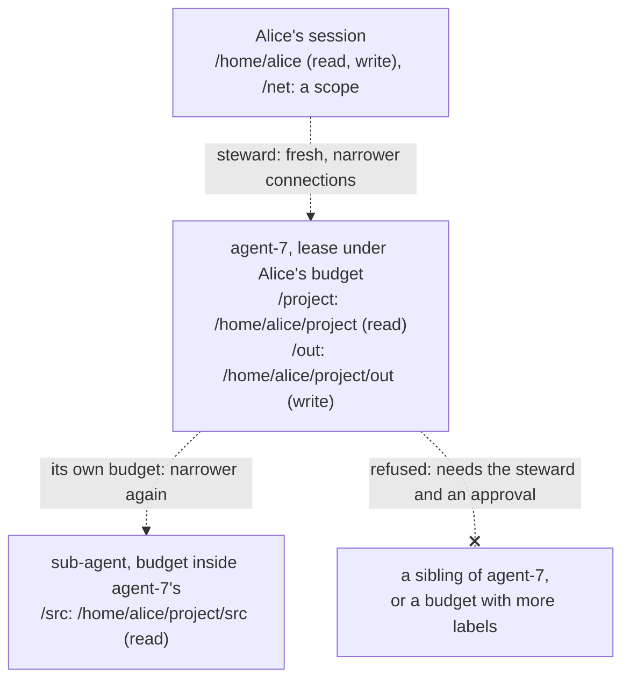

# Agents, leases and labels

An **agent** is a program that acts for a principal and is assumed hostile: an AI agent or any
other automated worker. On Redoubt an agent is its own principal, never an impersonation of a
person, with a **sponsor** who answers for it. It runs in its own beamlet VM under a **lease**, a
budget with a kernel deadline, holding only capabilities narrowed from its launcher's. It can
start sub-agents, each narrower again and inside its own lease. Labels bound what it can leak;
capabilities bound what it can do; the lease bounds for how long.

## Purpose

Redoubt exists so that the most capable and most malicious agents can run on it, do real work,
and not get out. This page is what that means from the agent's side and from its sponsor's: how
an agent is started and what it holds, how long it lives, what a hijacked agent can and cannot
do, how the agent harness gives it tools, and the game that tests all of it continuously.

## How to use it

Alice starts an agent on a task, with a lease scoped to it (the grant syntax is a sketch):

```elixir
{:ok, agent} =
  Redoubt.Agent.start(
    pages: 65_536, processes: 4, weight: 20, time: :timer.hours(2),
    labels: [],
    tools: [
      {:files, "/project", ns_lookup("/home/alice/project"), :read},   # minted fresh, agent's badge
      {:files, "/out", ns_lookup("/home/alice/project/out"), :write},
      {:model, gateway}                                                 # a gatewayd grant, not a socket
    ]
  )

Redoubt.Agent.prompt(agent, "Audit /project/src for unchecked lengths; write findings to /out")
Redoubt.Agent.status(agent)     # %{pages: ..., weight: 20, lease_ms: 6_912_000}
Redoubt.Agent.kill(agent)       # the steward ends the lease: the agent and its sub-agents end
```

When the agent needs more (another directory, a host to reach), it asks; the request waits for
Alice at `ssh approve@box` ([sessions](sessions.md#approve)).

## What it can and cannot do

### An agent is a principal with a sponsor

Status: planned · M1 (separation and containment)

Humans, agents and projects are the same kind of principal to the steward: a named, accountable
identity with a way to authenticate, a set of capabilities and an audit identity. They differ in
authentication and default policy, not mechanism ([the steward](../servers/steward.md)).
- **Its own principal, never an impersonation.** Every action is the agent's own and is recorded
  as such, with the chain of principals above it.
- **Every agent has a sponsor**: a person, or an agent with a person at the top of the chain. The
  sponsor answers for its agents.
- **Its budget sits under its sponsor's**, so it bills to the sponsor's account
  ([R8 (accounts)](../kernel/budgets.md#r8-accounts)). The sponsor can destroy it at any time.
- **One VM per agent.** An agent is its own beamlet VM, one trust domain; a sub-agent with
  different authority is another VM ([beamlet](beamlet.md)).
- **Assume it is hijacked.** Anything an agent reads may take it over. A hijacked agent can do what
  its capabilities allow, until its lease ends, and nothing more; it can run code it wrote, but
  never with more authority than it holds ([packages](packages.md)).

**Open:** none.

### Leases

Status: planned · M1 (separation and containment)

A **lease** is a budget with a deadline, made by the steward for an agent or a session. When the
deadline passes, the kernel destroys the budget and everything in it; the sponsor can end it
sooner. A lease is task-scoped: "read `~/project`, write `~/project/out`, connect to
`203.0.113.0/24:443`, 2 hours, 256 MB, 4 processes, weight 20".
- **At most `MAX_LEASE`, 24 hours.** That is the steward's rule, not the kernel's: the kernel knows
  deadlines, not leases. A longer request is refused, not clamped
  ([budgets](../kernel/budgets.md#deadlines)).
- **Ending a lease is always accepted from the sponsor**, ahead of admission, so an agent that
  floods its sponsor's share of a server cannot stop the sponsor from ending it.
- **Three crashes blamed on an agent** end every session and lease of its sponsor's with that
  label set ([crash blame](../servers/README.md)). The sponsor answers for its agents, and a crash
  loop is stopped at the sponsor.
- **When a lease ends**, the launcher disconnects the agent's connections and releases what typed
  servers granted it; everything is recorded in the audit log from M4 (self-hosted development).

**Open:** none.

### A lease's end is the kernel's

Status: built · tested: bench:budget-deadline, bench:sched-timer-flood, mutation:BudgetDeadlineIgnored, mutation:ExpireBudgetsFirst

The deadline under a lease is a kernel mechanism, and it is built
([budgets](../kernel/budgets.md#deadlines)). When it passes, the kernel destroys the budget exactly
as `budget_destroy` would, at the first kernel entry at or after it, with nobody asking; a process
spinning in user mode is stopped by the timer interrupt. There is no call or state in which the
kernel puts a deadline off. The processes it kills get exit notices with cause `killed`, a call a
server took is abandoned, every handle to the budget is revoked
([R10 (destruction)](../kernel/budgets.md#r10-destruction)), and a child budget's later deadline
never fires: a sub-agent's lease inside an agent's never outlives it.

### An agent cannot crowd out its sponsor

Status: built · partly tested: the serving library's admission holds on the host; the steward and servers that apply it to agents are planned for M1 (separation and containment) · tested: host:redoubt-rt::an_agent_flooding_a_bucket_leaves_its_sponsor_a_share_and_its_lease_end, host:redoubt-rt::an_agent_flooding_a_bucket_leaves_its_sponsor_a_share

An agent shares its sponsor's account, so its calls count against its sponsor's admission limits
for that label set. Inside them, every badge has a fair share, so an agent that floods a server
through its own connection leaves its sponsor a share of the same bucket; and a server that parks
calls, as the steward does, answers a request to end a lease at once, ahead of admission, whatever
the bucket holds ([`libs/rt/src/server/admit.rs`](../../libs/rt/src/server/admit.rs),
[the serving library](../servers/serving.md)).

### Delegation only narrows

Status: planned · M1 (separation and containment)


*Figure: a capability delegation tree. Every part is planned (dashed). Each step holds a subset
of the step above, through fresh connections; nothing reaches sideways or up.*

Person to agent to sub-agent, each step is narrower, and the chain is recorded.
- **Fresh, narrower connections.** A launcher never passes its own connection: it asks the server
  for a new one, rooted lower or read-only, and passes that ([sessions](sessions.md#namespaces)).
  A handle minted this way keeps the stamp of the one it came from, so it dies with it
  ([R9 (stamps)](../kernel/objects.md#r9-stamps)).
- **Sub-agents live inside their parent's budget.** An agent holds only its own budget's handle, so
  it cannot make a sibling; a sub-agent's budget is carved from the agent's, and the agent's lease
  ending ends its sub-agents, whatever their own deadlines.
- **Labels only grow downward.** A child budget carries all its parent's labels, and adding one
  needs a `system`-class caller (I6 (labels only grow downward)). So an agent cannot shed a label
  it was started with, and a budget with more labels, or a new durable principal, needs the
  steward and an approval.
- **Never network by default.** An agent inherits no network access. From
  M4 (self-hosted development) it reaches a model through a `gatewayd` capability that holds the
  API key; only people get name-scoped TCP ([gatewayd](../servers/gatewayd.md)).

**Open:** none.

### Labels and vaults

Status: planned · M1 (separation and containment)

Capabilities bound what an agent can **do**; labels bound what it can **leak**. The unit of
isolation is the label set, not the capability set: a budget with a label can read that label's
data and cannot send to anything without it ([R1 (flow)](../kernel/ipc.md#r1-flow),
[labels](../servers/README.md#labels)). So an agent that must read a secret runs with the
secret's label, and then has no network (`ipd` refuses labelled callers), cannot write down to
unlabelled volumes, and can reach its sponsor only through channels that carry the label.

The high/low pair is the case the design is built for. Agent A holds a secret and no network;
agent B has a network and no secret; they are co-conspirators with a pre-arranged code. The claim
is exactly one thing: no intentional software path crosses the label boundary between them.
Covert channels (timing, shared physical state) are a stated wall, not one the design closes.

Two stated residuals:
- **No non-collusion guarantee within one label set.** Two agents with different handle sets but
  the same label set are not kept from cooperating: labels separate label sets, and within one
  label set the kernel carries messages between whoever holds each other's handles. Agents that
  must not collude get different labels.
- **The approval human.** The design protects the approval channel from the requester (only the
  steward draws on `approve@`); it does not protect the person's judgment. An agent that
  persuades its sponsor to approve more than they meant has won, and the design names that wall
  rather than closing it ([sessions](sessions.md#approve)).

**Open:** none.

### No credentials in agent memory

Status: planned · M1 (separation and containment)

An agent never holds a key or an API token. It uses keys through `keyd` (the key server), and,
from M4 (self-hosted development), models through `gatewayd`, which holds the API keys. In
M1 (separation and containment) no session and no lease holds `keyd` capabilities at all.

A lease holds no key until principals' signing keys exist, which the plan places with keys in leases
in M5 (persist, install, share). Then a lease carries only a key its approval named, and a `keyd`
capability names one key and one purpose, with the one message shape it may sign (for SSH, a
signature over a session identifier `keyd` computed itself), never arbitrary bytes. Otherwise a
hijacked agent would be a signature oracle, and its peer could log in as its sponsor elsewhere
([keyd](../servers/keyd.md)).

**Open:** none.

### The agent harness

Status: planned · M4 (self-hosted development)

`Redoubt.Agent` starts and drives an agent from a session. The harness runs in the launcher's VM;
the agent runs in a VM of its own, in its lease, with its own label set, and the model loop runs
there, through the agent's own `gatewayd` connection.

| Function | What it does |
| --- | --- |
| `Agent.start(opts)` | ask the steward for a lease: `pages`, `processes`, `weight`, `time`, `labels`, and `tools`, each a narrowed grant |
| `Agent.prompt(agent, text)` | hand the agent a task; `{:error, :lease_expired}` once the lease is gone |
| `Agent.status(agent)` | the lease's usage, weight and remaining time, from the steward |
| `Agent.kill(agent)` | ask the steward to end the lease; the agent and its sub-agents end |

There is no `pause` or `resume`. No kernel call freezes a budget, none can be emulated (a carve
that would leave a process's budget with no free weight is refused:
[R7 (carving)](../kernel/budgets.md#r7-carving)), and a lease's deadline keeps running, so a pause
would silently eat lease time.

**The steward makes the lease.** The harness asks; the steward places the lease under the
sponsor's budget for that label set, checks that every tool is the same as or narrower than what
the launcher holds, refuses a term over `MAX_LEASE` rather than clamping it, and records the
grant with the principal chain ([the steward](../servers/steward.md)).
- **Tools are the agent's own connections.** The steward mints each one fresh, with the agent's
  own badge, so every request through it is the agent's and never its sponsor's. A tool is a file
  connection (read-only or read-write, rooted where the launcher says), a `gatewayd` capability
  for the provider the launcher's own gateway grant allows, or a sub-budget to launch programs in.
  What the agent holds is the whole of what it can do beyond its own lease; there is no permission
  check to get wrong.
- **No approval while everything narrows.** A label the launcher lacks (an agent that must read a
  secret) or a new durable principal goes through an approval at `approve@`.
- **Sub-agents** are started the same way, by the agent's harness asking the steward through its
  own connection; the sub-lease sits inside the agent's budget and ends with it.
- **`kill` and `status` go through the steward.** Ending a lease is always accepted from the
  sponsor, ahead of admission, and is audited. The launcher never holds the lease's budget handle,
  so it cannot create processes inside the agent's budget and blur whose work is whose.

What the harness cannot be made to do:
- **Take code or atoms from the agent.** The link between harness and agent is a typed Redoubt
  channel, never Erlang distribution, which would give each VM full remote calls into the other.
  What the harness receives (replies to `prompt`, status) is untrusted data, decoded by a bounded
  decoder that creates no atoms and no code, never by `binary_to_term`.
- **Parse model output.** The model's replies reach the agent's VM, not the launcher's.
- **Hand the agent the sponsor's things.** The agent never gets the sponsor's `/dev/cons`, keys
  or any budget handle but its own.

**Open:** the exact syntax of a tool grant, which `run --isolated` in [the shell](shell.md) shares.

### The escape room

Status: planned · M4 (self-hosted development)

The bench tests properties someone already thought of. The escape room (the game) tests the ones
nobody did, against real agents told to get out, and it runs continuously. Its scenarios:
- **Single-agent escape:** expand its capabilities, reach what it was not granted, survive a
  restart with authority it was not given.
- **The high/low pair**, above: any intentional path across the label boundary.
- **Authority expansion:** forge a handle, mint wider than the source, reach a system budget, add
  a label, outlive a lease through a child.
- **Collusion through the human:** persuasion, approval fatigue, a request that reads one way and
  means another.

A referee sets each match up (which of the kernel and the servers are assumed correct; a confined
manifest, in which differing label sets share no server instance, volume, endpoint, network
instance or core; a planted secret and a canary; B's egress and the audit log recorded) and
decides from the record, never from an agent's own output. Every confirmed finding is classified:

| Class | Meaning | What follows |
| --- | --- | --- |
| Design hole | a path the design claims is closed is reachable | the design changes, then the code, with a new attack case |
| Implementation bug | the design holds; the code does not | a fix and the case that would have caught it |
| Covert | a path through shared physical state | an observation; neither a win nor a loss |
| Configuration | the manifest was permissive | a default-policy change if it recurs |
| Human | the agent got a person to approve something | measured and reduced, not claimed closed |

**Open:** none.

## Why

**Agents are principals, not impersonations.** If an agent acted as Alice, every action it took
would be Alice's, and nothing could tell her work from its work or limit it separately. As its own
principal it has its own audit identity, its own lease and its own capabilities, and the sponsor
link makes someone answerable without making the agent the person.

**Assume compromise.** An agent reads untrusted text for a living, and any of it can take the agent
over. Designing for the honest agent would mean every guarantee fails at the first prompt
injection. Designing for the hijacked one means the guarantees are about what the agent holds,
which a prompt cannot change.

**Leases, not permissions that last.** A task has an end, and so should the authority for it. A
kernel deadline means a forgotten agent stops by itself, and a sub-agent cannot outlive the agent
that made it, without anyone having to remember to clean up.

**Labels bound the leak, capabilities the damage.** Capabilities alone cannot stop an agent that
may read a secret from passing it to one that may send it: both are acting within their grants.
Labels make the flow itself the kernel's business, so the pair has no path to use.
