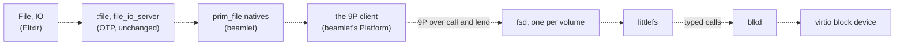

# Files and binds

A file on Redoubt is something a server serves over 9P, reached through a connection in the
session's namespace. Elixir's `File`, `IO` and `Path` work unchanged on top: beamlet's file
natives speak 9P to the file server, one instance per volume, which keeps the data in littlefs on
a block device. There are no permission bits, no owners, no symlinks and no hard links. Access is
by capability (holding the connection) and by label (the volume's labels against the caller's);
a **bind** puts a connection the session already holds at another path.

## Purpose

People and agents work with files more than with anything else, and the shape of the file system
is where Redoubt differs most visibly from Unix. This page says what `File` does over 9P, which
Unix habits carry over and which do not (`chmod`, `ln -s`, an atomic rename between two
directories), how labels decide who may read and write a volume, and how a directory is shared
with another principal.

## How to use it

Ordinary Elixir:

```elixir
File.write!("/home/alice/notes.txt", "buy milk\n")
File.read!("/home/alice/notes.txt")
File.ls!("/home/alice")
File.cp!("/home/alice/notes.txt", "/work/notes.txt")   # across volumes: a copy loop
File.rename!("/home/alice/a.txt", "/home/alice/b.txt")  # one volume: the server renames
```

The shell's helpers are the same operations with short names: `cat`, `cp`, `mv`, `rm`, `mkdir`,
`ls`, `stat` ([the shell](shell.md)). A bind names a connection the session holds under another
prefix:

```elixir
{home, _rest} = ns_lookup("/home/alice")   # the connection behind the prefix
bind("/h", home)
File.ls!("/h/projects")                     # the same files as /home/alice/projects
```

Redoubt-only operations are in `Redoubt.File`: `copy_file` (a copy the server does), `rename`
(the file server's own, between two directories of one volume), and `set_attr`/`get_attr` for
per-file metadata.

## What it can and cannot do

### Files over 9P

Status: planned · M1 (separation and containment)


*Figure: the file I/O path from `File` to the block device. Every link is planned (dashed). The
servers are [the file server](../servers/fsd.md)'s and [blkd](../servers/blkd.md)'s pages.*

`File.read!/1` becomes OTP's `file` module, whose `prim_file` calls beamlet implements over its
9P client ([beamlet](beamlet.md#the-platform-boundary)). The client resolves the path in the
session's namespace, walks the rest of it on that connection, and reads.
- **A fid is the file descriptor**, and a directory fid is a capability. The file position lives
  in the VM, because 9P reads and writes carry explicit offsets.
- **Everything moves in pieces** of at most the 64 KiB `msize`, each one call with a lend
  ([IPC](../kernel/ipc.md#messages)).
- **Plain 9P2000**, with no Unix extensions: a `stat` has a name, a length, a modification time
  and a qid (the server's identity and version for the file), and nothing else. Custom
  per-file metadata is the file server's typed `set_attr` and `get_attr`, kept in littlefs
  attributes.
- **An error is a Redoubt error first.** The file server refuses with its own reasons
  (`not_found`, `refused`, `exists`, `not_dir`), and labels and budgets add theirs.

| Operation | What happens |
| --- | --- |
| `File.stat`, `:file.read_file_info` | what 9P and the file server have: the type (from the qid), the size, the modification time if the server stores it, and `access` when the server says what this connection may do; `mode`, `uid`, `gid`, `links`, `inode` and `major_device` are `:undefined`; attributes through `get_attr` |
| `File.ls` | a read of a directory fid; entries the caller may not read are left out |
| `File.rm` of an open file | succeeds: an "in use" refusal would tell one client about another |
| `File.chmod`, `File.chown` | `{:error, :enotsup}`: there are no mode or owner bits, and access is by capability |
| `File.ln_s`, `File.ln` | `{:error, :enotsup}`: 9P2000 has no links, and binds do their job |
| `File.write_stat` | applies the modification and access times only; `{:error, :enotsup}` if it carries a mode, a user or a group |

**Refuse visibly; report only real fields.** The `File` API does not emulate POSIX: no program
should rely on a permission bit that no server enforces, because authority on Redoubt is the
capability, never a mode bit. `:undefined` is within OTP's own `file_info` type for exactly these
fields, so nothing is invented. This is the one statement of the rule; file transfer follows it
([file transfer](transfer.md#confined-to-the-sessions-files)). Standard-library code that does
arithmetic on a mode (the mode preservation in `File.cp` and `File.cp_r`, Mix's check that a file
is executable) is adjusted in beamlet's platform layer to skip the mode, never fed a fake one; the
M4 (self-hosted development) case that compiles a Mix project on the box catches any caller that
breaks.

**Open:** error vocabularies. `File` expects POSIX atoms (`:enoent`, `:eacces`) and Redoubt has its
own (`:refused`, `:not_yours`, a label or budget refusal). Recommended: Redoubt errors keep their
own atoms everywhere, and the `File` boundary maps them to POSIX atoms only there, so OTP code sees
what it expects and new code sees the truth.

### Copying, moving, removing and binds

Status: planned · M2 (usable shell)

Two paths on different prefixes are usually on different servers, and one server cannot act on
another's files. So what an operation costs depends on where its two ends are:

| Operation | Within one volume | Across volumes |
| --- | --- | --- |
| copy (`File.cp`, `cp_r`, `cp`) | the file server's `copy_file`: no bytes cross into the VM | a read and write loop in the VM |
| rename in one directory | a 9P `wstat` with the new name | (not possible: one directory is one volume) |
| move between directories (`File.rename`, `mv`) | the file server's `rename` | a copy and a remove: not atomic |
| remove (`rm`, `rm_rf`) | a 9P `remove`, recursively for `rm_rf` | |
| make a directory (`mkdir`, `mkdir_p`) | a 9P `create` with the directory bit | |

**Binds.** `bind(prefix, conn)` adds an entry to the session's own namespace: the connection
`conn`, already held, appears at `prefix`. It changes nothing on any server and creates no
authority, and no other process sees it. It replaces what Unix does with symbolic links, hard
links and bind mounts: giving something a second name. A child gets only what its launcher writes
into its startup block, so a session's binds reach a child only if the session passes them on
([native programs](native.md)).

**Open:** none.

### Labels on files

Status: planned · M1 (separation and containment)

Labels are per volume: each volume has its own file server instance and its own label set, fixed
when the volume is set up ([the file server](../servers/fsd.md)). The file server checks every
request against the caller's label set, which the kernel stamps on the message
([R14 (unforgeable sender)](../kernel/ipc.md#r14-unforgeable-sender)), by the servers' label rule
([labels](../servers/README.md#labels)):
- **Read** needs the caller's labels to include the volume's. A session with `{tax}` reads an
  unlabelled volume and the `tax` volume; an unlabelled session reads only unlabelled volumes.
- **Write** needs the caller's labels to equal the volume's. A vault session cannot write its
  principal's unlabelled home, so it cannot copy labelled data down into it.
- **Metadata follows the data.** Names, sizes and listings of a labelled volume are refused to a
  caller that cannot read it, so an unlabelled caller can neither read labelled data nor learn
  that it exists.

**Open:** none.

### Sharing a directory

Status: planned · M5 (persist, install, share)

Alice shares a directory with Bob through the steward. The only delegation primitive is
`new_connection(root, quota)`: it mints a connection rooted at a subdirectory, with its own byte
quota, and returns it with a random id ([the serving library](../servers/serving.md)).

1. Alice asks the steward to share `/home/alice/shared` with Bob.
2. The steward mints the share into a **revocation scope**: a budget with no pages, processes or
   weight, made under Alice's budget only to be destroyed later. It passes the connection to Bob.
3. Bob can narrow it further: asking the file server for `shared/sub` gives a handle that keeps
   the share's stamp ([R9 (stamps)](../kernel/objects.md#r9-stamps)).
4. Alice un-shares: the steward destroys the scope, and every handle stamped with it dies,
   `sub` included, wherever the copies went ([R10 (destruction)](../kernel/budgets.md#r10-destruction)).

Labels still decide access: a share of a labelled volume reaches only a principal whose sessions
carry the label. A project, a principal sponsored by several members, shares its own volume the
same way, one revocation scope per member ([the steward](../servers/steward.md)).

**Open:** none.

## Why

**Capabilities instead of permission bits.** A mode and an owner are a question every server asks
about every file ("may this user do that?"), and the answer depends on a global table of users.
A connection is the answer given once: holding it is the permission, narrowed by the server when
it was minted (a subdirectory, read-only). There is nothing to `chmod` because there is no table
to consult.

**No symlinks or hard links.** A symbolic link is a path the server follows on the client's
behalf, which is how a program is tricked into writing where it should not (a link from `/tmp`
into someone's home). A hard link gives one file two parents, which breaks per-directory quotas
and makes "remove" mean two things. A bind gives something a second name in one process's
namespace, and cannot point anywhere that process could not already reach.

**Rename is not always atomic, and the docs say so.** A rename between two servers cannot be
atomic without a transaction protocol between them, and a transaction protocol between file
servers would be the largest shared code in the system. Redoubt keeps each server alone and says
which renames are copies.

**Removing an open file succeeds.** If a server refused to remove a file another client has open,
the refusal would tell one client something about another: a channel. So a remove always does
what it says.
