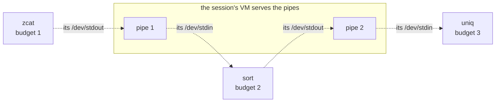

# Native programs

A native program is a statically linked Rust program that runs as a process of its own, in a
budget of its own, with exactly the handles and namespace its launcher wrote into its startup
block. The session launches one when a stage must run apart from the session's VM: untrusted
input, work that needs its own address space, or authority the session should not lend. Programs
are written against `redoubt-rt`, the native runtime; they read and write their standard streams
as files, join into pipelines through pipe files the shell serves, and end when their budget is
destroyed.

## Purpose

Most work in a session is Elixir and needs no process of its own. A native program is for the
rest: a parser for a file format nobody trusts, a compressor, a compiler's back end, a tool from
outside. Redoubt has no `fork`, no `exec` and no file-descriptor table, so launching, standard
I/O, pipes and killing all work differently from Unix. This page says how, and what the runtime
gives a program.

## How to use it

From the session, a pipeline of native stages:

```elixir
pipe(~w(zcat big.gz | sort | uniq)) |> w("uniq.txt")
cat("dump.bin") |> pipe(~w(parse --json)) |> grep("warn")   # an untrusted parser as one stage
```

The explicit form gives every authority by name:

```elixir
{:ok, job} =
  Redoubt.Process.start("/boot/bin/grep", ["-n", "needle"],
    namespace: [{"/", work}, {"/dev/stdin", pipe_r}, {"/dev/stdout", pipe_w}],
    handles:   [keys: keyd],
    budget:    [pages: 4096, processes: 1, weight: 10])
Job.await(job).exit
Job.kill(job)
```

A program is a Rust crate on `redoubt-rt`; `src/bin/echo-client.rs` in `libs/rt` is a complete
one:

```rust
#![cfg_attr(target_os = "none", no_std, no_main)]
redoubt_rt::entry!(run);

fn run(startup: &redoubt_rt::startup::Startup) -> u32 {
    let (conn, rest) = startup.resolve("/echo").expect("no /echo in my namespace");
    // ... a 9P client on `conn`, walk `rest`, read and write ...
    redoubt_rt::exit::OK
}
```

## What it can and cannot do

### Launching a program

Status: planned · M1 (separation and containment)

One mechanism launches every process after `init`, at boot or from a session
([init](../servers/init.md)):
1. The launcher creates an empty process in the target budget, naming the endpoint that will
   receive its exit notice ([processes](../kernel/processes.md#creating-and-starting)).
2. It maps the **loader stub** into the process: a flat, system-signed binary, the same for
   everyone, which needs no parsing to map.
3. It copies the program's ELF bytes into pages and moves them into the process as data, writes
   the startup block (namespace, named handles, arguments) into a page mapped read-only, and
   starts the process at the stub with the startup page's address as its argument.
4. The stub, running inside the new process's own budget, parses the ELF from memory, maps its
   segments at their link addresses (code executable, never writable), frees the image pages,
   and jumps to the entry point.

The launcher copies bytes and never parses an ELF, so a malicious ELF can at most compromise the
process it was going to become. From a session, the launch natives do the three process calls and
Rust writes the startup block ([beamlet](beamlet.md#natives)); the namespace, the handles and the
budget come from the Elixir caller, so every authority the child gets is on that one call.
- **The launcher reads the program.** There is no kernel path lookup: a session that cannot read
  a program's file cannot run it. In M1 (separation and containment) programs come from the boot
  bundle, `/boot`.
- **No signature is needed to run code within one's own authority.** A session can already run
  any Elixir it writes, so a program it launches with a subset of its own handles gains nothing.
  Signatures gate only what the steward launches with new grants ([packages](packages.md)).
- **At most `MAX_START_HANDLES` (64) handles**, namespace entries included.
- **No shared text.** Each launch copies the program image; there is no demand paging and no
  code shared between processes ([init](../servers/init.md)).
- **No dynamic linking.** Code shared at run time is a server, not a library. The dynamic part of
  the system is the BEAM, whose modules load at run time.

**Open:** none.

### Standard input and output, and pipes

Status: planned · M2 (usable shell)

There is no pipe object, no file-descriptor table and no inheritance. A program's standard
streams are names in its namespace, and a pipe is a 9P file that somebody serves: a pipeline is
the shell binding names in each child's namespace before starting it.


*Figure: a pipeline. Every part is planned (dashed). Each stage runs in its own budget; each pipe
is a file the session's VM serves, bound as one stage's `/dev/stdout` and the next stage's
`/dev/stdin`.*

What follows from pipes being served files:
- **Backpressure is free.** A write is a `call`, and the server replies when there is room.
- **End of file falls out of the exit notice.** When a stage exits, the launcher disconnects its
  connections, and the pipe's server sees its last writer go; the next stage reads end of file.
- **Labels work out.** A user-level server has no label exemption, and a session serves only its
  own children's pipes, so a pipe between two label sets fails, as it should
  ([R1 (flow)](../kernel/ipc.md#r1-flow)).
- **No stage holds the console.** A native stage never gets the raw `/dev/cons`: an interactive
  stage's standard input is a pipe the session feeds from the console, so the shell always sees
  the interrupt key ([the shell](shell.md#interrupting-and-killing-jobs)).
- **A pipe is readable as a file.** A zero-copy alternative, stages sending pages to each other
  over an endpoint, is not 9P, so a program could not read its input as a file; it is not taken.

**Open:** two choices.
- The names of the three streams: with no descriptors to duplicate, each child needs distinct
  names. Recommended: `/dev/stdin`, `/dev/stdout` and `/dev/stderr` namespace entries.
  Alternative: `/fd/0`, `/fd/1`, `/fd/2`.
- Who serves a pipe. Recommended: the session's VM, which needs `serve` and `reply` natives and a
  9P server codec in beamlet (also needed to capture `System.cmd` output). Alternative: a small
  `piped` server per session, which keeps bulk bytes out of the session's VM at the cost of one
  more server.

### Killing a job

Status: planned · M2 (usable shell)

There is no per-process kill and no signal. Killing is destroying a budget
([R10 (destruction)](../kernel/budgets.md#r10-destruction)): every process in it ends, every handle
stamped with it dies wherever it went, and every budget carved from it goes too. So the shell
carves one budget per native stage from the session's, and `Job.kill(job)` destroys that budget
and nothing else.

A process has **one exit notice**, delivered once, on the endpoint named when it was created;
there are no death subscriptions. The notice says how it ended: `exited` with its code, `faulted`
with the fault's cause, or `killed` when its budget was destroyed
([processes](../kernel/processes.md#exit-notices)). `Job.status/1` reports those as `:exited`,
`:faulted` and `:killed`. When the notice arrives, the launcher disconnects the child's
connections and releases what typed servers granted it.

Ctrl+C destroys the budgets of every native stage of the foreground job
([the shell](shell.md#interrupting-and-killing-jobs)).

**Open:** none.

### `redoubt-rt`, the native runtime

Status: built · tested: bench:rt-build, bench:d3-net-tcp, host:redoubt-rt::echo_pair_runs_on_the_runtime, host:redoubt-rt::a_launcher_gives_its_child_a_fresh_connection_and_disconnects_it, host:redoubt-rt::exit_codes_reach_the_parent, host:redoubt-rt::a_panic_is_reported_on_the_console_once, host:redoubt-rt::heap_over_map_anon, host:redoubt-rt::call_lend_and_reply, host:redoubt-rt::send_transfers_pages_for_good, host:redoubt-rt::timeouts_dead_endpoints_and_refusals, host:redoubt-rt::ownership_lifecycle_partial_reply_and_address_reuse, host:redoubt-rt::mapping_reborrows_and_failed_reply_recovery, host:redoubt-rt::the_9p_client_closes_handles_a_hostile_server_sends

`redoubt-rt` is everything a `no_std` Rust program or server needs between the system-call ABI
(`redoubt-sys`) and its own logic ([`libs/rt/src/lib.rs`](../../libs/rt/src/lib.rs)). It builds
for rv64 and rv32, and the network servers built on it run on the real kernel, launched through
the loader stub.

| Module | What it gives |
| --- | --- |
| `start` | the entry point (`entry!`), exit codes (`OK` 0, `PANIC` 101, `BAD_STARTUP` 102) and the panic handler |
| `startup` | the startup block, parsed defensively ([sessions](sessions.md#how-a-program-reads-its-namespace)) |
| `handle` | typed handles and the system calls that are not IPC |
| `ipc` | lends and transfers, `call`, `send`, `receive`, `reply`, `serve` |
| `heap` | the global allocator, over `map_anon` |
| `path` | lexical path cleaning, so `..` never climbs above a root |
| `client` | a small synchronous 9P client |
| `server` | the shared server library ([the serving library](../servers/serving.md)) |

- **Start and end.** `entry!(run)` receives the startup page's address from the loader stub,
  parses the block, and calls `run`; its return value is the exit code. A block that does not
  parse exits with `BAD_STARTUP`. A panic prints its message once on `/dev/cons`, if the program
  has one, and exits with `PANIC`; if the program held open calls, the kernel blames the sender
  of the call it was serving ([R21 (crash blame)](../kernel/processes.md#r21-crash-blame)).
- **The lend belongs to the call.** `call` takes ownership of the buffer it lends. When the call
  completes, the outcome hands the buffer back unless the server had received the call and it
  was then abandoned, in which case the buffer is consumed: disarmed without touching or
  unmapping its old address, since the pages stay with the server
  ([R3 (lends and abandoned calls)](../kernel/ipc.md#r3-lends-and-abandoned-calls)). So a program
  can never hold a safe object claiming memory it no longer has, or unmap an address that has
  since been reused.
- **A partial reply is not lost.** The outcome carries the status, the buffer when returned, and
  the reply when the kernel committed one, independently. A reply that arrived with some handles
  missing (`OutOfMemory`) still owns the handles that were delivered; dropping an unclaimed reply
  closes them, so an error never leaks a handle slot
  ([R13 (one outcome per call)](../kernel/ipc.md#r13-one-outcome-per-call)). Any facade above the
  runtime has to keep this accounting.
- **The 9P client does not trust the server.** One request at a time in one lent buffer; a walk
  of at most 16 components after cleaning, refused rather than split; a reply must decode, carry
  the request's tag and be the matching reply, and every count is checked against what was asked.
  A 9P reply carries no handles, so any that arrive are closed. For launchers it also has
  `new_connection` and `disconnect`.
- **Tested on the host against a fake kernel.** Every system call goes through one function; on
  the machine it is the `ecall`, on the host a `HostKernel` a test installs, so the runtime and
  programs built on it (the echo client and server) run in host tests.

### Client crates and the Rust `std` target

Status: planned · M4 (self-hosted development)

For Redoubt to be developed on Redoubt, native programs need more than the runtime: a client
crate for each server's API (the file server's typed calls, `keyd`, the steward, `ipd`'s
`/net`), speaking the servers' own wire protocol ([the wire protocol](../servers/wire.md)), and
a Rust `std` target so ordinary crates build for the box. Programs are built off the box and
shipped signed ([development](development.md)).

**Open:** the shape of the client API and of `std`. The recommendation is to grow one client API
from the operations real callers need, not from a speculative facade, and to settle in one place
whether `std` gets a backend (`std::fs` over 9P) or is rejected in favour of explicit capability
calls; the runtime's ownership and error contract above is the base either way. A general Rust
operating-system facade is beyond M5 ([beyond](../beyond/rust-os-facade.md)).

## Why

**Launch copies, the child parses.** If the launcher parsed ELF files, a malformed program could
take over the launcher, which in a session is the session and at boot is `init`. With the parser
in a stub inside the child, running in the child's own budget, the worst a hostile ELF can do is
wreck the process it was about to become. seL4 and Fuchsia launch the same way.

**Standard streams as names, pipes as files.** Unix hands a child its parent's descriptors, and
the child inherits whatever the parent forgot to close. Here a child has exactly the names its
launcher bound: `/dev/stdin` is a file like any other, and a pipe is a server's file whose
backpressure and end-of-file come from 9P and the exit notice with no new kernel object.

**Killing by budget.** A per-process kill would be a new authority (who may kill whom?) and would
leave a killed process's children and handles to clean up. Destroying a budget is the one
revocation the kernel has: it takes the process, its children and every handle stamped with it,
and the launcher holds the budget, so the authority to kill is simply having launched.

**One runtime, tested on the host.** Every native program and server links the same runtime, so
its ownership rules are written and tested once. The fake kernel makes those tests fast and lets
them build situations (an abandoned call, a partial reply, a reused address) that are hard to
arrange on the machine.
