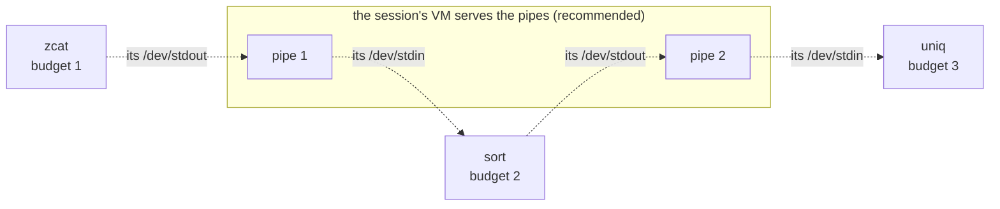

# Native programs

A native program is a statically linked Rust program that runs as a process of its own, in a
budget of its own, with exactly the handles and namespace its launcher wrote into its startup
block. The session launches one when a stage must run apart from the session's VM: untrusted
input, work that needs its own address space, or authority the session should not lend. Programs
are written against `redoubt-rt`, the native runtime; they read and write their standard streams
as files, join into pipelines through served pipe files, and end when their budget is destroyed.

## Purpose

Most work in a session is Elixir and needs no process of its own. A native program is for the
rest: a parser for a file format nobody trusts, a compressor, a compiler's back end, a tool from
outside. Redoubt has no `fork`, no `exec` and no file-descriptor table, so launching, standard
I/O, pipes and killing all work differently from Unix. This page says how, and what the runtime
gives a program.

## How to use it

From the session, a pipeline of native stages:

```elixir
pipe(~w(zcat big.gz | sort | uniq)) |> w("uniq.txt")
cat("dump.bin") |> pipe(~w(parse --json)) |> grep("warn")   # an untrusted parser as one stage
```

The explicit form gives every authority by name:

```elixir
{:ok, job} =
  Redoubt.Process.start("/boot/bin/grep", ["-n", "needle"],
    namespace: [{"/", work}, {"/dev/stdin", pipe_r}, {"/dev/stdout", pipe_w}],   # recommended names
    handles:   [keys: keyd],
    budget:    [pages: 4096, processes: 1, weight: 10])
Job.await(job).exit
Job.kill(job)
```

A program is a Rust crate on `redoubt-rt`; `src/bin/echo-client.rs` in `libs/rt` is a complete
one:

```rust
#![cfg_attr(target_os = "none", no_std, no_main)]
redoubt_rt::entry!(run);

fn run(startup: &redoubt_rt::startup::Startup) -> u32 {
    let (conn, rest) = startup.resolve("/echo").expect("no /echo in my namespace");
    // ... a 9P client on `conn`, walk `rest`, read and write ...
    redoubt_rt::exit::OK
}
```

## What it can and cannot do

### The loader stub

<details><summary>Status: built · tested (12)</summary>

- bench:stub-launch
- fuzz:stub/plan
- host:stub::plan_maps_a_well_formed_segment
- host:stub::plan_refuses_two_segments_that_overlap_each_other
- host:stub::plan_refuses_a_segment_reaching_into_the_stub_region
- host:stub::image_in_bounds_refuses_an_image_overlapping_the_startup_page
- host:stub::plan_refuses_writable_and_executable
- host:stub::plan_refuses_writable_without_readable
- host:stub::plan_refuses_a_non_riscv_machine
- host:stub::plan_refuses_an_entry_outside_any_executable_segment
- host:stub::plan_refuses_more_than_max_phnum_segments
- host:stub::read_image_refuses_an_image_len_over_the_cap

</details>

By design every process after `init` is launched one way. Both halves are built: the launcher's
calls, made in the bench by a user-class parent, and the stub
([`stub/src/lib.rs`](../../stub/src/lib.rs), [`stub/src/main.rs`](../../stub/src/main.rs)):
1. The launcher creates an empty process in the target budget, naming the endpoint that will
   receive its exit notice ([processes](../kernel/processes.md#creating-and-starting)).
2. It maps the **loader stub** into the process at its fixed address: a flat binary, the same for
   everyone, which needs no parsing to map.
3. It copies the program's ELF bytes into the process as data, 64 pages at a time, each batch
   into fresh pages it then moves in, so a launcher never holds more than one batch, writes the
   startup block (namespace, named handles, arguments) into a page mapped read-only, and starts
   the process at the stub with the startup page's address as its argument.
4. The stub, running inside the new process's own budget, parses the ELF from memory, maps its
   segments at their link addresses (code executable, never writable), frees the image pages,
   and jumps to the entry point.

The launcher copies bytes and never parses an ELF, so a malicious ELF can at most compromise the
process it was going to become. The stub refuses, by exiting: segments that overlap each other,
the stub, the startup page or the stack; a segment writable and executable, or writable without
readable; an entry outside every executable segment; more than 64 segments; a machine other than
RISC-V; and an image longer than the cap. In the bench a user-class parent launches a well-formed
child and a set of hostile ELFs, including 32 with fuzzed headers, through the real stub: each
hostile child only exits or faults, the budget the children run in is back to empty after each,
and a well-formed child still runs afterwards.

### Launching from a session

Status: built · partly tested: over SSH a steward's session launches, a vault session and a plain one; on the UART console the session is a tester's in the steward's place · tested: bench:steward-vault-launch, bench:beamlet-launch, host:beamlet-redoubt::a_launch_takes_what_it_is_given_and_its_end_is_an_event, host:beamlet-redoubt::a_labelled_sessions_child_takes_its_labels_and_runs, host:beamlet-vm::a_launch_takes_everything_from_its_caller_and_its_end_arrives_as_a_message, host:redoubt-client::a_bad_launch_is_refused_before_any_kernel_call

A session launches a native program through beamlet's launch native
([beamlet](beamlet.md#natives)), and its end arrives as a message to the process that launched
it; the shell's `exec` is one launch and its wait ([the shell](shell.md#the-shell-in-a-session)).
The namespace, the handles and the budget come from the Elixir caller, so every authority the
child gets is on that one call.
- **The launcher reads the program.** There is no kernel path lookup: a session that cannot read
  a program's file cannot run it. In M1 (sessions over SSH, kept apart) programs come from the boot
  bundle, `/boot`.
- **No signature is needed to run code within one's own authority.** A session can already run
  any Elixir it writes, so a program it launches with a subset of its own handles gains nothing.
  Signatures gate only what the steward launches with new grants ([packages](packages.md)).
- **At most `MAX_START_HANDLES` (128) handles**, namespace entries included.
- **No shared text.** Each launch copies the program image; there is no demand paging and no
  code shared between processes ([init](../servers/init.md)).
- **No dynamic linking.** Code shared at run time is a server, not a library. The dynamic part of
  the system is the BEAM, whose modules load at run time.

The launch native is the client library's `launch`: the namespace, the handles and the budget come
from the Elixir caller, and Rust makes the calls and writes the startup block
([the client library](#the-client-library)).

### Standard input and output, and pipes

Status: planned · M2 (usable shell)

There is no pipe object, no file-descriptor table and no inheritance. A program's standard
streams are names in its namespace, and a pipe is a 9P file that somebody serves: a pipeline is
the shell binding names in each child's namespace before starting it. The names used here
(`/dev/stdin`, `/dev/stdout`) and the session's VM as the pipes' server are the recommended answers
to the two choices open at the end of this section. One part is decided: an interactive stage's
standard input is a pipe the session feeds from the console.


```mermaid
flowchart LR
    Z["zcat<br/>budget 1"] -.->|"its /dev/stdout"| P1["pipe 1"]
    P1 -.->|"its /dev/stdin"| SO["sort<br/>budget 2"]
    SO -.->|"its /dev/stdout"| P2["pipe 2"]
    P2 -.->|"its /dev/stdin"| U["uniq<br/>budget 3"]
    subgraph VM["the session's VM serves the pipes (recommended)"]
        P1
        P2
    end
```
*Figure: a pipeline, with the recommended names and server. Every part is planned (dashed). Each
stage runs in its own budget; each pipe is a served file, bound as one stage's standard output and
the next stage's standard input.*

What follows from pipes being served files:
- **Backpressure is free.** A write is a `call`, and the server replies when there is room.
- **End of file falls out of the exit notice.** When a stage exits, the launcher disconnects its
  connections, and the pipe's server sees its last writer go; the next stage reads end of file.
- **Labels work out.** Whoever serves a pipe is a user-level server with no label exemption,
  serving one session's stages, so a pipe between two label sets fails, as it should
  ([R1 (flow)](../kernel/ipc.md#r1-flow)).
- **No stage holds the console.** A native stage never gets the raw `/dev/cons`: an interactive
  stage's standard input is a pipe the session feeds from the console, so the shell always sees
  the interrupt key ([the shell](shell.md#interrupting-and-killing-jobs)).
- **A pipe is readable as a file.** A zero-copy alternative, stages sending pages to each other
  over an endpoint, is not 9P, so a program could not read its input as a file; it is not taken.

**What is built in M1 (sessions over SSH, kept apart):** a program the shell's `exec` launches gets
one stream, a connection of its own to the session's console as `/dev/cons`, which the console
mints for it with `new_connection` and which is disconnected when the program ends; its lines
carry that connection's id. It reads that console as well as writes it, so until pipes exist a
launched program can take typing the shell would have read, and the rule above that no stage
holds the console waits for them (M2 (usable shell)).

**Open:** two choices.
- The names of the three streams: with no descriptors to duplicate, each child needs distinct
  names. Recommended: `/dev/stdin`, `/dev/stdout` and `/dev/stderr` namespace entries.
  Alternative: `/fd/0`, `/fd/1`, `/fd/2`.
- Who serves a pipe. Recommended: the session's VM, which needs `serve` and `reply` natives and a
  9P server codec in beamlet (also needed to capture `System.cmd` output). Alternative: a small
  `piped` server per session, which keeps bulk bytes out of the session's VM at the cost of one
  more server.

### Killing a job

Status: planned · M2 (usable shell)

There is no per-process kill and no signal. Killing is destroying a budget
([R10 (destruction)](../kernel/budgets.md#r10-destruction)): every process in it ends, every handle
stamped with it dies wherever it went, and every budget carved from it goes too. So the shell
carves one budget per native stage from the session's, and `Job.kill(job)` destroys that budget
and nothing else.

A process has **one exit notice**, delivered once, on the endpoint named when it was created;
there are no death subscriptions. The notice says how it ended: `exited` with its code, `faulted`
with the fault's cause, or `killed` when its budget was destroyed
([processes](../kernel/processes.md#exit-notices)). `Job.status/1` reports those as `:exited`,
`:faulted` and `:killed`. When the notice arrives, the launcher disconnects the child's
connections and releases what typed servers granted it.

Ctrl+C destroys the budgets of every native stage of the foreground job
([the shell](shell.md#interrupting-and-killing-jobs)).

Built: beamlet's `budget_destroy/1` is the kill, and the launch native's `{exit, Job, Cause,
Code}` message is the exit notice, with `exited`, `faulted` or `killed`
([beamlet](beamlet.md#natives)); `Job` and Ctrl+C come in M2 (usable shell).

**Open:** none.

### `redoubt-rt`, the native runtime

<details><summary>Status: built · partly tested: the 9P client's walk limit and its checks of a reply's tag, type and counts are not attacked; only its closing of stray handles is · tested (21)</summary>

- bench:rt-build
- bench:net-tcp
- host:redoubt-rt::echo_pair_runs_on_the_runtime
- host:redoubt-rt::a_launcher_gives_its_child_a_fresh_connection_and_disconnects_it
- host:redoubt-rt::exit_codes_reach_the_parent
- host:redoubt-rt::a_panic_is_reported_on_the_console_once
- host:redoubt-rt::heap_over_map_anon
- host:redoubt-rt::heap_in_a_fixed_arena
- host:redoubt-rt::capped_heap_refuses_before_the_kernel
- host:redoubt-rt::a_fixed_heap_is_never_capped
- host:redoubt-rt::the_record_is_zero_until_marked
- host:redoubt-rt::call_lend_and_reply
- host:redoubt-rt::send_transfers_pages_for_good
- host:redoubt-rt::timeouts_dead_endpoints_and_refusals
- host:redoubt-rt::ownership_lifecycle_partial_reply_and_address_reuse
- host:redoubt-rt::mapping_reborrows_and_failed_reply_recovery
- host:redoubt-rt::the_9p_client_closes_handles_a_hostile_server_sends
- host:redoubt-rt::threads_share_one_connection_with_their_own_lends
- host:redoubt-rt::a_consumed_lend_is_replaced_by_fresh_pages
- host:redoubt-rt::a_spawned_thread_runs_its_closure_as_this_process
- host:redoubt-rt::a_refused_thread_drops_its_closure_unrun

</details>

`redoubt-rt` is everything a `no_std` Rust program or server needs between the system-call ABI
(`redoubt-sys`) and its own logic ([`libs/rt/src/lib.rs`](../../libs/rt/src/lib.rs)). It builds
for rv64 and rv32, and the network servers built on it run on the real kernel, launched through
the loader stub.

| Module | What it gives |
| --- | --- |
| `start` | the entry point (`entry!`, and `first_entry!` for `init`), exit codes (`OK` 0, `PANIC` 101, `BAD_STARTUP` 102) and the panic handler |
| `startup` | the startup block, parsed defensively ([sessions](sessions.md#how-a-program-reads-its-namespace)) |
| `handle` | typed handles and the system calls that are not IPC |
| `ipc` | lends and transfers, `call`, `send`, `receive`, `reply`, `serve` |
| `heap` | the global allocator, over `map_anon`, or over one arena mapped once (`fix_heap`, for `init`'s [bound](../kernel/budgets.md#the-tree-from-the-boot-manifest)); capped at the startup block's `heap_pages` ([init](../servers/init.md#the-startup-block)), past which it refuses before `map_anon` is asked (an infallible allocation then panics, and the runtime exits with its panic code, 101: `heap-cap`); and a record of its cap and peak for the bench ([the memory budget](../testbench.md#the-memory-budget)) |
| `path` | lexical path cleaning, so `..` never climbs above a root |
| `client` | a small synchronous 9P client |
| `server` | the shared server library ([the serving library](../servers/serving.md)) |
| `thread` | `spawn`: a closure on a thread of this process, with a stack from `map_anon` that outlives it |

- **Start and end.** `entry!(run)` receives the startup page's address from the loader stub,
  parses the block, and calls `run`; its return value is the exit code. A block that does not
  parse exits with `BAD_STARTUP`. A panic prints its message once on `/dev/cons`, if the program
  has one, and exits with `PANIC`; a program that names a panic hook in `entry!` has it run
  first, once per process, before the report (`netd` stops its device there). If the program held
  open calls, the kernel blames the sender of the call it was serving
  ([R21 (crash blame)](../kernel/processes.md#r21-crash-blame)).
  `init`, which the loader starts with no startup block, declares `first_entry!(run)` instead:
  `run` receives the bundle the loader mapped read-only, as a `&'static [u8]`
  ([boot](../kernel/boot.md#the-loader-loads-only-the-kernel-and-init)).
- **The lend belongs to the call.** `call` takes ownership of the buffer it lends. When the call
  completes, the outcome hands the buffer back unless the server had received the call and it
  was then abandoned, in which case the buffer is consumed: disarmed without touching or
  unmapping its old address, since the pages stay with the server
  ([R3 (lends and abandoned calls)](../kernel/ipc.md#r3-lends-and-abandoned-calls)). So a program
  can never hold a safe object claiming memory it no longer has, or unmap an address that has
  since been reused.
- **A partial reply is not lost.** The outcome carries the status, the buffer when returned, and
  the reply when the kernel committed one, independently. A reply that arrived with some handles
  missing (`OutOfMemory`) still owns the handles that were delivered; dropping an unclaimed reply
  closes them, so an error never leaks a handle slot
  ([R13 (one outcome per call)](../kernel/ipc.md#r13-one-outcome-per-call)). Any facade above the
  runtime has to keep this accounting.
- **The 9P client does not trust the server.** A `Connection` holds the endpoint and no buffer or
  fids, so threads share it; each request lends its caller's `Lend`, one per thread, and a lend a
  call consumed maps fresh pages on its next call. A walk is at most 16 components after cleaning,
  refused rather than split; a reply must decode, carry the request's tag and be the matching
  reply, and every count is checked against what was asked. A 9P reply carries no handles, so any
  that arrive are closed. For launchers it also has `new_connection` and `disconnect`.
- **Tested on the host against a fake kernel.** Every system call goes through one function, to
  a `Transport`: on the machine the `ecall`, on the host the fake kernel a test installs, and any
  other backend the same way, so the runtime and programs built on it (the echo client and
  server) run in host tests. Nothing above the runtime calls the `ecall` itself: only the loader
  stub and the kernel's test programs, which test the ABI from below it, use
  `redoubt_sys::syscall`.
- **No safe call pulls memory from under its owner.** The runtime's calls that could invalidate
  memory a safe owner holds are its owners' alone: `unmap` is private to the heap, `Buffer`, `Dma`
  and `Registers`, each unmapping only what it mapped itself, `set_flags` is not offered at all,
  and `Process::map` moves pages only by taking the `Buffer` that owns them, so the raw address it
  once took is no longer a way round. `map_anon` only makes memory, and hands back an address that
  takes `unsafe` to use. A public `unmap` does not compile (a `compile_fail` test in `handle.rs`).
  A `dma_alloc` run is held by a `Dma`, which unmaps it on drop and not before; the frames stay
  the kernel's until the process ends. A device's `Registers` are unmapped only by
  `Registers::unmap`, which takes the value, so no access is left to reach them (how `init` gives
  the UART up to `consoled`).
- **No raw call from safe code.** `redoubt_rt::abi` is the kernel's types and limits without
  `redoubt-sys`'s `syscall`, so a program built on the runtime makes every call through it. The
  no-cruft case refuses a wholesale re-export and a single-line re-export or `pub` item naming
  `syscall`; a multi-line re-export list, and a `pub fn` that wraps the call, are review's. The
  loader stub and the bench's test programs call `redoubt-sys` directly and are not built on the
  runtime.
- **A thread's stack is its own.** `thread_create` takes an `extern "C" fn(usize) -> !` and a
  `Buffer`, and keeps the `Buffer`'s pages mapped for good, even after the thread exits, so no
  owner holds a thread's stack and no entry is an arbitrary address. A raw form does not compile
  (a `compile_fail` test in `handle.rs`).
- **Its `unsafe` is few and attacked.** The runtime holds 10 uses (`unsafe-budget.toml`): the
  allocator's trait, the heap's two words of a free block, a page buffer's two views, the device
  registers' read and write, and the pages mapped before the first instruction (the startup page
  and `init`'s bundle). Each states what it rests on and who guarantees it; the heap, the views
  and the registers run under Miri in the bench (`rt-miri`).

### Libraries for native programs

Status: planned · M2 (usable shell)

Native programs are `no_std` with `alloc`, so most of Rust's command-line crates, built on `std`'s
files, processes and threads, do not build for them. These do: each builds for
`riscv64imac-unknown-none-elf` with the features named, and none has C in its tree. Applications
have more latitude than servers ([the tenets](../TENETS.md#5-dependencies-are-part-of-the-trusted-computing-base)),
but each is vendored under `vendor/` when a program first uses it, with its provenance recorded as
the others' is ([vendored dependencies](../testbench.md#vendored-dependencies)).

| Purpose | Crates |
| --- | --- |
| Screens | `cells` (ours: the frames a program with a screen writes, [the shell](shell.md#full-screen-programs)), `unicode-width`, `unicode-segmentation` |
| Text | `crop` (a rope), `regex`, `memchr`, `aho-corasick` |
| Compression | `miniz_oxide` (deflate, as beamlet uses), `ruzstd` (zstd), `lzma-rust2` (xz), `lz4_flex` |
| Archives | `tar-no-std` (reading; writing is ours) |
| Data | `serde_json` (`alloc`), `jaq-core`, `jaq-std`, `jaq-json` (a jq in pure Rust) |
| Hashing | `sha2`, `blake3` (feature `pure`, which skips its assembly) |
| Time | `jiff` |

Three more need a small patch before they build, each only a missing `no_std` attribute or one
`std` path: `imara-diff` (diff), `wildmatch` (glob patterns) and `nucleo-matcher` (fuzzy
matching). Argument parsing (after `lexopt`, over the startup block's arguments) and a zip reader
over `miniz_oxide` are ours to write.

Every one is also to build for rv32, where the vendored crates are checked too, after rv64.

**Open:** which of these build for rv32 as they stand; none has been tried there.

### The client library

<details><summary>Status: built · partly tested: `init-boot` exercises launching on the machine; `littlefsd`'s operations and `consol`'s `size` and `resize` remain tested against in-test servers until `littlefsd` exists and `consoled` serves `consol` in M2 (usable shell); a partial reply is the runtime's accounting, attacked there, not here · tested (29)</summary>

- bench:client-host-tests
- bench:client-build
- bench:init-boot
- host:redoubt-client::each_operation_names_its_files_fids
- host:redoubt-client::files_on_two_connections_are_refused_before_any_call
- host:redoubt-client::a_child_gets_the_stub_its_image_a_stack_and_its_block
- host:redoubt-client::a_bad_launch_is_refused_before_any_kernel_call
- host:redoubt-client::a_refusal_midway_hands_the_budget_back
- host:redoubt-client::the_exit_notice_releases_every_grant
- host:redoubt-client::a_hung_server_does_not_stop_the_reaping
- host:redoubt-client::a_killed_job_ends_with_its_notice
- host:redoubt-client::typed_calls_reach_keyd
- host:redoubt-client::a_refusal_is_the_servers_code
- host:redoubt-client::a_hostile_reply_leaves_no_handle
- host:redoubt-client::a_server_dying_mid_call_is_disconnected
- host:redoubt-client::a_session_reads_boot_through_the_library
- host:redoubt-client::a_refusal_is_the_servers_and_costs_no_fid
- host:redoubt-client::a_path_too_long_to_send_costs_no_fid
- host:redoubt-client::a_dropped_file_keeps_its_fid_and_a_closed_one_returns_it
- host:redoubt-client::files_are_created_written_and_removed
- host:redoubt-client::a_minted_connection_cannot_climb_out_of_its_root_and_a_refused_quota_mints_nothing
- host:redoubt-client::threads_share_a_connection
- host:redoubt-client::a_gone_server_is_disconnected_every_time
- host:redoubt-client::a_session_writes_and_reads_the_console
- host:redoubt-client::a_labelled_session_cannot_write_the_console
- host:redoubt-client::size_and_resize_come_from_the_server
- host:redoubt-client::the_namespace_resolves_by_longest_prefix
- host:redoubt-wire::layouts_are_the_tables
- host:redoubt-wire::replies_and_error_codes_decode_through_the_trait

</details>

`redoubt-client` ([`libs/client`](../../libs/client/src/lib.rs)) is the one client API every
userland binds to: native programs link it, beamlet's Redoubt platform and natives are thin
adapters over it ([beamlet](beamlet.md#beamlet-on-redoubt)), and `init` launches and asks its
servers through it. beamlet's VM is a caller of `ns`, through its namespace natives, and of
`launch`, through its launch native ([beamlet](beamlet.md#natives)).
It is `no_std` with `alloc`, has no `unsafe`, and sits on the runtime and the wire codecs, adding
what is more than one typed call. Its calls block, one per thread, or a hub keeps many 9P requests
outstanding on as few threads as one ([below](#many-requests-at-once)); beamlet's VM owns a hub
([asynchronous underneath](beamlet.md#asynchronous-underneath-synchronous-on-top)).

| Module | What it gives |
| --- | --- |
| `ns` | the namespace, built from the startup block: the longest matching prefix, `bind`, the listing |
| `file` | files over 9P on a connection: walk, open, create, read, write, stat, read a directory, remove; one fid per open file |
| `aio` | the hub: many 9P requests outstanding on multiplexed connections, their buffers in and out by value ([below](#many-requests-at-once)) |
| `littlefsd` | the file server's typed operations that name open files' fids: `rename`, `copy_file`, `set_attr`, `get_attr` ([littlefsd](../servers/littlefsd.md#typed-operations)) |
| `console` | `/dev/cons`: read, write, `size`, and the parked `resize` ([consoled](../servers/consoled.md#the-consol-protocol)) |
| `launch` | the process builder: the image bytes the caller read, a budget the caller carved, the endpoint for the exit notice, namespace entries, named handles and arguments, written by the runtime's `StartupBuilder`; it returns a job, whose exit notice the caller waits for and whose budget ends it |
| `grants` | the launcher's ledger of what servers granted a child, released and disconnected when the child's exit notice arrives ([wire](../servers/wire.md#a-launcher-releases-its-childs-grants)) |
| `typed` | one call for any typed protocol, over the module the generator wrote from its table ([wire](../servers/wire.md#wire-tables-and-the-generator)) |

The `launch` builder's `stack_pages` chooses the first thread's mapped stack (16 pages by
default, at most 128). Its `stack_tag` identifies a server's stack to the bench: a tagged launch
paints the stack before the child starts, so a stopped-guest memory scan can measure the deepest
unit it touched ([the memory budget](../testbench.md#the-memory-budget)); an untagged stack is
zeroed.

Time and randomness are the runtime's kernel calls, and raw `call`, `send` and `serve` are the
runtime's `ipc`, which beamlet's natives use directly. `/net` is files, so `file` covers it. There
is no module per typed server beyond `littlefsd`, whose operations name fids that live in Rust: for
every other server `typed` with the generated module is the binding, and a session binds the same
tables through generated Elixir clients ([wire](../servers/wire.md#generated-clients)).

- **A namespace owns its connections.** A `bind` puts the same connection under another prefix:
  one connection, one badge, as a copied handle is in beamlet. An open file keeps its connection
  for as long as it is open. A handle bound at two paths of a startup block is one connection.
- **Every call lends the caller's pages.** A call takes the caller's `Lend`, one per thread and
  reused, so the library maps nothing behind its caller's back; an inline typed message lends
  nothing at all.
- **Nothing is buffered, cached or retried.** One read or write is one 9P request of at most the
  connection's `iounit`, and its error is its own, never deferred. Every open walks from the
  connection's root, so a rename, a removal or a revoked connection shows on the next open. A
  connection whose server has gone is `Disconnected` on every call; the library never reconnects,
  since a new connection is its launcher's to grant ([init](../servers/init.md#restarts-and-reboots)).
- **A connection is shared by threads.** Its fids come from one allocator, and each request lends
  its own buffer, so several threads use one connection at once. A fid goes back to the allocator
  only once the server has let it go (its clunk's reply), or once its request is refused before
  it is sent (a path that does not clean or does not fit the lend), so an untrusted path cannot
  drain a shared connection's fids. A file dropped without `close` makes no call from its drop,
  and one whose clunk timed out stays in use: a fid is never reused while the server may still
  hold it. How a dropped file's fid comes back is
  [below](#dropped-files-calls-by-path-and-generated-calls).
- **Policy is the servers'.** The library holds none and makes no check a server does not make:
  the label check is the server's ([R25 (the label check)](../servers/serving.md#r25-the-label-check)).
- **One error type** tells apart the kernel's error, a reply that does not decode, the server's
  protocol error (a typed error code or a 9P `Rerror`) and `Disconnected`. No error path drops a
  handle: the runtime's accounting of a call's outcome is kept whole
  ([R13 (one outcome per call)](../kernel/ipc.md#r13-one-outcome-per-call)).
- **No second copy** of the ABI, the startup encoder or a wire format: `launch` calls
  `StartupBuilder` and places the child where the stub crate's launching convention says, and
  `typed` calls the generated codecs through the `typed::Protocol` trait each generated module
  implements ([wire](../servers/wire.md#wire-tables-and-the-generator)).
- **A launch refuses before the kernel does.** More than `MAX_START_HANDLES` handles, an empty
  image, a stack of no pages or more than 128, or a block the parser refuses fails before
  `process_create`; a kernel refusal after it hands back the caller's budget, holding the process
  that never started, for the caller to destroy. The caller brings the stub's bytes as it brings
  the image's, and each job has its own exit endpoint, since `process_create` gives no PID to tell
  two children's notices apart.
- **A release is bounded.** A child's grants are released when its exit notice arrives, each
  within `RELEASE_TIMEOUT` (a second: one short call a live server answers at once), so one hung
  server cannot stop a launcher reaping; a release that times out is reported in the job's end,
  not retried, and the rest still go. A typed grant is released through the endpoint handle it
  was recorded with, which must stay open until the job has ended: closed sooner, its slot is
  stale, and the release goes to whatever the slot holds then, or nowhere.
- **Tested on the host** against the real servers: the runtime's fake kernel is a crate of its own
  for tests (`libs/rt/fake`), and `bootfsd`, `consoled` and `keyd` run on it, so each userland's
  bindings, beamlet's platform included, are tested long before `init` boots them. The fake kernel
  also keeps what a launcher gives each child, so `launch`'s block is read back by the runtime's
  own parser.
- **One scripting language.** Elixir on beamlet is the box's scripting language; no embedded
  script language is taken as a further userland, and the library binds any language that might
  be ([other runtimes](../beyond/runtimes.md)).

The attack cases: no call succeeds where the underlying call is refused (a label, a quota, a walk
above a connection's root, a launch with `MAX_START_HANDLES` + 1 handles refused before any kernel
call); an error path never leaks a handle (a partial reply, a server that dies mid-call, a hostile
reply carrying handles); a request refused before it is sent costs no fid; a child's grants are
released at every server when its exit notice arrives, and a server that never answers delays the
reaping by one timeout, no more.

### Many requests at once

<details><summary>Status: built · partly tested: on the machine only in `aio-many-reads` and `aio-many-reads-two` · tested (12)</summary>

- bench:aio-many-reads
- bench:aio-many-reads-two
- host:redoubt-client::an_inline_submit_to_a_busy_server_returns_and_goes_at_the_next_poll
- host:redoubt-client::one_connection_needs_no_waiter_thread
- host:redoubt-client::buffers_come_back_to_their_submitter_by_value_in_any_order
- host:redoubt-client::a_flushed_requests_buffer_is_returned_exactly_once
- host:redoubt-client::a_tag_a_flush_names_is_not_reused_before_its_rflush
- host:redoubt-client::a_batch_goes_a_page_at_a_time
- host:redoubt-client::a_write_is_at_most_one_page
- host:redoubt-client::two_connections_have_a_waiter_each_and_the_caller_idles_in_receive
- host:redoubt-client::a_caller_busy_past_the_session_bound_keeps_its_session
- host:redoubt-client::a_server_that_breaks_its_hold_loses_the_session_at_the_margin

</details>

A call holds its thread until its reply, so a thread per call is a thread per outstanding
request. `aio`'s **hub** is the client half of a multiplexed connection
([the serving library](../servers/serving.md#multiplexed-connections)): many 9P requests
outstanding on a connection, and as few threads as one. beamlet's VM is a hub owner: its
schedulers submit, and a waiter per connection wakes it
([asynchronous underneath](beamlet.md#asynchronous-underneath-synchronous-on-top)).

- **The hub owns; it does not run.** One `Hub` value holds every connection's tags, its queue and
  its completion buffer, and every buffer a request was submitted with. A buffer goes in by value
  with its request and comes back by value with its completion, once, whatever became of the
  request, so a page has one owner at a time. Its methods take the hub mutably: whichever thread
  holds it runs it. It is `Send`, never `Sync`: a process that shares it between threads locks it
  itself.
- **Submitting is inline.** A submit sends the request from the caller's own thread, waiting at
  most `SUBMIT_TIMEOUT_US` (1 ms) for the server to take it, so a busy server never stalls the
  caller (a VM's scheduler). A request not taken stays queued, in order, and goes at the hub's
  next entry: a submit, a completion handed in, a wait or a poll. Nothing else sends it: a caller
  that queues work and then idles re-enters the hub within `RETRY_US` (10 ms) while anything is
  queued (a poll, or a wait bounded by `RETRY_US`); a receive that outlives that is the caller's
  bug, not the hub's. Requests sent together go end to end in transfers of one page, so a batch
  of 64 reads is one page on either width, and a send never needs more than the one page a
  server's share may give a badge (a bucket of 2 pages is a page a badge); a request longer than
  a page goes alone. The server keeps a request that fits the words out of the page it came in,
  so on rv32, where the words carry 12 bytes and every read goes in a page, a read that waits
  does not pin the share's one page against the next write
  ([multiplexed connections](../servers/serving.md#multiplexed-connections)).
- **Data moves as the kernel moves pages.** A write's data goes in a page of its own, transferred
  to the server; a read's data comes back in the completion call's lend and is copied into the
  read's buffer, which is handed back. Writes go a page at a time, at most `MAX_WRITE` (4 072
  bytes) each, so a server whose share is one page a badge takes every one; a longer write is
  refused `TooLarge`, for its caller to split.
- **One connection needs no other thread.** The caller waits in the completion call itself when
  it would idle, asking the server to hold it no longer than its own next deadline, and timing it
  out only a margin (1 s) after that, so a timeout means the server broke its promise. That holds
  only while nothing else must wake the caller, and only for a caller that idles at least every
  `COLLECT_WAIT / 2` (5 s), since a session with no completion call parked for its session bound
  (at most `COLLECT_WAIT`) ends. Any other gives the connection a waiter.
- **More connections have a waiter each**, a thread blocked in that connection's completion call.
  The caller idles in `receive` on an endpoint of its own, taking transfers of a completion
  buffer's size; a waiter hands its filled buffer over as the transfer of a one-word wake-up
  `send` there, and calls again at once with a fresh one. A waiter talks to no other server, and
  the hub takes a wake-up only from the badge it minted for that waiter.
- **A busy caller keeps its sessions.** A wake-up the caller does not take within `HAND_OVER_US`
  (2.5 s, a quarter of `COLLECT_WAIT`) is held by its waiter, moved into the answers' own pages,
  while the waiter calls again with a hold of 0, which keeps the session and takes what is
  ready, and offers the oldest again. It holds at most `MAX_HELD` (4) such wake-ups; with that
  many it reads no more and waits for the caller without bound, and the server may end the
  session at its bound.
- **An `Rerror` keeps its name**, read by the same table as a blocking call's
  ([an `Rerror` has a name](#an-rerror-has-a-name)); `busy`, over the connection's share, is
  `Busy`, for its submitter to ask again.
- **The server is not trusted.** An answer must frame, decode, carry a tag outstanding on its
  connection and, for a read, fit its buffer; anything else ends the connection, as the server's
  own end does, and every request outstanding comes back ended, with its buffer, its fate
  unknown. A request flushed before it was sent comes back flushed at once; one already sent
  comes back with its answer, or flushed with the `Rflush`.

### Dropped files, calls by path and generated calls

Status: planned · M1 (sessions over SSH, kept apart)

What the client library adds before beamlet's files run on it, each keeping the rules above:
- **A dropped file's fid comes back.** A fid is put on its connection's list to clunk only when
  its file's last reference is gone, a call in flight on it included, so no call is ever still
  using a listed fid. The next call on that connection, from any thread, takes one listed fid off
  the list, which no other caller can then take, and clunks it first with that caller's lend; the
  fid goes back to the allocator on its clunk's reply, as a closed file's does, and a clunk that
  fails or times out keeps its fid in use and never fails the call it came before. So nothing is
  mapped or called from a drop, each fid is clunked once, a fid is never reused while the server
  may hold it, and a program whose files are dropped (beamlet's belong to Erlang processes, which
  can be killed mid-read) does not run out of fids for them.
- **Calls by path.** `Namespace` opens, creates, stats and removes by a full path: the lookup, then
  the call on the connection it found, so a caller cannot take one connection and use another's
  rest of the path.
- **Whole reads and writes.** `read_to_end`, up to a limit its caller gives, and `write_all` loop
  over one-request calls; nothing is buffered between calls, each request's error is its own, a
  read past the limit is refused rather than grown, and a write that fails midway says how much
  was written.
- **Generated calls for Elixir.** A session binds each typed server through a client generated
  from its table, one function per message ([wire](../servers/wire.md#generated-clients)); Rust
  keeps `typed` with the generated codec, which is already one call per message.

The attack cases: a program that drops every file it opens, a thousand times over one connection,
never gets `NoFid`, and no fid is reused before its clunk's reply; a file dropped while another
thread is mid-read on it is clunked only after that read's reply, and once; a server that never
answers a clunk delays one later call by one timeout, and fails none; a server that answers with a
text outside the table is `other`, and the text reaches no caller.

**Open:** none.

### An `Rerror` has a name

<details><summary>Status: built · tested (4)</summary>

- host:redoubt-wire::every_text_reads_back_to_its_name_and_any_other_is_other
- host:redoubt-client::an_rerror_keeps_its_name_not_found_against_the_rest
- host:redoubt-client::an_rerror_through_the_hub_keeps_its_name
- host:beamlet-redoubt::not_found_at_the_open_is_absent_and_every_other_error_is_refused_by_name

</details>

A 9P server answers with one of a fixed set of texts, one table the serving library and this
library share ([wire](../servers/wire.md#error-names)); the library keeps the name, never the
text, and a text not in the table is `other` (`Error::Rerror(Name::NotFound)`,
`Error::Rerror(Name::Exists)`, ...). A blocking call and the hub read it alike: a hub's
completion is `Outcome::Rerror(Name)`. A walk is one `Twalk` of the whole path, and a walk of
several names that stops short says only how far it got, so a refusal after the first name (a
label check, a failed read) is `not_found` too. That is deliberate: a caller told "refused" where
it was told "absent" would learn that a name it may not read exists, which the label rule's
"metadata follows the data" forbids ([files](files.md#labels-on-files)); a caller that must
tell the two apart for a path it may read walks one name at a time, as beamlet's lookup does.
That is what a lookup needs: beamlet's module lookup takes `not_found` at the open as a name the
system lacks, and silently goes on, and any other refusal as a file it may not load, said on its
console with the name ([R75 (verified userland)](../kernel/boot.md#r75-verified-userland)).

### The Rust `std` target

Status: planned · M5 (self-hosted development)

For Redoubt to be developed on Redoubt, native programs need more of the client library: modules
for servers whose use is more than one typed call (the steward's sessions and leases, `ipd`'s
scopes), grown into it from what their callers need, and perhaps a Rust `std` target so ordinary
crates build for the box. Programs are
built off the box ([development](development.md)).

**Open:** whether `std` gets a backend (`std::fs` over the client library's files) or is rejected
in favour of explicit capability calls; the runtime's ownership and error contract and the client
library are the base either way.

## Why

**Launch copies, the child parses.** If the launcher parsed ELF files, a malformed program could
take over the launcher, which in a session is the session and at boot is `init`. With the parser
in a stub inside the child, running in the child's own budget, the worst a hostile ELF can do is
wreck the process it was about to become. seL4 and Fuchsia launch the same way.

**Standard streams as names, pipes as files.** Unix hands a child its parent's descriptors, and
the child inherits whatever the parent forgot to close. Here a child has exactly the names its
launcher bound: a standard stream is a file like any other, and a pipe is a server's file whose
backpressure and end-of-file come from 9P and the exit notice with no new kernel object.

**Killing by budget.** A per-process kill would be a new authority (who may kill whom?) and would
leave a killed process's children and handles to clean up. Destroying a budget is the one
revocation the kernel has: it takes the process, its children and every handle stamped with it,
and the launcher holds the budget, so the authority to kill is simply having launched.

**One runtime, tested on the host.** Every native program and server links the same runtime, so
its ownership rules are written and tested once. The fake kernel makes those tests fast and lets
them build situations (an abandoned call, a partial reply, a reused address) that are hard to
arrange on the machine.
