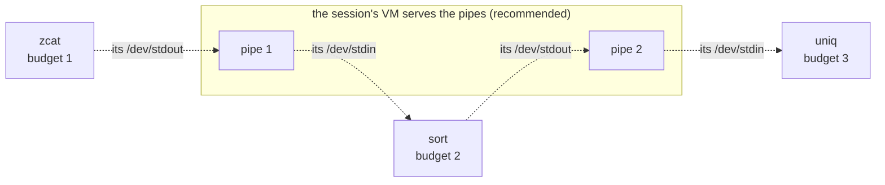

# Native programs

A native program is a statically linked Rust program that runs as a process of its own, in a
budget of its own, with exactly the handles and namespace its launcher wrote into its startup
block. The session launches one when a stage must run apart from the session's VM: untrusted
input, work that needs its own address space, or authority the session should not lend. Programs
are written against `redoubt-rt`, the native runtime; they read and write their standard streams
as files, join into pipelines through served pipe files, and end when their budget is destroyed.

## Purpose

Most work in a session is Elixir and needs no process of its own. A native program is for the
rest: a parser for a file format nobody trusts, a compressor, a compiler's back end, a tool from
outside. Redoubt has no `fork`, no `exec` and no file-descriptor table, so launching, standard
I/O, pipes and killing all work differently from Unix. This page says how, and what the runtime
gives a program.

## How to use it

From the session, a pipeline of native stages:

```elixir
pipe(~w(zcat big.gz | sort | uniq)) |> w("uniq.txt")
cat("dump.bin") |> pipe(~w(parse --json)) |> grep("warn")   # an untrusted parser as one stage
```

The explicit form gives every authority by name:

```elixir
{:ok, job} =
  Redoubt.Process.start("/boot/bin/grep", ["-n", "needle"],
    namespace: [{"/", work}, {"/dev/stdin", pipe_r}, {"/dev/stdout", pipe_w}],   # recommended names
    handles:   [keys: keyd],
    budget:    [pages: 4096, processes: 1, weight: 10])
Job.await(job).exit
Job.kill(job)
```

A program is a Rust crate on `redoubt-rt`; `src/bin/echo-client.rs` in `libs/rt` is a complete
one:

```rust
#![cfg_attr(target_os = "none", no_std, no_main)]
redoubt_rt::entry!(run);

fn run(startup: &redoubt_rt::startup::Startup) -> u32 {
    let (conn, rest) = startup.resolve("/echo").expect("no /echo in my namespace");
    // ... a 9P client on `conn`, walk `rest`, read and write ...
    redoubt_rt::exit::OK
}
```

## What it can and cannot do

### The loader stub

Status: built · tested: bench:stub-launch, fuzz:stub/plan, host:stub::plan_maps_a_well_formed_segment, host:stub::plan_refuses_two_segments_that_overlap_each_other, host:stub::plan_refuses_a_segment_reaching_into_the_stub_region, host:stub::image_in_bounds_refuses_an_image_overlapping_the_startup_page, host:stub::plan_refuses_writable_and_executable, host:stub::plan_refuses_writable_without_readable, host:stub::plan_refuses_a_non_riscv_machine, host:stub::plan_refuses_an_entry_outside_any_executable_segment, host:stub::plan_refuses_more_than_max_phnum_segments, host:stub::read_image_refuses_an_image_len_over_the_cap

By design every process after `init` is launched one way. Both halves are built: the launcher's
calls, made in the bench by a user-class parent, and the stub
([`stub/src/lib.rs`](../../stub/src/lib.rs), [`stub/src/main.rs`](../../stub/src/main.rs)):
1. The launcher creates an empty process in the target budget, naming the endpoint that will
   receive its exit notice ([processes](../kernel/processes.md#creating-and-starting)).
2. It maps the **loader stub** into the process at its fixed address: a flat binary, the same for
   everyone, which needs no parsing to map.
3. It copies the program's ELF bytes into pages and moves them into the process as data, writes
   the startup block (namespace, named handles, arguments) into a page mapped read-only, and
   starts the process at the stub with the startup page's address as its argument.
4. The stub, running inside the new process's own budget, parses the ELF from memory, maps its
   segments at their link addresses (code executable, never writable), frees the image pages,
   and jumps to the entry point.

The launcher copies bytes and never parses an ELF, so a malicious ELF can at most compromise the
process it was going to become. The stub refuses, by exiting: segments that overlap each other,
the stub, the startup page or the stack; a segment writable and executable, or writable without
readable; an entry outside every executable segment; more than 64 segments; a machine other than
RISC-V; and an image longer than the cap. In the bench a user-class parent launches a well-formed
child and a set of hostile ELFs, including 32 with fuzzed headers, through the real stub: each
hostile child only exits or faults, the budget the children run in is back to empty after each,
and a well-formed child still runs afterwards.

### Launching from a session

Status: planned · M1 (separation and containment)

A session launches a native program through beamlet's launch native
([beamlet](beamlet.md#natives)). The namespace, the handles and the budget come from the Elixir
caller, so every authority the child gets is on that one call.
- **The launcher reads the program.** There is no kernel path lookup: a session that cannot read
  a program's file cannot run it. In M1 (separation and containment) programs come from the boot
  bundle, `/boot`.
- **No signature is needed to run code within one's own authority.** A session can already run
  any Elixir it writes, so a program it launches with a subset of its own handles gains nothing.
  Signatures gate only what the steward launches with new grants ([packages](packages.md)).
- **At most `MAX_START_HANDLES` (64) handles**, namespace entries included.
- **No shared text.** Each launch copies the program image; there is no demand paging and no
  code shared between processes ([init](../servers/init.md)).
- **No dynamic linking.** Code shared at run time is a server, not a library. The dynamic part of
  the system is the BEAM, whose modules load at run time.

**Open:** none. The launch native is the client library's `launch`: the namespace, the handles
and the budget come from the Elixir caller, and Rust makes the calls and writes the startup block
([the client library](#the-client-library)).

### Standard input and output, and pipes

Status: planned · M2 (usable shell)

There is no pipe object, no file-descriptor table and no inheritance. A program's standard
streams are names in its namespace, and a pipe is a 9P file that somebody serves: a pipeline is
the shell binding names in each child's namespace before starting it. The names used here
(`/dev/stdin`, `/dev/stdout`) and the session's VM as the pipes' server are the recommended answers
to the two choices open at the end of this section. One part is decided: an interactive stage's
standard input is a pipe the session feeds from the console.


```mermaid
flowchart LR
    Z["zcat<br/>budget 1"] -.->|"its /dev/stdout"| P1["pipe 1"]
    P1 -.->|"its /dev/stdin"| SO["sort<br/>budget 2"]
    SO -.->|"its /dev/stdout"| P2["pipe 2"]
    P2 -.->|"its /dev/stdin"| U["uniq<br/>budget 3"]
    subgraph VM["the session's VM serves the pipes (recommended)"]
        P1
        P2
    end
```
*Figure: a pipeline, with the recommended names and server. Every part is planned (dashed). Each
stage runs in its own budget; each pipe is a served file, bound as one stage's standard output and
the next stage's standard input.*

What follows from pipes being served files:
- **Backpressure is free.** A write is a `call`, and the server replies when there is room.
- **End of file falls out of the exit notice.** When a stage exits, the launcher disconnects its
  connections, and the pipe's server sees its last writer go; the next stage reads end of file.
- **Labels work out.** Whoever serves a pipe is a user-level server with no label exemption,
  serving one session's stages, so a pipe between two label sets fails, as it should
  ([R1 (flow)](../kernel/ipc.md#r1-flow)).
- **No stage holds the console.** A native stage never gets the raw `/dev/cons`: an interactive
  stage's standard input is a pipe the session feeds from the console, so the shell always sees
  the interrupt key ([the shell](shell.md#interrupting-and-killing-jobs)).
- **A pipe is readable as a file.** A zero-copy alternative, stages sending pages to each other
  over an endpoint, is not 9P, so a program could not read its input as a file; it is not taken.

**Open:** two choices.
- The names of the three streams: with no descriptors to duplicate, each child needs distinct
  names. Recommended: `/dev/stdin`, `/dev/stdout` and `/dev/stderr` namespace entries.
  Alternative: `/fd/0`, `/fd/1`, `/fd/2`.
- Who serves a pipe. Recommended: the session's VM, which needs `serve` and `reply` natives and a
  9P server codec in beamlet (also needed to capture `System.cmd` output). Alternative: a small
  `piped` server per session, which keeps bulk bytes out of the session's VM at the cost of one
  more server.

### Killing a job

Status: planned · M2 (usable shell)

There is no per-process kill and no signal. Killing is destroying a budget
([R10 (destruction)](../kernel/budgets.md#r10-destruction)): every process in it ends, every handle
stamped with it dies wherever it went, and every budget carved from it goes too. So the shell
carves one budget per native stage from the session's, and `Job.kill(job)` destroys that budget
and nothing else.

A process has **one exit notice**, delivered once, on the endpoint named when it was created;
there are no death subscriptions. The notice says how it ended: `exited` with its code, `faulted`
with the fault's cause, or `killed` when its budget was destroyed
([processes](../kernel/processes.md#exit-notices)). `Job.status/1` reports those as `:exited`,
`:faulted` and `:killed`. When the notice arrives, the launcher disconnects the child's
connections and releases what typed servers granted it.

Ctrl+C destroys the budgets of every native stage of the foreground job
([the shell](shell.md#interrupting-and-killing-jobs)).

**Open:** none.

### `redoubt-rt`, the native runtime

Status: built · partly tested: the 9P client's walk limit and its checks of a reply's tag, type and counts are not attacked; only its closing of stray handles is · tested: bench:rt-build, bench:net-tcp, host:redoubt-rt::echo_pair_runs_on_the_runtime, host:redoubt-rt::a_launcher_gives_its_child_a_fresh_connection_and_disconnects_it, host:redoubt-rt::exit_codes_reach_the_parent, host:redoubt-rt::a_panic_is_reported_on_the_console_once, host:redoubt-rt::heap_over_map_anon, host:redoubt-rt::call_lend_and_reply, host:redoubt-rt::send_transfers_pages_for_good, host:redoubt-rt::timeouts_dead_endpoints_and_refusals, host:redoubt-rt::ownership_lifecycle_partial_reply_and_address_reuse, host:redoubt-rt::mapping_reborrows_and_failed_reply_recovery, host:redoubt-rt::the_9p_client_closes_handles_a_hostile_server_sends

`redoubt-rt` is everything a `no_std` Rust program or server needs between the system-call ABI
(`redoubt-sys`) and its own logic ([`libs/rt/src/lib.rs`](../../libs/rt/src/lib.rs)). It builds
for rv64 and rv32, and the network servers built on it run on the real kernel, launched through
the loader stub.

| Module | What it gives |
| --- | --- |
| `start` | the entry point (`entry!`), exit codes (`OK` 0, `PANIC` 101, `BAD_STARTUP` 102) and the panic handler |
| `startup` | the startup block, parsed defensively ([sessions](sessions.md#how-a-program-reads-its-namespace)) |
| `handle` | typed handles and the system calls that are not IPC |
| `ipc` | lends and transfers, `call`, `send`, `receive`, `reply`, `serve` |
| `heap` | the global allocator, over `map_anon` |
| `path` | lexical path cleaning, so `..` never climbs above a root |
| `client` | a small synchronous 9P client |
| `server` | the shared server library ([the serving library](../servers/serving.md)) |

- **Start and end.** `entry!(run)` receives the startup page's address from the loader stub,
  parses the block, and calls `run`; its return value is the exit code. A block that does not
  parse exits with `BAD_STARTUP`. A panic prints its message once on `/dev/cons`, if the program
  has one, and exits with `PANIC`; if the program held open calls, the kernel blames the sender
  of the call it was serving ([R21 (crash blame)](../kernel/processes.md#r21-crash-blame)).
- **The lend belongs to the call.** `call` takes ownership of the buffer it lends. When the call
  completes, the outcome hands the buffer back unless the server had received the call and it
  was then abandoned, in which case the buffer is consumed: disarmed without touching or
  unmapping its old address, since the pages stay with the server
  ([R3 (lends and abandoned calls)](../kernel/ipc.md#r3-lends-and-abandoned-calls)). So a program
  can never hold a safe object claiming memory it no longer has, or unmap an address that has
  since been reused.
- **A partial reply is not lost.** The outcome carries the status, the buffer when returned, and
  the reply when the kernel committed one, independently. A reply that arrived with some handles
  missing (`OutOfMemory`) still owns the handles that were delivered; dropping an unclaimed reply
  closes them, so an error never leaks a handle slot
  ([R13 (one outcome per call)](../kernel/ipc.md#r13-one-outcome-per-call)). Any facade above the
  runtime has to keep this accounting.
- **The 9P client does not trust the server.** One request at a time in one lent buffer; a walk
  of at most 16 components after cleaning, refused rather than split; a reply must decode, carry
  the request's tag and be the matching reply, and every count is checked against what was asked.
  A 9P reply carries no handles, so any that arrive are closed. For launchers it also has
  `new_connection` and `disconnect`.
- **Tested on the host against a fake kernel.** Every system call goes through one function; on
  the machine it is the `ecall`, on the host a `HostKernel` a test installs, so the runtime and
  programs built on it (the echo client and server) run in host tests.
- **No safe call pulls memory from under its owner.** The runtime's calls that could invalidate
  memory a safe owner holds are its owners' alone: `unmap` is private to the heap and `Buffer`,
  `set_flags` is not offered at all, and `Process::map` moves pages only by taking the `Buffer`
  that owns them, so the raw address it once took is no longer a way round. `map_anon` only makes
  memory, and hands back an address that takes `unsafe` to use. A public `unmap` does not compile
  (a `compile_fail` test in `handle.rs`). A `dma_alloc` run is held by a `Dma`, which unmaps
  it on drop and not before; the frames stay the kernel's until the process ends.
- **No raw call from safe code.** `redoubt_rt::abi` is the kernel's types and limits without
  `redoubt-sys`'s `syscall`, so a program built on the runtime makes every call through it. The
  no-cruft case refuses a wholesale re-export and a single-line re-export or `pub` item naming
  `syscall`; a multi-line re-export list, and a `pub fn` that wraps the call, are review's. The
  loader stub and the bench's test programs call `redoubt-sys` directly and are not built on the
  runtime.
- **A thread's stack is its own.** `thread_create` takes an `extern "C" fn(usize) -> !` and a
  `Buffer`, and keeps the `Buffer`'s pages mapped for good, even after the thread exits, so no
  owner holds a thread's stack and no entry is an arbitrary address. A raw form does not compile
  (a `compile_fail` test in `handle.rs`).

### Libraries for native programs

Status: planned · M2 (usable shell)

Native programs are `no_std` with `alloc`, so most of Rust's command-line crates, built on `std`'s
files, processes and threads, do not build for them. These do: each builds for
`riscv64imac-unknown-none-elf` with the features named, and none has C in its tree. Applications
have more latitude than servers ([the tenets](../TENETS.md#5-dependencies-are-part-of-the-trusted-computing-base)),
but each is vendored under `vendor/` when a program first uses it, with its provenance recorded as
the others' is ([vendored dependencies](../testbench.md#vendored-dependencies)).

| Purpose | Crates |
| --- | --- |
| Screens | `ratatui-core`, `ratatui-widgets` (default features off), `unicode-width`, `unicode-segmentation`, `vte` (escape-sequence parsing) |
| Text | `crop` (a rope), `regex`, `memchr`, `aho-corasick` |
| Compression | `miniz_oxide` (deflate, as beamlet uses), `ruzstd` (zstd), `lzma-rust2` (xz), `lz4_flex` |
| Archives | `tar-no-std` (reading; writing is ours) |
| Data | `serde_json` (`alloc`), `jaq-core`, `jaq-std`, `jaq-json` (a jq in pure Rust) |
| Hashing | `sha2`, `blake3` (feature `pure`, which skips its assembly) |
| Time | `jiff` |

Three more need a small patch before they build, each only a missing `no_std` attribute or one
`std` path: `imara-diff` (diff), `wildmatch` (glob patterns) and `nucleo-matcher` (fuzzy
matching). Argument parsing (after `lexopt`, over the startup block's arguments) and a zip reader
over `miniz_oxide` are ours to write.

Every one is also to build for rv32, where the vendored crates are checked too, after rv64.

**Open:** which of these build for rv32 as they stand; none has been tried there.

### The client library

Status: planned · M1 (separation and containment)

`redoubt-client` (`libs/client`) is the one client API every userland binds to: native programs
link it, beamlet's Redoubt platform and natives are thin adapters over it
([beamlet](beamlet.md#beamlet-on-redoubt)), and `init` launches and asks its servers through it.
It is `no_std` with `alloc`, has no `unsafe`, and sits on the runtime and the wire codecs, adding
what is more than one typed call. Its calls block, one per thread; beamlet makes them from its
pool of I/O threads ([asynchronous underneath](beamlet.md#asynchronous-underneath-synchronous-on-top)).

| Module | What it gives |
| --- | --- |
| `ns` | the namespace, built from the startup block: the longest matching prefix, `bind`, the listing |
| `file` | files over 9P on a connection: walk, open, create, read, write, stat, read a directory, remove; one fid per open file |
| `fsd` | the file server's typed operations that name open files' fids: `rename`, `copy_file`, `set_attr`, `get_attr` ([fsd](../servers/fsd.md#typed-operations)) |
| `console` | `/dev/cons`: read, write, `size`, and the parked `resize` ([consoled](../servers/consoled.md#the-consol-protocol)) |
| `launch` | the process builder: the image bytes the caller read, a budget the caller carved, the endpoint for the exit notice, namespace entries, named handles and arguments, written by the runtime's `StartupBuilder`; it returns a job, whose exit notice the caller waits for and whose budget ends it |
| `grants` | the launcher's ledger of what servers granted a child, released and disconnected when the child's exit notice arrives ([wire](../servers/wire.md#a-launcher-releases-its-childs-grants)) |
| `typed` | one call for any typed protocol, over the module the generator wrote from its table ([wire](../servers/wire.md#wire-tables-and-the-generator)) |

Time and randomness are the runtime's kernel calls, and raw `call`, `send` and `serve` are the
runtime's `ipc`, which beamlet's natives use directly. `/net` is files, so `file` covers it. There
is no module per typed server beyond `fsd`, whose operations name fids that live in Rust: for
every other server `typed` with the generated module is the binding, and beamlet binds the same
tables through their generated Elixir codecs.

- **A namespace owns its connections.** A `bind` puts the same connection under another prefix:
  one connection, one badge, as a copied handle is in beamlet. An open file keeps its connection
  for as long as it is open.
- **Nothing is buffered, cached or retried.** One read or write is one 9P request of at most the
  connection's `iounit`, and its error is its own, never deferred. Every open walks from the
  connection's root, so a rename, a removal or a revoked connection shows on the next open. A
  connection whose server has gone is `Disconnected` on every call; the library never reconnects,
  since a new connection is its launcher's to grant ([init](../servers/init.md#restarts-and-reboots)).
- **A connection is shared by threads.** Its fids come from one allocator, and each request lends
  its own buffer, so several threads use one connection at once.
- **Policy is the servers'.** The library holds none and makes no check a server does not make:
  the label check is the server's ([R25 (the label check)](../servers/serving.md#r25-the-label-check)).
- **One error type** tells apart the kernel's error, a reply that does not decode, the server's
  protocol error (a typed error code or a 9P `Rerror`) and `Disconnected`. No error path drops a
  handle: the runtime's accounting of a call's outcome is kept whole
  ([R13 (one outcome per call)](../kernel/ipc.md#r13-one-outcome-per-call)).
- **No second copy** of the ABI, the startup encoder or a wire format: `launch` calls
  `StartupBuilder`, and `typed` calls the generated codecs.
- **Tested on the host** against the real servers: the runtime's fake kernel is a crate of its own
  for tests, and `bootfsd`, `consoled` and `keyd` run on it, so each userland's bindings, beamlet's
  platform included, are tested long before `init` boots them.
- **One scripting language.** Elixir on beamlet is the box's scripting language; no embedded
  script language is taken as a further userland, and the library binds any language that might
  be ([other runtimes](../beyond/runtimes.md)).

The attack cases: no call succeeds where the underlying call is refused (a label, a quota, a walk
above a connection's root, a launch with `MAX_START_HANDLES` + 1 handles refused before any kernel
call); an error path never leaks a handle (a partial reply, a server that dies mid-call, a hostile
reply carrying handles); a child's grants are released at every server when its exit notice
arrives.

**Open:** none.

### The Rust `std` target

Status: planned · M4 (self-hosted development)

For Redoubt to be developed on Redoubt, native programs need more of the client library: modules
for servers whose use is more than one typed call (the steward's sessions and leases, `ipd`'s
scopes), grown into it from what their callers need, and perhaps a Rust `std` target so ordinary
crates build for the box. Programs are
built off the box ([development](development.md)).

**Open:** whether `std` gets a backend (`std::fs` over the client library's files) or is rejected
in favour of explicit capability calls; the runtime's ownership and error contract and the client
library are the base either way.

## Why

**Launch copies, the child parses.** If the launcher parsed ELF files, a malformed program could
take over the launcher, which in a session is the session and at boot is `init`. With the parser
in a stub inside the child, running in the child's own budget, the worst a hostile ELF can do is
wreck the process it was about to become. seL4 and Fuchsia launch the same way.

**Standard streams as names, pipes as files.** Unix hands a child its parent's descriptors, and
the child inherits whatever the parent forgot to close. Here a child has exactly the names its
launcher bound: a standard stream is a file like any other, and a pipe is a server's file whose
backpressure and end-of-file come from 9P and the exit notice with no new kernel object.

**Killing by budget.** A per-process kill would be a new authority (who may kill whom?) and would
leave a killed process's children and handles to clean up. Destroying a budget is the one
revocation the kernel has: it takes the process, its children and every handle stamped with it,
and the launcher holds the budget, so the authority to kill is simply having launched.

**One runtime, tested on the host.** Every native program and server links the same runtime, so
its ownership rules are written and tested once. The fake kernel makes those tests fast and lets
them build situations (an abandoned call, a partial reply, a reused address) that are hard to
arrange on the machine.
