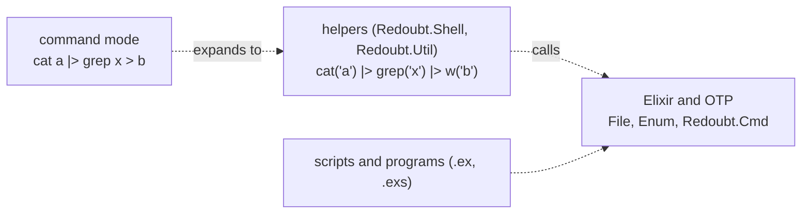
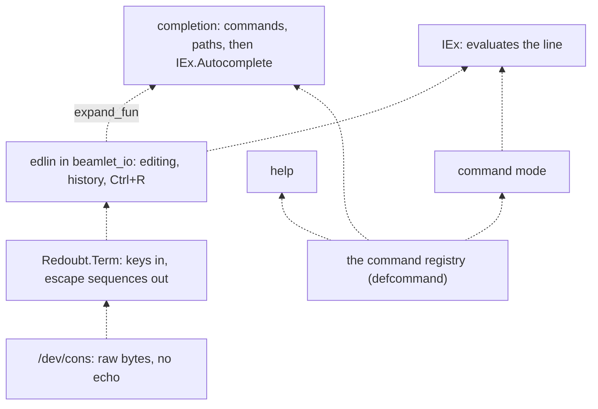

# The shell

The shell is IEx, Elixir's interactive prompt, running in the session's beamlet VM. There is no
POSIX shell and no second language: a line at the prompt is Elixir, with short helpers for the
everyday work (`cat`, `ls`, `cp`, `grep`), a command mode that lets bare words stand in for
quoted arguments, and native programs joined by pipes when a stage must run in a budget of its
own. Line editing, history, completion, help, a pager and an editor are Elixir too, drawn on the
person's own terminal through `/dev/cons`.

## Purpose

A person who logs in has to be able to work: look at files, change them, run programs, stop what
runs away, and find out how. On a box with no Unix, IEx is the natural shell (the Nerves project
uses it the same way on devices), and Elixir is a better scripting language than any shell
language. What IEx lacks is the short surface a shell gives, launching and piping programs, job
control, and line editing on a console nobody echoes for. This page describes that surface.

## How to use it

The same work, three ways. In a script, full Elixir:

```elixir
File.read!("app.log") |> String.split("\n") |> Enum.filter(&String.contains?(&1, "error"))
```

At the prompt, the helpers (imported in every session):

```elixir
iex(1)> cat("app.log") |> grep("error") |> count()
42
iex(2)> cat("config.txt") |> sub("staging", "prod") |> w("config.txt")
:ok
iex(3)> ls_r("/home/alice/logs") |> Enum.filter(&(stat(&1).size > 1_000_000))
["/home/alice/logs/big.log"]
```

In command mode, bare words are quoted for you; `|>` joins Elixir stages, `|` joins native
stages, `>` writes a file and `>>` appends to one:

```text
iex(4)> cat app.log |> grep error |> count
42
iex(5)> zcat big.gz | sort | uniq > uniq.txt
:ok
iex(6)> help cp
```

Stop a runaway job with Ctrl+C. See what the session is using with `top()`. Edit a file with
`ed("notes.txt")`.

## What it can and cannot do

### IEx in a session

Status: planned · M1 (separation and containment)

Every session starts with IEx's read-eval-print loop over the session's console connection,
`/dev/cons` ([consoled](../servers/consoled.md) on the UART, [sshd](../servers/sshd.md) for an SSH
channel). In M1 (separation and containment) the shell is what the attack suite needs and no
more: the console, reading and writing files through OTP's `File`, and launching a native program
through the launch natives ([beamlet](beamlet.md#natives)). What IEx does on beamlet is
[beamlet](beamlet.md#what-runs-on-it)'s.

Everything the prompt evaluates runs with the session's authority, in the session's VM. There is
nothing the shell can do that the session's handles do not allow, and nothing a helper adds to
them.

**Open:** none.

### Three syntax layers

Status: planned · M2 (usable shell)


*Figure: the three syntax layers. Every part is planned (dashed). Command mode and the helpers
exist only at the prompt; scripts use Elixir directly.*

| Context | Syntax | Use |
| --- | --- | --- |
| Programmatic (`.ex`, scripts) | full Elixir: explicit paths and handles | code that outlives a session |
| IEx helpers | short names over a default context (namespace, budget, console) | interactive work |
| Command mode | bare words quoted; `\|>` an Elixir stage, `\|` a native one | quick one-liners |

The last two exist only inside an IEx session. They are sugar over Elixir, not a different
language.

**Open:** none.

### Helpers and file operations

Status: planned · M2 (usable shell)

`Redoubt.Shell` holds the session's context (its namespace, its budget and its console) and the
helpers over it. Relative paths resolve against the session's current prefix, and work is charged
to the session's budget.

| Helper | What it does |
| --- | --- |
| `cat(path \| [path])` | the file's lines, lazily; printed through the pager when it is the value at the prompt |
| `cp(src, dst)`, `mv(src, dst)` | copy and rename; within one volume the server does it, across volumes it is a copy loop and `mv` is not atomic |
| `rm(path)`, `rm_rf(path)` | remove; removing an open file succeeds |
| `mkdir(path)`, `mkdir_p(path)`, `touch(path)` | make directories and files |
| `ls(path)`, `ls_r(path)`, `find(path, ~r//)`, `stat(path)` | list, walk, find by name, stat (name, length, mtime, qid; no mode or owner) |
| `cd(prefix)`, `pwd()` | the session's current prefix; there is no kernel working directory |
| `ns()`, `bind(prefix, conn)` | show the namespace; bind a held connection at a prefix |
| `whoami()`, `labels()` | the principal and the session's label set |
| `clear()` | clear the screen |

What each file operation does underneath, and why rename across volumes cannot be atomic, is
[files and binds](files.md)'s.

**Open:** none.

### Viewing and searching

Status: planned · M2 (usable shell)

`Redoubt.Util` is the text toolkit, imported in every session and script. Files come in through
`cat` and go out through `w`; everything between takes lines and chains with `|>`.
- `cat` returns `%Lines{}`: enumerable and lazy, read in 9P-sized blocks as it is consumed, and
  closed when a consumer stops early, so `cat("big.log") |> head(5)` reads one block. It checks
  the file exists when called, so a missing file fails on its own line.
- `grep`, `grep_v`, `sub` (a pattern is a string or a `~r//`), `cut`, `sort`, `uniq`, `uniq_c`,
  `head`, `tail` and `count` return lines or a number.
- `w(src, path)` writes through a temporary file and a rename, so `cat(f) |> sub(...) |> w(f)` is
  safe; `append` adds to a file; `out` prints without the pager.
- `follow(path)` is `tail -f`; `glob(pattern)` expands a pattern in the session's namespace;
  `checksum`, `hexdump`, `now`, `today` and `ago` cover the rest of the usual scripts.
- The **pager** shows a long value a screen at a time (space, `b`, `/search`, `q`).

**Open:** none.

### Command mode

Status: planned · M2 (usable shell)

Command mode is a preprocessor ahead of the Elixir parser. Bare words are quoted, `|>` is an
Elixir stage, `|` a native stage, `>` is `w` and `>>` is `append`:

| Typed | Runs |
| --- | --- |
| `cat a` | `cat("a")` |
| `grep x f` | `cat("f") \|> grep("x")` |
| `cat a \|> sub x y > a` | `cat("a") \|> sub("x", "y") \|> w("a")` |
| `zcat a.gz \| sort > b` | `pipe(~w(zcat a.gz \| sort)) \|> w("b")` |
| `cat a \| parse --json \|> grep w` | `cat("a") \|> pipe(~w(parse --json)) \|> grep("w")` |
| `ls` / `top` / `cd d` / `ed f` | `ls(".")` / `top()` / `cd("d")` / `ed("f")` |

A command-mode `cat` is always the Elixir one; no native `cat` is launched. Every command is
declared once, with `defcommand`, naming its argument types, a summary, a page of help and
examples; that one declaration drives the expansion, completion and help.

**Which lines are commands.** The mode is decided by the line's first two tokens alone, never by
trying Elixir first: almost every command line is also valid Elixir (`cat a` parses as `cat(a)`),
and a rule that fell back on failure would make a line's meaning depend on what the session has
bound. A line is in command mode when its first token is a registered command and it is followed
by the end of the line, or by whitespace and a token that is not an Elixir operator (`|>`, `|`,
`>` and `>>` are command-mode stage operators here, not Elixir ones). Every other line is Elixir:
`cat("a") |> grep("x")`, `count = 5`, `ls == x`, and any line whose first word is not a command.
Parentheses right after a command's name are how to write Elixir that starts with it.

What command mode cannot do:
- **Run code hidden in an argument.** Bare words become literal strings with no interpolation, as
  `~S` does: `cat #{File.rm("x")}` reads a file of that name and runs nothing.
- **Be redirected by a binding.** Command mode calls the registry's functions by their full module
  name, so a local variable or an import named `cp` cannot change what `cp` runs.

**Running a script.** `run tool.exs a b` runs the script in the session's VM with the session's
full authority, with `System.argv/0` set: exactly as if it were typed, so it is for scripts one
would type. `run --isolated tool.exs` starts a child VM through the same launch path as an agent's
lease ([agents](agents.md#the-agent-harness)), with capabilities the same as or narrower than the
session's. With no grants, the child gets a budget of its own carved from the session's (bounded
CPU and memory, ended by destroying it), a read-only view of the current directory and no network.
More is granted with flags that map one to one onto the agent harness's grant kinds
([agents](agents.md#the-agent-harness)): `--read P`, `--write P`, `--gateway N`,
`--git REMOTE[:fetch|:push=PATTERN]` and `--launch pages=..,processes=..,weight=..`.

**Open:** none.

### Native programs and pipes

Status: planned · M2 (usable shell)

A native stage is a program in a budget of its own, joined to the next by a served pipe file.
`pipe(~w(grep error log.txt | wc -l))` is the short form, and its value is the lines of the last
stage's standard output; `Redoubt.Cmd` is the explicit form:

```elixir
{:ok, [job]} = Cmd.new() |> Cmd.source("log.txt") |> Cmd.pipe({"grep", ["error"]}) |> Cmd.run()
Job.await(job).stdout
```

A native stage is for what should not run with the session's authority (an untrusted parser) or
needs its own address space; everything else is Elixir. How programs are launched, how their
standard streams are named and who serves a pipe are [native programs](native.md)'s.

**Open:** none here; the stream names and who serves a pipe are open on
[native programs](native.md).

### Interrupting and killing jobs

Status: planned · M2 (usable shell)

There are no signals and no per-process kill. A job is killed by destroying its budget
([R10 (destruction)](../kernel/budgets.md#r10-destruction)): the shell carves one budget per native
stage from the session's, so `Job.kill(job)` ends that stage, everything it started, and nothing
else. `Job.status(job)` is `:running`, `:exited`, `:faulted` or `:killed`, read from the exit
notice ([processes](../kernel/processes.md#exit-notices)). A job's budget is carved from the
session's, so ending it can never touch the session.

The interrupt key:
- **Ctrl+C with a job in the foreground** destroys the budget of every native stage of that job.
  Elixir work is ended by killing the evaluating Erlang process with an untrappable exit (`:kill`),
  and IEx starts a fresh evaluator. The session and its VM survive; its bindings are whatever IEx
  keeps, and the page states which once a case interrupts `x = 1; loop()` and checks `x`.
- **Ctrl+C at an idle prompt** clears the line. The BEAM's break menu is never reachable, and a
  session ends only by `exit` or Ctrl+D.
- **Ctrl+G** is `edlin`'s job-control menu.
- **Over SSH**, `sshd` turns the channel's `signal` request (INT) and `break` request into the same
  interrupt a 0x03 byte gives. It is a protocol message, not a Unix signal; nothing inside Redoubt
  has signals ([sshd](../servers/sshd.md)).

What a job cannot do:
- **Swallow the interrupt.** The session's I/O server reads `/dev/cons` all the time, not only
  while a line is requested, and a native stage never gets the raw console: its standard input is
  a pipe the session feeds. So no foreground program can hide Ctrl+C from the shell.
- **Take the session's memory.** The evaluator runs with Erlang's `max_heap_size` flag (killing),
  set to a fixed share of the session's budget, so a runaway allocation kills the evaluator, as
  Ctrl+C would, instead of taking the whole VM to its budget's page limit.

Processes an expression spawned without a link are not killed by Ctrl+C; background work belongs
in a `Job`.

**Open:** none.

### The terminal library

Status: planned · M2 (usable shell)

Nothing between the keyboard and IEx edits a line: `consoled` and `sshd` serve `/dev/cons` as a
raw byte stream with no echo. So the shell owns the terminal, through one pure-Elixir library,
`Redoubt.Term`, that every screen program uses (the line editor, the pager, `top`, the editor).
- **Output:** cursor movement, erasing, scroll regions, the alternate screen, colour and
  attributes, bracketed paste, and synchronized update so a redraw does not flicker.
- **Input:** a key decoder for VT100, xterm and Linux sequences, including modifier forms
  (`ESC [1;5C` is Ctrl+Right), UTF-8, and bracketed paste as one event, so a paste can never
  trigger completion.
- **Width:** grapheme and East Asian width, so cursor arithmetic holds for CJK and emoji.
- **One target:** VT102 plus the common xterm extensions every current emulator speaks, with no
  terminfo.
- **Size:** `Console.size/0` asks `/dev/cons` afresh on every call and returns `{cols, rows}` or
  `{:error, :unknown}`; layout then assumes 80 columns.
- **Resize:** there is no callback. `Console.await_resize(pid)` makes a `resize` call the console
  server parks and answers when the window changes; the new size arrives at `pid` as the message
  `{:console_resize, cols, rows}`, and the library calls again for the next change. On a UART,
  where nothing resizes, the call waits for ever ([consoled](../servers/consoled.md)).

**Open:** `await_resize` needs a server to park a typed call, an open question of
[the serving library](../servers/serving.md); and whether the shell sends a terminal
query at login and adapts, or assumes the VT102 and xterm target (the recommendation: assume,
because a query on a UART that never answers costs a timeout at every login).

### Line editing and history

Status: planned · M2 (usable shell)


*Figure: the shell's layers, bottom up. Every part is planned (dashed). One registry feeds
command mode, completion and help.*

On the BEAM, line editing is OTP's `edlin`, plain Erlang; only the tty driver under it needs the
operating system. So `beamlet_io`, beamlet's I/O server, gains `edlin` and a small tty backend
that draws through `Redoubt.Term`, and honours IEx's completion hook (`expand_fun`). That gives
Emacs keys, a kill ring, multi-line input, history with Ctrl+R search, and IEx's own completion
of modules, functions, variables and map keys, unchanged.
- **History** persists per principal in the principal's home volume, capped in lines. A vault
  session keeps its history in memory only: its label forbids writing to the unlabelled home
  volume, so there is nowhere to save it.
- **Echo is the editor's job**, so a password prompt is a call that reads with echo off
  (`Redoubt.Term.read_secret/1`), not a terminal mode.

**Open:** `edlin` inside `beamlet_io` or a fresh editor in Elixir (the recommendation: `edlin`,
which IEx is tested against and which keeps IEx's completion).

### Completion

Status: planned · M2 (usable shell)

`Redoubt.Shell` installs a completer that looks at the line before deferring:

| Line so far | Completes from |
| --- | --- |
| `c⇥` (command mode, first word) | the command registry |
| `cp no⇥` (command mode, an argument) | the type that argument is declared with: a path, package, principal, budget or label |
| anything else | `IEx.Autocomplete` |

- **Paths** resolve through the session's namespace and read the directory over 9P, one read per
  Tab. The file server lists only entries the caller's labels may read, so completion cannot
  reveal a name the session could not `ls`.
- The first Tab inserts the longest common prefix; the second lists the candidates in columns,
  through the pager when they exceed a screen. Directories complete with a trailing `/`.
- A completer never launches a process and never writes. A slow server bounds it with a short
  timeout, after which Tab does nothing.

**Open:** none.

### Help

Status: planned · M2 (usable shell)

```text
help              # commands grouped by area, one line each
help cp           # the command's page in the pager: usage, doc, examples
help namespaces   # a concept: namespaces, budgets, labels, pipes, sessions
h File.cp/2       # IEx's own module documentation
```

Every command's help comes from its `defcommand`, and a build fails for any command without a
summary, a page or an example. Concept topics are short, shell-oriented summaries of these pages,
bundled as Markdown and drawn with bold and indentation.

**Open:** whether the documentation chunks `h/1` needs ship in the boot bundle's `.beam` files
(the recommendation: strip them from the bundle and ship them as an optional documentation
package that `h/1` reads when present).

### Resource use

Status: planned · M2 (usable shell)

`top()` shows the session's budgets, their weights and usage, and their processes; `ps()`,
`df()`, `free()` and `uptime()` show a part of that. They read the budgets the session holds
(`budget_usage`: [budgets](../kernel/budgets.md#budget_usage)), so they show only what is the
caller's own: its (account, label set). Another principal's processes, and a vault session's
from an ordinary one, are not listed, because a count of someone else's work is a channel. PIDs
are drawn at random for the same reason ([processes](../kernel/processes.md#processes-and-pids)).

**Open:** none.

### The editor

Status: planned · M2 (usable shell)

`Redoubt.Ed` is a text editor in Elixir, running inside the session's VM and drawing through
`Redoubt.Term` on `/dev/cons`: `ed("config.txt")` opens a file, with `hjkl` movement, `i` to
insert, `:w` to save and `:q` to quit. Because it is Elixir, it can be scripted:

```elixir
Ed.open("log.txt"); Ed.goto(42); Ed.replace("foo", "bar"); Ed.save(); Ed.quit()
```

It needs no process of its own and no authority beyond the file it opens.

**Open:** none.

## Why

**IEx is the shell.** No shell in the Elixir world replaces bash, and none needs to: IEx already
edits, evaluates and completes, and on Nerves devices it is the only shell there is. Elixir
pipelines read like shell pipelines and have none of the quoting, word-splitting or injection
problems. The surface of a shell (`cat`, `ls`, `grep`, `top`) is borrowed from Toolshed, which
was written for this situation, and reimplemented over Redoubt's namespace instead of Linux
`/proc`.

**One layer.** An operation that does not need its own address space is an Elixir function, not
a program: there is no `cp` or `ls` binary to launch, to sign or to audit. A native program is
for what must run apart from the session: untrusted input, or authority the session should not
lend.

**The terminal is Elixir, and the C reference stays a reference.** `libvterm`, a C terminal
library, is read for its state machine and key tables and is never built or linked: Redoubt has no
C in its build. Terminal code is a parser of untrusted bytes (anything that reaches `/dev/cons`
can be typed or pasted), which is one more reason to keep it in a memory-safe language.

**No resize callback.** IPC is caller-initiated, so a server tells a client something by
answering a call the client made and the server parked. A callback would need the console server
to hold an endpoint into the session, which is authority it should not have; a parked call needs
none.
