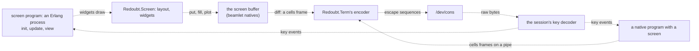
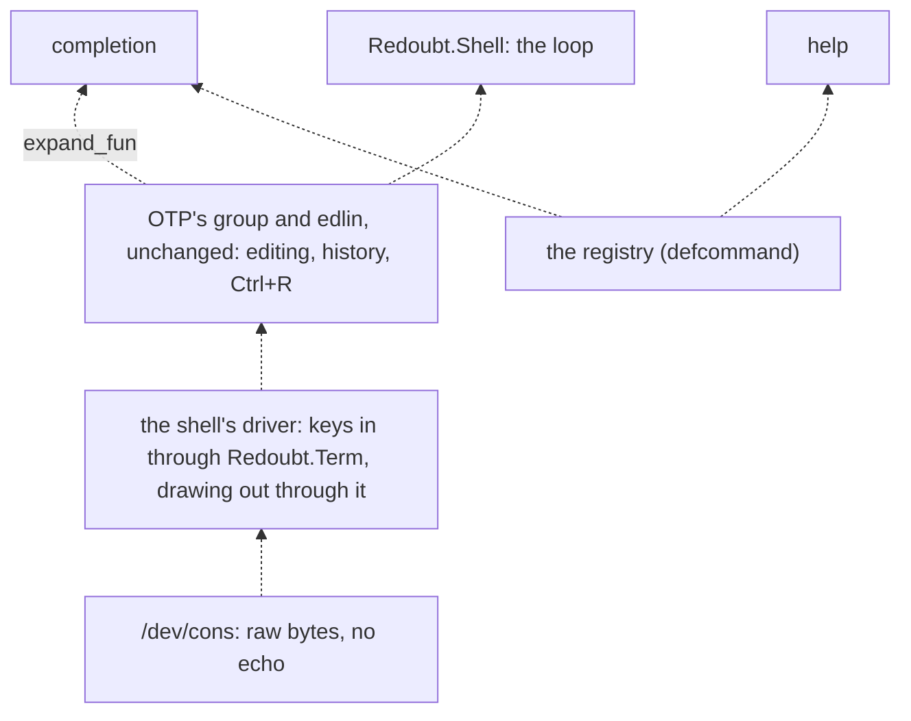

# The shell

The shell is `Redoubt.Shell`, a read-eval-print loop of Redoubt's own over Elixir, in the
session's beamlet VM. A line at the prompt is Elixir and nothing else. The everyday work is done
by commands (`cat`, `ls`, `cp`, `grep`), which are Elixir functions, each declared once with its
types and its help and imported at the prompt. Native programs, joined by pipes, run in budgets of
their own when a stage must. Line editing, history, completion, help, the pager and full-screen
programs, the editor and file manager among them, are Elixir in the session, drawing into a screen
buffer beamlet holds natively. Everything the session draws reaches `/dev/cons` through one
encoder, the only writer of control sequences, so hostile text can never drive the person's
terminal ([hostile text](#hostile-text-never-drives-the-terminal)).

## Purpose

A person who logs in has to be able to work: look at files, change them, run programs, stop what
runs away, and find out how. On a box with no Unix, Elixir is the natural shell language (the
Nerves project uses IEx the same way on devices), and a better scripting language than any shell
language. What a bare Elixir prompt lacks is the short surface a shell gives, launching and piping
programs, job control, screens, and line editing on a console nobody echoes for. This page
describes that surface.

The scope is three things done well: the command line, an editor with a file manager, and the
agent ([agents](agents.md#the-agent-loop)). Everything else keeps to plain lines on the terminal,
and the terminal is the only front end there is.

## How to use it

The prompt shows the current directory and the line's number. The same work in a script and at
the prompt is the same Elixir; the commands are imported at the prompt and are plain functions
anywhere else (`Redoubt.Util.cat/1`):

```elixir
/home/alice (1)> cat("app.log") |> grep("error") |> count()
42
/home/alice (2)> cat("config.txt") |> sub("staging", "prod") |> w("config.txt")
:ok
/home/alice (3)> cp "notes.txt", "notes.bak"
:ok
/home/alice (4)> ls_r("logs") |> Enum.filter(&(stat(&1).size > 1_000_000))
["logs/big.log"]
/home/alice (5)> pipe(~w(zcat big.gz | sort | uniq)) |> w("uniq.txt")
:ok
/home/alice (6)> help(:cp)
```

A call needs no parentheses when it is the whole line (`cp "a", "b"`); inside a pipeline it does,
as Elixir says. Stop a runaway job with Ctrl+C. See what the session is using with `top()`. Edit a
file with `ed("notes.txt")`; browse and copy files in two panes with `fm("project")`.

## What it can and cannot do

### The shell in a session

Status: planned · M1 (separation and containment)

Every session starts `Redoubt.Shell` over the session's console connection, `/dev/cons`
([consoled](../servers/consoled.md) on the UART, [sshd](../servers/sshd.md) for an SSH channel).
In M1 (separation and containment) the shell is what the attack suite needs and no more: the
console, reading and writing files through OTP's `File`, and launching a native program through
the launch natives ([beamlet](beamlet.md#natives)). The shell's modules come from the boot bundle
like the rest of the system's ([beamlet](beamlet.md#the-platform-boundary)).

Everything the prompt evaluates runs with the session's authority, in the session's VM. There is
nothing the shell can do that the session's handles do not allow, and nothing a command adds to
them.

**Open:** whether the documentation chunks `h/1` reads ship in the boot bundle's `.beam` files
(the recommendation: strip them from the bundle and ship them as an optional documentation
package that `h/1` reads when present).

### The loop

Status: built · partly tested: runs on the host only, on beamlet and on the BEAM; its tests are the shell's own ExUnit suite, which `./test-shell` runs and no bench case does

`Redoubt.Shell` is its own loop, not IEx's ([`userland/shell`](../../userland/shell)):

1. **Read** a line from the group leader with `IO.gets/1`; a line that ends too soon to parse (an
   open `do`, a trailing `|>`) reads another.
2. **Parse** it with `Code.string_to_quoted/2`.
3. **Evaluate** it in a fresh Erlang process, with a killing heap limit, through
   `Code.eval_quoted_with_env/4`. The shell holds the bindings and the environment between
   lines, so an evaluation that dies loses only its own line. The compiler's diagnostics are
   taken with `Code.with_diagnostics/2` and printed by the shell, not written by the compiler.
4. **Print** the value through `Redoubt.Term.Text`, which draws every control character in it
   visibly (`^[`, `^G`, `<U+009B>`, `<U+202E>`); a `%Lines{}` is printed a line at a time.

A line that is not UTF-8, or that the tokenizer cannot read, is that line's error, and the next
is read; the tokenizer's warnings, like the compiler's, are printed through the same guard.

It is built on Elixir's public API only, and uses none of IEx's modules.

What the loop does not have:
- **A file run at start.** IEx runs `.iex.exs` from the current directory when it starts, with the
  session's authority, so a file planted in a shared directory would run in the session of anyone
  who started there. The shell reads and runs nothing at start but itself.
- **A second syntax.** A bare command name is an undefined variable, as Elixir says; the shell
  adds that it is a command to call as `pwd()`. `exit` alone on a line is the one word the loop
  reads itself, and ends the shell as `exit()` does.
- **Pry, remote shells, or a break menu.**

Not guarded yet, until the shell's driver holds the console
([line editing](#line-editing-and-history)): code a line runs that writes to the console itself,
as `IO.puts/1` does, and the crash reports of processes a line spawned, which OTP's logger
writes.

### Commands

Status: built · partly tested: runs on the host only; its tests are the shell's own ExUnit suite, which `./test-shell` runs and no bench case does

Every command is a **commandlet**: an Elixir function declared once, with `defcommand`, in any
module of the shell that uses `Redoubt.Commandlet`:

```elixir
defmodule Redoubt.Shell.Helpers do
  use Redoubt.Commandlet, area: "Files"

  @summary "Copy a file"
  @help """
  Copies src to dst. Into an existing directory, the copy keeps its name.
  """
  @args src: "the file to copy", dst: "where the copy goes"
  @examples [{~S'cp("a.txt", "b.txt")', "copy a.txt to b.txt"}]
  defcommand cp(src :: path, dst :: path) do
    File.cp!(src, dst)
  end
end
```

- **Typed.** A parameter is `name :: type`, with an optional default: `path`, `string`,
  `integer` (with bounds), `pattern` (a string or a `~r//`), `lines`, `boolean`, `one_of`,
  `flags(...)` for keyword options, `ref` (a function or module), `name`, a command's name, and
  `many(t)`.
  The arguments are checked, and coerced where a type says so, before the body runs; a wrong one
  raises a usage error naming the parameter and showing the usage.
- **The help is not optional.** A command without a summary, a page, a line for each parameter,
  or an example that calls it does not compile. The same declaration becomes the function's
  `@doc`, its page in `help`, and what completion offers for each argument.
- **Nothing else to wire.** The registry finds every module of the shell's application that
  declares commands; they are imported at the prompt and listed by `help`, grouped by area.

A command's arguments are Elixir values the person wrote, evaluated as Elixir evaluates them
anywhere. There are no bare words for the shell to quote, so there is no quoting to get wrong and
no second meaning a line can have.

### Files and text

Status: built · partly tested: runs on the host only, over files beamlet's host platform serves; its tests are the shell's own ExUnit suite, which runs every command against a seeded tree of real files and no bench case runs

Files come in through `cat` and go out through `w`; everything between takes lines and chains with
`|>`. Relative paths resolve against the session's current directory.

| Command | What it does |
| --- | --- |
| `pwd()`, `cd(dir)` | the current directory; there is no kernel working directory |
| `ls(path)`, `ls_r(path)`, `find(path, pattern)`, `glob(pattern)`, `stat(path)` | list, walk, find by name, expand a pattern, stat |
| `cp(src, dst)`, `mv(src, dst)` | copy and rename; within one volume the server renames, across volumes it is a copy and `mv` is not atomic ([files](files.md)) |
| `rm(path)`, `rm_rf(path)`, `mkdir(path)`, `mkdir_p(path)`, `touch(path)` | remove, make directories and files |
| `cat(paths)` | the files' lines, read as they are consumed |
| `grep`, `grep_v`, `sub`, `cut`, `sort`, `uniq`, `uniq_c`, `head`, `tail`, `count` | lines in, lines or a number out |
| `w(lines, path)`, `append(lines, path)` | write or add lines to a file |
| `table(rows)` | rows laid out in columns, with a header and a titled border if asked |
| `hexdump(path)`, `checksum(path)` | a file's bytes, and its hash |

- `cat` returns `%Lines{}`: enumerable and lazy, so `cat("big.log") |> head(5)` reads only the
  start of the file, and a consumer that stops early closes it. It checks every file when called,
  so a missing one fails on its own line.
- `w` writes a new file beside the old one and renames it into place, so a failure leaves the old
  file whole and `cat(f) |> sub(...) |> w(f)` is safe.
- A file's contents and names are shown with every control character made visible, by
  `Redoubt.Term.Text`; bytes are looked at with `hexdump`.

What each file operation does underneath, and why a rename across volumes cannot be atomic, is
[files and binds](files.md)'s.

### Session commands and the pager

Status: planned · M2 (usable shell)

| Command | What it does |
| --- | --- |
| `ns()`, `bind(prefix, conn)` | show the namespace; bind a held connection at a prefix |
| `whoami()`, `labels()` | the principal and the session's label set |
| `clear()` | clear the screen |
| `out(value)` | print without the pager |
| `follow(path)` | the lines added to a file, as they come, until Ctrl+C |
| `now()`, `today()`, `ago(time)` | wall-clock time, which a session has from M5 (persist, install, share) |

The **pager** shows a long value a screen at a time (space, `b`, `/search`, `q`); a `%Lines{}`
that is the value at the prompt goes through it, and `help`'s pages and topics are drawn in it
with bold and indentation. It is a screen program ([full-screen programs](#full-screen-programs)).

**Open:** none.

### Native programs and pipes

Status: planned · M2 (usable shell)

A native stage is a program in a budget of its own, joined to the next by a served pipe file.
`pipe(~w(grep error log.txt | wc -l))` is the short form, and its value is the lines of the last
stage's standard output; `Redoubt.Cmd` is the explicit form:

```elixir
{:ok, [job]} = Cmd.new() |> Cmd.source("log.txt") |> Cmd.pipe({"grep", ["error"]}) |> Cmd.run()
Job.await(job).stdout
```

A native stage is for what should not run with the session's authority (an untrusted parser) or
needs its own address space; everything else is Elixir. How programs are launched, how their
standard streams are named and who serves a pipe are [native programs](native.md)'s.

**Running a script.** `run("tool.exs", ["a", "b"])` runs the script in the session's VM with the
session's full authority, with `System.argv/0` set: exactly as if it were typed.
`run("tool.exs", isolated: true)` starts a child VM through the same launch path as an agent's
lease ([agents](agents.md#the-agent-harness)), with capabilities the same as or narrower than the
session's. With no grants, the child gets a budget of its own carved
from the session's (bounded CPU and memory, ended by destroying it), a read-only view of the
current directory and no network. More is granted with options that map one to one onto the agent
harness's grant kinds ([agents](agents.md#the-agent-harness)): `read:`, `write:`, `gateway:`,
`git:` and `launch:`.

**Open:** none here; the stream names and who serves a pipe are open on
[native programs](native.md).

### Interrupting and killing jobs

Status: planned · M2 (usable shell)

There are no signals and no per-process kill. A job is killed by destroying its budget
([R10 (destruction)](../kernel/budgets.md#r10-destruction)): the shell carves one budget per native
stage from the session's, so `Job.kill(job)` ends that stage, everything it started, and nothing
else. `Job.status(job)` is `:running`, `:exited`, `:faulted` or `:killed`, read from the exit
notice ([processes](../kernel/processes.md#exit-notices)). A job's budget is carved from the
session's, so ending it can never touch the session.

The interrupt key:
- **Ctrl+C with a job in the foreground** destroys the budget of every native stage of that job.
  Elixir work, a line's evaluation or a screen program, is ended by killing its Erlang process
  with an untrappable exit (`:kill`). The session and its VM survive, and the shell keeps the
  bindings of every line before the interrupted one.
- **Ctrl+C at an idle prompt** clears the line. There is no break menu and no job-control menu:
  both are OTP's `user_drv`, which the shell's driver replaces
  ([line editing](#line-editing-and-history)). A session ends only by `exit` or Ctrl+D.
- **With a full-screen program in front**, Ctrl+C may be the program's key; the key the session
  keeps for itself is [full-screen programs](#full-screen-programs)'.
- **Over SSH**, `sshd` turns the channel's `signal` request (INT) and `break` request into the same
  interrupt a 0x03 byte gives. It is a protocol message, not a Unix signal; nothing inside Redoubt
  has signals ([sshd](../servers/sshd.md)).

What a job cannot do:
- **Swallow the interrupt.** The session's driver reads `/dev/cons` all the time, not only while
  a line is requested, and a native stage never gets the raw console: its standard input is a
  pipe the session feeds. So no foreground program can hide Ctrl+C from the shell.
- **Take the session's memory on the heap.** Every Erlang process the session starts, the
  evaluator, what a line spawns and every screen program, runs with Erlang's `max_heap_size` flag
  (killing), set to a fixed share of the session's budget, so a runaway allocation kills that
  process, as Ctrl+C would. A screen buffer counts toward its owner's limit. What lies off the heap,
  a large binary, is bounded only by the session's own page limit
  ([R6 (charging)](../kernel/budgets.md#r6-charging)), which ends the session, not the box.

Processes an expression spawned without a link are not killed by Ctrl+C; background work belongs
in a `Job`.

**Open:** none.

### The terminal library

Status: planned · M2 (usable shell)

Nothing between the keyboard and the shell edits a line: `consoled` and `sshd` serve `/dev/cons`
as a raw byte stream with no echo. So the shell owns the terminal, through one library,
`Redoubt.Term`, that everything drawn on it goes through: the line editor, the pager, `top`, the
agent's output, and every [full-screen program](#full-screen-programs).
- **The only writer of control sequences.** `Redoubt.Term`'s encoder, in the shell's driver,
  which alone holds the session's connection to `/dev/cons`, is the one code that emits escape
  sequences for what the session draws, and what it draws is cells: a grapheme with a colour and
  attributes, never bytes passed through. A control character in any text is drawn visibly
  ([hostile text](#hostile-text-never-drives-the-terminal)).
  There is no raw pass-through.
- **Frames are the cell protocol** ([the cell protocol](#the-cell-protocol)): the screen buffer's
  diff speaks it ([beamlet](beamlet.md#screen-natives)), and so does a native program with a
  screen, and the encoder reads both through one decoder.
- **Output:** cursor movement, erasing, scroll regions, the alternate screen, colour and
  attributes, bracketed paste, and synchronized update so a redraw does not flicker. Drawing is a
  diff: only the cells that changed are sent.
- **Glyphs:** 24-bit colour, box drawing, block elements and Braille patterns (a 2×4 dot grid per
  cell, for sparklines and graphs), with a 16-colour ASCII fallback a session can choose, for a
  UART or a console font without them.
- **Input:** a key decoder for VT100, xterm and Linux sequences, including modifier forms
  (`ESC [1;5C` is Ctrl+Right), UTF-8, and bracketed paste as one event, so a paste can never
  trigger completion. A lone ESC is held for a short timeout before it is the Esc key, so Alt+F
  (ESC then `f`) is one key; a mouse report, if one is ever taken, is SGR only and decoded under
  the same rules.
- **Width:** grapheme and East Asian width, from one table the screen buffer uses too, so what
  the session measures is what it draws. The person's terminal has a table of its own, which may
  disagree on a wide or ambiguous grapheme, so after one the encoder places the cursor absolutely
  again, and a disagreement costs a cell's misplacement, never the rest of the line.
- **One target:** VT102 plus the common xterm extensions every current emulator speaks, with no
  terminfo.
- **Size:** `Console.size/0` asks `/dev/cons` afresh on every call and returns `{cols, rows}` or
  `{:error, :unknown}`; layout then assumes 80 columns.
- **Resize:** there is no callback. `Console.await_resize(pid)` makes a `resize` call the console
  server parks and answers when the window changes; the new size arrives at `pid` as the message
  `{:console_resize, cols, rows}`, and the library calls again for the next change. On a UART,
  where nothing resizes, the call waits for ever ([consoled](../servers/consoled.md)).

**Open:** `await_resize` needs a server to park a typed call, an open question of
[the serving library](../servers/serving.md); and whether the shell sends a terminal
query at login and adapts, or assumes the VT102 and xterm target (the recommendation: assume,
because a query on a UART that never answers costs a timeout at every login).

### Hostile text never drives the terminal

Status: planned · M2 (usable shell)

Text the session draws, from a file's contents, a file name, a program's output or a model's reply,
reaches `/dev/cons` only as visible characters: every control character in it (the ASCII and 8-bit
controls, DEL, and the bidirectional embedding, override and isolate controls) is drawn as text
(`^[`, `^G`, `<U+009B>`), as `less` does. So hostile text cannot set the person's clipboard
(OSC 52), retitle their window, forge a link (OSC 8), reorder what is shown, or make the terminal
answer as if typed. It holds because the encoder is the one writer of what the session draws, and
because nothing reaches the encoder but cells, whose symbols cannot hold a control character: from
the shell's printer, from a screen program through the buffer's natives, which refuse one, and
from a native program only as `cells` frames.

What it does not cover: code the person runs holds the session's authority, and can write to its
own console as it can do anything else the session can; and the bidirectional marks (U+200E,
U+200F, U+061C) are drawn, since they only settle the direction of the weak and neutral characters
next to them. The attack case writes hostile text through every path above and judges the bytes
the session wrote to `/dev/cons`.

**Open:** none.

### The cell protocol

Status: built · partly tested: the Elixir decoder is held to the Rust one by the shared vectors in the shell's ExUnit suite, which no bench case runs · tested: host:cells::good_frames_decode_and_encode_back_to_their_bytes, host:cells::no_control_character_is_ever_a_symbol, host:cells::vectors_are_current

A frame of changed cells, `cells` ([`userland/native/cells`](../../userland/native/cells/src/lib.rs))
in Rust and `Redoubt.Term.Cells` in Elixir, is everything anything may hand the session to draw: a
position, a symbol, two colours and attributes per cell. It is strict. A symbol is a non-empty
string of at most 32 bytes, one cell's worth as the session lays it out, that holds no control
character, a cell cannot fall outside its
screen or be given twice, and a frame that decodes re-encodes to exactly its bytes; anything else
is refused, never repaired. One file of vectors holds the two decoders to the same answers.

### Full-screen programs

Status: planned · M2 (usable shell)


```mermaid
flowchart LR
    APP["screen program: an Erlang process<br/>init, update, view"] -.->|"widgets draw"| W["Redoubt.Screen: layout, widgets"]
    W -.->|"put, fill, plot"| B["the screen buffer<br/>(beamlet natives)"]
    B -.->|"diff: a cells frame"| E["Redoubt.Term's encoder"]
    NP["a native program with a screen"] -.->|"cells frames on a pipe"| E
    E -.->|"escape sequences"| C["/dev/cons"]
    C -.->|"raw bytes"| K["the session's key decoder"]
    K -.->|"key events"| APP
    K -.->|"key events"| NP
```
*Figure: how a full-screen program reaches the terminal. Every part is planned (dashed). Only the
session's encoder writes to `/dev/cons`; everything else hands it cells.*

A full-screen program (the pager, `help`'s pages, `top`, the editor, a `menuconfig`-style form, a
QBasic-style menu bar and dialogs) is an Erlang process in the session's VM, not a program of its
own. It draws into a **screen buffer**, a grid of cells beamlet holds natively
([beamlet](beamlet.md#screen-natives)), and everything above the buffer is Elixir:
- **`Redoubt.Screen`**, a behaviour of three functions in the Elm style: `init`, `update` on a key
  or a message, and `view`, which draws into the buffer. One Erlang process runs a screen: the
  shell's driver sends it the keys while it is in front, and it answers each with `update`,
  `view` and the buffer's diff, a frame the driver draws. The shell supervises it, and the
  interrupt ends it as it ends an evaluation.
- **Layout** is rectangles only: split into rows or columns by fixed size, percentage or what is
  left; centre; inset. A screen lays out in fixed rectangles.
- **Widgets are functions, not processes:** each draws into a rectangle of the buffer from its
  state, and a widget that takes keys answers a key with a new state. The set: a box with a title
  and a shadow, a label, a status line, a menu bar with drop-downs, a list with scrolling and a
  selection, a checklist and a radio list, buttons, a text input with a cursor, a completion
  pop-up, a stack of modal dialogs (a message, yes or no, an input), a table, and a Braille canvas.
- **Focus:** keys go to the top dialog of the stack, or to the screen when there is none; inside
  either, Tab and Shift+Tab move along a focus ring. On a resize the stack is laid out again, top
  to bottom, at the new size.
- **A theme** is a map from roles to styles; QBasic's blue and `menuconfig`'s are two maps.
- **A screen's life.** A line starts a screen with `Redoubt.Screen.run(module, args)`, which
  returns when the screen ends, with the value its `update` ended it with. While it is in front,
  the driver shows the alternate screen, sends it every key as `{:key, key, modifiers}` and every
  change of size as `{:resize, cols, rows}`, and holds other processes' output until it ends;
  then the driver restores the screen and the line as they were. The interrupt ends it with
  `nil`.
- **`pick(items)`** is the first screen, `menuconfig`'s chooser: a list in a box, arrows and
  Enter to choose, Esc to leave. It returns the chosen item, or `nil`.
- **Small things skip it.** A spinner, a progress line or a single status line is drawn by
  `Redoubt.Term` directly.

A **native program with a screen**, a package's own TUI, sends `cells` frames on its standard
output, and the session draws them through the same decoder and encoder. It holds its pipes and
its budget, no `/dev/cons`, and a cell cannot carry a control sequence, so a hijacked one can draw
wrong cells, or crash and have its budget reclaimed, and nothing more.

What a full-screen program cannot do:
- **Draw a control sequence.** What a screen program draws reaches the terminal only through the
  buffer's natives, which refuse a control character, and what a native one draws only as cells
  ([hostile text](#hostile-text-never-drives-the-terminal)).
- **Keep the interrupt from the session.** A full-screen program may take Ctrl+C as a key (the
  editor copies with it), so the session keeps one other key for itself, never forwards it, and
  ends the foreground screen or job on it, as Ctrl+C does at the prompt. The key is configurable
  per principal.

**Open:** the default interrupt key for full-screen programs.

### Line editing and history

Status: planned · M2 (usable shell)


```mermaid
flowchart BT
    C["/dev/cons: raw bytes, no echo"] -.-> D["the shell's driver: keys in through Redoubt.Term, drawing out through it"]
    D -.-> G["OTP's group and edlin, unchanged: editing, history, Ctrl+R"]
    G -.->|"expand_fun"| CO["completion"]
    G -.-> S["Redoubt.Shell: the loop"]
    R["the registry (defcommand)"] -.-> CO
    R -.-> HE["help"]
```
*Figure: the shell's layers, bottom up. Every part is planned (dashed). One registry feeds
completion and help.*

On the BEAM, line editing is OTP's `edlin` under `group`, plain Erlang; only the driver under
them (`user_drv` and `prim_tty`) needs the operating system. So the shell keeps `group` and
`edlin` unchanged and replaces the driver with its own, which reads keys through `Redoubt.Term`
and draws `group`'s requests through its encoder. `group`'s driver protocol is small: requests to
draw (`put_chars_sync`, `move_rel`, `insert_chars`, `delete_chars`, `beep`, `redraw_prompt`,
`put_expand` and a few more), input as `{data, Chars}` and `eof`, the geometry and terminal-state
queries, and the interrupt as an exit signal. That gives Emacs keys, a kill ring, multi-line
input and history with Ctrl+R search. `group` writes a few escape sequences itself, for the Ctrl+R
prompt; the driver recognises only those, at the requests that carry them, and draws every other
byte through the guard.
- **History** persists per principal in the principal's home volume, capped in lines. A vault
  session keeps its history in memory only: its label forbids writing to the unlabelled home
  volume, so there is nowhere to save it.
- **Echo is the editor's job**, so a password prompt is a call that reads with echo off
  (`Redoubt.Term.read_secret/1`), not a terminal mode.

**Open:** how a paste becomes one event inside `edlin`, which has no bracketed paste: a pasted
Tab must not complete, and a pasted newline must not run a line before the person presses Enter.

### Completion

Status: planned · M2 (usable shell)

The shell's completer (`group`'s `expand_fun`) looks at the line before the cursor with
`Code.Fragment`:

| Line so far | Completes from |
| --- | --- |
| `c⇥` (a name being typed) | commands, then Elixir's modules, functions and variables in scope |
| `cp("no⇥` (inside a string argument of a command) | the type that parameter is declared with: a path, a command's name, a principal, a budget or a label |
| `File.re⇥` | the functions of the module |

- **Paths** resolve through the session's namespace and read the directory over 9P, one read per
  Tab. The file server lists only entries the caller's labels may read, so completion cannot
  reveal a name the session could not `ls`.
- The first Tab inserts the longest common prefix; the second lists the candidates in columns,
  through the pager when they exceed a screen. Directories complete with a trailing `/`.
- A completer never launches a process and never writes. A slow server bounds it with a short
  timeout, after which Tab does nothing.

**Open:** none.

### Help

Status: built · partly tested: runs on the host only; its tests are the shell's own ExUnit suite, which `./test-shell` runs and no bench case does

```text
help()            # commands grouped by area, one line each
help(:cp)         # the command's page: usage, parameters, examples
help(:elixir)     # a topic: how Elixir reads at the prompt; help(:terminal), and more
h(File)           # Elixir's own documentation of a module; h(&File.cp/2) of a function
```

A command's page comes from its `defcommand` ([commands](#commands)), so a command cannot exist
without one. A topic is a short Markdown page bundled with the shell, shown as its text. `h/1`
reads the documentation chunks of the module's `.beam` file.

### Resource use

Status: planned · M2 (usable shell)

`top()` shows the session's budgets, their weights and usage, and their processes; `ps()`,
`df()`, `free()` and `uptime()` show a part of that. They read the budgets the session holds
(`budget_usage`: [budgets](../kernel/budgets.md#budget_usage)), so they show only what is the
caller's own: its (account, label set). Another principal's processes, and a vault session's
from an ordinary one, are not listed, because a count of someone else's work is a channel. PIDs
are drawn at random for the same reason ([processes](../kernel/processes.md#processes-and-pids)).

**Open:** none.

### The editor

Status: planned · M2 (usable shell)

The editor and the file manager are one screen program with two views, in the manner of Midnight
Commander: `ed("notes.txt")` opens the editor on a file, and `fm("project")` opens two panes on a
directory, from which F4 edits the selected file and closing the editor returns to the panes.
- **Modeless, with the keys people expect.** The editor keeps micro's keys: Ctrl+S saves, Ctrl+Q
  quits, Ctrl+F finds, Ctrl+Z undoes, Ctrl+C and Ctrl+V copy and paste, and the mouse is not used.
  The panes keep Midnight Commander's: F3 views, F4 edits, F5 copies, F6 moves, F7 makes a
  directory, F8 removes.
- **What it edits well:** search and replace by regular expression, in linear time for every
  pattern ([beamlet](beamlet.md#what-runs-on-it)); syntax highlighting for the languages of the
  box (Elixir, Erlang, Rust, Markdown, TOML, JSON); undo and redo; several files open at once. A
  file is held as lines, and as a rope only if a large file is measured to need one.
- **Scripted edits are the commands'.** A script changes a file with `cat |> sub |> w`
  ([files and text](#files-and-text)), not by driving the editor.

It is an Erlang process in the session's VM, drawn through the screen buffer
([full-screen programs](#full-screen-programs)), and it runs with the session's authority, as
every tool in the session does. A file is data to it, handled as the session handles all data: by
Elixir on a memory-safe VM ([why](#why)). What the editor must not have is a way to turn a file's
contents into an action:
- **No file content becomes an action.** It has no modelines, evaluates nothing it opened, takes
  no path from a file, and saves only to the file it was asked to, through a temporary file and a
  rename.
- **The panes act only on what they list.** A name in a listing that holds `/`, is `.` or `..`, or
  holds a NUL is shown and refused, and every copy, move and removal is made on the listed
  directory, so a server that lists a crafted name cannot make the file manager act outside it.

**Open:** none.

## Why

**Elixir is the shell, and the loop is Redoubt's.** No shell in the Elixir world replaces bash,
and none needs to: Elixir pipelines read like shell pipelines and have none of the quoting,
word-splitting or injection problems. IEx is the obvious loop, but it runs a file from the
current directory at start with the session's authority, its evaluator and
completion are internal modules with no stable API, and its terminal driver is the one part that
needs the operating system. The shell keeps what is sound under IEx (`group`, `edlin`, the
compiler) and writes the loop, a small one, on Elixir's public API. The surface of a shell (`cat`,
`ls`, `grep`, `top`) is borrowed from Toolshed, which was written for this situation, and
reimplemented over Redoubt's namespace instead of Linux `/proc`.

**One syntax.** The prompt is Elixir and nothing else: there is no second syntax to keep in step
with Elixir, no rule for which lines are commands, and no quoting to get wrong. Plain Elixir costs
a pair of quotes and a comma, and a call that is the whole line needs no parentheses. One language
and one parser leave nothing to inject into.

**Commands are declared, not written twice.** A command's types, its help, its page and what
completion offers come from one declaration that does not compile without its help, so a command
cannot drift from its documentation or ship without it.

**One layer.** An operation that does not need its own address space is an Elixir function, not
a program: there is no `cp` or `ls` binary to launch, to sign or to audit. A native program is
for what must run apart from the session: untrusted input, or authority the session should not
lend.

**The terminal is the session's, and the C reference stays a reference.** `libvterm`, a C
terminal library, is read for its state machine and key tables and is never built or linked:
Redoubt has no C in its build. Terminal code is a parser of untrusted bytes (anything that reaches
`/dev/cons` can be typed or pasted), which is one more reason to keep it in a memory-safe language.

**Cells, not bytes.** Whatever reaches the person's terminal can drive the terminal program on
their own machine, and on Redoubt much of what is shown was written by a hostile party: an agent's
reply, a file it made, a name it chose. Sanitising at every place that prints would be one check
to forget per program. Making the session's encoder the only writer, and cells the only thing
anyone else can hand it, leaves no path for a control sequence to take.

**Screens are drawn in the session.** A screen is an Erlang process in the session's VM: it
costs the box no process and no copy of any code. Widgets and layout need neither speed nor
anything outside Elixir; what needs speed on an interpreter is the loop over cells, and that alone
is native ([beamlet](beamlet.md#screen-natives)).

**The editor is Elixir.** It is a screen program like the pager, so it reads a file with the same
memory-safe code every tool of the session uses and costs no process of its own. Its search and
highlighting are `Regex`, which costs linear time in every pattern, as it does wherever Redoubt
matches one.

**One VM per session.** Every tool of a session, the shell, the editor, `top`, the pager, runs in
the session's one VM. A VM is not a wall inside one principal: code that takes one over holds the
session's handles and could load any bytecode it liked, whichever tool it came in through. The
wall is the kernel's, around the VM, and it holds whichever tool read the file: what a session
reaches is what its principal was granted, keys stay in `keyd`, and approvals are drawn only at
`approve@`. So a person or an agent pays for one VM's code and heap, not one per tool. Running
code someone else wrote is a risk the person takes, here as in any environment; a child VM with
narrower grants is there for whoever wants one.

**The terminal is the only front end.** A web interface for administration would be an inbound
service and a GUI, both non-goals ([the tenets](../TENETS.md#non-goals)), and it would render
agent-written text in the most privileged person's browser. The design it would need is recorded
beyond M5 ([a browser GUI](../beyond/browser-gui.md)).

**No resize callback.** IPC is caller-initiated, so a server tells a client something by
answering a call the client made and the server parked. A callback would need the console server
to hold an endpoint into the session, which is authority it should not have; a parked call needs
none.
