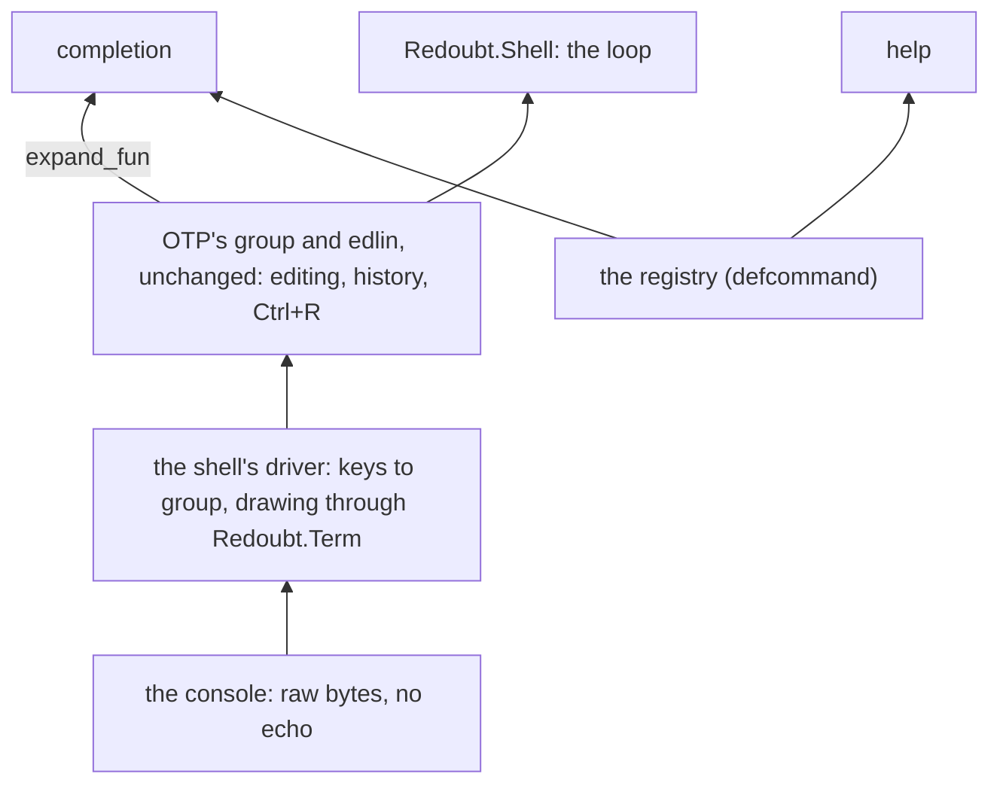

# The shell

The shell is `Redoubt.Shell`, a read-eval-print loop of Redoubt's own over Elixir, in the
session's beamlet VM. A line at the prompt is Elixir and nothing else. The everyday work is done
by commands (`cat`, `ls`, `cp`, `grep`), which are Elixir functions, each declared once with its
types and its help and imported at the prompt. Native programs, joined by pipes, run in budgets of
their own when a stage must. Line editing, history, completion, help, the pager and full-screen
programs, the editor and file manager among them, are Elixir in the session, drawing into a screen
buffer beamlet holds natively. Everything the session draws reaches `/dev/cons` through one
encoder, the only writer of control sequences, so hostile text can never drive the person's
terminal ([hostile text](#hostile-text-never-drives-the-terminal)).

## Purpose

A person who logs in has to be able to work: look at files, change them, run programs, stop what
runs away, and find out how. On a box with no Unix, Elixir is the natural shell language (the
Nerves project uses IEx the same way on devices), and a better scripting language than any shell
language. What a bare Elixir prompt lacks is the short surface a shell gives, launching and piping
programs, job control, screens, and line editing on a console nobody echoes for. This page
describes that surface.

The scope is three things done well: the command line, an editor with a file manager, and the
agent ([agents](agents.md#the-agent-loop)). Everything else keeps to plain lines on the terminal,
and the terminal is the only front end there is.

## How to use it

The prompt shows the current directory and the line's number. The same work in a script and at
the prompt is the same Elixir; the commands are imported at the prompt and are plain functions
anywhere else (`Redoubt.Util.cat/1`):

```elixir
/home/alice (1)> cat("app.log") |> grep("error") |> count()
42
/home/alice (2)> cat("config.txt") |> sub("staging", "prod") |> w("config.txt")
:ok
/home/alice (3)> cp "notes.txt", "notes.bak"
:ok
/home/alice (4)> ls_r("logs") |> Enum.filter(&(stat(&1).size > 1_000_000))
["logs/big.log"]
/home/alice (5)> pipe(~w(zcat big.gz | sort | uniq)) |> w("uniq.txt")
:ok
/home/alice (6)> help(:cp)
```

A call needs no parentheses when it is the whole line (`cp "a", "b"`); inside a pipeline it does,
as Elixir says. Stop a runaway job with Ctrl+C. See what the session is using with `top()`. Edit a
file with `ed("notes.txt")`; browse and copy files in two panes with `fm("project")`.

## What it can and cannot do

### The shell in a session

Status: built · partly tested: the steward starts it as the console principal's session on the UART and as each SSH login's session; launching a program is tested in the steward's sessions over SSH, a vault session and a plain one, and on the UART under a tester in the steward's place and in the console principal's session, and a session's files wait for its namespace to reach the VM · tested: bench:userland-boot, bench:steward-ssh-two-principals, bench:steward-vault-launch, bench:beamlet-launch, bench:pipe-hostile-output, host:beamlet-redoubt::a_launch_takes_what_it_is_given_and_its_end_is_an_event

Every session starts `Redoubt.Shell` over the session's console connection, `/dev/cons`
([consoled](../servers/consoled.md) on the UART, [sshd](../servers/sshd.md) for an SSH channel).
In M1 (sessions over SSH, kept apart) the shell is what the milestone's sessions need and no more:
the console, reading and writing files through OTP's `File`, and launching a native program
through the launch natives ([beamlet](beamlet.md#natives)): `exec("name", args)` runs `/boot/name`
in a budget carved from the session's, as a pipeline of one stage: it reads the lines typed, until
Ctrl+D on an empty line, and what it writes is drawn as the line's own output; it holds no console
of its own. `exec` waits for it to end, and returns how it ended and what its budget held
([native programs](native.md#standard-input-and-output-and-pipes)). `ns()`, `ns_lookup/1` and `bind/2` are the
session's namespace ([sessions](sessions.md#namespaces)). The shell's modules come from the userland
disk, checked against the signed bundle
([R75 (verified userland)](../kernel/boot.md#r75-verified-userland)).

Everything the prompt evaluates runs with the session's authority, in the session's VM. There is
nothing the shell can do that the session's handles do not allow, and nothing a command adds to
them.

The userland disk's modules carry no `Docs` chunk, so `h/1` says no documentation is available;
an optional documentation package `h/1` reads when present is not built.

### The loop

Status: built · partly tested: runs on the host only, on beamlet and on the BEAM; its tests are the shell's own ExUnit suite, which `./test-shell` runs and no bench case does

`Redoubt.Shell` is its own loop, not IEx's ([`userland/shell`](../../userland/shell)):

1. **Read** a line from the group leader with `IO.gets/1`; a line that ends too soon to parse (an
   open `do`, a trailing `|>`) reads another.
2. **Parse** it with `Code.string_to_quoted/2`.
3. **Evaluate** it in a fresh Erlang process, with a killing heap limit, through
   `Code.eval_quoted_with_env/4`. The shell holds the bindings and the environment between
   lines, so an evaluation that dies loses only its own line. The compiler's diagnostics are
   taken with `Code.with_diagnostics/2` and printed by the shell, not written by the compiler.
4. **Print** the value through `Redoubt.Term.Text`, which draws every control character in it
   visibly (`^[`, `^G`, `<U+009B>`, `<U+202E>`); a `%Lines{}` is printed a line at a time.

A line that is not UTF-8, or that the tokenizer cannot read, is that line's error, and the next
is read; the tokenizer's warnings, like the compiler's, are printed through the same guard.

It is built on Elixir's public API only, and uses none of IEx's modules.

What the loop does not have:
- **A file run at start.** IEx runs `.iex.exs` from the current directory when it starts, with the
  session's authority, so a file planted in a shared directory would run in the session of anyone
  who started there. The shell reads and runs nothing at start but itself.
- **A second syntax.** A bare command name is an undefined variable, as Elixir says; the shell
  adds that it is a command to call as `pwd()`. `exit` alone on a line is the one word the loop
  reads itself, and ends the shell as `exit()` does.
- **Pry, remote shells, or a break menu.**

What a line writes to the console itself, as `IO.puts/1` does, reaches the console through the
shell's driver and its encoder too ([line editing](#line-editing-and-history)), so it is guarded
the same, and so is what the VM logs, the crash reports of processes a line spawned among it
([hostile text](#hostile-text-never-drives-the-terminal)).

### Commands

Status: built · partly tested: runs on the host only; its tests are the shell's own ExUnit suite, which `./test-shell` runs and no bench case does

Every command is a **commandlet**: an Elixir function declared once, with `defcommand`, in any
module of the shell that uses `Redoubt.Commandlet`:

```elixir
defmodule Redoubt.Shell.Helpers do
  use Redoubt.Commandlet, area: "Files"

  @summary "Copy a file"
  @help """
  Copies src to dst. Into an existing directory, the copy keeps its name.
  """
  @args src: "the file to copy", dst: "where the copy goes"
  @examples [{~S'cp("a.txt", "b.txt")', "copy a.txt to b.txt"}]
  defcommand cp(src :: path, dst :: path) do
    File.cp!(src, dst)
  end
end
```

- **Typed.** A parameter is `name :: type`, with an optional default: `path`, `string`,
  `integer` (with bounds), `pattern` (a string or a `~r//`), `lines`, `boolean`, `one_of`,
  `flags(...)` for keyword options, `ref` (a function or module), `name`, a command's name,
  `term` (any value), and `many(t)`.
  The arguments are checked, and coerced where a type says so, before the body runs; a wrong one
  raises a usage error naming the parameter and showing the usage.
- **The help is not optional.** A command without a summary, a page, a line for each parameter,
  or an example that calls it does not compile. The same declaration becomes the function's
  `@doc`, its page in `help`, and what completion offers for each argument.
- **Nothing else to wire.** The registry finds every module of the shell's application that
  declares commands; they are imported at the prompt and listed by `help`, grouped by area. The
  finding is done when the shell is built, which writes an index of the commands, each a function
  that calls its own; the prompt imports the index, so a command's module is loaded when the
  command is first called, not at the shell's start.

A command's arguments are Elixir values the person wrote, evaluated as Elixir evaluates them
anywhere. There are no bare words for the shell to quote, so there is no quoting to get wrong and
no second meaning a line can have.

### Files and text

Status: built · partly tested: every command runs on the host, over files beamlet's host platform serves, in the shell's own ExUnit suite against a seeded tree of real files; on the machine a session over SSH runs the commonest (`mkdir_p`, `w`, `cat`, `cp` within and across volumes, `mv`, `ls`, `stat`, `touch`, `cd`, `glob`, `checksum`, `rm_rf`), not every one · tested: bench:shell-commands

Files come in through `cat` and go out through `w`; everything between takes lines and chains with
`|>`. Relative paths resolve against the session's current directory.

| Command | What it does |
| --- | --- |
| `pwd()`, `cd(dir)` | the current directory; there is no kernel working directory |
| `ls(path)`, `ls_r(path)`, `find(path, pattern)`, `glob(pattern)`, `stat(path)` | list, walk, find by name, expand a pattern, stat |
| `cp(src, dst)`, `mv(src, dst)` | copy and rename; within one volume the server copies or renames, across volumes the copy passes through the session and `mv` is not atomic ([files](files.md)) |
| `rm(path)`, `rm_rf(path)`, `mkdir(path)`, `mkdir_p(path)`, `touch(path)` | remove, make directories and files |
| `cat(paths)` | the files' lines, read as they are consumed |
| `grep`, `grep_v`, `sub`, `cut`, `sort`, `uniq`, `uniq_c`, `head`, `tail`, `count` | lines in, lines or a number out |
| `w(lines, path)`, `append(lines, path)` | write or add lines to a file |
| `table(rows)` | rows laid out in columns, with a header and a titled border if asked |
| `hexdump(path)`, `checksum(path)` | a file's bytes, and its hash |

- `cat` returns `%Lines{}`: enumerable and lazy, so `cat("big.log") |> head(5)` reads only the
  start of the file, and a consumer that stops early closes it. It checks every file when called,
  so a missing one fails on its own line.
- `w` writes a new file beside the old one and renames it into place, so a failure leaves the old
  file whole and `cat(f) |> sub(...) |> w(f)` is safe.
- A file's contents and names are shown with every control character made visible, by
  `Redoubt.Term.Text`; bytes are looked at with `hexdump`.

What each file operation does underneath, and why a rename across volumes cannot be atomic, is
[files and binds](files.md)'s.

### The pager

Status: built · partly tested: the host only, on beamlet alone (the BEAM has no screen buffer, and prints instead); its tests are the shell's own ExUnit suite (`test/redoubt/screen/pager_test.exs`, `test/redoubt/screen/pager/doc_test.exs`), judged on a model of the terminal, and a pseudo-terminal test of the real binary, both of which `./test-shell` runs; on the machine, only the UART's console, which does not say its size, is tested: a bench case shows a long value printed whole there, and no case pages over SSH · tested: host:beamlet::help_longer_than_the_terminal_is_paged_and_q_gives_the_screen_back, bench:userland-read-only

The **pager** ([`Redoubt.Screen.Pager`](../../userland/shell/lib/redoubt/screen/pager.ex)) shows a
`%Lines{}` that is the value at the prompt a screen at a time, when it is longer than the screen;
`help`'s pages and topics are drawn in it with their headings bold. It is a screen program
([full-screen programs](#full-screen-programs)).
- **When it takes the screen.** Only on the shell's own terminal, of a size the console says, as
  an SSH channel's does: lines that fit the screen, and any lines on a console of unknown size
  (the machine's UART, whose `consoled` the image does not size:
  [consoled](../servers/consoled.md#the-consol-protocol)) or printed elsewhere, are printed as
  they are. `out(value)` prints without it.
- **Keys:** Space, `f` or Page Down a page on, `b` or Page Up a page back; Down, `j` or Enter a
  row on, Up or `k` a row back; `g` or Home the top, `G` or End the end; `/`, a text and Enter
  search forward, `n` and `N` the next and the one before, each match drawn reversed; `q` or Esc
  leaves, and the line's value is not printed again. A line wider than the screen goes on in
  further rows, a list item's under its text.
- **It reads what it shows.** The lines are read as far as the screen or a search needs, so
  `cat("big.log")` reads what is looked at, and leaving the pager stops the reading and closes the
  file. They are read by the line's evaluator, which opened the file, and handed to the pager a
  batch at a time. What the pager has read it keeps, to page back, counted toward the line's
  heap limit, binaries too: paging to the end of more than that ends the line with
  `{:screen, :killed}`, and the shell goes on.
- **Text and style.** Every line is drawn through the visible-text rule, the search text typed
  too. Help's style (bold headings, indented list items) is chosen by the shell's own help, never
  by the lines: anything made from them, `help() |> grep(...)`, is plain. A line typed at the
  prompt can make lines of help's style too; that costs nothing, since a style only makes some of
  them bold and indents others, and the text still passes the visible-text rule.

### Session commands

Status: built · partly tested: `clear()` runs on the host only, in the shell's own ExUnit suite (`test/redoubt/shell/driver_test.exs`); `ns`, `ns_lookup`, `bind` with its refusals and its cap, `whoami` and `labels` run in sessions over SSH on the machine, a vault session's among them, and on the host, where a VM is no session (`test/redoubt/shell/session_test.exs`) · tested: bench:shell-commands

| Command | What it does |
| --- | --- |
| `ns()`, `ns_lookup(path)`, `bind(prefix, conn)` | show the namespace; the connection a path resolves to; bind a held connection at a prefix ([binds](files.md#copying-moving-removing-and-binds)) |
| `whoami()` | the principal, with a named context after a dot (`alice.work`), as the steward told the session ([sessions](sessions.md#what-a-session-is-told)); `nil` for a VM that is no session |
| `labels()` | the session's label set, the kernel's, by the names the steward gave |
| `clear()` | clear the screen; the next prompt is drawn at its top |

Not built:
- **`follow(path)`**, the lines added to a file as they come until the interrupt, waits for
  [interrupting a line](#interrupting-and-killing-jobs): until then the interrupt ends no line
  being evaluated, so nothing would end it.
- **`now()`, `today()`, `ago(time)`**, wall-clock time, which a session has from
  M6 (persist, install, share).

### Native programs and pipes

Status: built · partly tested: `Redoubt.Pipeline`, which `pipe/1` and `exec` run, runs in the bench under a tester in the steward's place, and `exec` in the console principal's session too; `pipe/1`'s own splitting and refusals are the shell's ExUnit suite's, which no bench case runs; `Redoubt.Cmd`, the explicit form, and `run/2` are not built · tested: bench:pipe-carries, bench:pipe-never-reads, bench:pipe-no-authority, bench:pipe-interrupted, bench:pipe-hostile-output

A native stage is a program in a budget of its own, joined to the next by a served pipe file.
`pipe(~w(grep error log.txt | wc -l))` is the short form, and its value is the lines of the last
stage's standard output, or, if a stage did not exit 0, those lines and every stage's ending;
`cat("log.txt") |> pipe(~w(grep error))` gives the first stage lines to read. The stages' standard
error is drawn as it comes, through the guard. `Redoubt.Cmd` is the explicit form, which comes with
jobs:

```elixir
{:ok, [job]} = Cmd.new() |> Cmd.source("log.txt") |> Cmd.pipe({"grep", ["error"]}) |> Cmd.run()
Job.await(job).stdout
```

A native stage is for what should not run with the session's authority (an untrusted parser) or
needs its own address space; everything else is Elixir. How programs are launched, how their
standard streams are named and who serves a pipe are [native programs](native.md)'s.

**Running a script.** `run("tool.exs", ["a", "b"])` runs the script in the session's VM with the
session's full authority, with `System.argv/0` set: exactly as if it were typed.
`run("tool.exs", isolated: true)` starts a child VM through the same launch path as an agent's
lease ([agents](agents.md#the-agent-harness)), with capabilities the same as or narrower than the
session's. With no grants, the child gets a budget of its own carved
from the session's (bounded CPU and memory, ended by destroying it), a read-only view of the
current directory and no network. More is granted with options that map one to one onto the agent
harness's grant kinds ([agents](agents.md#the-agent-harness)): `read:`, `write:`, `gateway:`,
`git:` and `launch:`.

### Interrupting and killing jobs

Status: planned · M2 (usable shell)

There are no signals and no per-process kill. A job is killed by destroying its budget
([R10 (destruction)](../kernel/budgets.md#r10-destruction)): the shell carves one budget per native
stage from the session's, so `Job.kill(job)` ends that stage, everything it started, and nothing
else. `Job.status(job)` is `:running`, `:exited`, `:faulted` or `:killed`, read from the exit
notice ([processes](../kernel/processes.md#exit-notices)). A job's budget is carved from the
session's, so ending it can never touch the session.

The interrupt is Ctrl+C or the session's own key, Ctrl+\ (0x1C), which no full-screen program
can take and the driver never forwards:
- **The interrupt with a job in the foreground** destroys the budget of every native stage of that job.
  Elixir work, a line's evaluation or a screen program, is ended by killing its Erlang process
  with an untrappable exit (`:kill`); a screen's process is sent the exit `:interrupt` first, so
  its line tells the interrupt from a failure. The session and its VM survive, and the shell
  keeps the bindings of every line before the interrupted one.
- **The interrupt at an idle prompt** clears the line, drawing `^C` after it whichever key it was. There is no break menu and no job-control menu:
  both are OTP's `user_drv`, which the shell's driver replaces
  ([line editing](#line-editing-and-history)). A session ends only by `exit` or Ctrl+D.
- **With a full-screen program in front**, Ctrl+\ ends it. So does Ctrl+C, unless the program
  declared that it takes Ctrl+C as a key ([a screen's life](#full-screen-programs)): then Ctrl+C
  reaches it and Ctrl+\ is the only interrupt.
- **Over SSH**, `sshd` turns the channel's `signal` request (INT) and `break` request into the
  session's own key, the 0x1C byte, so they interrupt whatever is in front. It is a protocol message, not a Unix signal; nothing inside Redoubt
  has signals ([sshd](../servers/sshd.md)).

What a job cannot do:
- **Swallow the interrupt.** The session's driver reads `/dev/cons` all the time, not only while
  a line is requested, and a native stage never gets the raw console: its standard input is a
  pipe the session feeds. So no foreground program can hide the interrupt from the shell, and a
  screen that takes Ctrl+C still cannot take Ctrl+\\: the driver finds that byte in what was read
  before decoding any key, so neither an escape sequence begun before it nor a paste carries it
  to the screen. Under a screen that does not take Ctrl+C, the 0x03 byte is found the same way:
  ESC then Ctrl+C is the interrupt, never the key Alt+Ctrl+C.
- **Take the session's memory on the heap.** Every Erlang process the session starts, the
  evaluator, what a line spawns and every screen program, runs with Erlang's `max_heap_size` flag
  (killing), set to a fixed share of the session's budget, so a runaway allocation kills that
  process, as Ctrl+C would. A screen buffer counts toward its owner's limit. What lies off the heap,
  a large binary, is bounded only by the session's own page limit
  ([R6 (charging)](../kernel/budgets.md#r6-charging)), which ends the session, not the box.

Processes an expression spawned without a link are not killed by Ctrl+C; background work belongs
in a `Job`.

**Open:** none.

### The terminal library

<details><summary>Status: built · partly tested: the host only, for the line editor and screens, and screens on beamlet alone (the BEAM has no screen buffer); its tests are the shell's own ExUnit suite (`test/redoubt/term_test.exs`, `test/redoubt/term/frame_test.exs`, `test/redoubt/term/keys_test.exs`, `test/redoubt/term/width_test.exs`, `test/redoubt/shell/driver_test.exs`, `test/redoubt/screen_test.exs`), judged on a model of the terminal that takes only the encoder's sequences, and a pseudo-terminal test of the real binary, both of which `./test-shell` runs and no bench case does · tested (1)</summary>

- host:beamlet::pick_on_a_terminal_takes_the_screen_and_gives_it_back_with_the_choice

</details>

Nothing between the keyboard and the shell edits a line: `consoled` and `sshd` serve `/dev/cons`
as a raw byte stream with no echo. So the shell owns the terminal, through one library,
`Redoubt.Term` ([`userland/shell/lib/redoubt/term.ex`](../../userland/shell/lib/redoubt/term.ex)),
that everything drawn on it goes through: the line editor, the pager, `top`, the agent's output,
and every [full-screen program](#full-screen-programs).
- **The only writer of control sequences.** `Redoubt.Term`'s encoder, in the shell's driver,
  which alone holds the session's connection to `/dev/cons`, is the one code that emits escape
  sequences for what the session draws, and what it draws is cells: a grapheme with a colour and
  attributes, never bytes passed through. A control character in any text is drawn visibly
  ([hostile text](#hostile-text-never-drives-the-terminal)).
  There is no raw pass-through. The encoder ends every line with CR LF itself, since the console
  does no output processing; a host terminal that does so too draws the same.
- **One target:** VT102 plus the common xterm extensions every current emulator speaks, with no
  terminfo.
- **The line editor's drawing:** `group`'s requests, drawn by going back to the line's start,
  erasing below it and drawing the line again, which needs nothing of the terminal but relative
  cursor movement, CR, LF, erasing below and bold; typing at the end of the line draws only what
  was typed. The terminal's size is read at the start and at each prompt, and a change of size
  lays the line being edited out again at once ([below](#the-consoles-size)).
- **Frames are the cell protocol** ([the cell protocol](#the-cell-protocol)): the screen buffer's
  diff speaks it ([beamlet](beamlet.md#screen-natives)), and the encoder reads it through the one
  decoder (`Redoubt.Term.Cells`) and draws it
  ([`Redoubt.Term.Frame`](../../userland/shell/lib/redoubt/term/frame.ex)): each cell placed
  absolutely unless the cursor is already there, its style set when it changes (the attributes,
  and 16, 256 and 24-bit colour), on the alternate screen with the cursor hidden. Drawing is a
  diff: only the cells that changed are sent. Box drawing, block elements and Braille patterns (a
  2×4 dot grid per cell, the buffer's `plot`) are cells like any other.
- **Keys for a screen:** a key decoder
  ([`Redoubt.Term.Keys`](../../userland/shell/lib/redoubt/term/keys.ex)) for VT100, xterm and
  Linux sequences, including modifier forms (`ESC [1;5C` is Ctrl+Right) and UTF-8. A lone ESC is
  held for a short timeout (50 ms, the driver's) before it is the Esc key, so Alt+F (ESC then `f`)
  is one key; the decoder itself reads no clock. At the prompt `edlin` decodes its own keys.
- **Width:** a grapheme's columns are OTP's judgement, `:unicode_util.is_wide/1`, from which the
  screen buffer's table is generated, so what the session measures is what it draws. The person's
  terminal has a table of its own, which may disagree on a wide or ambiguous grapheme, so after one
  the encoder places the cursor absolutely again, and a disagreement costs a cell's misplacement,
  never the rest of the line.

### The console's size

<details><summary>Status: built · partly tested: on a host a change of the terminal's size reaches only the driver's tests, since beamlet's command line does not deliver one; the driver's part is the shell's own ExUnit suite, which `./test-shell` runs · tested (5)</summary>

- bench:steward-ssh-resize
- host:beamlet-vm::a_change_of_the_console_s_size_reaches_its_reader_once
- host:beamlet-redoubt::a_change_of_the_console_s_size_reaches_the_vm_once_reading_has_begun
- host:redoubt-consoled::consol_size_is_the_argument_and_a_resize_waits_until_its_caller_gives_up
- host:redoubt-sshd::consol_size_is_the_pty_s_and_a_resize_is_due_when_it_changes

</details>

- **Size:** `:beamlet.console_size/0` asks the console's server afresh on every call, through
  `consol`'s `size` ([consoled](../servers/consoled.md#the-consol-protocol)), and gives
  `{cols, rows}` or `:unknown`; the driver reads it at the start and at each prompt, and lays out
  an unknown size as 80 by 24.
- **A change of size** is the server's answer to a `resize` call the VM keeps parked there, made
  again after each answer ([beamlet](beamlet.md#beamlet-on-redoubt)); nothing calls the session
  back. The VM hands it to the console's reader, the driver, as
  `{:beamlet_console_resize, {cols, rows}}`, and that size is the console's from then on. A
  screen in front is sent `{:resize, cols, rows}`: its buffer takes the new size, blank, and the
  screen lays itself out again, so its next frame clears the terminal and draws it all. With no
  screen in front, the line being edited is drawn again at the new width. On an SSH channel a
  change of the window arrives so ([sshd](../servers/sshd.md#sessions-over-ssh)). On the UART
  nothing resizes: the image names `consoled` no size, so it refuses `size` and `resize` and the
  shell's console there is of unknown size; a `consoled` given one refuses the `resize` a
  multiplexed session would make, since the session's own call already fills the connection's one
  parked call there, so the console keeps that size.

### Paste, scrolling and a plainer terminal

Status: planned · M2 (usable shell)

What the line editor and the screens built so far do not need:
- **A native program's frames:** a native program with a screen sends `cells` frames, and the
  encoder reads them through the same decoder as the buffer's.
- **Output:** scroll regions, bracketed paste, and synchronized update so a redraw does not
  flicker.
- **Glyphs:** a 16-colour ASCII fallback a session can choose, for a UART or a console font
  without box drawing, blocks or Braille.
- **Input:** bracketed paste as one event, so a paste can never trigger completion; a mouse
  report, if one is ever taken, is SGR only and decoded under the same rules.

**Open:** until bracketed paste is built, a paste reaches a full-screen program as keys, so a
pasted control character is a key: the editor asks before one saves, closes or opens a file ([the
editor](#the-editor)), and the gap closes with paste as one event; and whether the shell sends a
terminal query at login and adapts, or assumes the VT102 and xterm target (the recommendation:
assume, because a query on a UART that never answers costs a timeout at every login).

### Hostile text never drives the terminal

<details><summary>Status: built · partly tested: the host only, and the paths that exist there: the printer, a line's own writes to the console, what the VM logs, the prompt and the typed line, and a screen program's text, the pager's included, through the screen buffer (on beamlet alone); a native program's frames are not built; the attack case is the shell's own ExUnit suite (`test/redoubt/shell/driver_test.exs`, `test/redoubt/term_test.exs`, `test/redoubt/screen_test.exs`, `test/redoubt/screen/pager_test.exs`), judged by a model of the terminal that refuses any sequence but the encoder's own, which `./test-shell` runs and no bench case does, and the buffer's own refusals · tested (2)</summary>

- host:beamlet-screen::a_control_character_is_badarg_and_nothing_is_drawn
- host:beamlet-screen::a_control_character_is_refused_and_nothing_of_the_call_is_written

</details>

Text the session draws, from a file's contents, a file name, a program's output or a model's reply,
reaches `/dev/cons` only as visible characters: every control character in it (the ASCII and 8-bit
controls, DEL, and the bidirectional embedding, override and isolate controls) is drawn as text
(`^[`, `^G`, `<U+009B>`), as `less` does. So hostile text cannot set the person's clipboard
(OSC 52), retitle their window, forge a link (OSC 8), reorder what is shown, or make the terminal
answer as if typed. It holds because the encoder is the one writer of what the session draws, and
because nothing reaches the encoder but cells, whose symbols cannot hold a control character: from
the shell's printer, from a screen program through the buffer's natives, which refuse one, and
from a native program only as `cells` frames. The line editor is the one path that hands the
encoder text rather than cells: `group`'s requests, which the encoder makes visible grapheme by
grapheme under the same rule.

**What the VM logs goes through `group` too.** OTP's logger writes through its `default` handler
to `user`, the VM's own console server, past the driver. While the driver holds the console, the
logger's handler is the shell's instead
([`Redoubt.Shell.Log`](../../userland/shell/lib/redoubt/shell/log.ex)): every event, the crash
report of a process a line spawned, the emulator's report of one that died, an `error_logger` or
`Logger` call, is formatted as the `default` handler would have (OTP's formatter bounded to 4 KiB
an event), and written to `group` like any other output, so the encoder draws it visibly and
`group` draws the line being edited again after it. A byte that is not UTF-8 is written as
`<FF>`.
- **It never waits.** A handler runs in the process that logs, which may be one the console's own
  path waits on, so it only formats and sends; a relay process writes to `group` and is the only
  one that waits. An event logged by `group` or the driver themselves is drawn as one fixed line,
  `[a log event from the shell's terminal, not shown]`, by the driver, never through `group`.
- **It is bounded.** At most 32 events wait in the relay; a process that logs faster loses the
  rest, and their count is drawn with the next event shown (`[N log events dropped]`).
- **It ends with the driver,** which puts the `default` handler back as it was.

What it does not cover: code the person runs holds the session's authority, and can write to its
own console as it can do anything else the session can, `user` and `standard_error` among them;
a VM without OTP's logger in its code (the host's beamlet run with no system path) loads beamlet's
small stand-in, which prints to `standard_error` past the driver, though Redoubt's userland volume
holds OTP's; and the bidirectional marks (U+200E,
U+200F, U+061C) are drawn, since they only settle the direction of the weak and neutral characters
next to them. The invisible format characters (U+00AD, U+200B to U+200D, U+2060 to U+2064,
U+FEFF, the tag characters of plane 14) and the line and paragraph separators (U+2028, U+2029)
pass the guard too, so a file name or text holding them can look like another; they neither drive
the terminal nor reach the approval channel, which only the steward draws
([sessions](sessions.md#approve)), and drawing them as `<U+XXXX>` is
[a follow-up](../todo/shell-invisible-format.md). The attack case writes hostile text through
every path above and judges the bytes the session wrote to `/dev/cons`.

### The cell protocol

Status: built · partly tested: the Elixir decoder is held to the Rust one by the shared vectors in the shell's ExUnit suite, which no bench case runs · tested: host:cells::good_frames_decode_and_encode_back_to_their_bytes, host:cells::no_control_character_is_ever_a_symbol, host:cells::vectors_are_current

A frame of changed cells, `cells` ([`userland/native/cells`](../../userland/native/cells/src/lib.rs))
in Rust and `Redoubt.Term.Cells` in Elixir, is everything anything may hand the session to draw: a
position, a symbol, two colours and attributes per cell. It is strict. A symbol is a non-empty
string of at most 32 bytes, one cell's worth as the session lays it out, that holds no control
character, a cell cannot fall outside its
screen or be given twice, and a frame that decodes re-encodes to exactly its bytes; anything else
is refused, never repaired. One file of vectors holds the two decoders to the same answers.

### Full-screen programs

<details><summary>Status: built · partly tested: the host only, on beamlet alone (the BEAM has no screen buffer); its tests are the shell's own ExUnit suite (`test/redoubt/screen_test.exs`, `test/redoubt/screen/layout_test.exs`), judged on a model of the terminal, and a pseudo-terminal test of the real binary, both of which `./test-shell` runs and no bench case does · tested (1)</summary>

- host:beamlet::pick_on_a_terminal_takes_the_screen_and_gives_it_back_with_the_choice

</details>


```mermaid
flowchart LR
    APP["screen program: an Erlang process<br/>init, update, view"] -->|"widgets draw"| W["Redoubt.Screen: layout, widgets"]
    W -->|"put, fill, plot"| B["the screen buffer<br/>(beamlet natives)"]
    B -->|"diff: a cells frame"| E["Redoubt.Term's encoder"]
    NP["a native program with a screen"] -.->|"cells frames on a pipe"| E
    E -->|"escape sequences"| C["/dev/cons"]
    C -->|"raw bytes"| K["the session's key decoder"]
    K -->|"key events"| APP
    K -.->|"key events"| NP
```
*Figure: how a full-screen program reaches the terminal. Solid is built; a native program's
screen is planned (dashed). Only the session's encoder writes to `/dev/cons`; everything else
hands it cells.*

A full-screen program (the pager, `help`'s pages, `top`, the editor, a `menuconfig`-style form, a
QBasic-style menu bar and dialogs) is an Erlang process in the session's VM, not a program of its
own. It draws into a **screen buffer**, a grid of cells beamlet holds natively
([beamlet](beamlet.md#screen-natives)), and everything above the buffer is Elixir:
- **`Redoubt.Screen`** ([`userland/shell/lib/redoubt/screen.ex`](../../userland/shell/lib/redoubt/screen.ex)),
  a behaviour of three functions in the Elm style: `init`, `update` on a key or a message, and
  `view`, which draws the whole screen into the buffer, blank each time; only what changed since
  the last frame is sent. One Erlang process runs a screen, with its caller's heap limit (the
  evaluator's, from a line), the binaries it holds counted too: the shell's driver sends it the
  keys while it is in front, and it answers each with `update`, `view` and the buffer's diff, a
  frame the driver reads through the one decoder and draws. Its first event is
  `{:resize, cols, rows}`, with its size.
- **Layout** is rectangles only: split into rows or columns by fixed size, percentage or what is
  left; centre; inset. A screen lays out in fixed rectangles.
- **Widgets are functions, not processes:** each draws into a rectangle of the buffer from what it
  is given, every text made visible first: a box with a title and a shadow, a status line, and
  those that take keys ([widgets](#widgets-focus-and-themes)).
- **A screen's life.** A line starts a screen with `Redoubt.Screen.run(module, args, opts)`,
  which returns when the screen ends, with the value its `update` ended it with. While it is in
  front, the driver shows the alternate screen with the cursor hidden, sends it every key as
  `{:key, key, modifiers}` but the interrupt, and holds other processes' output, answering them
  at once so none waits on the screen; then it shows the main screen again, as it was, and draws
  what it held. The interrupt ends it with `nil`: Ctrl+\\, and Ctrl+C unless it was started with
  `ctrl_c: :key`, which makes Ctrl+C a key it is sent (the editor copies with it). One screen is
  in front at a time. A screen can ask the process that started it for what only that process
  may touch (`Redoubt.Screen.serve/5`), as the pager asks its line's evaluator for lines from a
  file the evaluator opened.
- **`pick(items)`** and [the pager](#the-pager) are screens. `pick` is `menuconfig`'s chooser:
  a list in a box, the arrows, Page Up and Down, Home and End to move, Enter to choose, Esc to
  leave. It returns the chosen item, or `nil`.
- **Small things skip it.** A spinner, a progress line or a single status line is drawn by
  `Redoubt.Term` directly.

What a full-screen program cannot do:
- **Draw a control sequence.** What a screen program draws reaches the terminal only through the
  buffer's natives, which refuse a control character, and through the one decoder, which refuses
  a frame that is not exactly cells; the driver ends a screen whose frame it refuses
  ([hostile text](#hostile-text-never-drives-the-terminal)).
- **Keep the interrupt from the session.** Ctrl+\ ends the screen in front, as it ends a line at
  the prompt, and so does Ctrl+C unless the screen takes it as a key
  ([interrupting](#interrupting-and-killing-jobs)).

### Widgets, focus and themes

Status: built · partly tested: the host only; the keys of every widget, the focus ring and the dialog stack on beamlet and on the BEAM, and what they draw on beamlet alone (the BEAM has no screen buffer); its tests are the shell's own ExUnit suite (`test/redoubt/screen/widget_test.exs`, `test/redoubt/screen/drawing_test.exs`, `test/redoubt/screen_test.exs`), judged on a model of the terminal, which `./test-shell` runs and no bench case does

A screen program is built of widgets
([`userland/shell/lib/redoubt/screen/`](../../userland/shell/lib/redoubt/screen/)), which are
plain data and functions, never processes. One that takes keys is a struct with `key`, which
answers a key with the widget changed, with the value it ended with (Enter on a list, a button
pressed), or with `:pass` for a key it does not take; and `draw`, which draws it into a
rectangle of the buffer, with the focus or without. The screen's `update` stays the one place
its state changes. The widgets' code is not held at the prompt: they declare no commands,
so nothing loads them until a screen first draws with them.
- **The widgets:** a list, which is also the radio list and the checklist (Space marks); a row
  of buttons; a one-line text input whose cursor is a cell drawn in its own style, the
  terminal's cursor staying hidden; a menu bar with drop-downs, opened by F10 or Alt and a
  menu's first letter, modal while open; a table with a header, its columns sized as
  [`table`](#files-and-text) sizes them; a Braille canvas of dots, two across and four down in
  each cell, drawn with the buffer's `plot`; and the completion pop-up, a list placed below a
  cell, or above it with no room below. The prompt's own completion is `group`'s list
  ([completion](#completion)), not the pop-up.
- **A stack of modal dialogs:** a message, a yes or no, and an input with OK and Cancel. Keys go
  to the top dialog, which keeps those it does not take, or to the screen when there is none;
  Esc closes the top dialog with `nil`. The stack is laid out in `view` from the size the screen
  has, top to bottom, so a screen of a new size draws it again at that size.
- **Focus:** inside a dialog or a screen, Tab and Shift+Tab move along a focus ring, and every
  other key goes to the widget with the focus.
- **A theme** is a map from roles (the text, the selection, a border, the menu, a button, the
  input, its cursor, and the parts of code the editor highlights) to styles. Three are built:
  the terminal's own colours, the default, with code in bold, dim and italic; QBasic's blue; and
  `menuconfig`'s.
- **Every style is the code's.** A widget draws each part in its role's style, and its text
  through the visible-text rule: a label, an item, a cell, a title or what was typed sets no
  colour, and a control character in it is drawn as `^[` in the role's style
  ([hostile text](#hostile-text-never-drives-the-terminal)). A theme is chosen by name from the
  three, never read from text.

What is not built: a `plot(values)` command drawing a series on the canvas.

### A native program's screen and the session's key

Status: planned · M2 (usable shell)

- **A native program with a screen**, a package's own TUI, sends `cells` frames on its standard
  output, and the session draws them through the same decoder and encoder. It holds its pipes and
  its budget, no `/dev/cons`, and a cell cannot carry a control sequence, so a hijacked one can
  draw wrong cells, or crash and have its budget reclaimed, and nothing more.
- **A key per principal.** The session's own key, Ctrl+\\
  ([interrupting](#interrupting-and-killing-jobs)), is the same for every session; a principal
  choosing another is planned here and not built.

**Open:** none.

### Line editing and history

Status: built · partly tested: the host only; its tests are the shell's own ExUnit suite (`test/redoubt/shell/driver_test.exs`: typing, editing keys, history and Ctrl+R, the interrupt, Ctrl+D, the input's end), which `./test-shell` runs on beamlet and on the BEAM and no bench case does


```mermaid
flowchart BT
    C["the console: raw bytes, no echo"] --> D["the shell's driver: keys to group, drawing through Redoubt.Term"]
    D --> G["OTP's group and edlin, unchanged: editing, history, Ctrl+R"]
    G -->|"expand_fun"| CO["completion"]
    G --> S["Redoubt.Shell: the loop"]
    R["the registry (defcommand)"] --> CO
    R --> HE["help"]
```
*Figure: the shell's layers, bottom up. One registry feeds completion and help.*

On the BEAM, line editing is OTP's `edlin` under `group`, plain Erlang; only the driver under
them (`user_drv` and `prim_tty`) needs the operating system. So the shell keeps `group` and
`edlin` unchanged and replaces the driver with its own
([`userland/shell/lib/redoubt/shell/driver.ex`](../../userland/shell/lib/redoubt/shell/driver.ex)),
the one process holding the console, which hands the bytes typed to `group` and draws `group`'s
requests through `Redoubt.Term`'s encoder. `group`'s driver protocol is small: requests to draw
(`put_chars_sync`, `move_rel`, `insert_chars`, `delete_chars`, `beep`, `redraw_prompt`,
`put_expand` and a few more), input as `{data, Chars}`, the geometry and terminal-state queries,
and the interrupt as an exit signal. That gives Emacs keys, a kill ring, multi-line input and
history with Ctrl+R search. `group` writes one escape sequence itself, its bold Ctrl+R prompt;
the encoder recognises exactly that, at the head of the request that carries it, and draws every
other byte through the guard. The driver reads three keys itself: Ctrl+C and Ctrl+\ end the line
being edited and nothing else ([interrupting](#interrupting-and-killing-jobs)), and Ctrl+\ never
reaches `group`; Ctrl+D on an empty line, like
the console's end, ends the input and so the shell. `group` has no way to hand its reader an end
of input (`edlin` takes `eof` for a line's end), so the driver answers the pending read with the
error `eof`, which `group` keeps in order behind the keys before it, and the shell reads as its
end. A byte that is not UTF-8 is read as the Latin-1 character it is.
- **History** is `group`'s, kept for the session; the driver cuts it to the newest 1000 lines at
  each prompt.

### Saved history, secret reads and pasting

Status: planned · M2 (usable shell)

- **History** persists per principal in the principal's home volume, capped in lines. A vault
  session keeps its history in memory only: its label forbids writing to the unlabelled home
  volume, so there is nowhere to save it.
- **Echo is the editor's job**, so a password prompt is a call that reads with echo off
  (`Redoubt.Term.read_secret/1`), not a terminal mode.
- **A paste is one event**, so a pasted Tab does not complete and a pasted newline does not run
  a line before the person presses Enter.

**Open:** how a paste becomes one event inside `edlin`, which has no bracketed paste.

### Completion

Status: built · partly tested: the host only, for the parameter types the host has (paths, commands and help's names); its tests are the shell's own ExUnit suite (`test/redoubt/shell/completer_test.exs`, `test/redoubt/shell/driver_test.exs`) and a pseudo-terminal test of the real binary, which `./test-shell` runs and no bench case does · tested: host:beamlet::tab_completes_a_command_on_a_terminal

The shell's completer
([`Redoubt.Shell.Completer`](../../userland/shell/lib/redoubt/shell/completer.ex)) is `group`'s
`expand_fun`, which the shell sets before each read over the names the prompt then has; its
module is loaded at the first Tab, and a command's name is completed from the commands' index,
loading no command. It looks at the line before the cursor with `Code.Fragment`:

| Line so far | Completes from |
| --- | --- |
| `c⇥` (a name being typed) | the commands and functions imported at the prompt, and its variables; a function alone gets its `(` |
| `cp("no⇥` (inside a string argument of a command) | the type that parameter is declared with: a path, or a command's or help's name (`help(:gr⇥` too) |
| `File.re⇥`, `:lists.re⇥` | the functions of the module |
| `Fi⇥` | aliases and modules, a segment at a time |

- **Paths** resolve against the session's working directory and read the directory once per
  Tab, with the session's own authority, as `ls` does; whether a name is a directory is asked
  of the names that match only. So completion cannot show a name the session could not `ls`:
  on Redoubt the file server lists only entries the caller's labels may read. A name starting
  with a dot is offered once its dot is typed.
- The first Tab inserts what every candidate shares; the second lists them below the line, in
  columns, a few rows of them, and a third lists them all. Directories complete with a trailing
  `/`. The list is `group`'s, drawn by the encoder under the visible-text rule, with the line
  kept on the screen.
- **Nothing typed becomes an atom.** No typed text is parsed: the command a string or an atom
  is given to, and which of its arguments that is, are found from the brackets and commas before
  the cursor, and the command is looked up by its name as a string. `Mod.fu⇥` names a module only
  if its atom exists already, and loads that module from the code path if it is not loaded yet,
  as calling it would.
- A completer never launches a program and never writes. Reading a directory or the code path's
  modules runs in a process of its own with 300 ms; past that it is stopped, and Tab inserts and
  lists nothing.
- A parameter declared as a principal, a budget or a label completes on Redoubt, where the shell
  has those types.

### Help

Status: built · partly tested: runs on the host only, and in the pager on beamlet alone; its tests are the shell's own ExUnit suite and a pseudo-terminal test of the real binary, which `./test-shell` runs, and a bench case that prints `help()` on the machine's console · tested: host:beamlet::help_longer_than_the_terminal_is_paged_and_q_gives_the_screen_back, bench:userland-read-only

```text
help()            # commands grouped by area, one line each
help(:cp)         # the command's page: usage, parameters, examples
help(:elixir)     # a topic: how Elixir reads at the prompt; help(:terminal), and more
h(File)           # Elixir's own documentation of a module; h(&File.cp/2) of a function
```

A command's page comes from its `defcommand` ([commands](#commands)), so a command cannot exist
without one. A topic is a short Markdown page bundled with the shell. `h/1` reads the
documentation chunks of the module's `.beam` file. What help shows is lines, so it can be
searched (`help() |> grep("file")`); longer than the screen, it is shown in
[the pager](#the-pager), with a topic's headings, the index's areas and a page's usage line and
"Examples" in bold. Only the shell's own help is styled so: `h/1` shows a module's documentation,
which is the module's, as it is.

### Resource use

Status: built · partly tested: runs on the host only, where there are no budgets but the fake kernel's; its tests are the shell's own ExUnit suite, which `./test-shell` runs and no bench case does

```text
free()      # the session's pages: limit, used, free; what the VM's processes, binaries, atoms, ETS hold
uptime()    # since the box booted, by the kernel's clock, and since the session started
ps()        # the session's budget, then the VM's Erlang processes, the largest first
top()       # all of it on a screen, refreshed each second, the busiest process first; q leaves
```

They read and change nothing ([`Redoubt.Shell.Resources`](../../userland/shell/lib/redoubt/shell/resources.ex);
`top`'s screen, [`Redoubt.Screen.Top`](../../userland/shell/lib/redoubt/screen/top.ex), is loaded only when it is called).
The session's budget is read through `budget_usage` on the named handle `budget`
([budgets](../kernel/budgets.md#budget_usage)), so they show only what is the caller's own: its
(account, label set). Another principal's processes, and a vault session's from an ordinary one,
are not listed, because a count of someone else's work is a channel. PIDs are drawn at random for
the same reason ([processes](../kernel/processes.md#processes-and-pids)). The processes listed are
the VM's own, Erlang processes; a native program the session runs is counted in the session's
pages and processes, in a budget carved from its own. A platform with no budgets, the host's,
shows the VM's part and says so.

Not built:
- **`df()`**, the session's volumes' space: no file server answers a call for it yet, neither the
  free space of a volume nor what is left of a byte quota
  ([walfsd](../servers/walfsd.md#quotas), [littlefsd](../servers/littlefsd.md#quotas)); that call
  comes first.
- **The session's jobs in `ps()` and `top()`**, each native stage and its budget, with jobs
  ([interrupting and killing jobs](#interrupting-and-killing-jobs)): a launch gives the session a
  job, not a PID.

### The editor

Status: built · partly tested: the host only; the editor, its highlighting and the file manager; their keys, files and highlighting on beamlet and on the BEAM, their drawing on beamlet alone; their tests are the shell's own ExUnit suite (`test/redoubt/editor_test.exs`, `test/redoubt/editor/buffer_test.exs`, `test/redoubt/editor/syntax_test.exs`, `test/redoubt/editor/manager_test.exs`), judged on the files and on a model of the terminal, which `./test-shell` runs and no bench case does

The editor and the file manager work as one, in the manner of Midnight Commander:
`ed("notes.txt")` opens the editor on a file, and `fm("project")` opens two panes on a directory,
from which F4 edits the selected file in the editor and closing the editor returns to the panes.
- **Modeless, with the keys people expect.** The editor keeps micro's keys: Ctrl+S saves, Ctrl+Q
  quits, Ctrl+F finds, Ctrl+Z undoes, Ctrl+C and Ctrl+V copy and paste, and the mouse is not used.
  The editor takes Ctrl+C as a key, and the session's own key, Ctrl+\, ends it, as it ends any
  screen ([the session's key](#a-native-programs-screen-and-the-sessions-key)).
  The panes keep Midnight Commander's: Tab changes pane, Enter goes into a directory, F3 views,
  F4 edits, F5 copies, F6 moves, F7 makes a directory, F8 removes, F10 leaves.
- **What it edits well:** search and replace by regular expression, in linear time for every
  pattern ([beamlet](beamlet.md#what-runs-on-it)); syntax highlighting for the languages of the
  box (Elixir, Erlang, Rust, Markdown, TOML, JSON); undo and redo; several files open at once. A
  file is held as lines, and as a rope only if a large file is measured to need one.
- **Scripted edits are the commands'.** A script changes a file with `cat |> sub |> w`
  ([files and text](#files-and-text)), not by driving the editor.

The editor is `ed(path)` ([`Redoubt.Editor`](../../userland/shell/lib/redoubt/editor.ex)); its
text is lines around a cursor ([`Redoubt.Editor.Buffer`](../../userland/shell/lib/redoubt/editor/buffer.ex)),
which a file read and saved unedited gives back byte for byte, a missing final newline and `\r`
included. A file that is not UTF-8 opens read only, each byte that is not text drawn as `<FF>`.
A pattern between slashes is a regular expression, matched within a line. A tab is drawn to the
next stop of four, and any other control or bidirectional character visibly, in the style of
the part of the line it is in; the cursor and the selection are styles of the theme, drawn over
the highlighting. A line is read only as far as the window's right edge when it is drawn, so a
line of a megabyte costs a draw what the window shows of it. Like every command, its code is
loaded when it is first called. A key that would save, close or open a file asks first when it
comes in a burst: with more keys already waiting behind it, as a paste does, or within 300 ms of
a key that had, as a paste's last key does. The keys arriving with the question are dropped,
until 300 ms after the last of them however long the paste, so a pasted Enter cannot answer it.
The 300 ms are measured between the editor's handling of two keys, not their arrival, so a
paste whose keys each take the editor longer than that (an edit to a line of megabytes) could
outrun the window; what such a paste can do is bounded by the screen's heap limit, which ends
the editor.

The highlighting ([`Redoubt.Editor.Syntax`](../../userland/shell/lib/redoubt/editor/syntax.ex))
is chosen by the file's extension (`.ex` and `.exs`, `.erl` and `.hrl`, `.rs`, `.md`, `.toml`,
`.json`; any other file is plain text), and a language's module is loaded when a file of it first
opens. A language cuts each line into parts, each a role of the theme: a keyword, a string, a
comment, a number, a constant or a heading. The parts are the line's own bytes, so a file chooses
a role and nothing more: what a role looks like is the theme's, and an escape sequence in a
string is drawn visibly in the string's style. A line starts from the state the line above left
(inside a string or a comment that runs on, or not); the editor keeps that state every 128
lines down to the window, and drops what an edit may have changed, from the edited line down,
and all of it on an undo, a redo or a replace through the file. So the first jump to the end of
a large file scans every line once, and an edit costs only the lines from it to the window. Only
a line's first 4 KiB are read, the rest drawn plain, so a window costs a bounded scan whatever
its lines hold; a scan costs time in a line's length (a 1 MiB line in some 7 s on beamlet, on
the host, were it read whole).

The file manager is `fm(dir)` ([`Redoubt.Editor.Manager`](../../userland/shell/lib/redoubt/editor/manager.ex)),
a screen program of two panes, each listing one directory through
[the editor's files](#the-editors-files): a directory is drawn `/name`, and a name those refuse
`!name`, which every key refuses in turn. Enter goes into a listed directory, or up on `..`
through the pane's own path, never through a listed name, and on a file edits it. F3 opens the
editor read only, F4 to edit, and closing it comes back to the panes, listed again. F5 copies
and F6 moves the selected name into the other pane's directory, F7 makes a directory by a name
typed, and F8 removes a file or a directory and all it holds. Copy, move and remove ask first,
naming what and where, and a question is deaf for its first 300 ms and, while keys arrive with
more queued behind them, until 300 ms after the last: so no paste, however long, answers it with
its Enter. A failure is said in a dialog.

Undo keeps at most 500 steps, and holds at most a million lines between them. A step holds a
new copy of the list of lines the cursor crossed since the step before (the lines' bytes are
shared), so 500 steps each taken after a jump between the top and the bottom of a 2 MiB file
held, unbounded, about 350 MiB of heap with 64-byte lines and 2.6 GiB with 8-byte lines on the
BEAM, past the 16M words a screen may grow to. A step also holds its own copy of the cursor's
line, so 500 keys typed into a file of one 1 MiB line, the cursor moved between them, would keep
500 MiB. Each step counts the lines it crossed or inserted, never more than the file's, and a
line for every 16 bytes of the cursor's line; once the steps hold more than a million the oldest
go, and the newest is always kept. After 500 edits across a 2 MiB file of 15-byte lines, the
buffer, undo and all, fits in half a screen's heap; after 500 on one 1 MiB line, the copies kept
come to some 16 MiB (`buffer_test.exs`).

It is an Erlang process in the session's VM, drawn through the screen buffer
([full-screen programs](#full-screen-programs)), and it runs with the session's authority, as
every tool in the session does. A file is data to it, handled as the session handles all data: by
Elixir on a memory-safe VM ([why](#why)). What the editor must not have is a way to turn a file's
contents into an action:
- **No file content becomes an action.** It has no modelines, evaluates nothing it opened, takes
  no path from a file, and saves only to the file it was asked to, through a temporary file and a
  rename.
- **The panes act only on what they list.** A name in a listing that holds `/`, is `.` or `..`, or
  holds a NUL is shown and refused, and every copy, move and removal is made on the listed
  directory, so a server that lists a crafted name cannot make the file manager act outside it.

### The editor's files

Status: built · partly tested: the host only, on beamlet and on the BEAM; the editor and the file manager use it; its tests are the shell's own ExUnit suite (`test/redoubt/editor/files_test.exs`), each verdict read from the file system afterwards, which `./test-shell` runs and no bench case does

What the editor and the file manager do to files is one module,
[`Redoubt.Editor.Files`](../../userland/shell/lib/redoubt/editor/files.ex), over `File`, with
the session's own authority and no more:
- **Reading.** A file is read whole, up to 2 MiB (`max_bytes/0`), and comes back as its bytes,
  whether they are UTF-8, and a digest. A larger file, or a path that is not a regular file, is
  refused by name, with the size and the limit. At most one byte past the limit is read, so a
  file that grew past it since its size was looked at is refused without being read whole.
- **Saving.** A save writes a new file in the same directory, under a name the module makes
  (`.NAME.saving-` and random hex), and renames it over the path; a write, close or rename that
  fails (a full disk, a read-only volume) removes the new file and is returned as an error, never
  raised. So a save reaches its own path and nothing else, and a reader never sees half a file.
  A file changed on disk since it was read (its digest differs, or it appeared or went) is
  `changed` and left as it is, unless the caller asks to overwrite it; the check reads at most
  one byte past the limit.
- **Listing.** A directory's entries come back by name, each with its name as shown, every
  control or bidirectional character drawn visibly ([hostile text](#hostile-text-never-drives-the-terminal)),
  and whether it may be acted on. A name that holds `/` or NUL, or is empty, `.` or `..`, is
  refused: it is not looked at, and no operation joins it to a directory.
- **The panes' operations:** copy, move (a rename, or a copy and a removal across volumes, as
  `mv`), make a directory and remove, each on a name in its listed directory, to the same name
  in the other pane's. Nothing is overwritten, and a directory is never copied or moved into
  itself.
- **Contents are data.** Nothing here takes a path, a name or an action from what a file holds:
  a modeline or an escape sequence in a file comes back as the bytes it is.

Residual: a move across volumes is a copy and a removal, so a removal that fails leaves the
copy beside the source. A directory is kept out of itself by its path as written, not with
links resolved: on a volume with symbolic links, copying a directory into a link that points
inside it copies into its source. Both cost only the session's own files; follow-ups for the
file manager.

## Why

**Elixir is the shell, and the loop is Redoubt's.** No shell in the Elixir world replaces bash,
and none needs to: Elixir pipelines read like shell pipelines and have none of the quoting,
word-splitting or injection problems. IEx is the obvious loop, but it runs a file from the
current directory at start with the session's authority, its evaluator and
completion are internal modules with no stable API, and its terminal driver is the one part that
needs the operating system. The shell keeps what is sound under IEx (`group`, `edlin`, the
compiler) and writes the loop, a small one, on Elixir's public API. The surface of a shell (`cat`,
`ls`, `grep`, `top`) is borrowed from Toolshed, which was written for this situation, and
reimplemented over Redoubt's namespace instead of Linux `/proc`.

**One syntax.** The prompt is Elixir and nothing else: there is no second syntax to keep in step
with Elixir, no rule for which lines are commands, and no quoting to get wrong. Plain Elixir costs
a pair of quotes and a comma, and a call that is the whole line needs no parentheses. One language
and one parser leave nothing to inject into.

**Commands are declared, not written twice.** A command's types, its help, its page and what
completion offers come from one declaration that does not compile without its help, so a command
cannot drift from its documentation or ship without it.

**One layer.** An operation that does not need its own address space is an Elixir function, not
a program: there is no `cp` or `ls` binary to launch, to sign or to audit. A native program is
for what must run apart from the session: untrusted input, or authority the session should not
lend.

**The terminal is the session's, and the C reference stays a reference.** `libvterm`, a C
terminal library, is read for its state machine and key tables and is never built or linked:
Redoubt has no C in its build. Terminal code is a parser of untrusted bytes (anything that reaches
`/dev/cons` can be typed or pasted), which is one more reason to keep it in a memory-safe language.

**Cells, not bytes.** Whatever reaches the person's terminal can drive the terminal program on
their own machine, and on Redoubt much of what is shown was written by a hostile party: an agent's
reply, a file it made, a name it chose. Sanitising at every place that prints would be one check
to forget per program. Making the session's encoder the only writer, and cells the only thing
anyone else can hand it, leaves no path for a control sequence to take.

**Screens are drawn in the session.** A screen is an Erlang process in the session's VM: it
costs the box no process and no copy of any code. Widgets and layout need neither speed nor
anything outside Elixir; what needs speed on an interpreter is the loop over cells, and that alone
is native ([beamlet](beamlet.md#screen-natives)).

**The editor is Elixir.** It is a screen program like the pager, so it reads a file with the same
memory-safe code every tool of the session uses and costs no process of its own. Its search is
`Regex`, which costs linear time in every pattern, as it does wherever Redoubt matches one; its
highlighting reads each line once, from left to right.

**One VM per session.** Every tool of a session, the shell, the editor, `top`, the pager, runs in
the session's one VM. A VM is not a wall inside one principal: code that takes one over holds the
session's handles and could load any bytecode it liked, whichever tool it came in through. The
wall is the kernel's, around the VM, and it holds whichever tool read the file: what a session
reaches is what its principal was granted, keys stay in `keyd`, and approvals are drawn only at
`approve@`. So a person or an agent pays for one VM's code and heap, not one per tool. Running
code someone else wrote is a risk the person takes, here as in any environment; a child VM with
narrower grants is there for whoever wants one.

**The terminal is the only front end.** A web interface for administration would be an inbound
service and a GUI, both non-goals ([the tenets](../TENETS.md#non-goals)), and it would render
agent-written text in the most privileged person's browser. The design it would need is recorded
beyond M6 ([a browser GUI](../beyond/browser-gui.md)).

**No resize callback.** IPC is caller-initiated, so a server tells a client something by
answering a call the client made and the server parked. A callback would need the console server
to hold an endpoint into the session, which is authority it should not have; a parked call needs
none.
