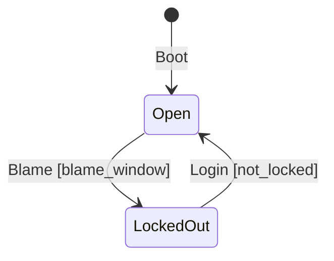

<!-- Generated by redoubt-steward-gen from libs/steward/tables/blame.md: do not edit. -->

```mermaid
stateDiagram-v2
    [*] --> Open: Boot
    Open --> LockedOut: Blame [blame_window]
    LockedOut --> Open: Login [not_locked]
```
*Figure: the `blame` machine, generated from its table.*
