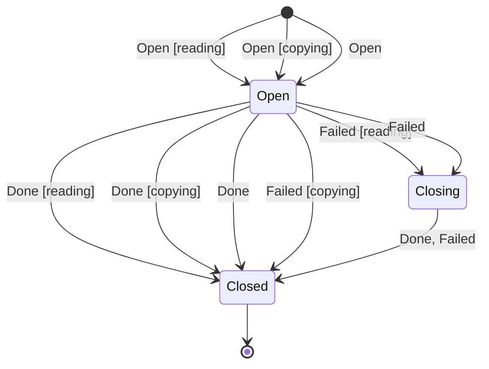

<!-- Generated by redoubt-steward-gen from libs/steward/tables/crossing.md: do not edit. -->

```mermaid
stateDiagram-v2
    [*] --> Open: Open [reading]
    [*] --> Open: Open [copying]
    [*] --> Open: Open
    Open --> Closed: Done [reading]
    Open --> Closed: Done [copying]
    Open --> Closed: Done
    Open --> Closing: Failed [reading]
    Open --> Closed: Failed [copying]
    Open --> Closing: Failed
    Closing --> Closed: Done, Failed
    Closed --> [*]
```
*Figure: the `crossing` machine, generated from its table.*
