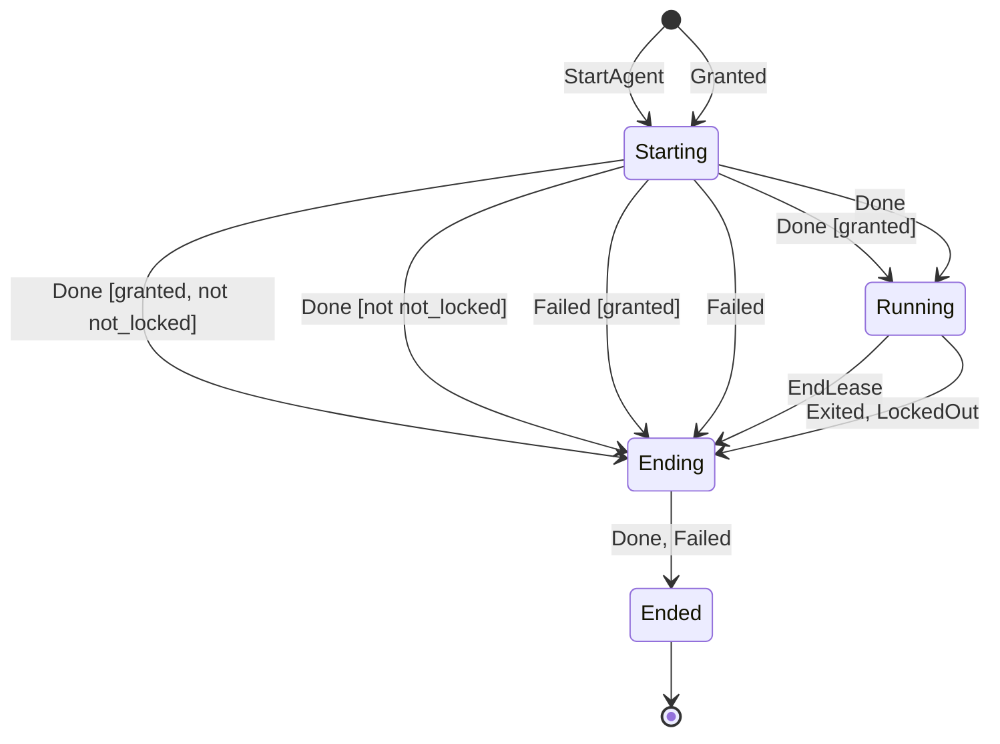

<!-- Generated by redoubt-steward-gen from libs/steward/tables/lease.md: do not edit. -->

```mermaid
stateDiagram-v2
    [*] --> Starting: StartAgent
    [*] --> Starting: Granted
    Starting --> Ending: Done [granted, not not_locked]
    Starting --> Ending: Done [not not_locked]
    Starting --> Running: Done [granted]
    Starting --> Running: Done
    Starting --> Ending: Failed [granted]
    Starting --> Ending: Failed
    Running --> Ending: EndLease
    Running --> Ending: Exited, LockedOut
    Ending --> Ended: Done, Failed
    Ended --> [*]
```
*Figure: the `lease` machine, generated from its table.*
