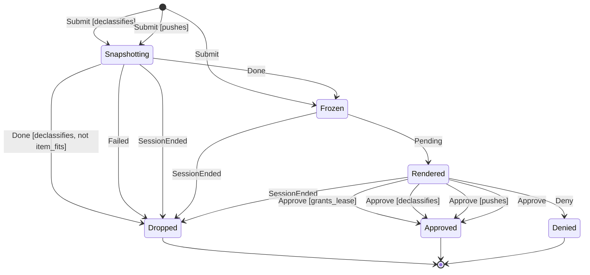

<!-- Generated by redoubt-steward-gen from libs/steward/tables/request.md: do not edit. -->

```mermaid
stateDiagram-v2
    [*] --> Snapshotting: Submit [declassifies]
    [*] --> Snapshotting: Submit [pushes]
    [*] --> Frozen: Submit
    Snapshotting --> Dropped: Done [declassifies, not item_fits]
    Snapshotting --> Frozen: Done
    Snapshotting --> Dropped: Failed
    Snapshotting --> Dropped: SessionEnded
    Frozen --> Rendered: Pending
    Frozen --> Dropped: SessionEnded
    Rendered --> Dropped: SessionEnded
    Rendered --> Approved: Approve [grants_lease]
    Rendered --> Approved: Approve [declassifies]
    Rendered --> Approved: Approve [pushes]
    Rendered --> Approved: Approve
    Rendered --> Denied: Deny
    Dropped --> [*]
    Approved --> [*]
    Denied --> [*]
```
*Figure: the `request` machine, generated from its table.*
