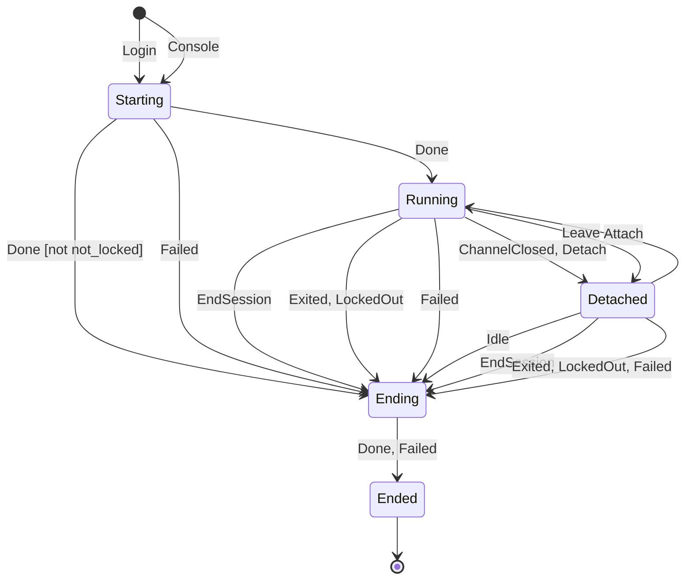

<!-- Generated by redoubt-steward-gen from libs/steward/tables/session.md: do not edit. -->

```mermaid
stateDiagram-v2
    [*] --> Starting: Login
    [*] --> Starting: Console
    Starting --> Ending: Done [not not_locked]
    Starting --> Running: Done
    Starting --> Ending: Failed
    Running --> Detached: ChannelClosed, Detach
    Running --> Detached: Leave
    Running --> Ending: EndSession
    Running --> Ending: Exited, LockedOut
    Running --> Ending: Failed
    Detached --> Running: Attach
    Detached --> Ending: Idle
    Detached --> Ending: EndSession
    Detached --> Ending: Exited, LockedOut, Failed
    Ending --> Ended: Done, Failed
    Ended --> [*]
```
*Figure: the `session` machine, generated from its table.*
