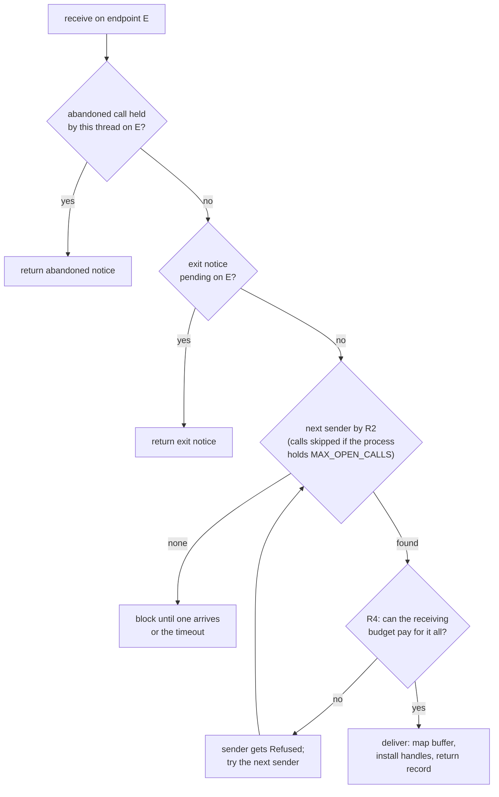

# DOC1 manifest: the documentation rewrite (lead's plan)

## Context

Redoubt's docs grew by package and by answer number. They mix target and current state, cite
process material (WP-, answer and question numbers) and number milestones differently from the
owner's current plan. DOC1 replaces them with one structure, written from the code, where every
section says whether it is built and tested or planned for a named milestone. The brief
(`todo/DOC1-docs-rewrite.md`, agreed with the owner 2026-09-25) is the contract. This file is
the lead's manifest for owner review. No page is written before "DOC1 PLAN APPROVED: write".

## A. Milestone remap (every reader and writer uses this)

The legacy docs number milestones differently. A legacy reference is mapped by this table, and
by topic where the table says so. No page ever writes a bare milestone number.

| Legacy wording | New milestone | Notes |
| --- | --- | --- |
| "milestone 1", "M1", PLAN "Milestone 1: separation and containment" (steps 0-8, the M1 attack suite) | **M1 (separation and containment)** | except the shell items below |
| legacy M1 shell items: IEx helpers beyond login (`Redoubt.Shell` helpers, `Redoubt.Util`, command mode, `Redoubt.Cmd` pipes, job kill, `Redoubt.Ed`, `top`, the terminal library, line editing, completion, help; USERLAND-API's "WP-B2c, proposed, not milestone 1") | **M2 (usable shell)** | M1 keeps only: a session VM running IEx with the console, files and launching needed by the attack suite |
| (no legacy equivalent) SFTP, SCP | **M3 (files in and out)** | new in the owner's plan |
| "Milestone 3: self-hosted development", "milestone 3" (`gatewayd`, compilers, server APIs, `std` target, client crates, USERLAND-API "full inventory") | **M4 (self-hosted development)** | |
| PLAN "After milestone 1": the real-agent harness / escape room (GAME), `gatewayd` | **M4 (self-hosted development)** | the owner's M4 names GAME running continuously and the audit log |
| "Milestone 2: install, share, persist", "milestone 2", "from milestone 2" (packages, trust lists, user signing, projects, sharing, steward persistence and re-minting, `budget_children`, first-owner enrolment on the console, run-time users, namespace re-walk after restart, A/B updates, M-of-N, rollback counter, audit chaining and the verifier, keys in leases, sealed `keyd` keys) | **M5 (persist, install, share)** | the audit log itself is M4; its chaining and offline verifier are M5 (log retention) |
| "After milestone 3: rv32" (full-stack rv32 boot) | **beyond M5** (`beyond/rv32.md`) | until then: rv64 boots and rv32 compiles, for every milestone |
| "SMP (after milestone 1)" | **beyond M5** (`beyond/smp.md`) | the two-hart spike and 4-hart bench cases that exist are documented as built |
| "Later", "deferred" (disk encryption, swap, ASLR, time donation, taint-on-read, integrity labels, content store, OS debugger, Linux on reserved cores, IOMMU, `linkd`/`routerd`, `webd`, FIDO approvals, FPGA) | **beyond M5** (`beyond/`) | |
| TENETS "Milestones 1 to 3 require rv64 boot acceptance and rv32 compilation" | "Every milestone, M1 (separation and containment) to M5 (persist, install, share), requires rv64 boots and rv32 compilation." | |
| KERNEL-SPEC "Added in milestone 2: `budget_children`" | M5 (persist, install, share) | it serves the persistent, restarting steward |

A writer who meets a legacy milestone reference the table does not decide raises it with the
lead; the lead rules and adds a row here.

## B. ID map

### B1. Schemes
| Scheme | Form | Owner | Notes |
| --- | --- | --- | --- |
| Kernel rules | `R1`-`R12`, `R4a`, `R4b`; new `R13`, `R14` | kernel pages (below) | numbers kept; R13, R14 new |
| Invariants | `I1`-`I15`; new `I16` | `kernel/invariants.md` | I16 renames the model's `I-DMA` |
| Bench verdict rule | `rule F` | `docs/testbench.md` | cited by `tests/logsrv-badge-forgery.toml` and `tests/programs`; kept by its letter |
| Server, network and policy rules | continue the `R` series (after the kernel set's last number) | server pages | one series: no new letter can collide with a package letter (K, R, S, D, B, E, C, M, W, A, L, T, V, G) |

Collision warning: packages `R1`..`R4` (for example "WP-R3", "pre-R3", "R3 and the rest of M1")
share the rule prefix. Pages never cite packages. At switch-over, code comments and case
descriptions that use a bare `R2`/`R3` meaning a package are rewritten (section K).

### B2. Owners
| ID | Short name (the citation form) | Owning page |
| --- | --- | --- |
| R1 | flow | `kernel/ipc.md` |
| R2 | fair waiting | `kernel/ipc.md` |
| R3 | lends and abandoned calls | `kernel/ipc.md` |
| R4 | delivery | `kernel/ipc.md` |
| R4a | open calls | `kernel/ipc.md` |
| R4b | a server dies | `kernel/ipc.md` |
| R5 | interrupts | `kernel/devices.md` |
| R6 | charging | `kernel/budgets.md` |
| R7 | carving | `kernel/budgets.md` |
| R8 | accounts | `kernel/budgets.md` |
| R9 | stamps | `kernel/objects.md` |
| R10 | destruction | `kernel/budgets.md` |
| R11 | memory (no mapping is ever writable and executable; every page zeroed; no physical addresses; DMA pages held until reset; `map_fixed` never replaces) | `kernel/memory.md` |
| R12 | scheduling | `kernel/scheduling.md` |
| R13 | one outcome per call (new: the legacy "IPC completion" contract) | `kernel/ipc.md` |
| R14 | unforgeable sender (new: badge, account, labels and message ids are the kernel's) | `kernel/ipc.md` |
| I1-I15 | as KERNEL-SPEC "Invariants", short names fixed in `kernel/invariants.md` | `kernel/invariants.md` |
| I16 | DMA pages return to the pool only after every device that could hold them confirmed a reset (was `I-DMA`) | `kernel/invariants.md` |
| rule F | bench verdict lines come only from a party the attacker cannot impersonate | `docs/testbench.md` |

Invariant short names (fixed now so every page cites them the same way): I1 handles name live
objects; I2 revocation is complete; I3 minted badges are non-zero and narrow; I4 only badge-0
handles receive; I5 usage within limits; I6 labels only grow downward; I7 every flow obeys R1;
I8 class and account inherited; I9 pages W^X, zeroed, lends unmapped; I10 create-destroy
leaves the parent unchanged; I11 fair turns; I12 ids never reused; I13 every blocking call
returns by its timeout; I14 no call panics the kernel; I15 abandoned calls reported once;
I16 DMA pages reset before reuse.

### B3. New IDs, and who allocates them
- The kernel set (written first) allocates R13 onward and I16. The candidates are fixed here; the
  lead may merge or drop one while writing, and records the final list in this table:
  R13 one outcome per call; R14 unforgeable sender; R15 verified boot (no byte of the bundle
  runs before its signature checks); R16 the loader confines images (no segment or entry in the
  kernel's range, truncated images refused); R17 fail closed at boot (bad signature, short
  seed, no timebase: power off); R18 device objects are the only device authority; R19 the
  kernel's own mappings are W^X; R20 a reused PID inherits nothing; R21 crash blame names the
  current call's sender or nobody; R22 a range call costs what the page tables need, never what the length asks (the inventory, Q-12); R23 the production kernel carries no test-only diagnostic channel such as the scheduling trace (Q-29).
- **Final kernel list (as written):** R13 one outcome per call, R14 unforgeable sender (ipc.md);
  R15 verified boot, R16 image confinement, R17 fail closed (boot.md); R18 device authority
  (devices.md); R19 kernel W^X, R22 range cost (memory.md); R20 PID reuse, R21 crash blame, with
  "the exit endpoint is a receive right" folded in (processes.md); R23 no test channels
  (scheduling.md); I16 DMA pages reset before reuse (invariants.md); R24 SUM and MXR clear
  (memory-layout.md, added in R1 for the kernel's `sstatus` rule; planned · M1, fixed in the
  kernel follow-up package). Short names are the parentheses of the defining headings. The
  servers set starts at R25.
- **Servers list (as written):** R25 the label check, R26 admission fairness, R27 badge
  allocation, R28 parked-call accounting (serving.md); R29 strict decoding, R30 one layout per
  message (wire.md); R31 startup block checked whole, R32 a hostile image hurts only its process,
  R33 no server holds a system budget, R34 confined placement, R35 key separation (init.md); R36 unpredictable ids, R37 vault non-interference, R38
  out-of-band approval, R39 leases end, R40 blame by label set, R41 narrowing by revocation scope,
  R42 one approved item (steward.md); R43 no export, R44 one key, one purpose, keyd's own digest,
  R45 constant-time signing (keyd.md); R46 only the public list (bootfsd.md); R47 one volume
  per instance, R48 a quota per attach root, R49 a hostile medium is corrupt, not a crash, R50
  power loss leaves before or after (fsd.md); R51 DMA stays in its region, R52 a lie is a
  failure, never corruption, R53 a filesystem sees only its partition (blkd.md); R54 DMA stays in
  netd's regions, R55 a bad frame is content, not a lie, R56 no earlier frame leaks, R57 the
  device stops before netd does (netd.md).
- The servers set takes the next free numbers, in the order its pages are written (the
  userland template has no Security properties section, so userland pages only cite).
- `rule F` stays on `docs/testbench.md`.

### B4. Where the IDs are cited today (from the code survey)
- Code cites every rule and invariant: R1 46, R2 63, R3 69, R4 51, R4a 43, R4b 25, R5 46,
  R6 40, R7 30, R8 10, R9 24, R10 147, R11 55, R12 59; I1 48 ... I15 16 (occurrences in
  `*.rs`, `*.toml`). About 3 bare `R2`/`R3` mean packages (`kernel/src/ptable.rs:43`,
  `kernel/src/arch/riscv/process.rs:240`, the net rig's "pre-R3").
- Process references in code to rewrite at switch-over: about 254 "answer N", 170
  "QUESTIONS N", 285 `WP-` IDs, 70 `OD<n>` owner decisions, 14 "OWNER DECISION", 10
  "K5-code-review-N", 40 "P1-1"-style, 38 "INTERIM", 5 "plan section N.N"; 164 citations of
  `KERNEL-SPEC.md` and about 450 of other legacy doc names (section J has the mapping).
- `model/src/mutation.rs` `Mutation::rule()` returns "IPC", "answer 173", "QUESTIONS 2",
  "QUESTIONS 12" and similar for some variants; these become R13, I16 and the owning IDs.

## C. The pages

Conventions for this section. Each page lists: **purpose**; **sections** with the status each
will carry (B = built, with the test sources; P = planned, with milestone); **sources** (code,
tests, legacy sections; inventory item IDs are added in section D as the readers' files land);
**IDs owned**; **diagrams**. Status abbreviations expand to the S3 grammar. "Legacy X §Y" means
`docs/legacy/X.md`, heading Y. Test names are the sources the writer draws on; the status line
names the ones that attack that section's claim. Pages marked **(added)** are not in the brief's
layout; the reason is given.

### C1. Repo root
- **`README.md`**: what Redoubt is (the prison, five sentences), what runs today (one line and
  a link to `docs/plan/`), where to start (`docs/README.md`), licence. Sources: brief "What
  Redoubt is"; current root README. No status lines.
- **`GETTING-STARTED.md`**: prerequisites (toolchains and targets, QEMU, firmware via
  `scripts/build-bios.sh`, `RUSTSBI_PROTOTYPER*`); build (`./mkimage`); run (`./launch`, its
  flags); test (`./test`, `cargo testbench`, filters, `--list`, logs in `target/testbench/`);
  debug (GDB over QEMU, `./launch --debug`, debug info); render the docs (`mdbook build docs`);
  the dev container (`Dockerfile`, `dev.sh`). Sources: current GETTING-STARTED; legacy DEBUGGING;
  legacy testbench §Running tests, §Poking at it by hand, §Firmware.
- **`CONTRIBUTING.md`** (moved to the root, where GitHub looks): scope and review, DCO,
  formatting (absorbs legacy FORMATTING), commit style, AI disclosure, how to report a
  vulnerability. Sources: legacy CONTRIBUTING, FORMATTING.
- **`CODE_OF_CONDUCT.md`** (moved to the root unchanged: it is a standard text).

### C2. `docs/` top level
- **`docs/README.md`**: reading order; the status legend (S3 grammar, test kinds); the milestone
  names M1 (separation and containment) to M5 (persist, install, share) and "beyond M5"; the ID
  scheme; how to render (`mdbook build docs`, output in `target/book`). No status lines.
- **`docs/TENETS.md`** (outranks all): What Redoubt is (the prison); Threat model (adversary
  with full source, automated exploits, owns its processes, may compromise a server; what is out
  of scope: physical, malicious hardware, microarchitectural and covert channels); Guarantees:
  capability closure, label non-interference, human control, each citing its rules and
  SECURITY.md, with an **Open:** list for the unresolved qualifications (permitted same-label
  delegation vs the closure wording; confined placement vs trusted mediation for approvals,
  push and declassification); The walls (the approval human, host virtio emulation, allowed
  egress channels, side channels: "enumerated walls, each attack-tested"); Network policy
  (default deny, name allowlists, blocklists only subtract, mediated DNS, gateway capabilities
  for agents, name-scoped TCP only for people, always forbidden: host and metadata addresses,
  the box's own services from inside, inbound except SSH; future web serving); Tenets 1-7
  (audit in full; secure by construction; Rust and assembly only where Rust cannot reach; open
  standards; dependencies are TCB; tested to hell and back; devices speak virtio); Every
  dimension we claim (rv64 boots and rv32 compiles for every milestone; hart counts; firmware);
  Non-goals (the brief's list); Changing a tenet. Diagram: the prison walls (Mermaid flowchart:
  host, virtio emulation, firmware, loader, kernel, system servers, shared servers, sessions,
  agents, egress; solid built, dashed planned). Sources: legacy TENETS; brief; the owner's
  vision notes (prison OS, softcores over virtio, network caps incl. DNS and IP); legacy
  CONTAINMENT §Covert and timing channels; GAME §Scenarios (collusion through the human).
- **`docs/SECURITY.md`**: How to audit (start here; each row names the enforcing code and the
  test); The walls (same diagram family as TENETS, annotated with row groups); The register:
  one row per property, columns `Property | Rule | Enforced in | Tested by | Status | Residual
  risks`, grouped kernel / servers / network / boot; Residual risks by wall. Written last, from
  the pages; the checker holds it to them.
- **`docs/GLOSSARY.md`**: one entry per term: meaning, Unix equivalent where one exists, the
  page that defines it. Terms at least: principal, person, agent, sponsor, session, vault
  session, project, lease, label, label set, trust domain, confined deployment,
  declassification, push, budget, account, class, carve, weight, pass, revocation scope,
  handle, badge, stamp, receive right, mint, endpoint, call, send, lend, transfer, open call,
  current call, abandoned call, exit notice, crash blame, device object, DMA, quarantine,
  namespace, bind, connection, fid, attach root, 9P, typed message, wire table, steward,
  powerbox, approval, gateway, sink, bundle, boot manifest, startup block, loader stub, TCB,
  hart, XLEN, physmap, W^X, bench case, attack case, verdict, mutation, the model. Written
  first (it fixes the vocabulary every writer uses), finished last.
- **`docs/SWARM.md`**: how packages are built and reviewed. Absorbs legacy SWARM (roles,
  questions and evidence, claims, review debt), `.pi/agents/{architect,implementer,orchestrator,
  reviewer}.md`, `.pi/skills/architect-qa`, `.pi/prompts/swarm.md`, the flows in
  `.pi/workflows/*.js` (described in prose), BUILD-PLAN's package format (Reads, Delivers,
  Accepted) and the tier table. Process material is allowed here and in PROJECT.md only.
- **`docs/PROJECT.md`**: the Wash and orchestrator instructions, moved from the root and
  pointed at the new paths.
- **`docs/SUMMARY.md`**: the mdBook table of contents, in reading order.
- **`docs/testbench.md`** **(added**: the bench is part of the system under tenet 6, is cited by
  every status line, and needs one owner; GETTING-STARTED keeps only the commands**)**: what the
  bench is and its trusted verdicts (**rule F**); case format (kinds `boot`, `build`,
  `host-tests`, `ssh-loopback`, `no-cruft`, `unsafe-budget`, their fields); checked builds;
  hostile inputs; files in the bundle; devices, network peers and the capture; SSH sessions;
  self-checks; the unsafe budget; the no-cruft gate; the docs checker. Status lines required.
  Tests: `bench:bench-*` self-checks, `host:testbench::*`. Sources: `tools/testbench/src/*`,
  legacy testbench.

### C3. `docs/kernel/` (kernel template; `README.md`, `memory-layout.md`, `abi.md`,
`invariants.md`, `model.md` use the reference shape: summary, Purpose, content sections,
Residual risks, Why)
- **`kernel/README.md`**: what the kernel keeps (memory, threads, IPC, interrupt delivery, the
  timer; nothing else) [B · bench:no-cruft]; the objects at a glance [B]; the TCB and its size
  (firmware interface, loader, kernel, `redoubt-sys`, `paging`, `redoubt-layout`) [B ·
  bench:unsafe-budget]; source map (module to page). Diagram: kernel objects and how they refer
  to each other (Mermaid). Sources: `kernel/src/*` module heads; legacy TENETS §1; legacy
  KERNEL-SPEC intro.
- **`kernel/boot.md`**: Interface: the chain firmware, loader, kernel, first process [B ·
  bench:rustsbi-boot]; firmware (vendored RustSBI, no fallback) [B]; the boot bundle (ustar,
  `sig(64) || tar`, kernel first) [B · bench:bench-bundle-file]; what the loader does, six steps
  [B · bench:loader-rejects-kernel-address, -kernel-entry, -truncated-elf, -grants]; the argument
  block (tags `XArg`, `MREx`, `Plic`, `Seed`, `Time`, `Devs`, `Ctrl`, `IniE`) [B]; hardware
  abstraction (features, DT only in the loader, the IRQ contract) [B]; devices handed to the
  first program [B]; the loader loads only the kernel and `init`, which places device handles
  from the manifest [P · M1]; verified boot (Ed25519, domain-separated preimage, development
  key, what is not covered) [B · bench:verified-boot-rejects-tamper,
  -bare-archive, host:redoubt-signing::*]; randomness (`Seed`, ChaCha8) [B · bench:rng].
  Security properties R15, R16, R17. Residual: the loader itself is not verified on QEMU; one
  development key; no rollback protection (M5); RustSBI is TCB. Diagrams: boot sequence
  (Mermaid sequence, firmware to first process); argument-block tag layout (svgbob); signature
  preimage layout (svgbob). Sources: `loader/src/*`, `kernel/src/args.rs`, `kernel/src/main.rs`,
  `kernel/src/platform/*`, `libs/signing`; legacy BOOT, VERIFIED-BOOT, DEVICE-GRANTS.
- **`kernel/memory-layout.md`**: the direct physical map [B]; the split by root entry [B]; the
  map for Sv39 and Sv32 [B · bench:kernel-wx, bench:touch-beyond-ram]; user space layout (anon
  base, stack top, stub region, link address) [B · bench:stub-launch, bench:map-fixed-tables];
  Sv32 vs Sv39 [B]; `satp` and PTEs, the lent bit [B · bench:wx]. Residual (from "accepted
  trade-offs"): the physmap has a writable alias of user code; global `sfence.vma`; firmware
  must delegate instruction page faults; no ASLR (beyond). Diagrams: both address maps
  (svgbob), PTE bits (svgbob). Sources: `libs/layout`, `libs/paging`,
  `kernel/src/arch/riscv/{mem,physmap,process}.rs`; legacy MEMORY-LAYOUT.
- **`kernel/objects.md`**: the four object kinds [B · bench:budget, bench:process, bench:device];
  handles (object, badge, stamp; index 0; `MAX_HANDLES`; table pages) [B ·
  bench:budget-table-attack, bench:budget-forge-attack]; what objects cost [B ·
  bench:budget-mem-churn]; `mint` [B · bench:redoubt-ipc, bench:redoubt-ipc-attack]. Security
  properties R9. Why: no rights bits; budgets are the only revocation. Diagrams: a handle table
  and the objects it names (svgbob); mint narrowing (Mermaid). Sources: `kernel/src/{handle,
  budget,endpoint,device}.rs`; legacy KERNEL-SPEC §Objects, §What objects cost, `mint`;
  CAPABILITIES §Handles, §Minting and revocation.
- **`kernel/processes.md`** **(added**: processes, threads, exit notices and crash blame have no
  home in the brief's list and carry the required process lifecycle diagram**)**: processes and
  PIDs [B · bench:process]; threads [B · bench:thread-limit]; creating and starting
  (`process_create`, `process_map`, `process_start`, slots 1..n, `arg`) [B · bench:process,
  bench:process-attack]; exit notices (causes, blame, PID lifetime) [B · bench:process-lifecycle,
  bench:process-review]. Security properties R20, R21. Diagrams: process lifecycle
  (Mermaid state), exit-notice sequence. Sources: `kernel/src/process.rs`, `ptable.rs`;
  legacy KERNEL-SPEC §Objects (Process), §Messages (exit notices).
- **`kernel/ipc.md`**: the finished sample (end of this file). Owns R1-R4b, R13, R14.
- **`kernel/memory.md`**: `map_anon`, `unmap`, `set_flags`, `map_fixed`, `process_map`,
  pages backed on first touch, zeroing [B · bench:mem-attack, bench:lend-untouched-page,
  bench:return-lent-unmapped, bench:map-fixed-attack]; lending at the page-table level [B ·
  bench:uaf-lent-page, bench:move-borrowed-page]. Security properties R11 [bench:wx,
  bench:write-only-attack, bench:map-fixed-attack, mutation:R11NoZeroing,
  R11SetFlagsAllowsWx, R11AllowsWriteOnly, R11LendStaysMapped, R11MapFixedSkipsOverlap],
  R19 [bench:kernel-wx]. Diagram: a page's states (free, mapped, lent, transferred, DMA-held)
  (Mermaid state). Sources: `kernel/src/mem.rs`, `arch/riscv/mem.rs`, `libs/paging`;
  legacy KERNEL-SPEC R11, calls rows; MEMORY-LAYOUT §satp.
- **`kernel/budgets.md`**: the budget object and its fields [B · bench:budget]; `root`,
  `system`, `users` [B]; class is trust, not order [B]; labels on budgets [B · bench:budget];
  deadlines (the kernel half of a lease) [B · bench:budget-deadline]; `budget_usage` [B ·
  bench:process-attack]; `budget_children` [P · M5 (persist, install, share)]. Security
  properties R6, R7, R8, R10 (tests: `bench:budget-*`, mutations `R6*`, `R7NoCarveCheck`,
  `R8AccountFromArgument`, `R10*`). Diagrams: the budget tree at boot (Mermaid); budget
  lifecycle (Mermaid state: live, dying, destroyed; deadline and destroy edges). Sources:
  `kernel/src/budget.rs`; legacy KERNEL-SPEC §Objects (Budget), R6-R10; RESOURCES §Budgets;
  CAPABILITIES §Minting and revocation.
- **`kernel/scheduling.md`** **(split from "budgets and scheduling"**: R12 alone is a page of
  rules**)**: one flat stride queue [B · bench:sched-share]; preemption points [B ·
  bench:sched-wake-no-preempt]; the current minimum and ties [B · bench:sched-ties]; charging [B
  · bench:sched-destroy-billing]; inheritance [B · bench:sched-debt-lift]; running while carved
  down [B · bench:sched-carve-inflation]; responsiveness (a measured target, not a bound) [B ·
  partly tested: the rv64 steward decision-wake target is missed · bench:sched-latency].
  Security properties R12 (mutations `R12*`, `host:redoubt-stride::*`). Residual: server work
  is paid by the server's weight; wakeup is prompt but not bounded. Diagram: pass and wake
  rule (Mermaid flow). Sources: `kernel/src/sched.rs`, `libs/stride`; legacy KERNEL-SPEC R12,
  RESOURCES §Scheduling.
- **`kernel/timer.md`**: time (`time_now`, `rdtime`, microseconds since boot) [B ·
  bench:timeouts]; the hart timer, always armed [B · bench:sched-timer-flood]; timeouts and
  `FOREVER` [B · bench:timeouts, bench:timeouts-tcg]; budget deadlines [B ·
  bench:budget-deadline]; wall-clock time and time sync [P · M5 (persist, install, share)].
  Diagram: what arms the timer (Mermaid flow). Sources: `kernel/src/time.rs`,
  `arch/riscv/timer_sbi.rs`; legacy BOOT §The hart timer, RESOURCES §The timer.
- **`kernel/devices.md`**: device objects (MMIO with DMA flag, IRQ, Reset) [B · bench:device];
  `map_device` [B]; `dma_alloc` [B · bench:dma-rules]; DMA reset before reuse and quarantine
  [B · bench:dma-reset-reuse, bench:dma-reset-quarantine]; `system_reset` [B]; which process
  gets which device (init places them from the manifest) [P · M1 (separation and
  containment)]. Security properties R5 [bench:uart-irq, mutation:R5NoMaskOnFire,
  R5NoUnmaskOnReceive], R18 [bench:irq-attack, bench:loader-rejects-grants, bench:legacy-gone];
  cites I16. Residual: a DMA driver is TCB without an IOMMU; only virtio-mmio devices are
  reset; a reset stops the device for every holder; a co-holder keeps its mapping of a
  quarantined device. Diagrams: DMA-run lifecycle (Mermaid state: allocated, mapped, owner
  ends, reset requested, confirmed or quarantined); interrupt delivery (Mermaid sequence:
  fire, mask, receive unmasks). Sources: `kernel/src/{device,dma}.rs`,
  `arch/riscv/{irq,intc_plic}.rs`; legacy KERNEL-SPEC R5, R10 (DMA), R11 (DMA); IO-ARCHITECTURE
  §DMA; DEVICE-GRANTS.
- **`kernel/abi.md`**: one register layout on both widths [B ·
  host:redoubt-sys::every_call_round_trips]; call numbers and arguments [B]; records [B ·
  host:redoubt-sys::malformed_calls_are_refused]; the `receive` record [B ·
  host:redoubt-sys::received_layout]; errors and their codes [B]; errors and the order of
  checks (the full table) [B · bench:budget-syscall-attack, bench:syscall-attack,
  host:redoubt-model::every_call_and_error_is_reached, fuzz:redoubt-sys/decode]; unknown call
  numbers [B · bench:legacy-gone]. Diagrams: register use for a call and its return (svgbob);
  record slot layout (svgbob). Sources: `libs/sys/src/*`, `kernel/src/redoubt.rs`; legacy
  KERNEL-SPEC §System calls, §ABI, §Errors and the order of checks.
- **`kernel/invariants.md`**: I1-I16, each `### I<n> (<short name>)` with its statement, where
  the kernel keeps it, the model check (`model/src/invariants.rs` function) and its tests.
  Owns I1-I16. Sources: legacy KERNEL-SPEC §Invariants; `model/src/invariants.rs`,
  `model/tests/dma_contracts.rs`.
- **`kernel/model.md`**: what the executable model is (independent of the kernel source, no
  unsafe, no dependencies) [B]; property families [B · host:redoubt-model::kernel_sequences,
  budget_lifecycles, scheduler_fairness, flood]; mutations, one or more per rule [B ·
  host:redoubt-model::every_rule_has_a_mutation, mutations_are_caught]; traces [B ·
  host:redoubt-model::traces_round_trip]; replaying traces against the real kernel [P · M1
  (separation and containment)]. Residual: no trace has been replayed on the real kernel; the
  model checks its own abstraction. Sources: `model/`, legacy CONTAINMENT §The executable
  security model; model README (VALIDATION.md is dated evidence and is not carried).

### C4. `docs/servers/` (kernel template)
Where a server's code exists and is host-tested but is not yet started by `init`, its sections
split: the code's behaviour is B with its host and bench tests; running in the system is P · M1
(separation and containment).
- **`servers/README.md`**: the server graph (who starts whom) [P · M1]; trust tiers (TCB,
  trusted system servers, shared servers, per-principal servers) [P · M1]; **Labels** (heading "Labels": on the server
  side; system servers check; read needs the caller's labels to include the object's, write
  needs equal; sinks) [B · host:redoubt-rt::* (label)]; connections (one badge one client, a
  launcher never passes its own connection, `new_connection`, `disconnect`) [B ·
  host:redoubt-rt::*]; restart and crash blame (init restarts; five restarts in 60 s reboots;
  the steward's three-crash rule) [P · M1]; the capability holdings of every server (table plus
  diagram) [P · M1]; the network path [B for `ipd` and `netd`, P for the rest]. Diagrams:
  capability holdings per server (Mermaid flowchart, required); server graph; the network path
  agent, `gatewayd`, `tlsd`, `ipd`, `netd` (required; `tlsd` dashed, beyond M5). Sources:
  legacy CONTAINMENT §Labels, §Crash blame; INIT §Decisions, §Restarts, §The system servers;
  IO-ARCHITECTURE §Networking; CAPABILITIES §Handles.
- **`servers/serving.md`** **(added**: the shared server library is built, host-tested and used
  by every server; it holds admission, the label check, parking and the reply-outcome
  transaction rule**)**: `admit` [B]; `check` [B]; minted connections [B]; parked calls [B]; typed
  dispatch [B]; the 9P server skeleton and the conformance corpus [B ·
  fuzz:redoubt-rt/ninep_server]; replies and rollback (`delivered`/`discarded`, the mask,
  provisional state) [B]; parking a typed call [P · M2 (usable shell), with the open
  typed-parking question]. Security properties: admission fairness, the label check, badge
  allocation (random start above 2^63, never reused), parked-call accounting (new R IDs).
  Diagrams: parked-call lifecycle (Mermaid state); reply outcome (Mermaid state). Sources:
  `libs/rt/src/server/*`, `libs/rt/tests/*`; legacy CONTAINMENT §The shared server library;
  NAMESPACES §Holding a call.
- **`servers/wire.md`**: the message convention (word 0 opcode, status, inline vs buffer
  shape, 9P in a lend, `ninep_common` reserving 1-15) [B · host:redoubt-wire::*,
  fuzz:redoubt-wire/typed, fuzz:redoubt-wire/ninep]; 9P2000 as Redoubt uses it (`msize` 64 KiB,
  one connection per endpoint handle) [B]; wire tables and the generator (markers, types, the
  drift check) [B · host:redoubt-wire-gen::generated_files_are_current]; granting and releasing
  [B]; strict JSON [B · fuzz:redoubt-wire/json, host:redoubt-wire::*]; the `ninep_common` table
  (included). Diagrams: message word layout (svgbob); generation pipeline (Mermaid). Sources:
  `libs/wire/*`, `libs/wire/gen`; legacy WIRE; NAMESPACES §Capabilities are 9P connections.
- **`servers/init.md`**: the boot manifest (entries, confinement check, weights, names,
  arguments, what `/boot` shows) [P · M1]; starting the servers [P · M1]; the startup block
  (format, fields, refusal rules) [B · fuzz:redoubt-rt/startup, host:redoubt-rt::*]; launching
  a process through the loader stub [B · bench:stub-launch, fuzz:stub/plan, host:stub::*];
  fresh connections per child [P · M1]; restarts and reboots [P · M1]; the key-separation check
  at boot [P · M1]. The `startup` table (included). Diagrams: boot sequence from `init` to the
  first session (Mermaid sequence, required); restart and reboot (Mermaid state). Sources:
  `libs/rt/src/startup.rs`, `stub/`, `image/boot.toml`, `tests/net/src/rig.rs` (the rig that
  stands in for init); legacy INIT; PACKAGES §Launching a process.
- **`servers/steward.md`**: principals [P · M1]; authentication and sessions [P · M1]; leases
  (`MAX_LEASE`, deadline budgets) [P · M1]; the powerbox and approvals (out-of-band channel,
  rendering whitelist, binding, caps) [P · M1]; declassification and push [P · M1]; crash-blame
  policy [P · M1]; fixed sub-budgets per label set [P · M1]; the audit log [P · M4
  (self-hosted development)]; log retention, chaining and the verifier [P · M5]; persistence
  and re-minting, run-time users and keys, first-owner enrolment [P · M5]; projects and
  sharing [P · M5]. The policy is modelled (`model/src/steward.rs`,
  host:redoubt-model::steward_policy, steward_noninterference and the `policy_current` tests):
  each planned section says what the model already checks. Diagrams: login sequence
  (required); lease lifecycle (Mermaid state, required); approval sequence; declassification
  sequence. Sources: `model/src/{steward,policy}.rs`; legacy CAPABILITIES §Principals, §Agents,
  §Projects, §The powerbox and approvals; CONTAINMENT §Declassification, §Push, §Sessions and
  vaults, §Crash blame; INIT §The system servers, worked example.
- **`servers/keyd.md`**: keys, purposes and messages [B · bench:keyd-build,
  host:redoubt-keyd::*]; bounds and errors [B]; seeds from the manifest [P · M1]; running under
  `init` [P · M1]; sealed keys generated at first boot, labelled keys, keys in leases [P · M5].
  The `keyd` table (included). Residual: `holds` answers about every key; `keyd` sees the SSH
  shared secret; M1 seeds live in `init`'s memory and the bundle. Sources: `servers/keyd/*`;
  legacy INIT §keyd.
- **`servers/bootfsd.md`**: serving `/boot` read-only [B · bench:r4-host-tests,
  bench:bootfsd-build]; filling it (`add`, `seal`) [B]; started by `init` [P · M1]. The
  `bootfs` table (included). Sources: `servers/bootfsd/*`; legacy NAMESPACES §Filesystem
  servers, §Filling /boot.
- **`servers/fsd.md`** (the file server): one instance per volume, labels per volume, typed
  operations, quotas [P · M1]; littlefs (pure Rust, the C oracle on the host only) [B ·
  host:littlefs::*, fuzz:littlefs/image, fuzz:littlefs/mutate]. The `fsd` table (included).
  Residual: littlefs does not checksum data; no wear levelling; attributes and data are two
  commits. Sources: `libs/littlefs/*`, `libs/wire/src/proto/fsd.rs`; legacy NAMESPACES §Filesystem
  servers, §littlefs; IO-ARCHITECTURE §Storage.
- **`servers/blkd.md`**: ranges, badges, the DMA region, device lies, GPT [B ·
  bench:blkd-host-tests, bench:blkd-build, fuzz:redoubt-blkd/device, gpt, request]; started by
  `init` [P · M1]. The `blkd` table (included). Residual: `blkd` is TCB without an IOMMU; a
  slow device holds the disk; wrong bytes are not detected (disk encryption, beyond M5).
  Diagram: the DMA region (svgbob). Sources: `servers/blkd/*`; legacy IO-ARCHITECTURE §blkd.
- **`servers/netd.md`**: rings, lies vs bad frames, two threads, reset on exit [B ·
  bench:netd-host-tests, bench:d3-net-tcp, fuzz:redoubt-netd/device, request]; started by
  `init` [P · M1]. The `netif` table (included). Diagram: the rings and slots (svgbob).
  Sources: `servers/netd/*`; legacy IO-ARCHITECTURE §netd.
- **`servers/ipd.md`**: the `/net` tree [B · bench:d3-net-tcp]; capability scope rules [B ·
  bench:d3-net-attacks]; the box's own addresses refused [B · bench:d3-net-attacks,
  bench:d3-net-self-unrefused]; labelled callers refused [B]; pinned and abandoned calls [B ·
  bench:d3-net-pinned]; sizing [B · host:redoubt-ipd::*]; started by `init` [P · M1];
  name-scoped connections for people through the resolver [P · M4]. The `net_ctl` and `ipd`
  tables (included). Diagram: TCP connection states (Mermaid state). Residual: NAT hairpin
  addresses only if listed; one ARP per SYN at a full backlog. Sources: `servers/ipd/*`,
  `tests/net/*`; legacy NAMESPACES §The network tree, §What ipd serves.
- **`servers/resolver.md`**: the mediated resolver (answers only names in the caller's
  allowlist; connections by name, pinned) [P · M4 (self-hosted development)]. Sources: brief;
  owner's vision notes (network caps incl. DNS and IP). Mostly **Open:** items.
- **`servers/gatewayd.md`**: gateway capabilities for agents (TLS, keys, request checks,
  logging, metering; a label sink); one model provider [P · M4]. Diagram: an agent call through
  `gatewayd` (Mermaid sequence, required). Sources: brief; legacy IO-ARCHITECTURE §LLM gateway;
  CAPABILITIES §Agents (7).
- **`servers/sshd.md`**: sessions over SSH, host key via `keyd`, login keys `keyd` must not
  hold, per-channel labels, `approve@` [P · M1]; SFTP and SCP inside SSH, confined and audited
  [P · M3 (files in and out)]. Residual: in M1 `approve@` shares `sshd` with the most hostile
  input. Sources: legacy INIT §The system servers (sshd); CONTAINMENT §Sessions and vaults;
  CAPABILITIES §The powerbox.
- **`servers/consoled.md`**: `/dev/cons` over the UART [B · bench:r4-host-tests,
  bench:consoled-build, host:redoubt-consoled::*]; `size` [P · M2]; `resize` as a parked call [P
  · M2]; started by `init` [P · M1]. The `consol` table (included). Sources:
  `servers/consoled/*`; legacy NAMESPACES §The console; USERLAND-API §The console and the
  Platform contract.
- **`servers/pkg.md`**: packages (ustar plus manifest, signed with the `redoubt.pkg.v1` domain),
  signer trust, per-principal packages and profiles, A/B system updates, the rollback counter,
  M-of-N signatures [P · M5]. Sources: legacy PACKAGES.
- **`servers/supervisor.md`**: the service supervisor [P · M5]. Sources: brief only; mostly
  **Open:** items (the Architect is asked what it supervises).

### C5. `docs/userland/` (userland template)
- **`userland/README.md`**: what a person, an agent and a developer see; the layers (a
  beamlet VM per session, Elixir modules, native programs).
- **`userland/sessions.md`**: logging in over SSH, a session is a VM in a budget, vault
  sessions, namespaces (prefix to capability, nothing inherited, no global mount table),
  `approve@` [P · M1]. Diagram: a session's namespace (svgbob).
- **`userland/beamlet.md`** **(added**: the Elixir VM is built and host-tested, and every other
  userland page depends on it**)**: beamlet on the host [B · partly tested: runs on the host only
  · host:<otp crates>::*]; beamlet on Redoubt (the `Platform` trait over 9P) [P · M1]; natives
  [P · M1]; asynchronous underneath, synchronous on top [P · M1]. Sources: `userland/otp/*`
  (DESIGN.md folded here); legacy USERLAND §The boundary, §Natives, NAMESPACES §beamlet,
  IO-ARCHITECTURE §The Elixir boundary.
- **`userland/shell.md`**: IEx in a session with the helpers the M1 attack suite needs [P · M1];
  command mode, file operations and binds, viewing and searching, native programs with pipes,
  interrupting and killing jobs, line editing, history, completion, help, resource use, the
  editor [P · M2 (usable shell)]. Diagrams: the three syntax layers; the shell's layers
  (terminal, line editor, completion, help). Sources: legacy USERLAND-API (all shell modules),
  USERLAND §The shell, INIT §The shell.
- **`userland/files.md`**: files over 9P, what `File` and `Path` do [P · M1]; copy, move,
  rename, delete, mkdir, binds [P · M2]; labels on files (read needs the caller's labels to
  include the volume's, write needs equal) [P · M1]; sharing a directory [P · M5]. Diagram:
  the file I/O path from `File` to `blkd` (Mermaid).
- **`userland/native.md`**: launching native programs, stdin and stdout, pipes as served
  files, killing by budget destruction [P · M2]; `redoubt-rt` for native programs [B ·
  host:redoubt-rt::*]; client crates, the Rust `std` target [P · M4]. Sources: legacy USERLAND
  §Pipes, §Launching; USERLAND-API §Redoubt.Cmd; PLAN §Open work outside the slice.
- **`userland/agents.md`**: an agent is a principal with a sponsor; leases; labels and vaults;
  delegation only narrows [P · M1]; the agent harness (`Redoubt.Agent`, tools are
  capabilities, the model through `gatewayd`) [P · M4]. Diagram: capability delegation tree
  (launcher, agent, sub-agent; required). Sources: legacy CAPABILITIES §Agents; USERLAND-API
  §Redoubt.Agent; GAME.
- **`userland/transfer.md`**: SFTP and SCP [P · M3 (files in and out)].
- **`userland/development.md`**: self-hosted development: `git` through a gateway, Elixir and
  Erlang compilers on the box, Rust built off-box and shipped signed, the developer flow [P ·
  M4]. Sources: legacy PLAN §Milestone 3, PACKAGES §Developer flow.
- **`userland/packages.md`**: `pkg add`, `use`, `gc`; trust lists; profiles [P · M5].

### C6. `docs/plan/` (plan template: Goal, Attack suite, Remaining work, Progress)
- **`plan/m1-separation.md`**: the goal; the M1 attack suite (legacy PLAN list: hostile agent,
  hostile user, kernel cases), each with the bench case that runs it or "not yet"; remaining
  work in order (init and the manifest; beamlet on Redoubt and IEx on the console; the file
  server; the steward; `sshd`; the agent and the attack suite; model replay on the real
  kernel); progress (what is built, by page).
- **`plan/m2-usable-shell.md`**, **`plan/m3-files.md`**, **`plan/m4-self-hosted.md`**,
  **`plan/m5-persist.md`**: goal from the brief, attack suite (what must be attacked), remaining
  work, progress.

### C7. `docs/todo/` (one file per follow-up)
From the brief: `sched-latency-target.md`, `budget-destroy-cost.md`, `irq-level-latch.md`,
`loader-stub-coverage.md`, `print-panic-reentry.md`, `process-map-flag-order.md`,
`carve-lead-rescale.md`, `ssh-loopback-host.md`. Found by the survey: `host-tests-in-bench.md`
(no bench case runs the host tests of `redoubt-rt`, `redoubt-sys`, `redoubt-wire`, `littlefs`,
`stub`, `redoubt-keyd`); `hosted-kernel-tests.md` (the hosted kernel test target does not
compile); `consoled-unknown-request-handles.md`; `raw-syscall-runtime-audit.md`;
`kernel-test-hello.md` (`kernel/test/hello`, unreferenced); `kernel-attack-gaps.md` (every
"partly tested" gap in the kernel set, one line each with the case that would close it; so
far: R1 across label sets on the real kernel, R2 turns between groups, completion races
between harts); `receive-output-late-invalid.md`
(an interrupt or abandoned-call notice delivered to an unwritable `receive` record is lost;
the code keeps messages and exit notices pending; the owner decides the rule); `verdict-strings.md` if the
switch-over does not rename "IPC1" verdict lines. From the inventory (D3): `bench-load-flakes.md`,
`miri-vendored-unsafe.md`, `dma-reset-rv32.md`, `programs-build-rerun.md` (verify first),
`account0-share-chain.md`, `page-table-freeing.md`, `mmio-record-frames.md`,
`endpoint-destroyed-open-calls.md`, `shared-image-pages.md`.
Found while writing the kernel set (each linked from the page named; the kernel pages' own
notes give the Done-when):
- `device-mapping-exec.md` (memory, devices): `set_flags` accepts EXECUTE on device registers
  and held DMA pages; two `map_device` mappings can be one RW and one RX alias. Done when both
  refuse EXECUTE on non-RAM and DMA frames, with an attack case.
- `map-anon-search-cost.md` (memory): `map_anon`'s address search runs before any budget check
  and is quadratic in its 256 MiB area, uncharged and non-preemptible: a machine-wide stall for
  one page of budget. Done when the budget is checked first and the search is linear, with a
  timing case.
- `boot-root-frame.md` (budgets): `root`'s own frame is uncharged, so the boot tree promises one
  page more than exists; exhaustion ends in a kernel stop. Done when `root`'s limit counts it.
- `deadline-destroy-billing.md` (scheduling): a deadline's destruction is billed only up to the
  lift, and a weight-0 budget's not at all. Done when the whole destruction has a payer.
- `endpoint-reclaim.md` (objects): no call destroys an endpoint; it lives until its owner budget
  dies. Decide whether one should be reclaimable on its own.
- `pid-pool-pinning.md` (processes): untaken notices hold PIDs outside every process limit, so
  one creator can take the global pool of 63. Done when a pending notice counts somewhere.
- `abi-model-disagreements.md` (abi): the model and the kernel order some checks differently
  (`budget_create`, `process_create`, `receive`) and the model lacks `MAX_RUNS` and the 256 MiB
  area. Done when they agree.
- `clear-sum-at-entry.md` (memory-layout): the kernel relies on the firmware leaving
  `sstatus.SUM` clear; clear it at entry.
- `physmap-ram-bound.md` (memory-layout): refuse, or clamp, RAM above `PHYSMAP_SIZE` in the
  loader.
`kernel-attack-gaps.md` is kept as working material in the root `todo/` during DOC1 and moves
to `docs/todo/` with the top-level set.

### C8. `docs/beyond/` (one file per idea)
`fpga-platform.md` (with local inference and the approval button), `smp.md`, `rv32.md`,
`runtimes.md` (Python, Java), `web-stack.md` (`ipd`/`tlsd`/`httpd`, inbound only through SSH
forwarding), `unattended.md`, `rust-os-facade.md`, `swap.md`, `disk-encryption.md`,
`linux-cores.md`, `iommu.md`, `os-debugger.md`, `content-store.md`, `link-layer.md`
(`linkd`, `routerd`), `browser-gui.md` (`webd`; says it needs the no-GUI non-goal amended),
`hardware-approval.md` (FIDO `sk-` keys), `aslr.md`, `scheduling-extensions.md` (time donation,
CPU quotas), `label-extensions.md` (taint-on-read, integrity labels).

## D. The inventory

### D1. Structure (the readers' format, unchanged)
Three files in `docs/inventory/`, written by the readers in this worktree:
- `answers-questions-archive.md` (reader A: legacy ANSWERS, QUESTIONS, the 2026-09-22 archive),
  items `A-<n>`;
- `qa-log.md` (reader B: the Wash QA log, paged by grep, never read whole), items `Q-<n>`;
- `specs-and-notes.md` (reader C: the legacy specs, STATUS, BUILD-PLAN, HISTORY,
  ARCHITECT-NOTES, root ASTRA, crate READMEs), items `S-<n>`.

Each item: `### <ID>: <title>`, then type (decision, residual risk, open question, rule or
invariant ID), source, statement, status, proposed destination.

### D2. Intake
When a file lands, the lead maps every item to a page and section in D3 (accepting or changing
the reader's proposed destination). An item with no home is a finding: it goes to the owner in
this plan, never dropped. Duplicates across readers map to one destination and are listed
together. Open questions land in the **Open:** list of the planned section they belong to, or,
for a built section, in `docs/todo/` as a follow-up; none land in a status line.

The inventory is working material: it stays in `docs/inventory/` until the red team's sign-off
(every item landed, none softened), and is deleted in the switch-over commit (git keeps it).
The checker ignores `docs/inventory/` and `docs/legacy/`.

### D3. Item map
Every item of the three final files (A-1 to A-285, S-1 to
S-84, Q-1 to Q-108) has a destination below. Writers take the items for their page from this
map. The inventory is final (all three files); nothing is added later.

#### D3.A: `answers-questions-archive.md` (285 items)

**Numbering defect.** 33 headings in reader A's file carry the wrong number: numbers 13, 23, 33,
37, 51, 54, 55, 81, 84, 103, 120, 127, 150-160, 162, 166-170, 172-174 never appear, and 4, 6, 8,
10, 12, 14, 18, 50, 52, 56-59, 64, 65, 68, 72, 75-77, 79, 80, 82, 83, 85, 86, 89, 91, 93 appear
twice. The items' own cross-references count by position, so this map numbers every item by its
position in the file (the Nth `### A-` heading is A-N). Reader A has since renumbered
the headings by position, so the numbers here match the file; the A-266 slip at line 1118
is fixed.

Format: `item: page, section (note)`. "sup X" = superseded by X (the page states only the current
rule); "dup X" = the same item as X; "+S" = also a SECURITY residual row; milestones per section A.

- A-1, A-2, A-3: none: provenance (A-3's principle is what status lines enforce).
- A-4: kernel/objects.md What objects cost; kernel/processes.md creating and starting.
- A-5: kernel/objects.md What objects cost (a test gap: "partly tested" unless rv32 accounting is covered).
- A-6, A-7: kernel/boot.md the loader loads only the kernel and init [P · M1]; testbench files in the bundle.
- A-8: kernel/processes.md threads, exit notices. A-9: kernel/processes.md threads (check the final-exit-with-open-calls case, else todo/kernel-attack-gaps).
- A-10: kernel/scheduling.md ties, responsiveness, R12 (current rule). A-11: TENETS Guarantees (human control); scheduling Residual (+S).
- A-12: kernel/memory.md `map_fixed`, R11. A-13: kernel/memory.md R11; memory-layout user space layout.
- A-14: kernel/devices.md DMA reset and quarantine; invariants I16 (trigger revised by A-16). A-15: devices Residual, Why (+S). A-16: devices DMA reset (current trigger and payer); budgets R10. A-17: none: provenance.
- A-18: servers/netd.md rings; servers/ipd.md `/net`, scope rules, own addresses, labelled callers; serving `admit` (account-0 override); manifest boot part: init.md M1.
- A-19: ipd.md Why (vendored smoltcp, tenet 5). A-20: ipd.md, netd.md Residual (+S).
- A-21: kernel/objects.md the four object kinds (no `endpoint_destroy`).
- A-22, A-24: servers/fsd.md typed operations **Open:** (M1). A-23, A-30: userland/files.md files over 9P **Open:** (M1).
- A-25, A-26: userland/native.md pipes **Open:** (M2). A-27: servers/init.md launching, Why; todo/shared-image-pages.md.
- A-28, A-29: userland/beamlet.md natives **Open:** (M1).
- A-31: kernel/ipc.md R4. A-32: todo/endpoint-destroyed-open-calls.md; ipc.md Failure and restart. A-33: ipc.md R3.
- A-34: servers/serving.md minted connections, Residual (+S); todo/account0-share-chain.md (the code calls it an open hole).
- A-35: kernel/objects.md costs; devices.md device objects. A-36: devices.md R18, boot.md loader, Residual (a device tree that hides a controller; +S). A-37: devices.md Residual (a co-holder keeps its mapping; +S).
- A-38: todo/page-table-freeing.md; kernel/memory.md Residual (`unmap` keeps empty tables, charged to the process itself).
- A-39: devices.md `map_device` (addr, len: built); init.md manifest names (M1). A-40: devices.md (sup A-14). A-41: servers/bootfsd.md filling it. A-42: init.md the boot manifest (M1).
- A-43: serving.md parking a typed call **Open:**; consoled.md `resize` (M2).
- A-44: TENETS Guarantees **Open:** (confined placement vs trusted mediation); init.md confinement check (M1). A-45: TENETS Guarantees; steward.md Residual (+S). A-46: TENETS Guarantees **Open:** (closure vs same-label delegation). A-47: TENETS Guarantees; userland/agents.md (+S).
- A-48: kernel/ipc.md What `receive` returns; todo/receive-output-late-invalid.md (already in the sample).
- A-49: ipc.md R4a; invariants I5 ("Busy at the limit" sup A-202). A-50: objects.md handles, costs. A-51: abi.md order of checks. A-52: init.md manifest (M1); wire.md strict JSON.
- A-53: ipc.md R2; TENETS tenet 3; testbench rule F. A-54: processes.md R21 (sup A-179). A-55: processes.md Residual (+S). A-56: servers/README.md Labels; serving.md `check` (current rule). A-57: processes.md exit notices, R21 (blame sup A-179).
- A-58: steward.md leases (M1); budgets R10 (where `MAX_LEASE` lives: sup A-175). A-59: steward.md declassification and push (M1).
- A-60: init.md manifest names (M1); processes.md `arg`; wire.md status 1; servers/README.md fresh connections (badge-notice part sup A-166). A-61: processes.md R21. A-62: processes.md Residual (+S).
- A-63: steward.md leases (M1); wire.md tables (one part sup A-153). A-64: ipc.md R3, R4a; serving.md `admit`, parked calls; invariants I15.
- A-65: scheduling.md charging; steward.md Residual ("system first" sup A-68). A-66: steward.md Residual (+S). A-67: wire.md (kinds checked by use); abi.md order of checks; processes.md R21 (`serve`).
- A-68: scheduling.md one flat queue; budgets.md class is trust (latency claim sup A-10). A-69: objects.md handles, costs.
- A-70: ipc.md R4; wire.md `ninep_common`; serving.md `admit`; testbench checked builds. A-71: serving.md Residual (+S).
- A-72: boot.md verified boot (R15); init.md key-separation check (M1); pkg.md package domain (M5).
- A-73: wire.md granting and releasing; init.md arguments (M1); bootfsd.md; keyd.md seeds (M1), sealed keys and keys in leases (M5); steward.md audit log (M4), verifier (M5); serving.md badge allocation. A-74: keyd.md Residual (+S).
- A-75: TENETS label non-interference; servers/README.md Labels; GLOSSARY trust domain. A-76: init.md confinement check (M1). A-77: steward.md declassification and push (M1). A-78: steward.md Residual (+S). A-79: TENETS Threat model.
- A-80: abi.md records. A-81: fsd.md typed operations (M1). A-82, A-83: serving.md parked calls, `admit`. A-84: consoled.md `/dev/cons`. A-85: serving.md conformance corpus.
- A-86: consoled.md `size` (M2); beamlet.md `Platform` (M1). A-87: userland/shell.md terminal library (M2). A-88: shell.md Why. A-89: serving.md parked calls (push rule); consoled.md `resize`; shell.md (M2). A-90: serving.md parked-call accounting (new R; +S).
- A-91, A-93: ipc.md How a call completes, R13; abi.md register use. A-92: userland/native.md `redoubt-rt`. A-94: serving.md replies and rollback. A-95: plan/m1-separation.md Progress; kernel/model.md replay [P · M1]. A-96: none: provenance.
- A-97: ipc.md R13. A-98: ipc.md What `receive` returns. A-99: ipc.md R4a (sup A-49). A-100: ipc.md Messages; invariants I12 (scope refined by A-185). A-101: ipc.md R1. A-102: ipc.md R4. A-103: ipc.md R4b.
- A-104: processes.md exit notices (sup A-171). A-105: ipc.md R1; budgets.md `budget_usage`. A-106: budgets.md root, system, users (sup A-170). A-107: objects.md index 0; processes.md creating and starting. A-108, A-109: budgets.md `budget_usage`, fields. A-110: objects.md costs. A-111: abi.md order of checks.
- A-112: abi.md records; timer.md timeouts (`MAX_RANDOM` sup A-174). A-113: abi.md one register layout. A-114: ipc.md R2; steward.md sessions (M1). A-115: steward.md sessions, new property (keyed-random ids; M1).
- A-116 to A-119: wire.md tables and generator; message convention. A-120: init.md manifest (M1); wire.md strict JSON. A-121: TENETS tenet 3. A-122: fsd.md littlefs, Residual (+S). A-123: testbench rule F. A-124: wire.md; ipd.md `/net`. A-125: wire.md (sup A-153). A-126: init.md manifest (M1).
- A-127: budgets.md R10. A-128: processes.md R21. A-129: ipc.md R2. A-130: steward.md leases (M1); budgets R10. A-131, A-132: steward.md the powerbox and approvals (M1; new properties: printable-only fields, labelled requests show only steward text). A-133: blkd.md; fsd.md Residual (no data checksums; +S).
- A-134: processes.md R21 (sup A-179). A-135: serving.md `admit`, admission fairness. A-136: init.md startup block (sup A-172). A-137: processes.md; init.md startup block. A-138, A-139: wire.md message convention. A-140: invariants I10. A-141: ipc.md R4 (sup A-169). A-142: ipc.md R4a (sup A-202). A-143: invariants I7; ipc.md Authority.
- A-144: memory.md `map_anon` placement; todo/page-table-freeing.md. A-145: steward.md crash-blame policy (M1); processes.md `blamed_labels`. A-146: ipc.md R3. A-147: servers/README.md connections; init.md fresh connections (M1). A-148: README Labels (sup A-56). A-149: README Labels; serving.md `check`.
- A-150: serving.md `admit` (badge-notice part sup A-166). A-151: steward.md declassification (M1). A-152: processes.md exit notices, R21 (sup A-179). A-153: wire.md tables; abi.md `WrongObject` (current rule). A-154, A-155: processes.md R21 (sup A-179; "no fallback" kept). A-156: budgets.md R10. A-157: ipc.md R4 (sup A-169). A-158: processes.md exit notices. A-159: sup A-166. A-160: steward.md leases (M1); budgets.md deadlines.
- A-161: init.md startup block. A-162: init.md launching. A-163: none: provenance. A-164: init.md worked configuration (M1). A-165: objects.md kinds. A-166: servers/README.md connections; serving.md minted connections, Residual (a dead launcher leaks its children's connections; +S).
- A-167: ipc.md R3; budgets R6. A-168: ipc.md R3; GLOSSARY abandoned call. A-169: ipc.md R4 (current). A-170: budgets.md root, system, users; class is trust. A-171: processes.md PID lifetime; objects.md costs. A-172: init.md startup block (current). A-173: budgets.md R6. A-174: boot.md randomness.
- A-175: steward.md leases (M1). A-176: init.md manifest, servers/README.md holdings; new property (no server gets a budget; M1). A-177: steward.md leases; new property (servers get only revocation scopes; M1). A-178: ipc.md R3, R4a; serving.md `admit`. A-179: processes.md R21 (current blame rule). A-180: wire.md `ninep_common`; serving.md minted.
- A-181: scheduling.md charging, Residual (+S). A-182: fsd.md quotas (M1); serving.md `admit`. A-183: budgets.md R10; invariants I2. A-184: ipc.md R2. A-185: ipc.md R14; processes.md PIDs; shell.md resource use (M2). A-186: steward.md sub-budgets per label set (M1; new property). A-187: steward.md leases; serving.md `admit`; plan/m1 Attack suite.
- A-188: steward.md crash-blame policy (M1; new property). A-189: steward.md audit log (M4), approvals notifications (M1; new property). A-190: processes.md creating and starting (exit endpoint must be badge 0: fold into R21 or take the next kernel ID). A-191: sshd.md sessions, Residual (M1; +S; a separate `approve@` instance M5). A-192: keyd.md keys in leases (M5; new property: a badge names one key and one purpose); steward.md.
- A-193: sup A-166. A-194: init.md restarts; steward.md crash blame (M1). A-195: wire.md (sup A-18). A-196: processes.md exit notices, R21. A-197: abi.md order of checks. A-198: steward.md declassification (M1). A-199: objects.md handles (dup A-69). A-200: scheduling.md (sup A-68, A-10).
- A-201: ipc.md R3; invariants I15. A-202: ipc.md R4a (current). A-203: processes.md PID lifetime. A-204: ipc.md R4 (sup A-213). A-205: wire.md `ninep_common`; init.md `startup` table. A-206: invariants I15. A-207: processes.md R21. A-208: objects.md costs. A-209: init.md startup block. A-210, A-211: wire.md. A-212: abi.md records. A-213: ipc.md R4.
- A-214: wire.md `ninep_common`; serving.md minted; fsd.md quotas (M1). A-215: serving.md Residual; fsd.md quotas (+S; dup A-71). A-216: TENETS tenet 6; testbench checked builds. A-217: dup A-72. A-218: wire.md granting and releasing; init.md restarts (M1). A-219: init.md manifest (M1). A-220: bootfsd.md; keyd.md Residual (+S). A-221: keyd.md keys in leases (M5); steward.md leases (M1). A-222: steward.md audit log (M4), retention and verifier (M5). A-223: serving.md badge allocation (dup A-73).
- A-224 to A-257: duplicates of A-4, A-21, A-22 to A-41, A-75, A-79, A-76, A-77/78, A-80 to A-85, A-89, mapped as their originals (A-224=A-4, A-225=A-21, A-226=A-22, A-227=A-23, A-228=A-24, A-229=A-25, A-230=A-26, A-231=A-27, A-232=A-28, A-233=A-29, A-234=A-30, A-235=A-31, A-236=A-32, A-237=A-33, A-238=A-34, A-239=A-35, A-240=A-36, A-241=A-37, A-242=A-38, A-243=A-39, A-244=A-40, A-245=A-41, A-246=A-42, A-247=A-75, A-248=A-79, A-249=A-76, A-250=A-77 and A-78, A-251=A-80, A-252=A-81, A-253=A-82, A-254=A-83, A-255=A-84, A-256=A-85, A-257=A-89).
- A-258: none: provenance. A-259=A-86. A-260=A-43. A-261=A-44 and A-45. A-262=A-46. A-263: scheduling.md ties (settled by A-10). A-264=A-91. A-265=A-93 and A-94.
- A-266, A-267: native.md `redoubt-rt`; ipc.md R4 (resolved). A-268: ipc.md R13; abi.md records. A-269: testbench unsafe budget. A-270: serving.md replies and rollback. A-271: todo/mmio-record-frames.md; abi.md records, Residual (+S; the record check confirms RAM, but only some calls' records are attacked at a device mapping). A-272: todo/consoled-unknown-request-handles.md; consoled.md Residual.
- A-273=A-44. A-274=A-46. A-275: scheduling.md responsiveness (settled by A-10). A-276: ipc.md R13. A-277: memory.md lending at the page-table level (partly tested: no multi-hart or teardown case). A-278: abi.md unknown call numbers. A-279: none: provenance. A-280: SWARM.md claims. A-281: plan/m1 Attack suite, Remaining work. A-282: beyond/rust-os-facade.md; native.md client crates **Open:** (M4). A-283: todo/host-tests-in-bench.md (partly done). A-284: processes.md status lines. A-285: kernel/model.md Residual.

Provenance-only items reported to the owner: A-1, A-2, A-3, A-17, A-96, A-163, A-258, A-279;
Q-24, Q-25, Q-39, Q-40, Q-45, Q-48, Q-69, Q-99, Q-104, Q-105.

New todo slugs from D3.A: `account0-share-chain.md`, `page-table-freeing.md`,
`mmio-record-frames.md`, `endpoint-destroyed-open-calls.md`, `shared-image-pages.md`.

New server properties found (IDs allocated by the servers set): steward keyed-random ids;
approval fields printable-only and labelled requests showing only steward text; no server
gets a budget (init refuses the manifest); servers hold only revocation scopes; fixed
sub-budgets per label set; the three-crash rule; audit records and notifications carry and
respect labels; a confined manifest sharing across label sets is refused; `keyd` never holds
the bundle key; only init's founding handle fills `/boot`, sealing is permanent;
`ipd` refuses own addresses before scope and labelled callers before admission, `grant` never
widens; `sshd` is the one sink cleared for a label; a `keyd` badge names one key and one
purpose; the four `serving.md` properties (parked-call accounting, badge allocation,
admission fairness, the label check); TCP sequence numbers freshly seeded per connection.

#### D3.S: `specs-and-notes.md` (S-1 to S-84; S-29 to S-36 are one combined heading)

- S-1: TENETS The walls; SECURITY Residual risks by wall.
- S-2: TENETS Non-goals.
- S-3: `beyond/` (one file each); docs/README "beyond M5".
- S-4: kernel/memory-layout.md Residual (physmap alias of user code; +S); kernel/devices.md Residual (DMA drivers trusted while they live; non-virtio DMA never reset; +S).
- S-5: kernel/devices.md: device object costs and owner [B]; which process gets which device [P · M1] **Open:** (loader device authority; named handles); a co-holder keeps its mapping (Residual, +S); `map_device` returns address and length [B] with the named-handle form in the planned section's **Open:**; the unimplemented page-table freeing: todo/page-table-freeing.md.
- S-6, S-16: plan/m1-separation.md Remaining work (model replay on the real kernel; the serving path's terminal fallback exercised in a boot); kernel/model.md replay [P · M1]; kernel/ipc.md R13 "partly tested".
- S-7: = A-48 (kernel/ipc.md; todo/receive-output-late-invalid.md).
- S-8, S-22: = A-44 and A-46 (TENETS Guarantees **Open:**); kernel/scheduling.md responsiveness.
- S-9: todo/consoled-unknown-request-handles.md; todo/raw-syscall-runtime-audit.md.
- S-10: plan/m1 Remaining work (init reads a data file from the bundle); kernel/boot.md the loader loads only the kernel and init [P · M1]; testbench files in the bundle.
- S-11: todo/hosted-kernel-tests.md.
- S-12: testbench the unsafe budget; SECURITY residual (the ratchet cannot prove every TCB root is configured; +S).
- S-13: docs/README status legend and SECURITY How to audit: "built" means the code exists and its named tests pass; running inside the integrated system is its own planned section (the rule stated at the head of C4).
- S-14, S-17, S-25: plan/m1 Remaining work and Attack suite (the gates as work items, without package names: model replay, serving-path cleanup in a boot, device and startup placement, restarting a driver, the admission chain, a smaller kernel-and-runtime containment gate); kernel/devices.md **Open:**; servers/netd.md started by `init` **Open:** (restart); servers/serving.md (admission chain, = A-34).
- S-15: none: provenance.
- S-18: = A-191 (servers/sshd.md Residual, +S).
- S-19: servers/sshd.md and servers/consoled.md planned sections; plan/m1 Attack suite (the other channel's waiter stays parked and learns no geometry).
- S-20: kernel/devices.md Why (device objects rather than claim lists in the bundle), written as a design reason, not history.
- S-21: kernel/devices.md devices handed to the first program [B], Residual (one early process holds all device authority until init places it; +S); plan/m1 Remaining work (init).
- S-23: = A-10 (kernel/scheduling.md responsiveness).
- S-24: userland/native.md client crates **Open:** (grow the client API from real callers; M4); the unused-crate part is done (= A-279).
- S-26: none: provenance (the branch-recovery narrative); its technical items are S-6 and S-7; "preserve protected loans, the outcome ABI and rollback" is kernel/ipc.md R13.
- S-27: plan/ pages Progress; section A of this plan.
- S-28: docs/SWARM.md (rules live on their owning page; no separate decision log); servers/wire.md (changing a table needs the drift check).
- S-29 to S-36: `todo/` the brief's eight files (C7).
- S-37: kernel/budgets.md `budget_children` [P · M5].

The legacy specs' own residual risks and caveats (reader C's extension, S-38 to S-84):
- S-38, S-74: = S-5 (kernel/devices.md which process gets which device [P · M1] **Open:**; the built handoff in kernel/boot.md is described as what it is, not as the policy).
- S-39: kernel/objects.md What objects cost (the per-handle size behind "128 handles a page" is stated from the code's actual layout; if the code confirms it, it is a fact, not an assumption).
- S-40: = A-166 (servers/README.md connections; serving.md Residual; +S).
- S-41: servers/steward.md the powerbox and approvals (free text quoted, escaped, marked untrusted; M1).
- S-42, S-46: = A-191 (servers/sshd.md Residual, +S; a separate `approve@` instance or the console, M5; fresh-authentication for high-stakes approvals: beyond/hardware-approval.md).
- S-43, S-80: beyond/fpga-platform.md (boot ROM verifying the loader; approval button) and beyond/hardware-approval.md.
- S-44: servers/steward.md declassification and push, Residual (+S); TENETS The walls (the approval human).
- S-45: = A-44 (TENETS Guarantees **Open:**; servers/steward.md declassification and push **Open:**; M1).
- S-47, S-50, S-76: TENETS Threat model (covert channels out of scope; perfect attacker clock; placement is the only zero); plan/m1 Attack suite (a covert channel is an observation, not a red win).
- S-48, S-51: = Q-47 (kernel/scheduling.md Residual: server work is paid by the server's weight; +S; canonical wording on scheduling.md, cited from servers/README.md).
- S-49, S-78: SECURITY Residual risks by wall (side channels: memory bandwidth, shared L2, shared-server caches and the disk, server CPU); TENETS The walls; beyond/fpga-platform.md (L2 partitioning).
- S-52: = A-74 (servers/keyd.md Residual: `holds` answers about every key; a per-key check once keys carry labels, M5; +S).
- S-53: servers/keyd.md Residual (a compromised `keyd` can derive any session's keys; +S).
- S-54, S-55: servers/keyd.md Residual (seeds live in `init`'s memory and the signed, unencrypted bundle; +S); kernel/boot.md verified boot (integrity, not confidentiality).
- S-56: servers/init.md Authority (init holds no keys and never parses an ELF: launching goes through the loader stub) and Why.
- S-57: = A-37 (kernel/devices.md Residual; +S).
- S-58: = S-4 (kernel/devices.md Residual: only virtio-mmio devices are reset; +S); beyond/fpga-platform.md.
- S-59, S-61: servers/blkd.md Authority (what it is trusted for) and Residual (a compromised `blkd` is a compromised kernel without an IOMMU; a slow or lying device holds the disk up to ten seconds; +S).
- S-60: = A-133 (servers/fsd.md Residual: littlefs does not checksum data; +S).
- S-62: servers/blkd.md Failure and restart (a restart never leaves the device pointed at freed frames: DMA reset before reuse, cites I16), written as current behaviour, not history.
- S-63: servers/netd.md Residual (DMA trust; a frame flood costs `netd`'s CPU at its large weight; a reset stops the device for every holder; +S).
- S-64: beyond/disk-encryption.md (and why: the host is the disk on QEMU).
- S-65: servers/gatewayd.md [P · M4]; plan/m4-self-hosted.md Remaining work.
- S-66, S-82: beyond/linux-cores.md (RustSBI domain support unchecked); kernel/boot.md Residual (RustSBI is TCB; +S).
- S-67: = A-43 (servers/consoled.md `size`, `resize` [P · M2] **Open:** typed parking; the built code rejects unknown typed opcodes, stated in the built section).
- S-68: servers/serving.md the 9P server skeleton and the conformance corpus; servers/wire.md (one shared, fuzzed codec).
- S-69: servers/fsd.md Why (one instance per volume so a parser exploit reaches only that medium) and Security properties (new ID).
- S-70: userland/packages.md What it can and cannot do; servers/pkg.md Residual (a hijacked agent can run code it wrote, never with more authority than it holds; +S).
- S-71: kernel/boot.md verified boot, Residual (the loader itself is not verified on QEMU; +S); beyond/fpga-platform.md.
- S-72: kernel/boot.md verified boot (the development key; a deployment replaces it); GETTING-STARTED (the key is public).
- S-73: kernel/boot.md verified boot "what is not covered"; servers/pkg.md M-of-N, rollback protection, key rotation [P · M5]; TENETS Threat model (bundle confidentiality is not claimed).
- S-75: kernel/boot.md devices handed to the first program [B] (the handle order, stated as the current order with the planned placement in the P section).
- S-77: TENETS The walls (the approval human); SECURITY (+S); userland/agents.md.
- S-79: beyond/fpga-platform.md (host cannot change the card, or the host is TCB).
- S-81: beyond/fpga-platform.md **Open:**-style list (which devices sit on the card).
- S-83: = S-10 (plan/m1 Remaining work: init reads a data file from the bundle).
- S-84: docs/testbench.md devices, network peers and the capture (network verdicts come from the bench, never the guest; the `bench-net-peer*` self-checks).


#### D3.Q: `qa-log.md` (Q-1 to Q-108, all present)

| Item | Destination | Section | Note |
| --- | --- | --- | --- |
| Q-1 | kernel/scheduling.md | preemption points; current minimum and ties; responsiveness; Why | |
| Q-2 | kernel/scheduling.md | Residual risks | + SECURITY; TENETS Guarantees (human control) qualification |
| Q-3 | docs/testbench.md | the unsafe budget | legacy-debt half superseded by Q-100 |
| Q-4 | kernel/README.md | the TCB and its size | superseded by Q-100 |
| Q-5 | kernel/memory.md | R11 | writable implies readable; + SECURITY |
| Q-6 | todo/process-map-flag-order.md | | |
| Q-7 | GETTING-STARTED.md | prerequisites | |
| Q-8 | servers/init.md | the startup block | stub address: kernel/memory-layout.md user space layout |
| Q-9 | kernel/memory.md | `map_fixed`; Why | also servers/init.md launching |
| Q-10 | kernel/memory-layout.md | user space layout; Why (SUM) | + SECURITY (R11 row) |
| Q-11 | kernel/memory.md | `map_anon` address choice | kernel/model.md cites |
| Q-12 | kernel/memory.md | new property: a range call's cost follows page-table occupancy, not the length asked | + SECURITY; new kernel ID; order of checks on abi.md |
| Q-13 | kernel/memory.md | R11 (flags checked before charging) | |
| Q-14 | kernel/budgets.md | R6 (page-table count) | + SECURITY |
| Q-15 | kernel/memory.md | Residual risks | also kernel/model.md Residual |
| Q-16 | servers/init.md | launching through the loader stub | |
| Q-17 | todo/loader-stub-coverage.md | | + SECURITY; servers/init.md Residual risks |
| Q-18 | servers/init.md | launching (stub exit codes, fail closed) | |
| Q-19 | kernel/memory.md | mapping calls (`fence.i`, one hart) | multi-hart half: beyond/smp.md |
| Q-20 | todo/loader-stub-coverage.md | | |
| Q-21 | todo/loader-stub-coverage.md | items 1-3 | item 4: todo/programs-build-rerun.md (check first); item 5 = Q-19 |
| Q-22 | kernel/memory-layout.md | user space layout (launcher placement) | also servers/init.md |
| Q-23 | kernel/scheduling.md | all sections | (1) invariants I13; (9) budgets root/system/users; (11) testbench |
| Q-24, Q-25 | none: provenance | | superseded by Q-92 |
| Q-26 | kernel/scheduling.md | inheritance; Residual risks | + SECURITY; = Q-47 |
| Q-27 | todo/budget-destroy-cost.md | | + SECURITY; kernel/budgets.md Residual; = Q-52, Q-102 |
| Q-28 | todo/ (split) | budget-destroy-cost, carve-lead-rescale, irq-level-latch, sched-latency-target | |
| Q-29 | kernel/scheduling.md | new property: no scheduling trace or test-only diagnostic channel in the production build | + SECURITY; new kernel ID |
| Q-30 | kernel/timer.md | timeouts and `FOREVER` | also invariants I13 |
| Q-31, Q-32 | kernel/scheduling.md | current minimum and ties | |
| Q-33 | kernel/scheduling.md | charging | |
| Q-34 | kernel/timer.md | time | |
| Q-35 | userland/beamlet.md | beamlet on Redoubt, **Open:** | M1 |
| Q-36 | kernel/memory.md | mapping calls (icache); Why | with Q-19 |
| Q-37 | plan/m1-separation.md | Remaining work (rerun the latency bench with the real steward and drivers) | M1 |
| Q-38 | kernel/scheduling.md | charging | |
| Q-39, Q-40 | none: provenance | | superseded by Q-92 |
| Q-41, Q-42, Q-43 | kernel/scheduling.md | running while carved down; inheritance | |
| Q-44 | kernel/budgets.md | root, system, users (weights) | interim weight: plan/m1 Remaining work; property (j): kernel/model.md |
| Q-45 | none: provenance | | |
| Q-46 | kernel/scheduling.md | inheritance | |
| Q-47 | kernel/scheduling.md | Residual risks | + SECURITY |
| Q-48 | none: provenance | | carried by Q-33 |
| Q-49 | kernel/budgets.md | deadlines (always destroy) | |
| Q-50 | kernel/invariants.md | I15 | also kernel/ipc.md R13 |
| Q-51 | kernel/processes.md | R20 | |
| Q-52 | todo/budget-destroy-cost.md | | + SECURITY; "before the steward" = M1 |
| Q-53 | servers/ipd.md | Interface; Why | split to netd, wire (`kind`), serving (`Write::Wait`), testbench |
| Q-54 | servers/ipd.md | Residual risks | + SECURITY; netd Residual |
| Q-55 | docs/testbench.md | devices, peers, capture | split to ipd (own addresses), netd |
| Q-56 | servers/ipd.md | new property: fresh CSPRNG seed per connection for TCP sequence numbers | new server ID |
| Q-57 | servers/ipd.md | Residual risks | + SECURITY |
| Q-58 | kernel/devices.md | DMA reset and quarantine; Why | + SECURITY (I16); netd reset on exit |
| Q-59 | servers/ipd.md | scope rules; pinned calls; sizing | also netd, testbench |
| Q-60 | servers/ipd.md | Why (vendored smoltcp) | TENETS tenet 5 tension noted |
| Q-61 | servers/netd.md | rings (drain after every receive) | root cause: todo/irq-level-latch.md |
| Q-62 | todo/bench-load-flakes.md | | new slug |
| Q-63, Q-64 | kernel/devices.md | DMA reset and quarantine; `dma_alloc` | memory.md R11; invariants I16 |
| Q-65 | kernel/devices.md | quarantine charging | budgets R10 |
| Q-66, Q-67 | kernel/devices.md | Residual risks | + SECURITY; Q-67 also beyond/fpga-platform.md |
| Q-68 | kernel/devices.md | quarantine | budgets R10 |
| Q-69 | none: provenance | | superseded by Q-92 |
| Q-70 | docs/testbench.md | new section "Vendored dependencies" (`tools/vendor-check`, `vendor-check`, `vendor-build`) | reader finding, accepted; + SECURITY supply-chain group |
| Q-71, Q-72 | servers/netd.md | reset on exit | serving.md (panic hook) |
| Q-73 | servers/serving.md | `admit` | admission fairness property |
| Q-74 | todo/bench-load-flakes.md | | |
| Q-75 | servers/ipd.md | own addresses refused | + SECURITY |
| Q-76, Q-77 | servers/ipd.md | sizing; pinned calls | |
| Q-78 | kernel/scheduling.md | preemption points | |
| Q-79 | kernel/scheduling.md | running while carved down; Residual | todo/carve-lead-rescale.md |
| Q-80 | kernel/scheduling.md | charging | budgets R10 |
| Q-81 | todo/irq-level-latch.md | | devices R5 cites |
| Q-82 | kernel/scheduling.md | responsiveness | |
| Q-83 | todo/sched-latency-target.md | | incl. pinning the guest RNG seed |
| Q-84 | kernel/processes.md | exit notices (PID lifetime) | |
| Q-85 | kernel/model.md | property families | invariants I16 |
| Q-86 | todo/bench-load-flakes.md | | |
| Q-87, Q-88 | servers/netd.md; servers/ipd.md | Residual risks | + SECURITY |
| Q-89 | todo/miri-vendored-unsafe.md | | new slug; + SECURITY |
| Q-90 | servers/ipd.md | Residual risks | + SECURITY; sshd.md login keys, M1 |
| Q-91 | servers/netd.md | started by `init`, **Open:** (restart) | M1 |
| Q-92 | kernel/README.md | what the kernel keeps; Why | abi.md unknown call numbers; testbench no-cruft |
| Q-93, Q-94, Q-98 | docs/testbench.md | trusted verdicts (rule F) | built |
| Q-95 | kernel/abi.md | errors and their codes; Why | |
| Q-96 | docs/testbench.md | the no-cruft gate | |
| Q-97 | kernel/processes.md | threads (TIDs) | GLOSSARY: TID |
| Q-99 | none: provenance | | |
| Q-100 | kernel/README.md | the TCB and its size | |
| Q-101 | todo/carve-lead-rescale.md | | = Q-79 |
| Q-102 | todo/budget-destroy-cost.md | | = Q-52 |
| Q-103 | kernel/scheduling.md | responsiveness | devices Residual (reset poll up to 16 ms) + SECURITY |
| Q-104, Q-105 | none: provenance | | carried by Q-97, Q-84 |
| Q-106 | docs/testbench.md | trusted verdicts, residual | interim until init: plan/m1 |
| Q-107, Q-108 | kernel/devices.md | Residual risks | + SECURITY; todo/dma-reset-rv32.md |

New todo slugs from D3.Q: `bench-load-flakes.md`, `miri-vendored-unsafe.md`, `dma-reset-rv32.md`,
`programs-build-rerun.md` (verify first).

## E. The wire tables (decided; the first writing commit)

**Decision.** Typed protocol tables live in `libs/wire/tables/<protocol>.md`, one file per
protocol (message table and error table, the markers unchanged, plus a one-line title and a
link to the owning page). The owning server page includes the table with mdBook's
`{{#include ../../libs/wire/tables/<protocol>.md}}`, and the line before it links the same file
so a reader on GitHub reaches it in one click. The generator reads only `libs/wire/tables/`.

**Why.** The generator's input stops depending on how the docs are laid out: the legacy move
just broke the drift check and two tests, and any later page rename would do it again. One
definition, next to the code generated from it. The first commit needs no new pages, so it can
land before any writing. The cost is that on GitHub a server page shows the include line and a
link rather than the table itself; in the rendered book the table appears in place. This is a
docs and tooling layout choice, not a design change to the protocols, so the lead rules it
rather than the Architect. Owner to confirm.

**The commit (an implementer, workhorse; reviewed by one red-team member):**
1. Move each table block verbatim (marker, table, errors marker, error table) from
   `docs/legacy/NAMESPACES.md` (`ninep_common`, `consol`, `net_ctl`, `ipd`, `fsd`, `bootfs`),
   `docs/legacy/INIT.md` (`keyd`, `startup`) and `docs/legacy/IO-ARCHITECTURE.md` (`blkd`,
   `netif`) to `libs/wire/tables/<name>.md`, un-indenting the two tables that sit in list items.
   The protocol keeps its name (`consol` stays `consol`: renaming it changes generated code).
   The legacy files keep their text (they are frozen history until deleted).
2. `libs/wire/gen/src/lib.rs` `sources()`: scan `libs/wire/tables` only. `example.md` stays the
   authoring guide.
3. Tests: `fenced_r1b_tables_parse` reads `libs/wire/tables/ninep_common.md` and
   `libs/wire/tables/startup.md`; `wire_md_defines_no_protocol` is replaced by
   `the_guide_defines_only_example` (parsing `libs/wire/tables/example.md` yields exactly
   `example`). Renaming `fenced_r1b_tables_parse` to `fenced_tables_parse` removes a package
   name.
4. Regenerate: `cargo run -p redoubt-wire-gen`. Only the "Generated from" header line of each
   file in `libs/wire/src/proto/` and `libs/wire/elixir/proto/` changes; the diff must show
   nothing else.
5. Bench: new case `tests/wire-host-tests.toml` (`kind = "host-tests"`, `packages =
   ["redoubt-wire-gen", "redoubt-wire"]`), so the drift check finally runs in the bench.
6. Verify: `cargo test -p redoubt-wire-gen -p redoubt-wire` and `cargo run -p redoubt-wire-gen
   -- --check` exit 0; `./test wire-host-tests` passes; `./test no-cruft` passes.

## F. The HTML tour and its tools
`tools/gen_readme.py`, `tools/test_readme_links.py` and `docs/legacy/README.html` (and
`docs/legacy/index.html`) are deleted: mdBook replaces the tour, and no bench case or script
calls them. The switch-over also removes the `graphviz` install from the `Dockerfile` and the
mention in GETTING-STARTED. Python leaves the repo's tooling, which fits tenet 3.

## G. Rendering
- `docs/book.toml`: `src = "."`, `build-dir = "../target/book"`, title "Redoubt",
  `[preprocessor.mermaid]`, `[preprocessor.svgbob]`, `[output.html]` with search on and
  `additional-js` for Mermaid.
- The Mermaid assets written by `mdbook-mermaid install` (pinned to 0.17.1) live in
  `docs/theme/`. They are text (JavaScript), used only to render the book, and never run on
  Redoubt. The checker allows `docs/theme/*.js` and nothing else that is not Markdown.
- `docs/SUMMARY.md` lists every page once; `docs/legacy/` and `docs/inventory/` are not in it.
- Pages must read well raw on GitHub: Mermaid in plain fences (GitHub renders it), svgbob
  fences read as ASCII art, no mdBook-only syntax except the table includes.
- Set up in the first lead commit (book.toml, empty SUMMARY skeleton, theme assets, GLOSSARY
  draft), after the wire commit.

## H. Order of work

| Step | Who | What | Parallel with | Gate |
| --- | --- | --- | --- | --- |
| W1 | implementer (workhorse) | the wire-tables commit (E) | W2, W3 | red-team review; tests in E6 |
| W2 | implementer (workhorse), a second one | the docs checker (J) in `tools/doccheck`, with its failing fixtures | W1, W3 | red-team review: every rule has a fixture that fails |
| W3 | lead | `book.toml`, theme, SUMMARY skeleton, GLOSSARY draft; then the kernel set in this order: README, objects, ipc (the sample, adjusted to review), memory, budgets, scheduling, timer, processes, devices, boot, memory-layout, abi, invariants, model | W1, W2 | commit every 2-3 pages (under 50K uncommitted); checker page rules clean (`doccheck --pages docs/kernel`) |
| R1 | red team + editor | review the kernel set | - | findings fixed by the lead; checker clean; `mdbook build` clean |
| W4 | writer A (workhorse, fresh) | the servers set: README, serving, wire, init, steward, keyd, bootfsd, fsd, blkd, netd, ipd, resolver, gatewayd, sshd, consoled, pkg, supervisor; allocates the next free R numbers in that order | W5 | as W3 |
| W5 | writer B (workhorse, fresh) | the userland set: README, sessions, beamlet, shell, files, native, agents, transfer, development, packages (cites only) | W4 | as W3 |
| R2 | red team + editor, per set | review servers, then userland | - | as R1 |
| W6 | lead (or a fresh lead from the handoff file) | top level: TENETS, SECURITY, GLOSSARY (final), docs/README, testbench, plan/, todo/, beyond/, SWARM (absorbing `.pi/`), PROJECT; root README, GETTING-STARTED, CONTRIBUTING, CODE_OF_CONDUCT | - | full checker clean (all rules, SECURITY consistency on) |
| R3 | red team + editor; red team inventory sign-off | the top level; every D3 item landed, none softened | - | sign-off recorded in QA |
| O | owner | review the whole | - | owner's word |
| X | implementer (workhorse) | the switch-over commit (J) | - | full bench; checker with code rules on |
| Z | orchestrator | delete `docs/legacy/` | - | checker clean, bench green |

Handoffs: the lead writes `DOC1-HANDOFF.md` (state, next page, traps, open QA) at about 250K
context, after committing; expected once, after the kernel set, before W6. Writers the same.
Architect questions forced by "written as if complete" (resolver, supervisor, name-scoped TCP,
M4 audit log shape) go as QA threads `DOC1-<topic>` during W4/W5; the page carries them in its
**Open:** list until answered, never a guess.

## I. Acceptance checks

### I1. Per page (writer self-check, then the red team and editor)
1. Checker page rules pass (section J: C1-C6, C9, C10).
2. Template headings present and in order; the one-paragraph summary says what the thing is.
3. Every B section: each claim traced to a named code path; each named test actually attacks
   that section's claim (the red team opens the case or test and confirms).
4. Every P section: written as if complete, milestone named, **Open:** list present (or
   "**Open:** none.").
5. Rule IDs: the page's owned IDs match B2/B3; first citations of other IDs carry the exact
   short name.
6. Required diagrams present, captioned, solid built / dashed planned.
7. Every D3 item mapped to this page is present and not softened (a residual stays a residual,
   an open question stays open).
8. No process material, no bare milestone numbers, no history words ("now", "used to",
   "legacy").

### I2. Per set
1. `doccheck` clean for the set; `mdbook build docs` exits 0 with no warnings for the set.
2. Red team: claims true against the code; every "built" backed by a real, passing test (it
   runs the named bench cases once each: `./test <case>`, filtered output); no inventory item
   lost or softened. Verdict: accept, or numbered findings.
3. Editor: voice (S1), templates, vocabulary against GLOSSARY, links, no leftovers. Verdict and
   numbered findings.
4. The lead or writer fixes; reviewers re-check only their findings.

### I3. The whole (before owner review)
Full checker clean with every rule on except the code-comment rule (C11); SECURITY consistent;
SUMMARY complete; red team inventory sign-off.

## J. The docs checker (exact rules; implementer spec)

**Shape.** Crate `tools/doccheck`, package `redoubt-doccheck`, std only (no dependencies),
`#![forbid(unsafe_code)]`, workspace member (not a default member). Target size under 900
lines plus fixtures. Library `pub fn check(root: &Path, scope: Scope) -> Vec<Finding>`;
binary `doccheck [--pages <path>...] [--code]`; each finding prints as `path:line: C<n>:
message`, exit 1 if any. Integration tests: `tests/docs.rs` with `docs_follow_the_rules` (full
check over the repo) and `the_book_builds` (runs `mdbook build docs`, asserts success and no
`WARN` or `ERROR` lines); `tests/fixtures/` holds one small bad tree per rule, and a unit test
per rule asserts that rule fires on its fixture and not on a good one (tenet 6: the harness can
fail). Bench case `tests/docs.toml`: `kind = "host-tests"`, `packages = ["redoubt-doccheck"]`,
enabled in the switch-over (before that, writers run the binary).

**Scope.** Pages are `*.md` under `docs/` except `docs/legacy/`, `docs/inventory/`,
`docs/theme/`; plus root `README.md`, `GETTING-STARTED.md`, `CONTRIBUTING.md`. Markdown parsing
is line-based: fenced blocks (```` ``` ```` or `~~~`, any info string) are tracked; headings are
lines starting `#`..`######` and a space, outside fences.

**Rules.**
- **C1 status lines.** Applies to `docs/kernel/`, `docs/servers/`, `docs/userland/`,
  `docs/testbench.md`. A section is a heading of level 2 or deeper and the lines up to the next
  heading of the same or higher level. (a) A line beginning `Status:` must be the first
  non-blank line after a heading and must match the S3 grammar exactly (else "malformed
  status"); a `Status:` line anywhere else is an error. (b) A section has "claim text" if it has
  a non-blank line outside fences that is not a heading or status line. Each section with claim
  text whose heading is not exempt (Purpose, Residual risks, Why, How to use it) must be covered
  by exactly one status line: its own or its nearest ancestor's; own plus an ancestor's is an
  error ("double status"). (c) A section whose own status is `planned` contains exactly one line
  beginning `**Open:**`; an `**Open:**` line in a section not covered by a planned status is an
  error.
- **C2 tests exist.** Each test in a `tested:` list resolves: `bench:X` to `tests/X.toml`;
  `host:P::F` to a crate whose `Cargo.toml` `[package] name` is P (searched in the workspace
  members, `userland/otp` and `model`), containing `fn F(` within three lines after a `#[test]`
  attribute, in any `.rs` under the crate outside `fuzz/` and `target/`; `mutation:V` to a
  variant `V` inside `pub enum Mutation` in `model/src/mutation.rs`; `fuzz:P/T` to
  `<crate of P>/fuzz/fuzz_targets/T.rs`.
- **C3 milestones.** Outside fences and inside them, every `M1`..`M5` token (`\bM[1-5]\b`) is
  immediately followed by ` (` and its exact name and `)`, except in the phrase `beyond M5`
  (either case of "beyond").
- **C4 process references.** In every page except `docs/SWARM.md` and `docs/PROJECT.md`:
  `\bWP-[A-Z]`; `(?i)\b(answer|answers|question|questions)\s+\d+`; `\b(ANSWERS|QUESTIONS)\b`;
  package IDs `\b(K|D|B|E|C|W|A|L|T|V|G|S|SV|IPC|OD|DOC|HIST)\d+[a-z]?\b`; QA thread names
  `\b[A-Z]{1,4}\d+[a-z]?-[a-z][a-z0-9-]*\b`; `(?i)\breview round\b`, `(?i)\bQA thread\b`,
  `(?i)\bwash\b`; outside fences only, commit hashes `\b[0-9a-f]{7,40}\b` containing at least one
  digit and one letter. (R and M are excluded from the package pattern: they are rules and
  milestones; bare package uses of them are caught by review.)
- **C5 rule IDs.** A definition is a heading `### <ID> (<name>)` (ID `R\d+[a-z]?`, `I\d+`, or
  `Rule F`) under `## Security properties` (kernel and server pages) or anywhere in
  `docs/kernel/invariants.md` and `docs/testbench.md`. (a) An ID defined twice, on one page or
  two, is an error. (b) Every citation (`\b(R\d+[a-z]?|I\d+)\b` in pages, fences included) names
  a defined ID. (c) On a page that does not define the ID, its first citation, after reducing
  `[text](url)` to `text`, is followed by ` (<name>)` with the definition's exact name. Withdrawn
  IDs are defined as `### R7 (withdrawn)` and may not be cited.
- **C6 links.** Every inline link `[..](target)` outside fences whose target is not a URL
  (`scheme:`) or a pure `mailto`: the path, relative to the page, exists; an `#anchor` into a
  `.md` file matches one of its headings slugged the GitHub way (lowercase; drop everything but
  letters, digits, spaces, `-`, `_`; spaces to `-`; a repeated slug gains `-1`, `-2`). No link
  into `docs/legacy/` or `docs/inventory/`.
- **C7 SECURITY consistency.** `docs/SECURITY.md` holds one table with header `| Property |
  Rule | Enforced in | Tested by | Status | Residual risks |`. (a) The set of IDs in the Rule
  column equals the set of IDs defined by C5 (rule F excluded). (b) Each row's Status cell is
  `built`, `built, partly tested` or `planned · <milestone>`, and agrees with the defining
  section's status. (c) Its Tested-by cell lists exactly the tests of that status line. (d) Each
  backticked path in Enforced in exists.
- **C8 no binaries.** No file under `docs/` with extension png, jpg, jpeg, gif, svg, webp, bmp,
  ico, pdf; no file under `docs/` with a NUL byte in its first 8 KiB; only `.md` files, plus
  `docs/book.toml` and `docs/theme/*.js`.
- **C9 templates.** Kernel and server pages (other than the reference pages named in section
  C3 and each set's `README.md`) have exactly the S2 `##` headings in order; userland, plan, todo and
  beyond pages likewise their own.
- **C10 wire tables.** Every `libs/wire/tables/*.md` except `example.md` is included by exactly
  one page, with the include line preceded by a link to the same file.
- **C11 code (switch-over on, `--code`).** In `*.rs` comments (`//`, `//!`, `///`) and the
  `description` of `tests/*.toml`, outside `vendor/`, `bios/`, `target/`, `userland/otp/`: C4's
  patterns; any legacy doc name (`KERNEL-SPEC.md`, `CAPABILITIES.md`, ... the full list of
  `docs/legacy/*.md` names) or `docs/legacy`; and C5(b): every cited rule or invariant ID is
  defined. Generated files in `libs/wire/src/proto` and `libs/wire/elixir/proto` are checked
  too (their header names a table path, which is fine).
- **C12 SUMMARY.** Every page under `docs/` (except `SUMMARY.md` itself and the excluded
  directories) is linked from `docs/SUMMARY.md` exactly once, and every SUMMARY link exists.

## K. Switch-over (one commit, after owner review) and deprecation

1. **Code comments and case descriptions** cite the new pages and IDs: `KERNEL-SPEC.md, R3` to
   `kernel/ipc.md R3`, each legacy doc name to its page (table below), answer and question
   numbers, `WP-` IDs, `OD<n>`, "OWNER DECISION", review-thread and "P1-1" labels, and
   "plan section N.N" removed or replaced by the page and ID they stand for; `INTERIM` notes
   cite the plan page of the work that ends them; bare package `R2`/`R3` rewritten; `I-DMA` to
   I16. `Mutation::rule()` returns rule IDs only (R13 for `Ipc*`, I16 for `K5b*`, owning IDs for
   the rest). Verdict strings "IPC1 ..." in `tests/programs/src/bin/ipc-outcomes.rs` and
   `tests/ipc-outcomes.toml` become "ipc-outcomes ...".

   | Legacy note | New page(s) |
   | --- | --- |
   | KERNEL-SPEC | `kernel/` by topic (objects, ipc, memory, budgets, scheduling, timer, processes, devices, abi, invariants) |
   | CAPABILITIES | `kernel/objects.md`, `servers/steward.md`, `userland/agents.md` |
   | CONTAINMENT | `servers/README.md`, `servers/serving.md`, `servers/steward.md`, `kernel/model.md`, TENETS |
   | RESOURCES | `kernel/budgets.md`, `kernel/scheduling.md`, `kernel/timer.md` |
   | BOOT, VERIFIED-BOOT, DEVICE-GRANTS | `kernel/boot.md`, `kernel/devices.md` |
   | MEMORY-LAYOUT | `kernel/memory-layout.md` |
   | INIT | `servers/init.md`, `servers/keyd.md`, `servers/steward.md` |
   | NAMESPACES | `servers/wire.md`, `servers/serving.md`, `servers/consoled.md`, `servers/ipd.md`, `servers/fsd.md`, `servers/bootfsd.md`, `userland/sessions.md` |
   | WIRE | `servers/wire.md` |
   | IO-ARCHITECTURE | `servers/blkd.md`, `servers/netd.md`, `kernel/devices.md`, `beyond/` |
   | PACKAGES | `servers/init.md` (launching), `servers/pkg.md`, `userland/packages.md` |
   | USERLAND, USERLAND-API | `userland/` |
   | testbench | `docs/testbench.md` |
   | TENETS | `docs/TENETS.md` |
2. The root README and GETTING-STARTED are rewritten (C1); CONTRIBUTING and CODE_OF_CONDUCT move
   to the root.
3. `.pi/` is deleted (folded into SWARM and PROJECT); root `PROJECT.md` moves to
   `docs/PROJECT.md` (the orchestrator updates Wash's pointer and its own start-up read); root
   `ASTRA.md` is deleted (folded into todo and SECURITY residuals); `todo/DOC1-docs-rewrite.md`
   is deleted; `todo/HIST1-git-history-rewrite.md` stays in the root `todo/` until HIST1.
4. Crate READMEs (`kernel/`, `model/`, `image/`, `libs/*`, `servers/*`, `vendor/` keeps its
   provenance README) shrink to one or two lines and a pointer to their page;
   `model/VALIDATION.md` is deleted (dated evidence); `userland/otp/DESIGN.md` shrinks to a
   pointer once `userland/beamlet.md` holds it.
5. `tools/gen_readme.py`, `tools/test_readme_links.py` deleted; `graphviz` out of the
   `Dockerfile` (F).
6. Bench: `tests/docs.toml` enabled; `doccheck --code` (C11) on inside it; `docs/inventory/`
   deleted.
7. Verify: full bench (`./test`, filtered to verdicts), `mdbook build docs`, rv32 compile.
8. **Deprecate** (a separate commit): `git rm -r docs/legacy`; the checker and bench pass. HIST1
   comes after this.

## L. Decisions for the owner in this plan
1. Additions to the layout: `kernel/processes.md`, `kernel/scheduling.md` (split),
   `servers/serving.md`, `userland/beamlet.md`, `docs/testbench.md`; CONTRIBUTING and
   CODE_OF_CONDUCT at the repo root.
2. New IDs R13 (one outcome per call), R14 (unforgeable sender), R15-R21 candidates, I16 for
   `I-DMA`; server rules continue the R series.
3. Wire tables in `libs/wire/tables/`, included by the pages (E).
4. The optional `· tested:` tail on "partly tested" status lines (S3).
5. Milestone placements the brief does not state: name-scoped TCP for people and the resolver in
   M4 (self-hosted development); console `size` and `resize` in M2 (usable shell); the audit log
   in M4, its chaining, verifier and retention in M5 (persist, install, share); model replay on
   the real kernel in M1 (separation and containment).
6. Mermaid JavaScript assets in `docs/theme/` (G).
7. `beyond/browser-gui.md` records `webd` as conflicting with the no-GUI non-goal rather than
   dropping it.
8. Provenance-only inventory items carried nowhere (18, listed at the end of D3.A).
9. Coverage gaps the rewrite exposes, stated as "partly tested" rather than hidden: R1 across
   label sets and R2 turns between groups are attacked only in the model; a notice delivered to
   an unwritable `receive` record is lost (the owner decides the rule:
   `todo/receive-output-late-invalid.md`).

## S. Style guide and templates

### S1. Voice
- Short sentences. Present tense. One claim per sentence where possible.
- Written as if M1 (separation and containment) through M5 (persist, install, share) were
  complete; the status lines, not the prose, say what exists today.
- The reason sits next to the rule, inline, in one or two sentences ("because ..."). Longer
  design reasoning goes in the page's **Why** section.
- No process material: no package IDs (`WP-`, `K5`, `D3`, `IPC1` ...), answer or question
  numbers, commit hashes, Wash or QA thread names, review rounds, dates of decisions, people.
  Provenance lives in git.
- No hedging about the past ("used to", "now", "the old call interface"). A page describes the
  system, not its history.
- Say what an identifier is at its first use on a page: `WAIT_CAP` (16: the messages one group
  may have queued on one endpoint); R11 (no mapping is ever writable and executable); a server
  name with its job (`ipd`, the TCP/IP server).
- One vocabulary: GLOSSARY.md's terms, used exactly. "Principal" where the design means a
  principal (a person or agent the steward knows), "process" for a process, "user" only for the
  `user` budget class.
- Never "impossible", "cannot be escaped", "secure". Say which wall stops what, and which test
  attacks it.
- Code identifiers in backticks; calls as `call`, constants as `MAX_LEND_PAGES`, paths as
  `kernel/src/message.rs`.

### S2. Page shapes
Kernel and server pages (exactly these `##` headings, in this order; omit none):
```
# <Title>
<one-paragraph summary; no status line>
## Purpose
## Interface
## Authority
## Security properties
## Failure and restart
## Residual risks
## Why
```
Subsections (`###`) sit under Interface and Security properties. Userland pages:
```
# <Title>
## Purpose
## How to use it
## What it can and cannot do
## Why
```
Plan pages (`plan/mN-<slug>.md`): Goal / Attack suite / Remaining work (in order) / Progress.
Todo pages (`todo/<slug>.md`): What / Why it matters / Where (code paths) / Done when.
Beyond pages (`beyond/<slug>.md`): Idea / Why it is not a goal / What it would need.

### S3. Status lines
Exact grammar (the checker's; `·` is U+00B7 with one space each side):
```
status   := "Status: " ( built | planned )
built    := "built · tested: " tests
          | "built · partly tested: " TEXT [ " · tested: " tests ]
planned  := "planned · " milestone
milestone:= "M1 (separation and containment)" | "M2 (usable shell)" | "M3 (files in and out)"
          | "M4 (self-hosted development)" | "M5 (persist, install, share)"
tests    := test { ", " test }
test     := "bench:" CASE          tests/CASE.toml exists
          | "host:" PKG "::" FN    #[test] fn FN in the crate named PKG (model tests too:
                                   host:redoubt-model::kernel_sequences)
          | "mutation:" VARIANT    VARIANT of `enum Mutation` in model/src/mutation.rs
          | "fuzz:" PKG "/" TARGET <crate of PKG>/fuzz/fuzz_targets/TARGET.rs
```
In prose and in `Sources` lists a test suite may be abbreviated (`host:redoubt-keyd::*`); a
status line always names individual tests.
The status line is the first line of the section body, written as a plain paragraph so it reads
on GitHub and in mdBook. The optional `· tested:` tail on the partly-tested form is an addition
to the brief's grammar (owner to confirm): it lets a section name the tests it has and the gap.

Coverage rule: every sentence of claim text sits under exactly one status line. A section
(`##` or `###`) has its own status line, or inherits its nearest ancestor's; it never has both.
A section that is part built and part planned is split into two sections. Exempt headings carry
none: Purpose, Residual risks, Why (and on userland pages How to use it). Status lines are
required in `kernel/`, `servers/` and `userland/`; plan, todo, beyond and top-level pages do not
use them (SECURITY.md has a status column instead).

### S4. Rule IDs
- `R<n>`, `R<n><letter>` (rules) and `I<n>` (invariants) keep their numbers. New IDs take the
  next free number; a withdrawn ID stays as "R7: withdrawn" on its owning page.
- The owning page defines the ID with a heading under `## Security properties`:
  `### R3 (lends and abandoned calls)` (anchor `#r3-lends-and-abandoned-calls`). Invariants are
  defined the same way on `kernel/invariants.md`. Only the owner writes that heading (the
  checker's definition pattern, C5).
- First citation on any other page gives the exact short name from the heading: "R11 (memory)";
  later citations the bare ID. Cite IDs one at a time, never as ranges ("R6-R8").
- Every property under Security properties has an ID; a new one takes the next free R number
  (section B3).

### S5. Diagrams
- Mermaid (` ```mermaid `) for flows, sequences and state machines; svgbob (` ```svgbob `) for
  memory maps, box layouts and register pictures. Text only; no image files under `docs/`.
- Built parts are solid; planned parts are dashed (Mermaid `-.->`, `-.-`, and in sequences
  `-->>`/`--)` for planned messages with a `Note` saying "planned"; svgbob dashed lines `- - -`
  or `:`). A diagram's legend states it when both appear.
- Every diagram is followed by a caption line: `*Figure: <what it shows>.*`
- Mermaid must render on GitHub as well: no mdBook-only features, no HTML in labels except `<br/>` for a line break.

### S6. Links
Relative links only between docs pages (`../kernel/ipc.md#r3-lends-and-abandoned-calls`). Code
is linked by repo-relative path (`../../kernel/src/message.rs`). No links into `docs/legacy/`.

## Sample page: `docs/kernel/ipc.md` (complete)

Written from `kernel/src/message.rs`, `kernel/src/endpoint.rs`, `libs/sys/src/{call,ret,record}.rs`,
`libs/rt/src/ipc.rs` and the bench cases and model named in its status lines. It introduces two
new rule IDs (R13, R14) for properties the legacy spec stated without a number; see the ID map.

````markdown
# IPC: calls, sends and replies

Processes talk only through the kernel's IPC. A client **calls** an endpoint and blocks until a
server **replies**, or **sends** one-way. The kernel carries a few words, a few handles and at
most one run of pages, and it stamps every message with who sent it. There is no message queue:
a queued message is a sender blocked on the endpoint.

## Purpose

IPC is how authority is used. Holding an endpoint handle is the right to call the server behind
it; the handle's badge tells the server which grant is in use. Everything a server offers (a
file, a socket, a key operation) is a call on an endpoint. So IPC has to do three things well:
say truthfully who is calling, keep one caller from crowding out the others, and never let a
page change hands in a way either side did not agree to.

## Interface

### Messages

Status: built · tested: bench:ipc, bench:redoubt-ipc, bench:all-together, host:redoubt-sys::received_layout

A message carries:
- `WORDS` (4) machine words, widened to 64 bits in records so one layout serves rv32 and rv64;
- up to `MAX_MSG_HANDLES` (4) handles, **copied**: the sender keeps its own, and each copy keeps
  its stamp (the budget whose destruction revokes it; [objects](objects.md#r9-stamps));
- at most one buffer of whole pages: a **lend** on a `call`, or a **transfer** on a `send`.

A **lend** is up to `MAX_LEND_PAGES` (16 pages, 64 KiB) of the caller's own writable memory. The
pages leave the caller's address space while the call is open and come back with the reply.
The server sees them at an address the kernel picks. A **transfer** is pages given away for
good: they leave the sender and become the receiver's, owner and payer both. A receiver takes a
transfer only if its `receive` named a `max_transfer` at least that large.

```svgbob
 caller                                   server
+-----------------+    call (lend)     +-----------------+
| words[4]        |------------------->| words[4]        |
| handles[<=4]    |                    | handles (copies)|
| lend: pages     |=== pages move ===> | lend at kernel- |
|  (unmapped      |                    |  chosen address |
|   until reply)  |<=== pages back ====|                 |
+-----------------+    reply           +-----------------+
```
*Figure: what a call carries. The lent pages are mapped in exactly one address space at a time.*

The kernel attaches three facts the sender cannot choose ([R14](#r14-unforgeable-sender)): the
**badge** of the handle the message came through, the sender budget's **account** (the principal
it bills to; 0 for none) and its **label set** (the information-flow labels,
[containment](../servers/README.md#labels)). It also gives each message a **message id**,
non-zero and never reused within the receiving process, which `reply` and `serve` name.

### The calls

Status: built · tested: bench:redoubt-ipc, bench:redoubt-ipc-attack, host:redoubt-sys::every_call_round_trips, host:redoubt-sys::malformed_calls_are_refused

| Call | Arguments -> result | What it does |
| --- | --- | --- |
| `call` | endpoint, body record, lend or none, timeout -> status, lend disposition, reply disposition | Queue a message and block until the reply, an error or the timeout. The reply is written back into the body record. |
| `send` | endpoint, body record, transfer or none, timeout | Queue a message and block until a receiver takes it, or it fails. No reply. |
| `receive` | badge-0 endpoint, IRQ handle or none, timeout, `max_transfer` -> one record | Take the next message or notice. With no handle it sleeps until the timeout. |
| `reply` | message id, body record -> delivered or discarded, installed-handle mask | Answer an open call and close it. |
| `serve` | message id | Make an open call the thread's current call, the one a crash blames. |

A server that holds a call without answering it yet **holds** it open: `receive` took it, and
nothing forces a prompt `reply`. The thread may keep receiving. Each call it holds is an **open
call**, and the one it is working on is its **current call**: `receive` sets it to the call just
taken (or to none), `serve` switches it, and replying to it clears it.

Every blocking call takes a timeout in microseconds; `FOREVER` never expires
([timer](timer.md), I13 (every blocking call returns by its timeout)). Argument checks run in a
fixed order, the same in the kernel and the [model](model.md); the full rows are in the
[ABI reference](abi.md#errors-and-the-order-of-checks).

### What `receive` returns

Status: built · partly tested: a record made unwritable while its thread waits is not attacked by a case · tested: bench:redoubt-ipc, bench:timeouts, host:redoubt-sys::received_layout

One record layout for every result: `(kind, msg_id, badge, account, labels, words, handles,
buffer, pages)`. A field a kind does not use is 0.

| Kind | Meaning | Fields used |
| --- | --- | --- |
| `call` | a message that owes a reply; its buffer, if any, is a lend | all |
| `send` | a message that owes nothing; its buffer, if any, is a transfer | all |
| `interrupt` | the IRQ handle `receive` named has fired ([devices](devices.md)) | `kind` |
| `exit` | a process whose exit endpoint this is has ended ([processes](processes.md#exit-notices)) | words 0-2 = pid, cause, code; `account`, `labels` = who is blamed |
| `abandoned` | an open call this thread holds lost its caller ([R3](#r3-lends-and-abandoned-calls)) | `msg_id` |

`Timeout` is an error, not a record. Notices come before messages: first an abandoned-call
notice for the receiving thread, then an exit notice, then the next message by
[R2](#r2-fair-waiting). A handle revoked while its message was queued arrives as 0 in its slot,
so slots keep their positions.

The record is checked when `receive` starts, and again just before a message or exit notice is
delivered, because another thread of the process may have unmapped it meanwhile. If it can no
longer be written, the receiver gets `InvalidArgument` and the message or notice stays pending
for the next `receive`: nothing is taken that the receiver cannot be told about. An interrupt
or an abandoned-call notice is not re-checked first; see Residual risks.


*Figure: what one `receive` on an endpoint returns, in order.*

### How a call completes

Status: built · partly tested: completion races between harts are not attacked by a case · tested: bench:ipc-outcomes, bench:timeouts, host:redoubt-sys::ipc_outcomes_round_trip_and_reject_impossible_combinations

A `call` returns three separate facts, and a caller must read all three
([R13](#r13-one-outcome-per-call)):
- the **status**: success or an error;
- the **lend disposition**: `none` (no lend), `returned` (the pages are the caller's again) or
  `consumed` (they are gone; never touch or unmap them);
- the **reply disposition**: `present` (the whole reply record was written) or `absent` (the
  record holds nothing; never decode it).

A successful `reply` tells the server `delivered` or `discarded`, and a mask of the reply's
handle slots that were installed in the caller.

| What happened | Caller status | Lend | Reply | Server's `reply` result |
| --- | --- | --- | --- | --- |
| Refused, timed out or revoked while still queued | the error (`Timeout`, `Dead`, ...) | `returned` | `absent` | (never taken) |
| Taken, then the caller timed out or was revoked | `Timeout` or `Dead` | `consumed` | `absent` | `discarded`, mask 0 |
| The server died holding it | `Dead` | `returned` | `absent` | (no reply) |
| Normal reply | success | `returned` | `present` | `delivered`, mask |
| Reply whose handles do not all fit the caller ([R4](#r4-delivery)) | `OutOfMemory` | `returned` | `present` | `delivered`, mask of those that fit |
| The caller's record can no longer be written | `InvalidArgument` | `returned` | `absent` | `discarded`, mask 0 |
| The caller died after the server took it | (none) | consumed ([R3](#r3-lends-and-abandoned-calls)) | (none) | `discarded`, mask 0 |

With no lend every row reports `none`. The dispositions come back in registers, outside user
memory, on every return including errors:

| Call | `a0` | `a1` | `a2` |
| --- | --- | --- | --- |
| `call` | 0 or the error code | lend: 0 `none`, 1 `returned`, 2 `consumed` | reply: 0 `absent`, 1 `present` |
| `reply` (success) | 0 | 0 `discarded`, 1 `delivered` | installed-handle mask, bits 0-3 |
| `reply` (error) | the error code | 0 | 0 |

Registers `a3`-`a7` are 0. A decoder refuses any other combination: `present` with a consumed
lend, `consumed` without `Timeout` or `Dead`, mask bits past the handles supplied.

The Rust runtime (`libs/rt/src/ipc.rs`) makes the rules hard to break. `Endpoint::call` takes the
lend as an owned `Buffer` and returns a `CallOutcome` holding the status, the buffer only if it
was returned, and the reply only if it is present. `Request::reply` consumes the request.

```mermaid
sequenceDiagram
    participant C as Client thread
    participant K as Kernel
    participant S as Server thread
    S->>K: receive(E, timeout, max_transfer)
    Note over S,K: blocks: nothing queued
    C->>K: call(E, words, handles, lend 4 pages, timeout)
    Note over K: checks; R1 labels; R2 cap;<br/>lend unmapped from client
    K->>S: record: kind=call, msg_id, badge,<br/>account, labels, words, handles, lend at A
    Note over K: open call page charged to server (R4a);<br/>lend charged to both sides (R3)
    S->>S: read and write the lend at A
    S->>K: reply(msg_id, words, handles)
    Note over K: lend unmapped from server, remapped<br/>in client; reply record written
    K-->>C: status 0, lend returned, reply present
    K-->>S: delivered, mask
```
*Figure: a call with a lend, from receive to reply.*

## Authority

Status: built · tested: bench:redoubt-ipc-attack, bench:logsrv-badge-forgery, bench:bench-attack-forgery, mutation:R1ChecksReceiverNotOwner

- **An endpoint handle with badge 0 is the receive right.** Only it may `receive`, and only its
  holder can [`mint`](objects.md#mint) handles with other badges. `endpoint_create` returns it.
- **Any other endpoint handle is the right to call or send**, identified to the server by its
  badge. Handles carry no rights bits: whoever holds a copy may use it. A server narrows a
  grant by minting a new badge and meaning less by it.
- **IPC can grant** only what the sender already holds: a message copies the sender's handles,
  each with its own stamp. It creates no authority.
- **IPC never gives** the receiver anything of the sender's but the words, the copied handles
  and the buffer: not the sender's other handles, budget, address or identity beyond the three
  attached facts. The raw budget id never travels.
- Handing a receive right to another budget is delegation of the whole endpoint, and it is
  never handed across label sets (I7 (every flow obeys R1)).

## Security properties

### R1 (flow)

Status: built · partly tested: a call or send between user budgets with different labels is attacked only in the model · tested: bench:budget, bench:process-attack, bench:process-review, mutation:R1SkipLabelCheck, mutation:R1ChecksReceiverNotOwner, mutation:R1ExitNoticeIgnoresLabels, mutation:R1UsageIgnoresLabels

Information flows from budget A to budget B only if B is class `system` or B's labels include
all of A's. A message is a flow from the sender's budget to the endpoint's **owner** (the budget
that created it), whoever takes it, so the check is made when the message is sent. Because every
call is answered or refused, it is also a flow back. So between two `user`-class budgets the
label sets must be **equal**, or the call gets `LabelDenied`. When either side is `system`
class the kernel does not check: system servers serve many label sets and check them
themselves ([servers](../servers/README.md#labels)). An exit notice is a flow from the
exiting budget to the owner of the exit endpoint; one that fails the rule is dropped. A
`budget_usage` read is a flow from the budget read to the reader
([budgets](budgets.md)).

### R2 (fair waiting)

Status: built · partly tested: turns between several groups are attacked only in the model · tested: bench:redoubt-ipc, mutation:R2FifoAcrossAccounts, mutation:R2NoWaitCap, mutation:R2KeyByAccountOnly, mutation:R2KeyByStampLabels, mutation:R2SystemCallersShareGroup

Senders blocked on an endpoint are grouped by their budget's account and label set, and, for
account 0 (system callers), by budget as well. Each `receive` takes the oldest message of the
next group after the one served last, round-robin. A group that already has `WAIT_CAP` (16)
messages queued on the endpoint gets `Busy` at once. Only queued messages count; a taken call is
bounded by [R4a](#r4a-open-calls) instead. Keying by label set keeps a vault session and its
owner's ordinary session, which share an account, from sharing a turn or a cap. Keying system
callers by budget keeps one busy system server from filling another's cap. With k groups
waiting and the receiver below its open-call limit, each group's oldest message is taken within
k receives (I11 (fair turns)).

### R3 (lends and abandoned calls)

Status: built · tested: bench:redoubt-revoke, bench:timeouts, bench:ipc-outcomes, bench:uaf-lent-page, bench:process-lifecycle, mutation:R3UnmapAbandonedLend, mutation:R3ChargeStaysWithCaller, mutation:AbandonNoticeMissing, mutation:AbandonNoticeRepeated

A lent page stays charged to the caller. Taking the call charges it, with the page tables that
map it, to the receiving process's budget as well, until `reply` gives it back. A taken call is
**abandoned** when its caller dies, times out, or is failed by revocation or by the
destruction of its endpoint ([budgets](budgets.md#r10-destruction)). Then:
- the caller's charge ends and the lend becomes the server's alone, still mapped there;
- the thread holding the call gets one abandoned-call notice, on the endpoint the call arrived
  on (I15 (abandoned calls reported once));
- the call stays open, and counts against the server's limit, until the server replies; that
  reply reaches nobody, and replying frees the lend.

If the server's reply wins the race with the abandonment, the server learns it from `reply`'s
result (`discarded`, mask 0) and no notice follows.

```mermaid
stateDiagram-v2
    [*] --> Queued: call
    Queued --> [*]: Refused / Timeout / Dead<br/>(lend returned)
    Queued --> Open: receive takes it
    Open --> [*]: reply (delivered)<br/>lend returned
    Open --> [*]: server dies<br/>caller gets Dead, lend returned
    Open --> Abandoned: caller dies, times out,<br/>or is revoked
    Abandoned --> [*]: server replies<br/>(discarded; lend freed)
    Abandoned --> [*]: server dies<br/>(lend freed)
```


*Figure: the life of a call. The lend is mapped in exactly one address space in every state.*

### R4 (delivery)

Status: built · tested: bench:redoubt-ipc, bench:redoubt-dead, bench:redoubt-tight, bench:move-borrowed-page, mutation:R4IgnoreMaxTransfer, mutation:R4OverdrawOnDelivery, mutation:IpcDropPartial

A message is delivered only if the receiving process's budget can pay for everything it
brings: the handle-table pages for its handles, a call's open-call page, its lent or transferred
pages and the page tables to map them. A transfer also needs a `max_transfer` at least its
size. Handles that would take the receiver past `MAX_HANDLES` (4096) are a cost it cannot pay.
Otherwise the sender gets `Refused` and the kernel moves on to the next sender. A `receive`
never fails for want of pages.

A **reply is never refused**: its caller is blocked and has nowhere else to put the error.
Reply handles that do not fit the caller are dropped, each 0 in its slot. The words and the
other handles arrive, and the caller's `call` returns `OutOfMemory` with the reply `present`.

### R4a (open calls)

Status: built · tested: bench:redoubt-ipc, mutation:R4aOpenCallsPerThread, mutation:R4aFullTakesNothing

Taking a call opens it and charges one page to the receiving process's budget; `reply` closes
it and frees the page. A process holding `MAX_OPEN_CALLS` (64) open calls takes no more: calls
stay queued and R2's turns skip them, while its `receive` still delivers sends, interrupts and
notices. A `send` is never an open call, so `reply` to a send's id is `InvalidArgument`.

### R4b (a server dies)

Status: built · tested: bench:redoubt-dead, bench:process-lifecycle, mutation:R4bDeadServerFakesReply

When a thread or process exits, faults or is killed holding open calls, each waiting caller
gets `Dead` and its lend back intact; the lend of an abandoned call is freed. Senders still
queued on the endpoint keep waiting: the endpoint outlives the server, and a restarted server
receives them ([init](../servers/init.md#restarts-and-reboots)).

### R13 (one outcome per call)

Status: built · partly tested: completion races between harts are not attacked by a case · tested: bench:ipc-outcomes, mutation:IpcWrongLend, mutation:IpcFalseDelivery, mutation:IpcSkipOutputCheck, mutation:IpcLeakRollback

Every `call` ends in exactly one row of the completion table, and the caller and server agree
on it. `present` means the whole reply record was written, and only then may the caller decode
it. `consumed` means the lend's mapping and charge have ended. The body record is checked
readable and writable before anything is delivered, and checked again at completion, because
another thread may have unmapped it while the call waited. If the reply cannot be written, every
handle this reply installed in the caller is closed again and its table pages released; the
caller gets `InvalidArgument`, its lend back and `absent`, and the server gets `discarded`.
Checking the record, copying, installing or rolling back handles and publishing the outcome are
one step under the kernel lock, so no unmap, remap or teardown can fall between them.

### R14 (unforgeable sender)

Status: built · tested: bench:redoubt-ipc, bench:logsrv-badge-forgery, bench:bench-attack-forgery, bench:pid-reuse-authority

The badge, account and labels a receiver sees are the kernel's: the badge of the handle used,
and the sender budget's account and labels at the time of sending. No argument of `call` or
`send` can set them. Message ids are per receiving process, so they reveal nothing of anyone
else's traffic, and a stale id cannot reach a later message (I12 (ids never reused)).

## Failure and restart

Status: built · tested: bench:redoubt-dead, bench:redoubt-revoke, bench:budget-deadline, bench:timeouts

- **The server dies** holding calls: callers get `Dead` and their lends back (R4b). Queued
  senders wait for the restarted server on the same endpoint.
- **The caller dies, times out or is revoked** after the server took the call: the call is
  abandoned (R3). The server keeps the lend until it replies and pays for it.
- **A budget is destroyed:** endpoints it owns are destroyed and everything waiting on them gets
  `Dead`; queued messages sent through a handle it stamped fail with `Dead`; a taken call sent
  through one is abandoned ([R10 (destruction)](budgets.md#r10-destruction)).
- **Crash blame:** when a server thread faults, or exits while holding open calls, the exit
  notice blames the account and labels of the sender of its current call, or nobody if it has
  none ([processes](processes.md#exit-notices)). A `send` is never blamed. A server calls `serve`
  before resuming a held call so that a crash blames the right caller.
- No argument to any IPC call can make the kernel panic (I14 (no call panics the kernel)).

## Residual risks

- **System-class servers are trusted to check labels.** R1 does not constrain a flow into or out
  of a `system` budget. A system server that serves two label sets and mixes their data breaks
  label separation, and the kernel cannot see it ([servers](../servers/README.md#labels)).
- **`Refused` and `Busy` are signals.** `Refused` tells a sender one bit about the receiver's
  budget; `Busy` tells it its own group is full. A sender with a clock learns as much from
  timing. Covert and timing channels are out of scope ([TENETS](../TENETS.md#threat-model)).
- **A server pays for the calls it holds.** An abandoned call's lend stays charged to the server
  until it replies; a server that never replies keeps paying. That is the server's own cost,
  never another budget's.
- **A `consumed` lend is gone.** A caller whose taken call times out loses those pages. Callers
  that cannot afford that must not lend them with a short timeout.
- **Delivery walks every thread.** Finding the next sender scans all threads, bounded by a
  compile-time constant (`MAX_PROCESS_COUNT` x `MAX_THREADS`) that no process can change. It
  costs time on every delivery, and that cost is not charged to the caller's budget.
- **Completion races between harts** are argued from the code (one kernel lock around the whole
  completion), not attacked by a case.
- **A notice can be lost to a bad record.** If a thread's `receive` record becomes unwritable
  while it waits, an interrupt or abandoned-call notice delivered to it is consumed and the
  thread gets `InvalidArgument` instead. A lost abandoned-call notice leaves the thread holding a
  call whose id it never learned, until the process ends (I15's report is made but not
  received). Only the process's own threads can cause this. Follow-up:
  [todo](../todo/receive-output-late-invalid.md).

## Why

- **No queue, no allocation.** A queued message is its blocked sender, and the sender's own
  thread page (already paid for) holds it. So `call` and `send` allocate nothing, cannot fail
  for want of kernel memory, and cannot make the kernel allocate on a receiver's behalf. The
  cost is the thread walk above; clarity wins over speed.
- **Lend, not copy.** A 9P message is up to 64 KiB. Moving pages costs page-table updates, not
  copies, and unmapping them from the caller means neither side can see the other change them
  mid-call.
- **The reply is never refused**, because the caller is blocked and has no other way to learn
  the outcome; dropping the handles that do not fit, and saying so, is the only safe partial.
- **An abandoned lend stays with the server** so the server never has a page pulled from under
  it mid-request; it frees the page by replying.
- **Owner, not receiver, for R1.** The check is made at send time against the endpoint's owner,
  so it cannot depend on which thread later receives, and a receive right cannot be passed
  across label sets to get around it.
- **Groups, not senders, for fairness.** One principal with many processes gets one turn, not
  one per process, and a full group gets `Busy` at once instead of blocking others.
````
