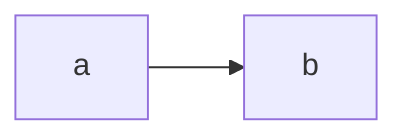

# IPC

Calls between processes.

## Purpose

Moves messages.

## Interface

Status: built · tested: bench:smoke

The `ping` protocol, [its table](../../libs/wire/tables/ping.md):

{{#include ../../libs/wire/tables/ping.md}}

*Figure: a message.*

## Authority

Status: built · tested: host:demo::flows

A handle is the authority.

## Security properties

### R1 (flow)

Status: built · tested: bench:smoke, host:demo::flows

Labels decide flow.

### R1 (flow), across harts

Status: built · partly tested: one hart only · tested: host:demo::slowly

Flow holds on every hart.

### R2 (fair waiting)

Status: planned · M2 (usable shell)

Waiting is fair.

**Open:** how turns are counted.

### R7 (withdrawn)

## Failure and restart

Status: built · tested: bench:smoke

A dead caller's call is abandoned.

## Residual risks

None known.

## Why

Because.
